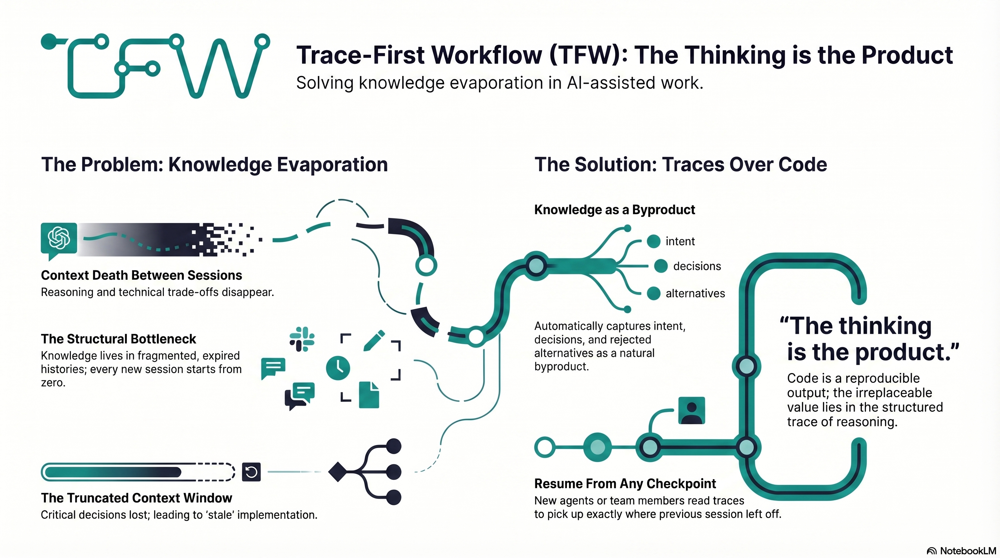

# Trace-First Workflow (TFW)

> *"The thinking is the product. Everything else is output."*

  

---

## The Problem: Knowledge Evaporates

Most work with AI happens in dialogue. You explain the project. You negotiate constraints. You make trade-offs. The AI produces something useful. And then the chat ends.

Tomorrow you open a new session. The context is gone. You re-explain everything from scratch. The model doesn't remember your architecture, your naming conventions, why you chose one technology over another, which algorithm fit the constraints, or the three approaches you already rejected. You start over.

This is not a minor annoyance — it is the fundamental bottleneck of AI-assisted work.

Scale this to a team and the problem becomes structural. Your colleague opens a new session — and the context you built yesterday is invisible. A product manager's strategic decision doesn't reach the developer implementing it. An analyst's finding doesn't reach the team member who needs it. Knowledge lives in people's heads, in Slack threads, in meeting notes that nobody re-reads.

**The symptoms are everywhere:**
- Threads branch and drift. There is no single source of truth.
- You keep answering "what is this project again?" in every new chat.
- Model resets and forced new sessions wipe working memory.
- Context windows silently truncate key decisions.
- Deliverables ship without the "why" — making them hard to maintain or evolve.
- Agents waste tokens re-reading long, unstructured histories.

**The common fixes don't work:**
- **One giant prompt** becomes brittle, expensive, and stale within days.
- **Pinned notes** without a ritual decay into uncurated scrapbooks nobody reads.
- **Chat exports** are linear blobs — impossible to search, impossible to use for onboarding a new agent.

What's needed is not a better tool. It's a better **discipline**.

---

## The Thesis: Traces Over Code

Trace-First Workflow is built on a simple observation:

**The most valuable artifact of any AI session is not the code or the document it produces. It is the trace — the record of intent, decisions, constraints, and rejected alternatives that led to the result.**

Code can be regenerated. A well-structured prompt with the right context will produce the same output again and again. But the *reasoning* behind the prompt — why you asked for this, what you tried before, what constraints you imposed — that is the irreplaceable knowledge that makes future work possible.

TFW inverts the traditional priority:

| Traditional | Trace-First |
|:--|:--|
| Code is the artifact; docs are an afterthought | Traces are the artifact; code is a reproducible output |
| Context lives in the developer's head | Context lives in files that any agent or human can read |
| Onboarding = "read the codebase" | Onboarding = read AGENTS → HL → TS → RF |
| New chat = start from zero | New chat = load traces, resume from last checkpoint |
| Team knowledge lives in Slack threads and meetings | Team knowledge lives in structured traces that any member can read |

Traces are the team's shared memory. When any team member — human or AI — reads the HL, TS, and RF chain, they understand not just what exists, but why it exists, what was considered, and what was rejected.

This is closely related to the **AI-First** philosophy: if AI is going to produce most of the code, then the architecture, the processes, and the knowledge must be organized for the AI, not just for the human developer. The human's job shifts from *writing* code to *managing* the context that the AI needs to produce correct code.

Unlike knowledge tools that require someone to write and maintain documentation, TFW generates knowledge as a byproduct of the methodology itself. The traces left by working *are* the documentation.

TFW is the methodology for that management.

---

## How TFW Works

TFW is a ritual with a predictable structure and one unbreakable rule: **every task produces a trace.**

A task moves through a deterministic lifecycle — Plan → Research → Specify → Onboard → Execute → Deliver → Review → Close. Each stage produces a specific artifact (HL, RES, TS, ONB, RF, REVIEW). The artifacts are files. The files are the project's memory.

When you start a new chat, the new agent reads the Task Board and relevant traces — and knows where the project stands. No re-explanation needed. No context lost. The traces live where the work lives.

The methodology is domain-agnostic. The same ritual works for code, analytics, writing, education, and business processes. It is tool-agnostic — the same `.tfw/` core works in Claude Code, Cursor, Antigravity, or a plain chat window.

The same ritual works whether you're a product manager planning strategy, a data analyst building iterative research, or an engineer implementing architecture. TFW is for teams and individuals who can't afford to lose context.

> For the full reference — artifact types, naming rules, lifecycle statuses, scope budgets — see [conventions.md](conventions.md) and [glossary.md](glossary.md).

---

## Values and Principles

### Traces Over Code

The trace is the product — intent, decisions, constraints, and alternatives matter more than the implementation itself. A codebase without traces is a black box. TFW captures not just *what* was built, but *why*, *what else was considered*, and *what was rejected*.

### Candor Over Flattery

AI agents trained on human feedback develop a habit of agreeing with users and praising their ideas. TFW agents are explicitly instructed: **Don't be sycophantic.** Be direct, precise, concrete. Flag risks. Disagree when evidence supports it. The coordinator's job is to ask uncomfortable questions and catch implicit assumptions — quality of planning matters more than speed of pipeline progression.

### Completeness Over Speed

When asked to implement, provide complete, usable output. **No placeholders.** No `// TODO: implement this`. If you can't produce a complete solution, say what's missing — don't fill the gap with a stub.

### Honesty Over Convincingness

AI agents that sound confident while being wrong are more dangerous than agents that refuse to answer. TFW agents must never fabricate data, claim untested results, or simulate external systems. When context is insufficient, the correct behavior is to ask, not guess. Confidence without correctness is the deadliest failure mode.

### Structural Enforcement

Gates should be structural — file existence, folder structure, required artifacts — not procedural (checkboxes in documents, state tables in headers). If a stage isn't done, the file doesn't exist. No parsing needed, no format compliance required, no update discipline to enforce. The filesystem is the state machine.

### Naming Creates Behavior

Right terminology triggers right associations in AI agents. A small prompt with precise terms is more effective than a long prompt with explanations. TFW adopted OODA, Sufficiency Verdict, Trust Protocol, Progressive Disclosure — each term replaced paragraphs of instructions. If you have to explain what a step does, the step is named wrong.

### Single Source of Truth

`.tfw/` contains exactly one copy of each convention, template, and workflow. Tool adapters reference it, never duplicate. If you need to change a rule, change it in one place.

### Portability

Everything is Markdown. No vendor lock-in. The files work in Obsidian, VS Code, GitHub, or a plain text editor. The knowledge belongs to you, not to a platform.

---

## Anti-patterns

> Full list → [conventions.md §14](conventions.md#14-anti-patterns-prohibited)

These exist because every single one has happened and caused real problems.

---

## Success Criteria

A TFW project is successful when:

1. **Any team member can resume from any checkpoint** — a new person (human or AI) reads the Task Board and relevant traces, and picks up where the previous one left off. No re-explanation needed. No context lost.
2. **Every decision is traceable** — for any choice in the project, you can find the reasoning: what prompted it, what alternatives existed, what was rejected and why.
3. **Knowledge compounds over time** — the project accumulates structured knowledge that makes every next decision better, every onboarding faster, and every context switch lossless.
4. **The output requires no manual editing** — if the result is wrong, you fix the prompt and the context, not the output. The traces are complete enough to produce correct results.

---

## How TFW Compares

TFW occupies a different category from most tools people compare it to.

**Knowledge storage tools (Confluence, Notion, wikis)**
These tools protect existing knowledge — through enforcement (Confluence) or usability (Notion). But someone must write the documentation. Someone must maintain it. And when nobody does, knowledge decays, goes stale, and stops being read.

TFW doesn't store knowledge — it generates it. The traces produced by planning, researching, executing, and reviewing ARE the documentation. Nobody writes it separately. Nobody maintains it separately. The methodology produces it as a byproduct of working.

**AI coding assistants (Cursor, Claude Code, Copilot)**
These tools help you write code faster. TFW helps you preserve the context that makes code maintainable. They're complementary: TFW works inside these tools (via adapters) to add traceability, knowledge capture, and structured decision-making to the AI-assisted workflow.

**No methodology (ad-hoc AI chat)**
Knowledge evaporates between sessions. Decisions don't propagate. New team members start from zero. The project can't explain itself.

TFW exists because none of these alternatives solve the core problem: growing teams lose knowledge when decisions don't propagate.

---

## Version History

For the full evolution of TFW (v1 → v2 → v3) and detailed changelog → [CHANGELOG.md](CHANGELOG.md)

---

## Links

- **Repository:** [github.com/saubakirov/trace-first-starter](https://github.com/saubakirov/trace-first-starter)
- **Author:** [saubakirov.kz](https://saubakirov.kz)
