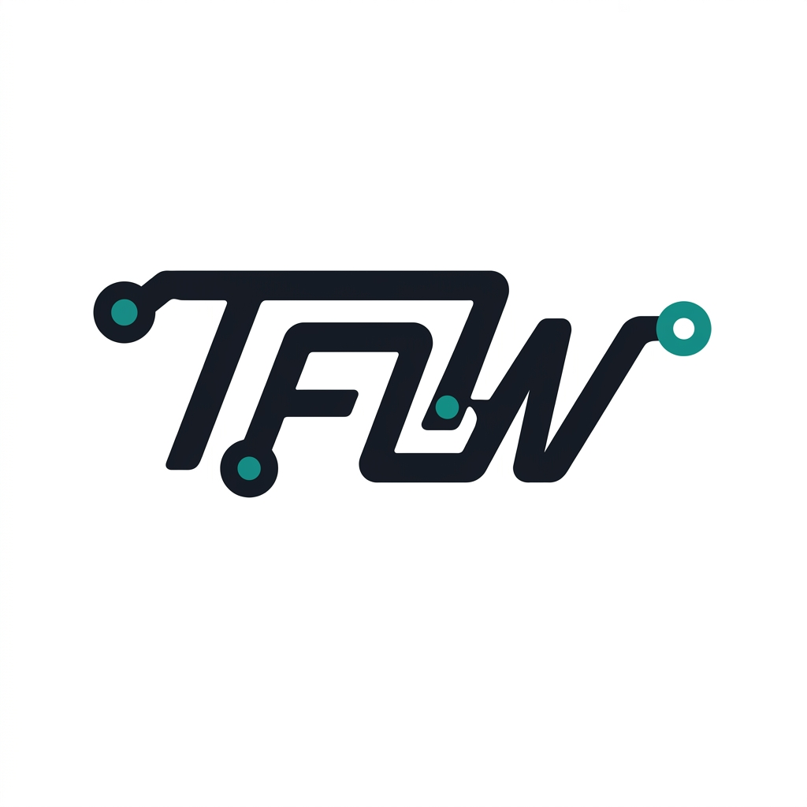
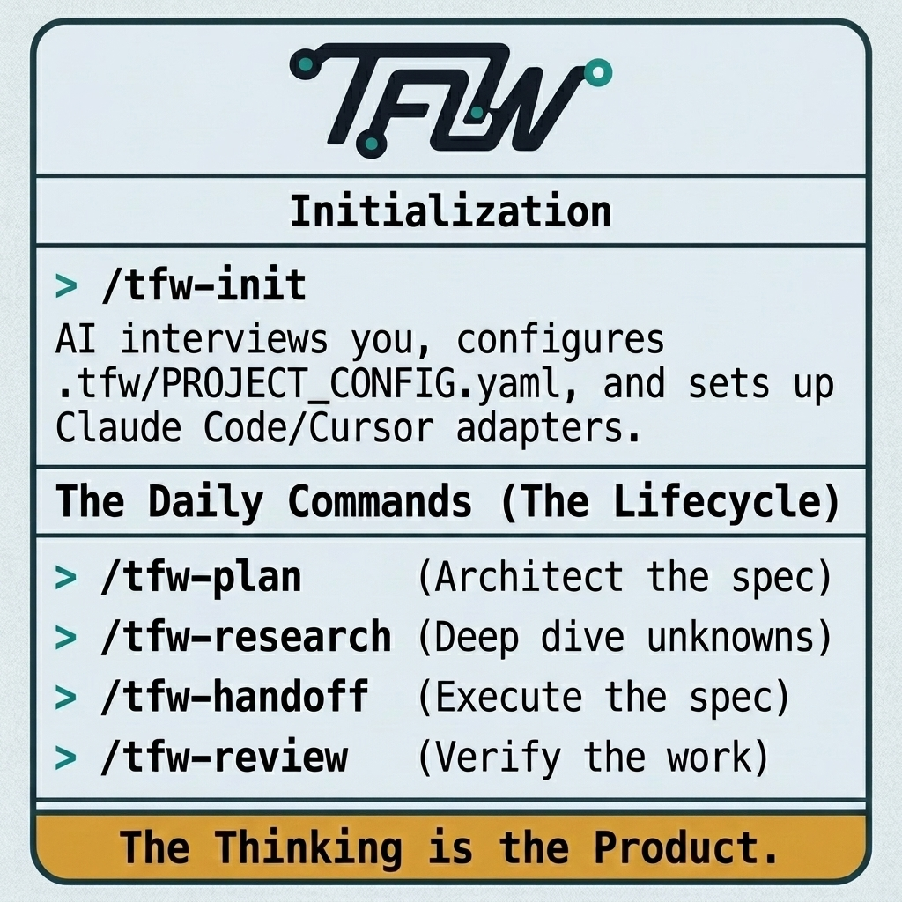

<p align="center">
  
</p>

<h1 align="center">Trace-First Workflow</h1>

<p align="center"><i>"The thinking is the product. Everything else is output."</i></p>

<p align="center">
  <a href="LICENSE"></a>
  <a href=".tfw/VERSION"></a>
</p>

> *Imagine a product that knows more about itself than just its code —*
> *its purpose, its decisions, its rejected alternatives, its technical debt.*

Most products can't explain themselves. The reasoning lives in expired chats, in someone's head, in meetings nobody documented. A new team member or a new AI session starts from zero.

> *Now imagine that every task — code, research, analysis, business process —*
> *automatically captures this knowledge as a byproduct of working.*

That's TFW. A team methodology where traces replace documentation. Every decision is traceable. Any team member — human or AI — reads the traces and resumes from the last checkpoint. Knowledge compounds across tasks instead of evaporating between sessions.

> ***Because knowledge is power.***

For the full philosophy, thesis, and design rationale → [`.tfw/README.md`](.tfw/README.md)

---

## Who TFW Is For

**Teams and individuals who can't afford to lose context.**
TFW works for code, analytics, writing, education, and business processes — the same lifecycle, the same artifacts, the same knowledge compounding.

<table><tr><td>

#### 🎯 Product leaders scaling decisions across teams

*Your decisions don't propagate. Strategy discussed in one session doesn't reach the person implementing it. When team members change, institutional knowledge walks out the door.*

TFW makes **every decision traceable** — who made it, why, what was rejected. Any team member reads the traces and picks up where the previous one left off.

</td></tr><tr><td>

#### 🔬 Analysts and researchers building knowledge iteratively

*Your previous analysis isn't discoverable. Research iterations lose context. Reports don't reference the decisions that drove them.*

TFW preserves **every research iteration** with structured findings, hypotheses tested, and decisions made. Knowledge compounds instead of resetting.

</td></tr><tr><td>

#### ⚙️ Product-minded engineers preserving architecture context

*"Why was this built this way?" Nobody knows. The person who decided left. The chat session expired. The reasoning died with the context window.*

TFW captures **architecture decisions, rejected alternatives, and constraints** alongside the code. A new developer reads the traces, not just the codebase.

</td></tr></table>


---

## Quick Start

> **For humans:** read the [philosophy](.tfw/README.md) — 5 minutes that explain why TFW works.
> Everything else is handled by your AI agent.

### New project — start from scratch

Copy this into your AI agent (Claude Code, Cursor, or any chat):

    I want to start a new project using Trace-First Workflow (TFW) —
    a methodology that preserves decisions, reasoning, and knowledge across AI sessions.
    Clone https://github.com/saubakirov/trace-first-starter to a temp directory,
    then read .tfw/quickstart.md and follow it step by step.
    My project is about: <describe your project in a few sentences>

### Existing project — add TFW

    I want to add Trace-First Workflow (TFW) to this existing project.
    Clone https://github.com/saubakirov/trace-first-starter to a temp directory,
    copy the .tfw/ directory into my project root, then delete the temp clone.
    Then read .tfw/quickstart.md and follow it step by step.
    My project is about: <describe your project>

### Already set up — start working

    Read AGENTS.md for project context.
    This project uses TFW slash commands for all workflows:
    /tfw-plan — create a new task
    /tfw-handoff — execute an approved task
    /tfw-review — review completed work
    /tfw-resume — continue interrupted work
    Start with: /tfw-plan
    Task: <describe what you want to do>

### FAQ

**Do I need to read the documentation?**
No. The `.tfw/` files are designed for AI agents. You only need [the philosophy](.tfw/README.md).

**Which AI tools work with TFW?**
Any tool that can read files. Adapters exist for Claude Code, Cursor, and Antigravity — your agent sets them up during init.

**Can I use TFW for non-code work?**
Yes — analytics, writing, education, business processes. TFW is about structuring decisions, not about code.

**How is TFW different from Confluence/Notion?**
Confluence and Notion are knowledge *storage* tools — they hold what someone decides to write. TFW is a knowledge *generation* methodology — it captures decisions, reasoning, and alternatives as a byproduct of working. You don't document your decisions; your decisions document themselves.

**Is TFW only for software engineering?**
No. TFW is a methodology for structuring decisions and preserving knowledge. The same lifecycle works for product management, data analytics, academic research, content creation, and business operations.

**Where can I learn more visually?**
Try the [interactive FAQ](https://notebooklm.google.com/notebook/0a4cc544-0c0a-4fb0-b7ae-f075625d0980) — ask any question about TFW and get answers grounded in the actual documentation. There are also [onboarding slides](https://notebooklm.google.com/notebook/0a4cc544-0c0a-4fb0-b7ae-f075625d0980?artifactId=e274558e-7d56-45ea-b2e7-efc7f6ccdf46) and a [video overview](https://notebooklm.google.com/notebook/0a4cc544-0c0a-4fb0-b7ae-f075625d0980?artifactId=f800b95b-aefb-4447-a9c9-42adb5455e45) for a quick visual introduction.

---

## How It Works

| | Principle | What it means |
|---|---|---|
| 🧠 | **Self-aware product** | TFW captures intent, decisions, constraints, and rejected alternatives — not just code. The project explains itself |
| 🔄 | **Resume from any checkpoint** | When a chat ends, context doesn't die. The next agent reads the Task Board and picks up exactly where the previous one left off |
| 📈 | **Knowledge compounds** | Unlike Confluence/Notion, TFW captures knowledge as a *byproduct* of work. No manual documentation to maintain |
| 🤖 | **AI agents are team members** | Your AI assistants read the same traces your humans read, follow the same lifecycle, contribute to the same knowledge base |
| 🌐 | **One ritual, any domain** | Code, analytics, writing, education, business processes — same lifecycle, same artifacts |

---

## What's Inside

<p align="center">
  
</p>

### Root Files (your project)

| File | Purpose |
|------|---------|
| `README.md` | Project guide + Task Board |
| `AGENTS.md` | AI agent role and behavior |
| `KNOWLEDGE.md` | Architecture, decisions, legacy index |
| `TECH_DEBT.md` | Tech debt registry |
| `RELEASE.md` | Release strategy and context (optional) |

### .tfw/ (TFW core — tool-agnostic)

| Path | Contents |
|------|----------|
| [`.tfw/README.md`](.tfw/README.md) | Philosophy, thesis, lifecycle, anti-patterns, evolution |
| [`.tfw/conventions.md`](.tfw/conventions.md) | Formal rules, statuses, naming, scope budgets |
| [`.tfw/glossary.md`](.tfw/glossary.md) | Terminology |
| [`.tfw/templates/`](.tfw/templates/) | Canonical templates (HL, TS, RF, ONB, REVIEW) |
| [`.tfw/workflows/`](.tfw/workflows/) | Process workflows (plan, handoff, resume, release, update) |
| [`.tfw/adapters/`](.tfw/adapters/) | Tool adapter templates |
| [`.tfw/quickstart.md`](.tfw/quickstart.md) | Quick start for AI agents |
| [`.tfw/project_config.yaml`](.tfw/project_config.yaml) | Project parameters |
| [`.tfw/VERSION`](.tfw/VERSION) | Current framework version (semver) |
| [`.tfw/CHANGELOG.md`](.tfw/CHANGELOG.md) | Version history |
| [tfw.saubakirov.kz](https://tfw.saubakirov.kz/) | Documentation site (auto-generated from artifacts) |

---

## Tool Adapters



TFW works with any development tool. Templates in `.tfw/adapters/`:

| Tool | Adapter | Project entry point |
|------|---------|---------------------|
| Claude Code | `.tfw/adapters/claude-code/` | `CLAUDE.md` (project root) |
| Cursor | `.tfw/adapters/cursor/` | `.cursor/rules/tfw.mdc` |
| Antigravity | `.tfw/adapters/antigravity/` | `.agent/rules/tfw.md` |
| Plain chat | — | Read `.tfw/README.md` directly |

Setup details in [`.tfw/quickstart.md`](.tfw/quickstart.md).

---

## Key Concepts

```
⬜ TODO → 📝 HL_DRAFT → 🔬 RES → 🟡 TS_DRAFT → 🟠 ONB → 🟢 RF → 🔍 REV → 📚 KNW → ✅ DONE
```

| Concept | Summary | Reference |
|---------|---------|----------|
| Task lifecycle | 9 statuses, RES and KNW optional | [philosophy](.tfw/README.md) |
| Execution modes | CL (Chat Loop, default) / AG (Autonomous) | [philosophy](.tfw/README.md) |
| Scope budgets | Configurable per phase | [project_config.yaml](.tfw/project_config.yaml) |
| Conduct | No sycophancy, no placeholders | [conventions](.tfw/conventions.md) |
| Versioning | Semver in `.tfw/VERSION` | [changelog](.tfw/CHANGELOG.md) |

---

## Updating TFW

TFW uses semantic versioning. Check your installed version in `.tfw/VERSION`.

To update to a new version, ask your AI agent:

> `/tfw-update`

The agent will fetch the latest `.tfw/` from [upstream](https://github.com/saubakirov/trace-first-starter), compare versions, categorize changes (🟢 safe / 🟡 merge / 🔴 breaking), and apply them while preserving your project customizations.

Full process → [`.tfw/workflows/update.md`](.tfw/workflows/update.md) · Version history → [CHANGELOG](.tfw/CHANGELOG.md)

---

## Links

| | |
|---|---|
| 🤖 Interactive FAQ | [NotebookLM](https://notebooklm.google.com/notebook/0a4cc544-0c0a-4fb0-b7ae-f075625d0980) — ask questions about TFW |
| 🎓 Onboarding Slides | [NotebookLM](https://notebooklm.google.com/notebook/0a4cc544-0c0a-4fb0-b7ae-f075625d0980?artifactId=e274558e-7d56-45ea-b2e7-efc7f6ccdf46) |
| 🎬 Video Overview | [NotebookLM](https://notebooklm.google.com/notebook/0a4cc544-0c0a-4fb0-b7ae-f075625d0980?artifactId=f800b95b-aefb-4447-a9c9-42adb5455e45) |
| 📖 Getting Started | [`.tfw/quickstart.md`](.tfw/quickstart.md) |
| 💡 Philosophy | [`.tfw/README.md`](.tfw/README.md) |
| 🌐 Docs site | [tfw.saubakirov.kz](https://tfw.saubakirov.kz) |
| 🔗 Repository | [github.com/saubakirov/trace-first-starter](https://github.com/saubakirov/trace-first-starter) |
| 👤 Author | [saubakirov.kz](https://saubakirov.kz) |
| ⚖️ License | [MIT](LICENSE) |

---

## Task Board

| ID | Task | Status | HL | TS | ONB | RF | REV |
|----|------|--------|----|----| --- |----| --- |
| [TFW-1](tasks/TFW-1__formalize_success_criteria/) | Formalize success criteria | ✅ DONE | — | ✅ | — | ✅ | — |
| [TFW-2](tasks/TFW-2__upgrade_to_v3/) | Upgrade to TFW v3 | ✅ DONE | — | ✅ | — | ✅ | — |
| [TFW-3](tasks/TFW-3__readme_public_readiness/) | Root README public-readiness | 🟢 RF | ✅ | ✅ | — | ✅ | |
| [TFW-4](tasks/TFW-4__framework_cleanup/) | Framework cleanup | 🟡 TS | ✅ | ✅ | | | |
| [TFW-5](tasks/TFW-5__knowledge_and_tfw_docs/) | KNOWLEDGE.md + tfw-docs workflow | ✅ DONE | ✅ | ✅ | — | ✅ | ✅ |
| [TFW-6](tasks/TFW-6__versioning_and_update/) | Versioning, changelog, tfw-update workflow | ✅ DONE | ✅ | ✅ | [A](tasks/TFW-6__versioning_and_update/ONB__PhaseA__versioning_infra.md) [B](tasks/TFW-6__versioning_and_update/ONB__PhaseB__workflows.md) [C](tasks/TFW-6__versioning_and_update/ONB__PhaseC__documentation.md) | [A](tasks/TFW-6__versioning_and_update/RF__PhaseA__versioning_infra.md) [B](tasks/TFW-6__versioning_and_update/RF__PhaseB__workflows.md) [C](tasks/TFW-6__versioning_and_update/RF__PhaseC__documentation.md) | [A](tasks/TFW-6__versioning_and_update/REVIEW__PhaseA__versioning_infra.md) [B](tasks/TFW-6__versioning_and_update/REVIEW__PhaseB__workflows.md) [C](tasks/TFW-6__versioning_and_update/REVIEW__PhaseC__documentation.md) |
| [TFW-7](tasks/TFW-7__resolve_tech_debt/) | Resolve all open tech debt | ✅ DONE | ✅ | ✅ | [✅](tasks/TFW-7__resolve_tech_debt/ONB__TFW-7__resolve_tech_debt.md) | [✅](tasks/TFW-7__resolve_tech_debt/RF__TFW-7__resolve_tech_debt.md) | [✅](tasks/TFW-7__resolve_tech_debt/REVIEW__TFW-7__resolve_tech_debt.md) |
| [TFW-8](tasks/TFW-8__reviewer_role_and_workflow/) | Reviewer role + /tfw-review workflow | ✅ DONE | [✅](tasks/TFW-8__reviewer_role_and_workflow/HL-TFW-8__reviewer_role_and_workflow.md) | [✅](tasks/TFW-8__reviewer_role_and_workflow/TS__TFW-8__reviewer_role_and_workflow.md) | [✅](tasks/TFW-8__reviewer_role_and_workflow/ONB__TFW-8__reviewer_role_and_workflow.md) | [A](tasks/TFW-8__reviewer_role_and_workflow/RF__PhaseA__core_extraction.md) [B](tasks/TFW-8__reviewer_role_and_workflow/RF__PhaseB__documentation_sync.md) | [A](tasks/TFW-8__reviewer_role_and_workflow/REVIEW__PhaseA__core_extraction.md) [B](tasks/TFW-8__reviewer_role_and_workflow/REVIEW__PhaseB__documentation_sync.md) |
| [TFW-9](tasks/TFW-9__update_source_mechanism/) | Update source mechanism for tfw-update | ✅ DONE | [✅](tasks/TFW-9__update_source_mechanism/HL-TFW-9__update_source_mechanism.md) | [✅](tasks/TFW-9__update_source_mechanism/TS__TFW-9__update_source_mechanism.md) | [✅](tasks/TFW-9__update_source_mechanism/ONB__TFW-9__update_source_mechanism.md) | [✅](tasks/TFW-9__update_source_mechanism/RF__TFW-9__update_source_mechanism.md) | [✅](tasks/TFW-9__update_source_mechanism/REVIEW__TFW-9__update_source_mechanism.md) |
| [TFW-10](tasks/TFW-10__version_string_sweep/) | Replace stale "TFW v3" labels with semver | ✅ DONE | [✅](tasks/TFW-10__version_string_sweep/HL-TFW-10__version_string_sweep.md) | [✅](tasks/TFW-10__version_string_sweep/TS__TFW-10__version_string_sweep.md) | [✅](tasks/TFW-10__version_string_sweep/ONB__TFW-10__version_string_sweep.md) | [✅](tasks/TFW-10__version_string_sweep/RF__TFW-10__version_string_sweep.md) | [✅](tasks/TFW-10__version_string_sweep/REVIEW__TFW-10__version_string_sweep.md) |
| [TFW-11](tasks/TFW-11__research_stage/) | RESEARCH stage in pipeline | ✅ DONE | ✅ | ✅ | ✅ | [A](tasks/TFW-11__research_stage/RF__PhaseA__core_artifact_workflow.md) [B](tasks/TFW-11__research_stage/RF__PhaseB__integration_desyncs.md) [C](tasks/TFW-11__research_stage/RF__PhaseC__adapter_sync_version.md) | [A](tasks/TFW-11__research_stage/REVIEW__PhaseA__core_artifact_workflow.md) [B](tasks/TFW-11__research_stage/REVIEW__PhaseB__integration_desyncs.md) [C](tasks/TFW-11__research_stage/REVIEW__PhaseC__adapter_sync_version.md) |
| [TFW-12](tasks/TFW-12__scope_budget_centralization/) | Centralize config params in PROJECT_CONFIG | ✅ DONE | ✅ | ✅ | ✅ | [✅](tasks/TFW-12__scope_budget_centralization/RF__TFW-12__config_centralization.md) | [✅](tasks/TFW-12__scope_budget_centralization/REVIEW__TFW-12__config_centralization.md) |
| [TFW-13](tasks/TFW-13__tfw_init_workflow/) | tfw-init workflow (replace init.md) | ✅ DONE | ✅ | [A](tasks/TFW-13__tfw_init_workflow/TS__PhaseA__workflow_and_command.md) [B](tasks/TFW-13__tfw_init_workflow/TS__PhaseB__docs_and_cleanup.md) | [A](tasks/TFW-13__tfw_init_workflow/ONB__PhaseA__workflow_and_command.md) [B](tasks/TFW-13__tfw_init_workflow/ONB__PhaseB__docs_and_cleanup.md) | [A](tasks/TFW-13__tfw_init_workflow/RF__PhaseA__workflow_and_command.md) [B](tasks/TFW-13__tfw_init_workflow/RF__PhaseB__docs_and_cleanup.md) | [A](tasks/TFW-13__tfw_init_workflow/REVIEW__PhaseA__workflow_and_command.md) [B](tasks/TFW-13__tfw_init_workflow/REVIEW__PhaseB__docs_and_cleanup.md) |
| [TFW-14](tasks/TFW-14__research_interaction_model/) | Research interaction model (briefing + handoff) | ✅ DONE | [✅](tasks/TFW-14__research_interaction_model/HL-TFW-14__research_interaction_model.md) | [✅](tasks/TFW-14__research_interaction_model/RES__TFW-14__research_interaction_model.md) | [✅](tasks/TFW-14__research_interaction_model/TS__TFW-14__research_interaction_model.md) | [✅](tasks/TFW-14__research_interaction_model/RF__TFW-14__research_interaction_model.md) | [✅](tasks/TFW-14__research_interaction_model/REVIEW__TFW-14__research_interaction_model.md) |
| [TFW-15](tasks/TFW-15__pipeline_status_rename/) | Pipeline rename: separate statuses from documents (HL_DRAFT → RES → TS_DRAFT) | ✅ DONE | [✅](tasks/TFW-15__pipeline_status_rename/HL-TFW-15__pipeline_status_rename.md) | [✅](tasks/TFW-15__pipeline_status_rename/RES__TFW-15__pipeline_status_rename.md) | [✅](tasks/TFW-15__pipeline_status_rename/TS__TFW-15__pipeline_formalization.md) | [✅](tasks/TFW-15__pipeline_status_rename/RF__TFW-15__pipeline_formalization.md) | [✅](tasks/TFW-15__pipeline_status_rename/REVIEW__TFW-15__pipeline_formalization.md) |
| TFW-16 | tfw-doctor: self-diagnosis of TFW meta-state — verify knowledge_state.yaml matches project, detect stale refs after update, analyze user behavior, find missed workflows, knowledge gaps | ⬜ TODO | | | | | |
| [TFW-17](tasks/TFW-17__research_depth_and_coordinator_quality/) | Research depth + coordinator quality (skip-bias, external tools, rush-bias) | ✅ DONE | [✅](tasks/TFW-17__research_depth_and_coordinator_quality/HL-TFW-17__research_depth_and_coordinator_quality.md) | [✅](tasks/TFW-17__research_depth_and_coordinator_quality/TS__TFW-17__research_depth_and_coordinator_quality.md) | [✅](tasks/TFW-17__research_depth_and_coordinator_quality/ONB__TFW-17__research_depth_and_coordinator_quality.md) | [✅](tasks/TFW-17__research_depth_and_coordinator_quality/RF__TFW-17__research_depth_and_coordinator_quality.md) | [✅](tasks/TFW-17__research_depth_and_coordinator_quality/REVIEW__TFW-17__research_depth_and_coordinator_quality.md) |
| [TFW-18](tasks/TFW-18__knowledge_consolidation/) | Knowledge consolidation: fact candidates, dream-like docs, mandatory gate | ✅ DONE | [✅](tasks/TFW-18__knowledge_consolidation/HL-TFW-18__knowledge_consolidation.md) [✅](tasks/TFW-18__knowledge_consolidation/HL__PhaseB__knowledge_quality.md) | [✅](tasks/TFW-18__knowledge_consolidation/RES__TFW-18__knowledge_consolidation.md) | [✅](tasks/TFW-18__knowledge_consolidation/TS__TFW-18__knowledge_consolidation.md) [✅](tasks/TFW-18__knowledge_consolidation/TS__PhaseB__knowledge_quality.md) | [✅](tasks/TFW-18__knowledge_consolidation/ONB__TFW-18__knowledge_consolidation.md) [✅](tasks/TFW-18__knowledge_consolidation/ONB__PhaseB__knowledge_quality.md) | [✅](tasks/TFW-18__knowledge_consolidation/REVIEW__TFW-18__knowledge_consolidation.md) [✅](tasks/TFW-18__knowledge_consolidation/REVIEW__PhaseB__knowledge_quality.md) |
| [TFW-19](tasks/TFW-19__config_propagation/) | tfw-config: propagate PROJECT_CONFIG.yaml changes to workflows/adapters automatically | ✅ DONE | [✅](tasks/TFW-19__config_propagation/HL-TFW-19__config_propagation.md) | [✅](tasks/TFW-19__config_propagation/RES__TFW-19__config_propagation.md) | [✅](tasks/TFW-19__config_propagation/TS__TFW-19__config_propagation.md) | [✅](tasks/TFW-19__config_propagation/ONB__TFW-19__config_propagation.md) | [✅](tasks/TFW-19__config_propagation/REVIEW__TFW-19__config_propagation.md) |
| TFW-20 | tfw-user-tune: personal preferences pipeline (.user_preferences.md lifecycle, gitignored, user-specific) | ⬜ TODO | | | | | |
| [TFW-21](tasks/TFW-21__research_workflow_compression/) | Compress research.md: 2397→1145 words (-52%), deduplicate, remove inline templates | ✅ DONE | [✅](tasks/TFW-21__research_workflow_compression/HL-TFW-21__research_workflow_compression.md) | [✅](tasks/TFW-21__research_workflow_compression/RES__TFW-21__research_workflow_compression.md) | [✅](tasks/TFW-21__research_workflow_compression/TS__TFW-21__research_workflow_compression.md) | [✅](tasks/TFW-21__research_workflow_compression/RF__TFW-21__research_workflow_compression.md) | [✅](tasks/TFW-21__research_workflow_compression/REVIEW__TFW-21__research_workflow_compression.md) |
| [TFW-22](tasks/TFW-22__coordinator_research_enrichment/) | Coordinator & Research enrichment: result visualization in HL, research justification, structured thinking algorithms | ✅ DONE | [✅](tasks/TFW-22__coordinator_research_enrichment/HL-TFW-22__coordinator_research_enrichment.md) | [✅](tasks/TFW-22__coordinator_research_enrichment/RES__TFW-22__coordinator_research_enrichment.md) | [✅](tasks/TFW-22__coordinator_research_enrichment/TS__TFW-22__coordinator_research_enrichment.md) | [✅](tasks/TFW-22__coordinator_research_enrichment/ONB__TFW-22__coordinator_research_enrichment.md) | [✅](tasks/TFW-22__coordinator_research_enrichment/REVIEW__TFW-22__coordinator_research_enrichment.md) |
| [TFW-23](tasks/TFW-23__templates_english_standardization/) | Templates English standardization: eliminate mixed RU/EN, pure English templates + content_language config | ✅ DONE | [✅](tasks/TFW-23__templates_english_standardization/HL-TFW-23__templates_english_standardization.md) | [✅](tasks/TFW-23__templates_english_standardization/RES__TFW-23__templates_english_standardization.md) | [✅](tasks/TFW-23__templates_english_standardization/TS__TFW-23__templates_english_standardization.md) | [✅](tasks/TFW-23__templates_english_standardization/ONB__TFW-23__templates_english_standardization.md) | [✅](tasks/TFW-23__templates_english_standardization/REVIEW__TFW-23__templates_english_standardization.md) |
| [TFW-24](tasks/TFW-24__res_state_machine/) | RES State Machine: Researcher role, subfolder state machine, resume protocol, HL Vision/Impact, Working Backwards | ✅ DONE | [✅](tasks/TFW-24__res_state_machine/HL-TFW-24__res_state_machine.md) | [✅](tasks/TFW-24__res_state_machine/RES__TFW-24__res_state_machine.md) | [A](tasks/TFW-24__res_state_machine/TS__TFW-24__res_state_machine.md) [B](tasks/TFW-24__res_state_machine/TS__PhaseB__research_templates.md) | [A](tasks/TFW-24__res_state_machine/ONB__TFW-24__res_state_machine.md) [B](tasks/TFW-24__res_state_machine/ONB__PhaseB__research_templates.md) | [A](tasks/TFW-24__res_state_machine/RF__TFW-24__res_state_machine.md) [B](tasks/TFW-24__res_state_machine/RF__PhaseB__research_templates.md) | [A](tasks/TFW-24__res_state_machine/REVIEW__TFW-24__res_state_machine.md) [B](tasks/TFW-24__res_state_machine/REVIEW__PhaseB__research_templates.md) |
| [TFW-25](tasks/TFW-25__values_consolidation/) | Values & Principles consolidation: enrich README Values, prune KNOWLEDGE.md, clean knowledge/ facts | ✅ DONE | [✅](tasks/TFW-25__values_consolidation/HL-TFW-25__values_consolidation.md) | [✅](tasks/TFW-25__values_consolidation/RES__TFW-25__values_consolidation.md) | [✅](tasks/TFW-25__values_consolidation/TS__TFW-25__values_consolidation.md) | [✅](tasks/TFW-25__values_consolidation/ONB__TFW-25__values_consolidation.md) | [✅](tasks/TFW-25__values_consolidation/RF__TFW-25__values_consolidation.md) | [✅](tasks/TFW-25__values_consolidation/REVIEW__TFW-25__values_consolidation.md) |
| [TFW-26](tasks/TFW-26__documentation_site/) | Documentation as Output: compilable contract, MkDocs gen-files, docs site from TFW artifacts | ✅ DONE | [✅](tasks/TFW-26__documentation_site/HL-TFW-26__documentation_site.md) | [✅](tasks/TFW-26__documentation_site/RES__TFW-26__documentation_site.md) | [FC](tasks/TFW-26__documentation_site/coordinator_fact_capture/TS__TFW-26__coordinator_fact_capture.md) [A](tasks/TFW-26__documentation_site/PhaseA/TS__PhaseA__compilable_contract.md) [B](tasks/TFW-26__documentation_site/PhaseB/TS__PhaseB__gen_docs_implementation.md) | [FC](tasks/TFW-26__documentation_site/coordinator_fact_capture/ONB__TFW-26__coordinator_fact_capture.md) [A](tasks/TFW-26__documentation_site/PhaseA/ONB__PhaseA__compilable_contract.md) [B](tasks/TFW-26__documentation_site/PhaseB/ONB__PhaseB__gen_docs_implementation.md) | [FC](tasks/TFW-26__documentation_site/coordinator_fact_capture/RF__TFW-26__coordinator_fact_capture.md) [A](tasks/TFW-26__documentation_site/PhaseA/RF__PhaseA__compilable_contract.md) [B](tasks/TFW-26__documentation_site/PhaseB/RF__PhaseB__gen_docs_implementation.md) | [FC](tasks/TFW-26__documentation_site/coordinator_fact_capture/REVIEW__TFW-26__coordinator_fact_capture.md) [A](tasks/TFW-26__documentation_site/PhaseA/REVIEW__PhaseA__compilable_contract.md) [B](tasks/TFW-26__documentation_site/PhaseB/REVIEW__PhaseB__gen_docs_implementation.md) |
| [TFW-27](tasks/TFW-27__wiki_polish_and_brand/) | Wiki polish & brand: logo, brand identity, link resolution, landing page, deploy to GitHub Pages | ✅ DONE | [✅](tasks/TFW-27__wiki_polish_and_brand/HL-TFW-27__wiki_polish_and_brand.md) | [A✅](tasks/TFW-27__wiki_polish_and_brand/PhaseA/TS__PhaseA__brand_identity.md) [B✅](tasks/TFW-27__wiki_polish_and_brand/PhaseB/TS__PhaseB__link_resolution.md) [C✅](tasks/TFW-27__wiki_polish_and_brand/PhaseC/TS__PhaseC__deploy.md) | [A✅](tasks/TFW-27__wiki_polish_and_brand/PhaseA/ONB__PhaseA__brand_identity.md) [B✅](tasks/TFW-27__wiki_polish_and_brand/PhaseB/ONB__PhaseB__link_resolution.md) [C✅](tasks/TFW-27__wiki_polish_and_brand/PhaseC/ONB__PhaseC__deploy.md) | [A✅](tasks/TFW-27__wiki_polish_and_brand/PhaseA/RF__PhaseA__brand_identity.md) [B✅](tasks/TFW-27__wiki_polish_and_brand/PhaseB/RF__PhaseB__link_resolution.md) [C✅](tasks/TFW-27__wiki_polish_and_brand/PhaseC/RF__PhaseC__deploy.md) | [A✅](tasks/TFW-27__wiki_polish_and_brand/PhaseA/REVIEW__PhaseA__brand_identity.md) [B✅](tasks/TFW-27__wiki_polish_and_brand/PhaseB/REVIEW__PhaseB__link_resolution.md) [C✅](tasks/TFW-27__wiki_polish_and_brand/PhaseC/REVIEW__PhaseC__deploy.md) |
| ~~TFW-28~~ | ~~Deploy docs~~ — absorbed into TFW-27/C | — | | | | | |
| [TFW-29](tasks/TFW-29__consistency_audit/) | Consistency audit: glossary, conventions, workflows — redundancy, compression, reading flows | ✅ DONE | [✅](tasks/TFW-29__consistency_audit/HL-TFW-29__consistency_audit.md) | [✅](tasks/TFW-29__consistency_audit/RES__TFW-29__consistency_audit.md) | [✅](tasks/TFW-29__consistency_audit/TS__TFW-29__consistency_audit.md) | [✅](tasks/TFW-29__consistency_audit/ONB__TFW-29__consistency_audit.md) | [✅](tasks/TFW-29__consistency_audit/RF__TFW-29__consistency_audit.md) | [✅](tasks/TFW-29__consistency_audit/REVIEW__TFW-29__consistency_audit.md) |
| [TFW-30](tasks/TFW-30__antigravity_adapter_audit/) | Antigravity adapter audit: thin adapters, Skills, Planning Mode strategy | 📝 HL_DRAFT | [📝](tasks/TFW-30__antigravity_adapter_audit/HL-TFW-30__antigravity_adapter_audit.md) | | | | |
| [TFW-31](tasks/TFW-31__quick_start_agent_first/) | Quick Start agent-first rewrite: quickstart.md, starter prompts, init.md domain-agnostic | ✅ DONE | [✅](tasks/TFW-31__quick_start_agent_first/HL-TFW-31__quick_start_agent_first.md) | [✅](tasks/TFW-31__quick_start_agent_first/TS__TFW-31__quick_start_agent_first.md) | [✅](tasks/TFW-31__quick_start_agent_first/ONB__TFW-31__quick_start_agent_first.md) | [✅](tasks/TFW-31__quick_start_agent_first/RF__TFW-31__quick_start_agent_first.md) | [✅](tasks/TFW-31__quick_start_agent_first/REVIEW__TFW-31__quick_start_agent_first.md) |
| [TFW-32](tasks/TFW-32__methodology_and_positioning/) | Methodology refinement & product positioning: docs/knowledge fix, KNW status, terminology, multi-iter research, audience personas | ✅ DONE | [✅](tasks/TFW-32__methodology_and_positioning/HL-TFW-32__methodology_and_positioning.md) | [A](tasks/TFW-32__methodology_and_positioning/PhaseA/TS__PhaseA__methodology_pipeline.md) [B](tasks/TFW-32__methodology_and_positioning/PhaseB/TS__PhaseB__naming_and_templates.md) [C](tasks/TFW-32__methodology_and_positioning/PhaseC/TS__PhaseC__multi_iteration_research.md) [D](tasks/TFW-32__methodology_and_positioning/PhaseD/TS__PhaseD__positioning_and_messaging.md) | [A](tasks/TFW-32__methodology_and_positioning/PhaseA/ONB__PhaseA__methodology_pipeline.md) [B](tasks/TFW-32__methodology_and_positioning/PhaseB/ONB__PhaseB__naming_and_templates.md) [C](tasks/TFW-32__methodology_and_positioning/PhaseC/ONB__PhaseC__multi_iteration_research.md) [D](tasks/TFW-32__methodology_and_positioning/PhaseD/ONB__PhaseD__positioning_and_messaging.md) | [A](tasks/TFW-32__methodology_and_positioning/PhaseA/RF__PhaseA__methodology_pipeline.md) [B](tasks/TFW-32__methodology_and_positioning/PhaseB/RF__PhaseB__naming_and_templates.md) [C](tasks/TFW-32__methodology_and_positioning/PhaseC/RF__PhaseC__multi_iteration_research.md) [D](tasks/TFW-32__methodology_and_positioning/PhaseD/RF__PhaseD__positioning_and_messaging.md) | [A](tasks/TFW-32__methodology_and_positioning/PhaseA/REVIEW__PhaseA__methodology_pipeline.md) [B](tasks/TFW-32__methodology_and_positioning/PhaseB/REVIEW__PhaseB__naming_and_templates.md) [C](tasks/TFW-32__methodology_and_positioning/PhaseC/REVIEW__PhaseC__multi_iteration_research.md) [D](tasks/TFW-32__methodology_and_positioning/PhaseD/REVIEW__PhaseD__positioning_and_messaging.md) |
| TFW-33 | Thinking traces as first-class TFW artifacts (capture AI `<think>` blocks as project knowledge) | ⬜ TODO | | | | | |
| TFW-34 | Knowledge pipeline automation: plugin-based fact capture, handoff manifest (task_state.yaml) | ⬜ TODO | | | | | |
| TFW-35 | Analytical review template: lighter checklist for non-code phases (positioning, specs, documentation) | ⬜ TODO | | | | | |
| [TFW-36](tasks/TFW-36__content_marketing_blog_series/) | Content marketing blog series: 7 Medium posts targeting different audiences via SEO, problem-first with real cases | 📚 KNW (A) | [📝](tasks/TFW-36__content_marketing_blog_series/HL-TFW-36__content_marketing_blog_series.md) | [🔬](tasks/TFW-36__content_marketing_blog_series/RES__TFW-36__content_marketing_blog_series.md) | [🟡](tasks/TFW-36__content_marketing_blog_series/PhaseA/TS__PhaseA__content_strategy_and_post3.md) | [🟠](tasks/TFW-36__content_marketing_blog_series/PhaseA/ONB__PhaseA__content_strategy_and_post3.md) | [🔍](tasks/TFW-36__content_marketing_blog_series/PhaseA/REVIEW__PhaseA__content_strategy_and_post3.md) |
| ~~TFW-37~~ | ~~Source Audit gate~~ — absorbed into TFW-38 (4-stage review + Trust Protocol + docs mode source verification) | — | | | | | |
| [TFW-38](tasks/TFW-38__quality_enforcement/) | Quality enforcement: staged review (Map→Verify→Judge→Decide), handoff §6-8 mandate, knowledge citation table | ✅ DONE | [✅](tasks/TFW-38__quality_enforcement/HL-TFW-38__quality_enforcement.md) | [✅](tasks/TFW-38__quality_enforcement/RES__TFW-38__quality_enforcement.md) | [A✅](tasks/TFW-38__quality_enforcement/PhaseA/TS__PhaseA__review_restructure.md) [A.2✅](tasks/TFW-38__quality_enforcement/PhaseA/TS__PhaseA2__review_stage_files.md) [B✅](tasks/TFW-38__quality_enforcement/PhaseB/TS__PhaseB__knowledge_citation_table.md) | [A🟠](tasks/TFW-38__quality_enforcement/PhaseA/ONB__PhaseA__review_restructure.md) [A.2🟠](tasks/TFW-38__quality_enforcement/PhaseA/ONB__PhaseA2__review_stage_files.md) [B🟠](tasks/TFW-38__quality_enforcement/PhaseB/ONB__PhaseB__knowledge_citation_table.md) | [A🟢](tasks/TFW-38__quality_enforcement/PhaseA/RF__PhaseA__review_restructure.md) [A.2🟢](tasks/TFW-38__quality_enforcement/PhaseA/RF__PhaseA2__review_stage_files.md) [B🟢](tasks/TFW-38__quality_enforcement/PhaseB/RF__PhaseB__knowledge_citation_table.md) | [A✅](tasks/TFW-38__quality_enforcement/PhaseA/REVIEW__PhaseA__review_restructure.md) [A.2✅](tasks/TFW-38__quality_enforcement/PhaseA/REVIEW__PhaseA2__review_stage_files.md) [B✅](tasks/TFW-38__quality_enforcement/PhaseB/REVIEW__PhaseB__knowledge_citation_table.md) |
| TFW-39 | Visual Knowledge System: process/architecture diagram registry with naming convention, mandatory creation criteria, staleness tracking, domain index. Born from TFW-38 Phase B redesign | ⬜ TODO | | | | | |
| [TFW-40](tasks/TFW-40__state_separation/) | State/framework separation: knowledge_state.yaml contamination fix, project_config template, naming normalization | ✅ DONE | [✅](tasks/TFW-40__state_separation/HL-TFW-40__state_separation.md) | | [A](tasks/TFW-40__state_separation/TS__PhaseA__state_separation.md) [B](tasks/TFW-40__state_separation/TS__PhaseB__naming_normalization.md) | [A](tasks/TFW-40__state_separation/ONB__PhaseA__state_separation.md) [B](tasks/TFW-40__state_separation/ONB__PhaseB__naming_normalization.md) | [A](tasks/TFW-40__state_separation/RF__PhaseA__state_separation.md) [B](tasks/TFW-40__state_separation/RF__PhaseB__naming_normalization.md) | [A](tasks/TFW-40__state_separation/REVIEW__PhaseA__state_separation.md) [B](tasks/TFW-40__state_separation/REVIEW__PhaseB__naming_normalization.md) |
| [TFW-41](tasks/TFW-41__execution_quality_gates/) | Execution quality gates: Requirements-first TS, Execution Loops, Pre-TS/Pre-RF gates, principles enforcement, embedded dimensional analysis | ✅ DONE | [✅](tasks/TFW-41__execution_quality_gates/HL-TFW-41__execution_quality_gates.md) | [1](tasks/TFW-41__execution_quality_gates/RES__TFW-41__execution_quality_gates.md) [2](tasks/TFW-41__execution_quality_gates/RES__iter2__execution_quality_gates.md) | [A🟡](tasks/TFW-41__execution_quality_gates/PhaseA/TS__PhaseA__templates_and_conventions.md) [B🟡](tasks/TFW-41__execution_quality_gates/PhaseB/TS__PhaseB__workflow_gates.md) [C🟡](tasks/TFW-41__execution_quality_gates/PhaseC/TS__PhaseC__research_templates.md) [D🟡](tasks/TFW-41__execution_quality_gates/PhaseD/TS__PhaseD__glossary_and_adapters.md) | [A🟠](tasks/TFW-41__execution_quality_gates/PhaseA/ONB__PhaseA__templates_and_conventions.md) [B🟠](tasks/TFW-41__execution_quality_gates/PhaseB/ONB__PhaseB__workflow_gates.md) [C🟠](tasks/TFW-41__execution_quality_gates/PhaseC/ONB__PhaseC__research_templates.md) [D🟠](tasks/TFW-41__execution_quality_gates/PhaseD/ONB__PhaseD__glossary_and_adapters.md) | [A🟢](tasks/TFW-41__execution_quality_gates/PhaseA/RF__PhaseA__templates_and_conventions.md) [B🟢](tasks/TFW-41__execution_quality_gates/PhaseB/RF__PhaseB__workflow_gates.md) [C🟢](tasks/TFW-41__execution_quality_gates/PhaseC/RF__PhaseC__research_templates.md) [D🟢](tasks/TFW-41__execution_quality_gates/PhaseD/RF__PhaseD__glossary_and_adapters.md) | [A✅](tasks/TFW-41__execution_quality_gates/PhaseA/REVIEW__PhaseA__templates_and_conventions.md) [B✅](tasks/TFW-41__execution_quality_gates/PhaseB/REVIEW__PhaseB__workflow_gates.md) [C✅](tasks/TFW-41__execution_quality_gates/PhaseC/REVIEW__PhaseC__research_templates.md) [D✅](tasks/TFW-41__execution_quality_gates/PhaseD/REVIEW__PhaseD__glossary_and_adapters.md) |
| [TFW-42](tasks/TFW-42__research_cycle_restructure/) | Research cycle restructure: unified research/ container, numbered stages, kebab-case phases, iterations.yaml enrichment, multi-agent support | ✅ DONE | [✅](tasks/TFW-42__research_cycle_restructure/HL-TFW-42__research_cycle_restructure.md) | [1](tasks/TFW-42__research_cycle_restructure/research/RES__TFW-42__research_cycle_restructure.md) [2](tasks/TFW-42__research_cycle_restructure/research2/RES__iter2__agent_guidance.md) | [A🟡](tasks/TFW-42__research_cycle_restructure/phase-a/TS__phase-a__conventions_and_templates.md) [B🟡](tasks/TFW-42__research_cycle_restructure/phase-b/TS__phase-b__workflow_updates.md) [C🟡](tasks/TFW-42__research_cycle_restructure/phase-c/TS__phase-c__glossary_and_adapters.md) | [A🟠](tasks/TFW-42__research_cycle_restructure/phase-a/ONB__phase-a__conventions_and_templates.md) [B🟠](tasks/TFW-42__research_cycle_restructure/phase-b/ONB__phase-b__workflow_updates.md) [C🟠](tasks/TFW-42__research_cycle_restructure/phase-c/ONB__phase-c__glossary_and_adapters.md) | [A🟢](tasks/TFW-42__research_cycle_restructure/phase-a/RF__phase-a__conventions_and_templates.md) [B🟢](tasks/TFW-42__research_cycle_restructure/phase-b/RF__phase-b__workflow_updates.md) [C🟢](tasks/TFW-42__research_cycle_restructure/phase-c/RF__phase-c__glossary_and_adapters.md) | [A✅](tasks/TFW-42__research_cycle_restructure/phase-a/REVIEW__phase-a__conventions_and_templates.md) [B✅](tasks/TFW-42__research_cycle_restructure/phase-b/REVIEW__phase-b__workflow_updates.md) [C✅](tasks/TFW-42__research_cycle_restructure/phase-c/REVIEW__phase-c__glossary_and_adapters.md) |

> Statuses: ⬜ TODO → 📝 HL_DRAFT → 🔬 RES → 🟡 TS_DRAFT → 🟠 ONB → 🟢 RF → 🔍 REV → 📚 KNW → ✅ DONE | ❌ BLOCKED

