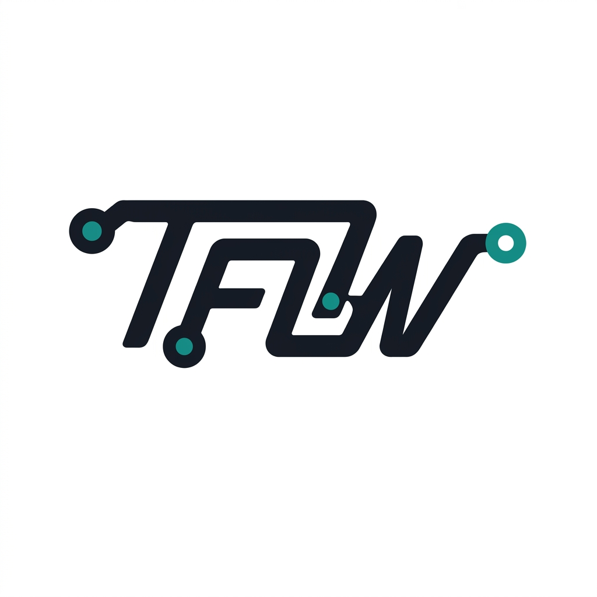
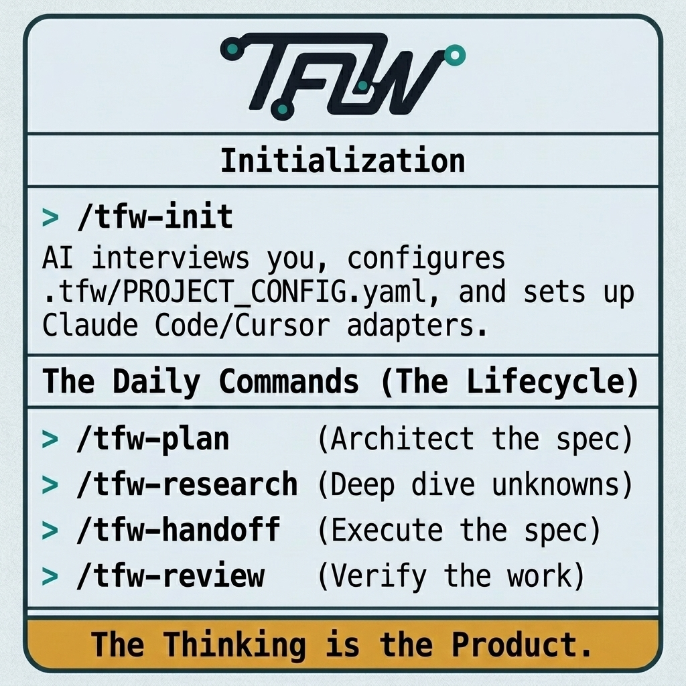

<p align="center">
  <a href="README.md">English</a> ·
  <a href="README.ru.md">Русский</a> ·
  <a href="README.kk.md">Қазақша</a>
</p>

<p align="center">
  
</p>

<h1 align="center">Trace-First Workflow</h1>

<p align="center"><i>«Мышление — продукт. Всё остальное — результат».</i></p>

<p align="center">
  <a href="LICENSE"></a>
  <a href=".tfw/VERSION"></a>
</p>

> **Смысловой источник:** эта страница полностью локализует практическое руководство, но при расхождениях приоритет имеют английские [`README.md`](README.md) и [Project North Star](.tfw/README.md).

> *Представьте продукт, который знает не только собственный результат,*
> *но и цель, принятые решения, отвергнутые варианты, доказательства и долг.*

Большинство проектов не умеет объяснить себя. Ход рассуждений остаётся в закрытом чате, в чьей-то памяти или на встрече без протокола. Новый участник команды или новый сеанс с ИИ видит итог, но не знает цели, ограничений, доказательств и безопасного следующего шага.

Trace-First Workflow (TFW) делает работу проверяемой и пригодной для продолжения. **TFW — методология совместной работы людей и ИИ, основанная на Философии Следа.** Цель, легитимные полномочия, суждение, приёмка, ответственность за результат и обязанность остановить работу остаются у людей; агенты выполняют ограниченные поручения. **След (Trace)** — это отобранный долговечный контекст, а не сырой протокол чата и не скрытая цепочка рассуждений. В нём сохраняются решения, результат или текущее состояние, доказательства, границы и сведения для продолжения.

В этом репозитории находится полный стартовый комплект TFW. Выберите редакцию, перенесите её в проект и используйте предусмотренные файлы и процессы, чтобы следующему уполномоченному человеку или агенту хватило надёжного контекста. TFW не обещает автоматически устанавливать истину, в точности воспроизводить результат, самостоятельно обслуживать документацию или давать агенту независимые полномочия.

Полное философское обоснование изложено в **[Project North Star](.tfw/README.md)**. Эта страница остаётся практическим руководством по проекту.

---

## Редакции

Редакции TFW дают разный объём дисциплины для разной работы. Это не ступени личной зрелости: один и тот же человек может взять Light для разового анализа, Assisted для регулярного процесса и Full для длительного проекта с высокой ценой ошибки.

| Редакция | Когда выбирать | Что входит | С чего начать |
|---|---|---|---|
| **Light** | Работа разовая, учебная или исследовательская; отвечает один человек; пропущенное ручное обновление не критично | Четыре коротких файла: цель, список задач, След задачи и долговременная память проекта | [`editions/01-light/`](editions/01-light/) |
| **Assisted** | Работа повторяется, двум-трём участникам нужно разделить зоны ответственности либо пропуски в Следах и статусах стали регулярными | Дисциплина Light, структура с поддержкой Codex и ненавязчивые проверки; проверенным резервным вариантом остаётся описанный ручной порядок | [`editions/02-assisted/`](editions/02-assisted/) |
| **Full** | Проект длительный, межфункциональный, регулируемый или дорогой в случае ошибки; нужны формальные этапы исследования, доказательства, проверки и закрепления знаний | Полный цикл `HL → RES → TS → ONB → RF → REVIEW` | [`.tfw/`](.tfw/) |

Выбирайте минимальную редакцию, которой достаточно для конкретной работы. Скопируйте **содержимое** её каталога в корень проекта: не ведите проект внутри вложенного `editions/01-light/` или `editions/02-assisted/`. Сравнение редакций и пути перехода описаны в [руководстве по редакциям](editions/README.md).

---

## Кому подходит TFW

**Командам и отдельным специалистам, которым нельзя терять причины принятых решений.** TFW не привязан к предметной области: его практическая дисциплина работает в разработке, аналитике, исследованиях, текстах, образовании, дизайне и операционной деятельности.

### 🎯 Руководителям продукта, которые проводят решения через несколько команд

Стратегия, обсуждённая в одном месте, может не дойти до исполнителя. При смене участников исчезают обоснование и отвергнутые варианты. TFW оставляет проверяемые решения, полномочия, доказательства и следующие шаги, чтобы другой уполномоченный участник продолжил работу, не придумывая утраченный контекст.

### 🔬 Аналитикам и исследователям, которые накапливают знание итерациями

Предыдущий анализ трудно найти, между исследовательскими итерациями теряются предпосылки, а итоговый отчёт редко показывает решения, которые его сформировали. TFW сохраняет выводы каждой итерации, проверенные гипотезы, ограничения и решения для последующей проверки и консолидации.

### ⚙️ Инженерам с продуктовым мышлением, которые берегут архитектурный контекст

Код показывает, что существует, но не всегда объясняет, почему это устроено именно так. TFW держит архитектурные решения, ограничения, отвергнутые альтернативы, доказательства и технический долг рядом с реализацией, чтобы новый разработчик изучил причины до внесения изменений.

---

## Быстрый старт

Сначала выберите редакцию. Если вы сомневаетесь, передайте агенту [руководство по редакциям](editions/README.md) и опишите характер работы, участников, длительность и цену пропущенного обновления. Агент должен рекомендовать минимально достаточную редакцию и объяснить выбор; окончательное решение принимает человек.

### Новый проект — начать с нуля

Скопируйте этот запрос в агента, который умеет читать и изменять файлы:

    Я хочу начать новый проект с Trace-First Workflow (TFW).
    Клонируй https://github.com/saubakirov/trace-first-starter во временный каталог.
    Прочитай editions/README.md, предложи минимальную подходящую редакцию и объясни выбор.
    После моего решения скопируй содержимое этой редакции в корень проекта и выполни её README.
    Если я выберу Full, скопируй .tfw/ и пошагово выполни .tfw/quickstart.md.
    Мой проект: <опишите проект, участников, длительность и риски>

### Существующий проект — добавить TFW и сохранить состояние

    Я хочу добавить Trace-First Workflow (TFW) в существующий проект.
    Сначала изучи репозиторий и определи файлы и Следы, которые нужно сохранить.
    Клонируй https://github.com/saubakirov/trace-first-starter во временный каталог.
    Прочитай editions/README.md и предложи минимальную подходящую редакцию.
    Не перезаписывай состояние проекта. Используй путь миграции выбранной редакции;
    для Full скопируй .tfw/ в корень проекта и выполни .tfw/quickstart.md.
    Мой проект: <опишите проект, участников, длительность и риски>

При переходе **Light → Assisted** следуйте [`editions/02-assisted/MIGRATION.md`](editions/02-assisted/MIGRATION.md), сохранив цель Light, задачи, Следы, результаты и память. На Full стоит переходить, когда работе требуется полный формальный цикл.

### TFW уже настроен — приступить к работе

    Прочитай AGENTS.md и правила активной редакции, чтобы понять контекст проекта.
    Назови текущее состояние и следующий безопасный шаг.
    Новую задачу в Full TFW начни так: /tfw-plan
    Задача: <опишите нужный результат>

В Full TFW команда `/tfw-plan` создаёт или уточняет план задачи, `/tfw-handoff` выполняет утверждённый TS, `/tfw-review` независимо проверяет завершённую работу, а `/tfw-resume` продолжает прерванную. Остальным процессам соответствуют `/tfw-research`, `/tfw-docs`, `/tfw-knowledge`, `/tfw-release`, `/tfw-update`, `/tfw-config` и `/tfw-init`.

**Пользователям Codex:** те же команды `/tfw-*` реализованы локальными навыками репозитория; корневой `AGENTS.md` служит резервной маршрутизацией. Отдельная обёртка для Codex не нужна. Установка и восстановление описаны в [`.tfw/adapters/codex/`](.tfw/adapters/codex/README.md).

### Частые вопросы

**Нужно ли читать все файлы фреймворка?**
Нет. Человеку достаточно начать с этой страницы, выбрать редакцию и поручить агенту выполнить её инструкции. [Project North Star](.tfw/README.md) стоит прочитать, если вам нужны полное обоснование и философские границы. Действующая механика находится в [`.tfw/conventions.md`](.tfw/conventions.md).

**С какими инструментами ИИ работает TFW?**
Методике может следовать любой инструмент, который читает файлы проекта. Есть шаблоны адаптеров для Claude Code, Cursor, Antigravity и Codex. Обычный чат тоже подойдёт, если явно передавать ему нужные файлы и просить соблюдать их правила.

**Можно ли использовать TFW вне разработки?**
Да. TFW упорядочивает решения и преемственность, а не только программирование. Light вырос из реального не-технического учебного сценария; тот же подход применим к исследованиям, аналитике, текстам, преподаванию, дизайну и операциям.

**Чем TFW отличается от Confluence или Notion?**
Такие системы умеют хранить и публиковать знания. TFW организует саму работу так, чтобы отобранные решения, доказательства, ограничения и следующие шаги по ходу дела попадали в версионируемые Следы. Человек по-прежнему решает, что считать авторитетным и достойным сохранения: автоматически документировать всё методология не обещает.

**Следующий агент воспроизводит мысли предыдущего?**
Нет. След — отобранный устойчивый контекст, а не стенограмма и не обещание точного воспроизведения. Следующий уполномоченный участник изучает записанное состояние, доказательства и ограничения, а затем применяет собственное суждение.

**Есть ли наглядное введение?**
Откройте [интерактивный FAQ](https://notebooklm.google.com/notebook/0a4cc544-0c0a-4fb0-b7ae-f075625d0980), [вводные слайды](https://notebooklm.google.com/notebook/0a4cc544-0c0a-4fb0-b7ae-f075625d0980?artifactId=e274558e-7d56-45ea-b2e7-efc7f6ccdf46) или [видеообзор](https://notebooklm.google.com/notebook/0a4cc544-0c0a-4fb0-b7ae-f075625d0980?artifactId=f800b95b-aefb-4447-a9c9-42adb5455e45). Эти адреса сохранены из устоявшегося руководства; постоянная доступность внешнего сервиса здесь не заявляется.

---

## Как устроена работа

| Принцип | Что это означает на практике |
|---|---|
| **Контекст проекта можно проверить** | Цель, решения, ограничения, отвергнутые альтернативы, доказательства, состояние и долг доступны рядом с результатом. «Самоосведомлённость» означает эти проверяемые возможности, а не человеческие свойства проекта |
| **Продолжение от явной контрольной точки** | Человек или агент читает доску задач и нужные Следы, сверяет записанное состояние и продолжает с явной передачи, а не с исчезнувшего чата |
| **Знание может накапливаться** | Следы задач сохраняют кандидатов; проверка и консолидация переводят подтверждённые факты в долговременное знание, не объявляя истиной каждую заметку |
| **У людей и агентов разные обязанности** | У людей остаются цель, полномочия, суждение, приёмка, ответственность и решение остановиться; агенты выполняют ограниченные роли внутри утверждённого договора |
| **Дисциплина соразмерна работе** | Light, Assisted и Full сохраняют общий договор о преемственности, но используют разные артефакты и контрольные точки в зависимости от риска |

---

## Что находится в репозитории

<p align="center">
  
</p>

### Корневые файлы проекта Full

| Файл | Назначение |
|---|---|
| `README.md` | Практическое руководство и живая доска задач |
| `AGENTS.md` | Правила для агентов, маршрутизация и резервное подключение команд `/tfw-*` |
| `KNOWLEDGE.md` | Проверенные сведения об архитектуре, решениях и устойчивом знании проекта |
| `TECH_DEBT.md` | Реестр технического долга |
| `RELEASE.md` | Стратегия и контекст выпуска, если проект делает релизы |

### `.tfw/` — ядро Full TFW

| Путь | Содержимое |
|---|---|
| [`.tfw/README.md`](.tfw/README.md) | Project North Star: цель, принципы и то, что методология не обещает |
| [`.tfw/conventions.md`](.tfw/conventions.md) | Действующая механика: роли, статусы, именование, доказательства, ворота и лимиты объёма |
| [`.tfw/glossary.md`](.tfw/glossary.md) | Канонические термины |
| [`.tfw/templates/`](.tfw/templates/) | Шаблоны задач, исследований, исполнения, доказательств, проверки и знания |
| [`.tfw/workflows/`](.tfw/workflows/) | Процессы `plan`, `research`, `handoff`, `review`, `resume`, `docs`, `knowledge`, `release`, `update`, `config` и `init` |
| [`.tfw/adapters/`](.tfw/adapters/) | Шаблоны маршрутизации для разных инструментов |
| [`.tfw/quickstart.md`](.tfw/quickstart.md) | Порядок чтения и инициализации для ИИ-агента |
| [`.tfw/project_config.yaml`](.tfw/project_config.yaml) | Параметры проекта и лимиты объёма |
| [`.tfw/VERSION`](.tfw/VERSION) | Установленная версия фреймворка |
| [`.tfw/CHANGELOG.md`](.tfw/CHANGELOG.md) | История версий фреймворка |
| [tfw.saubakirov.kz](https://tfw.saubakirov.kz/) | Сайт документации, собираемый из артефактов репозитория |

У Light и Assisted корневая структура меньше. Для каждой из этих редакций приоритетны её собственные README.

---

## Адаптеры инструментов



TFW не зависит от инструмента. Адаптер переводит один и тот же локальный процесс репозитория в точку входа конкретной среды:

| Инструмент | Адаптер | Точка входа в проекте |
|---|---|---|
| Claude Code | `.tfw/adapters/claude-code/` | Корневой `CLAUDE.md` |
| Cursor | `.tfw/adapters/cursor/` | `.cursor/rules/tfw.mdc` |
| Antigravity | `.tfw/adapters/antigravity/` | `.agent/rules/tfw.md` |
| Codex | `.tfw/adapters/codex/` | Корневой `AGENTS.md` и `.agents/skills/tfw-*/SKILL.md` |
| Обычный чат | Адаптер не устанавливается | Передавайте нужные файлы репозитория явно |

Начните с [`.tfw/quickstart.md`](.tfw/quickstart.md); инструкции для конкретных инструментов находятся в [`.tfw/adapters/`](.tfw/adapters/).

---

## Основные понятия

Полный цикл Full виден на доске задач и в файлах Следов:

```text
⬜ TODO → 📝 HL_DRAFT → 🔬 RES → 🟡 TS_DRAFT → 🟠 ONB → 🟢 RF → 🔍 REV → 📚 KNW → ✅ DONE
```

Этапы `RES` и `KNW` используются по условиям проекта. Статус `❌ REJECTED` сохраняет неудачную попытку и полученный опыт; `⛔ BLOCKED` фиксирует тупик, не выдавая его за завершение.

| Понятие | Практический смысл | Источник |
|---|---|---|
| Роли | Coordinator планирует, Researcher исследует, Executor реализует, Reviewer независимо проверяет | [глоссарий](.tfw/glossary.md) |
| Режимы исполнения | CL (Chat Loop) используется по умолчанию; AG (Autonomous) требует явного разрешения | [правила](.tfw/conventions.md) |
| Лимиты объёма | Максимумы для файлов, новых файлов, строк и изменённых файлов задаются в проекте и проверяются до исполнения | [конфигурация](.tfw/project_config.yaml) |
| Доказательства | TS определяет нужные подтверждения, RF сообщает собранное, REVIEW оценивает достаточность | [правила](.tfw/conventions.md) |
| Память задачи | `HL`, `RES`, `TS`, `ONB`, `RF`, `REVIEW` и Следы знания обслуживают разные решения и не являются сырыми логами чата | [шаблоны](.tfw/templates/) |
| Версии | Установленная семантическая версия хранится в `.tfw/VERSION`, а изменения — в журнале | [история версий](.tfw/CHANGELOG.md) |

Текущую механику сверяйте с [правилами](.tfw/conventions.md) и нужным [процессом](.tfw/workflows/). Обоснование методологии находится в [Project North Star](.tfw/README.md).

---

## Обновление TFW

Установленная семантическая версия указана в [`.tfw/VERSION`](.tfw/VERSION). Чтобы сравнить и обновить ядро Full, сохранив состояние проекта, попросите агента выполнить:

> `/tfw-update`

Процесс обновления получает настроенный upstream, сравнивает версии, относит изменения к безопасным, требующим слияния или ломающим совместимость и применяет выбранные изменения, не считая состояние конкретного проекта одноразовым. Точный порядок находится в [`.tfw/workflows/update.md`](.tfw/workflows/update.md), история — в [`.tfw/CHANGELOG.md`](.tfw/CHANGELOG.md).

---

## Ссылки

| Что нужно | Куда перейти |
|---|---|
| Выбрать и начать | [Руководство по редакциям](editions/README.md) · [Quick Start для Full](.tfw/quickstart.md) |
| Проверить механику | [Правила](.tfw/conventions.md) · [Глоссарий](.tfw/glossary.md) · [Процессы](.tfw/workflows/) |
| Понять философию | [Project North Star](.tfw/README.md) |
| Изучить историю и доказательства | [Английская доска задач](README.md#task-board) · [`tasks/`](tasks/) · [Проверенные знания](KNOWLEDGE.md) · [История версий](.tfw/CHANGELOG.md) |
| Задать вопрос | [Интерактивный FAQ в NotebookLM](https://notebooklm.google.com/notebook/0a4cc544-0c0a-4fb0-b7ae-f075625d0980) |
| Посмотреть введение | [Вводные слайды](https://notebooklm.google.com/notebook/0a4cc544-0c0a-4fb0-b7ae-f075625d0980?artifactId=e274558e-7d56-45ea-b2e7-efc7f6ccdf46) · [Видеообзор](https://notebooklm.google.com/notebook/0a4cc544-0c0a-4fb0-b7ae-f075625d0980?artifactId=f800b95b-aefb-4447-a9c9-42adb5455e45) |
| Документация | [tfw.saubakirov.kz](https://tfw.saubakirov.kz/) |
| Репозиторий | [github.com/saubakirov/trace-first-starter](https://github.com/saubakirov/trace-first-starter) |
| Автор | [saubakirov.kz](https://saubakirov.kz/) |
| Лицензия | [MIT](LICENSE) |
