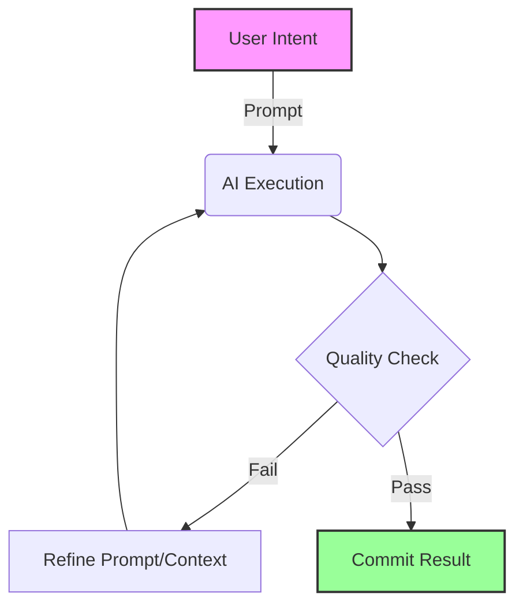

# Success Criteria

> [!IMPORTANT]
> **Core Philosophy**: The AI must handle the task **end-to-end** without manual editing of the results. Only the **prompts** (intent) should be edited by the human.

## 1. End-to-End AI Execution
- **No Manual Fixes**: The user must not manually correct code or documents generated by the AI.
- **Iterative Correction**: If the output is wrong, the user must adjust the prompt or context and ask the AI to fix it.
- **Goal**: Achieve a state where the AI's output is production-ready solely through natural language interaction.

## 2. Prompt-Driven Workflow
- **Intent > Result**: The thought process and the instructions (prompts) are more valuable than the immediate result.
- **Traceability**: Every decision must be traceable back to a specific instruction.
- **Don't Lose Thoughts**: Record all intentions and constraints in the chat or context files (`TASK.md`, `AGENTS.md`) before execution.

## 3. Atomic & Manageable Scope
- **Break It Down**: Tasks must be small enough to fit comfortably within the AI's context window and reasoning capabilities.
- **Roadmap Awareness**: Always maintain a high-level view (Roadmap) while executing small, atomic steps.
- **Feasibility**: Do not assign tasks that you (the user) could not verify or would not be able to do yourself with high quality.

## 4. Quality Standard
- **Self-Verification**: The AI must verify its own work.
- **User Standard**: The output must meet the quality standard the user would demand of themselves.

---

### Visualization of Success

