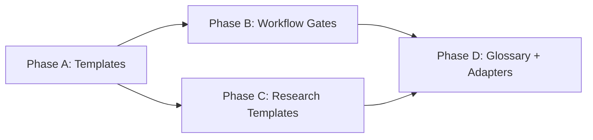

# HL — TFW-41: Execution Quality Gates

> **Date**: 2026-04-20
> **Author**: Coordinator (AI) + PO
> **Status**: 📝 HL_DRAFT — Awaiting review

---

## 1. Vision

TFW pipelines produce traces but don't prevent quality failures at their source. Executors copy code from over-detailed TS instead of engineering solutions. Coordinators write TS based on their plans instead of the actual output of the previous phase. HL principles exist as text without enforcement mechanisms. After this task, every critical handoff point in TFW has a structural gate — not instructions, not guidelines, but mechanisms that make it harder to fail silently.

**Impact:** Fewer Phase D "cleanup" phases. Executors think instead of copy. Coordinators verify against reality. HL principles survive into implementation.

> "Слова без hard gate = декоративные слова." — PO, HD-18 retrospective

## 2. Current State (As-Is)

9 observed problems from production use (HD-9, HD-16, HD-18), documented in session notes:

| # | Problem | Source | Severity |
|---|---------|--------|----------|
| 1 | RF drifts from template — executor writes from memory | HD-9 | Medium |
| 2 | Coordinator answers ONB questions confidently without sources | HD-9 | Medium |
| 3 | Sessions have no names — impossible to navigate | All | Low |
| 4 | TS = algorithm without "why" — executor follows steps, doesn't check result | HD-16 | High |
| 5 | Over-detailed TS = copy-paste executor (50KB of code in TS) | HD-16 | Critical |
| 6 | HL §7 principles without enforcement — "decorative words" | HD-18 | High |
| 7 | Coordinator verifies plan, not output of previous phase (plan≠fact drift) | HD-18 | Critical |
| 8 | Cross-phase test ownership unclear — rename breaks traceability | HD-18 | Medium |
| 9 | Phase dependency graph only in coordinator's head | HD-18 | Medium |

### Root cause taxonomy

Three clusters:

```
CLUSTER 1: Agent acts on inertia (#1-3)
  Agent doesn't check context before key action.
  Fix pattern: explicit "check before acting" gates

CLUSTER 2: TS doesn't let executor think (#4-5)
  TS contains ready code → executor copies instead of engineers.
  Fix pattern: Requirements-first TS

CLUSTER 3: Coordinator doesn't verify context (#6-9)
  Coordinator writes against plan, not reality.
  Fix pattern: Pre-TS gates, enforcement tracing
```

### Key evidence: HD-16 case study

| Phase | TS size | Content | Result |
|-------|---------|---------|--------|
| A | 23 KB, 534 lines | Step-by-step code | ✅ 22/22 AC |
| B | 30 KB, 842 lines | Full TypeScript files | ✅ 16/16 AC. BUT: palette not designed, 89 hardcoded colors untouched |
| C | **50 KB, 1280 lines** | Complete components copy-paste ready | ✅ 23/24 AC. per_page=100 vs spec 500 (backend cap unnoticed) |
| D | 20 KB | **Created to fix B+C failures** | HL explicitly states root cause: "TS contained code, not requirements" |

### Key evidence: HD-18 self-assessment

Coordinator scored own TS quality 7/10 (improvement over HD-16). But 3 errors reached ONB:
- Wrong function signature (copied from other workers, not verified)
- Wrong worker count (didn't count `create_task` calls)
- Referenced already-updated test (read own TS, not RF of previous phase)

## 3. Target State (To-Be)

### 3.1 Result Visualization

**Imagine it's 3 months after TFW-41 ships. A coordinator writes TS for Phase C of a multi-phase task:**

```
BEFORE (current):
  Coordinator opens TS Phase B (own plan)     ← reads PLAN
  Writes Phase C TS with code blocks           ← writes CODE
  Executor copies code from TS                 ← COPIES
  Reviewer finds: "palette not designed"       ← Phase D needed
  3 TS errors reach ONB                        ← waste

AFTER (TFW-41):
  Coordinator opens RF Phase B (actual output)  ← reads FACT
  Writes Phase C TS with Requirements + Gates   ← writes WHAT, not HOW
  Executor reads Requirements, engineers solution ← THINKS
  Executor runs Gate per Requirement             ← SELF-CHECKS
  Reviewer verifies HL §7 principles survived    ← ENFORCES
  0 cleanup phases needed                        ← no Phase D
```

**What a TS looks like after (3 domain examples):**

```markdown
## §4 Acceptance Criteria

### AC-1: ETL covers all data sources
  All 5 data sources produce records in the staging table.
  - [ ] Row count per source > 0 after pipeline run
  - [ ] No source returns only NULLs
  Gate: query staging table → 5 sources present

### AC-2: Report reflects transformed data  [depends: AC-1]
  Summary report uses staging output, not raw data.
  - [ ] Report totals match staging aggregates (±1% tolerance)
  Gate: compare report vs staging query

### AC-3: Stakeholder review completed  [depends: AC-2]
  Report reviewed and approved by domain owner.
  - [ ] Feedback incorporated or explicitly deferred with rationale

## §5 Technical Guidance
> Reference material, not instructions. Executor MAY deviate.
- Staging table: `analytics.staging_v2` (schema in KNOWLEDGE.md D12)
- Previous report used direct queries — this is the root cause of data drift
- Pattern: transform in staging, aggregate in report layer

## §6 Definition of Failure
- ❌ Report uses raw source tables directly → reject RF
- ❌ Any data source missing from staging with no documented reason
```

### 3.2 Value Flow

```
USER PAIN                    TFW-41 CHANGE                    VALUE
─────────                    ──────────                       ─────
"Executor copies,            TS template: Requirements        Executor engineers
 doesn't think"              not code. §4 = WHAT, §5 = hints  solutions

"Phase D cleanup             Execution Loops: Gate per        Errors caught at R_n,
 phases needed"              Requirement before next R_{n+1}  not at review

"Coordinator writes          Pre-TS Gate: read RF N-1         TS based on reality,
 against own plan"           before writing TS N              not plan

"HL principles are           Principles Check in TS +         Principles enforced
 decorative words"           reviewer verification            or explicitly N/A

"RF drifts from              Pre-RF Gate: open template       Template followed
 template"                   before writing                   structurally

"Dependency graph             Phase Dependencies in           Any coordinator can
 in coordinator's head"      Master HL                        write any Phase TS
```

## 4. Phases

### Phase Dependencies



| Phase | Depends on | Shared files | Can run in parallel with |
|-------|-----------|--------------|-------------------------|
| A | Independent | — | — |
| B | A (new TS template) | `conventions.md` | C |
| C | A (conventions for terminology origin) | `glossary.md` | B |
| D | B + C | `glossary.md`, adapters | — |

### Phase A: TS Template + Conventions 🔴

> **Requires:** Independent
>
> **Context for coordinator:**
> 1. `.tfw/templates/TS.md` — current TS template to rewrite
> 2. `.tfw/templates/HL.md` — add Phase Dependencies section
> 3. `.tfw/conventions.md` §14 — anti-patterns list to extend
> 4. RES iter1 DR1, DR6 — research decisions on TS structure
> 5. Session notes — Problems 4-8 analysis
>
> **Key decisions (from research):**
> - DR1: TS §4 → Acceptance Criteria (verifiable requirements), §5 → Technical Guidance (context, patterns, constraints — NOT implementation)
> - DR6: HL §7 Principles → TS AC mapping table (mandatory). Each TS contains table: Principle → AC item → Gate
> - D3: TS §6 = Definition of Failure (hard reject conditions)
> - D5: Cross-Phase Modifications table for multi-phase tasks
> - AC dependency annotation: `[depends: AC-X]` — coordinator explicitly marks dependent AC items
>
> **Deliverables:**
> 1. Rewrite `TS.md` template: Requirements-first structure (§4 AC with `[depends]` annotation, §5 Technical Guidance, §6 Definition of Failure, Principles Check table)
> 2. Add 4 anti-patterns to `conventions.md` §14
> 3. Add Phase Dependencies section to `HL.md` template

### Phase B: Workflow Gates 🔴

> **Requires:** Phase A ✅
>
> **⚠️ Shared files with Phase C:** `conventions.md` (A adds anti-patterns, C adds terminology origin)
>
> **Context for coordinator:**
> 1. `.tfw/workflows/handoff.md` — execution workflow
> 2. `.tfw/workflows/plan.md` — planning workflow
> 3. `.tfw/workflows/review.md` — review workflow
> 4. `.tfw/templates/ONB.md` — ONB template
> 5. RES iter1 DR2, DR3 — Pre-TS Gate and Execution Loops decisions
>
> **Key decisions (from research):**
> - DR2: Pre-TS Gate: coordinator reads RF of latest completed phase in dependency chain before writing next TS
> - DR3: Execution Loops: mandatory when AC items have `[depends]` annotations. Independent ACs → linear. Threshold = dependency, not count.
> - D6: Pre-RF Gate in handoff: executor opens template before writing RF
> - D9: Coordinator ONB answer rule: no source → give options, don't decide
> - D10: Reviewer checks HL §7 principles in Judge phase
> - D11: Session Naming convention: every workflow session starts with naming (Role | Task ID | Phase)
>
> **Deliverables:**
> 1. Add Pre-RF Gate + Execution Loops (dependency-based, triggered by `[depends]`) to `handoff.md`
> 2. Add Pre-TS Gate to `plan.md`
> 3. Add coordinator answer protocol to ONB handling in `handoff.md`
> 4. Add HL §7 principles verification to `review.md`
> 5. Add Session Naming Step 0 to all workflows

### Phase C: Research Templates — Embedded Dimensional Analysis 🔴

> **Requires:** Independent (only needs `conventions.md` for terminology origin note)
>
> **⚠️ Shared files with Phase D:** `glossary.md`
>
> **Context for coordinator:**
> 1. `.tfw/templates/research/gather.md` — add Dimensions section
> 2. `.tfw/templates/research/extract.md` — add Configuration Space section
> 3. `.tfw/templates/research/challenge.md` — add Consistency Check section
> 4. `.tfw/workflows/research/base.md` — add dimensional analysis thread
> 5. RES iter2 DR7-DR13 — embedded dimensional analysis decisions
>
> **Key decisions (from research):**
> - DR7: Supersedes DR4/DR5. Embedded analysis across stages, not "mandatory Zwicky Box"
> - DR8: Gather → `## Dimensions` (independent decision factors, ≥3 alternatives, no "recommended")
> - DR9: Extract → `## Configuration Space` (cross-reference of Gather dimensions, no evaluation yet)
> - DR10: Challenge → `## Consistency Check` (pairwise incompatibility, surviving configurations)
> - DR11: Native terminology (Dimension, Alternative, Configuration Space, Consistency Check, Surviving Configuration). Glossary references Zwicky as origin.
> - DR12: Graceful degradation: <3 dimensions → comparison matrix
> - DR13: Workflow Step 5: 4-line dimensional analysis description
>
> **Deliverables:**
> 1. Add `## Dimensions` to `gather.md` template
> 2. Add `## Configuration Space` to `extract.md` template
> 3. Add `## Consistency Check` to `challenge.md` template
> 4. Add dimensional analysis thread to `research/base.md` workflow
> 5. Add terminology origin note to `conventions.md`

### Phase D: Glossary + Adapters Sync 🟡

> **Requires:** Phase B + Phase C ✅
>
> **Context for coordinator:**
> 1. `.tfw/glossary.md` — needs new terms from Phase A, B, C
> 2. Adapter files — sync new workflow steps
>
> **Deliverables:**
> 1. Add terms to glossary: Execution Loop, Pre-TS Gate, Pre-RF Gate, Principles Check, Definition of Failure (TS), Technical Guidance, Phase Dependencies, AC Dependency Annotation, Session Naming, Dimension, Alternative, Configuration Space, Consistency Check, Surviving Configuration
> 2. Sync adapters (claude-code, cursor, antigravity) with new workflow steps

## 5. Definition of Done (DoD)

- ✅ 1. TS template has §4 Acceptance Criteria (not Detailed Steps), §5 Technical Guidance (not implementation), §6 Definition of Failure
- ✅ 2. TS template has Principles Check table (HL §7 → AC mapping)
- ✅ 3. TS template has `[depends: AC-X]` annotation syntax for AC dependency chains
- ✅ 4. TS template has Cross-Phase Modifications table (for multi-phase)
- ✅ 5. HL template has Phase Dependencies section (mermaid + table)
- ✅ 6. `handoff.md` has Pre-RF Gate (executor opens template before writing)
- ✅ 7. `handoff.md` has Execution Loops (triggered by `[depends]` annotations)
- ✅ 8. `plan.md` has Pre-TS Gate (read RF of latest completed phase before writing next TS)
- ✅ 9. `handoff.md` has coordinator ONB answer protocol (no source → options)
- ✅ 10. `review.md` Judge phase checks HL §7 principles enforcement
- ✅ 11. `conventions.md` §14 has 4 new anti-patterns
- ✅ 12. All workflows have Session Naming Step 0 (Role | Task ID | Phase)
- ✅ 13. Research templates have embedded dimensional analysis (Gather: Dimensions, Extract: Configuration Space, Challenge: Consistency Check)
- ✅ 14. Research workflow has dimensional analysis thread (4 lines in Step 5)
- ✅ 15. Glossary updated with all new terms
- ✅ 16. All adapters synced

## 6. Definition of Failure (DoF)

- ❌ 1. TS template still contains `§4 Detailed Steps` — not shipped
- ❌ 2. No Execution Loops in handoff — executor still linear without self-check
- ❌ 3. No Pre-TS Gate in plan — coordinator still writes against own plan
- ❌ 4. Principles Check absent or optional — HL §7 still decorative
- ❌ 5. Research templates use GMA terminology ("morphological box", "Zwicky") instead of native TFW terms

**On failure:** Revert to current templates. Analyze which gate was rejected and why.

## 7. Principles

1. **Gates over guidelines** — A gate is a structural mechanism that forces verification. A guideline is text that can be skipped. Every critical handoff point gets a gate, not a guideline.
2. **Requirements, not implementation** — TS describes WHAT the result should achieve and HOW to verify it. Never HOW to implement it. Implementation is the executor's job.
3. **Verify against fact, not plan** — When writing TS for Phase N, read RF Phase N-1 (actual output), not TS Phase N-1 (planned output). Plan ≠ fact.
4. **Enforce or remove** — If a principle is important enough to write in HL §7, it must have an AC with a gate. If it doesn't deserve a gate, remove it from §7 — don't leave decorative text.
5. **Executor as engineer, not copier** — Technical Guidance in TS gives hints and patterns. The executor MUST think, adapt, and verify — not copy-paste from TS.
6. **Domain-agnostic by default** — TFW serves any domain (code, analytics, writing, education, business). Examples and terminology in templates must not assume a specific domain.

### 7.2 Knowledge Citations

| # | Source | Item | How it applies |
|---|--------|------|----------------|
| 1 | conventions.md §14 | Anti-patterns list | Extending with 4 new patterns from observations |
| 2 | conventions.md §3 | TS definition: "self-contained: inputs/outputs/constraints/DoD" | Reinforcing: TS should contain constraints and DoD, not implementation code |
| 3 | glossary.md | Scope Budget | Budget limits exist but TS content quality has no structural limit — this task adds quality gates |
| 4 | README.md Values | "The thinking is the product" | Executor must think (Requirements-first) not copy (code-in-TS) |

## 8. Dependencies

| Dependency | Status |
|------------|--------|
| No external dependencies | ✅ |
| Session notes (9 problems) | ✅ Documented |
| HD-16, HD-18 case studies | ✅ Analyzed |

## 9. Risks

| Risk | Probability | Impact | Mitigation |
|------|-------------|--------|------------|
| Over-constrained TS template — coordinators can't express nuance | Medium | High | Technical Guidance §5 gives flexible hint space |
| Execution Loops add token overhead for simple phases | Low | Low | Trigger only for AC items with cross-component dependencies (DR3) |
| Existing TS from other projects become "non-compliant" | Low | Low | Template change is forward-only — old TS still readable |
| Workflow word count exceeds 1200-word design rule | Medium | Medium | Split additions across workflows, compress existing text |
| Dimensional analysis sections produce simulation (HD-19 pattern) | Medium | High | Cross-stage dependency prevents simulation: Extract needs Gather dimensions (DR7). Native terminology avoids compliance trap (DR11) |

## 10. RESEARCH Case — ✅ COMPLETE (2 iterations)

### Hypotheses (final verdicts)

| # | Hypothesis | Verdict | Evidence |
|---|----------|---------|----------|
| H1 | Requirements-first TS reduces "Phase D cleanup" phases | ✅ SUPPORTED | HD-16/C (50KB code-in-TS) → Phase D needed. HD-18/C (11KB requirements-first) → no Phase D. Same project/coordinator/executor. |
| H2 | Pre-TS Gate (read RF N-1) eliminates plan≠fact drift errors | ✅ STRONGLY SUPPORTED | HD-18: 3/3 coordinator errors caused by reading own TS, not RF. All 3 preventable. |
| H3 | Execution Loops catch more issues than linear execution | ⚠️ CONDITIONAL | Loops catch dependent-chain failures (HD-16/C per_page). No value for independent items. **Threshold = dependency, not count.** |
| H4 | Zwicky Box improves research Extract quality | ⚠️ CONDITIONAL → ✅ (via H5) | HD-19 = decorative (all Alt 1, no CCA). TFW-41 live test = genuine (4 from 1024 survived CCA). Needs embedded approach, not instruction-based. |
| H5 | Zwicky steps can be distributed across stages naturally | ✅ SUPPORTED | GMA maps 1:1 to Gather→Extract→Challenge. Cross-stage dependency creates natural enforcement. Native terminology prevents compliance trap. |

### Research Decisions (DR1-DR13)

| # | Decision | Iter |
|---|----------|------|
| DR1 | TS §4 → Acceptance Criteria, §5 → Technical Guidance (NOT code) | 1 |
| DR2 | Pre-TS Gate: read RF of latest completed phase before writing next TS | 1 |
| DR3 | Execution Loops: dependency-based, not count-based | 1 |
| DR6 | HL §7 → TS AC mapping table (Principles Check) | 1 |
| DR7 | **Supersedes DR4/DR5.** Embedded dimensional analysis across stages | 2 |
| DR8 | Gather: add `## Dimensions` | 2 |
| DR9 | Extract: add `## Configuration Space` | 2 |
| DR10 | Challenge: add `## Consistency Check` | 2 |
| DR11 | Native terminology, not GMA terminology | 2 |
| DR12 | <3 dimensions → comparison matrix (graceful degradation) | 2 |
| DR13 | Workflow Step 5: 4-line dimensional analysis description | 2 |

## 11. Strategic Insights (Planning + Research)

| # | Insight | Category | Source |
|---|---------|----------|--------|
| S1 | "Слова без hard gate = декоративные слова" — HL principles that don't become AC are meaningless. This is the core insight driving the entire task. | philosophy | PO, HD-18 retrospective |
| S2 | TS detail level is inversely proportional to executor quality. More code in TS → less thinking by executor. HD-16 Phase C (50KB TS) produced worse results than Phase A (23KB). | process | PO + HD-16 analysis |
| S3 | Research and Review have structured iterations (stages, passes). Execution is linear (ONB → code → RF). Adding Execution Loops brings execution to the same structural maturity. | philosophy | PO, session discussion |
| S4 | Coordinator reads own plan instead of RF — this is a systematic error observed across HD-18 phases. Not carelessness — structural: workflow doesn't require reading RF. | process | PO, HD-18 coordinator self-assessment |
| S5 | Phase D of HD-16 (design system) has an excellent HL that demonstrates Requirements-first approach: deliverables with AC, gates with grep commands, Definition of Failure. This HL serves as the "gold standard" for what the new TS template should produce. | domain | PO + HD-16 Phase D analysis |
| S6 | **Instructions produce compliance, heuristics produce analysis.** "MUST do Zwicky Box" → researcher fills box to comply. Template questions that guide thinking → researcher naturally decomposes. Same mechanism as Requirements-first TS: requirements target behavior, code targets form. | philosophy | RES iter2 FC4, PO observation |
| S7 | **Cross-stage dependencies are natural enforcement.** When Extract needs Gather's Dimensions, researcher can't skip decomposition. Stronger than checkpoint gates (structural, not procedural). | process | RES iter2 FC5 |
| S8 | PO explicitly stated: «Меня не интересует код в ТС. Требования которые нельзя обойти.» Direct instruction to restructure TS from code delivery to requirements engineering. | stakeholder | RES iter1 SS1, PO F24 |

---

*HL — TFW-41: Execution Quality Gates | 2026-04-20*
