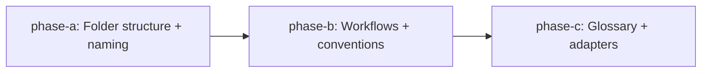

# HL — TFW-42: Research Cycle Restructure

> **Date**: 2026-04-30
> **Author**: Coordinator (Antigravity)
> **Status**: 📝 HL_DRAFT — Awaiting review

---

## 1. Vision
Research iterations are neatly contained inside a single `research/` folder with numbered sub-iterations, RES files co-located with their stage files, and iterations.yaml governing the process from one canonical place. Stage files sort in execution order in any file tree. Phase folders follow consistent lowercase kebab-case. Agents — regardless of tool — read their iteration brief from iterations.yaml and know exactly what to investigate, which predecessors to read, and what to produce.

**Impact:** Research traces become self-organizing: any agent opening a task folder sees one `research/` container instead of scattered `research/`, `research2/`, `research3/` folders and root-level RES files. Stage files read in correct order without memorizing the pipeline. Multi-agent research (different tools for different iterations) becomes a first-class capability.

> "I opened the task folder and everything was where I expected it — research in one place, iterations numbered, stages numbered. I didn't need to read the workflow to understand the structure."

## 2. Current State (As-Is)

| Aspect | Current | Problem |
|--------|---------|---------|
| Iteration folders | `research/`, `research2/`, `research3/` — flat at task root | Pollutes task root. No unified container. Inconsistent naming (`research/` vs `research2/`). |
| RES files | At task root: `RES__{ID}__title.md`, `RES__iter2__title.md` | Physically separated from their stage files. Breaks locality principle. |
| iterations.yaml | At task root | Not co-located with research artifacts. Mixes with HL, TS, phase folders. |
| Stage file naming | `briefing.md`, `challenge.md`, `extract.md`, `gather.md` | Alphabetical ≠ execution order. User must know pipeline to navigate. Feedback: "which file do I read first?" |
| Phase folders | `PhaseA/`, `PhaseB/` (PascalCase) | Inconsistent with task folders (`lower_snake_case` per D48). |
| iterations.yaml schema | `number`, `focus`, `hypotheses`, `status`, `res_file` | No agent designation, no dependencies, no briefing. Cannot orchestrate multi-agent research. |

## 3. Target State (To-Be)

### 3.1 Result Visualization

**Before → After: Task folder tree**

```
# BEFORE (current TFW)                    # AFTER (TFW-42)
tasks/PROJ-5__query_redesign/              tasks/PROJ-5__query_redesign/
  HL-PROJ-5__query_redesign.md               HL-PROJ-5__query_redesign.md
  iterations.yaml                    ←del    research/
  RES__PROJ-5__query_redesign.md     ←del      iterations.yaml          ←new location
  RES__iter2__query_redesign.md      ←del      iter1/
  research/                          ←del        1_briefing.md           ←numbered
    briefing.md                      ←del        2_gather.md             ←numbered
    challenge.md                     ←del        3_extract.md            ←numbered
    extract.md                       ←del        4_challenge.md          ←numbered
    gather.md                        ←del        RES.md                  ←co-located
  research2/                         ←del      iter2/
    briefing.md                      ←del        1_briefing.md
    ...                              ←del        2_gather.md
  PhaseA/                            ←del        3_extract.md
    HL__PhaseA__data_model.md                    4_challenge.md
    TS__PhaseA__data_model.md                    RES.md
                                               phase-a/                 ←kebab-case
                                                 HL__phase-a__data_model.md
                                                 TS__phase-a__data_model.md
```

Key improvements:
- **1 container** (`research/`) instead of N scattered folders
- **RES.md co-located** with its stage files in `research/iterN/`
- **Numbered stages** sort correctly in any file explorer
- **Consistent naming** — kebab-case for phase folders

### 3.2 Value Flow

```
USER defines hypotheses (HL §10)
  │
  ▼
COORDINATOR writes iterations.yaml with agent, sources (optional)
  │                            ↑
  ▼                            │ iteration gate (plan.md §6c)
RESEARCHER (agent X) reads     │
  iterations.yaml → iter brief │
  │                            │
  ▼                            │
research/iterN/                │
  1_briefing.md                │
  2_gather.md                  │
  3_extract.md                 │
  4_challenge.md               │
  RES.md ──────────────────────┘
```

## 4. Phases

### Phase Dependencies



| Phase | Depends on | Shared files | Can run in parallel with |
|-------|-----------|--------------|--------------------------|
| A | Independent | — | — |
| B | A | conventions.md (modified by A, then by B) | — |
| C | B | glossary.md, adapter copies | — |

### Phase A: Folder & naming conventions 🔴

> **Requires:** Independent
>
> **Context for coordinator:** conventions.md §4 (Research subfolder, Multi-iteration, Multi-phase structure), project_config.yaml
>
> **Key decisions:** All 6 changes from §3.1 encoded into conventions.md §4
>
> **Deliverables:**
1. conventions.md §4 — rewrite Research subfolder and Multi-iteration research sections
2. conventions.md §4 — rewrite Multi-phase folder structure (PhaseA → phase-a)
3. conventions.md §4 — update artifact filename table (PhaseA → phase-a)
4. Stage file templates renamed: `1_briefing.md`, `2_gather.md`, `3_extract.md`, `4_challenge.md`
5. iterations.yaml schema: +`agent` (optional, free-text), +`sources` (optional, list); location = `research/iterations.yaml` [R1-R3: simplified from 5→2 new fields per RES iter1 D1-D5]
6. RES template header — update file path convention (RES.md inside iterN/)

### Phase B: Workflow updates 🟡

> **Requires:** Phase A ✅
>
> **Context for coordinator:** research/base.md, plan.md (Step 6, Step 7)
>
> **Deliverables:**
1. research/base.md — update Step 0, 3, 6 for new folder structure
2. plan.md Step 6b — iterations.yaml location change + enriched schema + 1-sentence multi-agent reference [R7: per RES iter2 D10]
3. plan.md Step 7 — phase-a naming in multi-phase structure

### Phase C: Glossary + adapters 🟢

> **Requires:** Phase B ✅
>
> **Deliverables:**
1. glossary.md — update iterations.yaml, Iteration, Phase entries
2. Adapter sync (3 adapters × modified workflows)

## 5. Definition of Done (DoD)

- ✅ 1. `research/` is the single container for all research artifacts (iterations.yaml + iterN/ subfolders + RES files)
- ✅ 2. Stage files are numbered: `1_briefing.md`, `2_gather.md`, `3_extract.md`, `4_challenge.md`
- ✅ 3. Phase folders use kebab-case: `phase-a/`, `phase-b/`
- ✅ 4. iterations.yaml lives inside `research/` and supports optional fields: `agent` (free-text), `sources` (list) [R3: simplified per RES iter1]
- ✅ 5. RES files live inside `research/iterN/` as `RES.md`
- ✅ 6. All workflows reference updated paths
- ✅ 7. Glossary reflects new conventions
- ✅ 8. Adapter copies synced

## 6. Definition of Failure (DoF)

- ❌ 1. Any workflow references old paths (`research2/`, `RES__iter2__`, `PhaseA/`)
- ❌ 2. Stage file numbering doesn't match execution order (Briefing→Gather→Extract→Challenge)
- ❌ 3. iterations.yaml schema loses backward compatibility (existing fields removed or renamed)

**On failure:** Fix at review. No rollback needed — conventions are additive.

## 7. Principles

1. **Locality over scattering** — related artifacts live together. RES.md sits next to the stage files that produced it.
2. **Sort order = execution order** — numbered stage files eliminate the need to know the pipeline to navigate.
3. **Container over proliferation** — one `research/` folder vs N scattered folders at task root.
4. **Consistent casing** — phase-a matches `lower_snake_case`/kebab-case task folder convention (D48).
5. **Optional enrichment** — new iterations.yaml fields are optional. Simple tasks don't need `agent` or `sources`.
6. **Domain-agnostic** — changes apply to code, analytics, writing, education research equally.

### 7.2 Knowledge Citations

| # | Source | Item | How it applies |
|---|--------|------|----------------|
| KC1 | knowledge/philosophy.md F4 | Structural enforcement beats format enforcement | Numbered files + container folder = structural; reading docs to learn order = format |
| KC2 | knowledge/philosophy.md F24 | Instructions produce compliance, heuristics produce competence | Numbered files = heuristic (self-explanatory order), not instruction ("read briefing first") |
| KC3 | knowledge/convention.md F19 | Naming consistency is a design principle | phase-a (kebab-case) aligns with D48 naming normalization |
| KC4 | KNOWLEDGE.md D48 | Naming normalization: lower_snake_case for config/state | Extends to folder names — PascalCase `PhaseA` was the last exception |
| KC5 | KNOWLEDGE.md D38 | Multi-iteration research: iterations.yaml, researchN/ accumulation | This task refactors D38's implementation (better structure, same principles) |
| KC6 | knowledge/process.md F14 | Without YAML control files, agents fast-run | iterations.yaml enrichment gives agents explicit instructions per iteration |
| KC7 | knowledge/convention.md F15 | Multi-phase uses PhaseX/ subfolders | This task changes PhaseX → phase-x naming |

## 8. Dependencies
| Dependency | Status |
|------------|--------|
| D38 (multi-iteration research) | ✅ Implemented in TFW-32/C — being refactored |
| D48 (naming normalization) | ✅ Implemented in TFW-40/B — being extended |

## 9. Risks
| Risk | Probability | Impact | Mitigation |
|------|-------------|--------|------------|
| Breaking existing projects using old convention | Medium | Medium | This is a framework starter (template repo). Active projects won't be auto-updated — they'll adopt on next tfw-update |
| Agent confusion during transition | Low | Low | CHANGELOG entry + version bump will signal the change |
| Phase artifact filenames with kebab-case | Low | Low | Simple find-replace: `PhaseA` → `phase-a` in all references |

## 10. RESEARCH Case

### Blind Spots
- None significant. The changes are well-scoped and validated by AFD-2 production usage.

### Hypotheses

| # | Hypothesis | Status |
|---|----------|--------|
| H1 | Multi-agent orchestration needs `agent` field in iterations.yaml, not a separate mechanism | ✅ confirmed — RES iter1 D1/D7 + iter2 D8-D12. Agent = traceability, not dispatch. Field is accompanied by capability table in conventions.md + workflow reference in plan.md |

> **Filter:** If H1 false → we'd need a separate agent dispatch file or config. Approach changes.

### Risks of Not Researching
The change is empirically validated (AFD-2 = 8 iterations, 2 agents, proven structure). Risk of not researching is low.

### Proposed RESEARCH Focus
H1 only — how should the framework present multi-agent to users? Auto-detect, ask, or document-only?

### Why Not Just...?
- Why not keep RES at task root? — Breaks locality. Stage files in `research/iter1/`, synthesis 2 levels up. Agent navigating task must look in 2 places.
- Why not use `research-1/`, `research-2/` instead of `research/iter1/`? — Loses the container. Still N folders at task root level.

## 11. Strategic Insights (Planning)

| # | Insight | Category | Source |
|---|---------|----------|--------|
| S1 | User prefers learning from production usage (AFD-2) over theoretical design. «Посмотри как у нас получилось здесь... Там лучше получилось, чем у нас заложено в TFW.» **Implication:** TFW should formalize patterns that emerge organically in production projects, not design top-down. This is process.md F11 validated again. | philosophy | User, session start |
| S2 | Folder sort order matters for humans navigating file trees. User relayed external feedback: «стадии лежат в алфавитном порядке и не всегда понятно что зачем читать.» **Implication:** File naming should encode execution order. This is a UX principle for methodology artifacts, not just code. | stakeholder | User, follow-up |
| S3 | User wants multi-agent as a first-class framework feature, not an extension. «Мне нравится что можно комбинировать. Фреймворк может это предлагать явно или спрашивать.» **Implication:** iterations.yaml should guide coordinators to consider agent assignment, even if most tasks use a single agent. | philosophy | User, Q3 answer |

---

*HL — TFW-42: Research Cycle Restructure | 2026-04-30*
