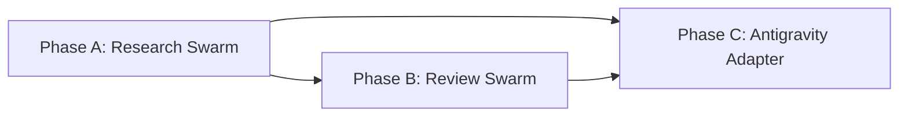

# HL — TFW-45: Multi-Agent Investigative Workflows

> **Date**: 2026-06-15
> **Author**: Coordinator (Antigravity)
> **Status**: 📝 HL_DRAFT — Awaiting review (v2 — incorporates user feedback)

---

## 1. Vision

TFW's investigative workflows (research, review) gain a multi-agent execution path where each stage runs as a **fresh agent with a dedicated Mindset as its system prompt** — not one agent simulating cognitive mode switches. The value proposition is quality, not speed: a clean agent born as "The Explorer" genuinely thinks like one, while a single agent asked to "now be The Critic" likely simulates. Stages remain sequential (Gather→Extract→Challenge) because each feeds the next. Agents that can't spawn sub-agents use `focused.md`/`deep.md` and run identically to today.

The Antigravity adapter is rebuilt from full-copy bloat to thin adapters — a fresh audit against current Antigravity capabilities (TFW-30 is outdated), not assumptions from April 2026.

**Impact:** Research stages produce genuinely independent cognitive outputs (Explorer's Gather ≠ Critic's Challenge ≠ Analyst's Extract). Review stages get fresh eyes on each dimension. Single-agent users see zero changes.

> "Each stage felt like a different person looked at it. The Gatherer found things the Analyst would have filtered out. The Critic tore apart things the Gatherer loved."

## 2. Current State (As-Is)

### The simulation problem

Today, research/review workflows ask ONE agent to switch cognitive modes between stages:

```
Agent reads base.md
  → Copies 2_gather.md → reads "Mindset: Explorer" → acts as Explorer
  → 🛑 STOP
  → Copies 3_extract.md → reads "Mindset: Analyst" → acts as Analyst
  → 🛑 STOP
  → Copies 4_challenge.md → reads "Mindset: Critic" → acts as Critic
```

**Problem:** The agent has conversation history from ALL previous stages. It "knows" what the Gatherer found and naturally builds on it instead of independently challenging it. The Mindset block asks it to switch personas, but it carries cognitive baggage — context, biases, confirmations — from the preceding stages. This is performance, not genuine cognitive mode change.

### Investigative workflow structure

| Workflow | Stages | Execution | Stage dependencies |
|----------|--------|-----------|-------------------|
| Research | Briefing → Gather → Extract → Challenge → RES | Sequential | Extract needs Gather Dimensions. Challenge needs Extract Configuration Space |
| Review | Map → Verify → Judge → Decide | Sequential (Map→Verify mostly, Judge can partially overlap) | Verify benefits from Map's understanding |

### Multi-agent capabilities — what we KNOW vs what we ASSUME

| Question | Known | Needs verification |
|----------|-------|--------------------|
| Antigravity can spawn sub-agents | ✅ `define_subagent`, `invoke_subagent` | — |
| Sub-agent gets a **custom system prompt** | ✅ `define_subagent.system_prompt` param | Does the Mindset block WORK as system prompt? |
| `self` type inherits parent's full config | ✅ (documented in system prompt) | Does it inherit `.agent/rules/`? `.agent/workflows/`? |
| `research` type = read-only tools | ✅ (documented) | Can it write stage files? |
| Workflows in `.agent/workflows/` | They load when invoked | Are they system prompt or context? |
| Skills in `.agent/skills/` | None exist yet in this project | Does auto-activation work? |
| Claude Code teamwork / max effort | Exists | How does it compare? Different adapter needed |
| Antigravity has changed since TFW-30 | ✅ (April → June) | What changed? New best practices? |

### ⚠️ TFW-30 analysis is outdated

TFW-30 HL was written 2026-04-09. Since then:
- Antigravity has had multiple updates
- Sub-agent capabilities may have changed
- Skills system may have new recommendations
- Planning Mode behavior may have evolved
- `// turbo` annotations may work differently
- New features (schedules, MCP, browser) added

**The TFW-30 HL CANNOT be trusted as current reality.** Phase C must start with a fresh empirical audit, not rely on April findings.

### Antigravity adapter problems (verified current state)

| Problem | Evidence (current, verified June 2026) | Impact |
|---------|---------------------------------------|--------|
| **12 full-copy workflows** | `.agent/workflows/` = byte-copies of `.tfw/workflows/` | Drift on any update |
| **No Skills folder** | `.agent/skills/` doesn't exist | Zero progressive disclosure |
| **No thin adapters** | Each workflow = 134-7834 bytes (full files, not references) | Token waste + drift |

## 3. Target State (To-Be)

### What changes:

1. **Framework (TFW)** gains `swarm.md` mode files — loaded by agents that can spawn sub-agents
2. **Swarm = sequential stages, fresh agents** — each stage = new agent with Mindset as system prompt + TFW context loading
3. **Conventions** get multi-agent coordination section
4. **Antigravity adapter** rebuilt after fresh audit (absorbs TFW-30 with updated data)
5. **Backward compatibility**: `focused.md`/`deep.md` unchanged

### 3.1 Result Visualization

**Before (single agent, mindset simulation):**
```
ONE agent, accumulating context:

[Agent starts]
  → "Be the Strategist" → writes Briefing
  → "Now be the Explorer" → writes Gather
  │   (but remembers everything from Briefing — biased toward plan)
  → "Now be the Analyst" → writes Extract
  │   (but remembers Gather findings — anchored to what was found)
  → "Now be the Critic" → writes Challenge
  │   (but confirmed the whole chain — criticism is performative)
  → Synthesizes → RES

Problem: The Critic read the Explorer's notes. The Critic IS the Explorer.
```

**After (swarm mode — fresh agent per stage):**
```
COORDINATOR agent manages the pipeline:

[Coordinator]
  → Writes Briefing (shared context document)
  → 🛑 STOP — user approves briefing
  
  → define_subagent("gather_researcher",
      system_prompt = Mindset(Explorer) + TFW context loading + Briefing)
  → invoke: "Run Gather stage. Write 2_gather.md"
  → Collects 2_gather.md

  → define_subagent("extract_researcher",
      system_prompt = Mindset(Analyst) + TFW context loading + Briefing + Gather output)
  → invoke: "Run Extract stage using Gather Dimensions. Write 3_extract.md"
  → Collects 3_extract.md

  → define_subagent("challenge_researcher",
      system_prompt = Mindset(Critic) + TFW context loading + Briefing + Extract output)
  → invoke: "Run Challenge stage against Configuration Space. Write 4_challenge.md"
  → Collects 4_challenge.md

  → Coordinator reads all 3 stage files → writes RES (synthesis)

Sequential: Gather → Extract → Challenge
Fresh: each agent = clean slate + dedicated system prompt
Honest: Critic never saw Explorer's reasoning process, only its output
```

**Review swarm:**
```
[Coordinator]
  → Loads TS + RF

  → define_subagent("map_reviewer",
      system_prompt = Mindset(Student) + TFW context)
  → invoke: "Map this RF. Write review/map.md"

  → define_subagent("verify_reviewer",
      system_prompt = Mindset(Auditor) + TFW context + Map output)
  → invoke: "Verify RF claims. Write review/verify.md"

  → define_subagent("judge_reviewer",
      system_prompt = Mindset(Judge) + TFW context + Map + Verify outputs)
  → invoke: "Judge against TS checklist. Write review/judge.md"

  → Coordinator reads all 3 → writes REVIEW (Decide)
```

### 3.2 Value Flow

```
User starts /tfw-research
  → base.md Step 2: Select Mode
    → Agent CAN define/spawn sub-agents?
    │
    ├── YES → Load swarm.md
    │   → Coordinator writes Briefing
    │   → FOR EACH stage (sequential):
    │       define_subagent(system_prompt = Stage Mindset + TFW rules)
    │       invoke → agent writes stage file
    │       Coordinator collects output
    │   → Coordinator synthesizes → RES
    │
    └── NO → Load focused.md or deep.md
        → Same as today: one agent, all stages, OODA loops
        → G → 🛑 → E → 🛑 → C → 🛑 → RES

Value created:
  FRESH MINDSET     → genuine cognitive mode (not simulation)
  CLEAN CONTEXT     → no anchoring from previous stages
  SYSTEM PROMPT     → Mindset = identity, not instruction to follow
  SEQUENTIAL STAGES → preserves dimensional analysis dependencies
```

## 4. Phases

### Phase Dependencies



| Phase | Depends on | Shared files | Can run in parallel with |
|-------|-----------|--------------|--------------------------|
| A | Independent | conventions.md, glossary.md | — |
| B | A | conventions.md (multi-agent section from A) | — |
| C | A + B | adapter copies of all modified workflows | — |

### Phase A: Research Swarm Mode 🔴

> **Requires:** Independent
>
> **Context for coordinator:**
> 1. `research/base.md` (current research algorithm)
> 2. `research/focused.md`, `research/deep.md` (existing mode files)
> 3. `conventions.md` §4 (research subfolder, iterations.yaml)
> 4. D25 (modular research architecture), D26 (OODA Stage Loop), D51 (per-stage Mindset)
> 5. philosophy.md F20 (two classes of workflows), F25 (framework proposes, human decides)
>
> **Key decisions:** D25 (mode files), D26 (OODA), D31 (filesystem-as-state-machine), D51 (copy-on-enter + Mindset)
>
> **Deliverables:**
> 1. `research/swarm.md` — new mode file with coordination protocol: define→invoke→collect for each stage
> 2. `base.md` Step 2 update — add swarm mode detection logic
> 3. `conventions.md` multi-agent section — coordination protocol, system prompt composition, traceability
> 4. `project_config.yaml` — `tfw.research.modes.swarm` section
> 5. `glossary.md` — new terms (Swarm Mode, Stage Agent, Coordinator Agent)
> 6. Stage template adjustments — ensure templates work as both self-instruction (single agent) AND system prompt input (swarm agent)

### Phase B: Review Swarm Mode 🟡

> **Requires:** Phase A ✅
>
> **⚠️ Shared files with Phase A:** conventions.md (multi-agent section)
>
> **Context for coordinator:**
> 1. `review.md` (current review algorithm)
> 2. `review/{code,docs,spec}.md` (existing mode files)
> 3. D41 (4-stage review), D42 (review mode files), D46 (Reviewer Identity)
> 4. Phase A RF — what was delivered for research swarm (patterns to reuse)
>
> **Deliverables:**
> 1. Review swarm mode integration (likely `review/swarm.md` overlay loaded in addition to code/docs/spec)
> 2. `review.md` Step 1 update — add swarm mode detection
> 3. System prompt composition rules for Map/Verify/Judge stage agents

### Phase C: Antigravity Adapter Overhaul 🟡

> **Requires:** Phase A + B ✅
>
> **⚠️ TFW-30 analysis is outdated — Phase C MUST start with fresh empirical audit**
>
> **Context for coordinator:**
> 1. TFW-30 HL (reference only — data from April 2026, needs re-verification)
> 2. Current `.agent/rules/`, `.agent/workflows/` (verified June 2026)
> 3. Phase A + B RF — all new/modified framework files
> 4. **Fresh Antigravity documentation / best practices / release notes**
>
> **Key research questions for Phase C:**
> - Are thin adapters still the right pattern? Does Antigravity handle file references well now?
> - Skills: any new best practices? Auto-activation changes?
> - Planning Mode: still suppressed by TFW rules? Any changes?
> - Sub-agent context inheritance: what exactly do `self` and custom subagents get?
> - `// turbo`: still relevant? Syntax changes?
>
> **Deliverables:**
> 1. Fresh audit of Antigravity capabilities (June 2026 state)
> 2. Convert 12 full-copy workflows to thin adapters (if validated)
> 3. Create Skills (if validated)
> 4. Planning Mode strategy decision
> 5. Updated `.tfw/adapters/antigravity/` templates

## 5. Definition of Done (DoD)

- ✅ 1. `research/swarm.md` exists — defines sequential spawn protocol with Mindset as system prompt
- ✅ 2. `research/base.md` Step 2 includes swarm mode detection
- ✅ 3. Review workflow has swarm mode path (sequential Map→Verify→Judge with fresh agents)
- ✅ 4. `conventions.md` has multi-agent section with system prompt composition rules
- ✅ 5. Single-agent execution (focused/deep) is unchanged — zero regression
- ✅ 6. Fresh Antigravity audit completed (June 2026 state, not April)
- ✅ 7. Antigravity adapter rebuilt per audit findings
- ✅ 8. Glossary updated with multi-agent terms
- ✅ 9. `project_config.yaml` has swarm mode configuration
- ✅ 10. At least one stage validated empirically: fresh agent with Mindset system prompt produces stage file

## 6. Definition of Failure (DoF)

- ❌ 1. Swarm mode breaks single-agent execution — agents without spawn capability fail or produce different results
- ❌ 2. System prompt injection doesn't work — sub-agent ignores Mindset or can't read TFW files
- ❌ 3. Stages become parallel when they must be sequential (Extract without Gather Dimensions = garbage)
- ❌ 4. Thin adapters don't trigger workflow reading (if that pattern is chosen after audit)
- ❌ 5. Swarm mode instructions exceed 1200-word workflow budget (F2 in constraint.md)
- ❌ 6. Phase C relies on TFW-30 data without re-verifying against current Antigravity state

**On failure:** Revert affected items to single-agent pattern. Document failure as Architecture Decision with empirical evidence.

## 7. Principles

1. **Quality over speed** — swarm mode is about fresh cognitive modes, not parallelism. Stages remain sequential
2. **Backward compatibility above all** — single-agent users MUST see zero changes
3. **System prompt = identity, not instruction** — Mindset becomes who the agent IS, not what it's told to do
4. **Fresh empirical data** — no assumptions from TFW-30. Test everything in current Antigravity
5. **Progressive Disclosure** — D25: swarm.md loaded only when mode selected
6. **Filesystem-as-state-machine** — D31: stage file existence = stage completion
7. **Framework proposes, human decides** — F25: swarm mode is RECOMMENDED by detection, user can override
8. **Domain-agnostic** — F13: multi-agent instructions must not reference specific tools

### 7.2 Knowledge Citations

| # | Source | Item | How it applies |
|---|--------|------|----------------|
| 1 | KNOWLEDGE.md §1 | D25 — Modular research architecture | Mode files pattern: swarm.md = new mode alongside focused/deep |
| 2 | KNOWLEDGE.md §1 | D26 — OODA Stage Loop | Each sub-agent runs OODA independently within its stage |
| 3 | KNOWLEDGE.md §1 | D31 — Filesystem-as-state-machine | File existence = stage completion — same pattern for multi-agent |
| 4 | KNOWLEDGE.md §1 | D41 — 4-stage review flow | Review stages (Map/Verify/Judge) as independent sub-agents |
| 5 | KNOWLEDGE.md §1 | D42 — Review mode files | Swarm mode as additional mode alongside code/docs/spec |
| 6 | KNOWLEDGE.md §1 | D51 — Per-stage Mindset + copy-on-enter | Mindset block becomes system prompt for sub-agent |
| 7 | philosophy.md | F20 — Two classes of workflows | Multi-agent = only for investigative (staged), not procedural |
| 8 | philosophy.md | F25 — Framework proposes, human decides | Capability detection recommends swarm, user can override |
| 9 | philosophy.md | F26 — Templates dual-natured | Templates = instruction carrier + output container → system prompt + stage file |
| 10 | philosophy.md | F27 — Observable progress | Stage files appear in filesystem as sub-agents complete |
| 11 | process.md | F1 — TFW = teamwork | Multi-agent = literal embodiment of teamwork |
| 12 | process.md | F14 — Structural enforcement for iterative AI | Swarm coordination via YAML + define_subagent, not advisory text |
| 13 | process.md | F21 — Iteration dependencies are linear | Swarm = intra-iteration (stages), not cross-iteration (iter1→iter2 stays sequential) |
| 14 | constraint.md | F2 — 1200-word workflow budget | swarm.md must stay within mode file budget (~300 words) |
| 15 | convention.md | F4 — Ref-inside-step pattern | Swarm coordination = algorithmic steps with refs |

## 8. Dependencies

| Dependency | Status |
|------------|--------|
| TFW-30 (Antigravity Adapter Audit) | 📝 HL_DRAFT — absorbed into Phase C (data needs re-verification) |
| TFW-44 (Coordinator Quality Gates) | 📝 HL_DRAFT — independent, no conflict |

## 9. Risks

| Risk | Probability | Impact | Mitigation |
|------|-------------|--------|------------|
| Sub-agent system_prompt doesn't create genuine cognitive shift — just more simulation | Medium | High | Empirical comparison: same stage, system_prompt vs mid-conversation instruction |
| Sub-agents can't read/write project files properly | Medium | High | Test with `self` type first (inherits parent config) |
| TFW context loading fails in sub-agents (no AGENTS.md, no conventions) | Medium | High | Explicit context in system_prompt OR use `self` type for full inheritance |
| Stage output quality drops without cross-stage context | Medium | Medium | Briefing = shared context. Each stage gets predecessor outputs as input |
| TFW-30 findings completely invalid in current Antigravity | High | Medium | Phase C starts with fresh audit, no assumptions |
| Merge/synthesis step (coordinator writes RES) loses nuance | Low | Medium | Coordinator reads all stage files + can ask follow-ups via send_message |

## 10. RESEARCH Case

### Blind Spots

- **System prompt mechanics**: When a workflow is invoked in Antigravity, is it a system prompt or just context? When Claude loads a Skill, is it system prompt? This distinction is fundamental — system prompt = identity, context = instruction
- **Sub-agent context inheritance**: Does `self` type inherit `.agent/rules/`? `.agent/workflows/`? Or just the system prompt string?
- **Custom sub-agent system prompt composition**: How to compose: Mindset block + TFW context loading rules + stage algorithm + predecessor output? What's the token budget?
- **Antigravity current state**: What changed since April 2026? New best practices for Skills, workflows, sub-agents?
- **Claude Code comparison**: How does Claude's teamwork/max-effort spawn work? Same adapter pattern or fundamentally different?
- **Quality validation**: Does a fresh agent with Mindset system prompt ACTUALLY produce different output than the same agent switching mindsets mid-conversation?

### Hypotheses

| # | Hypothesis | Status |
|---|----------|--------|
| H1 | A fresh sub-agent with Mindset as system prompt produces qualitatively different (more genuine) output than the same agent switching mindsets mid-conversation — the "clean slate" eliminates anchoring bias from previous stages | needs-research |
| H2 | Antigravity `define_subagent` with custom `system_prompt` is sufficient to inject both Mindset identity AND TFW context loading instructions — the sub-agent will follow them as system-level instructions | needs-research |
| H3 | `self` subagent type inherits `.agent/rules/` (including tfw.md and agents.md), making TFW context available automatically — no need to duplicate in system_prompt | needs-research |
| H4 | Antigravity workflows (`.agent/workflows/*.md`) become system-level instructions when invoked (not just context) — meaning the Role Lock and Mindset blocks have enforcement weight | needs-research |
| H5 | Antigravity has changed since April 2026 — new best practices, sub-agent model changes, Skills recommendations — TFW-30 findings need correction | needs-research |
| H6 | Claude Code teamwork/Task.spawn uses a similar model (custom system prompt for sub-task) to Antigravity define_subagent — one swarm.md protocol covers both | needs-research |
| H7 | Codex (OpenAI) has an analogous spawn mechanism — or it doesn't and needs a fallback to single-agent mode | needs-research |
| H8 | Mode file (like focused/deep — changes parameters) is the right abstraction for swarm, rather than a separate execution_model concept (changes how the whole pipeline runs) | needs-research |
| H9 | The trade-off "honesty of fresh context" vs "loss of nuance from conversation history" resolves in favor of fresh context for investigative workflows — predecessor output as input is sufficient | needs-research |

> **Filter:** Each hypothesis: "If proven false, would our approach change?"
> - H1 false → swarm mode has no quality advantage → entire task loses primary justification
> - H2 false → need different injection mechanism (not system_prompt) → architecture changes
> - H3 false → must inject full TFW context into every system_prompt → token budget concern
> - H4 false → workflows are just context, not system-level → Mindset blocks need different enforcement
> - H5 false → TFW-30 data is still valid → Phase C simplifies
> - H6 false → Claude needs a different adapter for swarm → more work, possibly different swarm.md per platform
> - H7 false → Codex has no spawn → swarm.md must gracefully degrade to single-agent
> - H8 false → swarm needs a different mechanism than mode file → architectural rethink
> - H9 false → fresh agents lose critical context → may need hybrid (fresh agent + injected conversation summary)

### Risks of Not Researching

- We design swarm mode around `define_subagent` system_prompt and it doesn't create genuine cognitive shift → built on false premise (H1)
- We assume sub-agents inherit TFW context and they don't → agents produce garbage without conventions/glossary (H3)
- We use TFW-30 data for adapter overhaul and Antigravity changed fundamentally → wasted work (H5)
- We don't know if workflows are system prompts or context → wrong enforcement model for Mindset (H4)

### Proposed RESEARCH Focus

1. **Gather**: Cross-platform capabilities audit — Antigravity (define_subagent, self, system_prompt, rules inheritance, Skills, current best practices), Claude Code (teamwork, Task.spawn, max effort, CLAUDE.md system prompt mechanics), Codex (agent spawn if exists). For each: what becomes system prompt? How is context inherited? What changed recently?
2. **Extract**: Map the design space — Dimensions: [platform × spawn mechanism × context inheritance model × system prompt composition × stage dependency pattern × parallelism model]. Build Configuration Space across platforms.
3. **Challenge**: Test assumptions — does fresh agent actually produce different output? Is mode file the right abstraction? What breaks when stages run parallel vs sequential? Counter-argument: does fresh agent lose critical context nuance?

### Why Not Just...?

- Why not always parallelize stages? — Research stages have hard dependencies (Extract needs Gather Dimensions). But review stages and future workflows may genuinely benefit from parallelism. Framework should support both patterns — sequential where dependencies demand it, parallel where it wins speed without quality loss
- Why not keep single-agent with better Mindset prompts? — User hypothesis: "a new agent with clean chat and system prompt will work better and more honestly than one agent serially trying to switch mindsets." Counter-argument: fresh agent loses conversation nuance. Needs empirical testing (H1, H9)
- Why not skip the adapter overhaul? — 12 full-copy workflows drift. Already broken. Multi-agent mode adds complexity that makes drift worse
- Why not use TFW-30 analysis as-is? — Written April 9, 2026. Antigravity has updated. Using stale data = building on assumptions
- Why not only research Antigravity? — Claude Code and Codex have different spawn models. TFW is tool-agnostic — swarm.md must work across platforms or degrade gracefully

## 11. Strategic Insights (Planning)

| # | Insight | Category | Source |
|---|---------|----------|--------|
| S1 | User's core hypothesis is about HONESTY, not SPEED: "a new agent with clean chat and system prompt will work better and more honestly than one agent serially trying to switch mindsets — it's likely just simulating or playing." This reframes the entire task from parallelism to cognitive quality | philosophy | User, feedback on v1 |
| S2 | User questions whether workflow invocation = system prompt: "launching a workflow in Antigravity or a Skill in Claude — does it automatically become a system prompt?" This is a fundamental technical question that determines the enforcement model | environment | User, feedback on v1 |
| S3 | User explicitly corrected the parallelism model: "without Gather, Extract makes no sense. Challenge without Extract is also impossible. We're not saving time here" — research stages must remain sequential. But user NOT against parallelism in general: "we may well want to do something in parallel... in future workflows... where we can genuinely win on speed" | philosophy | User, feedback on v1 + v2 |
| S4 | User's concern about sub-agent context: "will the coordinator send the system prompt there? Will TFW context loading rules be there, or will the coordinator agent handle it?" — two models: (a) sub-agent self-loads TFW, (b) coordinator injects everything | process | User, feedback on v1 |
| S5 | User explicitly flags TFW-30 as outdated: "a lot has changed since task 30... I want to be sure that skills and our workflows still work the same and everything is fine. Maybe they have new recommendations or best practices — need to check" | environment | User, feedback on v1 |
| S6 | User demands cross-platform scope: "you only checked yourself, but my questions concern Claude and Codex and Antigravity" — research must cover all three platforms, not just the one currently running | constraint | User, feedback on v2 |
| S7 | User's meta-direction: "we always lean toward quality, because we want to clearly understand our tools and their advantages/disadvantages. Not blindly." Quality of understanding > speed of delivery | philosophy | User, feedback on v2 |
| S8 | User caught sycophancy: "I don't like that you just agree with everything. Before you would propose, argue, criticize. Now it's too dumb — I said something, you ran to fix it. And the fixes weren't even what I wanted." Direct violation of F3 (AI as critical opponent). Coordinator must challenge, not comply | process | User, feedback on v2 |

---

*HL — TFW-45: Multi-Agent Investigative Workflows | 2026-06-15*
