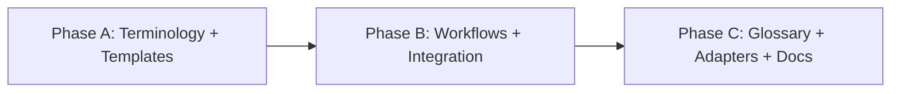

# HL — TFW-46: Evidence Layer

> **Date**: 2026-07-07
> **Author**: Coordinator (Antigravity, Claude Opus 4.6)
> **Status**: ✅ HL_APPROVED

---

## 1. Vision
TFW tasks close with proof that the work actually works in real conditions — not just that tests pass or code compiles. Every task produces an Evidence section where the executor demonstrates observable outcomes in a live environment (browser, device, deployed service, rendered document, running query), and the coordinator designs upfront what constitutes sufficient proof. Self-deception is structurally hard because evidence requires real artifacts — screenshots, logs, command output, URLs visited — not synthetic proxies.

**Impact:** The gap between "RF says done" and "actually works for the user" closes. Reviewers verify evidence, not just claims. Knowledge of what was really tested compounds across tasks. New agents inherit a culture of honest verification.

> "I trusted the agent. It said everything passed. I deployed and it didn't work. That's happened too many times." — Stakeholder, 2026-07-07

## 2. Current State (As-Is)

### What exists today

| Aspect | Current state | Problem |
|--------|--------------|---------|
| RF §4 Verification | `lint: OK, tests: OK, verify: OK` | Synthetic — build tools can pass while real behavior fails |
| RF §3 Acceptance Criteria | Checkmark list with prose descriptions | Claims without proof artifacts — reviewer trusts text |
| Handoff workflow | Steps 9-10: run tests, build gate | No step for live verification after tests pass |
| Review workflow | Trust Protocol checks "Tests pass" and "File modified" | No protocol for checking live evidence |
| TS template | AC items have `Gate: {how to verify}` | Gates are aspirational text, no enforcement that gates were actually exercised |
| A mobile testing project (ad-hoc) | Full evidence system: `testing/`, `runs/`, `STATUS.md`, `evidence/`, `raw/` | Works brilliantly but project-specific; not in TFW |
| A multi-service project (Phase A) | AC-11 marked 🟡 CL-gate (needs real deploy + Telegram test) | Executor honestly deferred but 10 other ACs "passed" with harness, not live |
| Other projects | Backend API project: ad-hoc browser scripts. Blog: no evidence of rendered page. HR/tenders: no verification trail | Pattern: end-of-task live verification is missing or ad-hoc |

### Root cause
TFW's execution pipeline stops at "tests pass + RF written." The last mile — actually deploying/running/opening/viewing the result in real conditions — is unstructured. Agents optimize for RF completion, not for real-world verification. The reviewer has no evidence artifacts to check.

## 3. Target State (To-Be)

### 3.1 Result Visualization

**Before → After:**

| Stage | Before (today) | After (with Evidence) |
|-------|----------------|----------------------|
| **TS writing** | AC + Gate text | AC + Gate + **Evidence Plan**: what constitutes proof, what tools/environments are needed |
| **Execution** | Code → tests → RF | Code → tests → **Evidence Collection** → RF |
| **RF writing** | §4 Verification (synthetic) | §4 Verification (synthetic) + **§E Evidence** (real) |
| **Review** | Trust Protocol: re-run tests, check files | Trust Protocol + **Evidence Audit**: verify evidence artifacts exist, match claims |
| **Tooling** | Agent uses whatever tools are available | Agent proactively seeks/configures tools (MCP, browser, CLI) to collect evidence |

**Example: what a reviewer sees after Evidence Layer is live:**

```
## Evidence

| # | AC | What was verified | Environment | Result | Artifact |
|---|----|--------------------|-------------|--------|----------|
| E1 | AC-1 | Login page renders, form submits | Chrome via Playwright, localhost:3000 | ✅ VERIFIED | evidence/login_screenshot.png |
| E2 | AC-2 | Dashboard shows real data from DB | Deployed beta, vpn | ✅ VERIFIED | evidence/dashboard_data.png |
| E3 | AC-3 | PDF export opens in Adobe Reader | Local file, manual | ⏳ DEFERRED (needs user printer) | — |
| E4 | AC-4 | Blog post renders without broken styles | Published URL | ✅ VERIFIED | evidence/blog_rendered.png |

Evidence verdict: 3/4 VERIFIED, 1 DEFERRED (honest, with reason)
```

### 3.2 Value Flow

```
COORDINATOR (TS)                 EXECUTOR (Handoff)                 REVIEWER (Review)
       │                                │                                 │
  Evidence Plan               Evidence Collection                 Evidence Audit
  «What proves it             «Actually do it, capture            «Did the evidence
   really works?»              artifacts, be honest»               actually prove it?»
       │                                │                                 │
  §Evidence in TS ──────────→  §Evidence in RF ──────────────→   §Evidence in REVIEW
  (what to prove,               (what was proven,                  (verified/challenged,
   what tools needed)            with artifacts)                    verdict)
       │                                │                                 │
       └── Proactive tooling ──→ MCP/browser/CLI ──→ evidence/ subfolder (artifacts)
           (coordinator suggests         (executor sets up,
            or executor discovers)        runs, captures)
```

## 4. Phases

### Phase Dependencies



| Phase | Depends on | Shared files | Can run in parallel with |
|-------|-----------|--------------|-------------------------|
| A | Independent | — | — |
| B | A | conventions.md (Phase A modifies §3, §12, §14; Phase B modifies §8) | — |
| C | B | — | — |

### Phase A: Terminology + Templates 🔴

> **Requires:** Independent
>
> **Context for coordinator:**
> 1. conventions.md §3 (Artifact Types) — add Evidence concept
> 2. conventions.md §12 (Safety and Execution Honesty) — extend
> 3. conventions.md §14 (Anti-patterns) — add evidence anti-patterns
> 4. `.tfw/templates/TS.md` — add Evidence Plan section
> 5. `.tfw/templates/RF.md` — add Evidence section
> 6. `.tfw/templates/REVIEW.md` — add Evidence Audit section
> 7. An existing project's testing system for proven patterns (STATUS.md contracts, evidence folders)
>
> **Key decisions:** Terminology (Evidence vs Proof vs Verification), section numbering, evidence status vocabulary (VERIFIED/DEFERRED/BLOCKED/N-A), relationship to existing §4
>
> **Deliverables:**
> 1. Evidence concept in conventions.md §3 (new artifact subsection)
> 2. Evidence honesty rules in conventions.md §12
> 3. Evidence anti-patterns in conventions.md §14
> 4. TS template with Evidence Plan section
> 5. RF template with Evidence section
> 6. REVIEW template with Evidence Audit section

### Phase B: Workflows + Integration 🟡

> **Requires:** Phase A ✅
>
> **Context for coordinator:**
> 1. `.tfw/workflows/plan.md` — coordinator designs Evidence Plan when writing TS
> 2. `.tfw/workflows/handoff.md` — executor collects evidence after tests, before RF
> 3. `.tfw/workflows/review.md` — reviewer audits evidence
> 4. Trust Protocol in review.md — extend for evidence claims
> 5. Tooling proactivity guidance (MCP, browser, CLI)
>
> **Key decisions:** Where evidence collection sits in handoff flow (new Phase 2.5? or Phase 3 extension?), tooling discovery pattern, what coordinator writes vs what executor decides
>
> **Deliverables:**
> 1. plan.md updated — coordinator Evidence Plan step
> 2. handoff.md updated — executor Evidence Collection phase
> 3. review.md updated — reviewer Evidence Audit step
> 4. Trust Protocol extended for evidence

### Phase C: Glossary + Adapters + Docs 🟢

> **Requires:** Phase B ✅
>
> **Context for coordinator:**
> 1. glossary.md — new terms (Evidence, Evidence Plan, Evidence Audit, evidence status vocabulary)
> 2. Adapter copies (antigravity, claude-code, cursor)
> 3. KNOWLEDGE.md — update if needed
> 4. compilable_contract.md — evidence reference format if needed
>
> **Deliverables:**
> 1. Glossary updated with Evidence terms
> 2. Adapter copies synced
> 3. Version bump (0.8.8)
> 4. CHANGELOG entry

## 5. Definition of Done (DoD)

- ✅ 1. Evidence is a defined concept in conventions.md with clear terminology separating it from synthetic verification
- ✅ 2. TS template has an Evidence Plan section where coordinator specifies what live proof is required
- ✅ 3. RF template has an Evidence section where executor records what was actually proven (with artifact references)
- ✅ 4. REVIEW template has an Evidence Audit section where reviewer checks evidence artifacts
- ✅ 5. Handoff workflow includes evidence collection as a distinct step after tests/build gate
- ✅ 6. Plan workflow includes evidence planning when coordinator writes TS
- ✅ 7. Review workflow includes evidence audit in the Verify stage
- ✅ 8. Anti-patterns document evidence-specific violations
- ✅ 9. Glossary defines all new terms
- ✅ 10. Adapters synced, version bumped

## 6. Definition of Failure (DoF)

- ❌ 1. Evidence becomes another checkbox — if evidence section can be filled with "tests pass" without real artifacts, the design failed
- ❌ 2. Evidence is code-only — if the design only works for code tasks (not docs, analytics, design, HR), it violates domain-agnostic principle (F13)
- ❌ 3. Evidence becomes blocking bureaucracy — if trivial tasks (fix a typo) require elaborate evidence rituals, the friction kills adoption
- ❌ 4. Evidence = re-run tests — if evidence doesn't add anything beyond what §4 Verification already captures, it's redundant
- ❌ 5. Existing sections break — if existing RF/TS/REVIEW numbering is disrupted without clear upgrade path

**On failure:** Rethink the integration model. Evidence might need to be a mode (like review modes code/docs/spec) rather than a universal section.

## 7. Principles

1. **Real over synthetic** — Evidence requires observable outcomes in real environments. Mocks, stubs, intercepted calls, and test harnesses are synthetic verification (§4), not evidence. Evidence is what happens when you actually deploy, open, run, send, or view.
2. **Honest incompleteness** — When evidence can't be collected (no device, no deployment, no user), the executor says so explicitly with the reason. `DEFERRED (reason)` is honest; silent omission is a violation.
3. **Coordinator designs, executor collects** — The coordinator (in TS) decides what evidence is needed. The executor decides how to collect it and proactively seeks tools (MCP, browser automation, CLI). The reviewer verifies.
4. **Domain-agnostic by default** — Evidence patterns must work for code (screenshot, log), documents (rendered page, PDF check), analytics (query result), design (visual comparison), HR (published listing), and any other domain.
5. **Proportional to risk** — A typo fix needs minimal evidence (visual diff). A payment system needs exhaustive evidence. The coordinator calibrates via the Evidence Plan.
6. **Tooling proactivity** — Agents should actively seek, discover, and configure tools (MCP servers, browser automation, CLI utilities) that make evidence collection possible without human intervention where feasible.
7. **Artifacts over claims** — Evidence must produce files (screenshots, logs, command output) stored in the task, not prose claims in the RF. "I tested it" is not evidence; a screenshot of the test result is.

## 7.1 Quality Contract

- Evidence section naming and structure MUST be consistent across TS, RF, and REVIEW
- Evidence status vocabulary MUST be fixed (VERIFIED / DEFERRED / BLOCKED / N/A) — no custom statuses
- Domain-specific examples in templates are prohibited — use placeholders that work for any domain
- Evidence folder convention MUST be defined (where artifacts live relative to task folder)

### 7.2 Knowledge Citations

| # | Source | Item | How it applies |
|---|--------|------|----------------|
| K1 | README Values: Honesty Over Convincingness | "AI agents that sound confident while being wrong are more dangerous than agents that refuse to answer" | Core motivation — evidence prevents confident-but-wrong RFs |
| K2 | README Values: Structural Enforcement | "Gates should be structural — file existence, folder structure" | Evidence artifacts as structural proof, not prose claims |
| K3 | philosophy.md F4 | "Structural enforcement beats format enforcement" | Evidence folder with artifacts > evidence checkbox in RF |
| K4 | philosophy.md F21 | "Explicit N/A pattern transforms silent skip → conscious trace" | DEFERRED/N/A evidence statuses follow this pattern |
| K5 | philosophy.md F27 | "Observable progress = stakeholder value. File-by-file appearance in filesystem" | Evidence artifacts appearing in task folder = observable proof |
| K6 | process.md F14 | "Without YAML control files or explicit statuses, agents fast-run every time" | Evidence statuses (VERIFIED/DEFERRED) prevent fast-green |
| K7 | conventions.md §12 | "Never claim something was 'run' or 'tested' outside the session" | Evidence extends this to require proof, not just honest claims |
| K8 | conventions.md §14 | "Executor writes RF before build/lint passes" | Analogous anti-pattern: executor writes RF before evidence collected |
| K9 | D41 (TFW-41) | Requirements-first TS with AC gates | Evidence Plan extends AC gates with live verification requirements |
| K10 | D46 (TFW-38) | Trust Protocol in review | Evidence Audit extends Trust Protocol with evidence-specific verification |
| K11 | philosophy.md F13 | "TFW is domain-agnostic — all examples should use 'decisions, reasoning, knowledge'" | Evidence design must work beyond code |

## 8. Dependencies

| Dependency | Status |
|------------|--------|
| TFW-45 (multi-agent) | ❄️ Frozen — no dependency |
| TFW-44 (coordinator quality gates) | 📝 HL_DRAFT — no direct dependency |

## 9. Risks

| Risk | Probability | Impact | Mitigation |
|------|-------------|--------|------------|
| Evidence section feels redundant with §4 Verification | High | High | Clear terminology: §4 = synthetic (build/test tools), Evidence = real (live environment). Research other projects to validate |
| Template bloat — too many sections | Medium | Medium | Consider merging §4 + Evidence into one section with synthetic/real subsections |
| Domain diversity — what is "evidence" for an HR document? | Medium | High | Research real projects (backend API, blog, tenders, analytics) to build a domain catalog |
| Tooling proactivity is too vague | Medium | Medium | Research MCP patterns, browser automation, provide concrete guidance |
| Executor treats evidence as extra work, shortcuts it | High | High | Anti-patterns + structural enforcement (reviewer gate) |

## 10. RESEARCH Case

### Blind Spots

- What does evidence look like for non-code tasks? We know code (screenshots, logs), but what about HR documents, tenders, design specs, blog posts, analytics reports?
- How do other AI frameworks handle "proof of work"? Is there an industry term or pattern?
- What tooling patterns exist for automated evidence collection (MCP, Playwright, CLI screenshots)?
- How to calibrate evidence proportionality — what heuristic determines "enough evidence" for a given task?

### Hypotheses

| # | Hypothesis | Status |
|---|----------|--------|
| H1 | Evidence can be domain-agnostic with a fixed status vocabulary (VERIFIED/DEFERRED/BLOCKED/N/A) but domain-specific evidence types (screenshot for UI, query result for analytics, rendered page for docs) | ✅ confirmed (iter2) — universal structure, domain-specific medium (visual vs data-plane) |
| H2 | The coordinator can reliably predict what evidence is needed at TS time by analyzing the task domain and AC items | ✅ confirmed, qualified (iter2) — mechanical pattern, Evidence field = guidance with MAY deviate |
| H3 | Existing real-world projects (backend API, mobile testing, multi-service, blog, HR) already contain implicit evidence patterns that can be extracted and generalized | ✅ confirmed (iter1) — mobile testing project mature, backend API ad-hoc, multi-service project honest-deferral, blog source-audit |
| H4 | MCP tools + browser automation + CLI can cover 70%+ of evidence collection without human intervention | 🟡 borderline 60-70% (iter2) — depends on project tooling, DEFERRED/BLOCKED handles the gap |
| H5 | Merging §4 Verification and Evidence into one section (with synthetic/real subsections) is better than two separate sections | ❌ refuted (iter1, confirmed iter2) — different cognitive modes, merging risks conflation |
| H6 | Right naming (Evidence vs Proof vs Attestation vs Acceptance) critically affects agent behavior per D28 | ✅ confirmed (iter1) — "Evidence" triggers "show me artifacts", alternatives trigger wrong framing |
| H7 | External practice (DevOps, QA, compliance, science) has mature "evidence" terminology to borrow | ✅ confirmed (iter1) — validated across 6 disciplines, compliance hierarchy maps to TFW roles |

> **Filter:** Each hypothesis: "If proven false, would our approach change?"
> - H1 false → would need per-domain evidence templates instead of one universal design
> - H2 false → evidence planning would shift to executor autonomy, not coordinator control
> - H3 false → would need to invent evidence patterns from scratch, not extract from practice
> - H4 false → evidence would always require human involvement, changing the workflow design
> - H5 false → keeps §4 and Evidence as separate sections, affecting template design

### Risks of Not Researching

- We might design evidence patterns that only work for code tasks (violating F13 domain-agnostic)
- We might create bureaucratic overhead for simple tasks without understanding proportionality
- We might miss existing tooling that could automate evidence collection
- We might not understand how §4 and Evidence relate, creating confusion or redundancy

### Proposed RESEARCH Focus

1. **Gather**: Scan real-world projects (an existing project's testing system, backend API project, multi-service project, blog TFW-36, HR/tenders if accessible) — extract evidence patterns across domains. What do executors already do at end-of-task? What breaks?
2. **Extract**: Build a domain catalog — for each project type, what constitutes "real" evidence? What tools are used? Where is the synthetic/real boundary?
3. **Challenge**: Test the merged-section hypothesis (§4+Evidence). Test the coordinator-predicts hypothesis. Stress-test against trivial tasks (does evidence become bureaucracy?).

### Why Not Just...?

- Why not just improve §4 Verification? — Because §4 captures tool output (lint, test, build). The gap is between tool output and real behavior. Adding "also check in browser" to §4 conflates two different cognitive modes.
- Why not make Evidence optional? — Because optional = skipped. The mobile testing project pattern proves that mandatory evidence with honest DEFERRED/BLOCKED statuses is more valuable than optional evidence that nobody collects.
- Why not let the executor decide what evidence to collect? — Because without coordinator guidance, executors optimize for speed and skip live verification. The coordinator has the strategic view of what matters.

## 11. Strategic Insights (Planning)

| # | Insight | Category | Source |
|---|---------|----------|--------|
| S1 | User's core pain: agents mark tasks complete based on synthetic verification (tests pass, build OK) but real behavior is broken. This happened "буквально только что" with a multi-service project — harness passes, live Telegram not tested. The frustration is immediate and recurring across projects | stakeholder | User, 2026-07-07 |
| S2 | An existing project's testing system is the proof-of-concept: STATUS.md contracts, PASS/FAIL/XFAIL/XPASS vocabulary, evidence folders with screenshots/logs, anti-self-deception discipline, resumable runs. This was built organically from the same pain. TFW should learn from it, not reinvent | process | User, 2026-07-07 (referenced an existing project's testing system) |
| S3 | User wants agents to **proactively seek and configure tools** (MCP, browser, CLI) to make evidence collection possible. Not just "use tools if available" but "go find/install/configure tools so you CAN collect evidence." This extends the executor role beyond implementation into tooling self-sufficiency | philosophy | User, 2026-07-07 ("тянулись к mcp и тулзам, к их установке настройке поиску или созданию") |
| S4 | User sees evidence as complementary to synthetic testing, not replacing it. "Ближе к концу они [моки] обычно пропадают и вот тут как раз всегда наступают проблемы" — the transition from mocked to real is where things break. Evidence captures this transition explicitly | process | User, 2026-07-07 |
| S5 | Evidence should work across radically different domains — user mentioned "менеджерские, дизайнерские, документы, код, платформы, приложеня, тендеры, HR работа, написание блог постов." This is a design constraint: evidence MUST be domain-agnostic or it fails the positioning | constraint | User, 2026-07-07 |
| S6 | TFW-45 (multi-agent/swarm) is officially frozen. User: "заморозить пока, официально добивать её не будем." This task (TFW-46) is the priority | process | User, 2026-07-07 |
| S7 | A multi-service project's RF is a perfect case study: 10 ACs passed with harness (synthetic), AC-11 deferred to user for live Telegram test. The executor was honest (marked 🟡), but the reviewer has no structural way to verify the other 10 ACs were truly tested beyond harness | domain | A multi-service project's RF, 2026-07-07 |

> **Cross-references**: RF TFW-41 (execution quality gates), D41 (requirements-first TS), D46 (Trust Protocol), an existing project's testing docs, a multi-service project's RF

---

*HL — TFW-46: Evidence Layer | 2026-07-07*
