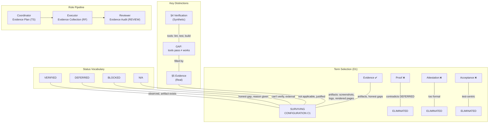

# RES — TFW-46: Evidence Layer (Iteration 1)

> **Date**: 2026-07-07
> **Author**: Researcher (Antigravity, Claude Opus 4.6)
> **Status**: 🔬 RES — Complete
> **Parent HL**: [HL-TFW-46](../../HL-TFW-46__evidence_layer.md)
> **Mode**: Pipeline (deep)

---

## Research Context
TFW tasks close with synthetic verification (lint OK, tests pass, build succeeds) but no structural requirement to demonstrate real-world outcomes. This iteration investigated the terminology question (what to call this layer), domain evidence patterns (what "real evidence" looks like across different project types), and validated the HL's proposed design through dimensional analysis against external precedent and 4 real-world project scans.

## Briefing
See [1_briefing.md](1_briefing.md). Focus: terminology & mentality (H6, H7) + user project pattern extraction (H3). Mode: deep.

## Decisions

| # | Decision | Rationale |
|---|----------|-----------|
| D1 | **"Evidence" is the correct term.** Validated across 6 disciplines (DevOps, QA, audit/compliance, scientific, security/supply-chain, AI agent evaluation). It sits at the right level in the trust hierarchy: stronger than "test result," weaker than "proof." Per D28 (Naming-as-Prompting): "Evidence" triggers "show me artifacts" behavior — which is exactly what the executor should do | Alternatives eliminated: "Proof" contradicts DEFERRED (proof = certainty); "Attestation" contradicts proportional scope (formal ≠ flexible); "Acceptance" triggers test-centric framing and is bureaucratic for trivial tasks. "Verification" is already taken by §4. External: compliance/audit uses "evidence" as raw artifacts supporting a claim — maps to executor collecting artifacts proving AC completion |
| D2 | **4-status vocabulary: VERIFIED / DEFERRED / BLOCKED / N/A.** The testing project's 6-status (PASS/FAIL/XFAIL/XPASS/BLOCKED/SKIP) rejected for TFW Evidence | The testing project's vocabulary is for a *testing system* running against potentially-broken features. TFW Evidence is a *verification layer* confirming completed work. FAIL is structurally irrelevant: if evidence reveals failure, the executor fixes the work and re-collects evidence. XFAIL/XPASS don't apply: completed work shouldn't have "expected failure" scenarios. PARTIAL rejected: slippery slope status that agents would use to avoid commitment — better to split into sub-items (AC-3a VERIFIED, AC-3b DEFERRED) |
| D3 | **Proportional scope, not universal or mode-based.** Coordinator calibrates evidence depth in TS Evidence Plan per task | Universal = bureaucratic for trivial tasks. Mode-based = adds complexity (mode files, selection step) without benefit — evidence is per-AC, not per-task-type. A blog post AC might need both content verification AND visual rendering evidence — modes can't capture this. Proportional lets the coordinator write exactly what matters |
| D4 | **Mixed artifact storage: optional `evidence/` subfolder + inline RF references.** Folder not mandatory | Text evidence (command output, URLs, query results) belongs inline in the Evidence table. Binary evidence (screenshots, logs, exports) goes in `evidence/` subfolder when needed. Many tasks (docs, analytics, config) produce only text evidence — mandatory folder adds unnecessary structure. The testing project uses folders because it has 80 scenarios; TFW tasks typically have 3-8 ACs |
| D5 | **Separate §5 Evidence in RF, not merged into §4 Verification.** Accept renumbering cost (§5-§8 → §6-§9) | Different cognitive modes: §4 = "tools ran OK" (synthetic), §5 = "I observed this in reality" (evidence). Merging risks conflation per HL DoF-4: "if evidence doesn't add anything beyond §4." Per D28: separate heading "Evidence" triggers artifact-collection behavior; subsection "§4.2 Evidence" triggers "another verification step." Renumbering is one-time cost, all references in `.tfw/` files |
| D6 | **Evidence field in TS §5 AC items, parallel to Gate.** Gate = synthetic verification, Evidence = real-world verification | Existing pattern: each AC has a `Gate:` field. Adding `Evidence:` keeps the same cognitive mode (what to verify) with different context (synthetic vs real). Tight coupling: evidence requirement is right next to the AC it verifies. No need for a separate §10 Evidence Plan section — the AC-level integration is cleaner and forces per-AC thinking |
| D7 | **Evidence Audit extends REVIEW §2 Verify and §3 Judge, not a new section.** One new Judge check: "Evidence completeness" | Evidence checking maps to the Verify cognitive mode (checking RF claims against reality). Reviewer already opens files and checks claims in Verify — adding evidence artifact checks is a natural extension. Judge gets check #7: "Evidence completeness — are all AC items covered in Evidence table?" No new template section needed |
| D8 | **Per-template naming preserved: Evidence Plan (TS) / Evidence (RF) / Evidence Audit (REVIEW §2-3).** Three different cognitive modes → three names | Per conventions.md §3 Visual Sections and D39: different cognitive modes → per-template naming. Coordinator designs (Plan), Executor collects (Evidence), Reviewer audits (Audit). Same domain concept, three role-specific actions. Unified name "Evidence" wouldn't capture the role shift |

## Open Questions

| # | Question | Status | Answer |
|---|----------|--------|--------|
| Q1 | Should `evidence/` folder convention be defined (naming, structure)? | Open | Suggested: `evidence/` at task root (single-phase) or `phase-x/evidence/` (multi-phase). File naming: `{AC-N}__{short-description}.{ext}`. Defer details to iter2 or TS |
| Q2 | What anti-self-deception rules should conventions.md §14 include? | Open | Candidates from a project runbook: "VERIFIED without artifact = violation," "Can't verify = BLOCKED, never assumed VERIFIED," "N/A must be justified in Evidence Plan." Defer specifics to iter2 or TS |
| Q3 | How does Evidence Plan interact with handoff.md workflow? | Open | Iter2 focus: where does evidence collection sit in the handoff flow? New step after tests/build? Extension of existing step? |

## Hypotheses (from HL §10)

| # | Hypothesis | HL Status | RES Status | Evidence |
|---|-----------|-----------|------------|----------|
| H1 | Evidence can be domain-agnostic with fixed status vocabulary but domain-specific evidence types | open | 🟡 partially tested | Domain catalog (Gather G4) shows fixed vocabulary works across 8 domains. Full validation needs iter2 with integration design |
| H2 | Coordinator can reliably predict what evidence is needed at TS time | open | 🟡 partially tested | Extract E5 shows Gate/Evidence parallel works. Whether coordinators actually use it well = needs real-task validation |
| H3 | Existing user projects contain implicit evidence patterns | open | ✅ confirmed | 4 projects scanned (Gather G3): a mobile testing project has mature pattern, a backend API project has ad-hoc pattern, a multi-service project has honest-deferral pattern, blog has source-audit pattern. All confirm the gap between synthetic verification and real evidence |
| H4 | MCP + browser + CLI can cover 70%+ of evidence collection | open | ⏳ deferred to iter2 | Iter1 focused on terminology/design, not tooling |
| H5 | Merging §4 + Evidence into one section is better than two separate | open | ❌ refuted | Extract E4 + Challenge C5: merging risks conflation (HL DoF-4), weakens naming signal (D28), blurs cognitive modes. Separate sections preferred |
| H6 | A single term produces correct agent behavior across all TFW roles | open | ✅ confirmed | "Evidence" validated across 6 disciplines + D28 analysis. Per-template naming (Evidence Plan/Evidence/Evidence Audit) adapts the core term to role-specific cognitive modes |
| H7 | Term choice affects agent behavior more than section instructions | open | ✅ confirmed | "Proof" would block DEFERRED (proof = certainty). "Acceptance" triggers test-centric framing. "Attestation" triggers formal/legal framing. "Evidence" triggers "show me artifacts" — exactly right. External research on naming effects in agent evaluation confirms |

## HL Update Recommendations

| # | What to update | Source |
|---|---------------|--------|
| R1 | HL §10 H5: mark as ❌ refuted — separate sections confirmed better than merged | Challenge C5, Extract E4 |
| R2 | HL §10 H6: mark as ✅ confirmed — "Evidence" validated | Gather G2, Challenge C7 |
| R3 | HL §10 H7: mark as ✅ confirmed — naming affects behavior | Gather G2, Challenge C7 |
| R4 | HL §3.1 Phase A deliverable list: add "Evidence field in TS §5 AC items (parallel to Gate)" | Extract E5 (D6) |
| R5 | HL §3.1 Phase A deliverable list: clarify "Evidence Audit extends REVIEW §2-3, not new section" | Extract E7 (D7) |
| R6 | HL §3.1 Phase A: add RF renumbering (§5-8 → §6-9) to key decisions | Extract E4, Challenge C5 (D5) |
| R7 | HL §7 Principles: consider adding "Testing ≠ Evidence" — evidence verifies completed work, not testing known/unknown features | Challenge C2 (testing-vs-evidence distinction) |

## Fact Candidates

| # | Category | Candidate | Source | Confidence |
|---|----------|-----------|--------|------------|
| FC1 | process | A mobile testing project's testing/ system uses a 6-status vocabulary (PASS/FAIL/XFAIL/XPASS/BLOCKED/SKIP) with STATUS.md ledger per run and evidence/ folders — the most mature evidence pattern across real-world projects | Subagent scan, testing project README.md | High |
| FC2 | process | A backend API task found 2 bugs only via live testing (a lazy-loading ORM bug, a CORS header configuration issue invisible to curl) — proving synthetic verification misses a class of real-environment issues | Subagent scan, backend API task RF §9.2, §9.10 | High |
| FC3 | process | Blog TFW-36 had a fabricated AI citation that traversed the entire pipeline (Research→TS→Draft→RF) undetected — caught only by user. Reviewer self-assessed: "I did not verify numbers independently" | Subagent scan, TFW-36 PhaseA RF §8, REVIEW | High |
| FC4 | philosophy | The Evidence → Attestation → Proof hierarchy from security/compliance maps cleanly to TFW's Executor → RF → Reviewer roles: executor collects evidence (raw artifacts), writes attestation (evidence table in RF), reviewer produces verdict (proof) | External research, Gather G1 | High |
| FC5 | constraint | User reports non-code task failures: document rendering (layout shifts, encoding, color issues), Excel (cell sizing, content hidden, wrong colors). Evidence for these = visual confirmation that no automated tool captures | User Q2 answer, Briefing | High |

> fact-candidates: processed 2026-07-07

## Strategic Insights (Research)

| # | Category | Insight | Source | Confidence |
|---|----------|---------|--------|------------|
| SS1 | philosophy | User says "Evidence" as a term "emerged organically during work" — it wasn't intellectually chosen but felt right through practice. Per D28, terms that emerge from usage often produce better agent behavior than terms chosen analytically, because they carry the right associations from real context | User Q1 answer, Briefing | ★★★ |

## Findings Map

## Iteration Status

- **Iteration:** 1 of 2 (min) / 4 (max)
- **Hypotheses tested:** H1 (🟡 partially), H3 (✅ confirmed), H5 (❌ refuted), H6 (✅ confirmed), H7 (✅ confirmed)
- **Hypotheses deferred:** H2 (partially tested — needs real-task validation), H4 (tooling — iter2 focus)
- **Gaps discovered:** Workflow integration details (handoff.md placement), anti-self-deception rules for §14, evidence folder naming convention
- **Superseded decisions:** None

### Open Threads (for next iteration)

| # | Thread | Why it matters | Suggested focus |
|---|--------|---------------|-----------------|
| 1 | H2: Can coordinators reliably write Evidence Plans? | If they can't, evidence planning might shift to executor autonomy | Test against real TS examples — what would an Evidence Plan look like for a multi-service project, a backend API task, TFW-36? |
| 2 | H4: Tooling coverage — what % can be automated? | Determines whether "proactive tooling" guidance belongs in TFW or stays project-specific | Survey MCP tools, Playwright patterns, CLI screenshot tools. What's available out-of-box? |
| 3 | Anti-self-deception rules for conventions.md §14 | Without enforcement, agents will mark VERIFIED without real artifacts | Draft specific anti-patterns from a project runbook adapted for TFW |
| 4 | Evidence folder convention | Need consistent naming if folder is used | Propose naming, decide task-root vs phase-subfolder placement |
| 5 | Handoff workflow integration point | Where does evidence collection sit in handoff.md? | Analyze current handoff.md steps, propose insertion point |

### Recommendation
- [x] **MORE NEEDED** — iter1 established terminology and design architecture. Iter2 should focus on internal synthesis: (a) H2 coordinator prediction test, (b) H4 tooling coverage, (c) workflow integration details, (d) anti-self-deception rules. These are iter2 focus areas per iterations.yaml.

> ⚠️ Coordinator decides whether to continue or proceed. Researcher recommends but does NOT decide.

## Conclusion
Iteration 1 established the core Evidence design through external research across 6 disciplines and internal scanning of 4 real-world projects (mobile testing, multi-service, backend API, blog). The key decisions: "Evidence" is the right term (validated against Proof, Attestation, Acceptance via D28 naming analysis), 4-status vocabulary (VERIFIED/DEFERRED/BLOCKED/N/A) is appropriate because TFW Evidence ≠ testing system, proportional scope beats universal/mode-based, separate §5 Evidence is better than merged §4.2 (different cognitive modes), and Evidence fields in TS §5 AC items create a clean Gate/Evidence parallel. The most valuable discovery was the **testing-vs-evidence distinction**: the testing project's 6-status vocabulary is designed for testing potentially-broken features, while TFW Evidence verifies completed work — a fundamentally different purpose that eliminates 3 statuses (FAIL, XFAIL, XPASS) from consideration. Without this research, the team might have transplanted the testing project's vocabulary wholesale, producing a testing system when what's needed is a verification layer.

---

*RES — TFW-46: Evidence Layer (Iteration 1) | 2026-07-07*
