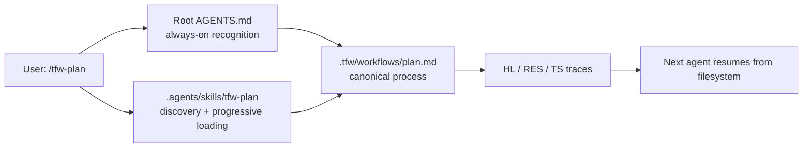

# RF — TFW-47 / Phase B: Codex Adapter + Framework Integration

> **Date**: 2026-07-21
> **Author**: Executor (Codex)
> **Status**: 🟢 RF — Complete
> **Parent HL**: [HL-TFW-47](../HL-TFW-47__codex_adapter_shortcut_skills.md)
> **TS**: [TS Phase B](TS__phase-b__codex_adapter.md)

---

## 1. What Was Done

### New Files

| File | Description |
|------|-------------|
| `.tfw/adapters/codex/README.md` | Normative Codex install/repair contract: `/tfw-*` UX, architecture, full-init vs existing-project detection, safe sync, cleanup, verification, and runtime behavior |
| `.tfw/adapters/codex/AGENTS.md.template` | Marker-bounded always-on TFW recognition and literal slash-command routing block |
| `.tfw/adapters/codex/skills/tfw-*/SKILL.md` (11) | Framework-owned command sources for every canonical TFW workflow |
| `.agents/skills/tfw-*/SKILL.md` (11) | Exact repository-local installed command copies discovered by Codex |
| `evidence/EV__phase-b__codex_adapter.md` | Per-AC evidence record |
| `evidence/codex_adapter_validation.txt` | Adapter invariants, validator output, test result, live Codex observation, and CLI limitation |

### Modified Files

| File | Changes |
|------|---------|
| `AGENTS.md` | Added the current managed TFW command block so Codex recognizes and routes `/tfw-*` immediately |
| `README.md` | Made `/tfw-*` the Codex user contract, updated the adapter entry point and Task Board |
| `.tfw/adapters/README.md` | Defined Codex entry point as root AGENTS plus repository skills |
| `.tfw/conventions.md` | Added the Codex two-layer adapter pattern and cross-tool slash-command contract |
| `.tfw/glossary.md` | Corrected Tool Adapter terminology; removed `$tfw-*`-primary wording |
| `.tfw/quickstart.md` | Added Codex install/repair handoff and corrected the current lifecycle/four-role summary |
| `.tfw/workflows/init.md` | Added Phase 0 full-init vs existing-project attach/repair detection and complete Codex setup verification |
| `.tfw/workflows/update.md` | Added safe command/routing re-sync, marker ownership, legacy cleanup guard, and literal slash smoke test |
| `tasks/TFW-47__codex_adapter_shortcut_skills/phase-b/TS__phase-b__codex_adapter.md` | Recorded the stakeholder-approved correction, expanded ACs, updated DoF and actual scope budget |
| `tasks/TFW-47__codex_adapter_shortcut_skills/phase-b/ONB__phase-b__codex_adapter.md` | Preserved the false start, recorded the stakeholder answer, corrected the research inference, and resumed execution |

### Deleted Files

| File | Reason |
|------|--------|
| `.agents/skills/source-command-tfw-*/SKILL.md` (11) | Deprecated import artifacts duplicated complete, stale workflow bodies and created a second source of truth |

## 2. Key Decisions

1. **`/tfw-*` is the product contract; skills are the Codex implementation.** People
   use the same commands across Claude Code, Antigravity, and Codex. `$tfw-*` and
   `/skills` remain fallbacks, not required TFW syntax.
2. **Codex needs both AGENTS and skills.** Root `AGENTS.md` is always-on recognition and
   fallback routing; `.agents/skills/tfw-*` provides separately discoverable,
   progressively loaded workflows. They solve different layers and are not competing
   adapter options.
3. **The adapter README is an executable contract for Codex.** It tells a future Codex
   instance how to detect state, install, repair, clean, verify, and route commands; it
   does not assume a human will manually copy files correctly.
4. **Init is also an attach/repair boundary.** When TFW traces already exist, `/tfw-init`
   repairs only the adapter and never recreates config, knowledge, tasks, Task Board, or
   the init task. This is how Codex safely joins a project started by another agent.
5. **Managed AGENTS ownership is marker-bounded.** Init/update may replace only the
   `TFW:CODEX` block. All other project instructions are preserved.
6. **Legacy imported workflow snapshots were removed.** `source-command-tfw-*` copied
   entire workflows, had already drifted from the evidence process, and doubled the
   command surface. The current adapter keeps one framework source and one exact
   installed copy.
7. **Historical research was not rewritten.** The old `$`-primary conclusion remains in
   iter2 as a trace; TS §10 and this RF explicitly supersede it using live Codex
   behavior and current official documentation.
8. **`/tfw-task` stays excluded.** It is not registered in `tfw.workflows`, duplicates
   plan/handoff logic, and weakens the mandatory role boundary.

## 3. Acceptance Criteria

- [x] **AC-1:** Codex adapter README and marker-bounded AGENTS template exist with
  installation, existing-project repair, fallback, safety, and `/tfw-*` instructions.
- [x] **AC-2:** All 11 canonical source commands exist, are thin local-workflow routers,
  name their slash command in frontmatter, and pass Codex skill validation.
- [x] **AC-3:** All 11 installed copies are byte-identical to source, are committed,
  and obsolete `source-command-tfw-*` imports are absent.
- [x] **AC-4:** Public README presents Codex as a first-class adapter and uses the same
  `/tfw-*` commands as the other tools.
- [x] **AC-5:** Init and update install/repair commands and managed AGENTS routing while
  preserving existing TFW state, unrelated instructions, and unrelated skills.
- [x] **AC-6:** Glossary and conventions describe the correct Codex adapter layers and
  invocation contract.
- [x] **AC-7:** Live Codex Desktop accepted literal `/tfw-handoff`, entered the matching
  TFW workflow, and exposed the repository-local `tfw-*` skills in the active catalog.

## 4. Verification

- Skill validation: **PASS** — 11/11 source skills pass `quick_validate.py`.
- Source/install equality: **PASS** — 11/11 SHA-256 pairs match; zero mismatches.
- Command registry: **PASS** — source and installed sets match all 11 entries in
  `tfw.workflows`.
- AGENTS ownership: **PASS** — one start marker, one end marker, managed block exactly
  matches the adapter template.
- Legacy cleanup: **PASS** — zero `.agents/skills/source-command-tfw-*` directories.
- Documentation build/tests: **PASS** — 68 tests, exit 0.
- Patch hygiene: **PASS** — `git diff --check` produced no errors.
- Live Codex Desktop: **PASS** — literal `/tfw-handoff TFW-47 phase b` routed to the
  handoff workflow; repo-local `tfw-*` skills were discovered.
- Additional Codex CLI smoke test: **NOT RUN** — the WindowsApps executable was visible
  but child-process execution returned `Access is denied`. The limitation is recorded
  in evidence and does not replace or contradict the observed Desktop result.

## 5. Evidence

See [EV file](evidence/EV__phase-b__codex_adapter.md) for evidence details.

Evidence verdict: 7/7 VERIFIED, 0 DEFERRED, 0 BLOCKED, 0 N/A

## 6. Observations (out-of-scope, not modified)

| # | File | Line(s) | Type | Description |
|---|------|---------|------|-------------|
| 1 | `C:/Users/c0rpa/.codex/skills/tfw-*/SKILL.md` | N/A | ux | User-level TFW skills share names with repository skills, so some selectors may show duplicate entries. They were not deleted because they affect other repositories; prefer repo-local copies and disable global duplicates only after checking those projects. |
| 2 | `.claude/commands/tfw-task.md`, `.agent/workflows/tfw-task.md` | whole files | duplication | The non-canonical `tfw-task` adapters duplicate plan/handoff logic and contain stale instructions. Codex intentionally did not reproduce them; a separate cross-adapter cleanup should decide their removal. |
| 3 | TFW-47 master/phase HL and research iter2 | invocation statements | naming | Approved historical traces still state `$tfw-*` is primary. TS §10 and this RF supersede the claim, but reviewer/docs should decide whether to annotate the older artifacts or preserve them unchanged as history. |

## 7. Fact Candidates

| # | Category | Candidate | Source | Confidence |
|---|----------|-----------|--------|------------|
| 1 | stakeholder | People should use standard `/tfw-plan`, `/tfw-handoff`, and related slash commands in Codex, without learning a tool-specific wrapper. | User, TFW-47 Phase B execution | High |
| 2 | process | Codex initialization must also handle an existing TFW project started by another agent and configure the adapter without resetting project state. | User, TFW-47 Phase B execution | High |
| 3 | philosophy | Adapter cleanliness and usability take priority over preserving redundant Codex adapter files; obsolete duplicates may be removed when their role is understood. | User, TFW-47 Phase B execution | High |

> fact-candidates: processed 2026-07-30

## 8. Strategic Insights (Execution)

| # | Insight | Category | Source |
|---|---------|----------|--------|
| S1 | TFW adapter parity is a behavioral promise, not a file-layout promise. Each tool may implement commands differently, but the human vocabulary and workflow outcomes must remain `/tfw-*` and identical. This should guide all future adapter design. | philosophy | User correction during TFW-47 Phase B |
| S2 | TFW's core product is continuity across agents. Therefore init/update must be migration-aware: joining an existing trace graph safely is as important as bootstrapping a new project. | philosophy | User goal framing during TFW-47 Phase B |
| S3 | Technical documentation must be tested against the active product surface. A negative conclusion from incomplete public docs must not override observed Codex behavior; conflicts should be recorded and resolved in favor of verified environment behavior. | process | User challenge and live Codex evidence |

## 9. Diagrams

---

*RF — TFW-47 / Phase B: Codex Adapter + Framework Integration | 2026-07-21*
