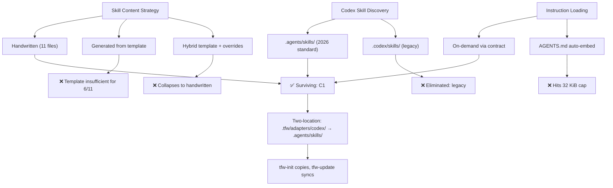

# RES — TFW-47: Codex Adapter Mechanics (Iteration 2)

> **Date**: 2026-07-17
> **Author**: Researcher (Antigravity)
> **Status**: 🔬 RES — Complete
> **Parent HL**: [HL-TFW-47](../../HL-TFW-47__codex_adapter_shortcut_skills.md)
> **Mode**: Pipeline
> **Iteration**: 2 of 2 (min) / 4 (max)

---

## Research Context

Iteration 2 investigated the mechanics of Codex skill discovery, invocation syntax, instruction budget constraints (32 KiB cap), and the tradeoff between generated vs handwritten skill files. The goal was to produce actionable design decisions for HL Phase B (Codex behavior validation) and Phase C (Codex adapter implementation), building on the AFD project's existing Codex skill setup as empirical evidence.

## Briefing

See [1_briefing.md](1_briefing.md). Focus: Codex adapter mechanics — skill discovery, invocation, 32 KiB cap, generated vs handwritten. Hypotheses H3–H7. Parallel with iter1 (evidence template design).

## Decisions

| # | Decision | Rationale |
|---|----------|-----------|
| D1 | **`.agents/skills/` is the canonical Codex skill directory** — not `.codex/skills/` | `.agents/skills/` is the 2026 cross-platform standard. `.codex/skills/` is legacy. AFD already uses `.agents/skills/` successfully. Cross-tool portability with Antigravity (same directory convention). |
| D2 | **All 11 TFW skills are handwritten, not generated from template** | Generic template (789 bytes) cannot express workflow-specific contract clauses needed by 6/11 skills (research: iterations.yaml; config: sync registry; review: verify-claims; handoff: scope guard; update: preserve-customizations; init: missing-.tfw handling). AFD empirically proved this — started with template, replaced all 11 with handwritten versions. |
| D3 | **On-demand instruction loading via skill contract, not AGENTS.md embedding** | 32 KiB auto-embed cap applies only to AGENTS.md cascade. Skill contracts instruct agent to *read* conventions.md/glossary.md/workflows at runtime — bypassing the cap entirely. TFW's AGENTS.md is ~1.8 KB, well under limit. |
| D4 | **`$tfw-*` is the primary invocation syntax; `/tfw-*` works as soft alias** | `$` triggers Codex skill menu or direct skill loading. `/tfw-plan` in message text is matched by the skill's `description` field — a soft alias, not a native slash command. Documentation must be truthful about this distinction. |
| D5 | **Two-location adapter pattern: `.tfw/adapters/codex/` (source) → `.agents/skills/` (installed)** | Consistent with Claude Code (`.tfw/adapters/claude-code/` → `.claude/commands/`) and Antigravity (`.tfw/adapters/antigravity/` → `.agent/workflows/`). Source lives in framework; installed copy lives where tool discovers it. |
| D6 | **Skill structural convention: YAML frontmatter + Contract heading with standard bullets** | All 11 AFD skills follow the same heading structure (frontmatter → title → contract bullets → next-skill recommendation) but differ in content per bullet. This is a convention, not a template — each file is authored individually following the pattern. |
| D7 | **tfw-init installs Codex skills, tfw-update re-copies them** | Same sync mechanism as other adapters. `tfw-init` copies `.tfw/adapters/codex/skills/tfw-*/SKILL.md` → `.agents/skills/tfw-*/SKILL.md`. `tfw-update` re-copies on framework upgrade. Skill folders must be committed to repo (not .gitignored). |
| D8 | **32 KiB cap is a non-issue for TFW — downgrade HL Risk R3** | HL rated this High probability / High impact. With on-demand loading pattern, it has zero impact. The cap only matters if you embed everything in AGENTS.md, which the skill pattern explicitly avoids. |

## Open Questions

| # | Question | Status | Answer |
|---|----------|--------|--------|
| Q1 | Should `.tfw/adapters/codex/` contain the 11 handwritten skills as source files, or just the generic template + README? | Answered | Source files — the template is insufficient (D2). Adapters dir holds the canonical handwritten skills that get copied out. |
| Q2 | Does `tfw-task` (meta-workflow) need a Codex skill? | Open | AFD doesn't have one. Claude Code does. Depends on whether Codex supports multi-stage workflows. Low priority — can be added later. |

## Hypotheses (from HL §10)

| # | Hypothesis | HL Status | RES Status | Evidence |
|---|-----------|-----------|------------|----------|
| H3 | Dedicated Codex skill folders are required for separate visible entries in Codex UI | open | ✅ Confirmed | Web research: skills appear in `$` menu and `/skills` list only if SKILL.md exists in discovery directory. AGENTS.md routing provides behavior but no UI entry. |
| H4 | `AGENTS.md` routing is sufficient for behavior but insufficient for UI affordance | open | ✅ Confirmed | AGENTS.md cascade provides instructions but no skill menu entries. AFD has both — AGENTS.md for rules, `.agents/skills/` for affordance. |
| H5 | Generated shortcut-skill set is safer than maintaining 11 handwritten folders | open | ❌ Refuted | Template cannot express 6/11 workflow-specific contracts (iterations.yaml, scope guard, verify-claims, sync registry, preserve-customizations, missing-.tfw). AFD empirically abandoned generation. Handwritten = more accurate, same maintenance cost via tfw-update re-copy. |
| H6 | `$tfw-plan` is the reliable invocation; `/tfw-plan` may only be user convention | open | ✅ Confirmed | `$` is Codex's native skill trigger. `/tfw-plan` works only because description field matches it — soft alias, not native command. |
| H7 | Codex can load conventions.md on-demand via skill references instead of instruction chain | open | ✅ Confirmed | Skill contract says "load conventions.md" → agent reads file at runtime. 32 KiB cap only applies to AGENTS.md auto-embed. Progressive disclosure: only frontmatter loaded at startup, body + referenced files on trigger. |

## HL Update Recommendations

| # | What to update | Source |
|---|---------------|--------|
| 1 | Phase B deliverables: skill discovery directories confirmed (`.agents/skills/`). Remove "verify" — it's verified. Replace with "document" | D1, F1 |
| 2 | Phase B deliverables: invocation syntax confirmed (`$tfw-*` primary). Remove "verify" — document truthfully | D4, F3 |
| 3 | Phase B deliverables: 32 KiB cap handling confirmed (on-demand loading). Remove as open question | D3, D8, E2 |
| 4 | Phase C deliverables: specify 11 handwritten skills (not generated). Each skill ~1.2 KB | D2, E1 |
| 5 | Phase C deliverables: add `.tfw/adapters/codex/skills/tfw-*/SKILL.md` as source files in adapters dir | D5, Q1 |
| 6 | Risk R3 (32 KiB cap): downgrade from High/High to Low/Low — non-issue with on-demand pattern | D8 |
| 7 | §2 existing constraints: add `.agents/skills/` as standard directory (not `.codex/skills/`) | D1 |
| 8 | §3.1: change adapter table: `.tfw/adapters/codex/` → `.agents/skills/tfw-*/SKILL.md` | D5 |
| 9 | Phase D: add "commit `.agents/skills/tfw-*/` to repo" as explicit step | C3 (Challenge) |
| 10 | Drop `tfw-task` meta-workflow skill from initial scope — add later if needed | Q2 |

## Fact Candidates

| # | Category | Candidate | Source | Confidence |
|---|----------|-----------|--------|------------|
| FC1 | convention | `.agents/skills/` is the 2026 cross-platform standard for Codex skills, replacing legacy `.codex/skills/` | Web research, AFD project | ★★★ |
| FC2 | convention | Codex SKILL.md requires only `name` and `description` in YAML frontmatter; body is loaded on-demand (progressive disclosure) | Web research, Codex docs | ★★★ |
| FC3 | convention | Codex `$` prefix is the native skill invocation; `/` prefix in message text is a soft alias via description matching, not a native slash command | Web research, Codex docs | ★★★ |
| FC4 | architecture | `PROJECT_DOC_MAX_BYTES` = 32 KiB applies only to AGENTS.md auto-embed; file reads during execution are uncapped | Web research | ★★☆ |
| FC5 | process | AFD project has 11 handwritten TFW Codex skills — started with generic template, replaced all with workflow-specific contracts | AFD codebase examination | ★★★ |

> fact-candidates: processed 2026-08-05

## Strategic Insights (Research)

| # | Category | Insight | Source | Confidence |
|---|----------|---------|--------|------------|
| SS1 | stakeholder | User tested Codex skills in AFD before requesting TFW framework support — this is a pull request, not a push. The adapter design is informed by real production use, not speculation | User, briefing Q1 | ★★★ |
| SS2 | philosophy | User wants full workflow parity (all 11 skills) — no "core-only" subset. This reinforces the adapter parity principle (HL §7.8): Codex users deserve the same affordances as Claude Code and Antigravity users | User, briefing Q3 | ★★★ |

## Findings Map

## Iteration Status

- **Iteration:** 2 of 2 (min) / 4 (max)
- **Hypotheses tested:** H3 (✅ confirmed), H4 (✅ confirmed), H5 (❌ refuted), H6 (✅ confirmed), H7 (✅ confirmed)
- **Hypotheses deferred:** None
- **Gaps discovered:** Q2 (tfw-task meta-workflow skill) — low priority, deferred
- **Superseded decisions:** None

### Open Threads (for next iteration)

No open threads. All 5 hypotheses resolved. Remaining question (Q2: tfw-task) is a minor scope decision, not a research question.

### Recommendation
- [x] **SUFFICIENT** — proceed to `/tfw-plan` to update HL and write TS
- [ ] **MORE NEEDED** — N/A
- [ ] **BLOCKED** — N/A

Both iterations (iter1: evidence template, iter2: Codex adapter) together cover all HL §10 hypotheses (H1–H7). The coordinator can merge findings and proceed.

## Conclusion

Iteration 2 resolved all 5 Codex adapter hypotheses (H3–H7) with a clear, evidence-backed design: 11 handwritten skills in `.agents/skills/tfw-*/SKILL.md`, following the 2026 cross-platform standard. The 32 KiB instruction cap — rated as the highest risk in the HL — turned out to be a non-issue because the on-demand skill loading pattern bypasses the auto-embed limit entirely. The AFD project's existing implementation served as empirical proof for every major decision: `.agents/skills/` directory, handwritten over generated, on-demand over embedded. Without this research, the HL would have pursued a generated-template approach and over-engineered 32 KiB workarounds that aren't needed.

---

*RES — TFW-47: Codex Adapter Mechanics (Iteration 2) | 2026-07-17*
