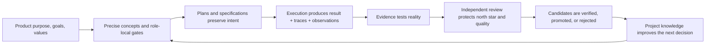
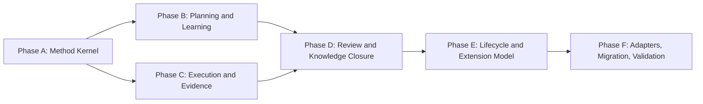

# HL — TFW-48: Value-First Methodology Rebaseline

> **Date**: 2026-07-28
> **Author**: Coordinator (Codex) + User
> **Status**: ✅ HL — Approved
> **Initial approval**: 2026-07-28
> **Research update approved**: 2026-07-29

---

## 1. Vision

TFW has been re-derived from its north star rather than incrementally patched around its current implementation. Its philosophy, terminology, artifacts, workflows, gates, knowledge loop, evidence model, limits, and adapters form one coherent methodology that keeps product purpose, decisions, values, and learning visible across domains.

The resulting framework is smaller where precision and references can replace prose, stronger where a structural gate protects meaning or quality, and adaptable where old numeric constraints were calibrated for earlier models. Its runtime contract is assembled per protected obligation: full local gates for pre-action authority and irreversible boundaries, canonical ownership plus observable point-of-use enforcement elsewhere, local proof for every deliverable, and seam or live proof only when the claim triggers it. Research-strategy selection remains outside this release because H4 has no causal result; the current comparative research procedure remains one named operational method, not a universal claim. A new agent can understand what matters, challenge a plan against the product's goals, complete the work honestly, and leave better project memory than it inherited.

**Impact:** Human and AI team members spend less context on duplicated or obsolete instructions, preserve more product meaning across role and session boundaries, catch deviations earlier, and convert production experience into reusable project knowledge without turning the knowledge base into noise.

> "The methodology keeps us aligned with what the product is for, not merely with what the current files happen to say."

## 2. Current State (As-Is)

### 2.1 What already works and must be preserved

| Capability | Proven value |
|------------|--------------|
| Filesystem traces | A new human or agent can resume from task artifacts instead of reconstructing expired conversations |
| Separate Coordinator, Researcher, Executor, Reviewer roles | Cognitive modes and quality responsibilities are visible and harder to collapse into self-review |
| Staged RESEARCH and REVIEW | Forced mode transitions reveal alternatives, contradictions, and unsupported claims |
| Requirements-first TS | Executors receive outcomes and gates instead of copy-ready implementation |
| Project Values and Knowledge Citations | Decisions can be connected to accumulated architecture, principles, conventions, and facts |
| Evidence layer | Real-environment observation is distinguished from tests, builds, and confident assertions |
| Knowledge consolidation | Fact Candidates can become verified project memory instead of disappearing with a session |
| Tool-agnostic Markdown core | Project knowledge remains portable across agents, editors, and vendors |

The task is not a rewrite from zero. These are production-earned capabilities. The rebaseline must explain why each survives, simplify its mechanism where possible, and strengthen the places where the intended behavior still fails.

### 2.2 Framework growth and instruction pressure

| Measure | Current value | Signal |
|---------|---------------|--------|
| Markdown files under `.tfw/` | 54 | The normative surface is broad enough that ownership and loading paths matter |
| Total `.tfw/` Markdown words | 36,591 | Reference, runtime instruction, history, and templates are mixed in one overall context estate |
| `conventions.md` | 3,871 words / 508 lines | A universal rules file has become a large multi-purpose registry |
| `glossary.md` | 2,922 words / 269 lines | Terminology is valuable, but definitions and operational explanations are not always cleanly separated |
| `workflows/init.md` | 1,451 words | Exceeds the framework's own ≤1,200-word workflow design rule |
| `workflows/handoff.md` | 1,261 words | Exceeds the same rule |
| `workflows/plan.md` | 1,205 words | At the limit before this task adds any further gates |

Prior cleanup tasks reduced local duplication, but the framework continued to grow through new quality mechanisms. The remaining problem is not only repeated text. It is whether each instruction has the correct semantic owner, is loaded at the right time, and still earns its place for current models.

### 2.3 Limits calibrated for earlier agents

TFW contains file, LOC, modified-file, iteration, pass, query, verification-ratio, word-count, knowledge-size, and other numeric limits. Some are safety boundaries, some are quality heuristics, and some are historical calibration values. The current system often presents them with similar authority.

Modern agents follow explicit numbers more reliably than earlier agents, which amplifies both good and obsolete constraints. A stale limit can cause mechanical phase splitting, premature research closure, arbitrary pruning, or work optimized for the metric rather than for product value. Conversely, removing a real safety or attention boundary without evidence can reintroduce scope explosion and shallow review.

The framework currently lacks a universal classification that distinguishes:

1. invariant safety or trace requirements;
2. structural quality gates;
3. model- and task-sensitive heuristics;
4. project-specific calibration;
5. historical metrics that should no longer govern behavior.

### 2.4 Production evidence from Atamat, Helpdesk, and AFD

The three production projects provide a substantial longitudinal corpus across different model-capability eras:

| Project | TFW version | Task directories | Trace Markdown artifacts | Claude memory files |
|---------|-------------|------------------|--------------------------|---------------------|
| Atamat | 0.8.5 | 44 | 660 | No matching personal-memory directory found in the initial scan |
| Helpdesk | 0.8.7 | 30 | 422 | 15 |
| AFD | 0.9.0 | 40 | 648 | 68 |

The user reports that Atamat was produced with weaker models than Helpdesk, while AFD was produced with stronger models than Helpdesk. This sequence makes it possible to test whether repetition and inline explanation are enduring execution requirements or compensations for earlier models. Model capability is a comparison variable, not an excuse to assume that references now work: the research must inspect actual traces and replay representative gates.

Recurring Helpdesk failures concentrate at the intent-to-specification boundary:

- a TS named paths, types, functions, or structures that did not match the real project;
- tests were omitted when the TS did not require them explicitly;
- implementation-heavy TS text encouraged copying without solving the UX or product requirement;
- splitting one product vision across multiple phases lost original deliverables and shipped infrastructure before user value.

Recurring AFD failures concentrate at the specification-to-reality and review boundaries:

- a reviewer approved work consistent with TS and RF while it violated the project's single-registry north star;
- a cited source was ported incompletely because review checked the TS but not the cited system;
- stale test outputs and a command that never ran were mistaken for reproduced evidence;
- synthetic seeders proved the expected contract while an honest live fleet immediately exposed P0/P1 failures;
- important working rules first appeared in personal Claude memory and only some were later promoted into repository knowledge.

These cases show that compliance with the current artifact chain is necessary but insufficient. TFW must preserve the product's meaning across the chain and make learning from reality part of the chain itself.

### 2.5 Implementation-led drift

| Drift | Consequence |
|-------|-------------|
| New failure → new field, checklist, or paragraph | Instruction volume grows faster than conceptual clarity |
| A rule is repeated inline everywhere to ensure compliance | Single Source of Truth conflicts with enforcement, and updates gain a large blast radius |
| A reference replaces too much local context | Agents miss the rule because the step is no longer self-contained |
| Project-specific needs modify framework files | `tfw-update` must merge local policy with upstream methodology |
| Personal memory compensates for missing repository knowledge | Portability and session independence become weaker than advertised |
| Review is contract-centered | A clean TS→RF chain can still violate product values, cited sources, or reality |
| Code and development examples dominate | The public claim of domain independence becomes weaker in actual agent behavior |

### 2.6 One research algorithm for different kinds of uncertainty

The current research architecture varies intensity through `focused` and `deep` modes, but keeps one dominant cognitive path: Briefing → Gather → Extract → Challenge, with Dimensions → Configuration Space → Consistency Check embedded in the investigation. This is effective for comparing alternatives and selecting a viable configuration. It is not a natural fit for every research intent.

| Research intent | What the work actually needs | Risk of forcing the current comparison path |
|-----------------|------------------------------|---------------------------------------------|
| Targeted information search | Locate, validate, and synthesize specific facts or sources | Invented alternatives and unnecessary comparison machinery |
| Documentation or codebase immersion | Build an accurate mental model, vocabulary, topology, and unknowns | Premature solution selection before orientation is complete |
| Diagnostic investigation | Trace symptoms, causal mechanisms, and disconfirming evidence | Comparing options before establishing the root cause |
| Case-study review, including a possible Yin-style approach | Triangulate multiple evidence sources around a bounded case and preserve context | Flattening a case into decontextualized alternatives |
| Design or policy choice | Compare dimensions, eliminate incompatible combinations, select a configuration | Current approach is naturally aligned |

TFW currently conflates **research intensity** with **inquiry logic**. Adding more `focused/deep` values cannot express a qualitatively different way of thinking. Conversely, loading a large catalog of methods into every research session would violate Progressive Disclosure and encourage cargo-cult use of named methods.

The rebaseline must investigate a minimal selection model. A candidate distinction is:

- **Research Intent** — what uncertainty must be resolved;
- **Inquiry Strategy** — how evidence will be gathered and transformed;
- **Research Intensity** — how much depth, iteration, and verification is warranted.

These names and boundaries remain research vocabulary, not approved framework terms. Iterations 1–2 produced no causal H4 result because no comparison execution was authorized. TFW-48 therefore does not implement a strategy selector, strategy catalog, or cognitive-strategy extension contract. It will make the scope of the current comparative procedure explicit, keep intensity controls from masquerading as method evidence, and avoid coupling the method kernel to a claim that one research procedure is universal. A separately authorized future task may revisit strategy selection using the recorded H4 owner package.

### 2.7 Prior attempts and inherited scope

TFW-48 succeeds and supersedes the unfinished intent of:

- **TFW-4** — early framework cleanup and deduplication, constrained by fear of broad compatibility changes;
- **TFW-44** — coordinator quality gates, a local response to insight loss at the HL→TS boundary.

It also builds on completed TFW-25 (values consolidation) and TFW-29 (consistency audit). Their traces remain historical evidence; they are not rewritten. TFW-48 may reverse or replace their implementation decisions when current evidence and the north star justify it.

Relevant open tech debt includes instruction growth, positional step numbering, ambiguous knowledge naming, overlapping init steps, stale adapters, incomplete EV registration, and high-blast naming decisions previously deferred on cost grounds. “High blast radius” is now an implementation concern to plan for, not a reason to preserve a weaker methodology.

## 3. Target State (To-Be)

### 3.1 Result Visualization

Six months after the rebaseline, a new product team opens TFW and sees a short, coherent contract:

```text
WHAT TFW PROTECTS
  Product purpose · values · decisions · alternatives · evidence · learning
                              │
                              ▼
HOW TFW WORKS
  Plan → Investigate when uncertain → Specify outcomes → Execute → Observe reality
                              │
                              ▼
HOW TFW LEARNS
  Signals → Fact Candidates → Verification → Project Knowledge → Better next decision
                              │
                              ▼
HOW TFW STAYS HONEST
  Independent review checks the product north star, cited sources, delivered result,
  and real evidence — not only whether TS and RF agree with each other
```

The user does not need to know which past incident created a rule. The right term and the right gate cause the right behavior. A workflow loads only the framework DNA required for its role, follows precise references for supporting material, and records an explicit decision when something does not apply.

Before and after:

| Before | After |
|--------|-------|
| Implementation structure implicitly defines the methodology | Values and success criteria explicitly justify the structure |
| Numeric limits appear uniformly authoritative | Limits are classified as invariants, gates, adaptive heuristics, project calibration, or retired history |
| More failures tend to create more instructions | Failures first refine terminology, ownership, structure, or evidence; prose is the last resort |
| Review proves conformance to TS/RF | Review also protects product purpose, Project Values, cited sources, and reality |
| Fact Candidates depend heavily on template compliance | A defined learning loop captures high-value signals, verifies them, routes them, and prunes noise |
| The comparative research procedure can appear universal because `focused/deep` changes effort but not inquiry logic | The current procedure is explicitly scoped as one operational method; no strategy selector or catalog ships without causal H4 evidence |
| Project policy often patches `.tfw/` core | Universal method and project extensions have an explicit boundary |
| Code examples dominate many quality rules | Product, research, operations, documents, design, and code use the same semantic contract |
| High blast radius blocks correction | Breaking improvements ship with an explicit migration and validation path |

### 3.2 Value Flow



| Step | Input | Transformation | Value Created |
|------|-------|----------------|---------------|
| Orient | Product purpose and Project Values | Select the applicable north-star constraints | Work starts from meaning, not inherited implementation |
| Frame | Uncertainty and desired outcome | Convert intent into precise concepts, hypotheses, and requirements | Agents reason about the right problem |
| Act | Approved outcome contract | Produce the result within role and scope boundaries | Complete output without coordinator-authored implementation |
| Observe | Tests, live behavior, user feedback, deviations | Separate assertions from evidence and extract high-value signals | Reality can correct the plan |
| Judge | HL, values, citations, TS, RF, result, evidence | Independent comparison across all authorities | Cleanly documented wrong work does not pass |
| Learn | Findings and Fact Candidates | Verify, route, consolidate, and prune | Knowledge compounds without becoming a scrapbook |

## 4. Phases

The phase model is provisional until RESEARCH maps dependencies and file ownership. Research may merge, split, or reorder phases, but it must preserve the value boundaries below.

### Phase Dependencies



| Phase | Depends on | Shared files | Can run in parallel with |
|-------|------------|--------------|-------------------------|
| A | Independent | `README.md`, `.tfw/README.md`, `conventions.md`, `glossary.md` | — |
| B | A | `conventions.md`, `glossary.md`, planning/research templates | C after A contracts stabilize |
| C | A | `conventions.md`, `glossary.md`, TS/RF/evidence contracts | B |
| D | B + C | `conventions.md`, REVIEW/knowledge contracts | — |
| E | D | `project_config.yaml`, conventions, lifecycle workflows | — |
| F | E | adapters, root entry points, migration docs, version files | — |

### Phase A: Re-derive the Method Kernel 🔴

> **Requires:** Approved master HL and completed research.
>
> **⚠️ Shared files with all later phases:** `.tfw/conventions.md` and `.tfw/glossary.md`.
>
> **Context for coordinator:** both README files; Project Values Index; TFW-25, TFW-29, TFW-4, and TFW-44 traces; research decisions from TFW-48.
>
> **Key decisions:** implement the approved M5-derived object grammar; define the value hierarchy, K3 semantic kernel, rule locality, and protected behavioral invariants before editing workflows.
>
> **Deliverables:**

1. Reconcile the root README product promise with `.tfw/README.md` philosophy and Success Criteria.
2. Define the compact K3 method kernel: product purpose and applicable Project Values, lifecycle/role authority, evidence precedence, independent judgment, and visible learning disposition.
3. Establish one precise term for each distinct concept and one canonical owner for each definition.
4. Define the M5-derived object grammar: one-or-more rule records, event-triggered learning transactions, zero-or-more independent project-extension records, and one-or-more proof records selected per claim.
5. Define rule deployment by protected consequence and observability; retain complete local imperatives for role, safety, destructive, and irreversible pre-action boundaries.
6. Adopt the numeric lifecycle and provisional restore-owner-or-retire ledger before changing or replacing any value.

### Phase B: Planning, Research, and the Learning Loop 🔴

> **Requires:** Phase A ✅
>
> **⚠️ Shared files with Phase D:** knowledge and Fact Candidate contracts.
>
> **Context for coordinator:** Helpdesk intent-to-TS failures; TFW knowledge pipeline decisions D22/D37/D43; TFW-44 insight traceability gap; Claude-memory-to-repository examples.
>
> **Key decisions:** preserve strategic meaning across planning; explicitly scope the current comparative research procedure without adding an unvalidated strategy system; improve candidate quality and routing without multiplying sections.
>
> **Deliverables:**

1. Refactor planning and research instructions around purpose, uncertainty, applicable Project Values, and decision quality.
2. Preserve Briefing → Gather → Extract → Challenge as a named comparative decision procedure, simplifying it only where evidence permits and avoiding claims that it fits every inquiry.
3. Record H4 as unresolved and preserve only the T0 desk protocol/owner package. Do not add strategy-selection terms, runtime selection, a catalog, or a strategy extension mechanism in TFW-48.
4. Reassess research iterations, pass limits, question caps, web/file caps, and stop conditions through the numeric lifecycle rather than replacing old anchors with larger ones.
5. Define event-triggered learning transactions with disposition-typed receipts: reject/local needs state and reason; promote/merge/derive needs destination and actor; defer needs destination or due event and actor.
6. Capture user corrections, production surprises, failed assumptions, and model-discovered patterns without producing filler candidates or routing every artifact centrally.
7. Resolve TFW-44's insight-to-outcome gap through the smallest effective structural path.

### Phase C: Specification, Execution, and Evidence 🔴

> **Requires:** Phase A ✅
>
> **⚠️ Shared files with Phase D:** evidence status and authority definitions.
>
> **Context for coordinator:** Helpdesk TS precision/requirements/test failures; AFD honest-fleet and aggregate-verification failures; Evidence decisions D52/D53.
>
> **Key decisions:** requirements remain WHAT, technical guidance remains adaptable, and claim-typed evidence proves the intended product behavior rather than a convenient proxy.
>
> **Deliverables:**

1. Strengthen intent-to-TS traceability without turning TS into implementation or a compliance encyclopedia.
2. Make code identifiers, cited systems, tests, product outcomes, and evidence plans precise when applicable and explicitly N/A otherwise.
3. Reassess scope budgets and phase-splitting behavior against modern agent capability and the risk of product-value fragmentation.
4. Simplify execution branches while preserving role lock, onboarding, deviation reporting, and complete output.
5. Require local proof for every claimed deliverable; add interface/seam proof, stakeholder/live proof, or explicit value debt with owner, due event, evidence route, and non-claim when triggered.
6. Align synthetic verification, real evidence, attestation, provenance, and deferred validation into one honest hierarchy.

### Phase D: Review and Knowledge Closure 🔴

> **Requires:** Phase B ✅ and Phase C ✅
>
> **Context for coordinator:** AFD reviewer principle failure, cited-source omission, stale-test-output approval, Helpdesk end-to-end regressions, Project Values cascade.
>
> **Key decisions:** reviewer authority includes the product north star and reality; proof obligation is independent of artifact count; agreement among planning artifacts cannot legitimize a shared mistake.
>
> **Deliverables:**

1. Refactor review so it compares purpose, Project Values, cited sources, TS, implementation/output, RF, and evidence.
2. Preserve independent investigative judgment while allowing compact, risk-expanded, or grouped review packaging around the same local/seam/live proof obligations.
3. Make review findings feed the learning loop and distinguish immediate correction, verified knowledge, roadmap, and genuine debt.
4. Reassess the current docs/knowledge split, Fact Candidate locations, consolidation interval, and noise controls.
5. Define closure that leaves the project more legible and knowledgeable, not merely status-complete.

### Phase E: Lifecycle, Limits, and Project Extensions 🟡

> **Requires:** Phase D ✅
>
> **Context for coordinator:** init/update state contamination history; AFD project-specific runtime evidence ladder and TS identifier audit; config sync experience; Helpdesk on 0.8.7 vs AFD on 0.9.0.
>
> **Key decisions:** project-specific policy must be first-class without forking the universal method; extension discovery and drift must be observable; config values must not masquerade as universal truth.
>
> **Deliverables:**

1. Refactor init, resume, docs, knowledge, config, update, and release flows against the new kernel.
2. Define registered project extensions with semantic owner, source/version, precedence/conflict behavior, consumers, freshness evidence, and unsupported/migration behavior.
3. Resolve every provisional numeric object through restore owner/consumer or retire normativity before any exact calibration; separate boundaries, triggers, warnings, sampling defaults, targets, and measurements.
4. Make configuration and extension consumption observable; simplify propagation and remove incomplete registries, obsolete branches, overlaps, and positional numbering.
5. Reconcile open tech debt and explicitly supersede TFW-4 and TFW-44 without rewriting their traces.

### Phase F: Adapters, Migration, and Production-Case Validation 🟡

> **Requires:** Phase E ✅
>
> **Context for coordinator:** all approved contracts; adapter parity decision D54; Atamat, Helpdesk, and AFD read-only regression corpus spanning different model-capability eras.
>
> **Key decisions:** behavioral parity across tools matters more than identical file layouts; migration must be executable and evidence-backed.
>
> **Deliverables:**

1. Synchronize all supported adapters and root entry points without duplicating workflow bodies.
2. Provide a migration path for existing projects, including project customizations and historical references.
3. Validate the rebaseline against selected Atamat, Helpdesk, and AFD success/failure scenarios plus at least one non-code product scenario.
4. Verify reference integrity, task resumption, knowledge capture, evidence, and review behavior end to end.
5. Publish measured before/after instruction, branching, reference, and behavioral coverage results; define post-change signals for overhead, missed seams, learning closure, and extension drift; prepare the appropriate breaking release.

## 5. Definition of Done (DoD)

- ✅ 1. Every retained universal mechanism maps to at least one TFW value or Success Criterion and to a concrete behavior it protects.
- ✅ 2. The two README files express one compatible product promise: TFW preserves product purpose, decisions, evidence, and learning across humans, agents, sessions, tools, and domains.
- ✅ 3. Each normative concept has one precise definition and one semantic owner; other occurrences are either role-local enforcement or resolvable references.
- ✅ 4. Every numeric control is typed and has a semantic owner, observed consumer or enforcement point, counting rule, breach response, override authority, and restore-or-retire disposition. No unsupported target or measurement silently behaves as a hard boundary.
- ✅ 5. The ≤1,200-word workflow rule, 700–900-word target, research pass/iteration controls, knowledge-size values, scope budgets, and other active numbers are restored to a defined construct or lose normativity; no replacement value is invented from observed breaches or model growth alone.
- ✅ 6. Planning preserves user insights, product requirements, applicable Project Values, and uncertainty through to verifiable specification elements without embedding ready-made implementation.
- ✅ 7. The implemented architecture follows the M5-derived object grammar and preserves K3's five semantic obligations without requiring one global light/heavy mode or uniform staged artifact volume.
- ✅ 8. H4 remains explicitly unresolved. TFW-48 ships no cognitive-strategy selector, catalog, runtime strategy choice, or strategy-extension contract; the dated T0 owner package remains a separate future decision.
- ✅ 9. The current comparative research procedure is named and scoped as one operational method. `focused/deep` remains an intensity control and is not presented as evidence that the procedure fits every inquiry.
- ✅ 10. Learning entry is event-triggered; every selected signal receives a disposition-appropriate receipt, while rejected and task-local information does not create unnecessary central ceremony.
- ✅ 11. Review can reject work that satisfies TS/RF but violates the product north star, Project Values, cited sources, delivered reality, evidence honesty, or an adjacent seam.
- ✅ 12. Every claimed deliverable has local proof; crossed interfaces/sources and stakeholder/live claims add seam or live proof, and honest deferral creates explicit value debt with owner, due event, evidence route, and non-claim.
- ✅ 13. Scope and phase guidance supports modern models without encouraging scope explosion or fragmenting one product outcome into low-value plumbing phases.
- ✅ 14. The universal methodology remains genuinely domain-agnostic in language, examples, templates, evidence, and review; code is one application, not the default meaning of work.
- ✅ 15. Project-specific rules and calibration use an observable registered-extension lifecycle—owner, source/version, precedence/conflict, consumers, freshness, and migration behavior—without silent edits to upstream framework semantics.
- ✅ 16. Obsolete branches, overlaps, positional numbering, duplicate instructions, stale adapters, and open relevant tech debt are removed or resolved with traceable rationale.
- ✅ 17. Atamat, Helpdesk, and AFD scenario validation demonstrates no loss of proven behavior, distinguishes model-era effects from framework invariants, and shows improved handling of intent loss, source divergence, false evidence, value violations, and knowledge promotion.
- ✅ 18. Existing projects have a complete migration path; historical task artifacts remain intact; TFW-4 and TFW-44 are explicitly superseded.
- ✅ 19. Before/after evidence reports instruction volume, loading paths, branch count, limit decisions, reference integrity, and behavioral scenario outcomes. Compression is an outcome of clearer ownership, not a quota.

## 6. Definition of Failure (DoF)

- ❌ 1. The refactor optimizes file count, line count, or word count while weakening traceability, independent review, evidence, or project learning.
- ❌ 2. Current implementation structure is treated as proof of what TFW should mean.
- ❌ 3. Stronger current models are used as justification to remove safeguards without scenario evidence or a fallback for capability variation.
- ❌ 4. New universal rules are copied from one project's memory or conventions without a cross-domain applicability test.
- ❌ 5. Numeric limits are merely raised; their purpose, authority, and interaction with model behavior remain unclear.
- ❌ 6. Review remains limited to TS acceptance criteria and RF claims.
- ❌ 7. Fact Candidates produce content because a section exists rather than because the information would change a future decision.
- ❌ 8. Personal Claude memory remains a required hidden dependency for resuming or operating a project.
- ❌ 9. Code, software architecture, tests, or deployment become the implicit default for product value, evidence, or task design.
- ❌ 10. Breaking changes ship without migration, adapter parity, reference validation, and production-case regression checks.
- ❌ 11. Historical artifacts are rewritten to make the new design appear inevitable.
- ❌ 12. The result adds another conceptual layer or document that duplicates an existing owner instead of simplifying the method.
- ❌ 13. The current comparative research procedure is described as universally suitable, or `focused/deep` intensity is presented as evidence that it fits every inquiry.
- ❌ 14. The strategy system becomes a catalog of prestigious method names without situation triggers, evidence operations, outputs, or stop criteria.
- ❌ 15. Every Researcher loads every cognitive strategy, replacing one monolith with a library-shaped monolith.
- ❌ 16. A strategy extension architecture is added because it sounds cognitively plausible, without evidence that matched operational guidance changes model behavior or outcome quality.
- ❌ 17. A complete method configuration can claim a deliverable without local proof, or claim a crossed source/interface/live outcome using local proof alone.
- ❌ 18. A project extension is “registered” only as passive metadata, with no observable discovery, precedence conflict, freshness, consumer, or migration behavior.

**On failure:** Stop the affected phase, restore the last approved contract, record which value or production scenario regressed, and return to research or phase planning. Do not compensate for a semantic failure by adding more prose.

## 7. Principles

1. **Purpose Before Process** — product purpose, goals, stakeholders, and values decide what the workflow must protect; the current workflow does not define its own justification.
2. **Meaning Is the Product** — code, documents, analysis, operations, and design are outputs; the durable asset is the trace of why, what was learned, and how reality changed the decision.
3. **Preserve Proven Outcomes, Not Accidental Ceremony** — role separation, traces, investigation, evidence, and learning are protected; their current fields, step numbers, and file boundaries are negotiable.
4. **Precision Compresses Context** — prefer a correct term, clear owner, and natural structural dependency over repeated explanation.
5. **Structural Gates for Invariants, Judgment for Context** — enforce what must never drift; avoid pretending that every risk can be managed by a universal number or checkbox.
6. **Reality Can Overrule the Plan** — evidence, production behavior, and valid user correction may refute HL, TS, RF, or accumulated knowledge.
7. **Independent Review Protects the North Star** — the reviewer is not a consistency checker for documents; it is the last quality authority before project learning and closure.
8. **Learning Must Become Portable** — useful session and personal-memory insights must enter repository-native verification and knowledge paths or remain explicitly non-authoritative.
9. **Domain-Agnostic by Design** — every universal concept must work for product strategy, research, operations, documents, design, education, and code.
10. **Breaking Change With a Bridge** — broad improvement is allowed; migration, reference integrity, and real-project validation are mandatory.
11. **Human Chooses, Framework Clarifies** — TFW exposes alternatives, consequences, and evidence; it does not hide meaningful decisions behind automatic policy.
12. **No Arbitrary Compression Target** — measure reduction, but judge success by semantic ownership, behavioral coverage, and user value.
13. **Method Claims Need Evidence** — different inquiry structures may fit different uncertainties, but TFW does not claim or automate strategy selection from plausible names alone.

## 7.1 Quality Contract

- Each Phase TS must copy the applicable principles from §7 and map them to Acceptance Criteria.
- Every removal must state whether the content is obsolete, moved to a canonical owner, replaced by a more precise term, or covered by a stronger structural mechanism.
- Every new instruction must name the failure it prevents and why a reference, template affordance, or existing gate is insufficient.
- Every retained numeric control must identify its semantic type, owner, consumer/enforcement observation, counting rule, breach response, override authority, evidence, and recalibration or retirement path.
- Every rule record must identify its protected consequence, semantic owner, point-of-use cue or gate, authority/exception, and provenance/freshness. Pre-action role, safety, destructive, and irreversible boundaries retain complete local imperatives.
- Every claimed deliverable requires local proof. A crossed source/interface or stakeholder/live claim adds its own proof record; deferred proof requires explicit value debt with owner, due event, evidence route, and non-claim.
- Every selected learning signal needs a disposition-typed receipt; a project extension needs an independent, observable lifecycle. Neither requires routing every artifact through a central registry.
- TFW-48 must not add a cognitive-strategy selector, catalog, or strategy extension contract while H4 remains unresolved. Any future proposal must return through a separately approved evidence and planning gate.
- Every generalized Atamat/Helpdesk/AFD lesson must pass the non-code scenario test.
- Every project-specific exception must stay outside the universal kernel unless multiple independent contexts justify promotion.
- Every phase that changes a canonical concept must scan all workflows, templates, adapters, config registry entries, documentation contracts, and active references that consume it.
- Explicit N/A is required when a cognitive decision is applicable but yields no content; empty boilerplate and invented candidates are prohibited.
- Historical traces are append-only evidence. Corrections use supersession or annotation, not retrospective rewriting.

### 7.2 Knowledge Citations

| # | Source | Item | How it applies |
|---|--------|------|----------------|
| 1 | [Root README](../../README.md#how-it-works) | Self-aware product; resume; knowledge compounds; AI agents are team members; one ritual, any domain | Defines the public outcomes the refactor must preserve |
| 2 | [.tfw README](../../.tfw/README.md#the-thesis-traces-over-code) | Traces Over Code thesis | Prevents implementation and code from becoming the methodology's source of meaning |
| 3 | [.tfw README Values](../../.tfw/README.md#values-and-principles) | Candor, Completeness, Honesty, Structural Enforcement, Naming, Single Source of Truth, Portability | Primary design tests for every retained or changed mechanism |
| 4 | [.tfw README Success Criteria](../../.tfw/README.md#success-criteria) | Resume, traceability, compounding knowledge, no manual editing | Outcome-level acceptance baseline |
| 5 | [knowledge/philosophy.md](../../knowledge/philosophy.md) | F3: critical opponent, not sycophantic agreement | Planning and review must challenge shared mistakes |
| 6 | [knowledge/philosophy.md](../../knowledge/philosophy.md) | F4: structural enforcement beats format enforcement | Guides simplification toward natural gates rather than more checklists |
| 7 | [knowledge/philosophy.md](../../knowledge/philosophy.md) | F8/F11: AI-queryable Markdown is the knowledge graph; do not multiply entities | Prevents a new meta-layer from replacing clearer existing structure |
| 8 | [knowledge/philosophy.md](../../knowledge/philosophy.md) | F13: domain-agnostic methodology | Protects product meaning beyond software development |
| 9 | [knowledge/philosophy.md](../../knowledge/philosophy.md) | F17/F18: naming policy and per-context cognitive modes | Supports precise terminology without forcing uniform labels across different work |
| 10 | [knowledge/philosophy.md](../../knowledge/philosophy.md) | F20/F26: investigative workflows need cognitive transitions; templates carry instructions and output | Protects staged research/review while permitting procedural workflows to simplify |
| 11 | [knowledge/philosophy.md](../../knowledge/philosophy.md) | F21/F22: explicit N/A and template minimalism | Distinguishes conscious omission from forgotten work without template bloat |
| 12 | [knowledge/philosophy.md](../../knowledge/philosophy.md) | F24/F25: heuristics create competence; framework offers, human chooses | Guides limits and decision infrastructure |
| 13 | [KNOWLEDGE.md](../../KNOWLEDGE.md) | D23-D25: compression, inline enforcement, progressive disclosure | Prior lessons on what can be referenced and what must remain role-local |
| 14 | [KNOWLEDGE.md](../../KNOWLEDGE.md) | D28: Naming > Explanation | Makes terminology a core workstream rather than editorial cleanup |
| 15 | [KNOWLEDGE.md](../../KNOWLEDGE.md) | D37: docs/knowledge ownership separation | Existing learning architecture to validate rather than duplicate |
| 16 | [KNOWLEDGE.md](../../KNOWLEDGE.md) | D43-D44: Knowledge Citations and Project Values | Existing value cascade and its current limits |
| 17 | [KNOWLEDGE.md](../../KNOWLEDGE.md) | D49: requirements-first TS and quality gates | Proven specification direction; implementation details remain negotiable |
| 18 | [KNOWLEDGE.md](../../KNOWLEDGE.md) | D50-D51: research locality, observable state, stage mindsets | Proven research ergonomics to preserve or replace only with evidence |
| 19 | [KNOWLEDGE.md](../../KNOWLEDGE.md) | D52-D53: Evidence Layer and mandatory evidence artifact | Existing honesty mechanism and its enforcement lesson |
| 20 | [KNOWLEDGE.md](../../KNOWLEDGE.md) | D54: behavioral adapter parity | Defines the adapter migration outcome |
| 21 | [conventions.md](../../.tfw/conventions.md#11-quality-standard-no-compromises) | Token density, inline enforcement, DNA/Library, Progressive Disclosure | Current design rules become hypotheses to recalibrate, not invisible assumptions |
| 22 | [conventions.md](../../.tfw/conventions.md#14-anti-patterns-prohibited) | Role, evidence, specification, and citation anti-patterns | Regression inventory for the redesign |
| 23 | [knowledge/convention.md](../../knowledge/convention.md) | F4: ref-inside-step | Prevents over-aggressive DRY from breaking execution |
| 24 | [knowledge/process.md](../../knowledge/process.md) | F3/F4: naming and numbered gates shape agent behavior | Explains why obsolete limits and imprecise terms have amplified effects |
| 25 | [knowledge/process.md](../../knowledge/process.md) | F6/F7: scope explosion and cross-session loss | Preserves strategic oversight and portable context |
| 26 | [knowledge/process.md](../../knowledge/process.md) | F11/F13: organic formalization and iteration-specific triggers | Production-emergent patterns outrank speculative framework additions |
| 27 | [knowledge/process.md](../../knowledge/process.md) | F22: generic guidance matrices can be tautological overhead | Direct warning against adding structure without decision value |
| 28 | [knowledge/constraint.md](../../knowledge/constraint.md) | F2/F3: instruction attention limits and filler generation | Direct input to workflow compression and Fact Candidate quality |
| 29 | [knowledge/stakeholder.md](../../knowledge/stakeholder.md) | F1: business/operations value before engineering | Protects the framework's product-level differentiation |

## 8. Dependencies

| Dependency | Status |
|------------|--------|
| TFW-25 values consolidation | ✅ Historical input |
| TFW-29 consistency audit | ✅ Historical input |
| TFW-4 framework cleanup | 📝 Superseded intent; preserve traces |
| TFW-44 coordinator quality gates | 📝 Superseded intent; preserve traces |
| Atamat production traces and repo-native knowledge | ✅ Read-only historical baseline |
| Helpdesk production traces and repo-native knowledge | ✅ Read-only intermediate-era research corpus |
| AFD production traces and repo-native knowledge | ✅ Read-only strong-model research corpus |
| Personal Claude memories for Helpdesk and AFD | ✅ Discovery input only; claims require repo or trace verification |
| Minimum research iterations from current config | 2; value itself subject to research but enforced for this task unless explicitly overridden |

## 9. Risks

| Risk | Probability | Impact | Mitigation |
|------|-------------|--------|------------|
| Over-compression removes role-local enforcement that models still need | High | High | Instruction/reference graph plus behavioral scenario replay before removal |
| Strong-model observations do not generalize to smaller or future models | Medium | High | Classify capability assumptions; test more than one reasoning profile where available; retain structural invariants |
| The task turns into a file-by-file rewrite without a semantic kernel | High | High | Phase A must approve the value/mechanism/rule taxonomy before workflow edits |
| Limits are merely raised and continue to anchor behavior | High | Medium | Require classification and evidence for every numeric limit |
| Cross-project lessons are overfit to code-heavy Atamat/Helpdesk/AFD work | High | High | Mandatory non-code product scenario and domain-language audit |
| Project-specific customizations cannot migrate cleanly | Medium | High | Design extension boundary and test it against AFD local `.tfw/` changes |
| Reference and adapter blast radius creates silent drift | High | High | Source/consumer manifest, automated scans, adapter parity checks, migration evidence |
| Knowledge-loop changes produce more candidates but less knowledge | Medium | High | Decision-changing quality test, verification state, rejection/pruning metrics |
| A research strategy library creates method cargo cults or combinatorial complexity | Medium | High | Exclude strategy selection/catalog work from TFW-48; retain only the T0 owner package for a separately authorized future task |
| An apparent strategy benefit comes only from a prestigious label, longer prompt, or evaluator expectation | High | High | Make no benefit claim; if separately authorized later, require prospective controls for name, prompt volume, independent cases, scoring, and multiplicity |
| Reviewer authority becomes vague or unlimited | Medium | High | Define authority hierarchy and require cited principle/evidence for scope challenges |
| Historical status cleanup rewrites traces | Low | High | Supersession links and Task Board annotations only |
| Meta-methodology work becomes self-justifying | Medium | Medium | Every phase must demonstrate value on external project cases, not only on TFW's own files |

## 10. RESEARCH Case

### Blind Spots

- Which current instructions do modern models follow correctly through references, and which still require inline role-local enforcement?
- Which numeric limits prevent observable quality failures, and which now cause mechanical anchoring, unnecessary phase fragmentation, or premature closure? In particular, does a LoC budget improve scope awareness or make agents distort the solution to satisfy a proxy number?
- How much of the current framework is semantic necessity versus accumulated incident-specific wording?
- Where exactly does useful knowledge fail to move from conversation, personal memory, RF/REVIEW, and Fact Candidates into verified project knowledge?
- Which Atamat, Helpdesk, and AFD customizations are universal methodology improvements, which are project extensions, and which are local workarounds?
- Which rules needed full inline explanation for weaker-model Atamat work, which remained necessary in Helpdesk, and which stronger-model AFD traces show can now be enforced through canonical references plus point-of-use gates?
- What authority hierarchy lets reviewers protect purpose and values without inventing scope or overriding explicit human decisions?
- What minimal extension mechanism allows project calibration without turning `.tfw/` updates into permanent merge work?
- What is the smallest useful taxonomy separating Research Intent, Inquiry Strategy, Research Intensity, and optional techniques without creating conceptual overhead?
- Do explicit task-matched cognitive strategies or heuristics produce repeatable improvements in model focus, evidence operations, self-challenge, stopping, or synthesis compared with the same task under a neutral base workflow?
- Is any observed benefit caused by the operational steps of the strategy, by naming or priming, or simply by adding more prompt context?
- Which inquiry strategies are genuinely distinct in cognitive behavior, and which are only renamed variants of search, immersion, diagnosis, comparison, or case study?
- How should the Coordinator select a strategy: deterministic triggers, a recommendation matrix, agent judgment with rationale, human choice, or a hybrid?
- Can Yin-style case-study research be represented by the same minimal strategy contract, or does it require a different evidence and synthesis topology?
- What breaking changes create enough clarity to justify migration cost?

### Hypotheses

| # | Hypothesis | Status |
|---|------------|--------|
| H1 | A critical rule does not need to be explained in full in every workflow if it is defined once in a canonical source and each affected workflow contains a short, explicit check at the point where the rule must be applied | Iterations 1–2: conditionally supported and narrowed—use canonical ownership plus observable local enforcement; retain full local pre-action imperatives for role, safety, destructive, and irreversible boundaries |
| H2 | Some fixed numeric limits on questions, iterations, files, length, or phase size now make agents optimize for the number instead of resolving the actual uncertainty or risk. A limit should remain fixed only when evidence identifies the concrete failure it prevents; otherwise it should become project calibration or a stop/continue condition based on completeness, risk, and evidence | Iterations 1–2: mechanism supported; no exact current value validated—type and restore owner/consumer/breach semantics or retire normativity before calibration |
| H3 | TFW already provides enough places to record findings. The larger failure is that agents do not reliably distinguish reusable knowledge from task-local detail, route it to the right place, verify it, promote it from candidate to trusted knowledge, or reject and prune noise. Adding more capture sections would therefore create more text without fixing project learning | Iterations 1–2: supported as dominant with qualification—use event-triggered entry and disposition-typed receipts; domain-specific verification moments may still be necessary |
| H4 | Giving a model an explicit cognitive strategy or heuristic matched to the task produces a repeatable improvement in focus, evidence gathering, self-challenge, stopping, or synthesis compared with the same task under a neutral base workflow. The effect must come from the strategy's operational guidance, not merely its name, extra prompt length, or evaluator expectation | Iterations 1–2: unresolved/inconclusive—no comparison output authorized; T0 desk package only, so no strategy architecture enters TFW-48 |

> **Filter:** H1 true would allow canonical definitions plus short point-of-use checks, while H1 false would require keeping more complete explanations inside each workflow and would limit safe compression. H2 true would replace unsupported universal numbers with project calibration or observable stop/continue conditions; H2 false would retain fixed limits where renewed evidence shows that they still prevent a concrete failure. H3 true would redesign selection, routing, verification, promotion, rejection, and pruning; H3 false would show that important signals are mainly lost because the workflows lack usable capture moments or destinations. H4 true would justify a minimal strategy-selection and progressive-loading mechanism; H4 false would prevent adding that architecture and redirect improvement toward a stronger neutral workflow, better task framing, or intensity controls. Each result changes the implementation approach.

> **RESEARCH decision — 2026-07-28:** The user approved research for H1–H4. The heuristic catalog remains a conditional design decision: first establish whether cognitive strategies have a real, repeatable effect on model behavior and outcomes; then decide whether the minimum validated set belongs in TFW-48 and whether broader curation should be a separate task.

> **Post-research decision — 2026-07-29:** H4 remains unresolved because no comparison execution was authorized. The Coordinator recommends completing TFW-48 without a strategy selector, catalog, or strategy-extension architecture and retaining T0 as a separately owner-gated future research package.

### Iteration 1 Findings — Provisional Design Constraints

Iteration 1 produced a longitudinal case-study baseline, not a final architecture. Production traces can falsify universal claims and expose mechanisms, but they cannot isolate prompt, model-era, or strategy effects. The following constraints therefore govern Iteration 2 and later synthesis:

1. **Rule deployment is typed, not uniformly repeated or referenced.** The candidate contract is `{semantic owner, local cue, enforcement observation, authority/exception, provenance/freshness}`. Full local imperatives remain candidates for role, safety, destructive, and irreversible boundaries.
2. **Every number needs a declared type and protected failure.** A number may be a hard boundary, escalation trigger, attention warning, sampling default, target, or descriptive measurement. Only a defined invariant or protected failure can justify hard enforcement; Iteration 1 did not validate any current threshold value.
3. **Learning is primarily a routing and lifecycle problem.** The candidate loop is select → verify → promote/merge/derive/retain-local/reject, with destination ownership, receipts/backlinks, discoverability, freshness, and retirement. It needs an entry predicate so routine work does not acquire unnecessary bureaucracy.
4. **K3 is the strongest Iteration 1 kernel candidate, not the chosen architecture.** Its kernel carries product purpose, lifecycle, role separation, evidence precedence, independent review, and verified learning closure. Actual Project Values and domain gates remain versioned project-owned extensions; the kernel requires agents to load and protect the applicable values.
5. **The current layering candidate has four parts:** method kernel, operational contracts, configurable policies, and registered project extensions. Generated local derivatives require visible source version and stale-state handling or they become silent duplicate authorities.
6. **Value proof crosses phase boundaries.** Local verification, seam ownership, explicit value debt, and due end-to-end stakeholder validation are distinct obligations. Enabling work must not be forced into an artificial visible demo, but its deferred value proof needs an owner and due point.
7. **Review authority is wider than artifact conformance.** Review must protect product purpose, applicable values, cited authority, implementation reality, evidence, and adjacent seams while respecting explicit human decisions.
8. **H4 remains outside the kernel.** Iteration 1 specifies a possible neutral, matched/mismatched controlled comparison, but neither its 112-output calibration pilot nor its illustrative 220-output design is approved. No strategy-selection architecture or catalog may be accepted without a causal result or an explicit decision to proceed without one.

Iteration 2 challenged these constraints with successful routine and low-risk cases, refined the object boundaries and numeric lifecycle, and retained the hard no-run H4 boundary.

### Iteration 2 Findings — Approved Architecture Direction

The two-iteration minimum is complete, the Researcher recommends **SUFFICIENT**, and the owner approved the Coordinator's M5-derived architecture:

1. **Kernel:** preserve K3's five semantic obligations—product purpose and applicable Project Values, lifecycle/role authority, evidence precedence, independent judgment, and visible learning disposition.
2. **Object grammar:** compose work from one-or-more rule records, event-triggered learning transactions, zero-or-more independent project-extension records, and one-or-more proof records selected per claim. Do not use one global light/heavy switch.
3. **Rule locality:** choose locality by protected consequence and observability. Canonical ownership plus short observable point-of-use enforcement is the default candidate; complete local imperatives remain mandatory before role, safety, destructive, and irreversible actions.
4. **Proof:** require compact or expanded local proof for every deliverable. Add interface/seam proof, stakeholder/live proof, or explicit value debt only when the claim triggers it. Packaging may be compact, staged, risk-expanded, or grouped; the proof obligation does not disappear with fewer files.
5. **Learning:** enter the durable-learning lifecycle only for selected durable or contradictory signals. Receipt strength follows disposition; every-artifact central routing is rejected as the default.
6. **Project extensions:** keep extensions independent from learning. A registered extension must expose owner, source/version, precedence/conflict, consumers, freshness, and unsupported/migration behavior through observable loading or sync evidence; passive registration is insufficient.
7. **Numbers:** separate structural existence gates, tunable boundaries, escalation triggers, warnings, sampling defaults, normative targets, and descriptive measurements. Resolve each provisional object through restore owner/consumer or retire normativity before considering an exact value; the research endorses no replacement number.
8. **H4:** strategy effects and weaker-profile effects remain unresolved. TFW-48 retains only the T0 desk protocol and owner options; it does not implement a strategy selector, catalog, or strategy-extension architecture.

This recommendation is based on mechanism and configuration evidence, not prevalence or controlled model-era causality. Implementation must monitor overhead, missed seams, learning closure, extension drift, and any restored numeric control after the rebaseline.

### Risks of Not Researching

Without research, the task would likely repeat one of the previous cleanup patterns: delete duplicate prose, raise a few limits, add new gates for recent incidents, and leave the underlying authority and learning model unchanged. It could make files shorter while preserving the same semantic drift, or remove the very redundancies that currently compensate for weak references. The Atamat, Helpdesk, and AFD corpus is large enough to test these choices across model-capability eras; ignoring it would violate TFW's own trace-first thesis.

### Proposed RESEARCH Focus

The following was the original focus. Iterations 1–2 completed the case, configuration, limit, learning, extension, and cost-analysis work. Item 3 stopped at a desk protocol because comparison execution was not authorized.

1. **Gather**: build a value→success criterion→mechanism→file→production case map; inventory all limits, branches, inline repetitions, references, Fact Candidate paths, project-local framework changes, and current research cognitive assumptions.
2. **Gather**: sample Atamat, Helpdesk, and AFD traces for both successes and failures at each boundary (purpose→HL, HL→TS, TS→execution, RF→review, evidence→verdict, finding→knowledge); compare repo knowledge with available Claude memory and record the model-capability era for each sample. Mine AFD Claude memory specifically for reusable orientation, decision, and verification practices that appear to improve agent speed or quality, then verify each candidate against repository traces or project reality before generalizing it.
3. **Gather and test (deferred at T0):** specify and cost neutral-base, strategy-name-only, and operational-strategy comparisons, but create no output without separate owner authorization.
4. **Extract**: derive the smallest viable method kernel, authority hierarchy, terminology map, rule taxonomy, numeric lifecycle, learning state model, and registered-extension contract.
5. **Challenge**: red-team every proposed removal, strategy, or generalization against production cases, a non-code product scenario, weaker-agent assumptions, migration cost, method cargo cults, and the possibility that current duplication is functional enforcement.

### Why Not Just...?

- Why not simply raise all limits for stronger models? — A larger arbitrary anchor is still an arbitrary anchor; each limit protects a different failure mode and needs its own authority and evidence.
- Why not delete every duplication and link to one canonical file? — TFW already proved that enforcement-critical context can disappear behind references; role DNA and gates may need concise inline presence.
- Why not preserve everything because it currently works? — Atamat, Helpdesk, and AFD provide different model-era evidence, later projects still show failures that passed current artifacts, and current workflows already violate their own attention rule.
- Why not redesign from scratch? — The existing methodology contains production-earned capabilities and more than one thousand external trace artifacts; discarding them would contradict Traces Over Code.
- Why not promote all Claude memories into the framework? — Personal memory contains local constraints and reactions; only verified, reusable, cross-domain knowledge belongs in the universal method.
- Why not claim Gather→Extract→Challenge fits every question? — It is a strong comparative decision method, but it can manufacture alternatives during simple retrieval and force premature convergence during immersion or diagnosis. TFW-48 scopes the claim honestly and defers alternative-method selection until evidence justifies it.
- Why not add a long menu of named mental models to the prompt? — Availability without selection criteria increases context and cargo-cult behavior; extensibility requires a small strategy contract and progressive loading.

## 11. Strategic Insights (Planning)

| # | Insight | Category | Source |
|---|---------|----------|--------|
| S1 | The user explicitly authorizes breaking methodology changes now; prior cleanup attempts repeatedly stopped because the blast radius looked too large | stakeholder | User, TFW-48 clarification |
| S2 | Model capability growth changes the cost-benefit boundary: agents read and comply better, so they also expose and propagate bad constraints more reliably | context | User, TFW-48 clarification |
| S3 | Existing numeric limits may now be harmful precisely because models obey them rigidly; limits must be re-justified rather than automatically preserved or increased | constraint | User, TFW-48 clarification |
| S4 | The desired improvement includes how agents notice, learn, record candidates, and process them, not only how they execute tasks | process | User, TFW-48 clarification |
| S5 | TFW's differentiator is product meaning, goals, and values across domains; a code/development-centered cleanup would destroy the reason to use the methodology | philosophy | User, TFW-48 clarification |
| S6 | Current implementation is evidence but not authority: original goals and values in the two README files take precedence when the implementation conflicts with them | philosophy | User, initial TFW-48 request |
| S7 | Atamat, Helpdesk, and AFD are not anecdotal examples but real operating environments whose traces and available personal-memory corrections should test the redesign | context | User, initial TFW-48 request and hypothesis feedback |
| S8 | “Too many changes” is no longer an acceptable terminal argument; complexity must be handled through phases, migration, and evidence | process | User, TFW-48 clarification |
| S9 | The current research method is not universal. The user wants the Coordinator to match a cognitive or mental model to the situation and to add new research methods easily, including pure information search, documentation/codebase immersion, and possible Yin-style review | process | User, TFW-48 HL feedback |
| S10 | Canonical links alone were insufficient for older models, but stronger models may follow one canonical rule when templates force the point-of-use lookup. This must be tested longitudinally against Atamat, Helpdesk, and AFD rather than assumed | process | User, H1 feedback |
| S11 | LoC budgets visibly attract disproportionate agent attention. They may still help with scope awareness, but their real effects and classification must be checked against Atamat, Helpdesk, and AFD traces | process | User, H2 feedback |
| S12 | AFD Claude memory likely contains practical context and techniques that make the agent faster and more reliable. It should be mined as a high-value candidate source, while repository traces and project evidence remain the verification authority | context | User, H3 feedback |
| S13 | Before designing a catalog of cognitive strategies or heuristics, TFW must test whether such guidance actually directs and focuses models and improves outcomes, rather than merely creating a plausible feeling of control. Broader strategy curation can remain a follow-up decision | process | User, H4 feedback |

> **Cross-references**: use Reference Format (e.g. `RF TFW-18`, `D24`, `TD-72`). See compilable_contract.md §2. Build script resolves to hyperlinks.

---

*HL — TFW-48: Value-First Methodology Rebaseline | updated 2026-07-29*
