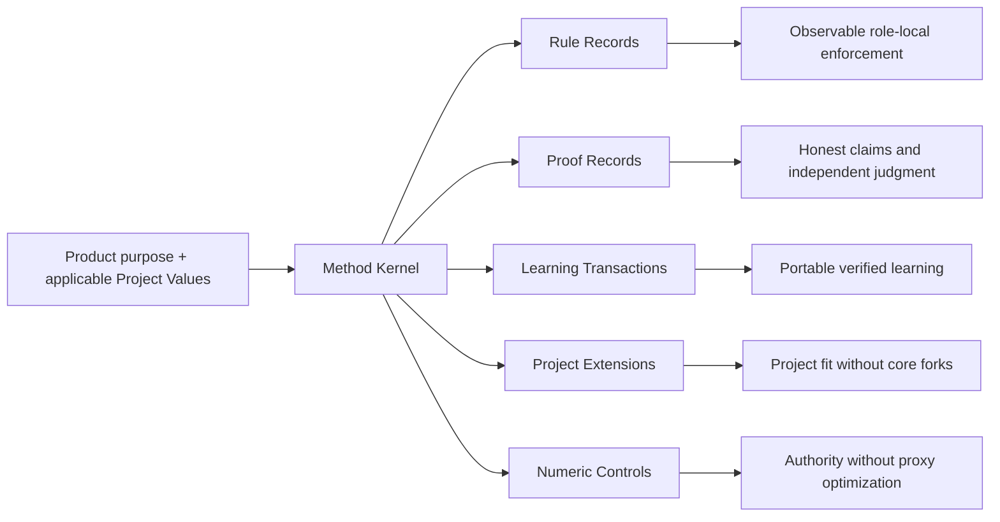

# HL — TFW-48 / Phase A: Method Kernel and Canonical Language

> **Date**: 2026-07-29
> **Author**: Coordinator (Codex) + User
> **Status**: ✅ HL — Approved scope derived from master HL
> **Parent HL**: [HL-TFW-48](../HL-TFW-48__value_first_methodology_rebaseline.md)
> **Research**: [Iteration 1 RES](../research/iter1/RES.md) · [Iteration 2 RES](../research/iter2/RES.md)

---

## 1. Vision

TFW's public promise, philosophy, formal rules, and vocabulary describe one value-first method. A newcomer can move from “why TFW exists” to “what every task must protect” without encountering competing definitions, incident-specific jargon, or implementation structure presented as methodology.

**Impact:** Later phases can simplify workflows and templates against a stable semantic contract instead of inventing meaning file by file. Agents load less prose while preserving product purpose, applicable Project Values, authority, evidence, independent judgment, and durable learning.

> “I can see what TFW protects, where each rule belongs, and why a shorter instruction is still safe.”

## 2. Current State (As-Is)

| Canonical surface | Intended role | Current gap |
|-------------------|---------------|-------------|
| `README.md` | Public product promise and entry point | Strong continuity/knowledge promise, but the formal method kernel and value-proof boundaries are implicit |
| `.tfw/README.md` | Philosophy, values, and success criteria | Values are clear, but “How TFW Works” describes the artifact ritual more strongly than the protected product obligations |
| `.tfw/conventions.md` | Formal operational contract | Artifact, workflow, and historical rules coexist; the current inline-enforcement rule is broader than the challenged rule-locality evidence |
| `.tfw/glossary.md` | One precise definition per operative term | Existing lifecycle terms are defined, but the approved kernel objects and proof/learning/extension distinctions lack canonical names |

The completed research found that the current implementation contains valuable mechanisms but is not their authority. It also found that:

- full repetition and reference-only minimalism both fail in some cases;
- review artifact volume is not the same as proof strength;
- learning transactions and project extensions are independent lifecycles;
- hard-looking numbers currently mix structural gates, thresholds, warnings, defaults, targets, and measurements;
- research codes such as K3, M5, R9, and V1 are analysis labels, not suitable runtime vocabulary.

## 3. Target State (To-Be)

Phase A establishes a stable semantic owner for every foundational concept without changing workflow behavior yet.

| Before | After |
|--------|-------|
| Values and success criteria justify TFW mostly at narrative level | A compact Method Kernel connects product purpose and values to operational obligations |
| “Inline” versus “reference” is treated as a global style choice | Rule locality is selected per protected consequence and observable enforcement boundary |
| Review depth is inferred from files, stages, percentages, or prose volume | Proof obligations are explicit and packaging is independently proportionate |
| Fact Candidate handling and project customization can appear as one broad “learning” concern | Learning Transactions and Project Extensions have separate terms, owners, and lifecycle contracts |
| Numeric syntax implies authority | Numeric Control type and lifecycle determine whether a value is normative, advisory, configurable, or descriptive |
| Research labels risk leaking into runtime documentation | Public terms express meaning directly; research labels remain trace-only provenance |

### 3.1 Result Visualization

Six months later, a new coordinator follows one short ownership chain:

```text
README.md             “What product outcome does TFW promise?”
        ↓
.tfw/README.md        “Which values and success criteria justify the method?”
        ↓
conventions.md        “Which protected obligations and operational contracts apply?”
        ↓
glossary.md           “What does each operative term mean exactly?”
        ↓
workflows/templates   “Where is the obligation enforced at the point of use?”
```

There is no need to know that “M5 survived Challenge.” The agent sees precise terms—Method Kernel, Rule Record, Proof Record, Learning Transaction, Project Extension, Numeric Control—and follows the correct owner.

### 3.2 Value Flow



| Step | Input | Transformation | Value Created |
|------|-------|----------------|---------------|
| Anchor | Product purpose, values, success criteria | Derive the obligations the method must preserve | Implementation no longer defines its own justification |
| Name | Challenged research concepts | Replace research codes and overlapping prose with precise operative terms | Smaller context activates the intended behavior |
| Own | Each term and rule | Assign one semantic owner and reference path | Changes no longer create silent competing authorities |
| Protect | Consequence, claim, signal, extension, or number | Select the applicable record and enforcement boundary | Proportionality does not weaken invariants |
| Hand forward | Approved kernel and contracts | Later phases refactor consumers against the same canon | Broad cleanup stays coherent across files and agents |

## 4. Phases

This phase is one bounded semantic-contract delivery. It does not contain implementation sub-phases.

### Phase A: Method Kernel and Canonical Language 🔴

> **Requires:** Approved master HL and completed TFW-48 research.
>
> **⚠️ Shared files with later phases:** `README.md`, `.tfw/README.md`, `.tfw/conventions.md`, `.tfw/glossary.md`.
>
> **Context for coordinator:** master HL §1, §3, §5–§7, §10; Iteration 2 RES D11–D20; Iteration 2 Numeric Lifecycle and Open Questions; README values; `.tfw/README.md` Values and Success Criteria; KNOWLEDGE D23–D29, D37–D54.
>
> **Key decisions:** select meaning-based runtime terms rather than K3/M5 codes; preserve five kernel obligations; make protected obligation the unit of proportionality; do not change exact numeric values or add cognitive-strategy architecture.
>
> **Deliverables:**

1. Reconcile the public README promise with `.tfw/README.md` philosophy and success criteria.
2. Define the five-obligation Method Kernel and the minimal object grammar in the formal conventions.
3. Establish one canonical definition and owner for the foundational terms needed by later phases.
4. Replace global inline/reference guidance with the challenged Rule Record deployment contract.
5. Define local, seam, live, and deferred proof obligations independently of review packaging.
6. Separate Learning Transactions from Project Extensions and define their minimum lifecycle contracts.
7. Define the Numeric Control taxonomy, semantic lifecycle, and provisional restore-owner-or-retire ledger without changing values.

## 5. Definition of Done (DoD)

- ✅ 1. The two README files state one compatible value-first product promise and preserve domain independence.
- ✅ 2. `conventions.md` contains a compact Method Kernel whose five obligations map to the README values and success criteria.
- ✅ 3. The minimal object grammar distinguishes Rule Records, Proof Records, Learning Transactions, Project Extensions, and Numeric Controls without introducing a new framework file.
- ✅ 4. Each foundational term has one definition in `glossary.md`; operational rules live in `conventions.md` and reference definitions instead of restating them.
- ✅ 5. Rule locality is consequence- and observability-typed, with complete local pre-action gates preserved for authority, safety, destructive, and irreversible boundaries.
- ✅ 6. Every claimed deliverable requires local proof; crossed seams and live claims add triggered proof or explicit value debt.
- ✅ 7. Selected learning signals receive disposition-typed receipts; registered extensions have an independent observable lifecycle.
- ✅ 8. Numeric controls are classified by semantics and lifecycle; the eight research-ledger objects have explicit next decisions and no invented replacement values.
- ✅ 9. Current workflow, template, adapter, config, and task behavior remains unchanged until the later consuming phases implement the approved contracts.
- ✅ 10. Rendered documentation and cross-references remain navigable, and no public runtime text depends on research codes.

## 6. Definition of Failure (DoF)

- ❌ 1. The phase makes the framework shorter by deleting a protected obligation or evidence boundary.
- ❌ 2. K3, M5, R9, V1, or other research configuration codes become public runtime terminology.
- ❌ 3. A foundational definition is duplicated across README, philosophy, conventions, and glossary with competing wording.
- ❌ 4. “Reference everything” or “repeat everything” survives as a universal rule.
- ❌ 5. Review packaging, file count, or verification percentage is presented as proof strength by itself.
- ❌ 6. Learning and project extensions are collapsed into one lifecycle or every artifact is routed centrally by default.
- ❌ 7. Any exact numeric value is changed, newly validated, or declared universally correct in Phase A.
- ❌ 8. A strategy selector, cognitive-method catalog, or strategy-extension contract enters the runtime canon while H4 remains unresolved.
- ❌ 9. Workflows, templates, adapters, config values, project state, historical traces, or production repositories are modified in this phase.

**On failure:** Stop Phase A, restore the last approved semantic contract, identify which product value or research boundary was violated, and return to `/tfw-plan`. Do not compensate with more prose.

## 7. Principles

1. **Purpose Before Process** — original product purpose, values, and success criteria justify the method.
2. **Meaning Is the Product** — outputs are reproducible; the protected meaning and trace are durable.
3. **Preserve Proven Outcomes, Not Accidental Ceremony** — keep obligations, not inherited field and file shapes.
4. **Precision Compresses Context** — use one correct term and owner before adding explanation.
5. **Structural Gates for Invariants, Judgment for Context** — irreversible boundaries remain hard; contextual packaging remains proportionate.
6. **Reality Can Overrule the Plan** — formal agreement cannot defeat valid evidence.
7. **Learning Must Become Portable** — selected durable signals need visible disposition.
8. **Domain-Agnostic by Design** — the kernel must work for product, research, operations, documents, design, education, and code.
9. **Human Chooses, Framework Clarifies** — the method exposes authority and consequences without hiding owner decisions.
10. **Method Claims Need Evidence** — H4 uncertainty cannot become strategy architecture through plausible wording.

## 7.1 Quality Contract

- Public and runtime documentation must use semantic terms, not research configuration codes.
- `README.md` owns the public promise; `.tfw/README.md` owns philosophy and values; `conventions.md` owns operational rules; `glossary.md` owns concise term definitions.
- A definition may be linked or used at a point of enforcement, but must not be re-explained with competing semantics.
- Full local imperatives remain for pre-action role, safety, destructive, and irreversible boundaries.
- Local proof is universal for claimed deliverables; seam/live proof and value debt are claim-triggered.
- Learning receipt strength follows disposition; Project Extension lifecycle is independent and observable.
- Numeric controls receive semantic classification and next action before any value calibration.
- Existing behavior remains transitional authority until a later approved TS changes its consumer.
- No new framework file, strategy architecture, or exact replacement number is created in this phase.

### 7.2 Knowledge Citations

| # | Source | Item | How it applies |
|---|--------|------|----------------|
| 1 | [Root README](../../../README.md#how-it-works) | Self-aware product, continuity, compounding knowledge, domain independence | Defines the public outcomes Phase A must preserve |
| 2 | [.tfw README](../../../.tfw/README.md#values-and-principles) | Traces Over Code, honesty, structural enforcement, naming, single source, portability | Primary justification for the kernel and ownership model |
| 3 | [.tfw README](../../../.tfw/README.md#success-criteria) | Resume, traceability, compounding knowledge, complete output | Outcome-level validation of the reconciled promise |
| 4 | [knowledge/philosophy.md](../../../knowledge/philosophy.md) | F3, F4, F11, F13, F17, F18, F20, F24–F26 | Protects critical opposition, structural enforcement, no extra graph, domain neutrality, and precise contextual naming |
| 5 | [KNOWLEDGE.md](../../../KNOWLEDGE.md) | D23–D29 | Preserves compression, point-of-use enforcement, progressive disclosure, and naming behavior while superseding their over-broad forms |
| 6 | [KNOWLEDGE.md](../../../KNOWLEDGE.md) | D37, D43–D45 | Preserves knowledge ownership and Project Values cascade |
| 7 | [KNOWLEDGE.md](../../../KNOWLEDGE.md) | D49–D54 | Preserves requirements-first planning, research/review stage integrity, evidence, and behavioral adapter parity |
| 8 | [knowledge/convention.md](../../../knowledge/convention.md) | F4, F8, F13, F19 | Enforces ref-inside-step, single category owner, complementary visuals, and naming consistency |
| 9 | [knowledge/process.md](../../../knowledge/process.md) | F3–F7, F13–F16, F22–F25 | Names behavior, protects gates and cross-session meaning, avoids arbitrary iteration and tautological structure |
| 10 | [TFW-48 Iteration 1 RES](../research/iter1/RES.md) | D1–D10 | Supplies longitudinal failure/counterexample constraints |
| 11 | [TFW-48 Iteration 2 RES](../research/iter2/RES.md) | D11–D20 | Supplies the challenged architecture, numeric lifecycle, and H4 boundary |

## 8. Dependencies

| Dependency | Status |
|------------|--------|
| Master TFW-48 HL architecture | ✅ Owner approved 2026-07-29 |
| TFW-48 research iterations 1–2 | ✅ Complete; SUFFICIENT |
| Knowledge Gate | ✅ Not due: 2 tasks since consolidation, interval 5 |
| Later workflow/template consumers | ⬜ Phases B–E; explicitly out of Phase A |
| Adapter, migration, and production validation | ⬜ Phase F |

## 9. Risks

| Risk | Probability | Impact | Mitigation |
|------|-------------|--------|------------|
| Semantic kernel becomes another explanatory layer | Medium | High | Reuse the four existing owners; add no framework file; delete or link displaced wording |
| README simplification weakens public clarity | Medium | High | Preserve audience outcomes and compare both rendered pages before approval |
| New terms multiply instead of compressing | High | High | Admit a term only when it separates behavior or authority; scan for synonyms and competing owners |
| Transitional conventions conflict with unchanged workflows | High | Medium | Mark downstream consumers explicitly; retain current runtime behavior until later phases |
| Numeric ledger is mistaken for calibration | Medium | High | Record class and next owner decision only; reject exact replacement values |
| Method kernel drifts toward software examples | Medium | High | Validate every definition against at least one non-code claim |
| H4 uncertainty is hidden by generic “method fit” wording | Medium | High | Keep the no-strategy-system boundary explicit in philosophy, conventions, and DoF |

## 10. RESEARCH Case

### Blind Spots

- Which exact paragraphs can be removed or linked while preserving the four owners' distinct jobs?
- Which existing glossary terms should be retained versus superseded by the smaller object vocabulary?
- How much transitional wording is necessary to prevent later-phase consumers from treating Phase A definitions as already implemented behavior?

### Hypotheses

| # | Hypothesis | Status |
|---|------------|--------|
| H1 | Canonical ownership plus observable local enforcement can replace universal repetition | Conditionally supported and narrowed by Iterations 1–2 |
| H2 | Numeric authority must follow semantic type and protected failure | Mechanism supported; exact values unresolved |
| H3 | Learning quality depends primarily on selective routing and visible disposition | Supported with disposition-receipt qualification |
| H4 | Matched cognitive strategy improves inquiry outcomes | Unresolved; outside Phase A |

> **Filter:** All four hypotheses already changed the approved architecture. No new Phase A research iteration is required.

### Risks of Not Researching

Research is complete. Skipping its conclusions would recreate the original failure: editorial cleanup based on current file shape rather than product purpose and production evidence.

### Proposed RESEARCH Focus

No additional research is proposed for Phase A. Implementation must use the two completed RES artifacts and report any source contradiction as a deviation rather than silently choosing.

### Why Not Just...?

- Why not create a new `method_kernel.md`? — It would add another owner beside philosophy, conventions, and glossary; the approved direction is clearer ownership, not another layer.
- Why not rewrite every workflow now? — The kernel must stabilize before downstream consumers change, and the current four-file scope keeps semantic decisions independently reviewable.
- Why not choose new limit values now? — Research validated the governance mechanism, not any replacement number.
- Why not add empty strategy extension points? — H4 is unresolved; generic Project Extensions already prevent future core lock-in without inventing a cognitive subsystem.

## 11. Strategic Insights (Planning)

No new human-only strategic insight was introduced while deriving Phase A. Master HL §11 remains authoritative; the owner's `approve` confirms the architecture and H4 boundary already recorded there.

---

*HL — TFW-48 / Phase A: Method Kernel and Canonical Language | 2026-07-29*
