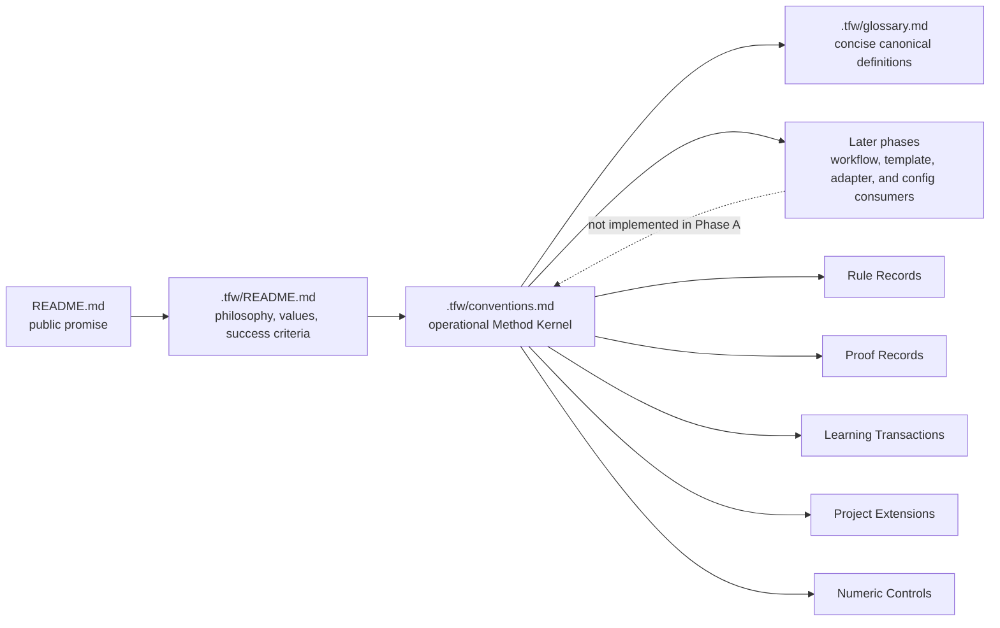

# RF — TFW-48 / Phase A: Method Kernel and Canonical Language

> **Date**: 2026-07-29
> **Author**: Executor (Codex)
> **Status**: 🟢 RF — Complete
> **Parent HL**: [Phase A HL](HL__phase-a__method_kernel.md)
> **Master HL**: [HL-TFW-48](../HL-TFW-48__value_first_methodology_rebaseline.md)
> **TS**: [TS Phase A](TS__phase-a__method_kernel.md)

---

## 1. What Was Done

### New Files

| File | Description |
|------|-------------|
| `ONB__phase-a__method_kernel.md` | Pre-execution onboarding, citation audit, risk register, and coordinator approval gate |
| `evidence/EV__phase-a__method_kernel.md` | Structured rendered-page and navigation evidence for AC-2 and AC-9 |
| `RF__phase-a__method_kernel.md` | Phase A implementation report, contract examples, verification, and handoff |

No new framework file was created.

### Modified Files

| File | Changes |
|------|---------|
| `README.md` | Reconciled the public promise, rewrote “How It Works” as protected outcomes, exposed the Method Kernel entry path, and updated the TFW-48 Task Board row |
| `.tfw/README.md` | Made philosophy, values, proportionality, independent judgment, evidence precedence, learning, and six success criteria explicit without turning the page into an artifact reference |
| `.tfw/conventions.md` | Added the operational Method Kernel, object composition, obligation-level proportionality, typed Rule Deployment, claim-typed proof, independent learning/extension lifecycles, Numeric Control taxonomy, and eight-object transitional ledger |
| `.tfw/glossary.md` | Added the 15 canonical Phase A definitions with links to their operational owner and aligned the existing Evidence vocabulary with the EV/RF contract |

## 2. Key Decisions

1. **Semantic ownership remains four-layered.** The root README owns the concise public promise; `.tfw/README.md` owns rationale, values, and success criteria; conventions own operational obligations; the glossary owns concise definitions. This preserves one semantic owner while allowing deliberate point-of-use cues.
2. **Protected obligation is the proportionality unit.** Packaging may be compact, staged, grouped, or risk-expanded, but no task-wide mode may waive product purpose/values, lifecycle/role authority, evidence precedence, independent judgment, or visible learning disposition.
3. **Rule placement follows consequence and observability.** Reversible explanation can use a discoverable reference; lifecycle and claim boundaries require observable gates; authority, safety, destructive, and irreversible boundaries retain complete local pre-action imperatives.
4. **Proof obligation is independent from artifact count.** Local Proof applies to every claim, Seam Proof is additive at crossed boundaries, Live Proof is additive at real-world boundaries, and deferred triggered proof becomes explicit Value Debt rather than a claim.
5. **Learning and extension lifecycles remain independent.** A selected signal can receive a learning disposition without creating an extension, and a registered project adaptation can exist without being a learning receipt.
6. **Numbers are governed by semantic type before value.** The eight existing objects remain unchanged in a transitional restore-owner-or-retire ledger; Phase A neither endorses nor recalibrates their values.
7. **H4 remains unresolved.** No strategy selector, strategy catalog, cognitive-strategy capability, or strategy-extension contract was added.

### Canonical Ownership Map

All Phase A terms have one concise definition owner (`.tfw/glossary.md`) and one operational contract owner (`.tfw/conventions.md`). Public or philosophical pages reference only what their audience needs.

| Term | Definition owner | Operational reference | Public/philosophical reference |
|------|------------------|-----------------------|--------------------------------|
| Method Kernel | `.tfw/glossary.md` | conventions §1.1 “Method Kernel” | `README.md` “How It Works”; `.tfw/README.md` “How TFW Works” |
| Protected Obligation | `.tfw/glossary.md` | conventions §1.1 “Composition and Proportionality” | `.tfw/README.md` “How TFW Works” |
| Rule Record | `.tfw/glossary.md` | conventions §1.1 “Rule Record and Rule Deployment” | None; operational term |
| Rule Deployment | `.tfw/glossary.md` | conventions §1.1 “Rule Record and Rule Deployment” | None; operational term |
| Proof Record | `.tfw/glossary.md` | conventions §1.1 “Proof Records and Claim Boundaries” | None; operational term |
| Local Proof | `.tfw/glossary.md` | conventions §1.1 “Proof Records and Claim Boundaries” | None; operational term |
| Seam Proof | `.tfw/glossary.md` | conventions §1.1 “Proof Records and Claim Boundaries” | None; operational term |
| Live Proof | `.tfw/glossary.md` | conventions §1.1 “Proof Records and Claim Boundaries” | None; operational term |
| Value Debt | `.tfw/glossary.md` | conventions §1.1 “Proof Records and Claim Boundaries” | None; operational term |
| Learning Transaction | `.tfw/glossary.md` | conventions §1.1 “Learning Transactions and Learning Receipts” | None; operational term |
| Learning Receipt | `.tfw/glossary.md` | conventions §1.1 “Learning Transactions and Learning Receipts” | None; operational term |
| Project Extension | `.tfw/glossary.md` | conventions §1.1 “Project Extensions and Registered Extensions” | None; operational term |
| Registered Extension | `.tfw/glossary.md` | conventions §1.1 “Project Extensions and Registered Extensions” | None; operational term |
| Numeric Control | `.tfw/glossary.md` | conventions §1.1 “Numeric Controls” | None; operational term |
| Numeric Control Type | `.tfw/glossary.md` | conventions §1.1 “Numeric Controls” | None; operational term |

### Rule Deployment Scenarios

| Scenario | Protected consequence | Valid locality and enforcement |
|----------|-----------------------|--------------------------------|
| Reversible explanation | Reader may misunderstand recoverable context | Semantic owner plus discoverable reference or local cue |
| Lifecycle transition | Work may enter the wrong stage or lose authority | Semantic owner plus observable gate at the transition |
| False evidence or seam claim | A claim may omit its source, boundary, or relation | Semantic owner plus claim-time proof gate that requires the applicable Proof Records |
| Irreversible pre-action authority | An actor may cross a safety, destructive, role, or irreversible boundary | Complete local imperative plus hard pre-action gate; task exposure may strengthen but not weaken it |

### Claim-Typed Proof Examples

| Claim example | Required record(s) | Packaging implication |
|---------------|--------------------|-----------------------|
| Local document satisfies its owned specification | Local Proof | May be one compact verification record |
| Content derived correctly across sources | Local Proof plus Seam Proof of sources and relation | May be grouped in one report if the mapping remains observable |
| Result works across components | Local Proof for the claimed deliverable plus Seam Proof of both component sides and their interface | May be staged by component or risk |
| Live outcome cannot yet be observed | Local Proof for what is complete plus Value Debt naming owner, due event, evidence route, and explicit non-claim | No Live Proof claim until the due event is observed |

### Learning and Extension Independence

| Case | Learning Transaction | Project Extension |
|------|----------------------|-------------------|
| A production surprise is reviewed and retained task-locally with a reason | Exists and ends with a task-local Learning Receipt | Does not exist |
| A project loads a versioned domain adapter with observable precedence and conflict handling | Does not need to exist | Exists as a Registered Extension with load/sync/conflict evidence |

## 3. Acceptance Criteria

- [x] **AC-1 — Canonical ownership map:** distinct responsibilities are explicit; the ownership table above maps all 15 Phase A terms without competing definitions.
- [x] **AC-2 — Reconciled product promise:** root and philosophy pages preserve one domain-agnostic outcome, values, proportionality, independent judgment, durable learning, traceability, resume, and complete usable output.
- [x] **AC-3 — Method Kernel and object grammar:** exactly five obligations and the approved object composition are defined; protected obligation is the proportionality unit; research codes are absent.
- [x] **AC-4 — Minimal canonical terminology:** all 15 required terms are defined once, remain concise and domain-agnostic, and link to conventions.
- [x] **AC-5 — Rule Deployment contract:** locality is consequence- and observability-typed; the four required scenarios map to distinct valid placements above.
- [x] **AC-6 — Claim-typed proof obligations:** Local, Seam, Live, and Value Debt requirements are additive and independent from file count; four required examples are mapped above.
- [x] **AC-7 — Independent learning and extension lifecycles:** disposition receipts and observable extension registration are separate; both independence directions are demonstrated above.
- [x] **AC-8 — Numeric Control lifecycle and transitional ledger:** seven types and all eight unchanged objects are present with provisional state, consumer/gap, and next owner decision; config is unchanged.
- [x] **AC-9 — Cross-document consistency and navigability:** targeted scans, generated links, rendered pages, documentation tests, and descriptive size measurements passed.

## 4. Verification

- Tests: `python -m pytest docs/scripts/test_gen_docs.py docs/scripts/test_integration.py` → **68 passed in 31.27s**.
- Source hygiene: `rg` scan for `K3|M5|R9|V1`, obsolete Pattern A/B and always-inline/reference claims, global light/heavy wording, and strategy-selector/catalog/extension terms → **no matches**.
- Glossary: all 15 required headings occur exactly once → **PASS (15/15)**.
- Generated navigation: all eight unique conventions anchors referenced by the 15 glossary definitions exist → **PASS (8/8)**.
- Rendered QA: landing, philosophy, conventions, and glossary pages opened successfully; promise hierarchy, six success criteria, Method Kernel entry path, definitions, and links were readable and navigable.
- Diff safety: `git diff --check` → **PASS**; `.tfw/project_config.yaml` diff → **empty**.
- Scope: four framework files modified, zero new framework files; no workflow, template, adapter, config, historical trace, knowledge, or technical-debt file changed.
- Additional audit: `python -m mkdocs build --strict --config-file docs/mkdocs.yml` reported 94 warnings from pre-existing historical references/navigation and exited non-zero. The TS-required generator/integration suite and affected rendered pages passed; the historical strict-warning backlog is recorded in §6 and was not changed.

### Descriptive Size Measurements

Blank lines are included in physical line counts; words are whitespace-delimited. These measurements describe the result and are not success quotas.

| File | Before lines | After lines | Δ lines | Before words | After words | Δ words |
|------|-------------:|------------:|--------:|-------------:|------------:|--------:|
| `README.md` | 288 | 296 | +8 | 2820 | 2969 | +149 |
| `.tfw/README.md` | 165 | 179 | +14 | 1575 | 1850 | +275 |
| `.tfw/conventions.md` | 507 | 705 | +198 | 3871 | 5714 | +1843 |
| `.tfw/glossary.md` | 268 | 318 | +50 | 2922 | 3377 | +455 |
| **Total** | **1228** | **1498** | **+270** | **11188** | **13910** | **+2722** |

## 5. Evidence

> **Cognitive mode:** Observational verification — evidence lives in the EV file, not inline.

See [EV file](evidence/EV__phase-a__method_kernel.md) for evidence details.

Evidence verdict: 2/9 VERIFIED, 0 DEFERRED, 0 BLOCKED, 7 N/A

## 6. Observations (out-of-scope, not modified)

| # | File | Line(s) | Type | Description |
|---|------|---------|------|-------------|
| 1 | `docs/mkdocs.yml` and historical task traces | N/A | todo | Strict MkDocs validation currently emits 94 pre-existing navigation and unresolved-reference warnings. The required documentation tests pass, but the backlog can obscure new strict-link regressions until it is separately reduced or baselined. |

## 7. Fact Candidates

No fact candidates. The user supplied execution coordination, not new domain knowledge.

## 8. Strategic Insights (Execution)

No strategic insights.

## 9. Diagrams

---

*RF — TFW-48 / Phase A: Method Kernel and Canonical Language | 2026-07-29*
