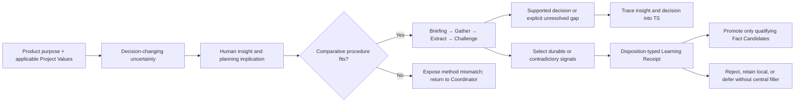
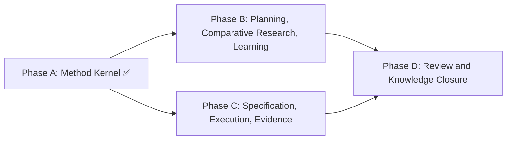

# HL — TFW-48 / Phase B: Planning, Comparative Research, and Learning Routing

> **Date**: 2026-07-29
> **Author**: Coordinator (Codex)
> **Status**: ✅ HL — Approved scope derived from master HL and Phase A
> **Master HL**: [HL-TFW-48](../HL-TFW-48__value_first_methodology_rebaseline.md)
> **Predecessor RF**: [Phase A RF](../phase-a/RF__phase-a__method_kernel.md)
> **Predecessor REVIEW**: [Phase A REVIEW](../phase-a/REVIEW__phase-a__method_kernel.md)

---

## 1. Vision

Planning and research now preserve product meaning from the first uncertainty through
the decision that enters a specification. The current Briefing → Gather → Extract →
Challenge sequence is presented honestly as TFW's comparative decision procedure,
while research intensity, stop conditions, and learning routing no longer pretend that
arbitrary counts are evidence of sufficient work.

**Impact:** A coordinator can see why work matters, which uncertainty is being reduced,
where each material user insight changed the plan, and what happened to every selected
learning signal. Researchers stop because the decision is supported or the remaining
gap is explicit—not because a query, file, question, loop, or iteration number was met.

> "I can trace what I meant into the decision, and the researcher can explain why the investigation is complete without pointing to a quota."

## 2. Current State (As-Is)

Phase A established the Method Kernel and its operational objects, but planning and
research still consume the previous method:

| Area | Current behavior | Failure exposed |
|------|------------------|-----------------|
| Planning frame | Purpose, uncertainty, Project Values, and user insights are captured in different sections without one decision path | An insight may be recorded in HL §11 and disappear before TS |
| Research procedure | Dimensional analysis is embedded as if every inquiry needs alternatives and a configuration space | Lookup, corpus immersion, documentation mapping, and open exploration are forced into a comparison shape |
| Research intensity | `focused/deep` changes loop counts and completion numbers | Intensity is confused with method fit and count completion |
| Limits | Query, file, question, pass, iteration, decision, turn, dimension, alternative, and configuration counts act as hard-looking anchors | Agents optimize for the count; no exact value is validated by the research |
| Stage closure | External-source and numeric checks dominate the visible gate | A stage can meet a count without closing the decision gap, or exceed it for valid coverage |
| Learning | Fact Candidates and Strategic Insights capture text, but disposition, destination, actor, due event, and rejection reason are not consistently related | Capture is mistaken for learning; batch deferrals become ambiguous |
| H4 | Cognitive-strategy benefit is plausible but untested | Adding a selector or catalog would convert an unresolved hypothesis into architecture |

Phase A also left all existing workflow and template consumers explicitly transitional.
Phase B is the first consuming phase for planning, comparative research, and selected
learning signals.

## 3. Target State (To-Be)

### 3.1 Result Visualization

Six months after Phase B, a planning trace reads like this:

```text
Purpose / applicable values
  → uncertainty that can change the decision
  → user insight S2
       implication: preserve non-code product outcomes
       disposition: TS AC-3 + DoF-5
  → procedure-fit gate:
       "This decision compares alternatives and their compatibility" = YES
  → comparative research:
       Gather evidence and alternatives
       Extract configurations/relationships
       Challenge with counter-evidence
  → closure:
       decision supported
       remaining gap assigned
       selected signal L3 promoted to Fact Candidate FC1
       selected signal L4 retained locally with reason
```

The same trace does not say "research complete because five searches, fifteen files,
three questions, three passes, or two iterations were reached."

### 3.2 Value Flow



| Step | Input | Transformation | Value created |
|------|-------|----------------|---------------|
| Frame | Purpose, owner decisions, Project Values | Name the uncertainty whose answer changes the decision | Research serves the product rather than the procedure |
| Fit | Decision and alternatives | Confirm that comparison/configuration analysis is appropriate | One method is not misrepresented as universal |
| Investigate | Evidence, sources, project corpus | Gather, structure, challenge, and expose exclusions | Decision quality is visible |
| Close | Findings and remaining gaps | Apply claim-based stop conditions and authority | Completion is evidence-based rather than quota-based |
| Learn | Durable/contradictory signal | Select a disposition and minimum receipt | Knowledge compounds without a central scrapbook |
| Specify | Insights and supported decisions | Map to AC, guidance, failure boundary, or explicit non-use | Meaning survives the HL→TS boundary |

## 4. Phases

This is Phase B of the approved TFW-48 master plan.

### Phase Dependencies



| Phase | Depends on | Shared files | Can run in parallel with |
|-------|------------|--------------|-------------------------|
| B | Phase A RF + APPROVE REVIEW | `.tfw/conventions.md`, `.tfw/glossary.md`, planning/research templates | Phase C after Phase A |
| D | B + C | Fact Candidate and knowledge-closure consumers | — |

### Phase B: Planning, Comparative Research, and Learning Routing 🔴

> **Requires:** Phase A ✅
>
> **⚠️ Shared files with Phase D:** Fact Candidate semantics, learning destinations,
> and closure responsibilities. Phase B owns planning/research entry and receipts;
> Phase D owns review and project-knowledge closure consumers.
>
> **Context for coordinator:** Phase A RF/REVIEW; TFW-48 Iteration 2 D15 and D18–D20;
> TFW-44 insight-to-outcome gap; D22, D23, D37, D43, D49, D51, and D55.
>
> **Key decisions:** use Phase A terms rather than research labels; name the current
> sequence Comparative Decision Procedure; keep `focused/deep` as intensity only;
> replace count-based completion with decision/evidence/gap conditions; use existing
> insight, checkpoint, and Fact Candidate surfaces for learning receipts.
>
> **⚠️ Cascade dependency:** planning and research workflows, their templates, and mode
> files are one consumer chain. A term or gate changed in one must be reconciled across
> every affected consumer in this phase.

**Deliverables:**

1. Frame planning around product purpose, applicable Project Values, uncertainty, and decision quality.
2. Give each material Strategic Insight a planning implication and visible TS disposition.
3. Name and scope Briefing → Gather → Extract → Challenge as the Comparative Decision Procedure.
4. Add a procedure-fit gate that may reject the current procedure without selecting a substitute strategy.
5. Keep `focused/deep` as qualitative research intensity, not inquiry method or completion proof.
6. Retire universal normativity for unvalidated research counts while leaving config cleanup to Phase E.
7. Define evidence- and decision-based stage/iteration stop conditions.
8. Embed disposition-typed Learning Receipts in existing stage checkpoints and Fact Candidate synthesis.
9. Preserve H4 as unresolved and T0 as the only authorized owner package.

### Research Numeric-Control Dispositions

Phase B changes no exact configuration value. It changes whether the research workflow
treats a number as authority:

| Current object or hard-looking number | Phase B disposition | Replacement authority |
|---------------------------------------|---------------------|-----------------------|
| Web queries per stage | Lose universal cap/default normativity | Required evidence families, declared exclusions, and saturation |
| Project files per stage | Lose universal cap/default normativity | Approved corpus, coverage, exclusions, and whether new files change the disposition |
| Questions per turn | Lose universal hard-cap normativity | Only decision-changing questions; prioritize and split when the user cannot answer safely in one turn |
| `max_passes` | Confirm as unconsumed residue | No replacement; stage loop closes by sufficiency or explicit unresolved gap |
| `min_iterations` | Lose universal hard-floor normativity | One complete filesystem-traced procedure plus another iteration only on a named trigger |
| `loops_per_stage` | Lose completion-authority status | Intensity describes evidence breadth and challenge depth, not a required loop count |
| Fixed decisions/turns per stage | Retire | Stage outputs and decision-changing progress |
| Fixed dimensions/alternatives/configurations | Retire | Materially distinct decision factors/options and a configuration representation that remains legible |

The underlying config keys remain transitional until Phase E restores an owner and
consumer or removes them. Their continued presence must not be described as active
workflow enforcement after Phase B.

## 5. Definition of Done (DoD)

- ✅ 1. Planning explicitly connects purpose, applicable Project Values, uncertainty, and decision quality.
- ✅ 2. Every material HL Strategic Insight records an implication and a TS destination or explicit non-use reason.
- ✅ 3. The current four-stage research sequence has one precise name and a bounded comparative purpose.
- ✅ 4. A researcher can reject the procedure as a mismatch without inventing or loading a strategy catalog.
- ✅ 5. `focused/deep` changes qualitative intensity only and is never evidence of method fit or completion.
- ✅ 6. Research closure depends on evidence coverage, counter-evidence, decision disposition, exposed exclusions, open-thread ownership, and saturation—not raw activity counts.
- ✅ 7. All research numbers and hard-looking template counts receive an explicit retain/retire/transitional disposition; no exact replacement is invented.
- ✅ 8. Every selected durable or contradictory signal receives a disposition-typed Learning Receipt.
- ✅ 9. Only promote/merge/derive signals that need durable verification enter Fact Candidates; reject/local/defer do not create filler central entries.
- ✅ 10. TFW-44's insight-to-outcome gap is resolved through existing HL and TS surfaces without adding another artifact or universal section.
- ✅ 11. H4 remains unresolved; no selector, catalog, runtime strategy selection, or extension mechanism is introduced.
- ✅ 12. Documentation tests and affected link/navigation checks pass; before/after counts remain descriptive.

## 6. Definition of Failure (DoF)

- ❌ 1. The current comparative procedure is described as suitable for every research question.
- ❌ 2. `focused/deep` is presented as a research method choice rather than intensity.
- ❌ 3. A prestigious method name, strategy catalog, runtime selector, or strategy extension enters TFW-48.
- ❌ 4. Activity counts remain as proof that a stage or iteration is complete.
- ❌ 5. Config values are deleted or changed before Phase E resolves their full lifecycle.
- ❌ 6. Removing the two-iteration floor permits a researcher to skip Briefing, Gather, Extract, Challenge, synthesis, or Coordinator authority.
- ❌ 7. Every finding, artifact, or stage output becomes a central Learning Transaction.
- ❌ 8. A selected signal lacks the receipt required by its disposition.
- ❌ 9. Strategic Insights remain prose with no planning implication or TS disposition.
- ❌ 10. Fact Candidates, Strategic Insights, and Learning Transactions are collapsed into synonyms.
- ❌ 11. New top-level capture sections duplicate existing semantic owners.
- ❌ 12. Research labels from Iteration 1/2 appear in runtime or public methodology text.

**On failure:** Stop Phase B, keep Phase A contracts intact, identify the failed
protected obligation, and return to Phase B planning. Do not compensate with more
counts, sections, or method names.

## 7. Principles

1. **Purpose Before Procedure** — research exists to reduce uncertainty that changes a product decision.
2. **One Operational Method, Honest Scope** — name what the current procedure does and expose when it does not fit.
3. **Intensity Is Not Method** — `focused/deep` changes depth and breadth, not inquiry structure.
4. **Meaning Before Number** — no count governs work without a defined construct, failure, consumer, response, and authority.
5. **Completion Is a Claim** — a stage or iteration closes only when its decision/evidence claim is supported or honestly limited.
6. **Learning Is Selected and Routed** — durable or contradictory signals receive receipts; routine detail does not.
7. **Existing Surfaces Before New Sections** — use HL insights, stage checkpoints, RES decisions, and Fact Candidates before adding another container.
8. **Precision Compresses Context** — one defined term and point-of-use gate replace repeated explanation.
9. **Reality Can Overrule the Plan** — counter-evidence and discovered exclusions may change the decision or reopen research.
10. **Human Authority Remains Visible** — Coordinator/user decides whether to proceed, deepen, defer, or accept an unresolved gap.
11. **Domain-Agnostic by Design** — the procedure and examples apply to products, research, operations, documents, design, education, and code.
12. **Method Claims Need Evidence** — H4 uncertainty remains a boundary, not an invitation to build plausible architecture.

### 7.1 Quality Contract

- Every changed instruction must point to the Phase A semantic owner and the protected consequence.
- A reference is valid only with a point-of-use action or observable gate.
- No stage may use raw activity volume as a substitute for evidence coverage or decision closure.
- Every retired number must remain discoverable in the transitional ledger until Phase E removes its config or derivatives.
- Learning receipts may be compact, but disposition and required relation may not be omitted.
- Historical research and TFW-44 traces remain unchanged; supersession is recorded only in current contracts.
- Research-only labels remain in research traces.

### 7.2 Knowledge Citations

| # | Source | Item | How it applies |
|---|--------|------|----------------|
| 1 | [Phase A RF](../phase-a/RF__phase-a__method_kernel.md) | Key Decisions 1–7 | Supplies the implemented semantic owners, Method Kernel, Rule Deployment, proof, learning, extension, numeric, and H4 boundaries |
| 2 | [Phase A REVIEW](../phase-a/REVIEW__phase-a__method_kernel.md) | APPROVE, 9/9 AC | Confirms Phase A is a trustworthy predecessor rather than a planning assumption |
| 3 | [Iteration 2 RES](../research/iter2/RES.md) | D15, D18–D20 | Defines disposition-typed receipts, numeric lifecycle, restore-or-retire, and T0-only H4 |
| 4 | [KNOWLEDGE.md](../../../KNOWLEDGE.md) | D22 | Keeps Fact Candidates as verification inputs rather than equating capture with knowledge |
| 5 | [KNOWLEDGE.md](../../../KNOWLEDGE.md) | D23 | Requires workflow compression through ownership and template references |
| 6 | [KNOWLEDGE.md](../../../KNOWLEDGE.md) | D37 | Preserves the tfw-docs/tfw-knowledge write-boundary for Phase D |
| 7 | [KNOWLEDGE.md](../../../KNOWLEDGE.md) | D43 | Preserves the Project Values citation cascade across roles |
| 8 | [KNOWLEDGE.md](../../../KNOWLEDGE.md) | D49 | Keeps research structure natural and TS requirements-first |
| 9 | [KNOWLEDGE.md](../../../KNOWLEDGE.md) | D51 | Preserves copy-on-enter stage traces, mindsets, and STOP gates |
| 10 | [KNOWLEDGE.md](../../../KNOWLEDGE.md) | D55 | Makes the five protected obligations and typed objects the Phase B authority |
| 11 | [knowledge/philosophy.md](../../../knowledge/philosophy.md) | F3, F4, F13, F18, F24–F26 | Requires critical opposition, structural gates, domain neutrality, cognitive-mode fit, natural dependencies, human choice, and template duality |
| 12 | [knowledge/process.md](../../../knowledge/process.md) | F3–F7, F13–F16, F22–F25 | Protects precise naming, algorithmic workflows, trace-first writes, insight continuity, triggered iterations, verified citations, and non-tautological guidance |
| 13 | [TFW-44 HL](../../TFW-44__coordinator_quality_gates/HL-TFW-44__coordinator_quality_gates.md) | HL §11 → TS gap | Supplies the unresolved insight-to-outcome failure while remaining a historical draft, not current authority |

## 8. Dependencies

| Dependency | Status |
|------------|--------|
| TFW-48 Phase A RF | ✅ Complete |
| TFW-48 Phase A REVIEW | ✅ APPROVE |
| TFW-48 Iterations 1–2 | ✅ SUFFICIENT |
| Phase A D55 knowledge capture | ✅ Applied |
| H4 comparison execution | N/A — explicitly not required or authorized |
| Phase C | Independent after Phase A; coordinate shared conventions/glossary edits |
| Phase D | Depends on Phase B and C |

## 9. Risks

| Risk | Probability | Impact | Mitigation |
|------|-------------|--------|------------|
| Removing counts reintroduces rush-to-finish behavior | Medium | High | Preserve filesystem stage gates, required outputs, claim-based stop conditions, and Coordinator closure authority |
| Procedure-fit gate becomes an implicit strategy selector | Medium | High | It may only accept or reject the current procedure; it cannot name or load a substitute |
| Qualitative intensity becomes vague | Medium | Medium | Define observable differences in evidence breadth, counter-evidence, edge cases, and uncertainty |
| Learning receipt fields create more filler | Medium | High | Event trigger and decision-changing test; allow explicit “no selected signal” |
| Fact Candidate compatibility breaks before Phase D | Medium | High | Keep the canonical heading and reserve it for promote/merge/derive candidates only |
| Transitional config keys mislead later agents | High | Medium | Record unconsumed status in conventions and require Phase E restore-or-remove decision |
| Planning traceability becomes mechanical one-insight-one-AC mapping | Medium | Medium | Allow guidance, DoF, scope, decision, local/reject reason, or AC destinations as appropriate |
| Phase B grows across too many consumers | Medium | Medium | Fixed 12-file framework scope, no adapters/config/knowledge workflow changes |

## 10. RESEARCH Case

### Blind Spots

- Whether a future non-comparative inquiry procedure should be search-, immersion-, case-, or diagnosis-shaped.
- Whether matched cognitive strategies improve model outcomes beyond naming, prompt length, or evaluator expectation.
- Which exact project-specific numeric defaults, if any, should replace retired universal research counts.
- How Phase D should surface deferred Learning Transactions across review and knowledge closure.

These blind spots are deliberately outside Phase B. They do not block honest scoping of
the current procedure or removal of unsupported completion claims.

### Hypotheses

| # | Hypothesis | Status |
|---|------------|--------|
| B-H1 | Existing HL insight and TS surfaces can close the insight-to-outcome gap without a new artifact or top-level section | Supported by TFW-44 gap analysis and Phase A ownership rule; selected for Phase B challenge |
| B-H2 | The current stage sequence is valuable when named and bounded as a comparative decision procedure, but should reject non-comparative fit | Supported by Iterations 1–2 and the master HL; alternative strategy behavior remains unresolved |
| B-H3 | Research counts can lose universal normativity while filesystem stages, required outputs, claim-based sufficiency, and Coordinator authority preserve depth | Mechanism supported by Iteration 2; exact values unvalidated |
| B-H4 | Existing checkpoints and Fact Candidate synthesis can carry disposition-typed receipts without centralizing every signal | Supported by Iteration 2 D15 and Phase A learning contract |

### Risks of Not Researching

No new iteration is recommended. Two deep iterations already tested the relevant
mechanisms across routine and counter-cases, reached the configured prior minimum, and
recommended SUFFICIENT. A third iteration without a new trigger would violate
`knowledge/process.md` F13. Phase B must preserve H4 as unresolved rather than use more
desk research to imply a causal answer.

### Proposed RESEARCH Focus

N/A for Phase B. Future owner-authorized work may test non-comparative inquiry methods
or H4 under a separate task and claim boundary.

### Why Not Just...?

- Why not keep every current number but call it soft? — Models still anchor on visible numbers, and the exact values lack defined validation.
- Why not delete the config keys now? — Phase E owns configuration lifecycle, derivatives, migration, and registered extensions.
- Why not add search, immersion, Yin, and other methods now? — That would build a strategy catalog before H4 or method-boundary evidence exists.
- Why not map every insight to its own AC? — Some insights govern scope, guidance, failure, or an explicit non-use decision; forced AC creation would create ceremony rather than traceability.
- Why not send every learning signal to `/tfw-knowledge`? — Reject/local/defer are legitimate dispositions; central routing would recreate the scrapbook problem.

## 11. Strategic Insights (Planning)

| # | Insight | Planning implication | Category | Source |
|---|---------|----------------------|----------|--------|
| S1 | Stronger models can follow one canonical source plus a point-of-use reference more reliably than earlier models | Phase B should shorten repeated explanations but retain observable gates and complete local authority boundaries | philosophy | User, TFW-48 planning discussion |
| S2 | Models latch onto LoC and other visible budgets and spend effort satisfying the proxy | Research counts must not serve as completion proof; every retained number needs a defined protected failure and response | process | User, TFW-48 limit discussion |
| S3 | TFW must target product meaning, goals, and values—not only code and development | Planning and research examples, fit, evidence, and decisions remain domain-agnostic and product-led | philosophy | User, TFW-48 direction |
| S4 | Useful corrections, discoveries, and production learning need better selection, candidate creation, and processing | Phase B must improve event selection and receipts before adding destinations or capture sections | process | User, TFW-48 learning-loop direction |
| S5 | Search, documentation immersion, codebase immersion, and Yin-style review may require different research thinking structures | Current comparative procedure must be named and bounded; alternative method architecture is deferred rather than denied | research | User, future-methods discussion |
| S6 | Cognitive strategies may guide and focus models, but the effect could be an illusion caused by names or extra prompt context | H4 remains unresolved and Phase B cannot introduce selection/catalog behavior | research | User, H4 challenge |

---

*HL — TFW-48 / Phase B: Planning, Comparative Research, and Learning Routing | 2026-07-29*
