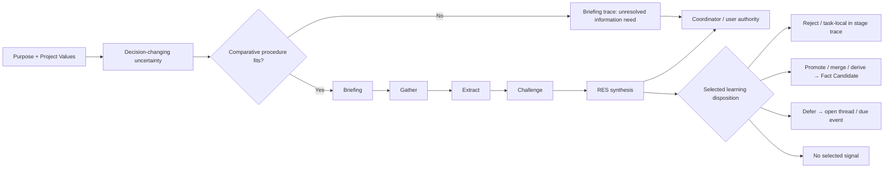

# RF — TFW-48 / Phase B: Planning, Research, and Learning

> **Date**: 2026-07-29
> **Author**: Codex Executor
> **Status**: 🟢 RF — Complete
> **Parent HL**: [HL Phase B](HL__phase-b__planning_research_learning.md)
> **TS**: [TS Phase B](TS__phase-b__planning_research_learning.md)

---

## 1. What Was Done

### New Files

| File | Description |
|------|-------------|
| `phase-b/ONB__phase-b__planning_research_learning.md` | Executor context report, risk analysis, scope reconciliation, and explicit Coordinator approval gate |
| `phase-b/evidence/EV__phase-b__planning_research_learning.md` | Per-AC evidence dispositions and contemporaneous rendered documentation QA |
| `phase-b/RF__phase-b__planning_research_learning.md` | Phase B implementation result, scenario records, verification, and handoff |

No new framework file was created.

### Modified Files

| File | Changes |
|------|---------|
| `.tfw/conventions.md` | Added the Phase B consumer map, purpose-led planning and insight disposition, Comparative Decision Procedure, H4 non-claim, qualitative research closure, research Learning Receipts, and the 12-object numeric disposition ledger; corrective handoff aligned the `iterations.yaml` example with the ledger while preserving exact values |
| `.tfw/glossary.md` | Added concise definitions for Comparative Decision Procedure and Research Intensity with links to their operational owners; corrective handoff reconciled the legacy RESEARCH, Stage, Pass, Iteration, `iterations.yaml`, `min_iterations`, Dimension, and Alternative entries with those owners |
| `.tfw/workflows/plan.md` | Made purpose, uncertainty, evidence need, and proposal distinct; added insight disposition, procedure fit, full-trace closure, triggered iteration, and Pre-TS gates |
| `.tfw/workflows/research/base.md` | Made the comparative procedure and mismatch exit executable; replaced activity-count closure with evidence-based closure; routed Learning Receipts and RES synthesis |
| `.tfw/workflows/research/focused.md` | Recast focused as bounded qualitative intensity without count-based completion |
| `.tfw/workflows/research/deep.md` | Recast deep as evidence diversity, counter-evidence, edge/failure coverage, and explicit uncertainty without count-based completion |
| `.tfw/templates/HL.md` | Added planning implication and TS disposition/destination to Strategic Insights; removed fixed hypothesis-volume guidance |
| `.tfw/templates/RES.md` | Preserved `## Fact Candidates`, constrained promotion candidates, added receipt provenance/actor and insight disposition, and removed min/max closure authority |
| `.tfw/templates/research/1_briefing.md` | Added the procedure-fit record, mismatch stop, flexible decision-relevant planning, and a Learning Receipt |
| `.tfw/templates/research/2_gather.md` | Replaced minimum dimensions/options with material decision factors, evidence coverage/exclusions/saturation, and a Learning Receipt |
| `.tfw/templates/research/3_extract.md` | Replaced the configuration-count quota with explicit inclusion/exclusion and decision-safe omission, plus a Learning Receipt |
| `.tfw/templates/research/4_challenge.md` | Made counter-evidence, edge/failure cases, exclusions, and saturation observable, plus a Learning Receipt |
| `README.md` | Advanced the TFW-48 Task Board entry through ONB, implementation checkpoint, and final Phase B RF |

## 2. Key Decisions

1. **Use one semantic owner and local consumer gates.** Glossary entries consume the
   bounded conventions contract without retaining parallel stage, count, or
   configuration prerequisites; workflows/templates enforce only the point-of-use
   consequence they need.
2. **Keep one honest procedure.** The existing filesystem sequence is named
   Comparative Decision Procedure only for uncertainties that require comparing
   material alternatives, relationships, or configurations.
3. **Return mismatches without inventing architecture.** A procedure-fit mismatch writes
   the Briefing trace and returns an unresolved information need to the Coordinator/user;
   it does not choose, name, simulate, or load another strategy.
4. **Treat focused/deep as qualitative intensity.** They alter breadth, counter-evidence,
   and uncertainty tolerance while retaining the same stages and closure authority.
5. **Change numeric authority, not numeric values.** Twelve existing hard-looking
   objects—including the approved existing `iterations.yaml max_iterations: 5`
   lifecycle object—received explicit dispositions. Both `iterations.yaml` min/max
   fields are transitional non-closure metadata, not a floor or ceiling. No config or
   exact value changed, and no replacement quota was introduced.
6. **Select and route learning proportionately.** All four stage templates can record a
   minimal disposition-typed Learning Receipt or explicit `No selected signal`.
   `## Fact Candidates` remains the transitional Phase D-compatible destination only
   for promote/merge/derive signals that require durable verification.
7. **Enforce the H4 boundary.** Phase B states the research-strategy benefit hypothesis
   as unresolved/inconclusive, leaves T0 as the only authorized desk package, and adds
   neither an experiment nor strategy-selection architecture.
8. **Preserve phase boundaries.** Project config, its template, adapters, historical
   traces, Phase C–F consumers, TD-125/126, and H4 execution remained outside scope.
   There were no TS deviations.

## 3. Acceptance Criteria

- [x] **AC-1:** Phase A ownership, Method Kernel obligations, Rule Deployment, and
  Phase B consumer status are observable without runtime research codes or competing
  definitions.
- [x] **AC-2:** Planning starts from purpose/Project Values and decision-changing
  uncertainty; every material Strategic Insight has a planning implication and
  resolvable TS/non-use disposition.
- [x] **AC-3:** Comparative Decision Procedure is named, bounded, domain-agnostic, and
  guarded by a mismatch return that selects no substitute strategy.
- [x] **AC-4:** Focused/deep change qualitative evidence and challenge intensity only;
  neither selects a method nor proves completion.
- [x] **AC-5:** All 12 numeric objects have explicit lifecycle dispositions; the full
  filesystem floor and evidence/authority closure replace count-based sufficiency.
- [x] **AC-6:** All four stage checkpoints support disposition-typed Learning Receipts,
  counter-evidence changes, and explicit no-selected-signal.
- [x] **AC-7:** RES routes selected learning and human insights without multiplying
  capture or adding a framework file/top-level section.
- [x] **AC-8:** H4 remains an explicit non-claim; no experiment, selector, registry,
  prompt library, extension architecture, or benefit inference was added.
- [x] **AC-9:** The exact 12 consumers are consistent, linkable, generated, tested,
  readable, and explicit about Phase C–F transition boundaries.

### AC-1 Ownership / Consumer Matrix

| Phase B concept | Definition owner | Operational owner | Point-of-use consumer gate | Protected consequence |
|-----------------|------------------|-------------------|----------------------------|-----------------------|
| Purpose-led planning and insight disposition | `.tfw/conventions.md` § Purpose-Led Planning and Insight Disposition | `.tfw/workflows/plan.md` | Plan Steps 3, 4, and 7; HL Strategic Insights fields | Product purpose/Project Values precede proposals; selected human learning reaches a decision, TS field, explicit non-use, or resolvable destination |
| Comparative Decision Procedure | `.tfw/glossary.md` concise term linked to conventions | `.tfw/conventions.md` § Comparative Decision Procedure; `.tfw/workflows/research/base.md` is the single executable algorithm | Plan Step 6, Briefing fit table, research base Step 4 | Only comparison/configuration uncertainty enters the procedure; mismatch returns unresolved need |
| Research Intensity | `.tfw/glossary.md` concise term linked to conventions | `.tfw/conventions.md` § Research Intensity and Closure | `focused.md`, `deep.md`, plan selection, research base | Breadth/depth follows decision risk without becoming method choice or completion proof |
| Research Learning Receipt | `.tfw/conventions.md` § Research Learning Receipts | `.tfw/workflows/research/base.md` | Learning Receipt in each of the four stage templates; RES routing | Selected learning receives a minimal typed disposition; no signal produces no filler |
| Research numeric authority | `.tfw/conventions.md` § Phase B Research Numeric Disposition Ledger | `.tfw/conventions.md` ledger and closure contract | Plan/base/focused/deep/stage gates | Existing values remain traceable but cannot silently decide fit, sufficiency, or closure |

A full corrective semantic scan of all 12 consumers found no competing former-count,
flexible-order, or substitute-procedure definition and no runtime/public `K3`, `M5`,
`R9`, `V1`, or Iteration dimension code.

### AC-2 Insight-to-TS Trace Examples

| HL Strategic Insight | Planning implication | Valid TS/non-use disposition |
|----------------------|----------------------|------------------------------|
| Explicit requirement: procedure mismatch must return to the Coordinator | The fit gate needs an observable authority outcome | AC-3 mismatch criterion and Briefing gate |
| Governing value: meaning before number | Research sufficiency cannot be inferred from activity volume | AC-5, Technical Guidance, and closure Definition of Failure |
| Rejected suggestion: add a substitute strategy picker in Phase B | It would exceed H4 evidence and introduce an unapproved semantic owner | Explicit non-use reason under AC-3/AC-8 |
| Future direction: validate search/immersion or Yin-derived work separately | It may later expand the method portfolio only after evidence and ownership exist | Separately owner-gated downstream research direction; not Phase B scope |

The Project Values citation cascade remains owned by the existing Phase A contract.
No new capture artifact or top-level section was added.

### AC-3 Procedure-Fit Scenario Matrix

| Scenario | Fit | Procedure / authority outcome |
|----------|-----|-------------------------------|
| Comparative product choice among materially different options | FIT | Run Briefing → Gather → Extract → Challenge → RES; Coordinator/user selects intensity and owns closure |
| Cross-source content choice with competing claims and configurations | FIT | Use the same procedure and record source coverage, exclusions, relationships, and counter-evidence |
| Operational policy choice among materially different process configurations | FIT | Use the same domain-agnostic procedure; no code-default language |
| Direct lookup for one known fact | MISMATCH | Write Briefing mismatch and return the unresolved information need; select no substitute |
| Documentation/corpus immersion or mapping without a material comparison | MISMATCH | Return the unresolved information need and required corpus context; select no substitute |
| Open exploration before alternatives or causal structure are known | MISMATCH | Return to Coordinator/user for separate owner-gated direction; do not simulate another strategy |

### AC-4 Same-Case Intensity Comparison

Case: compare three documentation delivery configurations for a bounded release decision.

| Property | Focused | Deep |
|----------|---------|------|
| Procedure | Briefing → Gather → Extract → Challenge → RES | Briefing → Gather → Extract → Challenge → RES |
| Evidence breadth | Declared release corpus and only evidence families that can change the bounded choice | Multiple diverse and independent evidence families across user, maintenance, and failure contexts |
| Challenge | Proportionate countercheck of the key assumption | Active counter-evidence, edge/failure cases, incompatibilities, and explicit residual uncertainty |
| Closure authority | Evidence conditions plus Coordinator/user authority | The same evidence conditions plus Coordinator/user authority |

Only evidence and challenge obligations differ. Neither intensity changes the method or
creates numeric completion proof.

### AC-5 Numeric Ledger and Closure Scenarios

| Existing object/expression | Phase B disposition |
|----------------------------|---------------------|
| `max_web_queries_per_stage: 5` | Loses universal cap/default normativity; evidence families, exclusions, risk, and saturation govern |
| `max_files_per_stage: 15` | Loses universal cap/default normativity; approved corpus coverage and decision effect govern |
| `max_questions_per_turn: 3` | Loses universal hard-cap normativity; ask only decision-changing questions and split when needed |
| `max_passes: 3` | Confirmed unconsumed residue; no replacement |
| `min_iterations: 2` | Loses universal floor/closure authority; remains compatibility metadata |
| `iterations.yaml max_iterations: 5` | Loses ceiling/closure authority; remains compatibility metadata |
| `loops_per_stage: 1/3` | Loses completion authority; qualitative intensity and evidence-based closure govern |
| Fixed decisions/turns/cross-checks/hypotheses in intensity files | Retired without a replacement number |
| Planning/Briefing `2–4` hypotheses, `3–5` bullets, `≤3` questions | Retired; decision-changing content governs |
| Minimum `3` dimensions | Retired; materially independent decision factors govern |
| Minimum `3` alternatives per dimension | Retired; materially distinct realistic alternatives govern |
| Configuration sampling after `>30` combinations | Retired; explicit inclusion/exclusion and decision-safe omission govern |

No stored value changed. Phase E retains ownership of any config migration.

| Closure scenario | Result |
|------------------|--------|
| Early sufficiency before an old activity count | Continue through the full filesystem floor, then close when coverage, exclusions, counter-evidence, decision effect, saturation, gaps, and authority support the claim |
| Valid former-cap overrun | Continue past five queries or fifteen files when a material declared evidence family remains uncovered; record the reason |
| Activity without coverage | Do not pass merely because old query/file/loop counts were reached when a key source family, exclusion, or countercheck remains missing |
| Exhausted evidence with blocker | Close honestly as insufficient/unresolved with the missing evidence, blocker, owner, and authority outcome |
| Triggered next iteration | Open another complete iteration for named error correction, unresolved material gap/hypothesis, counter-evidence, changed decision, or user-injected direction |
| Untriggered iteration request | Do not run it because `min_iterations` or `max_iterations` exists; Coordinator/user decides whether any decision-relevant trigger justifies it |

### AC-6 Learning Receipt Examples

| Selected signal | Disposition family | Minimum receipt | Destination behavior |
|-----------------|--------------------|-----------------|----------------------|
| A source assumption is disproved and should not be reused | Reject | State plus reason and source | Remains resolvable in the stage trace |
| A useful comparison applies only to this task | Task-local | State plus reason and source | Remains in the stage/decision trace; no central destination |
| A durable project convention is discovered | Promote / merge / derive | Source, destination/backlink, responsible actor, and rationale | Enters RES Fact Candidates only when durable project verification is required |
| A finding cannot be acted on until Phase D | Defer | Destination or due event, responsible actor, and source | Remains in an appropriate stage/open-thread field |
| No event-triggered durable or contradictory signal exists | No selected signal | Explicit `No selected signal` | No filler receipt or Fact Candidate |

Counter-evidence can reopen the decision and change any prior receipt disposition.

### AC-7 RES Synthesis Trace

| Input | RES/stage disposition | Backlink / actor outcome |
|-------|-----------------------|--------------------------|
| Briefing signal: proposed substitute architecture exceeds the approved question | Reject | Briefing receipt retains reason and source; no central copy |
| Gather signal: a comparison nuance matters only to this task | Task-local | Gather/decision trace retains it; no central copy |
| Extract signal: a durable framework convention needs later verification | Fact Candidate (promote/merge/derive only) | Preserves Extract source, proposed knowledge destination/backlink, and responsible actor |
| Challenge signal: promotion compatibility needs Phase D work | Defer / open thread | Preserves Phase D destination or due event and responsible actor outside Fact Candidates |
| Human insight: completion must be an evidence claim, not a count | Strategic Insight plus HL Update Recommendation | Records analytical implication and HL/decision disposition/backlink |

`## Fact Candidates` remains present. Current `/tfw-knowledge` compatibility is
explicitly transitional; Phase D still owns promotion and knowledge closure.

### AC-8 H4 Non-Claim

H4 remains unresolved/inconclusive. T0 is the only authorized desk protocol/owner
package. Phase B ran no name-only, operational, token-matched, matched/mismatched,
pilot, or inferential comparison and added no strategy selector, catalog, registry,
runtime choice, prestigious-method list, prompt library, or extension mechanism.
Focused/deep is not evidence of task-matched strategy benefit. Future search,
immersion, or Yin-derived work remains separately owner-gated.

## 4. Verification

- Documentation unit/integration tests (corrective pre-RF run):
  `python -m pytest docs/scripts/test_gen_docs.py docs/scripts/test_integration.py`
  → **68 passed in 32.06s**.
- Documentation unit/integration tests (final post-RF run, same command):
  **68 passed in 31.36s**.
- Diff hygiene: `git diff --check` → **PASS**.
- Approved framework scope: original implementation contains **12/12** TS consumers;
  corrective framework diff is the approved `.tfw/glossary.md` and
  `.tfw/conventions.md` subset, with no thirteenth framework file.
- Final framework change size from onboarding baseline: **506 insertions + 169
  deletions = 675 changed lines** across the same 12 consumers, within the TS
  descriptive estimate and below the 1200 modified-LOC budget.
- New framework files: **0**.
- Protected files: `.tfw/project_config.yaml` and
  `.tfw/templates/project_config.yaml` → **no diff**; all exact values preserved.
- Role-locked files: approved HL, TS, REVIEW, and `phase-b/review/*` → **no diff**.
- Corrective semantic scan: **12/12** consumers; no active hard floor, soft ceiling,
  recommended maximum, fixed dimension/alternative prerequisite, flexible-order
  stage contract, or substitute procedure.
- Structural checks: numeric ledger objects **12/12**, Learning Receipt stage
  templates **4/4**, explicit `No selected signal` **4/4**, canonical
  `## Fact Candidates` **1/1**, forbidden runtime codes **0**.
- Procedure-fit scenarios: **6/6** expected fit/mismatch outcomes.
- Learning disposition scenarios: **5/5**, including explicit no-selected-signal.
- Runtime-code scan: no `K3`, `M5`, `R9`, `V1`, or Iteration dimension codes in the
  affected runtime/public consumers.
- H4 scan: prohibited terms occur only inside the explicit non-claim/prohibition.
- Affected relative links and generated owner anchors: **5/5 rendered anchors** and
  **3/3 source targets**.
- Rendered corrective QA: glossary and conventions **PASS**; reconciled wording,
  unchanged exact values, owner-link navigation, and no document-level horizontal
  overflow are recorded in EV.

### Descriptive Before / After Measurements

Baseline is onboarding commit `8758529`; after state is the corrective source tree
recorded by this RF. Every word count uses the same reproducible method:
`[regex]::Matches(<UTF-8 full file text>, '\S+').Count`. Measurements are descriptive
observations, not acceptance quotas.

| Consumer | Lines before | Lines after | Δ lines | Words before | Words after | Δ words |
|----------|-------------:|------------:|--------:|-------------:|------------:|--------:|
| `.tfw/conventions.md` | 705 | 846 | +141 | 5,714 | 7,067 | +1,353 |
| `.tfw/glossary.md` | 318 | 326 | +8 | 3,377 | 3,643 | +266 |
| `.tfw/workflows/plan.md` | 158 | 195 | +37 | 1,205 | 1,487 | +282 |
| `.tfw/workflows/research/base.md` | 133 | 191 | +58 | 869 | 1,237 | +368 |
| `.tfw/workflows/research/focused.md` | 23 | 28 | +5 | 106 | 193 | +87 |
| `.tfw/workflows/research/deep.md` | 32 | 34 | +2 | 171 | 262 | +91 |
| `.tfw/templates/HL.md` | 198 | 204 | +6 | 1,073 | 1,164 | +91 |
| `.tfw/templates/RES.md` | 114 | 126 | +12 | 624 | 763 | +139 |
| `.tfw/templates/research/1_briefing.md` | 27 | 57 | +30 | 141 | 377 | +236 |
| `.tfw/templates/research/2_gather.md` | 41 | 53 | +12 | 238 | 364 | +126 |
| `.tfw/templates/research/3_extract.md` | 43 | 56 | +13 | 252 | 347 | +95 |
| `.tfw/templates/research/4_challenge.md` | 48 | 61 | +13 | 251 | 384 | +133 |
| **Total (12 consumers)** | **1,840** | **2,177** | **+337** | **14,021** | **17,288** | **+3,267** |

Consumer count remained exactly **12 → 12**; framework file count added by Phase B
remained **0**.

## 5. Evidence

> **Cognitive mode:** Observational verification — evidence lives in the EV file, not inline.

See [EV file](evidence/EV__phase-b__planning_research_learning.md) for full evidence
details.

Evidence verdict: 1/9 VERIFIED, 0 DEFERRED, 0 BLOCKED, 8 N/A

## 6. Observations (out-of-scope, not modified)

No new observations. Known TD-125 and TD-126 remained explicitly out of scope and
were not modified.

## 7. Fact Candidates

No fact candidates.

## 8. Strategic Insights (Execution)

No strategic insights. Coordinator messages approved the planned Phase B contract and
restated its scope boundaries; they did not introduce new domain knowledge.

## 9. Diagrams

---

*RF — TFW-48 / Phase B: Planning, Research, and Learning | 2026-07-29*
