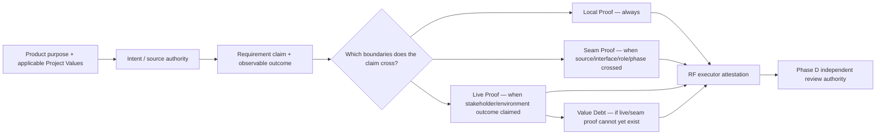
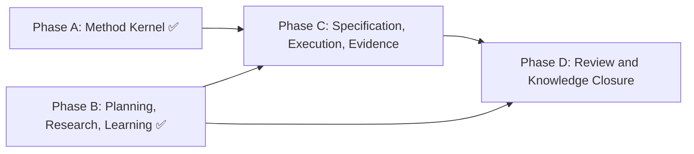

# HL — TFW-48 / Phase C: Specification, Execution, and Claim-Typed Evidence

> **Date**: 2026-07-30
> **Author**: Coordinator (Codex)
> **Status**: ✅ HL — Approved
> **Approval**: 2026-07-30
> **Master HL**: [HL-TFW-48](../HL-TFW-48__value_first_methodology_rebaseline.md)
> **Architecture predecessor**: [Phase A RF](../phase-a/RF__phase-a__method_kernel.md)
> **Current consumer baseline**: [Phase B RF](../phase-b/RF__phase-b__planning_research_learning.md)

---

## 1. Vision

Specification, execution, and evidence form one honest claim chain. A TS preserves the
product purpose, applicable Project Values, source intent, and observable outcome
without prescribing an implementation. Execution may adapt the technical route, but it
cannot silently change a requirement, ignore a crossed boundary, or replace intended
behavior with a convenient proxy. Each claimed deliverable has Local Proof; crossed
sources, interfaces, roles, phases, or live/stakeholder boundaries add Seam Proof or
Live Proof. Proof that cannot yet exist becomes explicit Value Debt rather than a
checkmark.

The existing TS, ONB, RF, and EV topology carries this contract. Phase C adds no
parallel proof artifact and does not turn every task into a large staged package.
Verification depth and packaging remain proportional to each protected claim.

**Impact:** Executors can choose a sound implementation while preserving what the
product is for. Coordinators and later reviewers can distinguish a tested local result,
a verified interface, a live outcome, an executor's attestation, and an honest
non-claim without reconstructing intent from prose.

> "The result is not done because the files agree; it is done when the intended claim
> has the proof its real boundary requires."

## 2. Current State (As-Is)

Phase A established the Method Kernel and claim-typed Proof Records. Phase B preserved
purpose and user insight through planning and research. The active specification and
execution consumers still implement the previous contract:

| Area | Current behavior | Failure exposed |
|------|------------------|-----------------|
| Intent → TS | AC text is requirements-first, but there is no compact relation from source intent/value to the exact outcome and boundary | A material requirement or user correction can disappear between HL and TS |
| Precision | Code identifiers, cited systems, tests, and product outcomes can appear either as requirements or as adaptable Technical Guidance without an explicit distinction | A wrong path or copied implementation detail can look authoritative while a real requirement remains optional |
| Scope budgets | Four configured values are described as quality limits; crossing them automatically implies phase splitting or override | Agents can reclassify work to meet a number or fragment one product outcome into locally complete plumbing |
| Execution | Handoff preserves role lock and onboarding, but duplicates template structure and assumes tests/build as universal steps | Procedural branches grow, non-code work is treated as an exception, and trace volume can displace claim quality |
| RF attestation | RF §3 checkmarks ACs and §4 lists tools, but neither requires a resolvable Proof Record per claimed deliverable | Document agreement can overstate what was actually shown |
| Evidence | TS Evidence fields and EV rows focus on real-environment observations per AC | Local/source/seam proof is not related explicitly to live evidence, so a passing test or an EV file may imply more than it proves |
| Deferred validation | `DEFERRED` and `BLOCKED` name missing evidence states, but do not require the complete Value Debt relation | A future validation can be acknowledged yet become unowned and undiscoverable |
| Trace presence | The evidence folder is mandatory | Folder/file existence remains easy to confuse with evidence sufficiency or claim closure despite D56's narrowing |

Production evidence makes these gaps concrete:

- Helpdesk HD-25 contained a wrong i18n path and RF checkmarks while required integration
  tests were absent.
- Helpdesk HD-26 and HD-30 showed that mocked or phase-local success did not prove the
  live database or adjacent frontend/backend seam.
- Helpdesk HD-23 showed that automatic phase decomposition can ship infrastructure
  while deferring the product reason for the work.
- AFD-10 passed its local TS before comparison with the cited source revealed missing
  migration infrastructure.
- AFD-36 showed that a named command, stale output, a failed command, and a clean
  reproduced aggregate result are different evidence states.
- AFD-14's honest-fleet work exposed failures that synthetic seeders concealed.

The successful routine corpus provides the counterweight: compact reviews and
artifact-local checks can be sufficient when the claim stays local, while AFD-32,
AFD-25, and AFD-51 demonstrate explicit deferred field proof, package-boundary proof,
and live operational debt without requiring one universal trace volume.

## 3. Target State (To-Be)

### 3.1 Result Visualization

Six months after Phase C, an executor opens one AC and can read the complete requirement
without receiving a copy-ready implementation:

```text
AC-3 — Preserve device diagnosis across the registry boundary

Intent / authority:
  Product outcome O2; Project Value "one registry"; cited source AFD registry contract

Claim and boundary:
  A selected device remains diagnosable through registry → API → client.
  Crosses three components and a cited source, so Local + Seam Proof are triggered.

Precision:
  Required identifiers: registry key and public response field.
  Implementation structure: adaptable; executor may deviate with justification.

Gate:
  Local checks on each changed boundary + two-sided seam replay.

Live evidence:
  DEFERRED until the next honest-fleet window.
  Value Debt: owner, due event, evidence route, explicit non-claim.
```

After execution, RF does not merely mark AC-3 complete. It attests which part is
supported, cites the relevant Proof Records, and preserves the live non-claim until the
named event.

### 3.2 Value Flow



| Step | Input | Transformation | Value created |
|------|-------|----------------|---------------|
| Specify | Purpose, values, user insight, cited authority | Define WHAT outcome is claimed and what boundary it crosses | Intent survives without freezing implementation |
| Plan proof | Claim boundary | Select Local, Seam, Live, or Value Debt obligations | Verification follows the truth boundary rather than artifact count |
| Onboard | TS and actual project | Expose impossible identifiers, missing sources, risks, and scope conflicts before action | Specification errors are corrected before implementation compounds them |
| Execute | Approved requirement and adaptable guidance | Produce complete output and report material deviations | Executor judgment remains useful and accountable |
| Observe | Tools, sources, interfaces, live environment | Preserve method, result, artifact, provenance, actor/time when material | Proxy success cannot masquerade as the intended outcome |
| Attest | Claims and Proof Records | RF states supported claim, limitation, or non-claim | Handoff is precise enough for independent review |

### 3.3 Canonical Claim and Proof Hierarchy

| Layer | Semantic meaning | Canonical Phase C surface |
|-------|------------------|---------------------------|
| Requirement claim | The outcome the task is authorized to assert, including source/intent and boundary | TS AC contract |
| Verification | Synthetic tool output or local structural check | RF §4; referenced by Proof Record |
| Evidence | Real-world observation in the intended environment | EV evidence rows |
| Source/interface observation | Comparison of cited source, both sides of a seam, or role/phase handoff | Proof Record with provenance |
| Proof Record | Relation from one claim to the appropriate observations, result, artifact/provenance, and debt | Indexed through the existing EV/RF chain |
| Executor attestation | Executor's accountable statement that a claim is supported, limited, deferred, or not made | RF §3 and §5 |
| Independent judgment | Authority to accept, revise, or reject the attestation against purpose, values, sources, reality, and proof | Phase D REVIEW; not implemented here |

Evidence status applies to an observation, not automatically to the whole deliverable:

| Status | Phase C meaning | Claim consequence |
|--------|-----------------|-------------------|
| `VERIFIED` | The required real-world observation occurred and its artifact/provenance resolves | May support the applicable Live Proof; other triggered proof still remains independent |
| `DEFERRED` | The observation belongs to a named future event and a complete Value Debt relation exists | The deferred outcome remains an explicit non-claim |
| `BLOCKED` | Required observation cannot be obtained and no authorized safe due-event path currently supports closure | The affected claim cannot close; return to authority |
| `N/A` | The evidence class is not triggered for this claim, with a reason | Does not waive Local Proof or any triggered Seam Proof |

### 3.4 Scope-Budget and Phase-Splitting Disposition

Phase C changes no exact configuration value. The four existing scope values remain
transitional inputs until Phase E completes their Numeric Control lifecycle.

| Current object | Phase C authority | Required response when crossed |
|----------------|-------------------|--------------------------------|
| Files per phase | Attention/escalation signal, not automatic failure | Expose why the corpus/change surface is necessary; remove unrelated work or record an authorized bounded override |
| New files per phase | Attention signal for abstraction/blast-radius risk | Prefer an existing semantic owner; a new framework owner still needs explicit scope authority |
| LOC per phase | Descriptive scope warning, never completion or quality proof | Reassess cohesion and reviewability; do not reclassify lines to satisfy the number |
| Modified files | Attention signal for scattered consumer drift | Verify the consumer chain; split only if each part retains a coherent product outcome and owned seam |

Crossing a warning opens a decision among simplification, a coherent value-boundary
split, a bounded override with rationale, or return to Coordinator/user. It does not
command a split. A phase must not be split when doing so would orphan the product
outcome, hide a seam, or defer value without a complete Value Debt record.

## 4. Phases

This is Phase C of the approved TFW-48 master plan.

### Phase Dependencies



| Phase | Depends on | Shared files | Can run in parallel with |
|-------|------------|--------------|-------------------------|
| C | Phase A architecture; current tree includes Phase B consumers | `.tfw/conventions.md`, `.tfw/glossary.md`, `.tfw/workflows/plan.md` | None in the current sequence |
| D | Phase B + Phase C | Evidence status, proof authority, RF/EV review consumers | — |
| E | Phase D | Scope-budget config, lifecycle and exact-value disposition | — |

### Phase C: Specification, Execution, and Claim-Typed Evidence 🔴

> **Requires:** Phase A RF + APPROVE REVIEW. Because Phase B landed first, Phase C also
> consumes its approved current tree and must preserve D56.
>
> **⚠️ Shared files with Phase D:** evidence status and authority definitions. Phase C
> owns requirement, execution, executor-attestation, and proof-record production;
> Phase D owns independent review and knowledge closure.
>
> **Context for coordinator:** Phase A RF/REVIEW; Phase B RF/REVIEW; Iteration 2 D14,
> D17–D19; D24, D49, D52, D53, D55, D56; Helpdesk HD-23/25/26/30 and AFD-10/14/36
> production anchors.
>
> **Key decisions:** preserve requirements-first TS; type precision as requirement or
> adaptable guidance; use the existing EV/RF chain as the Proof Record index and
> executor attestation; make scope values attention signals pending Phase E; keep
> review authority in Phase D.
>
> **⚠️ Cascade dependency:** TS planning, TS template, ONB, handoff, RF, EV,
> conventions, and glossary are one consumer chain. A claim, status, or proof term
> changed in one must be reconciled across every affected Phase C consumer.

**Deliverables:**

1. Add a compact requirement-trace contract from purpose/value/source intent to the
   observable claim and its boundary without adding a new artifact or implementation
   recipe.
2. Distinguish required identifiers, cited systems, tests, and product outcomes from
   adaptable Technical Guidance; require explicit N/A only where an applicable
   cognitive decision yields no content.
3. Convert scope budgets from automatic phase-splitting authority into transitional
   attention/escalation signals while preserving exact config values for Phase E.
4. Simplify the handoff algorithm around onboarding, applicable verification,
   claim-triggered proof collection, deviation reporting, complete output, and RF
   attestation while retaining the full local Executor role lock and approval gate.
5. Require one-or-more Local Proof Records for each claimed deliverable and additive
   Seam/Live Proof or complete Value Debt when the claim triggers them.
6. Align Verification, Evidence, source/interface observation, Proof Record,
   attestation, provenance, status, and deferred validation in the existing TS/RF/EV
   topology.
7. Preserve evidence-folder trace enforcement while making file presence explicitly
   insufficient for proof or completion.
8. Keep Phase D review consumers, Phase E config/exact-value lifecycle, Phase F
   adapters/migration, and H4 strategy architecture outside Phase C.

### Approved Framework Consumer Scope

| Consumer | Phase C responsibility |
|----------|------------------------|
| `.tfw/conventions.md` | Canonical specification/execution/evidence hierarchy and transitional scope-budget authority |
| `.tfw/glossary.md` | Concise definitions and links; no duplicated operational contract |
| `.tfw/workflows/plan.md` | TS claim/boundary/proof planning and non-automatic scope response |
| `.tfw/templates/TS.md` | Compact requirement trace, precision classification, proof/evidence intent |
| `.tfw/templates/ONB.md` | Pre-action reality check for source, identifier, boundary, scope, and proof feasibility |
| `.tfw/workflows/handoff.md` | Role-locked execution, applicable verification, proof collection, deviation, and attestation flow |
| `.tfw/templates/RF.md` | Claim disposition and resolvable Proof Record references |
| `.tfw/templates/evidence/EV.md` | Proof Record index, real-evidence observations, provenance, and Value Debt |

No new framework file is authorized. Task trace files and the README Task Board are
lifecycle artifacts, not additional methodology owners.

## 5. Definition of Done (DoD)

- ✅ 1. Each TS AC can relate source intent/purpose/value to one observable requirement
  claim and its boundary without prescribing implementation.
- ✅ 2. Required identifiers, cited systems, tests, outcomes, and exclusions are precise
  when they define acceptance; adaptable choices remain Technical Guidance.
- ✅ 3. Every claimed deliverable has a resolvable Local Proof Record; crossed
  sources/interfaces/roles/phases and live/stakeholder claims add the appropriate proof.
- ✅ 4. Deferred Seam or Live Proof is represented only through complete Value Debt:
  owner, due event, evidence route, and explicit non-claim.
- ✅ 5. Verification, Evidence, source/interface observation, Proof Record, RF
  attestation, provenance, and independent review authority remain distinct and
  navigable.
- ✅ 6. `VERIFIED`, `DEFERRED`, `BLOCKED`, and `N/A` have non-overlapping operational
  consequences; evidence N/A never waives Local Proof.
- ✅ 7. ONB exposes wrong identifiers, unavailable cited sources, impossible proof,
  requirement/guidance ambiguity, and scope conflicts before execution.
- ✅ 8. Handoff preserves role lock, explicit approval, material-deviation reporting,
  applicable test/build/source/live checks, complete output, and STOP after RF while
  removing duplicated or code-default branches.
- ✅ 9. The mandatory EV file proves trace presence and indexes proof; its existence
  alone is never described as evidence sufficiency or completion.
- ✅ 10. Scope budgets act as attention/escalation signals. Exact values remain
  unchanged; automatic splitting, line reclassification, and value-fragmenting phases
  lose authority.
- ✅ 11. The contract works unchanged for code, documents, research outputs, design,
  operations, and business decisions; applicable N/A is explicit and justified.
- ✅ 12. Exactly the eight approved framework consumers are reconciled, no new
  framework file is created, and Phase D/E/F/H4 boundaries remain explicit.
- ✅ 13. Documentation tests, rendered navigation, consumer scans, status/claim
  scenarios, and protected-value checks pass; any size measurements are descriptive.

## 6. Definition of Failure (DoF)

- ❌ 1. TS becomes a copy-ready implementation, or adaptable guidance is silently
  treated as an acceptance requirement.
- ❌ 2. Product purpose, an applicable Project Value, a user correction, or a cited
  authority can disappear before the requirement claim.
- ❌ 3. An AC, RF checkmark, passing test, named command, EV file, or evidence-folder
  presence is treated as proof beyond the boundary actually observed.
- ❌ 4. A claimed deliverable has no Local Proof, or a crossed source/interface/live
  claim is accepted with local-only proof.
- ❌ 5. `DEFERRED` omits any Value Debt relation, or `N/A` hides uncollected applicable
  evidence.
- ❌ 6. `BLOCKED` work is represented as closed, or RF attestation is confused with
  independent REVIEW proof.
- ❌ 7. Scope numbers remain automatic split/fail/quality authority, are merely raised,
  or are evaded through LOC/file reclassification.
- ❌ 8. Phase splitting produces locally complete plumbing with no coherent product
  outcome, owned seam, or explicit Value Debt.
- ❌ 9. Simplification weakens the Executor role lock, ONB approval gate, deviation
  visibility, complete-output requirement, or STOP before review.
- ❌ 10. Code tests/build/deploy become the universal meaning of verification, evidence,
  or product value.
- ❌ 11. A new proof artifact, competing term owner, global light/heavy execution mode,
  or uniform trace-volume requirement is introduced.
- ❌ 12. Config/template exact values, review/knowledge consumers, adapters, migration,
  release, historical traces, or H4 strategy architecture change in Phase C.
- ❌ 13. A Phase B purpose/research/learning contract regresses or is falsely declared
  superseded.

**On failure:** Stop Phase C, preserve approved Phase A/B contracts, name the unsupported
claim or regressed protected obligation, and return to Coordinator planning. Do not
repair a semantic failure with another section, count, or artifact.

## 7. Principles

1. **Intent Before Specification** — every requirement retains the product reason,
   applicable value, user authority, or cited source that makes it necessary.
2. **Requirements Are WHAT** — acceptance defines observable outcomes and boundaries;
   technical route stays adaptable unless an exact element is itself part of the
   requirement.
3. **Claim Boundary Determines Proof** — Local Proof always applies; Seam and Live
   Proof are additive only when the claim crosses those boundaries.
4. **Presence Is Not Sufficiency** — a file, row, checkmark, command, or artifact proves
   only the observation it actually records.
5. **Reality Can Overrule the Spec** — source inspection, interfaces, stakeholders, and
   live behavior may refute TS, implementation, or RF.
6. **Attestation Is Accountable, Not Final** — RF relates claims to proof and
   limitations; Phase D retains independent acceptance authority.
7. **Honest Non-Claim Beats Proxy Completion** — unavailable proof becomes complete
   Value Debt or blocks the claim.
8. **Product Cohesion Before Scope Metric** — scope signals prompt judgment; they do not
   fragment value or prove quality.
9. **Protected Obligation Is the Proportionality Unit** — packaging may be compact or
   expanded, but no triggered obligation disappears.
10. **Natural Gates Before Repeated Prose** — use the canonical owner plus a
    point-of-use action, while role/safety/destructive/irreversible imperatives remain
    fully local.
11. **Domain-Agnostic by Design** — code is one application; documents, research,
    design, operations, and decisions use the same claim grammar.
12. **Existing Owners Before New Artifacts** — strengthen TS/RF/EV relations instead of
    creating a proof bureaucracy.

### 7.1 Quality Contract

- Every changed instruction names its protected consequence and canonical owner.
- Every removal is classified as obsolete, moved to an owner, replaced by a precise
  term, or covered by a stronger structural relation.
- Every TS claim exposes the boundary needed to derive Local/Seam/Live/Value Debt
  obligations; templates may group records without hiding a triggered obligation.
- Exact required identifiers and sources are acceptance constraints only when the
  intended outcome depends on them; otherwise they remain adaptable guidance.
- Evidence status is scoped to an observation. Claim status and RF attestation must cite
  the Proof Record relation rather than inherit an EV status by implication.
- Mandatory evidence-folder creation remains a trace gate. Claim closure remains an
  evidence/authority decision.
- Scope warnings require an explicit response but never automatic splitting or metric
  gaming. Phase E retains ownership of exact-value/config resolution.
- Role, safety, destructive, and irreversible pre-action boundaries keep complete
  local imperatives; remote references alone remain invalid.
- Existing Phase A/B and historical production traces are append-only.
- A changed canonical concept requires a complete scan of its eight approved Phase C
  consumers and a negative scan of deferred Phase D/E/F/H4 consumers.

### 7.2 Knowledge Citations

| # | Source | Item | How it applies |
|---|--------|------|----------------|
| 1 | [Phase A RF](../phase-a/RF__phase-a__method_kernel.md) | Key Decisions 2–7; claim-typed proof examples | Supplies protected-obligation proportionality, Rule Deployment, Local/Seam/Live/Value Debt, and transition boundaries |
| 2 | [Phase A REVIEW](../phase-a/REVIEW__phase-a__method_kernel.md) | APPROVE, 9/9 AC | Establishes D55 implementation as an approved predecessor |
| 3 | [Phase B RF](../phase-b/RF__phase-b__planning_research_learning.md) | Purpose/uncertainty trace, claim-based closure, numeric ledger | Prevents Phase C from losing planning meaning or reviving count authority |
| 4 | [Phase B REVIEW](../phase-b/REVIEW__phase-b__planning_research_learning.md) | APPROVE, 9/9 AC, 12/12 principles | Confirms the current consumer baseline and D56 boundary |
| 5 | [Iteration 2 RES](../research/iter2/RES.md) | D14, D17–D19 | Requires additive claim-typed proof, proportional packaging, and typed numeric lifecycle with no invented values |
| 6 | [Iteration 1 Gather](../research/iter1/2_gather.md) | HD-23/25/26/30; AFD-10/14/36 | Supplies intent loss, phase fragmentation, source divergence, proxy verification, seam, and honest-live counter-cases |
| 7 | [KNOWLEDGE.md](../../../KNOWLEDGE.md) | D24 | Uses canonical ownership only with observable point-of-use consumption |
| 8 | [KNOWLEDGE.md](../../../KNOWLEDGE.md) | D49 | Preserves requirements-first TS and adaptable technical guidance |
| 9 | [KNOWLEDGE.md](../../../KNOWLEDGE.md) | D52–D53 | Preserves the evidence role pipeline and mandatory trace while narrowing presence-as-completion |
| 10 | [KNOWLEDGE.md](../../../KNOWLEDGE.md) | D55–D56 | Supplies the Method Kernel, proof grammar, purpose-led entry, and claim-based closure |
| 11 | [knowledge/philosophy.md](../../../knowledge/philosophy.md) | F20, F21, F24, F26 | Distinguishes procedural from investigative flow, requires explicit N/A, favors natural enforcement, and lets templates carry output contracts |
| 12 | [knowledge/philosophy.md](../../../knowledge/philosophy.md) | F28, F30, F31 | Requires proactive evidence tooling, preserves Evidence→Attestation→independent judgment symmetry, and keeps justified MAY-deviation |
| 13 | [knowledge/constraint.md](../../../knowledge/constraint.md) | F7 | Requires evidence to remain domain-agnostic and visual/observable for non-code outputs |
| 14 | [knowledge/stakeholder.md](../../../knowledge/stakeholder.md) | F3 | Protects against synthetic tests closing work while real behavior remains broken |
| 15 | [knowledge/process.md](../../../knowledge/process.md) | F4, F6, F16, F18, F23, F25 | Supports algorithmic gates, scope control without explosion, source verification, stable headings, mock→real boundaries, and provenance chains |
| 16 | [knowledge/convention.md](../../../knowledge/convention.md) | F4 | Keeps a point-of-use action beside a canonical reference |

## 8. Dependencies

| Dependency | Status |
|------------|--------|
| TFW-48 Phase A RF | ✅ Complete |
| TFW-48 Phase A REVIEW | ✅ APPROVE |
| TFW-48 Phase B RF | ✅ Complete |
| TFW-48 Phase B REVIEW | ✅ APPROVE |
| TFW-48 Iterations 1–2 | ✅ SUFFICIENT |
| D55/D56 knowledge recording | ✅ Applied |
| Phase D review/knowledge consumers | Not required for execution; must remain unmodified |
| Phase E scope-budget exact values/config lifecycle | Deferred by design |
| H4 comparison or strategy architecture | N/A — unresolved and unauthorized |

## 9. Risks

| Risk | Probability | Impact | Mitigation |
|------|-------------|--------|------------|
| Requirement tracing becomes a mechanical field-filling exercise | Medium | High | One compact relation per material claim; explicit N/A; no duplicate prose |
| Proof terminology duplicates Evidence instead of clarifying it | Medium | High | Canonical hierarchy and scenario tests; Evidence remains real observation, Proof Record remains the relation |
| Every AC produces several mandatory rows | Medium | High | Group packaging when boundaries are shared; preserve obligations, not row volume |
| Scope warnings become so soft that scope explodes | Medium | High | Required response and authority decision when crossed; role/safety boundaries remain hard |
| Scope values continue to anchor behavior despite new wording | High | Medium | Remove automatic split/fail language across every current consumer; retain explicit transitional ledger |
| Existing review templates misunderstand the richer EV/RF relation before Phase D | Medium | High | Preserve current evidence rows/statuses and add compatible proof references; document the Phase D authority boundary |
| `DEFERRED` becomes a convenient escape hatch | High | High | Complete Value Debt is mandatory; otherwise the state is BLOCKED/non-closeable |
| Live evidence is over-required for local reversible work | Medium | Medium | N/A is valid when the live boundary is not triggered; Local Proof remains sufficient for a truly local claim |
| Code-centric examples leak back into universal wording | Medium | High | Cross-domain scenario matrix covering document, research, operations, and decision outputs |
| Handoff compression removes a role-local invariant | Medium | High | Preserve full Executor role lock, approval gate, destructive/authority boundaries, and STOP before review |

## 10. RESEARCH Case

### Blind Spots

- The exact compact table/field layout that best exposes claim boundaries without
  bloating small TS/RF artifacts.
- Which current handoff duplication can be replaced by template references while
  preserving point-of-use enforcement.
- How the richer Proof Record index renders in generated documentation and remains
  legible for a non-code task.

These are implementation and verification questions inside the approved D55
architecture. They do not require comparison among competing methods before TS.

### Hypotheses

| # | Hypothesis | Status |
|---|------------|--------|
| HC1 | Existing TS/RF/EV artifacts can carry claim-typed proof and executor attestation without a new framework artifact | Supported by D55 and Iteration 2; verify structurally in Phase C |
| HC2 | Scope values can remain visible as attention signals without automatic split authority or loss of scope control | Supported by Atamat/Helpdesk/AFD evidence; exact values remain unvalidated and deferred to Phase E |
| HC3 | Evidence statuses can remain backward-compatible when their claim consequences and Value Debt relations are made explicit | Architecture selected; verify through matched status/claim scenarios |

### Risks of Not Researching

No decision-changing uncertainty is being skipped. Two deep TFW-48 iterations already
challenged the architecture against failure-selected, routine software, and non-code
cases. Fresh research would repeat the same corpus without changing the Phase C choice.
The remaining risks are better caught by an Executor ONB consumer audit, scenario
verification, rendered QA, and independent Phase D-style review of this phase.

### Proposed RESEARCH Focus

N/A — do not start a new `/tfw-research` iteration for Phase C. If ONB discovers that
the existing artifact topology cannot express a required proof relation without
semantic duplication, stop execution and return that specific architecture conflict to
Coordinator/user before changing scope.

> **Research decision:** SKIP approved by the user on 2026-07-30. Iterations 1–2 remain
> the research authority for Phase C; HC1–HC3 are implementation-verification premises,
> not authorization for a new research iteration.

### Why Not Just...?

- Why not add a `PROOF.md` artifact? — The existing mandatory EV and RF surfaces can
  index the relation; another owner would violate the task's compression goal.
- Why not make EV status the deliverable status? — An evidence observation cannot prove
  unobserved local, source, interface, or authority boundaries by implication.
- Why not remove scope budgets now? — Exact-value/config cleanup is Phase E; Phase C
  only changes their specification/execution authority.
- Why not keep automatic splitting as a conservative safeguard? — Production cases
  show both metric gaming and value fragmentation; an attention trigger with an owned
  decision protects scope without forcing the wrong product boundary.

## 11. Strategic Insights (Planning)

| # | Insight | Planning implication | TS disposition / destination | Category | Source |
|---|---------|----------------------|------------------------------|----------|--------|
| S1 | TFW must aim at product meaning, goals, and values—not only code and development | Make intent/value continuity and cross-domain scenarios acceptance requirements | AC-1, AC-11; DoF code-default condition | philosophy | User, TFW-48 inception |
| S2 | Stronger models follow instructions and their mistakes more reliably, so inherited limits must be reconsidered | Remove automatic authority from unsupported scope counts without inventing larger values | Scope; AC-10; Phase E downstream | constraints | User, TFW-48 limit discussion |
| S3 | A precise correct term compresses context and guides agents better | Use one canonical claim/proof hierarchy and resolvable references | AC-5; terminology/consumer scan | conventions | User, TFW-48 inception |
| S4 | Stronger models may need one canonical owner plus references, but production projects must validate the enforcement | Keep references only with observable point-of-use actions; preserve full local role/irreversible gates | Technical Guidance; AC-7/8; DoF-9 | process | User, reference-locality discussion |
| S5 | Cognitive strategies and heuristics may become selectable research methods later, but their model effect is still uncertain | Keep H4 unresolved and exclude selector/catalog/runtime architecture from Phase C | Out of Scope; DoF-12; separate future task | research | User, future research-method discussion |
| S6 | Existing local Codex Executor and Reviewer sessions should perform and independently review Phase C, reporting to the Coordinator | After TS approval, dispatch `/tfw-handoff` to the existing Executor session; after RF, dispatch `/tfw-review` to the existing Reviewer session | Task-local execution coordination; not a framework AC | process | User, Phase C command |

> fact-candidates: processed 2026-07-30

---

*HL — TFW-48 / Phase C: Specification, Execution, and Claim-Typed Evidence | 2026-07-30*
