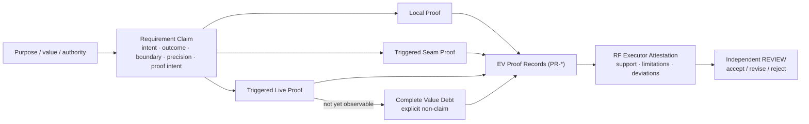

# RF — TFW-48 / Phase C: Specification, Execution, and Claim-Typed Evidence

> **Date**: 2026-07-30
> **Author**: Codex Executor
> **Status**: 🟢 RF — Complete
> **Parent HL**: [Phase C HL](HL__phase-c__specification_execution_evidence.md)
> **TS**: [Phase C TS](TS__phase-c__specification_execution_evidence.md)
> **Executor Attestation**: This RF states only what the Executor can support from the
> cited Proof Records and disclosed limitations. Independent Phase D REVIEW retains
> acceptance/rejection authority.

---

## 1. What Was Done

### New Files

| File | Description |
|------|-------------|
| `phase-c/evidence/EV__phase-c__specification_execution_evidence.md` | Stable `PR-*` index, backward-compatible Evidence rows and verdict, rendered observation, verification snapshot, and Value Debt disposition |
| `phase-c/RF__phase-c__specification_execution_evidence.md` | Executor Attestation, ownership/scenario matrices, exact verification, measurements, learning sections, and handoff result |

The Phase C ONB was created, committed, pushed, and approved separately in Phase 1
(`00cf52a`); it is not rewritten by this execution commit.

### Modified Files

| File | Changes |
|------|---------|
| `.tfw/conventions.md` | Owns the Requirement Claim → applicable observation → Proof Record → RF Executor Attestation chain, status consequences, Material Deviations, complete Value Debt, role boundary, and transitional scope-attention response |
| `.tfw/glossary.md` | Defines concise linked Requirement Claim, Verification, Proof Record, Executor Attestation, Material Deviation, Evidence-status, and Scope Budget meanings without duplicating procedures |
| `.tfw/workflows/plan.md` | Adds Pre-TS claim/precision/proof gates and value/cohesion-led scope-signal decisions |
| `.tfw/templates/TS.md` | Carries compact/groupable intent, claim, boundary, precision, proof intent, Gate, and Evidence fields inside each material AC |
| `.tfw/templates/ONB.md` | Uses existing sections for identifier/source/check/proof/outcome/scope reality checks and blocking mismatch disposition |
| `.tfw/workflows/handoff.md` | Preserves local role/approval/STOP imperatives while making execution, checks, deviations and proof claim-applicable and delegating shapes to templates |
| `.tfw/templates/RF.md` | Makes RF an accountable attestation with `PR-*` references, limitations, deviations, reproducible verification, measurements, and concise EV pointer |
| `.tfw/templates/evidence/EV.md` | Adds stable/groupable Proof Record and complete Value Debt indexes while preserving the existing Evidence rows, statuses, artifact pointers and verdict |
| `README.md` | Moves only the TFW-48 Task Board row to `🟢 RF (C)` and links the Phase C RF |

## 2. Key Decisions and Material Deviations

1. **One relation, existing artifacts.** `conventions.md` owns the semantic chain;
   TS carries Requirement Claims, EV indexes `PR-*`, and RF attests. No proof,
   attestation, scope, or debt artifact was added.
2. **Proof volume follows boundaries.** Every claimed deliverable has Local Proof;
   crossed/live boundaries add only their triggered Seam/Live Proof. Grouping and
   justified `N/A` remain valid when every claim and boundary resolves.
3. **Evidence status remains compatible and narrow.** The four existing names,
   Evidence rows, artifact column and RF pointer remain. Status applies only to its
   observation row and cannot become claim closure or REVIEW authority.
4. **Requirement precision is conditional.** Identifiers, source relations, checks and
   outcomes bind only when compatibility, fidelity or acceptance depends on them.
   Adaptable guidance may vary only with a disclosed claim/proof rationale.
5. **Scope numbers prompt a decision.** Exact `14/8/1200/12` values stay unchanged.
   Crossing one requires simplification, unrelated-scope removal, coherent value split,
   bounded override, or return to authority; it does not auto-pass, fail or split.
6. **Workflow owns action; templates own output shape.** Handoff keeps the complete
   local Executor role lock, ONB approval, complete output, deviation and STOP gates,
   but removes duplicated ONB/RF forms and code-default universal branches.
7. **Compatibility precedes downstream migration.** Current Phase D Evidence/audit
   surfaces remain legible. REVIEW, knowledge/lifecycle/adapters/migration/release,
   Phase D/E/F, H4 and historical traces were not changed or claimed complete.
8. **The estimate is descriptive.** The framework diff is 510 insertions plus
   192 deletions, or 702 changed lines—two above the TS estimate's upper end. The
   Coordinator accepted this as the smallest coherent eight-consumer result; no owner,
   file or scope was added and semantics were not compressed to satisfy the estimate.

### Material Deviations

No material deviations. The 702-line descriptive outcome is not a scope or requirement
deviation, and the Coordinator explicitly accepted it after the implementation
checkpoint.

### Transition and Removal Classification

| # | Former behavior/content | Classification | Current owner or stronger relation |
|---|-------------------------|----------------|------------------------------------|
| R1 | Generic Proof Record fields without the complete claim/attestation consequence chain | Covered by stronger structural relation | `conventions.md` Requirement Claim → observation → `PR-*` → RF attestation → independent REVIEW |
| R2 | Glossary Scope Budget: exceeding limits degrades quality and requires a split | Replaced by precise term | Glossary concise definition points to `conventions.md` §6 attention-signal response |
| R3 | Plan budget branch limited to split or override | Replaced by precise decision set | `plan.md` Step 7 consumes simplify/remove/coherent-split/override/return choices |
| R4 | TS ACs with generic prose/Gate/Evidence only | Covered by stronger structural relation | TS compact Requirement Claim fields plus claim-applicable Gate/Evidence |
| R5 | ONB generic entry points with no explicit source/proof feasibility check | Covered by stronger structural relation | ONB Entry Points reality table plus existing Questions/Risks/Inconsistencies |
| R6 | Handoff duplicated the complete ONB and RF form shapes | Moved to owner/reference | ONB/RF/EV templates own shapes; handoff retains point-of-use action and observable gates |
| R7 | RF binary checklist and generic lint/test/verify placeholders | Replaced by precise term | RF claim statement → `PR-*`/limitation checkbox plus reproducible verification table |
| R8 | EV per-AC Evidence-only structure | Covered by stronger structural relation | Stable Proof Record and Value Debt indexes surround the unchanged Evidence row/status/artifact surface |

## 3. Acceptance Criteria and Executor Attestation

| AC | Claimed deliverable and Executor statement | Proof Record(s) | Limitations, Value Debt, or blocked condition | Result |
|----|--------------------------------------------|-----------------|----------------------------------------------|--------|
| AC-1 | The exact eight consumers form one canonical owner/consumer chain and introduce no competing artifact or Phase A/B redefinition. | PR-1 | None | [x] |
| AC-2 | Planning and TS preserve intent through compact observable Requirement Claims whose boundaries trigger proportional proof. | PR-2 | None | [x] |
| AC-3 | Acceptance-critical precision, adaptable guidance and ONB reality checks return the correct block/deviation/N/A/debt response. | PR-3 | None | [x] |
| AC-4 | Exact scope values remain visible but operate only as owned attention/escalation signals with value-led responses. | PR-4 | None | [x] |
| AC-5 | Handoff remains locally role-locked and works through claim-applicable gates across six domains without code-default procedure. | PR-5 | None | [x] |
| AC-6 | Every claimed deliverable resolves to stable, grouped-when-safe Proof Records with every triggered boundary visible. | PR-6 | None | [x] |
| AC-7 | The four existing Evidence statuses have distinct observation-row consequences and complete debt/provenance requirements. | PR-7 | None | [x] |
| AC-8 | RF is accountable Executor Attestation with proof, limitations, deviations and independent-review boundary. | PR-8 | None | [x] |
| AC-9 | Six production counter-cases and six cross-domain/routine cases preserve honest claim boundaries without uniform proof volume. | PR-9 | None | [x] |
| AC-10 | All and only eight consumers changed; generated pages, tests, links, anchors, protected content, statuses and exact scope pass their gates. | PR-10 | None | [x] |

### Principles Check

| # | Principle | Result | Resolving proof |
|---|-----------|--------|-----------------|
| P1 | Intent Before Specification | PASS — plan/TS and ONB preserve intent/source before action | PR-2, PR-3 |
| P2 | Requirements Are WHAT | PASS — binding precision is separated from adaptable guidance and implementation | PR-2, PR-3 |
| P3 | Claim Boundary Determines Proof | PASS — Local/Seam/Live/Value Debt triggers resolve in all proof scenarios | PR-2, PR-6, PR-9 |
| P4 | Presence Is Not Sufficiency | PASS — files, rows, checkmarks and passing proxies assert only observed boundaries | PR-6, PR-7, PR-8 |
| P5 | Reality Can Overrule the Spec | PASS — source, seam, live and blocker paths limit or reject attestation | PR-3, PR-6, PR-7 |
| P6 | Attestation Is Accountable, Not Final | PASS — RF names Executor authority and preserves independent REVIEW | PR-7, PR-8 |
| P7 | Honest Non-Claim Beats Proxy Completion | PASS — `DEFERRED` requires complete debt and `BLOCKED` cannot close | PR-7, PR-8 |
| P8 | Product Cohesion Before Scope Metric | PASS — six scope cases return authority decisions without numeric closure | PR-4, PR-9 |
| P9 | Protected Obligation Is the Proportionality Unit | PASS — proof packaging varies while all triggered obligations remain | PR-5, PR-6, PR-9 |
| P10 | Natural Gates Before Repeated Prose | PASS — owner/reference/action matrix replaces duplicated output forms without weakening local hard gates | PR-1, PR-5, PR-10 |
| P11 | Domain-Agnostic by Design | PASS — six domain cases share universal terms and only claim-applicable checks | PR-5, PR-9 |
| P12 | Existing Owners Before New Artifacts | PASS — eight approved consumers, zero new framework files/artifact types | PR-1, PR-6, PR-10 |

### Ownership and Consumer Matrix

| Consumer | Semantic owner or source | Point-of-use action | Protected consequence | Transition boundary |
|----------|--------------------------|---------------------|-----------------------|---------------------|
| `.tfw/conventions.md` | Operational owner for Requirement Claim/proof/attestation, status consequences and scope signals; D55/D56 remain predecessor authority | Defines the one chain and breach consequences | Prevents proof/status/authority collapse and numeric auto-closure | Phase D owns independent judgment; Phase E owns numeric restore/retire |
| `.tfw/glossary.md` | Concise definition owner linked to conventions/templates | Resolves term meaning without copying procedures | Prevents competing definitions | Later phases reference/narrow only through approved scope |
| `.tfw/workflows/plan.md` | Consumer of purpose/insights and scope signals | Disposes material inputs, chooses claim boundary/precision/proof, and records scope response before TS | Prevents intent loss, implementation-as-requirement and metric-led fragmentation | Phase B research contract unchanged; Phase E numeric lifecycle deferred |
| `.tfw/templates/TS.md` | Output owner for compact Requirement Claims | Carries intent/claim/boundary/precision/proof/Gate/Evidence inside ACs | Prevents unprovable or implementation-prescriptive specification | Phase F migration validation deferred |
| `.tfw/templates/ONB.md` | Output owner for pre-action reality trace | Compares identifiers/sources/checks/proof/outcomes/scope to the actual project and routes mismatches | Prevents action on false paths, unavailable sources or fragmented outcomes | Phase F copied/generated artifact validation deferred |
| `.tfw/workflows/handoff.md` | Procedural owner for Executor action and hard gates | Loads context, enforces approval/dependencies/applicable checks/deviations/proof/Pre-RF/STOP | Prevents role drift, silent change, proxy completion and code-default workflow | Phase F adapter/migration parity deferred |
| `.tfw/templates/evidence/EV.md` | Output owner for `PR-*`, Evidence rows/verdict and Value Debt | Relates claims/boundaries to observations/provenance while preserving four statuses | Prevents row/folder presence from becoming proof or closure | Phase D audit and Phase F migration execution deferred |
| `.tfw/templates/RF.md` | Output owner for Executor Attestation | Relates each deliverable to `PR-*`, limitations/debt/deviations and reproducible checks; points to EV | Prevents self-approval and unsupported checkmarks | Phase D REVIEW retains independent accept/reject authority |

## 4. Verification

| # | Claim / failure protected | Command or method | Actual result | Proof Record(s) |
|---|---------------------------|-------------------|---------------|-----------------|
| V1 | Documentation generator behavior | `python -m pytest docs/scripts/test_gen_docs.py docs/scripts/test_integration.py` | 68 passed in 53.79s | PR-10 |
| V2 | Generated pages exist from current consumers | `python -m mkdocs build --config-file docs/mkdocs.yml` | PASS in 40.62s | PR-10 |
| V3 | Phase C adds no strict documentation warning | Run identical `mkdocs build --strict` in detached `00cf52a` and final trees; normalize whitespace in warning blocks; compare duplicate-preserving multisets | Baseline and final both exit 1 with 264 normalized records / 121 unique; added 0, removed 0. Shared 29-file ignored TFW-36 input was mirrored into baseline to avoid an environmental false delta. | PR-10 |
| V4 | Concrete source links and new owner/template anchors resolve | Filesystem Markdown-link audit plus browser navigation to 11 named anchors | 76/76 concrete source links and 11/11 rendered anchors resolved; two intentional `PROJ-*` examples excluded | PR-1, PR-2, PR-10 |
| V5 | Changed pages remain readable without body-level overflow | Browser opened all eight pages at 1265×720 and 753×720 content viewports; DOM/layout inspection | 8/8 desktop and 8/8 responsive pages had no body overflow; wide EV tables stayed within MkDocs scroll wrappers | PR-2, PR-5, PR-6, PR-7, PR-8, PR-10 |
| V6 | Claim/proof/status/scope branches are structurally present | Whitespace-normalized regex assertion set across the eight consumers | 21/21 assertions passed | PR-3, PR-4, PR-6, PR-7 |
| V7 | Former auto-split and code-universal definitions are absent | Targeted negative scan for degradation/mandatory split, unconditional tests/build and proof-from-presence patterns | All targeted former patterns absent | PR-4, PR-5, PR-10 |
| V8 | Exact framework and lifecycle write set | `git diff --name-only` compared with TS §4 plus EV/RF/README inventory | 8/8 approved framework consumers; EV/RF and README only; 0 extra framework files/consumers | PR-1, PR-10 |
| V9 | Protected configuration and exact values remain unchanged | Protected-file diff plus exact-value scan against `00cf52a` | Config/config-template diff empty; `14/8/1200/12` unchanged | PR-4, PR-10 |
| V10 | Whitespace and patch integrity | `git diff --check` | PASS | PR-10 |

### Production Counter-Case Matrix

| Case | Claim and triggered proof | Valid attestation / non-claim | Authority outcome |
|------|---------------------------|-------------------------------|-------------------|
| HD-25 — wrong identifier or missing required test | Acceptance-critical identifier/check requires actual-project comparison and Local Proof | No checkmark; blocking ONB question when mismatch/missing route remains | Coordinator/user resolves or changes requirement; Executor STOP |
| HD-30 — local phase succeeds but adjacent seam is unverified | Local Proof plus Seam Proof of both phases/sides and their relation | Local result may be supported; crossed outcome remains blocked or explicit Value Debt non-claim | Seam owner/due event required before crossed claim closes |
| HD-23 — phase split defers the product outcome | Scope response must preserve coherent outcome, seams and due Live Proof | Split is invalid without owner, due event, evidence route, impact and non-claim | Return to Coordinator/user for coherent split or bounded override |
| AFD-10 — cited source without comparison | Source crossing triggers Seam Proof of source, adapted side and required relation | Citation alone is not support; comparison record may support faithful adaptation | Source/requirement authority decides required fidelity |
| AFD-36 — stale output, failed command, clean reproduced result | Verification record preserves command, actual result, provenance/freshness and rerun | Stale/failed results remain distinct; only the clean reproducible result supports its observed boundary | Executor reports failure/repair; Reviewer can independently rerun |
| AFD-14 — synthetic setup presented as honest-live result | Local setup proof plus triggered Live Proof in intended stakeholder/environment event | Synthetic setup supports only local readiness; live outcome remains Value Debt or BLOCKED | Live owner/event or independent authority controls closure |

### Cross-Domain and Routine Matrix

| Case | Requirement Claim and boundary | Triggered proof | Valid Executor statement | Authority outcome |
|------|--------------------------------|-----------------|--------------------------|-------------------|
| Local document | Observable document content/layout within one owned file; no cited/live crossing | Compact Local source/render proof; Evidence `N/A` when no intended-environment outcome is claimed | Document is supported within the local boundary | Executor attests; Reviewer judges |
| Cited-source research adaptation | Observable synthesis faithful to a named source relation | Local result plus Seam comparison of source, synthesis and relation | Adaptation supported only to the compared relation; exclusions explicit | Source authority and Reviewer remain decisive |
| Cross-component software feature | Observable behavior spans producer/consumer interface and exact contract identifiers | Local proof on both sides plus Seam test/inspection; live only if environment outcome is claimed | Component-local support cannot close the interface without Seam Proof | Interface owner resolves mismatch; Reviewer judges |
| Stakeholder design outcome | Observable design artifact plus stakeholder/use outcome | Local render/usability proof and Live stakeholder observation; unavailable live event becomes Value Debt | Design artifact may be supported; stakeholder outcome unclaimed until observed | Stakeholder/Coordinator owns due event; Reviewer judges evidence |
| Operational action | Observable runbook/action plus environment or irreversible state change | Local source/check proof and Live observation at the authorized action event | Readiness may be supported; irreversible/environment result only after authorized observation | User/operations authority controls action and closure |
| Business decision | Observable decision record tied to purpose, values and cited facts; no code boundary by default | Local decision/source proof, Seam comparison for cited inputs, Live confirmation only when stakeholder adoption is claimed | Decision rationale supported within cited scope; adoption remains separate | Decision owner accepts/changes; Reviewer judges process claim |

### Precision and ONB Reality Matrix

| Scenario | Required disposition |
|----------|----------------------|
| Wrong acceptance-critical path/API/identifier | Blocking Question and STOP; do not silently substitute |
| Unavailable acceptance-critical cited source | Blocking Question and STOP unless authority changes the requirement |
| Omitted required check whose protected failure remains | Blocking Question or blocked/non-claim outcome before RF |
| Adaptable implementation substitution | May proceed with RF source, rationale, affected claim/proof and authority |
| Non-code task with no code identifier/test/build boundary | Explicit `N/A` with claim-based reason; use source/render/stakeholder/decision checks as triggered |
| Live Proof impossible during authorized execution | Complete Value Debt with owner/due event/route/non-claim when a safe future event exists; otherwise `BLOCKED` |

### Proof Scenario Matrix

| Scenario | Local Proof | Additive proof | Result |
|----------|-------------|----------------|--------|
| Local document | Required against owned content/layout requirement | None when no source/live boundary is crossed | Compact Local record can support closure |
| Cross-source content | Required for produced content | Seam verifies source, adapted output and required relation | Citation alone fails; compared relation may close |
| Cross-component software | Required for each claimed side | Seam verifies producer, consumer and interface relation | One-sided success cannot close crossed behavior |
| Cross-phase handoff | Required for each phase-local output | Seam verifies upstream output, downstream input and handoff relation | Phase checkmarks cannot imply the handoff |
| Live stakeholder outcome | Required for local artifact/readiness | Live observes intended stakeholder/environment outcome | Only the observed outcome may be claimed |
| Deferred live outcome | Required for supported local result | Complete Value Debt names owner, due event, route, impact and non-claim | Local support may coexist; live outcome remains unclaimed |

### Evidence Status Matrix

| Scenario | Status | Required consequence |
|----------|--------|----------------------|
| Intended live observation occurred with resolvable provenance | `VERIFIED` | May support only the Live boundary named by the Proof Record |
| Named future observation event with complete Value Debt | `DEFERRED` | Deferred outcome remains an explicit non-claim |
| External impasse with no authorized safe due-event path | `BLOCKED` | Affected claim cannot close |
| Genuinely local-only claim; Evidence/live class not triggered | `N/A` | Reason required; Local and triggered Seam Proof remain |
| Claimed live observation lacks artifact/provenance | Invalid `VERIFIED` | Status gate fails; no supported live claim |
| `N/A` has no boundary-based reason | Invalid `N/A` | Status gate fails; cannot waive triggered proof |

### Scope-Attention Matrix

| Scenario | Authority decision |
|----------|--------------------|
| Below every configured signal | Continue only if the outcome is still coherent, safe and provable; numbers do not pass it |
| Smallest coherent value slice crosses a signal | Simplify where possible or record a bounded cohesion/proof override; no automatic split |
| Unrelated work causes growth | Remove unrelated work from approved scope |
| Outcome separates into complete value slices | Split only with explicit inputs, outcomes, seams, owners and proof for each slice |
| Enabling work is inseparable and live validation is due later | Keep the coherent slice and record complete Value Debt for the due live boundary |
| File/LOC category is changed only to satisfy a number | Prohibited metric gaming; use the real physical/functional measurement and authority response |

### Descriptive Measurements

One PowerShell method normalized CRLF/CR to LF, removed one terminal newline, counted
physical lines, counted regex `\S+` tokens, and counted physical decision-branch lines
matching `(?i)^\s*(?:[-*]\s+)?(?:if|else|when|otherwise)\b|→`. Baseline content came
from `git show 00cf52a:<path>`; final content came from the working tree.

| Measurement | Before | After | Delta | Meaning |
|-------------|-------:|------:|------:|---------|
| Physical lines across eight consumers | 1,864 | 2,182 | +318 | Descriptive source size |
| `\S+` tokens across eight consumers | 15,207 | 18,472 | +3,265 | Descriptive content volume |
| Decision-branch cue lines | 142 | 153 | +11 | Descriptive conditional/flow cues, not semantic completeness |
| Approved framework consumers | 8 | 8 | 0 | Exact owner/consumer inventory |
| New framework files/artifact types | 0 | 0 | 0 | No framework topology expansion |
| Changed framework lines (insertions + deletions) | 0 | 702 | +702 | Git diff statistic; 510 insertions + 192 deletions |

| Consumer | Lines before | Lines after | `\S+` before | `\S+` after | Branch cues before | Branch cues after |
|----------|-------------:|------------:|--------------:|-------------:|-------------------:|------------------:|
| `.tfw/conventions.md` | 856 | 977 | 7,165 | 8,355 | 37 | 43 |
| `.tfw/glossary.md` | 326 | 338 | 3,643 | 3,983 | 70 | 74 |
| `.tfw/workflows/plan.md` | 195 | 225 | 1,487 | 1,734 | 25 | 25 |
| `.tfw/templates/TS.md` | 100 | 144 | 533 | 885 | 0 | 0 |
| `.tfw/templates/ONB.md` | 49 | 72 | 258 | 555 | 0 | 0 |
| `.tfw/workflows/handoff.md` | 172 | 172 | 1,261 | 1,261 | 8 | 9 |
| `.tfw/templates/RF.md` | 114 | 161 | 593 | 1,028 | 2 | 2 |
| `.tfw/templates/evidence/EV.md` | 52 | 93 | 267 | 671 | 0 | 0 |

## 5. Evidence

See [EV file](evidence/EV__phase-c__specification_execution_evidence.md) for the
Proof Record index and Evidence details.

Evidence verdict: 6/10 VERIFIED, 0 DEFERRED, 0 BLOCKED, 4 N/A

No Evidence limitations beyond the local generated-documentation boundary stated in
EV and the explicit `N/A` dispositions in §3/EV. No public deployment, production
migration, Phase D review behavior, or H4 strategy effect is claimed.

## 6. Observations (out-of-scope, not modified)

No observations. The strict MkDocs warning baseline is a known repository-level
condition tracked under TD-125 and is handled as a measured verification delta rather
than a newly discovered implementation observation.

## 7. Fact Candidates

| # | Category | Candidate | Source | Confidence |
|---|----------|-----------|--------|------------|
| F1 | process | For Phase C, framework scope is exactly eight named consumers; a ninth consumer is observation-only and downstream Phase D/E/F/H4 surfaces remain protected. | User delegation, Coordinator approval, 2026-07-30 | High |
| F2 | convention | Phase D compatibility requires preserving the existing Evidence rows, four status names and artifact pointers while Phase C narrows their semantics and consequences. | User delegation, Coordinator approval, 2026-07-30 | High |
| F3 | constraint | The 350–700 changed-line range is a descriptive estimate, not an acceptance quota; 702 is accepted when it is the coherent eight-consumer result with no owner/scope expansion. | User delegation, checkpoint clarification, 2026-07-30 | High |
| F4 | process | Strict documentation warnings must be judged by normalized baseline-to-final delta; unchanged TD-125 warnings are not attributable to the current phase. | User delegation, checkpoint clarification, 2026-07-30 | High |

These are not verified project facts until the post-review knowledge workflow.

## 8. Strategic Insights (Execution)

| # | Insight | Category | Source |
|---|---------|----------|--------|
| S1 | Product cohesion outranks numeric neatness: forcing a semantic compression or arbitrary split to satisfy an estimate can destroy the very claim/proof relation the phase is meant to protect. Implication: future numeric-control work should preserve explicit authority responses, not infer quality from a threshold. | philosophy | User checkpoint clarification, 2026-07-30 |
| S2 | Compatibility and semantic narrowing can coexist: retaining row/status/pointer topology while strengthening consequences creates a safer transition surface for independent review. Implication: Phase D can consume Phase C proof without first migrating every historical artifact. | convention | User Coordinator approval, 2026-07-30 |
| S3 | A repository-wide warning count is not attribution. Implication: quality gates for mature documentation repositories should compare normalized warning multisets against an approved baseline and block only added regressions within scope. | process | User checkpoint clarification, 2026-07-30 |

## 9. Diagrams

---

*RF — TFW-48 / Phase C: Specification, Execution, and Claim-Typed Evidence | 2026-07-30*
