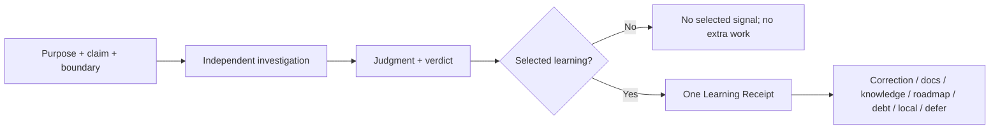

# HL — TFW-48 / Phase D: Lean Review and Knowledge Closure

> **Date**: 2026-07-31
> **Author**: Coordinator (Codex)
> **Status**: ✅ HL — Approved under delegated owner authority
> **Master HL**: [HL-TFW-48](../HL-TFW-48__value_first_methodology_rebaseline.md)
> **Requires**: Phase B and Phase C APPROVE reviews

---

## 1. Vision

Review answers one question: **does reality support the intended product claim?** It
compares purpose, applicable Project Values, cited authority, delivered result, and the
proof required by the claim boundary. Knowledge closure answers another: **did we learn
anything that can change a future decision, and where does it belong?**

Phase D removes everything that does not help answer those questions. Precise terms,
one semantic owner, and short point-of-use instructions replace repeated checklists,
mode documents, stage templates, empty Fact Candidate sections, and duplicated closure
rules. Independence, counter-evidence, Local/Seam/Live Proof, Value Debt, and human
authority remain; their current file ceremony does not.

**Impact:** the default review becomes shorter and sharper, project learning becomes
selective, and the mandatory startup context becomes materially smaller.

> “Keep the judgment. Cut the ceremony.”

## 2. Current State

Phases A–C improved semantics but failed the cleanup outcome:

| Corpus | Lines | UTF-8 `\S+` tokens |
|--------|------:|--------------------:|
| Startup before TFW-48 | 1,309 | 15,875 |
| Startup after Phase C | 1,874 | 22,928 |
| Current startup (`AGENTS`, conventions, glossary, KNOWLEDGE, README) | 2,041 | 25,584 |
| Exact Phase D consumer corpus | 2,609 | 28,169 |
| Review/closure workflow-template subset | 937 | 6,041 |

The same obligations are currently repeated in `review.md`, three mode files, three
stage templates, REVIEW, conventions, and glossary. A normal review produces Map,
Verify, Judge, and REVIEW files even though REVIEW repeats their tables. RF, RES, and
REVIEW carry long candidate instructions when no signal exists. Review, docs, and
knowledge each repeat closure routing. KNOWLEDGE is loaded as an index but duplicates
historical detail already stored in linked task traces.

Independent review itself remains valuable. TFW-48 Phase B required repeated REVISE
cycles to find contradictory glossary/conventions authority around iterations, numeric
closure, and file-presence semantics after implementation tests were green. AFD and
Helpdesk also show that cited-source divergence, stale/proxy evidence, missing seams,
and value regressions can survive locally consistent artifacts. The useful mechanism is
fresh investigation and judgment—not the number of review files.

Other tasks and their implementation choices are not design inputs or regression
targets for this phase. Phase D changes only its explicit TFW-48 consumer chain.

## 3. Target State

### 3.1 Finished Result

One REVIEW contains the whole dependency without repeating evidence:

```text
MAP     claim, purpose/value/source, boundary, risk
VERIFY  fresh check or attack, actual result, counter-evidence, limitation
JUDGE   supported / finding / debt, citing VERIFY
DECIDE  APPROVE / REVISE / REJECT, then route selected learning
```

Routine local claims may share one row. A source, interface, stakeholder, live, safety,
or irreversible boundary expands the investigation. A sampling number never closes an
untested material claim.

### 3.2 Value Flow



### 3.3 Exact Simplification

Phase D changes the existing 15-path chain and creates no framework file:

| Action | Paths | Result |
|--------|-------|--------|
| Keep and shorten | conventions, glossary, KNOWLEDGE, review workflow, REVIEW template, docs workflow, knowledge workflow, RF template, RES template | Nine live owners/consumers |
| Delete | three review mode files; three review stage templates | Six files and six mandatory reads/templates removed |

`code`, `docs`, and `spec` remain concise **risk lenses inside `review.md`**, not separate
workflows or a mode-selection WAIT. Map → Verify → Judge → Decide remains a reasoning
sequence inside REVIEW, not four required artifacts.

The existing Learning Receipt remains the only routing relation:

| Disposition | Required minimum |
|-------------|------------------|
| correction | finding + actor |
| docs / knowledge / roadmap / debt | source + owned destination + actor |
| local / reject | state + reason |
| defer | destination or due event + actor |
| no signal | `No selected signal`; no table or marker |

`/tfw-docs` continues to own architecture/decisions/legacy/debt.
`/tfw-knowledge` continues to own verified human/project facts. Review chooses the
route once; the destination workflows do not repeat the controller.

KNOWLEDGE remains a live index: each D-record keeps its identifier, current decision,
reason needed to distinguish it, and source. Linked task artifacts retain historical
detail. No archive or replacement index is added.

### 3.4 Binding Reduction

These are task-specific acceptance measurements, not universal model limits:

| Corpus | Current | Required final |
|--------|---------|---------------:|
| Startup | 2,041 lines / 25,584 tokens | ≤1,850 / ≤22,000 |
| Review/closure subset | 937 lines / 6,041 tokens | ≤700 / ≤4,200 |
| All 15 affected paths | 2,609 lines / 28,169 tokens | ≤2,200 / ≤23,000 |

All three must pass. A semantic regression cannot be offset by deleting more text; a
missed reduction cannot be relabeled “descriptive.”

## 4. Phase Scope

### Phase D: Lean Review and Knowledge Closure 🔴

**Deliverables:**

1. Replace four mandatory review artifacts with one REVIEW containing the four
   non-overlapping reasoning sections.
2. Replace three mode documents and the mode WAIT with short risk lenses in `review.md`.
3. Make claim consequence and boundary—not file ratio, checkmark, or test count—the
   review coverage rule.
4. Keep product purpose, Project Values, cited sources, counter-evidence, independent
   authority, and Local/Seam/Live/Value Debt checks.
5. Use one Learning Receipt to route selected findings; make no-signal genuinely empty
   work.
6. Keep docs and verified-fact ownership separate while removing duplicated closure
   orchestration.
7. Compress KNOWLEDGE into a resolvable index without losing D1–D60, sources, key
   artifacts, legacy dispositions, or fact links.
8. Meet all three reduction gates and pass production-derived, cross-domain scenarios.

### Affected Paths

**MODIFY (9):**

- `.tfw/conventions.md`
- `.tfw/glossary.md`
- `KNOWLEDGE.md`
- `.tfw/workflows/review.md`
- `.tfw/templates/REVIEW.md`
- `.tfw/workflows/docs.md`
- `.tfw/workflows/knowledge.md`
- `.tfw/templates/RF.md`
- `.tfw/templates/RES.md`

**DELETE (6):**

- `.tfw/workflows/review/code.md`
- `.tfw/workflows/review/docs.md`
- `.tfw/workflows/review/spec.md`
- `.tfw/templates/review/map.md`
- `.tfw/templates/review/verify.md`
- `.tfw/templates/review/judge.md`

No other framework path is authorized. Phase E owns numbers/config/extensions. Phase F
owns adapters/migration/final production validation. Other tasks remain separate.

## 5. Definition of Done

- ✅ 1. One REVIEW trace carries Map → Verify → Judge → Decide without duplicated raw
  evidence or mandatory stage files.
- ✅ 2. Review can reject TS/RF agreement that conflicts with purpose, a Project Value,
  cited source, delivered reality, evidence honesty, or an adjacent seam.
- ✅ 3. Routine claims stay compact; source/interface/live/safety/irreversible claims
  trigger the necessary investigation and proof.
- ✅ 4. `min_verify_ratio` is not completion authority and remains unchanged in config
  for Phase E disposition.
- ✅ 5. Each selected learning signal has one typed receipt and owned route; no-signal
  creates no candidate table, processed marker, or consolidation work.
- ✅ 6. Docs and knowledge write ownership remains non-overlapping.
- ✅ 7. D1–D60, architecture owners, key artifacts, legacy dispositions, sources, and
  Project Facts links remain unique, ordered, and resolvable.
- ✅ 8. Exactly nine consumers are modified, six obsolete support files are deleted,
  and no framework file/type is created.
- ✅ 9. TFW-48 Phase B semantic conflicts plus AFD/Helpdesk source, evidence, seam, and
  value cases remain detectable with the shorter contract.
- ✅ 10. Code, docs/content, research/spec, and operational-decision scenarios pass.
- ✅ 11. All three reduction gates, docs tests, reference checks, and rendered
  readability pass on the same final tree.
- ✅ 12. Other tasks, config/state/topics, adapters, Phase E/F, and remote state have zero
  diff.

## 6. Definition of Failure

- ❌ A new review/knowledge artifact, status, receipt, registry, script, hook, or runtime
  is added.
- ❌ The deleted mode/stage files are recreated under another name or copied inline in
  full.
- ❌ Review becomes document-consistency checking or vague “use judgment” prose without
  claim, boundary, attack/result, and verdict relations.
- ❌ Compression weakens role lock, purpose/value/source comparison, counter-evidence,
  proof, debt, or authority.
- ❌ A ratio, count, file, command, test, checkmark, RF/EV agreement, or trace presence
  is sufficient closure.
- ❌ Empty Fact Candidate sections or no-signal processed markers remain mandatory.
- ❌ Any D-record/source/legacy/fact link becomes missing or ambiguous.
- ❌ Any reduction ceiling is missed or measured on a different corpus/method.
- ❌ Phase D touches another task or absorbs Phase E/F work.
- ❌ A local commit is treated as push/publication authority.

**On failure:** stop and return to Coordinator. Fix the owner or wording; do not add a
parallel mechanism.

## 7. Principles

1. **Meaning Before Procedure** — review protects the product, not the paperwork.
2. **One Term, One Owner** — references replace repetition only when the local action is
   explicit.
3. **Keep Judgment, Cut Ceremony** — independence is a role/authority boundary, not a
   file count.
4. **Claim Drives Depth** — consequence and crossed boundaries determine investigation.
5. **Counter-Evidence Matters** — a reviewer tries to falsify decisive claims.
6. **Learning Is Selective** — record only what can change a future decision.
7. **Index, Don’t Archive Twice** — live indexes point to complete source traces.
8. **No Infrastructure for a Prompt Rule** — precise instructions stay instructions
   unless observed failures justify enforcement in a separately approved task.
9. **Domain-Agnostic** — the same terms work for code and non-code products.
10. **No Publication by Implication** — local completion never authorizes remote action.

### 7.1 Quality Contract

- Preserve the full local Reviewer Role Lock, verdict/STOP authority, and no-push rule.
- Preserve D55–D57 semantics; remove duplicated expression, not protected meaning.
- Classify each removal as duplicate, obsolete, moved to owner, or replaced by a
  shorter observable relation.
- Validate every remaining reference and all production-derived scenarios.
- Count UTF-8 source with the same `\S+` method before and after.
- Do not rewrite historical task artifacts.

### 7.2 Knowledge Citations

| Source | Relevant authority |
|--------|--------------------|
| [Master HL](../HL-TFW-48__value_first_methodology_rebaseline.md) | Phase D, DoD 3/10–12/16/19, DoF 1/6/7/12 |
| [Iteration 2 RES](../research/iter2/RES.md) | M5 proportional proof, event-triggered learning, lean kernel |
| [Phase B RF](../phase-b/RF__phase-b__planning_research_learning.md) | Learning Receipts and claim-based closure |
| [Phase B REVIEW](../phase-b/REVIEW__phase-b__planning_research_learning.md) | Real semantic conflicts found through independent re-review |
| [Phase C RF](../phase-c/RF__phase-c__specification_execution_evidence.md) | Requirement Claim, Proof Record, Value Debt, RF Attestation |
| [Phase C REVIEW](../phase-c/REVIEW__phase-c__specification_execution_evidence.md) | Approved predecessor boundary |
| [KNOWLEDGE.md](../../../KNOWLEDGE.md) | D37, D41–D46, D55–D57 |
| [knowledge/process.md](../../../knowledge/process.md) | F3/F4/F22: precise terms, structural gates, anti-tautology |
| [knowledge/constraint.md](../../../knowledge/constraint.md) | F2/F3: attention and filler risk |

## 8. Dependencies

| Dependency | Status |
|------------|--------|
| TFW-48 Phase B/C RF + APPROVE REVIEW | ✅ |
| TFW-48 research iterations 1–2 | ✅ SUFFICIENT |
| Phase E/F | Protected, later |
| Other tasks | Separate; no dependency |
| Remote publication | Not authorized |

## 9. Risks

| Risk | Mitigation |
|------|------------|
| Useful enforcement was hidden in repetition | Removal ledger + Phase B/AFD/Helpdesk scenarios |
| One REVIEW becomes an unreadable monolith | Compact/grouped rows; expand only triggered claims |
| KNOWLEDGE loses provenance | 100% D/source/key-artifact/legacy inventory |
| Shorter text becomes denser, not clearer | Filled examples and rendered narrow-width review |
| Numeric/adapter work leaks inward | Exact allowlist and protected-path audit |

## 10. RESEARCH Case

**No new iteration.** Two deep iterations already selected the lean kernel,
claim-directed proof, and event-triggered learning. The open question is whether the
specific deletions preserve behavior; execution scenarios and independent review answer
that more directly than another research round.

If ONB finds a genuine semantic obligation that cannot fit the nine remaining owners,
return to Coordinator. Do not create a new owner by default.

### Why Not Just...?

- Delete review entirely? — Phase B proved independent semantic challenge is useful.
- Keep the files but shorten them? — the file topology itself causes repeated reads and
  repeated output.
- Merge docs and knowledge? — they own different objects; only orchestration is shared.
- Add a validator? — this phase is wording, ownership, and agent judgment; no runtime is
  authorized.

## 11. Strategic Insights

| Insight | Planning consequence | Destination | Source |
|---------|----------------------|-------------|--------|
| Cleanup and context reduction were the reason for TFW-48, but A–C grew the startup corpus | Reduction is a hard AC, not a descriptive note | TS compression gate | User, value audit |
| A prompt-level rule must not grow into infrastructure without observed need and separate authority | Forbid scripts, hooks, registries, and runtime in Phase D | Scope and DoF | User, current correction |
| Exact terms, short wording, logical sequence, and no contradictions are the desired method | Delete parallel files and keep one owner/flow | Consumer architecture | User, current correction |
| Product meaning and values distinguish TFW from code workflows | Keep product/value/source review and cross-domain cases | Review AC | User, TFW-48 inception |

---

*HL — TFW-48 / Phase D: Lean Review and Knowledge Closure | 2026-07-31*
