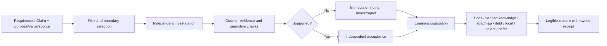

# HL — TFW-48 / Phase D: Review and Knowledge Closure

> **Date**: 2026-07-31
> **Author**: Coordinator (Codex)
> **Status**: ✅ HL — Approved under delegated owner authority
> **Master HL**: [HL-TFW-48](../HL-TFW-48__value_first_methodology_rebaseline.md)
> **Requires**: Phase B and Phase C APPROVE reviews

---

## 1. Vision

Review remains an independent investigation of whether the delivered result protects
the product purpose, applicable Project Values, cited authority, real boundaries, and
evidence. It is not a second transcription of TS and RF. Knowledge closure routes the
few signals that can change a future decision to an owned destination and explicitly
disposes of everything else.

Phase D makes this behavior easier to execute by removing repeated contracts,
checklists, empty sections, and read-everything branches. One canonical owner defines
each obligation; workflows retain short point-of-use actions; complete local wording
remains only where role, safety, irreversible action, or publication authority requires
it.

**Impact:** agents load less methodology, reviewers spend attention on risk and
counter-evidence, and project learning becomes more selective and more traceable.
Independent review must retain the ability to find defects that executor tests and
internally consistent artifacts missed.

> “Shorter is valuable only when the reviewer still catches the mistake and the useful
> learning still reaches its owner.”

## 2. Current State (As-Is)

Phases A–C corrected semantic ownership but did not achieve the original cleanup
outcome. The current mandatory startup corpus is materially larger than before TFW-48.
Counts use UTF-8 text and Python `re.findall(r"\S+")`; they are phase evidence, not a
new universal model limit.

| Corpus | Lines | Whitespace tokens | Meaning |
|--------|------:|------------------:|---------|
| Startup before TFW-48 | 1,309 | 15,875 | Historical comparison point |
| Startup after TFW-48 Phase C | 1,874 | 22,928 | Semantics improved; cleanup not achieved |
| Current startup: `AGENTS` + conventions + glossary + KNOWLEDGE + README | 2,041 | 25,584 | Phase D baseline |
| Exact 15-consumer Phase D corpus | 2,609 | 28,169 | Approved change boundary |
| Operational review/closure subset (12 consumers) | 937 | 6,041 | Workflow/template baseline |

The main duplication is observable rather than hypothetical:

- review role, trust, read order, mode, checklist, checkpoint, and closure rules are
  repeated across the workflow, three mode files, four templates, conventions, and
  glossary;
- Map, Verify, Judge, and REVIEW repeat the same AC, evidence, citation, observation,
  and completeness tables instead of relating one claim to one investigation result;
- RF, RES, and REVIEW carry mandatory Fact Candidate boilerplate even when no signal
  was selected;
- `review.md`, `docs.md`, and `knowledge.md` repeat closure routing and marker rules;
- KNOWLEDGE is loaded as an index but contains long historical decision and legacy
  explanations whose authoritative detail already exists in linked task traces;
- the `0.42` review sampling value can be mistaken for completeness authority even
  though a sampled review cannot close an untested material claim.

This overhead has not made executor claims self-validating. Independent TFW-49 reviews
found acceptance-critical defects after green executor suites:

| Case | Executor state | Independent finding Phase D must preserve |
|------|----------------|-------------------------------------------|
| TFW-49/A | Contract tests green | Missing schema-owner fields and reserved subjects accepted without required context; RF warning comparison was not reproducible |
| TFW-49/C | 345 tests green | Runtime recognition accepted unknown files/entrypoints; second rollback failed for a valid prior local disposition |
| AFD/Helpdesk production corpus | Local artifacts aligned | Cited-source divergence, stale evidence, missing seam/live proof, and value-level regressions remained possible |

The problem is therefore not “review is unnecessary.” It is that review ceremony and
knowledge capture are larger than the decision-changing investigation they are meant
to support.

## 3. Target State (To-Be)

### 3.1 Result Visualization

For routine local work, a reviewer sees a compact investigation:

```text
Claim R3 — exported report preserves the approved source totals
Risk: source seam + user-visible output
Investigated: both source and export; reran the decisive comparison
Counter-evidence: none found
Disposition: supported; no learning signal selected
```

For a risky runtime change, the same contract expands around the claims that can fail:

```text
Claim R4 — lifecycle is fail-closed and rollback is repeatable
Attack: mutate each recognized owner; add unknown runtime entries; repeat rollback
Result: unknown inventory accepted; second rollback fails
Disposition: REVISE, with two reproducible findings
Learning: task-local correction; no durable candidate until verified across tasks
```

The difference is investigation depth, not a different artifact package or a checklist
quota.

### 3.2 Value Flow



### 3.3 Canonical Review Contract

Map → Verify → Judge → Decide remains the review dependency, but each term has one
purpose:

| Stage | Owned question | Minimum output |
|-------|----------------|----------------|
| Map | What claims, values, sources, boundaries, and deviations matter? | Claim/risk map; no opinion-only summary |
| Verify | What independent observation supports or refutes each material claim? | Reproducible result, counter-evidence, and proof/debt relation |
| Judge | Given that reality, which claims and principles pass? | Finding or supported disposition with cited Verify evidence |
| Decide | What authority consequence follows? | APPROVE / REVISE / REJECT and routed closure actions |

The mode (`code`, `docs`, `spec`) changes only risk prompts that materially alter the
investigation. It does not create three complete checklists, a mandatory mode-document
read when no mode-specific risk applies, or a sampling ratio that substitutes for
claim coverage. Any discrepancy, protected seam, high-consequence claim, or suspected
shared mistake expands verification to the affected boundary regardless of file count.

### 3.4 Canonical Learning and Closure Contract

The existing Learning Receipt is the single routing relation. No new capture artifact
or status is introduced.

| Disposition | Required relation | Destination |
|-------------|-------------------|-------------|
| Immediate correction | source → finding → actor | REVIEW and current Executor correction |
| Architecture/documentation | source → destination/backlink → actor | `/tfw-docs` owner |
| Verified human/project knowledge | source → candidate → verification/disposition → topic/backlink → actor | `/tfw-knowledge` owner |
| Roadmap | source → named task/destination → actor or authority | Task Board / approved HL |
| Genuine debt | source → impact → owner/action | TECH_DEBT |
| Task-local or reject | source → state + reason | Local receipt; no central candidate |
| Defer | source → destination or due event + actor | Named future closure point |
| No signal | `No selected signal` | No filler table, marker, or consolidation work |

`tfw-docs` and `tfw-knowledge` retain separate write ownership because architecture,
debt, and human-only facts are different objects. Review owns one closure route and
invokes only the applicable destination. Numeric interval/calibration remains Phase E;
an interval may attract attention but cannot manufacture candidates or closure work.

### 3.5 Compression Contract

The reduction is a Phase D acceptance boundary because it directly tests the user’s
requested outcome. It is not exported as a universal workflow limit.

| Corpus | Baseline | Required final ceiling | Minimum reduction |
|--------|----------|-----------------------:|------------------:|
| Startup corpus | 2,041 lines / 25,584 tokens | 1,850 lines / 22,000 tokens | 191 lines / 3,584 tokens |
| Operational review/closure subset | 937 lines / 6,041 tokens | 780 lines / 4,800 tokens | 157 lines / 1,241 tokens |
| All 15 approved consumers | 2,609 lines / 28,169 tokens | 2,300 lines / 23,500 tokens | 309 lines / 4,669 tokens |

All three ceilings must pass on the same final tree. Semantic scenario failures cannot
be compensated by extra deletion, and a missed compression ceiling cannot be waived as
“descriptive” without returning to Coordinator scope revision.

## 4. Phase Scope

### Phase D: Review and Knowledge Closure 🔴

> **Requires:** TFW-48 Phase B and Phase C RF + APPROVE REVIEW.
>
> **Consumes:** D55 Method Kernel, D56 planning/learning contract, and D57
> claim/proof/attestation contract.
>
> **Boundary:** Phase E owns exact numeric lifecycle and registered extensions. Phase F
> owns adapters, migration, and final cross-project regression. H4 remains unresolved
> and outside TFW-48 implementation.

**Deliverables:**

1. Replace repeated review forms with one claim/risk-directed investigation contract
   while preserving independent product/value/source/reality authority.
2. Preserve Map → Verify → Judge → Decide as semantic dependencies with compact,
   grouped, or risk-expanded packaging rather than uniform trace volume.
3. Make mode guidance progressive and consequential: load only the risk prompts that
   change verification behavior.
4. Make sampling a planning aid only; material claims and triggered boundaries decide
   proof coverage and escalation.
5. Route review findings and selected learning through the existing disposition-typed
   Learning Receipt to correction, docs, knowledge, roadmap, debt, local/reject, or
   defer destinations.
6. Remove mandatory empty Fact Candidate ceremony and processed-marker churn when no
   signal is selected, while preserving discoverability of actual candidates.
7. Keep docs and knowledge write ownership separate but remove duplicated
   orchestration, read order, and marker explanations.
8. Turn KNOWLEDGE back into a compact navigable index: retain every active decision,
   source, legacy disposition, and fact link while relying on source artifacts for
   historical detail.
9. Meet all three compression ceilings and pass independent behavioral scenarios that
   include the TFW-49 defect classes and non-code/product-value cases.

### Approved Consumer Scope

| # | Existing consumer | Phase D responsibility |
|--:|-------------------|------------------------|
| 1 | `.tfw/conventions.md` | Canonical review, learning disposition, and closure owner; remove repeated operational prose |
| 2 | `.tfw/glossary.md` | Precise terms and owner links only |
| 3 | `KNOWLEDGE.md` | Compact architecture/decision/legacy index with preserved sources and fact index |
| 4 | `.tfw/workflows/review.md` | Claim/risk-directed four-stage algorithm and binding role/authority gates |
| 5 | `.tfw/workflows/review/code.md` | Code-only risk prompts that change verification |
| 6 | `.tfw/workflows/review/docs.md` | Docs/content-only risk prompts that change verification |
| 7 | `.tfw/workflows/review/spec.md` | Spec/research-only risk prompts that change verification |
| 8 | `.tfw/templates/review/map.md` | Compact claim/risk/boundary map |
| 9 | `.tfw/templates/review/verify.md` | Independent investigation log and counter-evidence |
| 10 | `.tfw/templates/review/judge.md` | Claim/principle dispositions sourced from Verify |
| 11 | `.tfw/templates/REVIEW.md` | Binding synthesis, findings, closure routing, and optional learning receipt |
| 12 | `.tfw/workflows/docs.md` | Architecture/debt destination only; no duplicate closure controller |
| 13 | `.tfw/workflows/knowledge.md` | Candidate verification/promotion destination only; event-triggered entry |
| 14 | `.tfw/templates/RF.md` | Selected-signal handoff without mandatory filler capture |
| 15 | `.tfw/templates/RES.md` | Promote/merge/derive candidates only; no empty ritual table |

No new framework file or artifact type is authorized. HL, TS, later Executor traces,
and the README Task Board row are lifecycle traces outside the consumer count.

## 5. Definition of Done (DoD)

- ✅ 1. Review independently compares each material claim with purpose, applicable
  Project Values, cited authority, delivered reality, triggered boundaries, and proof.
- ✅ 2. Map, Verify, Judge, and Decide have one non-overlapping semantic responsibility;
  templates reference rather than restate the canonical contract.
- ✅ 3. Compact routine review and expanded high-risk review preserve the same triggered
  Local/Seam/Live/Value Debt obligations.
- ✅ 4. TFW-49/A and TFW-49/C counter-cases remain detectable despite green executor
  tests and internally consistent RF/EV claims.
- ✅ 5. A TS/RF-aligned result that violates product purpose, a Project Value, a cited
  source, or adjacent seam can still receive REVISE/REJECT.
- ✅ 6. `min_verify_ratio` is not completion authority; discrepancy, consequence, claim,
  and boundary determine expansion.
- ✅ 7. Every selected signal has one disposition-typed receipt with the applicable
  source, destination-or-reason, actor, backlink, or due event.
- ✅ 8. `No selected signal` produces no filler candidate row or processed marker, and
  actual candidates remain discoverable by `/tfw-knowledge`.
- ✅ 9. Docs, verified knowledge, roadmap, genuine debt, task-local/reject, and deferred
  outcomes have distinct destinations and closure consequences.
- ✅ 10. KNOWLEDGE retains D-record identity/order/source, active decisions, legacy
  dispositions, key-artifact links, and the Project Facts index while removing detail
  already owned by cited task traces.
- ✅ 11. Exactly the 15 approved consumers change; no new framework file/type, config
  value, extension mechanism, adapter, or migration behavior is introduced.
- ✅ 12. All three compression ceilings pass together, with reproducible UTF-8 counts.
- ✅ 13. Documentation/reference/render checks and cross-domain review/learning scenario
  matrices pass without weakening role, safety, evidence, debt, or publication gates.

## 6. Definition of Failure (DoF)

- ❌ 1. Phase D adds a new review, proof, knowledge, receipt, marker, or status artifact
  instead of simplifying an existing owner.
- ❌ 2. The same full contract remains repeated across workflow, mode file, template,
  conventions, glossary, or KNOWLEDGE.
- ❌ 3. A reviewer must read an irrelevant mode/reference or complete an empty table to
  advance a claim that triggers no such risk or signal.
- ❌ 4. Compression removes independent judgment, product/value/source comparison,
  counter-evidence, role lock, or a triggered Local/Seam/Live/Value Debt obligation.
- ❌ 5. File presence, checkmark, configured ratio, command exit, test count, RF/EV
  agreement, or status marker becomes sufficient closure proof.
- ❌ 6. Review cannot reproduce either TFW-49 defect class because the removed guidance
  was functionally necessary.
- ❌ 7. Every finding is promoted centrally, a Fact Candidate exists because a section
  exists, or `No selected signal` creates marker work.
- ❌ 8. `/tfw-docs` and `/tfw-knowledge` write ownership collides, or closure routing is
  duplicated in all three workflows.
- ❌ 9. Historical task artifacts are rewritten, an active D-record/source disappears,
  or KNOWLEDGE brevity makes a decision unresolvable.
- ❌ 10. Any approved corpus exceeds its final ceiling, even if net file count or another
  metric improved, unless Coordinator explicitly revises this phase scope first.
- ❌ 11. An exact config value is calibrated/removed, a registered-extension lifecycle
  is added, or adapter/migration work enters Phase D.
- ❌ 12. Phase D touches TFW-49 implementation or treats its runtime architecture as a
  TFW-48 deliverable; TFW-49 is evidence only.
- ❌ 13. A local plan/review/docs/knowledge commit is treated as authority to push or
  publish.

**On failure:** stop the phase, identify the lost obligation or duplicated owner, and
return to Coordinator planning. Do not restore quality by adding a parallel artifact or
declare the missed reduction “descriptive.”

## 7. Principles

1. **Independent Judgment Protects Meaning** — review tests the product north star and
   reality, not merely agreement among artifacts.
2. **Precision Compresses Context** — one exact term and owner replace repeated
   explanation only when the point-of-use action remains observable.
3. **Claim and Consequence Drive Depth** — risk and boundaries determine investigation;
   artifact count and sampling ratios do not.
4. **Counter-Evidence Before Confidence** — reviewers actively try to refute decisive
   claims, especially where executor and plan share assumptions.
5. **Learning Is Selection and Routing** — durable knowledge begins only when a signal
   can change a future decision and has an owned disposition.
6. **No Ritual Output** — absence of a selected signal is a valid result, not a reason
   to create an empty section or marker.
7. **Index, Don’t Duplicate** — KNOWLEDGE points to canonical task evidence and preserves
   the current decision; it is not a second archive of the whole rationale.
8. **Domain-Agnostic Review** — claims, sources, seams, stakeholders, and live outcomes
   apply to code, documents, research, operations, and business decisions.
9. **Honest Reduction** — context reduction is demonstrated on the final tree and never
   traded for weaker authority, evidence, or learning.
10. **Publication Is Separate Authority** — local completion never authorizes push,
    remote tag, deploy, publish, or notify.

### 7.1 Quality Contract

- Preserve full local Reviewer role lock, verdict authority, destructive/publication
  boundaries, and STOP behavior.
- Preserve D55–D57 purpose/value, claim/proof, evidence precedence, attestation, and
  learning semantics.
- Every removed instruction is classified as duplicate, moved to its canonical owner,
  obsolete, or replaced by a stronger observable relation.
- Every retained reference has a resolvable target and a point-of-use action where
  failure would matter.
- Scenario proof covers routine and high-risk code plus at least documentation/content,
  research/specification, and product/operational decision work.
- Counts use the same UTF-8 `\S+` method before and after; generated output is excluded.
- Existing task traces are append-only; only live framework owners and TFW-48 Phase D
  lifecycle traces may change.

### 7.2 Knowledge Citations

| # | Source | Item | How it applies |
|--:|--------|------|----------------|
| 1 | [Master HL](../HL-TFW-48__value_first_methodology_rebaseline.md) | Phase D; DoD 3, 10–12, 16, 19; DoF 1, 6, 7, 12 | Owns review, learning, compression, and anti-layer outcome |
| 2 | [Iteration 2 RES](../research/iter2/RES.md) | M5, D6–D10, Challenge/RES conclusions | Supports proportional proof, event-triggered learning, and lean kernel |
| 3 | [Phase B RF](../phase-b/RF__phase-b__planning_research_learning.md) | Learning Receipts, qualitative intensity, numeric ledger | Predecessor learning contract to preserve |
| 4 | [Phase B REVIEW](../phase-b/REVIEW__phase-b__planning_research_learning.md) | Final APPROVE after semantic inconsistency corrections | Shows value of full independent re-review |
| 5 | [Phase C RF](../phase-c/RF__phase-c__specification_execution_evidence.md) | Requirement Claims, Proof Records, RF Attestation | Supplies review inputs and boundaries |
| 6 | [Phase C REVIEW](../phase-c/REVIEW__phase-c__specification_execution_evidence.md) | APPROVE, 10/10 AC | Approved claim/proof predecessor |
| 7 | [TFW-49/A REVIEW](../../TFW-49__agent_commit_identity_and_attribution/phase-a/REVIEW__phase-a__canonical_contract_and_validator.md) | D1–D3 corrective findings | Green-test counter-case for schema/context/source verification |
| 8 | [TFW-49/C REVIEW](../../TFW-49__agent_commit_identity_and_attribution/phase-c/REVIEW__phase-c__repository_local_enforcement_migration.md) | Runtime recognition and rollback findings | Green-test counter-case for adversarial lifecycle review |
| 9 | [KNOWLEDGE.md](../../../KNOWLEDGE.md) | D37, D41–D46, D55–D57 | Existing docs/knowledge ownership, review stages, trust, kernel, and proof authority |
| 10 | [knowledge/process.md](../../../knowledge/process.md) | F3, F4, F22, F26 | Precise terms, structural gates, anti-tautology, and no-push authority |
| 11 | [knowledge/constraint.md](../../../knowledge/constraint.md) | F2–F3 | Instruction-attention and filler-generation risk |
| 12 | [knowledge/philosophy.md](../../../knowledge/philosophy.md) | F4, F20–F21, F24 | Trace presence is not completion; investigative flow; explicit no-signal |

## 8. Dependencies

| Dependency | Status |
|------------|--------|
| TFW-48 Phase B RF + REVIEW | ✅ APPROVE |
| TFW-48 Phase C RF + REVIEW | ✅ APPROVE |
| TFW-48 research iterations 1–2 | ✅ SUFFICIENT |
| TFW-49 review defects | ✅ Read-only production counter-cases |
| Phase E numeric lifecycle/extensions | Protected; not changed |
| Phase F adapters/migration/full regression | Protected; not changed |
| Remote publication | Not authorized |

## 9. Risks

| Risk | Probability | Impact | Mitigation |
|------|-------------|--------|------------|
| Deleting functional local enforcement | Medium | High | Classify every removal; run behavior scenarios and independent review |
| KNOWLEDGE compression loses decision provenance | Medium | High | Preserve D-number, current decision, source, and link; compare semantic inventory |
| Review becomes vague “use judgment” prose | Medium | High | Claim/risk map, explicit counter-evidence, and reproducible findings |
| Mode collapse makes domain risks invisible | Medium | Medium | Keep only consequential risk prompts and cross-domain scenarios |
| Learning routing becomes a new bureaucracy | High | Medium | Reuse Learning Receipt; no new artifact/status; no-signal path is empty work |
| Compression target encourages dense unreadable tables | Medium | Medium | Rendered readability, navigation, and agent scenario gates |
| Phase D absorbs numeric or adapter cleanup | Medium | High | Exact 15-consumer allowlist and Phase E/F negative scan |

## 10. RESEARCH Case

**Decision: no new research iteration.** Iterations 1–2 already concluded SUFFICIENT
for the M5-derived architecture, proportional review, event-triggered learning, and
typed numeric boundaries. Phase D is a bounded consumer refactor with current,
reproducible production counter-cases. Its remaining uncertainty is whether the chosen
compression preserves behavior; that is an implementation and independent-review
question, not a comparison among unresolved methods.

Start a new `/tfw-research` iteration only if ONB shows that two materially different
review/knowledge architectures remain and the choice would change the approved
consumer boundary. Difficulty compressing prose is not such evidence.

### Why Not Just...?

- Why not delete review stages? — The stages separate comprehension, observation,
  judgment, and authority; TFW-49 shows the independent observation is valuable.
- Why not keep everything because review found bugs? — The bugs were found by targeted
  attacks, not by duplicated headings and filler tables.
- Why not merge docs and knowledge? — They own different objects; one closure router
  can invoke separate owners without duplicating orchestration.
- Why not defer compression to Phase F? — Review/knowledge owners are Phase D scope,
  and the user-requested reduction must become binding before more lifecycle work lands.

## 11. Strategic Insights (Planning)

| # | Insight | Planning implication | TS disposition | Category | Source |
|--:|---------|----------------------|----------------|----------|--------|
| S1 | The user asked for cleanup, simpler references, and precise terms; the delivered startup context grew instead | Make net-negative startup and consumer deltas hard ACs, not descriptive measurements | AC compression boundary; DoF on missed ceiling | constraint | User, TFW-48 value audit |
| S2 | The user requires proof of real value, not claims that more process is safer | Preserve only mechanisms that detect named production failures; remove ceremony without a protected consequence | Scenario matrix and removal ledger | philosophy | User, TFW-48 value audit |
| S3 | TFW must remain about product meaning, goals, and values rather than code-only conformance | Review authority and cross-domain scenarios must protect product purpose and Project Values | Review ACs and non-code scenarios | philosophy | User, TFW-48 inception |
| S4 | TFW-49 is separate work and must not be altered by Phase D | Use its review defects only as read-only counter-cases; prohibit implementation changes | Scope/DoF | process | User, current Phase D direction |
| S5 | Local work may continue, but publication is a separate explicit user boundary | Allow local C1-R commits; prohibit push and all remote publication | Local execution boundary | process | User, publication direction |

---

*HL — TFW-48 / Phase D: Review and Knowledge Closure | 2026-07-31*
