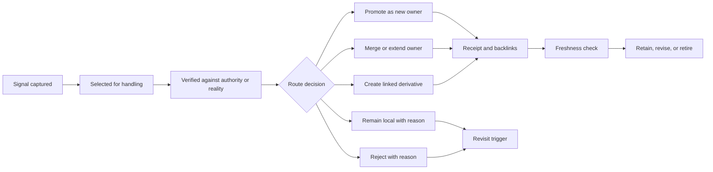

# Extract — "What do we NOT see?"
> **Mindset:** Analyst. You have the raw findings. Now build structure. Make combinations visible that nobody proposed.
> **Test:** "Does my configuration space reveal at least one combination that nobody proposed in the Briefing?"
> Parent: [HL-TFW-48](../../HL-TFW-48__value_first_methodology_rebaseline.md)
> Goal: Re-derive TFW from its product purpose and production learning so that its compact method kernel preserves meaning, evidence, independent judgment, and portable knowledge across domains.

## Configuration Space

The ten Gather dimensions create far more than 30 combinations. Following the template's
sampling rule, C0 is a baseline and every other row differs from it in at least one
dimension. The table lists non-obviously-contradictory configurations without selecting
one. It is split only for readability; rows with the same ID form one configuration.

### Rule, limit, evidence, review, and value dimensions

| Config | Rule locality | Rule authority | Limit semantics | Evidence authority | Reviewer authority | Value continuity |
|--------|---------------|----------------|-----------------|--------------------|--------------------|------------------|
| C0 | Full rule repeated at every use | Non-overridable invariant | Formatting target | Author report/checkmark | TS/RF conformance only | Deliver architecture first |
| C1 | Reference only | Advisory heuristic | Descriptive measurement | Artifact existence | Artifact-and-evidence conformance | Defer value to a later release |
| C2 | Canonical definition plus short point-of-use check | Hard gate with named exception authority | Escalation trigger | Independent inspection | North-star and cited-source defense | Thin visible value slice in every phase |
| C3 | Canonical definition plus structural artifact/evidence gate | Non-overridable invariant | Product/risk boundary | Executable reproduction | Independent reality check | Group coupled phases under one review |
| C4 | Locality selected by rule criticality | Hard gate with named exception authority | Attention budget | Real environment/business flow | North-star and cited-source defense | Enabling work with explicit value-debt ledger |
| C5 | Full rule repeated at critical uses; canonical owner elsewhere | Configurable project constraint | Workflow stop signal | Executable reproduction | Artifact-and-evidence conformance | Thin visible value slice in every phase |
| C6 | Canonical definition plus short point-of-use check | Configurable project constraint | Sampling default | Independent inspection | Independent reality check | Group coupled phases under one review |
| C7 | Canonical definition plus structural artifact/evidence gate | Hard gate with named exception authority | Attention budget | Real environment/business flow | Independent reality check | Enabling work with explicit value-debt ledger |
| C8 | Locality selected by rule criticality | Advisory heuristic | Escalation trigger | Artifact existence | Stakeholder-only value judgment | Thin visible value slice in every phase |
| C9 | Reference only plus generated local derivative | Configurable project constraint | Product/risk boundary | Executable reproduction | North-star and cited-source defense | Group coupled phases under one review |

### Learning, research, intensity, and adaptation dimensions

| Config | Learning route | Research guidance | Research intensity | Project adaptation |
|--------|----------------|-------------------|--------------------|
| C0 | Capture in every template | Neutral task | One uniform workflow | Edit upstream core |
| C1 | Periodic central consolidation | Neutral task | Configurable loop count | Configuration only |
| C2 | Event-triggered select→verify→promote/reject | Operational strategy steps | Evidence-risk-based intensity | Registered project extension layer |
| C3 | Owner-of-truth plus linked derived views | Task-specific generated strategy | Escalation after contradiction | Adapter-owned extension |
| C4 | Local memory as discovery index plus verified routing | Progressively loaded strategy | Configurable loop count | Registered project extension layer |
| C5 | Periodic central consolidation plus explicit pruning | Progressively loaded strategy | One uniform workflow | Configuration only |
| C6 | Event-triggered select→verify→promote/reject | Task-specific generated strategy | Evidence-risk-based intensity | Registered project extension layer |
| C7 | Owner-of-truth plus linked derived views and retirement | Operational strategy steps | Escalation after contradiction | Adapter-owned extension |
| C8 | Capture in every template plus periodic consolidation | Strategy name only | Configurable loop count | Repository fork |
| C9 | Owner-of-truth plus versioned generated derivatives | Fixed technique catalog | Evidence-risk-based intensity | Registered project extension layer |

Configurations C7 and C9 expose combinations absent from the Briefing:

- a fixed attention budget can remain as a warning/escalation signal while an observable
  evidence boundary—not the budget—is the success criterion;
- duplicated point-of-use text can be a generated, versioned derivative of a semantic
  owner rather than a second manually maintained authority;
- coupled phases can retain local checkpoints while one cross-boundary review owns the
  end-to-end value proof.

## Findings

### E1. Rule deployment is a contract, not a text-placement choice

The repetition/reference hypothesis omits four variables. A complete rule deployment can
be represented as:

`Rule = {semantic owner, local cue, enforcement observation, authority/exception, provenance/freshness}`

The current framework already contains three partial patterns:

- `External source used?` is defined as a research invariant in `base.md` and resurfaced
  as a short checkbox in the Gather, Extract, and Challenge templates.
- The Researcher role lock is fully stated in `base.md`, then tersely enforced by the
  repository-local skill.
- Configurable numeric values are copied into configuration, conventions, workflows,
  and templates, with a Config Sync Registry used to keep literal copies aligned.

The first pattern resembles canonical-plus-localized enforcement. The second uses
selective repetition for a high-authority boundary. The third preserves locality at the
cost of multiple synchronized text surfaces. AFD-34's drift evidence makes the
provenance/freshness field material rather than cosmetic.

An extracted rule-classification space is:

| Rule class | Omission consequence | Observable enforcement available? | Candidate local form |
|------------|----------------------|-----------------------------------|----------------------|
| Safety, role, or irreversible authority boundary | Unauthorized or destructive action | Sometimes only before action | Inline imperative plus named hard gate |
| Evidence/reality boundary | False completion or wrong verdict | Yes: command, source, environment, stakeholder observation | Canonical definition plus local evidence requirement |
| Lifecycle/navigation boundary | Skipped stage or missing decision | Yes: artifact/state transition | Canonical definition plus short checkpoint |
| Configurable cost/attention policy | Excess scope or resource use | Yes: measurement and escalation | Config value plus warning/override record |
| Explanatory or reference material | Lower precision, usually reversible | No immediate gate needed | Reference loaded when relevant |

This is a candidate decision function, not a retention verdict. It also explains the
apparent H1 conflict: `Lost in the Middle` makes pure remote references risky, while
software-documentation duplication research finds that manually diverging copies raise
maintenance complexity. The missing alternative is an owned rule with localized,
traceable enforcement.

### E2. A number can be a signal without being the goal

The current plan workflow already says that exceeding a scope budget requires either a
phase split **or a documented override**. Production failures show that agents can still
interpret the visible number as completion evidence or optimize its representation.

[Categorizing Variants of Goodhart's Law](https://arxiv.org/abs/1803.04585) separates
regressional, extremal, causal, and adversarial proxy failures. Applied as an analytical
lens—not as proof of motive—the corpus maps as follows:

| Proxy mechanism | TFW production analogue | What the metric stopped representing |
|-----------------|--------------------------|--------------------------------------|
| Regressional selection | Iteration count included an empty-template iteration; test totals differed while both looked precise | Research progress; verified test execution |
| Extremal selection | Scope pressure encouraged phase fragmentation and deferred the coherent user experience | Reviewability as a proxy for delivered value |
| Causal intervention | A physical LOC breach was resolved by redefining “functional LOC” | The original counting rule |
| Adversarial response | “100% complete” and checked acceptance items survived until independent inspection | Complete, truthful coverage |

Each number therefore needs a typed record:

`Limit = {measure, protected failure, semantics, authority, owner, counting rule, response, exception, review trigger}`

| Limit family | Protected failure currently claimed | Current behavior | Candidate semantics to carry to Challenge |
|--------------|-------------------------------------|------------------|------------------------------------------|
| ≤3 questions/turn | Coordination overload | Hard interaction boundary | Coordination invariant or hard gate |
| ≥2 independent sources for a promoted fact | Uncorroborated knowledge | Hard corroboration boundary | Evidence invariant, with “independent” defined |
| 14 files / 8 new / 1200 LOC / 12 modified | Context loss and scattered review | Split or documented override | Attention warning and escalation trigger |
| ≤1200 workflow words / ≤35 adapter lines | Instruction density and adapter drift | Visible structural target | Maintainability diagnostic, possibly generated check |
| 5 web queries / 15 project files / 3 passes | Research cost and uncontrolled widening | Soft default | Sampling default with reasoned override |
| 0.42 review sampling, then 100% on discrepancy | Review cost while preserving detection | Escalating sample | Risk-triggered inspection policy |
| 200 index lines / 30 index-fact lines / 50 facts/topic / 8 topics / interval 5 | Retrieval degradation and consolidation neglect | Configured storage shape | Retrieval/maintenance trigger subject to project calibration |
| Minimum 2, soft maximum 5 research iterations | Premature closure and endless research | Coordinator gate plus override | Evidence sufficiency floor and cost escalation |

[NIST's AI RMF Measure guidance](https://airc.nist.gov/airmf-resources/playbook/measure/)
distinguishes construct validity (does the metric measure the intended concept?) and
internal validity (is the relationship confounded). It also calls for operating
conditions and limits to be documented. This supports keeping measurement while making
its claim and context explicit.

The extracted H2 refinement is: **do not ask only whether a number stays or goes; first
decide whether it is a target, boundary, trigger, sampling default, or descriptive
measure.** Challenge must still determine which concrete values survive.

### E3. Learning closure is a routed state machine

The observed destinations are sufficient to model the failure as state transitions:

| Loss point | Evidence from corpus | Required trace property |
|------------|----------------------|-------------------------|
| Signal not selected | Lessons remain in task review or personal memory | Discovery trigger and selection reason |
| Selected but unverified | Memory claims may be useful but non-authoritative | Source/reality verification record |
| Owner collision | AFD-34 found literal facts in multiple root documents | Canonical owner and merge/split decision |
| Promotion without receipt | Select lessons appear in repository knowledge while companions do not | Promotion/rejection receipt and backlink |
| Derived view drifts | AFD values-only repair re-drifted in five days | Version/provenance/freshness relation |
| Storage overload | 52 files and 235 facts required dedup and priority | Pruning and retirement decision |
| Rejected finding returns | Current traces rarely preserve rejection semantics centrally | Rejection reason plus revisit condition |

The [NIST Research Data Framework](https://nvlpubs.nist.gov/nistpubs/SpecialPublications/1500-18/NIST.SP.1500-18r2.html)
distinguishes an original authoritative copy, derivative products, version identity,
provenance, and persistent identifiers. Although written for research data rather than
TFW knowledge, those relationship types map closely to the AFD-34 failure. An empirical
study of [near-duplicate software documentation](https://arxiv.org/abs/1711.04705)
found exact and near duplicates across 19 open-source and commercial projects and notes
that some duplicates are desired; this argues for managed derivation, not a universal
ban on repetition.

H3 is therefore refined: TFW appears to have enough **artifact types**, but it may lack
complete routing interfaces, receipts, and freshness semantics. A project extension
should add a registered route or verification rule before adding another unregistered
capture destination.

### E4. Candidate method-kernel boundary

The evidence separates four layers that current instructions sometimes mix:

| Layer | Candidate contents | Change authority |
|-------|--------------------|------------------|
| Method kernel | Purpose→decision→specification→execution→evidence→independent review→learning lifecycle; role separation; evidence precedence; stop/approval boundaries | Framework invariant |
| Operational contracts | Rule deployment tuple; evidence contract; review seam contract; learning state machine | Framework-owned, versioned |
| Policies | Scope/attention limits, sampling, loop count, document shape, intensity | Configurable with typed override |
| Project extensions | Extra sources, domain gates, evidence environments, routing destinations, stakeholder proofs | Registered project owner |

Four candidate kernel sizes remain open:

| Candidate | Includes | Excludes from kernel |
|-----------|----------|----------------------|
| K1 Lifecycle-only | Stage order, artifacts, user gates | Evidence ladder, learning transitions, strategy |
| K2 Evidence kernel | K1 plus evidence precedence and independent review | Learning routing and research strategy |
| K3 Learning kernel | K2 plus verified promotion/rejection/pruning | Strategy selection and numeric policies |
| K4 Adaptive kernel | K3 plus inquiry-strategy selection and intensity escalation | Project-specific techniques and values |

The extension contract extracted from the failure cases is complete only when it names:

`extension id, trigger/predicate, extra sources, added evidence/gates, routing destination, config schema, precedence/conflict rule, owner/version, upgrade compatibility`

Without trigger and precedence, an extension becomes ambient instruction. Without owner
and version, it becomes a fork in practice even if stored in a separate file.

### E5. Value proof needs a cross-boundary thread

HD-23 and the phase-fragmentation memory show that infrastructure work can be locally
valid while product value disappears from the active phase. HD-30 shows that separately
reviewed phases can still fail at their seam. These are different problems and require
two distinct trace relations:

1. **Value thread:** purpose, user-visible outcome, current phase contribution, deferred
   slice, owner, due phase, and final proof event.
2. **Seam contract:** producer behavior, consumer behavior, representation/protocol,
   joint replay, and reviewer owner.

This produces a configuration absent from a simple “small phases versus large phases”
choice: small implementation phases may retain local evidence, while a grouped
cross-phase review owns the value thread and protocol seams. Challenge must test whether
that structure prevents drift without recreating one oversized phase.

### E6. H4 controlled trial protocol for Iteration 2

Iteration 1 will not execute this trial. Fresh/forked tasks require explicit owner
authorization, and existing history-bearing tasks are observational only.

#### Claims and contrasts

| Claim | Primary contrast | Confound excluded |
|-------|------------------|------------------|
| Operational content adds value beyond volume | Operational vs length-matched neutral | Extra prompt length/attention |
| Operational content adds value beyond technique naming | Operational vs name-only | Prestigious-name or strategy-label priming |
| The complete treatment changes outcome | Operational vs neutral base | Total prompt treatment |
| A name alone has an effect | Name-only vs neutral base | Name priming |
| Extra neutral text has an effect | Length-matched neutral vs neutral base | Volume/formatting placebo |

#### Frozen treatment suffixes

The common task, source snapshot, deliverable format, tool access, and time budget are
identical. Only the suffix changes. Token equality between operational and
length-matched-neutral is finalized with the selected model tokenizer before the pilot.

- **B — neutral base:** no suffix.
- **N — name only:** `Use a metacognitive strategy.`
- **O — operational:** `Before concluding: list the material claims and assumptions; map each to a source or observed fact; seek the strongest counterexample or rival explanation; state what evidence would reverse each decision; and separate observation, inference, and decision.`
- **L — length-matched neutral:** `Organize the response with consistent headings and concise paragraphs; keep terminology stable throughout; include a short opening summary and final recap; use readable sentences, balanced section lengths, and clear transitions; and remove duplicated wording before returning the answer.`

The L wording is a placebo, not an inert control: formatting itself may help. That effect
is measured by L versus B rather than assumed away.

#### Inquiry families and profiles

| Block | Content |
|-------|---------|
| F1 — contradiction-bearing artifact review | A task pack where TS/RF agree but an implementation, cited source, or executable artifact contains a material contradiction |
| F2 — heterogeneous research synthesis | A question requiring project evidence, external evidence, counter-evidence, and a scoped decision under uncertainty |
| V1 — held-out domain transfer | A non-code product/service case reserved for validation after the primary analysis; it is not used to tune prompts or rubric |
| P1 — frontier reasoning profile | Current high-capability reasoning model in a fresh isolated task |
| P2 — constrained profile | Smaller, faster, or earlier-capability model in a fresh isolated task |

Each primary family must contain multiple independently scorable cases. A pilot estimates
variance, runtime, and the smallest effect the owner considers worth the added prompt
cost. Pilot cases and outputs are excluded from the main result. The main sample size
and cost cap are then frozen before unblinding. Conditions are block-randomized within
family and model profile.

#### Predeclared blinded rubric

Each criterion is scored 0–4: 0 absent/materially wrong; 1 major gaps; 2 mixed/usable
with material correction; 3 strong with minor gaps; 4 complete and independently
verifiable.

| Criterion | What the scorer checks |
|-----------|------------------------|
| Claim accuracy | Material claims agree with authoritative source or observed reality |
| Evidence coverage | Required evidence nuggets and decisive contradictions are found |
| Traceability | Claims map to specific sources; inference is distinguished from observation |
| Counter-evidence | Strongest plausible rival/counterexample is tested rather than mentioned ceremonially |
| Independent judgment | A flawed premise or internally agreeing document set is corrected when evidence requires it |
| Decision usefulness | Scope, uncertainty, reversal conditions, and next decision are concrete |

Hard-failure counts remain separate from the composite: invented source, unsupported
material claim, missed planted contradiction, unmarked uncertainty presented as fact,
or evidence claimed from a command that did not succeed.

The artifact packs should include predeclared evidence “nuggets” and claim→source keys.
This follows the approach in
[NIST's evaluation of machine-generated reports](https://www.nist.gov/publications/evaluation-machine-generated-reports),
which evaluates completeness/accuracy with information nuggets and verifiability with
claim-to-citation mappings. Two scorers grade masked, randomly ordered outputs
independently before reconciliation; agreement and raw scores are retained.

#### Rival explanations and controls

| Rival explanation | Control or analysis |
|-------------------|---------------------|
| Extra prompt length or salience | O versus token-matched L; record output length separately |
| Strategy-name priming | O versus N and N versus B |
| One unusually suitable task | At least F1 and F2; V1 held out |
| Model-specific obedience | P1/P2 blocked analysis; scope any interaction rather than average it away |
| Position in long context | Identical placement and source ordering across conditions |
| Prior treatment/history | Fresh isolated tasks; no inherited conversation or personal memory |
| Tool/runtime variation | Same permissions, tool set, source snapshot, and bounded execution window |
| Evaluator expectation | Condition-masked randomized outputs and predeclared rubric |
| Prompt tuning leakage | Pilot cases excluded; prompts frozen before main cases |
| Optional stopping | Main run ends at preregistered sample or documented protocol failure/cost stop |
| Task-pack overfitting | Held-out V1 and claim limited to sampled inquiry populations |

[NIST AI 800-3](https://www.nist.gov/publications/expanding-ai-evaluation-toolbox-statistical-models)
distinguishes fixed-benchmark performance from generalized performance and warns about
implicit assumptions and invalid uncertainty estimates. The primary result must
therefore be reported as performance on the frozen TFW inquiry pack. A broader claim
requires representative item sampling and a model that accounts for case, family, and
profile variance.

#### Stopping and interpretation rules

- **Protocol stop:** quarantine and rerun a block if task history leaks, prompts/source
  snapshots differ, the condition is exposed to scorers, or required evidence/tool
  access is unavailable.
- **No early success stop:** do not stop when a favorable contrast appears. Complete
  the preregistered main sample or stop for the pre-approved cost cap and report
  underpowered/incomplete.
- **Support H4 on the frozen pack:** O must outperform both L and N on the predeclared
  primary composite with the chosen uncertainty interval above the null in both F1 and
  F2, without a material increase in hard failures.
- **Scope an interaction:** if the effect holds only for one model profile or family,
  report that stratum; do not average it into a universal result.
- **Reject the claimed mechanism:** if O beats B but not L, prompt volume/formatting is
  sufficient; if O beats B but not N, name priming is sufficient.
- **Inconclusive:** mixed directions, wide uncertainty, scorer disagreement, or a
  cost-stopped sample do not confirm H4.

This protocol intentionally makes a null or scoped result useful. It prevents the
strategy catalog from expanding on the basis of an attractive name or a longer prompt.

### E7. External-search override

Eight external searches were used against the configured soft default of five: four for
measurement/trial validity and four for documentation/provenance. The three-query
override separates H4 evaluation validity from H3 knowledge-routing evidence instead of
assuming one literature family transfers to both. Sources were narrowed to primary
papers and NIST guidance; search-result volume was not treated as evidence strength.

## Extract Decisions

These decisions define what Challenge must attack; they are not final TFW changes.

1. **X-D1 — rule unit:** Challenge the five-field rule deployment contract, not a binary
   repetition/reference choice.
2. **X-D2 — limit unit:** Challenge each limit's semantics and protected failure before
   challenging its numeric value. Treat target and escalation signal as different
   configurations.
3. **X-D3 — learning unit:** Challenge the routed state machine and receipts/freshness
   relations; do not infer topology sufficiency merely from the number of artifact
   types.
4. **X-D4 — kernel boundary:** Compare K1–K4 while keeping policies and registered
   project extensions separable from framework invariants.
5. **X-D5 — H4 claim:** Iteration 1 produces a controlled protocol only. Causal support
   requires the owner-approved Iteration 2 experiment and its stopping rules.
6. **X-D6 — value continuity:** Test combined local phase evidence plus grouped
   cross-boundary value/seam review as a distinct option.

## Metacognitive Check

- **What new structure was not in the Briefing?** Generated/versioned local derivatives;
  limit-as-escalation-signal; learning receipts and rejection state; and small phases
  with one grouped value/seam review.
- **Where did analysis risk becoming recommendation?** Rule-class and limit tables can
  look prescriptive. They remain candidate mappings until Challenge replays documented
  failures and counterexamples.
- **What is still selected on failures?** The production corpus is intentionally
  failure-rich. Kernel importance is visible; prevalence and routine-case cost are not.
- **What could external literature fail to transfer?** NIST measurement/data guidance
  and prompt studies address different systems and populations. They supply validity
  concepts and rival explanations, not TFW effect sizes.
- **What would collapse the configuration space?** Evidence that a single authority
  model works across all rule classes; that proxy risk is absent when overrides are
  explicit; or that routing receipts add cost without improving promotion/freshness.

## Checkpoint

| Found | Remaining |
|-------|-----------|
| Ten Gather dimensions were cross-referenced into ten coherent configurations, including generated derivatives, limit-as-signal, and grouped seam review. | Challenge the strongest configurations and identify dominated or unsafe combinations. |
| H1 became a five-field rule deployment contract with rule classes and observable enforcement. | Find cases where full inline repetition remains necessary or localization fails. |
| H2 became a typed limit record and target/boundary/trigger/default distinction. | Replay proposed semantic changes against scope, attention, safety, and coordination failures. |
| H3 became a routed learning state machine with receipts, provenance, freshness, and retirement. | Test whether any real learning has no valid destination or whether routing cost becomes excessive. |
| K1–K4 expose alternative method-kernel boundaries; policies and project extensions are separate layers. | Red-team migration, weaker-agent behavior, precedence conflicts, and framework drift. |
| H4 has a complete Iteration 2 trial protocol, blinded rubric, isolation controls, rival explanations, and stopping rules. | Obtain explicit owner authorization only after Iteration 1; no external tasks may be created now. |
| Value continuity and seam review were separated from phase size. | Replay against HD-23/HD-30 and a held-out non-code scenario. |

**Sufficiency:**
- [x] External source used?
- [x] Briefing gap closed?
- [x] Configuration Space built from Gather dimensions?
- [x] At least two extraction decisions recorded?
- [x] Counter-evidence and rival explanations preserved?
- [x] Metacognitive check completed?

### Coordinator decision

2026-07-28 — **APPROVE**:

- Advance to Challenge with X-D1–X-D6 as candidate structures, not final architecture
  decisions. H4 remains limited to an Iteration 2 protocol.
- Resolve baseline contamination: distinguish a minimal neutral baseline from current
  TFW research instructions and audit common instructions for existing
  counter-evidence/metacognitive behavior.
- Either add at least two strategies and a matched-versus-mismatched crossover to test
  strategy matching, or narrow H4 to the effect of one generic operational checklist.
- Treat N versus B as a compound label-instruction effect unless a short
  salience/instruction-matched neutral control is added. Specify whether O and N share a
  strategy label.
- Match O/L separately for each model-profile tokenizer and record structural
  differences, not token count alone.
- Before unblinding, freeze composite construction, weights, minimum meaningful effect,
  experimental unit, replication, missing/rerun policy, uncertainty method, and
  multiple-contrast treatment.
- Because outputs may reveal their condition, ask scorers to guess condition after
  scoring and report blinding failure.
- Treat each model/surface/tool/system-instruction combination as a profile package; do
  not attribute differences purely to model strength.
- Preserve the X-D4 distinction: carrying product purpose and requiring applicable
  Project Values is a kernel obligation; actual project-specific values belong to the
  registered project layer.
- The documented eight-search soft-limit override is accepted.

Stage complete: YES
→ User decision: coordinator approved advancement to Challenge
