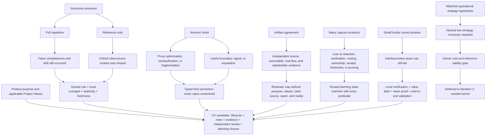

# RES — TFW-48: Value-First Methodology Rebaseline, Iteration 1

> **Date**: 2026-07-28
> **Author**: Codex Researcher
> **Status**: 🔬 RES — Complete
> **Parent HL**: [HL-TFW-48](../../HL-TFW-48__value_first_methodology_rebaseline.md)
> **Mode**: Pipeline — Deep

---

## Research Context

This iteration tested whether TFW can be compressed and re-centered on product purpose
without losing evidence quality, independent judgment, weaker-agent safety, or durable
learning. It compared current framework rules with coordinator-approved longitudinal
cases from Atamat, Helpdesk, and AFD; used non-secret Helpdesk/AFD personal memory only
to discover claims that were then checked against repository traces; inventoried current
numeric constraints and instruction-placement patterns; and triangulated the production
evidence with primary papers and NIST/NASA guidance. No excluded or sensitive memory
file was opened, and no production repository or non-research TFW artifact was modified.

## Briefing

The approved scope, hypotheses, corpus boundaries, priority anchors, and coordinator
directions are recorded in [1_briefing.md](1_briefing.md). The investigation followed
[2_gather.md](2_gather.md) → [3_extract.md](3_extract.md) →
[4_challenge.md](4_challenge.md), with a coordinator checkpoint after every stage.

## Evidence Synthesis

| Recurring mechanism | Production evidence | What it rules out |
|---------------------|---------------------|-------------------|
| Instruction volume is not enforcement | Atamat TFW-2.100 repeated a long workflow and completion checks, yet adversarial inspection found omitted scope, a 507-line breach, and false “100%” completeness. | Universal full repetition as a sufficient control |
| A reference is not enforcement | AFD-10 cited a Helpdesk source but omitted its migration infrastructure; only inspection of the cited source exposed the gap. | Reference-only minimalism |
| Proxy completion can diverge from purpose | Atamat TFW-14 reclassified LOC; Helpdesk HD-28 counted an empty iteration; AFD-36 had discrepant/stale test evidence; HD-23 deferred visible mobile value. | Untyped numbers, checkmarks, and phase completion as value proof |
| Reality outranks internally agreeing artifacts | HD-26 live PostgreSQL runs exposed impossible migration logic and a mocked-away state bug; AFD-14 honest-fleet operation exposed failures synthetic setup hid. | Document/test agreement as final evidence authority |
| Independent review needs scope beyond TS/RF | AFD-38's initial approval was retracted for violating the single-registry principle; AFD-10 required cited-source review. | Conformance-only review |
| Local phase correctness does not prove the seam | HD-30's frontend/backend contract failed only at their repeated-query/scalar interface; HD-23 preserved architecture while deferring the product outcome. | Phase-size control without cross-boundary validation |
| Capture abundance does not close learning | Atamat TFW-11 succeeded through classified extraction and links; AFD-34 handled 52 memory files and 235 facts through routing, deduplication, ownership, and retirement. | Adding generic capture templates as the primary knowledge fix |

External evidence was used as a validity check rather than as a source of TFW effect
sizes:

- [Lost in the Middle](https://arxiv.org/abs/2307.03172) and
  [ReasonIF](https://aclanthology.org/2026.findings-acl.1456/) challenge the assumption
  that a remote rule in long context, or even an explicit instruction, will reliably
  control behavior.
- [Categorizing Variants of Goodhart's Law](https://arxiv.org/abs/1803.04585) and
  [NIST AI RMF Measure guidance](https://airc.nist.gov/airmf-resources/playbook/measure/)
  supplied proxy-failure and measurement-validity distinctions used to type limits.
- The [NIST Research Data Framework](https://nvlpubs.nist.gov/nistpubs/SpecialPublications/1500-18/NIST.SP.1500-18r2.html)
  and an empirical study of
  [near-duplicate software documentation](https://arxiv.org/abs/1711.04705) support
  explicit authoritative copies, derivatives, versions, and provenance rather than an
  absolute ban on repetition.
- NASA's [Systems Engineering Handbook](https://www.nasa.gov/reference/system-engineering-handbook-appendix/)
  independently distinguishes requirement verification from stakeholder validation and
  makes interface ownership/traceability explicit.
- Prompt studies show both broad effects from simple cues and task-dependent effects:
  [zero-shot reasoning](https://arxiv.org/abs/2205.11916),
  [least-to-most prompting](https://arxiv.org/abs/2205.10625), and
  [multi-prompt task/model variation](https://arxiv.org/abs/2406.11980). They make H4
  plausible but do not establish it for TFW.

## Decisions

| # | Decision | Rationale |
|---|----------|-----------|
| D1 | Carry **K3** as the strongest Iteration 1 method-kernel candidate, not a final architecture decision. | Lifecycle-only and evidence-only kernels do not close the recurring finding→knowledge loss; adding strategy selection to the kernel is premature while H4 is unresolved. |
| D2 | Represent a rule by `{semantic owner, local cue, enforcement observation, authority/exception, provenance/freshness}`. | The corpus falsifies both universal full repetition and reference-only minimalism. |
| D3 | Keep complete local imperatives for role, safety, destructive, and otherwise irreversible authority boundaries. | These rules must govern before action and may not have a recoverable after-the-fact evidence gate; weaker-agent adherence is also uncertain. |
| D4 | Give independent review authority to inspect implementation/reality, cited sources, product purpose, applicable Project Values, and cross-boundary evidence—not only TS/RF agreement. | AFD-38, AFD-10, HD-26, and AFD-36 changed verdicts only after evidence beyond the agreeing documents was inspected. |
| D5 | Type every numeric constraint as boundary, escalation trigger, attention warning, sampling default, target, or measurement before judging its value. | Current incidents show proxy risk, while question bounding, corroboration, and review expansion show that numeric/gated mechanisms can still protect real failures. No current numeric value was validated. |
| D6 | Model learning as captured→selected→verified→promoted/merged/derived/local/rejected→receipted→freshness/pruning. | TFW has many artifact types; recurrent loss occurs at selection, ownership, verification, routing, closure, and retirement. |
| D7 | Put product-purpose continuity and the obligation to load applicable Project Values in the kernel; keep the actual project-specific values and domain gates in a registered project layer. | A generic kernel that omits purpose reproduces implementation-led drift; embedding every project's values upstream creates a fork. |
| D8 | Allow indivisible enabling phases only with explicit value debt, seam ownership, a due validation event, and final end-to-end stakeholder proof. | “Visible value every phase” can create demo proxies, while indefinite deferral loses the product reason. |
| D9 | Keep operational research strategy and intensity outside the kernel until H4 is causally tested. | Current deep TFW already contains counter-evidence and metacognitive behaviors; production anecdotes and external prompt studies cannot isolate the treatment. |
| D10 | Defer the owner-authorized H4 experiment to Iteration 2 and treat its 112-output calibration pilot and illustrative 220-output full layout as unapproved feasibility proposals. | The design requires neutral tasks, cost approval, strategy-neutral scoring, family-typed failures, sufficient independent cases, and validated uncertainty coverage; resampling cannot replace case count. |

## Open Questions

| # | Question | Status | Answer |
|---|----------|--------|--------|
| Q1 | Does a matched operational strategy improve TFW inquiry outcomes beyond neutral, semantic label, mismatched strategy, and length/structure controls? | Open; H4 deferred | Requires explicit owner authorization and the Iteration 2 crossover trial. |
| Q2 | Is the proposed H4 trial proportionate to the decision? | Open | Even the 112-output calibration pilot implies substantial token, execution, scoring, and reconciliation cost; concrete rates and owner budget are not approved. |
| Q3 | Which rule classes still require full inline restatement for constrained profile packages? | Partially answered | Role/safety/irreversible boundaries survive; routine-case and weaker-profile testing remains. |
| Q4 | Which current numeric values should remain, change, or disappear? | Open | Iteration 1 validated semantics and protected mechanisms, not individual thresholds. |
| Q5 | What is the minimum registered project-extension contract and precedence model that remains discoverable across adapters/upgrades? | Open | Trigger, sources, added gates, routing, owner/version, precedence, and upgrade compatibility are the candidate fields; migration behavior is untested. |
| Q6 | What is the routine-case cost of K3 learning closure and grouped seam/value review? | Open | The sampled corpus is failure-rich and supports necessity more strongly than prevalence or overhead. |

## Hypotheses (from HL §10)

| # | Hypothesis | HL Status | RES Status | Evidence |
|---|-----------|-----------|------------|----------|
| H1 | A critical rule can be defined once canonically and enforced by a short point-of-use check instead of full repetition in every workflow. | research required | 🟢 Conditionally supported | TFW-2.100 falsifies repetition-as-enforcement; TFW-11/AFD-34 support ownership and links; AFD-10 falsifies reference-only use; HD-26/AFD-14/AFD-36 show observable local gates. Retain complete inline imperatives for pre-action irreversible boundaries. |
| H2 | Some fixed limits now cause proxy optimization; only limits tied to a concrete prevented failure should remain fixed. | research required | 🟡 Partially supported; wording revision required | LOC reclassification, empty counted iteration, checkmarks, fragmentation, and stale test totals show proxy risk. Hardness should require a defined protected failure/invariant, but not necessarily a past incident. Individual values—including three questions and two sources—remain unvalidated. |
| H3 | TFW has enough capture locations; the dominant knowledge failure is selection, routing, verification, promotion/rejection, and pruning. | research required | 🟢 Supported as dominant, not absolute | Atamat TFW-11 and AFD-34 show routing/ownership/dedup/pruning; Helpdesk/AFD show selective promotion. Existing artifact types appear sufficient, but registered interfaces, receipts, discovery, rejection/local-retention reasons, and freshness are incomplete. |
| H4 | An operational cognitive strategy matched to the inquiry improves research behavior and outcomes beyond name priming or extra prompt volume. | research required | ⚪ Unresolved / inconclusive | External studies and production behavior support plausibility only. Current TFW baseline is treatment-contaminated, and the original rubric favored Evidence-Challenge. A neutral, matched/mismatched two-strategy trial is specified but unapproved and not yet execution-ready. |

## HL Update Recommendations

The Coordinator applies these after comparing Iteration 1 with the mandatory next
iteration.

| # | What to update | Source |
|---|----------------|--------|
| R1 | In §3 Target State and §7 Principles, describe four candidate layers: method kernel, operational contracts, configurable policies, and registered project extensions. Mark K3 as an Iteration 1 candidate, not selected architecture. | D1, D7; Extract E4; Challenge C4 |
| R2 | Replace binary “repeat versus reference” language with the five-field rule-deployment contract and explicit irreversible-boundary exception. | D2–D3; H1; Challenge C1 |
| R3 | In §2.3 and §7.1, classify limits by semantics, protected failure, owner, counting rule, breach response, exception, and recalibration trigger. Do not endorse or remove individual values yet. | D5; H2; Challenge C2 |
| R4 | In §3.2 Value Flow and phase guidance, separate local verification, interface/seam proof, value debt, and end-to-end stakeholder validation. | D8; Challenge C5; NASA V&V evidence |
| R5 | In reviewer/quality sections, state that applicable Project Values, cited sources, implementation/reality, evidence success, and adjacent interfaces can override TS/RF agreement. | D4; AFD-38, AFD-10, AFD-36, HD-30 |
| R6 | In the learning-loop target, represent selection, verification, promote/merge/derive/local/reject, receipts/backlinks, freshness, and retirement; add an entry predicate so ephemeral detail is not routed. | D6; H3; Extract E3; Challenge C3 |
| R7 | In project-extension scope, preserve purpose/Project-Values obligation in the kernel while placing actual project values and domain gates under a versioned owner with explicit precedence and upgrade compatibility. | D7; Challenge C4/C6 |
| R8 | Revise §10 H1–H4 statuses to match this RES and add the routine-case cost, weaker-profile, threshold-calibration, and extension-discovery gaps. | Hypothesis table; Open Questions |
| R9 | Narrow any H4-derived strategy-catalog commitment: Iteration 1 authorizes only an experimental protocol, not strategy selection in the kernel or a catalog implementation. | D9–D10; H4; Challenge C7 |
| R10 | Add a risk that generated/local derivatives can become silent duplicate authorities unless source version and stale-state failure are visible. | D2; AFD-34; Extract E1 |
| R11 | Preserve production evidence as case-study/falsification evidence; do not present it as a controlled model-era or prompt-effect comparison. | Gather Corpus and Method; H4 limitations |

## Fact Candidates

> **Cognitive mode:** Pure reporting — record factual observations without interpretation or synthesis.
>
> **Scope:** Agent-observed project patterns discovered during research.
> Record facts about THIS project — not findings about alternatives,
> not implementation details (those belong in tfw-docs).
>
> **Human-Only Test**: would this fact be unknown without the human saying it?
> If an agent can discover it by reading code or running commands — it's not a fact candidate.
> These are NOT verified facts. They become facts after `/tfw-knowledge` consolidation.
>
> **Before writing:** review the conversation history. The human's messages are the primary source.

No qualifying human-only project facts were introduced in this Researcher session. The
corpus observations above are discoverable from tracked artifacts and therefore do not
qualify as Fact Candidates under the Human-Only Test.

## Strategic Insights (Research)

| # | Category | Insight | Source | Confidence |
|---|----------|---------|--------|------------|
| SS1 | philosophy | The methodology rebaseline must treat original purpose and values as authority over implementation-shaped convention. Implication: the kernel boundary must be evaluated by value preservation, not by minimizing diff from current files. | User, TFW-48 inception in Coordinator task | ★★★ |
| SS2 | philosophy | Precise terminology is itself a context-compression and agent-direction mechanism. Implication: consolidation should replace ambiguous repeated prose with owned operational terms, while observable gates carry enforcement. | User, TFW-48 inception in Coordinator task | ★★★ |
| SS3 | process | Production behavior in Helpdesk/AFD and safely discoverable personal memory should inform the cleanup, but repository traces and observed reality remain the verification authority. Implication: personal memory is an index into evidence, not a parallel project truth store. | User, TFW-48 inception and research scope direction | ★★★ |

## Findings Map

## Iteration Status

- **Iteration:** 1 of 2 (min) / 5 (max)
- **Hypotheses tested:** H1 (conditionally supported), H2 (partially supported with
  wording revision), H3 (supported as dominant with topology-interface qualification),
  H4 (plausible but unresolved/inconclusive)
- **Hypotheses deferred:** H4 causal matched-strategy effect — fresh isolated tasks,
  explicit owner authorization, cost acceptance, independent cases, strategy-neutral
  scoring, and validated inference are required
- **Gaps discovered:** routine-case/prevalence cost of K3; weaker-profile rule locality;
  calibration of every numeric value; source-sufficiency by claim type; project-extension
  discovery/precedence/migration; learning receipts and freshness; proportionate H4
  feasibility
- **Superseded decisions:** Extract's one-strategy H4 protocol was superseded by the
  two-strategy matched/mismatched crossover; its six-criterion primary rubric was
  superseded by a treatment-blind outcome-item score; the nominal 220-output design was
  downgraded from planned scope to an unapproved feasibility illustration

### Open Threads (for next iteration)

| # | Thread | Why it matters | Suggested focus |
|---|--------|----------------|-----------------|
| 1 | H4 feasibility and authorization | H4 blocks any evidence-based strategy-selection commitment; the proposed experiment is expensive. | Obtain owner decision on the 112-output calibration pilot only after concrete cost/credit/scoring estimate; if declined, narrow H4 and record the absence of causal support. |
| 2 | Routine-case cost and prevalence | Failure-rich anchors show necessity but may overstate how much kernel machinery every task needs. | Sample successful low-risk/routine tasks and measure routing, review, seam, and instruction overhead. |
| 3 | Rule deployment by constrained profile | Critical inline exceptions are principled but not empirically calibrated across profile packages. | Test a small set of rule classes and observable gates without claiming general model-strength effects. |
| 4 | Numeric threshold calibration | H2 does not authorize changing 3/2/14/8/1200/12/0.42/etc. | For each value, identify owner, claim type, protected failure, breach history, counting rule, and evidence for its present threshold. |
| 5 | Registered project extension and learning receipts | Project values/gates need portability without upstream pollution or silent fork behavior. | Stress-test discovery, precedence, version/freshness, adapter compatibility, promote/reject/local receipts, and migration failure behavior. |
| 6 | Value/seam review overhead | Grouped end-to-end validation survived conceptually but could recreate oversized review. | Compare local verification plus narrow seam/value review against monolithic phase review in a software and non-code case. |

### Recommendation

- [ ] **SUFFICIENT** — proceed to `/tfw-plan` to update HL and write TS
- [x] **MORE NEEDED** — run mandatory Iteration 2. Prioritize owner-gated H4 feasibility,
  routine-case cost, individual limit calibration, weaker-profile rule locality, and the
  registered extension/learning-receipt contract. Do not implement a strategy catalog or
  change numeric thresholds from Iteration 1 alone.
- [ ] **BLOCKED**

> ⚠️ Coordinator decides whether to continue or proceed. Researcher recommends but does NOT decide.

## Conclusion

Iteration 1 replaced three false binaries—repeat versus reference, keep versus remove a
number, and add versus omit a knowledge destination—with explicit authority,
observation, routing, and value-continuity structures. K3 is the strongest candidate
because it preserves purpose, evidence precedence, independent review, and learning
closure while leaving thresholds and project-specific values outside the invariant
kernel. The research also prevented a premature H4 claim: current deep TFW already
contains much of the proposed treatment, the first rubric favored one strategy, and the
repaired experiment has material cost and independent-case requirements. The main
self-critique is corpus selection: known failures are excellent falsifiers but weak
estimators of prevalence and routine overhead. A second iteration is therefore required
before architecture or threshold decisions.

---

*RES — TFW-48: Value-First Methodology Rebaseline, Iteration 1 | 2026-07-28*
