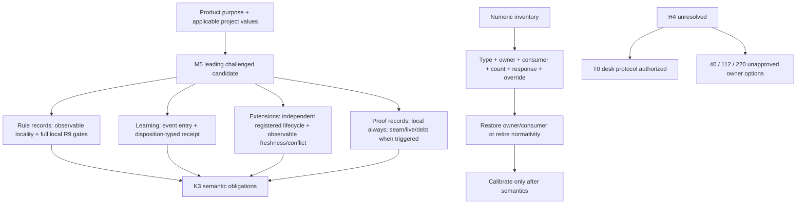

# RES — TFW-48: Value-First Methodology Rebaseline — Iteration 2

> **Date**: 2026-07-29
> **Author**: Researcher (Codex)
> **Status**: 🔬 RES — Complete
> **Parent HL**: [HL-TFW-48](../../HL-TFW-48__value_first_methodology_rebaseline.md)
> **Predecessor**: [Iteration 1 RES](../iter1/RES.md)
> **Mode**: Pipeline — Deep

---

## Research Context

Iteration 2 challenged Iteration 1's failure-selected conclusions with six independent
successful routine/low-risk software cases and four non-code cases across TFW, Atamat,
Helpdesk, and AFD. It calibrated rule locality and numeric-rule semantics, measured K3
trace overhead, separated learning from registered project extensions, tested
claim-typed value/seam review, and costed three H4 options without executing any
comparison. The sample supports mechanism/configuration analysis, not prevalence,
model-era causality, or an H4 effect claim.

## Briefing and Stage Trace

The approved scope and hard no-run boundary are in [1_briefing.md](1_briefing.md).
Evidence, configuration analysis, and falsification are recorded in
[2_gather.md](2_gather.md), [3_extract.md](3_extract.md), and
[4_challenge.md](4_challenge.md). Every stage closed at a Coordinator WAIT gate.

## Evidence Synthesis

| Question | Routine and counter-case synthesis | Consequence |
|----------|------------------------------------|-------------|
| Can rules be defined once? | Routine cases support canonical ownership plus short observable point-of-use gates; TFW-2.100 falsifies repetition-as-enforcement, AFD-10 falsifies reference-only use, and pre-action authority/safety boundaries remain full local imperatives | Select locality per protected obligation, consequence, and observability—not per global task weight |
| Is K3 proportionate? | Its five semantic obligations recur, but routine review traces range from 51–56 compact lines to 276–308 staged lines; AFD-32 produced 294 review/stage lines for ~80 implementation LOC, while AFD-51 preserved judgment in one 86-line review | Preserve purpose, authority, evidence, independent judgment, and learning disposition; do not mandate one artifact package |
| Which numbers survive? | Counts and limits can expose scope, sampling, and stale knowledge, but no exact current value was validated; several settings have missing consumers, registry entries, or breach paths | Type and restore ownership/enforcement before calibration; recommend no replacement numbers |
| Is capture the learning problem? | Selected cases show useful reject/local receipts and weak ambiguous batch deferrals; source and destination must remain related | Use disposition-typed receipts; do not route every artifact into a central registry |
| Are extensions part of learning? | Project policy can exist without a learning event; current adapter parity coexists with an incomplete Config Sync Registry | Give extensions an independent observable lifecycle: discovery, precedence/conflict, consumers, freshness, and migration failure |
| How should value be reviewed? | Local correctness did not prove source/interface/live seams; public content, migrations, security, and production incidents require claim-typed proof | Require local proof for every deliverable; add seam/live proof or explicit value debt when the claim triggers it |
| Can H4 be tested now? | Costs can be estimated, but no output exists; output totals are nested within only 4, 12, or 12+2 independent case packs | H4 remains unresolved; T0 alone is authorized |

## Decisions

| # | Decision | Rationale |
|---|----------|-----------|
| D11 | Carry corrected M5 as the leading challenged configuration candidate, not the selected TFW architecture | It survived routine and failure/security/migration/incident attacks while keeping obligations independently proportional |
| D12 | Model the method as one-or-more rule records, learning policies/transactions, zero-or-more independent extension records, one-or-more per-claim proof records, and an optional H4 package | The original combined learning/extension and global review objects conflated independent lifecycles |
| D13 | Require full local pre-action gates for role, safety, destructive, and irreversible authority boundaries even in routine tasks | Task exposure may strengthen but cannot weaken a boundary that must govern before action |
| D14 | Require local proof for every claimed deliverable; add seam, stakeholder/live, or explicit value-debt proof when triggered | Review packaging and proof depth are orthogonal; local-only proof repeatedly missed crossed claims |
| D15 | Select learning receipt strength by disposition | Reject/local needs state+reason; promote/merge/derive needs destination+actor; defer needs destination/due event+actor |
| D16 | Require registered extensions to expose owner, source/version, precedence, consumers, freshness, and unsupported/migration behavior through observable discovery/conflict results | Passive registration can drift just like a manual sync registry |
| D17 | Preserve K3's semantic obligations but reject uniform staged packaging, universal file percentages, and every-artifact central routing | Routine evidence demonstrates real overhead without showing that the obligations are dispensable |
| D18 | Split normative targets from descriptive measurements and keep numeric lifecycle classes provisional | Targets need owner/response/override; measurements are inventory-only and have no breach |
| D19 | Route unconsumed/orphaned numbers through restore-owner-or-retire before exact calibration | Without a semantic owner, observed consumer, counting rule, breach response, and override authority there is no calibratable control |
| D20 | Keep T0 as the sole authorized H4 configuration; retain T1–T6 only as owner claim/cost options | No comparison was authorized or run, and output count is not independent-case count |

## Leading Challenged Configuration

M5 is a candidate for Coordinator architecture selection:

```text
M5 =
  rule records selected per consequence/observability
  + full local R9 pre-action authority/safety gates
  + event-triggered learning with disposition-typed receipts
  + independently registered extensions with observable lifecycle
  + compact local proof for every deliverable
  + grouped seam proof when a seam exists
  + live/stakeholder proof when triggered
    or explicit value debt with owner, due event, evidence route, and non-claim
  + T0 desk protocol only
```

Individual records are not complete method configurations. M4 and M6 require an added
seam-proof record where their claims cross a source/interface. R6, complete methods
without local proof, receiptless selected learning, every-artifact central routing as
the default, and direct upstream-core forks as the default were eliminated.

## Numeric Lifecycle

### Validation classes

Structural existence gates, tunable thresholds, escalation triggers, attention
warnings, sampling defaults, normative targets, and descriptive measurements require
different validation:

| Type | Required validation |
|------|---------------------|
| Structural existence gate | The construct is necessary and the existence check actually detects it |
| Boundary / tunable threshold | Owner, loss function, count, enforcement, breach response, override, and outcome/cost calibration |
| Escalation trigger | Evidence that crossing it should change verification or authority |
| Attention warning | Useful signal and a proportionate explain/split response; not automatic failure |
| Sampling default | Coverage/saturation rationale, exclusions, and justified expansion/shortfall |
| Normative target | Desired outcome, owner, measurement, response, and recalibration |
| Descriptive measurement | Provenance and counting consistency only; no breach or override |

### Provisional restore-owner-or-retire objects

| Object | Provisional class | Research disposition |
|--------|-------------------|----------------------|
| `research.max_passes: 3` | (2) intended policy with missing/broken consumer | OODA consumes `loops_per_stage`; owner must define alias, independent ceiling, or retirement |
| `research.min_iterations: 2` | (3) active consumer with missing registry documentation | Plan/iteration gate consumes it; register owner/derivatives; exact universal 2 remains unvalidated |
| `knowledge.max_index_lines: 200` | (2) intended policy with missing consumer/breach path | Restore count/response/override or retire normativity |
| `knowledge.max_index_facts_lines: 30` | (1) obsolete/dead setting | Prior topology is gone; confirm retirement |
| `knowledge.max_facts_per_topic: 50` | (2) active intent with incomplete breach path | Define warning/split/override semantics before calibration |
| `knowledge.max_topic_files: 8` | (2) active intent with incomplete breach path | Define taxonomy-quality response before calibration |
| Workflow `≤1200` words | (2) intended policy with missing counting/breach path | Normative convention is active; define unit and response or retire |
| Adapter `≤35` lines | (2) intended policy with missing counting/enforcement path | Current research skill is 21 lines; define whether unit is entry file, skill, or adapter |

Observed breaches and non-breaches do not select replacements. Mature projects exceed
200 index lines and 50 facts/topic, but that demonstrates non-enforcement/construct
drift rather than an optimal higher value. Routine reviews at 67–100% do not prove the
42% floor safe or unsafe.

## H4 Owner Decision Package

No H4 cell was run. Assumptions are dated 2026-07-29 and remain fully specified in
Gather: 15k–30k input tokens, 2k–6k output tokens, 0/50/80% cache sensitivity, 10%
protocol-failure reserve, two masked scorers, reconciliation, and explicit researcher
time.

| Option | Formula and independent cases | Valid claim | Credits before 10% reserve | Human time | Status |
|--------|-------------------------------|-------------|----------------------------|------------|--------|
| T0 | Desk protocol/cost package; no outputs | Feasibility planning only | None executed | Research analysis already recorded | **Authorized** |
| T1/T2 — 40 | `4×2×4 + 8 = 40`; four independent cases | Operability, scoring agreement, runtime/token/case-construction estimate; cannot confirm or refute H4 | 60.8–247.5; API-reference USD 1.62–6.60 | 33.6–64.0 h | Unapproved |
| T3/T4 — 112 | `12×2×4 + 16 = 112`; twelve independent cases | Feasibility and variance/reliability calibration absent prospective justification | 170.1–693.0; API-reference USD 4.54–18.48 | 82.9–156.8 h | Unapproved |
| T5/T6 — 220 | `168 primary + 28 pilot + 24 repeats`; twelve main plus two pilot packs | Candidate inferential layout only after estimand, power, multiplicity, independence, profile/family model, stopping, and missingness rules | 334.1–1,361.3; API-reference USD 8.91–36.30 | 114.8–212.0 h | Unapproved |

Repeated profiles, conditions, scorers, and outputs are nested observations and cannot
replace case diversity. Separate owner authorization remains mandatory for T1–T6.

## Open Questions

| # | Question | Status | Answer |
|---|----------|--------|--------|
| Q1 | What architecture should TFW select? | Coordinator-owned | M5 is the leading challenged candidate, not a Researcher selection |
| Q2 | Which exact current numeric values should remain or change? | Open pending owners/provenance | This iteration classifies lifecycles and validates mechanisms only; it recommends no replacements |
| Q3 | Does matched operational strategy improve inquiry outcomes? | Unresolved/inconclusive | No H4 output was authorized or generated |
| Q4 | Is any H4 execution proportionate? | Owner decision pending | 40 narrows to rehearsal; 112 calibrates feasibility/variance; 220 is only a candidate inferential layout |
| Q5 | How do weaker profile packages respond to locality choices? | Open | No fresh profile comparison was authorized; production cases support mechanisms, not profile effects |

## Hypotheses (from HL §10)

| # | Hypothesis | HL Status | RES Status | Evidence |
|---|-----------|-----------|------------|----------|
| H1 | A critical rule can be defined once canonically and enforced by a short point-of-use check instead of full repetition in every workflow. | Provisional after Iteration 1 | 🟢 Conditionally supported and narrowed | Owned observable gates work for reversible/lifecycle failures; retain full local imperatives for pre-action authority/safety/irreversible boundaries |
| H2 | Some fixed limits now cause proxy optimization; only limits tied to a concrete prevented failure should remain fixed. | Provisional after Iteration 1 | 🟢 Mechanism supported; no exact value validated | Complete ledger and lifecycle classes separate structural gates, thresholds, warnings, defaults, targets, and measurements |
| H3 | TFW has enough capture locations; the dominant knowledge failure is selection, routing, verification, promotion/rejection, and pruning. | Provisional after Iteration 1 | 🟢 Supported as dominant with receipt qualification | Routine cases support event entry and disposition-typed receipts; central every-artifact routing is not justified |
| H4 | A matched operational cognitive strategy improves research behavior and outcomes beyond priming or prompt volume. | Research required | ⚪ Unresolved / inconclusive | Protocol and costs were refined, but authorization prohibited every comparison output |

## HL Update Recommendations

| # | What to update | Source |
|---|----------------|--------|
| R12 | Replace any global light/heavy model with the corrected object grammar and present M5 as a challenged candidate only | D11–D12; Extract M5; Challenge C-D1 |
| R13 | Define rule locality by protected consequence and observability; preserve full local pre-action gates | D13; H1 |
| R14 | Separate local, seam, live/stakeholder, and explicit value-debt proof from review packaging | D14; Challenge C3 |
| R15 | Preserve K3 semantics while making packaging risk/claim-triggered | D17; routine overhead evidence |
| R16 | Separate learning transactions from extension records and define disposition-typed receipts | D15–D16; H3 |
| R17 | Add observable extension discovery, precedence/conflict, consumer, freshness, and migration behavior | D16; Config Sync Registry counterexample |
| R18 | Split target from descriptive measurement and add the numeric lifecycle/classification table; endorse no exact replacement | D18–D19; Challenge C4 |
| R19 | State the routine-case/non-prevalence and non-causal limitations explicitly | Gather sampling decision; Challenge scope |
| R20 | Keep H4 unresolved and include the 40/112/220 owner packages plus independent-case correction; T0 only authorized | D20; Challenge C5 |

## Fact Candidates

No human-only project fact candidates. Coordinator messages supplied research
constraints and decisions, recorded below as strategic insights.

## Strategic Insights (Research)

| # | Category | Insight | Source | Confidence |
|---|----------|---------|--------|------------|
| SS4 | process | Routine-case counts are an initial coverage target, not a completion threshold; closure depends on coverage, exposed exclusions, saturation, and whether cases still change dispositions | Coordinator, Iteration 2 Briefing approval | ★★★ |
| SS5 | conventions | Absence of recorded incidents must not validate or invalidate a numeric rule; semantic owner, consumer, count, response, and override precede calibration | Coordinator, Gather approval | ★★★ |
| SS6 | research | The 40-output option may assess operability/scoring/cost only and may not count as confirmatory H4 evidence | Coordinator, Gather/Extract/Challenge approvals | ★★★ |
| SS7 | architecture | Learning transactions, extension records, and per-claim proof records are independent objects; local, seam, and live proof can coexist | Coordinator, Extract structural correction | ★★★ |

## Findings Map



## Iteration Status

- **Iteration:** 2 of 2 (min) / 5 (max)
- **Hypotheses tested:** H1 (conditionally supported/narrowed), H2 (mechanism
  supported; exact values unvalidated), H3 (supported with receipt qualification), H4
  (unresolved/inconclusive)
- **Hypotheses deferred:** H4 causal matched-strategy effect and weaker-profile effects
  — no fresh comparison, task, fork, dispatch, or model execution was authorized
- **Gaps discovered:** owner confirmation/provenance for provisional numeric classes;
  architecture selection; executable extension-discovery design; post-change outcome
  monitoring; prospective H4 estimand/power/multiplicity/independence/stopping/
  missingness plan if the owner ever authorizes a trial
- **Superseded decisions:** Extract's combined learning/extension policy and global
  value/review selector were superseded by independent L/E records and one-or-more
  per-claim V records; the provisional `max_passes` and 35-line classifications were
  narrowed to class (2); D4 target/measurement was split

### Open Threads

| # | Thread | Why it matters | Suggested focus |
|---|--------|---------------|-----------------|
| 1 | Coordinator architecture selection | Research can challenge configurations but cannot choose the target architecture | In `/tfw-plan`, compare M5 and repaired alternatives against product purpose and implementation cost |
| 2 | Restore-owner-or-retire decisions | Orphaned or partially consumed values cannot be calibrated honestly | Owners confirm provenance, consumers, breach paths, and retirement effects; do not invent replacement numbers |
| 3 | Registered-extension observability | A passive registry can become another stale authority | Specify discovery, precedence conflict, source hash/sync, unsupported-version, and migration failure evidence |
| 4 | H4 owner decision | H4 blocks an evidence-based strategy-selection claim | Keep unresolved unless owner separately authorizes a prospectively justified option |
| 5 | Outcome monitoring after rebaseline | Routine cases support mechanisms but not prevalence or future causal effects | Define post-implementation signals for overhead, missed seams, learning closure, and extension drift |

### Recommendation

- [x] **SUFFICIENT** — proceed to `/tfw-plan` to update the HL and write/revise TS;
  preserve H4 as unresolved and treat all exact threshold changes as owner-gated
- [ ] **MORE NEEDED**
- [ ] **BLOCKED**

> ⚠️ Coordinator decides whether to continue or proceed. Researcher recommends but does NOT decide.

## Conclusion

Iteration 2 corrected Iteration 1's failure-selection bias without reversing its core
mechanisms. Routine successes show that K3's semantic obligations can survive in
compact packaging, while counter-cases show why authority gates, source/seam/live
proof, independent judgment, and learning disposition cannot be compressed away. The
result is a challenged candidate grammar and M5—not a selected architecture—plus a
numeric restore/retire lifecycle and a transparent H4 owner package. The principal
limitations are deliberate: this corpus does not estimate prevalence, no model/profile
effect was isolated, no exact threshold was calibrated, and H4 remains unresolved.

---

*RES — TFW-48: Value-First Methodology Rebaseline, Iteration 2 | 2026-07-29*
