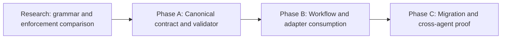

# HL — TFW-49: Agent Commit Identity and Attribution

> **Date**: 2026-07-30
> **Author**: Coordinator (Codex) + User
> **Status**: ✅ HL — Approved for research and phased delivery
> **Owner authority**: The user delegated format, phase, execution, review, and closure decisions to the Coordinator on 2026-07-30.

---

## 1. Vision

Every commit created by an AI agent identifies its origin at the beginning of the
subject in one compact, canonical form. A human or a later agent can scan or filter
history and immediately determine the agent surface, TFW role, task, and phase or
research scope responsible for the change. The identity remains readable without
special tooling, while structural validation prevents quiet drift between
Coordinator, Researcher, Executor, Reviewer, adapters, and repositories.

This is provenance, not decoration. The commit identity connects Git history to the
same task and role boundaries carried by filesystem traces. It does not replace Git
authors, co-author trailers, task artifacts, RF attestation, or independent REVIEW.

**Impact:** Git history becomes a searchable cross-agent trace. The user can isolate
all commits for a task, phase, role, or agent family without opening every artifact,
and agents can see who changed the repository before resuming or reviewing work.

> “At the beginning of every agent commit I want to see who made it, for which task,
> phase, and role, so I can distinguish and find the work easily.”

## 2. Current State (As-Is)

### 2.1 Existing history does not identify the acting agent

Recent TFW-48 subjects show the current pattern:

| Example | What is visible | What is missing |
|---------|-----------------|-----------------|
| `[master]: TFW-48/C: align specification execution and proof` | branch, task, phase | agent surface and TFW role |
| `[master]: review: approve TFW-48 phase C` | branch and action prose | stable task/phase/role fields |
| `[master]: knowledge: close TFW-48 phase C` | branch and action prose | stable agent/role identity |
| `[master]: [master]: TFW-48/B: review ...` | duplicated branch prefix | reliable canonical parsing |

Git author metadata identifies a configured account, not the acting AI surface,
session function, or TFW Role Lock. Natural-language subjects sometimes mention a
task or action, but their order and vocabulary are inconsistent.

### 2.2 A local hook adds the wrong identity

The current unversioned `.git/hooks/prepare-commit-msg` prepends the checked-out
branch to every non-merge subject. On this repository the result is usually
`[master]:`, which is low-value because the whole history is already on `master`.
The hook:

- is local state and is not distributed by the framework;
- does not know task, phase, role, or agent surface;
- can duplicate its own prefix;
- treats a substring match for `merge` as the merge detector;
- has no canonical validation contract or actionable failure message.

### 2.3 Commit creation is distributed

Commits can be created during planning, research, handoff, review, docs, knowledge,
release, update, init, config, and adapter work. Some workflows mention committing
explicitly, while others rely on general conventions or the executing agent. Root
adapter instructions load common conventions, but there is no point-of-action
contract that all commit-producing roles demonstrably consume.

### 2.4 The desired identifier is not yet fully specified

The user proposed a shape such as
`codex-tfw-48-coordinator-phase-c`, while explicitly delegating the exact spelling
and order. Open decisions include:

- whether the stable “agent” field represents a tool surface, provider, model,
  exact session, or another identity;
- how to encode master-task, phase, research iteration, and non-task maintenance;
- how the grammar interacts with Conventional Commits, reverts, merges,
  fixup/squash subjects, co-authors, and human commits;
- whether generated defaults may fill context or only validate context supplied by
  the acting agent;
- how local and installed repositories receive and repair the enforcement mechanism.

## 3. Target State (To-Be)

### 3.1 Result Visualization

A representative history is compact and mechanically filterable:

```text
<agent identity><task scope><role> <action>: <concise result>
<agent identity><task scope><role> <action>: <concise result>
```

The exact delimiters and order above are deliberately unresolved until research
tests competing grammars. The accepted grammar must make these queries reliable:

| User need | Expected result |
|-----------|-----------------|
| Find all agent commits for TFW-49 | one stable task token |
| Find only Phase A work | one stable phase token |
| Distinguish Executor from Reviewer | one stable role token |
| Distinguish Codex from another supported agent surface | one stable agent token |
| Read `git log --oneline` | identity is visible at the beginning without opening the body |
| Diagnose invalid identity | commit is rejected with an exact correction example |

Human-authored commits remain attributable through normal Git metadata unless a
later explicit policy includes them. Historical commits are preserved unchanged.

### 3.2 Value Flow

```text
ACTIVE TASK + PHASE + ROLE + AGENT SURFACE
                    │
                    ▼
       CANONICAL COMMIT IDENTITY CONTRACT
                    │
           ┌────────┴────────┐
           ▼                 ▼
  POINT-OF-ACTION CUE   STRUCTURAL VALIDATOR
           │                 │
           └────────┬────────┘
                    ▼
       SEARCHABLE, HONEST GIT PROVENANCE
                    │
                    ▼
     FASTER RESUME, REVIEW, AUDIT, AND USER CONTROL
```

## 4. Phases

Research may refine file ownership and phase boundaries before Phase TS approval.

### Phase Dependencies



| Phase | Depends on | Shared concerns | Can run in parallel with |
|-------|------------|-----------------|--------------------------|
| A | Research sufficient | canonical grammar, validation behavior | — |
| B | A approved | every commit-producing role and adapter | — |
| C | A + B approved | installation, current-repo migration, compatibility | — |

### Phase A: Canonical Contract and Validator 🔴

> **Requires:** sufficient comparative research and an approved Phase A TS.

> **Context for coordinator:** this HL; TFW-49 RES; `.tfw/conventions.md` Role
> Pipeline and Role Lock; `.tfw/glossary.md` Roles and Session Naming; D28, D54,
> D55, and D57.

1. Select one compact, precise commit-identity grammar and define each field.
2. Define task, master-task, phase, research-iteration, and permitted non-task
   scopes without ambiguous free-form aliases.
3. Define behavior for agent-authored normal commits, amend, revert, merge,
   fixup/squash, automation, co-authors, and human-authored commits.
4. Implement one versioned semantic owner and a cross-platform validation surface
   with deterministic, actionable diagnostics.
5. Preserve normal Git meaning and history; do not rewrite earlier commits.

### Phase B: Workflow and Adapter Consumption 🟡

> **Requires:** Phase A ✅

1. Put a short mandatory identity cue immediately before every workflow action that
   can create a commit.
2. Make all TFW roles and supported agent adapters consume the same canonical
   contract without duplicating its full definition.
3. Ensure init/update/config/release and ordinary task flows can derive or request
   the required context without inventing task or role identity.
4. Preserve complete local Role Lock, approval, destructive-action, and
   irreversible-action imperatives.

### Phase C: Migration and Cross-Agent Proof 🟢

> **Requires:** Phase A + Phase B ✅

1. Replace or safely bypass the current local branch-prefix hook without deleting
   history or unrelated user hooks.
2. Install and repair the versioned mechanism through the owning TFW lifecycle.
3. Exercise valid and invalid subjects in isolated Git fixtures across supported
   operating-system shells and representative Coordinator, Researcher, Executor,
   Reviewer, docs, and knowledge paths.
4. Prove the target repository uses the new rule for all new agent-authored commits,
   including the task’s own final commits where activation order permits.
5. Record migration, compatibility, limitations, and rollback behavior.

## 5. Definition of Done (DoD)

- ✅ 1. One canonical term and grammar identifies agent surface, TFW task scope,
  phase or iteration scope, and TFW role at the beginning of every new
  agent-authored commit subject.
- ✅ 2. The grammar has unambiguous rules for master tasks, phases, research
  iterations, work outside an active task, amend, revert, merge, fixup/squash,
  automation, co-authorship, and human commits.
- ✅ 3. A versioned structural validator rejects malformed or missing identity with
  an actionable expected example and does not silently invent false provenance.
- ✅ 4. Every framework-owned commit-producing workflow and supported adapter has an
  observable point-of-action consumer of the canonical contract.
- ✅ 5. Init/update or the selected lifecycle owner can install, verify, repair, and
  migrate enforcement without overwriting unrelated user Git-hook behavior.
- ✅ 6. The existing `[master]:` local behavior is safely superseded for future
  commits; historical commits and unrelated Git metadata remain unchanged.
- ✅ 7. Repository fixtures prove positive, negative, exception, and search/filter
  behavior across all four TFW roles and at least two agent surfaces or an
  explicitly justified supported-surface boundary.
- ✅ 8. The implementation remains tool-agnostic at the method layer and works for
  non-code TFW tasks as well as software changes.
- ✅ 9. RF connects every material claim to reproducible Proof Records, and an
  independent Reviewer verifies semantics, scope, migration safety, and actual Git
  behavior.
- ✅ 10. `/tfw-docs` records the durable architecture and `/tfw-knowledge`
  dispositions every selected signal before TFW-49 closes.

## 6. Definition of Failure (DoF)

- ❌ 1. The identity can be omitted by an ordinary agent commit without a clear,
  explicit exception path.
- ❌ 2. The format says only branch, task, action, or Git author and cannot
  distinguish agent surface plus TFW role plus phase/iteration scope.
- ❌ 3. The mechanism inserts an identity that the acting agent did not establish,
  making provenance look precise while being false.
- ❌ 4. The contract is duplicated independently across workflows or adapters and
  can drift without one semantic owner.
- ❌ 5. Installation replaces or deletes unrelated user hooks without detection,
  preservation, or explicit authority.
- ❌ 6. Normal human commits are blocked even though the approved policy covers only
  agent-authored commits.
- ❌ 7. Merge, revert, amend, fixup, squash, or generated commits are corrupted,
  double-prefixed, or assigned the wrong task/role.
- ❌ 8. Enforcement depends only on agent compliance prose or only on unversioned
  `.git/` state.
- ❌ 9. The task rewrites historical commit messages or changes authorship to make
  old history appear compliant.
- ❌ 10. The format is optimized for one current model or session identifier and
  becomes unstable when models or agent products change.

**On failure:** stop the affected phase, preserve the current repository and hook
state, record the failed configuration and boundary, and return to the Coordinator
for a narrower contract or migration repair. Do not bypass validation merely to
produce an RF.

## 7. Principles

1. **Provenance must be true** — a precise-looking but inferred identity is worse
   than an explicit failure asking the acting agent for context.
2. **Identity first** — the required identity is visible at the beginning of the
   subject, not hidden only in a body or trailer.
3. **Meaning before punctuation** — research selects the smallest grammar that
   preserves stable semantics, filtering, and Git compatibility.
4. **One semantic owner** — workflows and adapters carry short point-of-action
   enforcement, while one canonical source defines the grammar.
5. **Structural enforcement with an honest boundary** — validation must cover
   ordinary agent commits and name every exception; hooks alone are not a security
   boundary because Git supports bypasses.
6. **Role and agent are different** — `codex` and `reviewer` answer different
   questions and must not be collapsed.
7. **Stable identities over volatile models** — do not make routine history depend
   on model-version strings unless research proves that value outweighs churn.
8. **Git-native compatibility** — preserve authors, co-authors, standard trailers,
   revert/merge semantics, and useful tooling wherever possible.
9. **Prospective migration** — enforce the new contract from activation onward;
   preserve old history as evidence of the former system.
10. **Cross-domain portability** — task and role provenance applies to research,
    product, business, documentation, and operations, not only code.
11. **Progressive disclosure** — agents see the local imperative and one valid
    example at commit time; edge-case details remain in the canonical owner.
12. **Independent proof** — the same agent that implements the hook does not decide
    whether the resulting history is trustworthy.

### 7.1 Quality Contract

- A field name must answer one question only; no token may ambiguously mix agent,
  role, task, phase, or action.
- Examples must be generated from the same grammar the validator accepts.
- Validation errors must identify the failing field and show a corrected complete
  subject.
- A repository with a pre-existing hook must be inspected before migration.
- Versioned framework files must not depend on a developer’s absolute path.
- Test fixtures must use temporary repositories and must not mutate real history.
- Message-length metrics are observations, not success criteria; clarity and
  filterability govern compression.
- The first commits created before activation are transitional evidence and may use
  the old local prefix. No commit may claim the new format is active before the
  validator and point-of-action contract actually are.

### 7.2 Knowledge Citations

| # | Source | Item | How it applies |
|---|--------|------|----------------|
| 1 | [.tfw/README.md](../../.tfw/README.md#traces-over-code) | Traces Over Code | Git identity must connect repository history to durable task traces. |
| 2 | [.tfw/README.md](../../.tfw/README.md#honesty-over-convincingness) | Honesty Over Convincingness | The validator must reject unknown provenance rather than fabricate it. |
| 3 | [.tfw/README.md](../../.tfw/README.md#structural-enforcement) | Structural Enforcement | A mandatory commit contract needs an observable gate, not prose alone. |
| 4 | [.tfw/README.md](../../.tfw/README.md#naming-creates-behavior) | Naming Creates Behavior | Precise field names and ordering reduce explanatory context and agent drift. |
| 5 | [.tfw/README.md](../../.tfw/README.md#single-source-of-truth) | Single Source of Truth | Grammar semantics need one owner with short local consumers. |
| 6 | [.tfw/README.md](../../.tfw/README.md#portability) | Portability | The contract must survive different agents, platforms, and domains. |
| 7 | [KNOWLEDGE.md](../../KNOWLEDGE.md) | D28 | Naming is an operational prompt, so grammar vocabulary is a design decision. |
| 8 | [KNOWLEDGE.md](../../KNOWLEDGE.md) | D54 | Adapters provide behavioral parity through thin, progressively loaded consumers. |
| 9 | [KNOWLEDGE.md](../../KNOWLEDGE.md) | D55 | Role authority, traceability, and observable enforcement belong to the Method Kernel. |
| 10 | [KNOWLEDGE.md](../../KNOWLEDGE.md) | D57 | A commit identity is provenance, not proof or review acceptance. |
| 11 | [.tfw/conventions.md](../../.tfw/conventions.md#15-role-lock-protocol) | Role Lock Protocol | Commit role identity must match the workflow role that is permitted to act. |
| 12 | [.tfw/glossary.md](../../.tfw/glossary.md#session-naming) | Session Naming | Existing session identity supplies a related but distinct point-of-session trace. |

## 8. Dependencies

| Dependency | Status |
|------------|--------|
| TFW-48 Phase C claim-typed execution and role chain | ✅ Complete |
| TFW-48 `/tfw-docs` D57 and `/tfw-knowledge` closure | ✅ Complete |
| Current repository hook and history inspection | ✅ Initial evidence gathered |
| Comparative research on Git-native mechanisms and grammars | ⬜ Required before Phase A TS |
| Official Git hook/config/trailer semantics | ⬜ Required before Phase A TS |
| Existing Executor and Reviewer Codex sessions | ✅ Delegated by user |

## 9. Risks

| Risk | Probability | Impact | Mitigation |
|------|-------------|--------|------------|
| Prefix becomes long visual noise | Medium | Medium | Compare compact fixed-order grammars and measure real log readability. |
| Agent surface is confused with model or account identity | High | High | Define field semantics and test future-change stability before selection. |
| Local hook conflicts with a versioned hook path | High | High | Inventory and migrate non-destructively; provide repair and rollback evidence. |
| `--no-verify` creates a false claim of absolute enforcement | High | Medium | State the honest boundary and pair validation with workflow/review checks. |
| Human commits are unintentionally rejected | Medium | High | Define an explicit agent-authored scope and a distinguishable activation signal. |
| Conventional tooling parses the prefix poorly | Medium | Medium | Test subject-first alternatives against primary specifications and fixtures. |
| Every workflow duplicates edge-case rules | Medium | Medium | Keep one owner and point-of-action cue/example only. |
| Task scope cannot be derived safely during docs/knowledge/release | Medium | High | Define explicit lifecycle scopes; fail with guidance rather than guess. |
| Windows and POSIX hook behavior diverges | Medium | High | Use portable entrypoints and exercise both supported environments where available. |
| TFW updates overwrite project hook customizations | Medium | High | Make install/update ownership, conflict detection, and preservation explicit. |

## 10. RESEARCH Case

### Blind Spots

- Which subject grammar best balances first-glance recognition, stable filtering,
  compactness, Conventional Commit compatibility, and correction ergonomics?
- Is “agent” best represented by surface (`codex`, `claude-code`), provider, model,
  configured Git identity, exact session, or a layered combination?
- What is the minimum unambiguous phase vocabulary for master planning, research
  iterations, implementation phases, docs, knowledge, release, update, and
  non-task maintenance?
- How can enforcement apply to agent-authored commits without blocking ordinary
  human commits or trusting an agent to self-declare falsely?
- Which Git mechanism should own validation and installation:
  `commit-msg`, `prepare-commit-msg`, `core.hooksPath`, a wrapper, CI, or a layered
  combination?
- How do hooks receive reliable task/phase/role/agent context across separate Codex
  and Claude sessions?
- What behavior is correct for amend, merge, revert, cherry-pick, fixup/squash,
  generated release commits, co-authors, and emergency bypass?
- How should init/update preserve unrelated hooks and repair drift?
- What evidence from Atamat, Helpdesk, AFD, and TFW histories shows the actual
  search and attribution failures rather than merely a plausible preference?

### Hypotheses

| # | Hypothesis | Status |
|---|------------|--------|
| H1 | A fixed subject-leading identity with separate agent, task/scope, and role fields is materially easier to recognize and filter than Git author metadata, branch prefixes, free-form prose, or trailers alone | open |
| H2 | A stable agent-surface identifier plus TFW role is more durable and truthful than a model-version or exact-session identifier as the mandatory core; more specific identity can remain optional metadata | open |
| H3 | One canonical grammar plus a short point-of-commit imperative and a versioned `commit-msg` validator provides the smallest reliable enforcement contract; documentation-only or a mutating `prepare-commit-msg` hook is insufficient | open |
| H4 | Agent-only enforcement can be made deterministic without blocking human commits if agent workflows establish explicit context that the validator verifies rather than invents | open |
| H5 | `core.hooksPath` with conflict-aware init/update migration can supersede the current `[master]:` hook while preserving unrelated user hooks and normal Git operations | open |
| H6 | The contract can handle merge/revert/amend/fixup/release exceptions with a small explicit grammar rather than workflow-specific formats | open |

### Risks of Not Researching

Choosing the user’s example literally without testing could create a long prefix,
conflate the Codex product with a particular model, break common Git tooling, or
require agents to invent phase context. Choosing a hook only because one already
exists could repeat the current unversioned `[master]:` behavior and overwrite user
customizations during init/update. The task affects every future commit, so a small
research cost prevents permanent high-frequency friction.

### Proposed RESEARCH Focus

1. **Gather:** inventory current commit-producing workflows, adapters, local hooks,
   Git history, and representative Atamat/Helpdesk/AFD commit conventions.
2. **Gather:** use only primary technical sources for Git hook, `core.hooksPath`,
   trailer, merge/revert, and Conventional Commit semantics.
3. **Extract:** compare candidate identity grammars and enforcement configurations
   against recognition, filtering, truthfulness, compatibility, installation,
   repair, and bypass-boundary dimensions.
4. **Challenge:** exercise candidates in temporary repositories with all four TFW
   roles, two agent surfaces where evidence permits, human commits, invalid context,
   amend/revert/merge/fixup, and pre-existing hooks.
5. **Synthesize:** recommend the smallest viable grammar, semantic owner,
   point-of-action contract, validator, migration path, and phased implementation.

### Why Not Just...?

- Why not use Git author name? — It usually represents the account and does not
  encode TFW task, phase, role, or agent surface.
- Why not keep `[master]:`? — The branch is redundant in a branch-aware log and does
  not identify who or which TFW scope produced the change.
- Why not add trailers only? — They are structured, but the user explicitly needs
  identity visible at the beginning and in one-line history.
- Why not trust every agent to type the prefix? — The current history already shows
  inconsistent and duplicated subjects; a mandatory rule needs an observable gate.
- Why not let the hook generate everything? — Guessing role or task can produce
  false provenance. Generation is acceptable only from explicit, validated context.
- Why not rewrite TFW-48 history? — Historical subjects are evidence of the old
  system; retrospective normalization would alter shared history and blur provenance.

## 11. Strategic Insights (Planning)

| # | Insight | Planning implication | TS disposition / destination | Category | Source |
|---|---------|----------------------|------------------------------|----------|--------|
| S1 | Every agent-created commit must begin with enough identity to distinguish who made it and for which task, phase, and agent role | Treat subject-leading identity and all four semantic dimensions as non-negotiable; delimiters/order remain researchable | Master DoD 1; Phase A grammar AC | convention | User, 2026-07-30 |
| S2 | The user wants to recognize and find commits easily by phases, tasks, and agents | Filtering and one-line readability are product outcomes, not incidental formatting | Phase A grammar/search proof; Phase C live-history proof | stakeholder | User, 2026-07-30 |
| S3 | `codex-tfw-48-coordinator-phase-c` is an example, not a mandated exact spelling or order | Compare grammars; do not mistake the example for a fully specified solution | Research H1–H2; Phase A Technical Guidance | convention | User, 2026-07-30 |
| S4 | The Coordinator may use the existing Researcher, Executor, and Reviewer Codex sessions and make workflow decisions without returning routine questions to the user | Preserve role locks and internal gates, but route decisions to the delegated Coordinator until logical closure | Workflow authority; no user WAIT dependency | process | User, 2026-07-30 |
| S5 | The new requirement arrived after Phase C implementation and review were complete | Keep TFW-48/C history trustworthy; use a standalone cross-cutting task with its own research, proof, review, migration, and knowledge closure | Task boundary TFW-49; prospective migration | process | User, 2026-07-30 |

---

*HL — TFW-49: Agent Commit Identity and Attribution | 2026-07-30*
