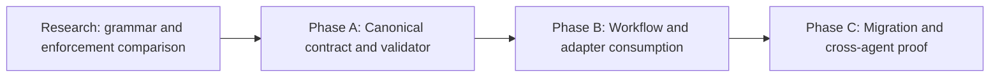

# HL — TFW-49: Agent Commit Identity and Attribution

> **Date**: 2026-07-30
> **Author**: Coordinator (Codex) + User
> **Status**: ✅ HL — Approved after research for phased delivery
> **Owner authority**: The user delegated format, phase, execution, review, and closure decisions to the Coordinator on 2026-07-30.
> **Research closure**: Iteration 1 SUFFICIENT; C1-R selected by the Coordinator on 2026-07-30.
> **Prospective activation anchor**: `f110618` is the last pre-policy commit. Every descendant after it is in structural scope; no earlier commit is relabeled.

---

## 1. Vision

Every new post-activation commit in an agent-managed TFW repository identifies its
operator context at the beginning of the subject in one compact, canonical form. A
human or a later agent can scan or filter history and immediately determine the agent
surface, TFW role, task, and phase or research scope responsible for the commit. The
identity remains readable without special tooling, while structural validation
prevents quiet drift between Coordinator, Researcher, Executor, Reviewer, adapters,
and repositories.

This is provenance, not decoration. The commit identity connects Git history to the
same task and role boundaries carried by filesystem traces. It does not replace Git
authors, co-author trailers, task artifacts, RF attestation, or independent REVIEW.

**Impact:** Git history becomes a searchable cross-agent trace. The user can isolate
all commits for a task, phase, role, or agent family without opening every artifact,
and agents can see who changed the repository before resuming or reviewing work.

> “At the beginning of every agent commit I want to see who made it, for which task,
> phase, and role, so I can distinguish and find the work easily.”

## 2. Current State (As-Is)

### 2.1 Existing history does not identify the acting agent

Recent TFW-48 subjects show the current pattern:

| Example | What is visible | What is missing |
|---------|-----------------|-----------------|
| `[master]: TFW-48/C: align specification execution and proof` | branch, task, phase | agent surface and TFW role |
| `[master]: review: approve TFW-48 phase C` | branch and action prose | stable task/phase/role fields |
| `[master]: knowledge: close TFW-48 phase C` | branch and action prose | stable agent/role identity |
| `[master]: [master]: TFW-48/B: review ...` | duplicated branch prefix | reliable canonical parsing |

Git author metadata identifies a configured account, not the acting AI surface,
session function, or TFW Role Lock. Natural-language subjects sometimes mention a
task or action, but their order and vocabulary are inconsistent.

### 2.2 The effective global hook adds the wrong identity

The repository resolves hooks through an external/global `core.hooksPath`. Its
unversioned `prepare-commit-msg` prepends the checked-out branch to every non-merge
subject; a byte-identical repository-local copy is dormant under that configuration.
On this repository the result is usually `[master]:`, which is low-value because the
whole history is already on `master`. The behavior:

- is external local-machine state and is not distributed by the framework;
- does not know task, phase, role, or agent surface;
- can duplicate its own prefix;
- treats a substring match for `merge` as the merge detector;
- has no canonical validation contract or actionable failure message.

Another external hook contains redacted plaintext sensitive material. TFW-49 never
ingests, copies, fingerprints, executes for testing, or reports that body. Its
remediation is an urgent external owner action, not commit-identity architecture.

### 2.3 Commit creation is distributed

Commits can be created during planning, research, handoff, review, docs, knowledge,
release, update, init, config, and adapter work. Some workflows mention committing
explicitly, while others rely on general conventions or the executing agent. Root
adapter instructions load common conventions, but there is no point-of-action
contract that all commit-producing roles demonstrably consume.

### 2.4 Research resolved the semantic and lifecycle choices

The user proposed a shape such as `codex-tfw-48-coordinator-phase-c`, while
delegating the exact spelling and order. Deep Iteration 1 compared four production
histories, official Git behavior, competing grammars, two Git runtimes, worktrees,
replay/autosquash, bypasses, and migration configurations.

The selected candidate is C1-R:

```text
[<surface>/<task>/<work>/<role>] <summary>
```

- `surface` is the stable agent interaction surface, not model, account, or session;
- `task` is the canonical TFW task or guarded `none`;
- `work` is the master, phase, research iteration, or lifecycle slice;
- `role` is the commit operator's active TFW Role Lock;
- optional full content-origin, model, session, and source records remain trailers;
- every new descendant after activation is structurally in scope;
- the record is contractual searchable provenance, not authenticated actor proof.

## 3. Target State (To-Be)

### 3.1 Result Visualization

A representative history is compact and mechanically filterable:

```text
[codex/TFW-49/master/coordinator] approve commit identity architecture
[codex/TFW-49/research-iter1/researcher] synthesize research evidence
[claude-code/TFW-49/phase-a/executor] implement the validator
[cursor/TFW-49/phase-a/reviewer] verify migration evidence
```

The fixed order makes these queries reliable:

| User need | Expected result |
|-----------|-----------------|
| Find all commits for TFW-49 | `/TFW-49/` |
| Find only Phase A work | `/phase-a/` |
| Distinguish Executor from Reviewer | `/executor]` versus `/reviewer]` |
| Distinguish Codex from another supported agent surface | `^[codex/` versus the registered surface |
| Read `git log --oneline` | identity is visible at the beginning without opening the body |
| Diagnose invalid identity | commit is rejected with an exact correction example |

The owner has selected an agent-managed repository policy: every new commit after
`f110618` must conform, regardless of which process invokes Git. This structural
policy does not authenticate the invoker. Historical commits remain unchanged.

### 3.2 Value Flow

```text
ACTIVE TASK + PHASE + ROLE + AGENT SURFACE
                    │
                    ▼
       CANONICAL COMMIT IDENTITY CONTRACT
                    │
           ┌────────┴────────┐
           ▼                 ▼
  POINT-OF-ACTION CUE   STRUCTURAL VALIDATOR
           │                 │
           └────────┬────────┘
                    ▼
       SEARCHABLE, HONEST GIT PROVENANCE
                    │
                    ▼
     FASTER RESUME, REVIEW, AUDIT, AND USER CONTROL
```

## 4. Phases

Research may refine file ownership and phase boundaries before Phase TS approval.

### Phase Dependencies



| Phase | Depends on | Shared concerns | Can run in parallel with |
|-------|------------|-----------------|--------------------------|
| A | Research sufficient | canonical grammar, validation behavior | — |
| B | A approved | every commit-producing role and adapter | — |
| C | A + B approved | installation, current-repo migration, compatibility | — |

### Phase A: Canonical Contract and Validator 🔴

> **Requires:** sufficient comparative research and an approved Phase A TS.

> **Context for coordinator:** this HL; TFW-49 RES; `.tfw/conventions.md` Role
> Pipeline and Role Lock; `.tfw/glossary.md` Roles and Session Naming; D28, D54,
> D55, and D57.

1. Select one compact, precise commit-identity grammar and define each field.
2. Define task, master-task, phase, research-iteration, and permitted non-task
   scopes without ambiguous free-form aliases.
3. Define operator semantics, optional full content-origin records, guarded
   `task:none`, same-context-only autosquash, and explicit cross-context replay.
4. Implement one versioned semantic owner for C1-R, closed registries,
   normalization, parsing, diagnostics, contract version, activation/range audit,
   and reusable hook consumers.
5. Preserve normal Git authorship and pre-activation history; do not claim actor
   authentication or strict Conventional Commit conformance.

### Phase B: Workflow and Adapter Consumption 🟡

> **Requires:** Phase A ✅

1. Put a short mandatory identity cue immediately before every workflow action that
   can create a commit.
2. Make all TFW roles and supported agent adapters consume the same canonical
   contract without duplicating its full definition.
3. Ensure init/update/config/release and ordinary task flows can derive or request
   the required context without inventing task or role identity.
4. Route merge/amend/replay/fixup through the truthful operation contract, prefer
   atomic same-origin commits, and expose optional source/origin trailers only where
   justified.
5. Preserve complete local Role Lock, approval, destructive-action, and
   irreversible-action imperatives.

### Phase C: Migration and Cross-Agent Proof 🟢

> **Requires:** Phase A + Phase B ✅

1. Install only a TFW-owned repository-local hook runtime through `/tfw-init`; set
   only local `core.hooksPath`, leaving global/prior hooks unread and in place but
   disabled for the repository.
2. Repair only recognized TFW-owned runtime through `/tfw-update`; block target
   ownership conflicts and restore the exact prior local value or `unset` on rollback.
3. Exercise valid and invalid subjects in isolated Git fixtures across supported
   operating-system shells and representative Coordinator, Researcher, Executor,
   Reviewer, docs, and knowledge paths.
4. Record `f110618` as the last pre-policy anchor and prove every descendant is
   structurally conforming through an independent range gate before
   push/review/release acceptance.
5. Prove main/linked-worktree behavior, bypass detection, replay restrictions,
   no historical relabeling, secret-safe diagnostics, compatibility limits, and
   exact rollback.

## 5. Definition of Done (DoD)

- ✅ 1. C1-R `[surface/task/work/role] summary` identifies the stable agent surface,
  canonical task, work slice, and commit-operator Role Lock at the beginning of every
  post-activation commit, with only exact same-context Git-reserved nesting.
- ✅ 2. One versioned contract owns registries, canonical normalization, guarded
  `task:none`, parser, diagnostics, optional trailers, operation rules, contract
  version, and activation/range semantics.
- ✅ 3. The entrypoint/router handles ordinary/merge/amend flows, prohibits
  cross-context autosquash, and converts cross-context revert/cherry-pick into
  `--no-commit` plus a current-operator commit and optional source record.
- ✅ 4. Repository-local prepare/final validators reject missing, malformed, or
  expected-context-mismatched identity with actionable examples and never invent
  provenance.
- ✅ 5. Every framework-owned commit-producing workflow and supported adapter has an
  observable point-of-action consumer of the single canonical contract.
- ✅ 6. `/tfw-init` installs and `/tfw-update` repairs only recognized TFW-owned
  per-repository hook state; global/prior hooks stay unread and unchanged, conflicts
  block, diagnostics are secret-safe, and rollback restores the exact prior local
  setting including `unset`.
- ✅ 7. `f110618` is recorded as the last pre-policy commit; an independent audit
  verifies every descendant without relabeling history and fails closed for an
  absent, invalid, or non-ancestral anchor.
- ✅ 8. Positive, negative, bypass, sequencer, merge, amend, autosquash, replay,
  registry, `task:none`, mixed-origin, search, main/linked-worktree, install, update,
  rollback, and range fixtures cover all four roles and registered surfaces across
  declared Git/platform/client boundaries.
- ✅ 9. The contract explicitly states that structural identity is declared
  provenance—not authenticated actor identity, Git authorship, Proof Record, RF
  attestation, or REVIEW acceptance.
- ✅ 10. RF connects every material claim to reproducible Proof Records; independent
  REVIEW verifies semantics, actual Git behavior, migration safety, and every
  post-activation commit before `/tfw-docs` and `/tfw-knowledge` close TFW-49.

## 6. Definition of Failure (DoF)

- ❌ 1. Any descendant after activation lacks canonical identity, or missing identity
  is inferred to mean “human.”
- ❌ 2. A valid prefix or local hook is represented as authenticated proof of the
  actual actor or as Proof/RF/REVIEW acceptance.
- ❌ 3. A hook invents, rewrites, or silently replaces context the current entrypoint
  did not establish.
- ❌ 4. Revert, cherry-pick, fixup, squash, amend, merge, or generated work retains a
  stale operator, task, or work identity.
- ❌ 5. An unregistered surface/role, ambiguous phase, or `task:none` combined with
  task-scoped work or staged paths passes validation.
- ❌ 6. Operator identity is used to imply every content origin, or an origin record
  omits task/work where those dimensions differ.
- ❌ 7. Installation mutates global Git state, ingests/copies arbitrary hook bodies,
  overwrites non-TFW target material, leaks path/body/credential data, or fails to
  restore the exact prior local setting including `unset`.
- ❌ 8. Any completeness claim hides `--no-verify`, plumbing, direct-entrypoint,
  missing-context sequencer, local-audit, GUI/client, or hosted-trust gaps.
- ❌ 9. The activation anchor is absent, invalid, non-ancestral, or silently replaced
  by a convenient recent range; historical messages or authorship are rewritten.
- ❌ 10. The contract is duplicated across consumers, drifts from its registries, or
  depends on a volatile model/session identifier as mandatory identity.

**On failure:** stop the affected phase, preserve the current repository and hook
state, record the failed configuration and boundary, and return to the Coordinator
for a narrower contract or migration repair. Do not bypass validation merely to
produce an RF.

## 7. Principles

1. **Provenance must be true** — a precise-looking but inferred identity is worse
   than an explicit failure asking the acting agent for context.
2. **Identity first** — the required identity is visible at the beginning of the
   subject, not hidden only in a body or trailer.
3. **Meaning before punctuation** — research selects the smallest grammar that
   preserves stable semantics, filtering, and Git compatibility.
4. **One semantic owner** — workflows and adapters carry short point-of-action
   enforcement, while one canonical source defines the grammar.
5. **Structural enforcement with an honest boundary** — every post-activation
   commit is structurally in scope, while hooks and local audits remain bypassable
   visibility mechanisms rather than actor authentication.
6. **Role and agent are different** — `codex` and `reviewer` answer different
   questions and must not be collapsed.
7. **Stable identities over volatile models** — do not make routine history depend
   on model-version strings unless research proves that value outweighs churn.
8. **Git-native compatibility without false identity** — preserve authors,
   co-authors, standard trailers, and useful tooling where compatible; restrict
   autosquash or replay when Git convenience would preserve a stale operator.
9. **Prospective migration** — enforce the new contract from activation onward;
   preserve old history as evidence of the former system.
10. **Cross-domain portability** — task and role provenance applies to research,
    product, business, documentation, and operations, not only code.
11. **Progressive disclosure** — agents see the local imperative and one valid
    example at commit time; edge-case details remain in the canonical owner.
12. **Independent proof** — the same agent that implements the hook does not decide
    whether the resulting history is trustworthy.

### 7.1 Quality Contract

- A field name must answer one question only; no token may ambiguously mix agent,
  role, task, phase, or action.
- Examples must be generated from the same grammar the validator accepts.
- Validation errors must identify the failing field and show a corrected complete
  subject.
- Hook topology and TFW ownership metadata may be inspected before migration;
  arbitrary prior hook bodies must not be ingested, copied, fingerprinted, or
  reported.
- Versioned framework files must not depend on a developer’s absolute path.
- Test fixtures must use temporary repositories and must not mutate real history.
- Message-length metrics are observations, not success criteria; clarity and
  filterability govern compression.
- `f110618` is the last pre-policy commit. Every later commit must use C1-R even
  before the installed hook exists; the Coordinator temporarily bypasses the old
  mutator command-locally, and Phase C later installs the permanent local runtime.
- Every range audit must use the recorded activation anchor and fail closed rather
  than silently choosing a smaller convenient range.

### 7.2 Knowledge Citations

| # | Source | Item | How it applies |
|---|--------|------|----------------|
| 1 | [.tfw/README.md](../../.tfw/README.md#traces-over-code) | Traces Over Code | Git identity must connect repository history to durable task traces. |
| 2 | [.tfw/README.md](../../.tfw/README.md#honesty-over-convincingness) | Honesty Over Convincingness | The validator must reject unknown provenance rather than fabricate it. |
| 3 | [.tfw/README.md](../../.tfw/README.md#structural-enforcement) | Structural Enforcement | A mandatory commit contract needs an observable gate, not prose alone. |
| 4 | [.tfw/README.md](../../.tfw/README.md#naming-creates-behavior) | Naming Creates Behavior | Precise field names and ordering reduce explanatory context and agent drift. |
| 5 | [.tfw/README.md](../../.tfw/README.md#single-source-of-truth) | Single Source of Truth | Grammar semantics need one owner with short local consumers. |
| 6 | [.tfw/README.md](../../.tfw/README.md#portability) | Portability | The contract must survive different agents, platforms, and domains. |
| 7 | [KNOWLEDGE.md](../../KNOWLEDGE.md) | D28 | Naming is an operational prompt, so grammar vocabulary is a design decision. |
| 8 | [KNOWLEDGE.md](../../KNOWLEDGE.md) | D54 | Adapters provide behavioral parity through thin, progressively loaded consumers. |
| 9 | [KNOWLEDGE.md](../../KNOWLEDGE.md) | D55 | Role authority, traceability, and observable enforcement belong to the Method Kernel. |
| 10 | [KNOWLEDGE.md](../../KNOWLEDGE.md) | D57 | A commit identity is provenance, not proof or review acceptance. |
| 11 | [.tfw/conventions.md](../../.tfw/conventions.md#15-role-lock-protocol) | Role Lock Protocol | Commit role identity must match the workflow role that is permitted to act. |
| 12 | [.tfw/glossary.md](../../.tfw/glossary.md#session-naming) | Session Naming | Existing session identity supplies a related but distinct point-of-session trace. |

## 8. Dependencies

| Dependency | Status |
|------------|--------|
| TFW-48 Phase C claim-typed execution and role chain | ✅ Complete |
| TFW-48 `/tfw-docs` D57 and `/tfw-knowledge` closure | ✅ Complete |
| Current repository hook and history inspection | ✅ Complete; sensitive body excluded |
| Comparative research on Git-native mechanisms and grammars | ✅ Iteration 1 SUFFICIENT |
| Official Git hook/config/trailer semantics | ✅ Gathered and challenged |
| Activation anchor | ✅ `f110618` selected as last pre-policy commit |
| Existing Executor and Reviewer Codex sessions | ✅ Delegated by user |

## 9. Risks

| Risk | Probability | Impact | Mitigation |
|------|-------------|--------|------------|
| Compact field order is misread | Medium | Medium | Strict positional parser, labeled diagnostics, and C2-R fallback if proof finds material ambiguity. |
| Agent surface is confused with model or account identity | High | High | Closed surface registry; model/session stay optional trailers; Git account metadata remains separate. |
| Project-local target conflicts with existing ownership | Medium | High | Detect recognized ownership, block non-TFW target material, and require explicit supersession authority. |
| `--no-verify` creates a false claim of absolute enforcement | High | Medium | State the honest boundary and pair validation with workflow/review checks. |
| Structurally valid identity is false or stale | Medium | High | Entry-point expected context, replay restrictions, independent review, and explicit non-authentication claim. |
| Conventional tooling parses the prefix poorly | Medium | Medium | Test subject-first alternatives against primary specifications and fixtures. |
| Every workflow duplicates edge-case rules | Medium | Medium | Keep one owner and point-of-action cue/example only. |
| Task scope cannot be derived safely during docs/knowledge/release | Medium | High | Define explicit lifecycle scopes; fail with guidance rather than guess. |
| Windows and POSIX hook behavior diverges | Medium | High | Use portable entrypoints and exercise both supported environments where available. |
| Activation anchor or audit range misses commits | Medium | High | Own anchor/version storage, validate ancestry, fail closed, and test fresh/shallow/multi-ref cases. |
| New adapter or phase spelling bypasses the registry | Medium | High | Atomic registry, generated-consumer, fixture, init, and update change. |
| GUI/IDE/JGit bypasses entrypoint context | Medium | High | Declare supported clients and prove or explicitly exclude each boundary. |

## 10. RESEARCH Case

### Blind Spots

- Which subject grammar best balances first-glance recognition, stable filtering,
  compactness, Conventional Commit compatibility, and correction ergonomics?
- Is “agent” best represented by surface (`codex`, `claude-code`), provider, model,
  configured Git identity, exact session, or a layered combination?
- What is the minimum unambiguous phase vocabulary for master planning, research
  iterations, implementation phases, docs, knowledge, release, update, and
  non-task maintenance?
- How can repository-wide structural policy remain honest about self-declaration,
  bypasses, and the absence of actor authentication?
- Which Git mechanism should own validation and installation:
  `commit-msg`, `prepare-commit-msg`, `core.hooksPath`, a wrapper, CI, or a layered
  combination?
- How do hooks receive reliable task/phase/role/agent context across separate Codex
  and Claude sessions?
- What behavior is correct for amend, merge, revert, cherry-pick, fixup/squash,
  generated release commits, co-authors, and emergency bypass?
- How should init/update disable inherited hooks per repository without reading or
  mutating them, and restore the exact prior local setting?
- What evidence from Atamat, Helpdesk, AFD, and TFW histories shows the actual
  search and attribution failures rather than merely a plausible preference?

### Hypotheses

| # | Hypothesis | Status |
|---|------------|--------|
| H1 | A fixed subject-leading identity with separate agent, task/scope, and role fields is materially easier to recognize and filter than Git author metadata, branch prefixes, free-form prose, or trailers alone | supported for the decision |
| H2 | A stable agent-surface identifier plus TFW role is more durable and truthful than a model-version or exact-session identifier as the mandatory core; more specific identity can remain optional metadata | supported |
| H3 | One canonical grammar plus a short point-of-commit imperative and a versioned `commit-msg` validator provides the smallest reliable enforcement contract; documentation-only or a mutating `prepare-commit-msg` hook is insufficient | materially revised: add entrypoint/router, prepare comparison, final validator, and independent anchored range audit |
| H4 | Agent-only enforcement can be made deterministic without blocking human commits if agent workflows establish explicit context that the validator verifies rather than invents | refuted as actor/authentication claim; replaced by all-commit structural policy |
| H5 | `core.hooksPath` with conflict-aware init/update migration can supersede the current `[master]:` hook while preserving unrelated user hooks and normal Git operations | revised: repo-local override leaves prior bodies in place but disables them; no proxy/chain default |
| H6 | The contract can handle merge/revert/amend/fixup/release exceptions with a small explicit grammar rather than workflow-specific formats | conditionally supported: same-context reserved forms plus explicit cross-context replay/restrictions |

> **Post-research decision — 2026-07-30:** Iteration 1 is SUFFICIENT.
> The Coordinator selects C1-R, the all-post-activation-commit policy, operator-role
> semantics, entrypoint/router, per-repository prepare/final validators, independent
> anchored range audit, same-context-only autosquash, explicit replay, and no-proxy
> init/update lifecycle for phased implementation. C2-R remains fallback only.

### Risks of Not Researching

Choosing the user’s example literally without testing could create a long prefix,
conflate the Codex product with a particular model, break common Git tooling, or
require agents to invent phase context. Choosing a hook only because one already
exists could repeat the current unversioned `[master]:` behavior and overwrite user
customizations during init/update. The task affects every future commit, so a small
research cost prevents permanent high-frequency friction.

### Proposed RESEARCH Focus

1. **Gather:** inventory current commit-producing workflows, adapters, local hooks,
   Git history, and representative Atamat/Helpdesk/AFD commit conventions.
2. **Gather:** use only primary technical sources for Git hook, `core.hooksPath`,
   trailer, merge/revert, and Conventional Commit semantics.
3. **Extract:** compare candidate identity grammars and enforcement configurations
   against recognition, filtering, truthfulness, compatibility, installation,
   repair, and bypass-boundary dimensions.
4. **Challenge:** exercise candidates in temporary repositories with all four TFW
   roles, two agent surfaces where evidence permits, human commits, invalid context,
   amend/revert/merge/fixup, and pre-existing hooks.
5. **Synthesize:** recommend the smallest viable grammar, semantic owner,
   point-of-action contract, validator, migration path, and phased implementation.

### Why Not Just...?

- Why not use Git author name? — It usually represents the account and does not
  encode TFW task, phase, role, or agent surface.
- Why not keep `[master]:`? — The branch is redundant in a branch-aware log and does
  not identify who or which TFW scope produced the change.
- Why not add trailers only? — They are structured, but the user explicitly needs
  identity visible at the beginning and in one-line history.
- Why not trust every agent to type the prefix? — The current history already shows
  inconsistent and duplicated subjects; a mandatory rule needs an observable gate.
- Why not let the hook generate everything? — Guessing role or task can produce
  false provenance. Generation is acceptable only from explicit, validated context.
- Why not rewrite TFW-48 history? — Historical subjects are evidence of the old
  system; retrospective normalization would alter shared history and blur provenance.

## 11. Strategic Insights (Planning)

| # | Insight | Planning implication | TS disposition / destination | Category | Source |
|---|---------|----------------------|------------------------------|----------|--------|
| S1 | Every agent-created commit must begin with enough identity to distinguish who made it and for which task, phase, and agent role | Treat subject-leading identity and all four semantic dimensions as non-negotiable; delimiters/order remain researchable | Master DoD 1; Phase A grammar AC | convention | User, 2026-07-30 |
| S2 | The user wants to recognize and find commits easily by phases, tasks, and agents | Filtering and one-line readability are product outcomes, not incidental formatting | Phase A grammar/search proof; Phase C live-history proof | stakeholder | User, 2026-07-30 |
| S3 | `codex-tfw-48-coordinator-phase-c` is an example, not a mandated exact spelling or order | Compare grammars; do not mistake the example for a fully specified solution | Research H1–H2; Phase A Technical Guidance | convention | User, 2026-07-30 |
| S4 | The Coordinator may use the existing Researcher, Executor, and Reviewer Codex sessions and make workflow decisions without returning routine questions to the user | Preserve role locks and internal gates, but route decisions to the delegated Coordinator until logical closure | Workflow authority; no user WAIT dependency | process | User, 2026-07-30 |
| S5 | The new requirement arrived after Phase C implementation and review were complete | Keep TFW-48/C history trustworthy; use a standalone cross-cutting task with its own research, proof, review, migration, and knowledge closure | Task boundary TFW-49; prospective migration | process | User, 2026-07-30 |
| S6 | TFW-managed project Git is agent-managed; existing hooks may be disabled, and any TFW hooks must be installed by agents per repository during init rather than globally | Make every post-activation commit structurally in scope; replace hook chaining with a project-local TFW-owned override while preserving the non-authentication boundary | Master target/DoD/DoF; Phase C install/update/rollback | convention | User, Challenge correction, 2026-07-30 |

---

*HL — TFW-49: Agent Commit Identity and Attribution | 2026-07-30*
