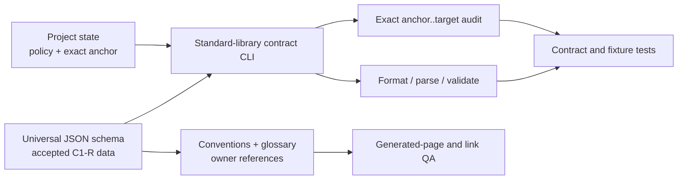

# RF — TFW-49 / Phase A: Canonical Commit Identity Contract and Validator

> **Date**: 2026-07-30
> **Author**: Executor (Codex)
> **Status**: 🟢 RF — Complete
> **Parent HL**: [Phase A HL](HL__phase-a__canonical_contract_and_validator.md)
> **Master HL**: [TFW-49](../HL-TFW-49__agent_commit_identity_and_attribution.md)
> **TS**: [TS Phase A](TS__phase-a__canonical_contract_and_validator.md)
> **Executor Attestation**: This RF states only what the Executor can support from the
> cited Proof Records and disclosed limitations. Independent REVIEW retains
> acceptance/rejection authority.

---

## 1. What Was Done

### New Files

| File | Description |
|------|-------------|
| `.tfw/commit_identity.schema.json` | Versioned universal owner for C1-R field order, registries, patterns, reserved forms, trailers, diagnostic example inputs, and truth boundary |
| `.tfw/commit_identity_state.json` | Project-owned `agent-managed` policy, matching contract version, exact prospective anchor, and explicit false hook/authentication state |
| `.tfw/scripts/commit_identity.py` | Standard-library formatter, parser, message/state validator, explicit expected-context comparator, and fail-closed exact range auditor |
| `.tfw/scripts/test_commit_identity.py` | Forty-six contract, mutation, diagnostic, staged-path/trailer, and temporary-Git topology tests |
| `phase-a/evidence/EV__phase-a__canonical_contract_and_validator.md` | Claim-typed Proof Record index and scoped Evidence rows for all ten AC |

### Modified Files

| File | Changes |
|------|---------|
| `.tfw/conventions.md` | Added the canonical Commit Identity contract, operator/origin distinctions, same-context and `task:none` boundaries, range semantics, non-claims, bypasses, and Phase B/C ownership |
| `.tfw/glossary.md` | Added one concise Commit Identity definition with schema/state/CLI owner links and the non-authentication boundary |
| `README.md` | Advanced the TFW-49 Phase A lifecycle trace to RF and linked ONB/RF |

## 2. Key Decisions and Material Deviations

1. Universal grammar data and project activation state are separate records. The
   schema remains reusable, while repository-specific history stays in project state.
2. Missing expected context is never interpreted as actor authentication. Ordinary
   C1-R can be structurally validated without expected context; reserved forms require
   supplied exact context and fail on absence or any stale field.
3. Range coverage uses the state-owned full anchor and Git object/ancestry traversal.
   It never selects a recent-count or arbitrary fallback range and never evaluates the
   anchor or earlier history.
4. The framework changed-line result is 1,307: 682 production executable, 385 tests,
   160 JSON data, and 80 human-contract documentation lines. Coordinator task
   `019fa70f-8db9-70a3-8109-c69ff35c9592` accepted the 107-line variance over the
   configured 1,200 LOC attention signal as one bounded cohesive six-consumer proof
   surface. The number is reported only as a descriptive measurement, not success
   evidence, and no metric-led split or semantic compression was introduced.

### Material Deviations

No material deviations. The accepted LOC-signal variance changes neither the six-file
framework owner boundary nor any Requirement Claim; it is recorded in §4 as a
measurement under the Coordinator's explicit execution authority.

### Transition and Removal Classification

No prior production Commit Identity owner or accepted grammar was removed. C2-R is
recorded as an unaccepted fallback description, not implemented as a version-1 branch.

## 3. Acceptance Criteria and Executor Attestation

| AC | Claimed deliverable and Executor statement | Proof Record(s) | Limitations, Value Debt, or blocked condition | Result |
|----|--------------------------------------------|-----------------|----------------------------------------------|--------|
| AC-1 | The versioned JSON schema is the single operational owner for all accepted C1-R values/patterns, field order, forms, trailers, and example inputs; fixture mutation changes executable behavior without a Python registry edit | PR-1 | Python owns loader keys, command names, and stable diagnostic-code identifiers only | [x] |
| AC-2 | Separate project state validates policy `agent-managed`, contract `1.0.0`, and full exclusive anchor `f1106186417e84cdb38e797f7af66a60885bad76`; hook runtime and actor-authentication claims remain false | PR-2 | Structural state/ancestry proof does not authenticate an actor | [x] |
| AC-3 | Formatter/parser behavior produces exact canonical `[surface/task/work/role] summary`, normalizes known entry forms, covers every registered value/work class, and rejects ambiguous or unsafe inputs | PR-3 | Version 1 accepts C1-R only | [x] |
| AC-4 | Reserved autosquash/revert forms validate only with supplied exact same four-field context; absent/stale context fails and no replay operation exists | PR-4 | Actual commit routing remains Phase B | [x] |
| AC-5 | Core fields represent the declared operator; guarded `task:none`, repeated full origins, optional metadata, and Git co-authorship remain separate and truth-preserving | PR-5 | No actor identity provider or attribution authentication is claimed | [x] |
| AC-6 | Every expected failure returns stable actionable structure without exposing arbitrary message, path, hook-like, environment, or credential-shaped sentinel content or a traceback | PR-6 | Tests use synthetic sentinels and do not read external hook bodies or real secrets | [x] |
| AC-7 | The audit inspects every exact descendant in `anchor..target`, covers merge DAGs once, excludes the anchor/prior history, and fails closed on invalid topology/history/subject while reporting no actor-authentication claim | PR-2, PR-7 | This RF can record only a pre-commit snapshot of its own eventual trace commit; the same audit is rerun after commit creation and reported before push/STOP | [x] |
| AC-8 | Schema, state, CLI, conventions, and glossary consistently define identity as searchable declared operation context—not Git authorship, actual-actor authentication, proof, attestation, Evidence status, or REVIEW—and disclose all required bypass limitations | PR-8 | Phase B routing and Phase C installation/configuration are explicitly not implemented | [x] |
| AC-9 | Documented examples execute against the JSON-owned contract, prose does not enumerate a competing registry, and generated conventions/glossary owner links and anchored content render readably without changed-content overflow | PR-1, PR-9 | Rendered observation supports documentation usability only | [x] |
| AC-10 | All and only six approved framework consumers change; contract/docs/build/scope/link/range/protected-state checks pass; no hook/config/history/workflow/adapter/global-state behavior changes | PR-7, PR-9, PR-10 | Independent REVIEW remains mandatory; TD-125 pre-existing warnings remain outside Phase A | [x] |

## 4. Verification

| # | Claim / failure protected | Command or method | Actual result | Proof Record(s) |
|---|---------------------------|-------------------|---------------|-----------------|
| V1 | Contract behavior, fixture mutation, diagnostics, temporary Git, and current-range regression | `python -m pytest .tfw/scripts/test_commit_identity.py -q` | `46 passed` | PR-1–PR-7, PR-9 |
| V2 | Existing docs generation/integration compatibility | `python -m pytest docs/scripts/test_gen_docs.py docs/scripts/test_integration.py -q` | `68 passed` | PR-9, PR-10 |
| V3 | Generated documentation and TD-125 warning boundary | `python -m mkdocs build --config-file docs/mkdocs.yml`; compare path-normalized lines beginning `WARNING [` or `WARNING -` and their unique sets against baseline commit `7740d83e6035b458a1e1f9bbbb4fd447cb4370d4` | Build exit 0. Baseline/final warning lines: `284/283`; normalized distinct warnings: `132/136`; set delta: 11 added, 7 removed, all naming only TFW-36 paths/topology; zero warning references either changed documentation consumer | PR-9, PR-10 |
| V4 | Intended rendered readability and links | Open generated `conventions/#commit-identity-and-attribution` and `glossary/#commit-identity` in the in-app browser; inspect bounded sections and layout metrics | Both headings/content visible; canonical example and operator boundary present; conventions table has 6 rendered rows; each section exposes 3 owner links; document width `1265`, client width `1265`, no horizontal overflow | PR-9, PR-10 |
| V5 | JSON validity and standard-library runtime | Parse both JSON owners with `json`; `python -m compileall -q .tfw/scripts/commit_identity.py`; import scan | JSON parse and compilation pass; imports are `argparse`, `json`, `re`, `subprocess`, `sys`, `dataclasses`, `pathlib`, and `typing` only | PR-1, PR-2, PR-10 |
| V6 | Exact six-consumer framework scope and clean patch | `git status --short`; new-file line counts; `git diff --numstat`; `git diff --check` | Four exact framework CREATE paths, two exact framework MODIFY paths, EV/RF/README lifecycle traces only; `git diff --check` passes | PR-10 |
| V7 | Exact prospective activation range before final trace commit | `python .tfw/scripts/commit_identity.py audit-range --repo .`; `git log --reverse --format=%H%x09%s f110618...HEAD` | Valid exclusive range, count 3: `642c647f91088e98c15f559c9553804433878fe6`, `d30d8deb84bd0946e3a8149b51a11c5e94515ee2`, `7740d83e6035b458a1e1f9bbbb4fd447cb4370d4`; no pre-anchor claim; `actor_authentication:false` | PR-2, PR-7 |
| V8 | Protected files, hook/runtime boundary, and history | Diff protected tracked paths from approved ONB commit; check `.tfw/hooks`; compare `HEAD` before final commit | No protected tracked diff; `.tfw/hooks` absent; pre-final-commit `HEAD` remains pushed ONB commit `7740d83...`; no Git configuration or history rewrite command executed | PR-10 |
| V9 | Single ownership and authority semantics | Registry/pattern source test; semantic scans for C2-R acceptance, actual-actor/authentication wording, owner links, bypasses, Phase B/C boundary | Fixture/schema tests pass; C2-R has `accepted:false`; all non-claims/bypasses and owner relations present; no competing parser/registry found | PR-1, PR-8, PR-9 |
| V10 | Final self-referential range closure | After creating the RF-bearing commit, rerun `audit-range --repo .` and enumerate `f110618...HEAD` before push | Required post-commit gate; result is reported to the Coordinator because the commit object cannot be cited by an artifact inside itself | PR-7, PR-10 |

### Descriptive Measurements

Changed-line counts use full physical line counts for new files and Git `numstat`
additions for the two modified framework documents. README, ONB, EV, and RF lifecycle
traces are excluded from the six-framework-consumer measurement.

| Measurement | Before | After | Delta | Method / provenance |
|-------------|-------:|------:|------:|---------------------|
| Production executable changed lines | 0 | 682 | +682 | Full `Get-Content` line count for new `.tfw/scripts/commit_identity.py` |
| Test changed lines | 0 | 385 | +385 | Full `Get-Content` line count for new `.tfw/scripts/test_commit_identity.py` |
| JSON data changed lines | 0 | 160 | +160 | Full line counts: schema 143 + state 17 |
| Human-contract documentation changed lines | 0 | 80 | +80 | `git diff --numstat`: conventions 77 + glossary 3 |
| Total framework changed lines | 0 | 1,307 | +1,307 | Sum of the four mutually exclusive categories above |
| Configured LOC attention signal variance | 1,200 | 1,307 | +107 | `.tfw/project_config.yaml` signal cited by TS/ONB; actual unified count above; measurement only |
| Framework consumers | 0 changed | 6 changed | +6 | Exact status set: four CREATE + two MODIFY |
| New / modified framework consumers | 0 / 0 | 4 / 2 | +4 / +2 | Exact approved Phase A write set |

## 5. Evidence

See [Phase A EV](evidence/EV__phase-a__canonical_contract_and_validator.md) for the
stable Proof Record index and Evidence details.

Evidence verdict: 2/10 VERIFIED, 0 DEFERRED, 0 BLOCKED, 8 N/A

No Evidence limitations beyond the boundaries stated in the linked EV and §3.

## 6. Observations (out-of-scope, not modified)

No observations. The existing TD-125 MkDocs warning corpus was compared and remains
outside the Phase A changed-consumer boundary; it is already tracked rather than
duplicated here.

## 7. Fact Candidates

No Fact Candidates.

## 8. Strategic Insights (Execution)

| # | Insight | Category | Source |
|---|---------|----------|--------|
| S1 | A configured scope number is an attention signal, not a completion target or fragmentation instruction. When one cohesive owner/proof boundary crosses it, preserve semantics and report the composition/variance; split only at an authorized value boundary. | philosophy | Coordinator task `019fa70f-8db9-70a3-8109-c69ff35c9592`, Phase A execution clarification |

## 9. Diagrams

The diagram shows ownership and proof flow only. It does not represent an installed
Git hook, actor authentication, or independent REVIEW acceptance.

---

*RF — TFW-49 / Phase A: Canonical Commit Identity Contract and Validator | 2026-07-30*
