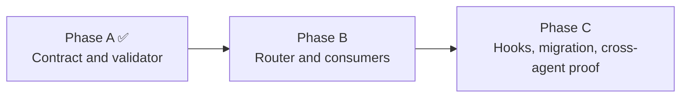

# HL — TFW-49 / Phase B: Workflow and Adapter Consumption

> **Date**: 2026-07-31
> **Author**: Coordinator (Codex)
> **Status**: ✅ HL — Approved under delegated owner authority
> **Master HL**: [TFW-49](../HL-TFW-49__agent_commit_identity_and_attribution.md)
> **Predecessor**: Phase A ✅ APPROVE and locally closed at `8e9e33089448854c1f52aeac8fb250afd1b5c2c6`
> **Knowledge gate**: PASS — current task sequence `49` minus last consolidation sequence `49` = `0`, below hard interval `5`
> **Publication**: NOT AUTHORIZED — process F26 remains binding

---

## 1. Vision

Every TFW workflow and supported agent surface can create a truthful local commit
without inventing task, work, role, or surface context. The acting adapter supplies its
registered surface; the active workflow supplies its canonical task, work slice, and
Role Lock; one operation router combines those inputs through the Phase A C1-R
contract.

Ordinary commits remain simple. Amend, fixup, squash, revert, cherry-pick, and merge
behavior no longer rely on stale inherited identity. Same-context Git-reserved forms
are narrowly preserved, while cross-context replay becomes `--no-commit`, inspection,
and a new current-operator commit with optional source provenance.

Phase B makes C1-R usable at the point of action. It does not install hooks, change Git
configuration, migrate the repository, claim actor authentication, perform final
cross-agent proof, or authorize remote publication.

**Impact:** Coordinator, Researcher, Executor, and Reviewer work produces consistent,
searchable local history across Antigravity, Claude Code, Codex, and Cursor, while
missing or conflicting context stops with an actionable correction instead of being
guessed.

> “The active workflow and adapter should make the right commit identity routine, while
> replay, publication, and unknown context remain explicit decisions.”

## 2. Current State (As-Is)

Phase A delivered and independently approved the reusable contract:

| Owner | Current result |
|-------|----------------|
| `.tfw/commit_identity.schema.json` | C1-R field order, four registered surfaces, four registered roles, canonical work classes, reserved forms, trailers, and truth boundary |
| `.tfw/commit_identity_state.json` | `agent-managed` policy, contract `1.0.0`, exact exclusive anchor `f1106186417e84cdb38e797f7af66a60885bad76`, `hook_runtime.installed:false`, `actor_authentication:false` |
| `.tfw/scripts/commit_identity.py` | Format, parse, validate, expected-context comparison, state validation, and exact anchored range audit |
| `.tfw/scripts/test_commit_identity.py` | `136` passing Phase A contract cases |
| D58 | Phase B owns operation routing and workflow/adapter consumption; Phase C owns hooks, Git configuration, migration, and cross-agent proof |
| process F26 | Local completion and local commits never authorize `git push`; TFW-49 cannot be published before all phases close and the user separately says `APPROVE PUSH` |

The contract is present, but no owned operation router or workflow/adapter consumption
layer exists. The current workflow inventory is:

| Workflow | Active C1-R role | Task source | Work mapping | Current explicit history action |
|----------|------------------|-------------|--------------|---------------------------------|
| `/tfw-plan` | `coordinator` | allocated task ID | `master` for master planning; selected `phase-*` for phase planning | none |
| `/tfw-research` | `researcher` | current task ID | `research-iter<N>` | none |
| `/tfw-handoff` | `executor` | current task ID | `master` for single-phase work or current `phase-*` | “commit and push ONB” |
| `/tfw-review` | `reviewer` | reviewed task ID | reviewed `master` or `phase-*` slice | none |
| `/tfw-resume` | `coordinator` | resumed task ID | `master` for master trace work; selected `phase-*` when writing phase HL/TS | none |
| `/tfw-docs` | `coordinator` | task whose approved result is documented | `docs` | “commit knowledge changes with the task commit” |
| `/tfw-knowledge` | `coordinator` | task whose candidate range closes, when task-scoped | `knowledge` | none |
| `/tfw-release` | `coordinator` | explicit task ID or guarded `none` | `release` | optional `git tag`, deploy, publish, notify |
| `/tfw-update` | `coordinator` | explicit task ID or guarded `none` | `update` | upstream `git clone`; not itself a current-repository commit |
| `/tfw-config` | `coordinator` | explicit task ID or guarded `none` | `config` | none |
| `/tfw-init` | `coordinator` | initialized `{PREFIX}-1` task | `init` | none |

The three current-repository history/publication action surfaces are therefore
`handoff.md`, `docs.md`, and `release.md`. The `update.md` clone is an auxiliary
upstream fetch and must not be misclassified as a C1-R commit operation.

The registered adapter inventory is:

| Surface | Canonical entry source | Installed/current-project consumer |
|---------|------------------------|------------------------------------|
| `antigravity` | `.tfw/adapters/antigravity/tfw-rules.md.template` | `.agent/rules/tfw.md` plus `.agent/workflows/tfw-*.md` |
| `claude-code` | `.tfw/adapters/claude-code/CLAUDE.md.template` | `CLAUDE.md` plus `.claude/commands/tfw-*.md` |
| `codex` | `.tfw/adapters/codex/AGENTS.md.template` and canonical `tfw-*` skills | root `AGENTS.md` managed block plus `.agents/skills/tfw-*/SKILL.md` |
| `cursor` | `.tfw/adapters/cursor/tfw.mdc.template` | `.cursor/rules/tfw.mdc` when installed; absent in this repository |

Codex’s `11/11` installed skills currently match their canonical sources.
Antigravity and Claude Code each have all 11 command copies, but only `5/11` are
currently byte-identical to their canonical workflows. Phase B must not leave
framework-owned copies with different commit-routing behavior.

## 3. Target State (To-Be)

### 3.1 Result Visualization

After Phase B, the operator sees one consistent local outcome regardless of surface:

```text
/tfw-review TFW-49 phase b
→ surface=codex
→ task=TFW-49
→ work=phase-b
→ role=reviewer
→ [codex/TFW-49/phase-b/reviewer] verify workflow consumption
```

Operation outcomes are explicit:

| Intent | Finished behavior |
|--------|-------------------|
| Ordinary or merge commit | Produce and validate a current-context C1-R subject |
| Same-context amend | Retain or reword only when all four identity fields remain true |
| Changed-context amend | Require a newly formatted current-operator identity |
| Same-context fixup/squash | Permit the schema-owned reserved nesting with exact four-field equality |
| Cross-context fixup/squash | Reject autosquash; use a normal current-operator follow-up or separately authorized unpublished rewrite |
| Cross-context revert | Apply with `--no-commit`, inspect, then create a current-operator commit; optional `TFW-Source-Commit` |
| Cross-context cherry-pick | Apply with `--no-commit`, inspect, then create a current-operator commit; optional `TFW-Source-Commit` |
| Missing or contradictory context | Stop with a stable field/rule diagnostic and complete synthetic correction |
| Push or remote publication | Stop unless separately and explicitly authorized under F26 |

The result is a local, structurally valid commit operation. It is not proof of the
actual actor, Git authorship, Evidence, RF attestation, REVIEW acceptance, or
publication authority.

### 3.2 Value Flow

```text
REGISTERED ADAPTER SURFACE
          +
ACTIVE WORKFLOW / TASK / WORK / ROLE
          +
EXPLICIT GIT OPERATION INTENT
          │
          ▼
ONE PHASE B OPERATION ROUTER
          │
          ├── ordinary / merge / amend
          ├── same-context fixup / squash
          └── explicit no-commit replay
          │
          ▼
PHASE A SCHEMA + FORMATTER + VALIDATOR
          │
          ▼
TRUTHFUL LOCAL C1-R COMMIT
          │
          ├── later Phase C hook/range proof
          └── separate human publication approval
```

The adapter supplies only its registered `surface`. It must not infer task, work, or
role. The workflow supplies the active authority and task slice. The router combines
them without becoming a second grammar or registry.

## 4. Phases

Phase B is one cohesive implementation/review cycle within the master TFW-49 task.

### Phase Dependencies



| Phase | Depends on | Shared files/owners | Can run in parallel with |
|-------|------------|---------------------|--------------------------|
| A | TFW-49 research | schema, state, validator, conventions | — |
| B | Phase A APPROVE | validator interface, 11 workflows, four adapter surfaces | — |
| C | Phase A + B APPROVE | router, schema/state, init/update consumers | — |

### Phase B: Workflow and Adapter Consumption 🟡

> **Requires:** Phase A ✅ at `8e9e33089448854c1f52aeac8fb250afd1b5c2c6`.

> **Context for coordinator:** TFW-49 master HL §4/§5/§6/§7; TFW-49 RES Iteration 1
> Recommended Architecture and Phase implications; Phase A RF §§1–4; Phase A REVIEW
> §§1–4/§6/§7; D58; process F26; the Phase A schema/state/CLI/test owners; all 11
> canonical workflows; the four adapter entry sources.

> **Key decision:** D58 establishes C1-R and assigns operation routing plus
> workflow/adapter consumption to Phase B. It reserves hooks, Git configuration,
> migration, and cross-agent proof for Phase C.

> **⚠️ Cascade dependency:** workflow cues, adapter surface declarations, canonical
> workflow copies, and router tests must move together. A partial update would make
> commit identity depend on which agent surface or stale copied workflow happened to
> execute.

**Deliverables:**

1. One operation router consumes the existing Phase A schema/state/formatter/validator
   and routes ordinary, merge, amend, fixup, squash, revert, and cherry-pick intent
   from explicit current context.
2. A complete mapping covers all 11 canonical workflows exactly as listed in §2,
   including guarded task-specific versus `task:none` lifecycle behavior.
3. Short point-of-action cues are deployed where a workflow can create a commit.
   The three existing explicit Git action surfaces are corrected:
   - `/tfw-handoff` creates a routed local ONB commit; push remains a separate F26 gate;
   - `/tfw-docs` uses the documented task’s `docs/coordinator` context;
   - `/tfw-release` separates the routed local release commit/tag decision from
     push/deploy/publish authorization.
4. `/tfw-plan`, `/tfw-research`, `/tfw-review`, `/tfw-resume`, `/tfw-knowledge`,
   `/tfw-update`, `/tfw-config`, and `/tfw-init` have resolvable context mappings even
   where they do not currently mandate a commit. No workflow gains an invented Git
   action merely to exercise C1-R.
5. Antigravity, Claude Code, Codex, and Cursor entry sources declare only their exact
   registered surface and consume the same router/workflow contract. Installed copies
   are synchronized where present; Phase B does not install the absent Cursor adapter.
6. `task:none` remains guarded: it requires explicit non-task intent, a registered
   lifecycle work value, and no staged canonical task path. Task-spanning docs or
   knowledge batches must split by task or stop for explicit authority.
7. Same-context Git-reserved forms require exact four-field equality. Cross-context
   revert/cherry-pick use `--no-commit` plus a new current-operator commit and may add
   only the schema-owned optional source/origin trailers.
8. Router and consumer verification covers valid, invalid, absent, stale, mixed-task,
   same-context, and cross-context operation cases without echoing arbitrary messages,
   paths, bodies, environment data, or credential-shaped input.
9. Phase B leaves `.tfw/commit_identity_state.json` hook state false, does not create
   `.tfw/hooks`, does not set or alter `core.hooksPath`, does not migrate history, and
   does not claim final cross-agent/runtime completeness.
10. All work and commits remain local. No push, remote tag publication, deployment, or
    other network publication occurs.

### Scope-Attention Disposition

The canonical logical consumer inventory is at least 17 existing framework owners:
the router/validator and its tests, 11 workflows, and four adapter entry sources.
Derived installed workflow/entry copies may increase the physical changed-path count.

This crosses the configured `14` files-per-phase and `12` modified-files attention
signals before lifecycle traces are counted. It is nevertheless one cohesive value
boundary: splitting by workflow or adapter would knowingly leave registered commit
producers with inconsistent provenance behavior. The Phase TS must inventory owner
files separately from derived copies, measure the final proposed files/new
files/modified files/LOC, remove unrelated cleanup, and record a bounded cohesion/proof
override rather than treating the numbers as pass/fail or hiding physical files.

## 5. Definition of Done (DoD)

- ✅ 1. One operation router consumes the Phase A C1-R owner and does not duplicate the
  grammar, registries, reserved forms, trailers, diagnostics, or truth boundary.
- ✅ 2. All 11 workflows have an exact surface/task/work/role context mapping, with no
  invented task, phase, lifecycle scope, or Role Lock.
- ✅ 3. The three explicit history-action workflows route their local Git actions and
  no longer conflate local commit completion with remote publication.
- ✅ 4. Ordinary/merge, amend, fixup, squash, revert, and cherry-pick behavior matches
  the same-context and cross-context rules in D58 and the master HL.
- ✅ 5. Cross-context revert/cherry-pick use `--no-commit`, inspection, and a new
  current-operator commit; stale source identity is never retained as the operator.
- ✅ 6. Antigravity, Claude Code, Codex, and Cursor supply their exact registered
  surface and consume the same workflow/router contract without embedding another
  accepted-value registry.
- ✅ 7. Guarded `task:none`, mixed-task batches, optional origins/source trailers, and
  role aliases such as release “Maintainer” fail or normalize only through explicit
  approved authority; no new C1-R role is invented.
- ✅ 8. Missing/stale context and unsafe operation combinations fail with stable,
  actionable, secret-safe diagnostics and a complete synthetic correction.
- ✅ 9. Applicable contract, workflow mapping, adapter parity, docs, and bounded
  operation-fixture checks pass and are indexed in Phase B Proof Records.
- ✅ 10. Hook runtime remains uninstalled, Git configuration/history remain unchanged
  except authorized local C1-R commits, Phase C proof remains open, and no remote
  publication occurs.

## 6. Definition of Failure (DoF)

- ❌ 1. Any of the 11 workflows or four registered surfaces lacks a resolvable mapping
  or can silently choose a free-form task/work/role.
- ❌ 2. A second grammar, registry, reserved-form parser, trailer vocabulary, or truth
  boundary is embedded in a workflow, adapter, or router.
- ❌ 3. An adapter supplies or guesses task, work, or role instead of only its registered
  surface.
- ❌ 4. A workflow derives task or phase from branch name, staged prose, directory
  coincidence, or prior commit identity when current authority is absent.
- ❌ 5. Changed-context amend, fixup, squash, revert, cherry-pick, or merge preserves a
  stale operator/task/work identity.
- ❌ 6. Cross-context autosquash is permitted, or cross-context replay bypasses the
  required `--no-commit` plus current-operator commit flow.
- ❌ 7. `task:none` passes while a canonical task path is staged, or a multi-task batch
  is hidden in one lifecycle identity.
- ❌ 8. Handoff, docs, or release treats commit/task/phase completion as authorization
  to push, publish, deploy, or notify.
- ❌ 9. Phase B installs hooks, changes `core.hooksPath`, repairs hook runtime through
  init/update, migrates history, rewrites prior commits, or claims Phase C’s final
  cross-agent proof.
- ❌ 10. A structurally valid subject is represented as actor authentication, Git
  authorship, Proof, RF attestation, Evidence status, REVIEW acceptance, or
  publication authority.
- ❌ 11. Adapter synchronization overwrites unrelated project instructions or skills,
  installs the absent Cursor adapter, or absorbs unrelated legacy cleanup.

**On failure:** stop the affected operation or phase, preserve repository and Git
configuration state, record the exact missing/conflicting context and affected
consumer, and return to the Coordinator. Do not bypass the router or publish merely to
complete an RF.

## 7. Principles

1. **One contract, one router** — Phase A owns C1-R; Phase B owns one operation path
   that consumes it.
2. **Context is supplied, never guessed** — surface comes from the adapter; task, work,
   and role come from active workflow authority.
3. **Point-of-action enforcement** — a commit-producing action carries a short complete
   imperative and observable router result, not a passive remote reference.
4. **Current operator wins** — replayed content may cite its source, but the subject
   identifies the operation that creates the new commit.
5. **Same-context convenience only** — amend/autosquash convenience is retained only
   while all four fields remain true.
6. **Publication is separate authority** — local commit, tag preparation, lifecycle
   completion, and review do not authorize push or deployment.
7. **Adapters declare surface, not semantics** — behavioral parity does not require
   duplicated grammar or workflow logic.
8. **No action inflation** — workflows without an actual Git action receive a mapping
   but do not gain artificial commits.
9. **Phase ownership stays visible** — Phase B stops before hooks, Git configuration,
   migration, and final cross-agent proof.
10. **Honest provenance boundary** — structural identity remains searchable declared
    context, never actual-actor authentication.

### 7.1 Quality Contract

- Every workflow map names a registered role and an exact work-selection rule.
- `release` uses registered C1-R role `coordinator`; “Maintainer” does not create an
  unregistered role value.
- `/tfw-init` uses the initialized first task plus `work:init`; it cannot use
  `task:none` while creating a canonical task path.
- Task-scoped docs and knowledge use that task ID. Batch/mixed-task work splits or
  stops; it does not compress several tasks into `none`.
- Adapter entry sources may declare only their schema-registered surface.
- Examples and corrections come from the Phase A formatter/schema.
- Arbitrary commit messages, paths, hook bodies, environment dumps, and
  credential-shaped values are never echoed in diagnostics.
- Optional `TFW-Content-Origin` repeats all four fields; `TFW-Source-Commit` records a
  source object without replacing current operator identity.
- Local tag creation, remote tag publication, push, deploy, publish, and notify remain
  separate actions with separate authority checks.
- No permanent hook, Git config, init/update hook lifecycle, migration, hosted
  authentication, or final cross-agent claim enters Phase B.

### 7.2 Knowledge Citations

| # | Source | Item | How it applies |
|---|--------|------|----------------|
| 1 | [.tfw/README.md](../../../.tfw/README.md#traces-over-code) | Traces Over Code | Workflow Git actions must connect local history to the same task/role traces. |
| 2 | [.tfw/README.md](../../../.tfw/README.md#honesty-over-convincingness) | Honesty Over Convincingness | Unknown context must fail rather than produce plausible false provenance. |
| 3 | [.tfw/README.md](../../../.tfw/README.md#structural-enforcement) | Structural Enforcement | Commit-producing actions need an observable point-of-action consumer. |
| 4 | [.tfw/README.md](../../../.tfw/README.md#single-source-of-truth) | Single Source of Truth | Workflows, adapters, and the router consume the Phase A owner rather than restating it. |
| 5 | [KNOWLEDGE.md](../../../KNOWLEDGE.md) | D54 | Four adapter surfaces provide behavioral parity through thin, progressively loaded consumers. |
| 6 | [KNOWLEDGE.md](../../../KNOWLEDGE.md) | D55 | Rule locality follows consequence and observability; role/authority boundaries remain complete locally. |
| 7 | [KNOWLEDGE.md](../../../KNOWLEDGE.md) | D57 | A commit identity is provenance, not a Proof Record, RF attestation, Evidence status, or review result. |
| 8 | [KNOWLEDGE.md](../../../KNOWLEDGE.md) | D58 | Phase B owns routing and consumption; Phase C owns hooks, Git configuration, migration, and cross-agent proof. |
| 9 | [.tfw/conventions.md](../../../.tfw/conventions.md#rule-record-and-rule-deployment) | Rule Deployment | Deploy short cues only where action and observability require them. |
| 10 | [.tfw/conventions.md](../../../.tfw/conventions.md#commit-identity-and-attribution) | Commit Identity and Attribution | Same-context reserved forms, explicit replay, guarded `task:none`, trailers, diagnostics, and non-claims govern Phase B. |
| 11 | [.tfw/conventions.md](../../../.tfw/conventions.md#15-role-lock-protocol) | Role Lock Protocol | C1-R role must equal the active workflow authority. |
| 12 | [knowledge/convention.md](../../../knowledge/convention.md) | F4 | A reference works only when an algorithmic step consumes it; router invocation supplies that step. |
| 13 | [knowledge/process.md](../../../knowledge/process.md) | F26 | Push and remote publication require later explicit user approval and remain unavailable for TFW-49 until all phases close. |

## 8. Dependencies

| Dependency | Status |
|------------|--------|
| TFW-49 Iteration 1 research | ✅ SUFFICIENT; no new decision-changing research gap |
| Phase A schema/state/CLI/tests | ✅ Delivered and approved |
| Phase A local lifecycle closure | ✅ `8e9e33089448854c1f52aeac8fb250afd1b5c2c6` |
| D58 Phase B ownership | ✅ Canonical |
| process F26 publication boundary | ✅ Binding |
| Eleven canonical workflows | ✅ Inventoried |
| Four registered adapter surfaces | ✅ Inventoried |
| Cursor live adapter | N/A — not installed; source template only in Phase B |
| Phase C hook/config/migration proof | ⬜ Deferred by phase boundary |
| Remote publication authority | ❌ Unavailable |

## 9. Risks

| Risk | Probability | Impact | Mitigation |
|------|-------------|--------|------------|
| Workflow-to-work mapping drifts when a workflow is added or renamed | Medium | High | Verify exact parity with the 11-command workflow registry and fail on an unmapped command. |
| `task:none` hides task-scoped or multi-task changes | Medium | High | Preserve staged task-path guard; split batches or require explicit task authority. |
| Release “Maintainer” is emitted as an unregistered role | Medium | Medium | Map the current workflow authority to registered `coordinator`; do not extend the role registry. |
| Adapter supplies stale or wrong surface | Medium | High | Exact per-adapter declaration plus schema validation and parity checks. |
| Automatic Git operation retains source identity | High | High | Same-context equality gate; cross-context `--no-commit` and current-operator commit. |
| Handoff’s existing push step violates F26 | High | High | Separate local commit from remote publication and require explicit approval. |
| Derived Claude/Antigravity copies drift from canonical workflows | High | Medium | Treat copy parity as one proof obligation and update only framework-owned copies. |
| Large physical copy set obscures the logical owners | High | Medium | Report logical owners and derived copies separately; use a bounded scope-attention override. |
| Router grows into Phase C hook/config management | Medium | High | Assert `hook_runtime.installed:false`, no `.tfw/hooks`, and unchanged Git config as protected proof. |
| Passing local fixtures is represented as final cross-agent proof | Medium | High | Keep Phase B attestation local; reserve runtime/platform/client proof for Phase C. |
| Local tag or lifecycle completion is mistaken for publication | Medium | High | Separate commit, tag, push, deploy, publish, and notify authority in workflow wording and proof. |

## 10. RESEARCH Case

### Blind Spots

No unresolved information gap is likely to change the Phase B approach. TFW-49
Iteration 1 already compared operation semantics, replay, autosquash, context truth,
adapter surfaces, hook layers, and lifecycle boundaries. Phase A then implemented and
reviewed the selected C1-R contract.

Remaining questions are implementation and proof choices:

- the router’s internal command/API shape;
- the smallest valid placement of workflow cues under Rule Deployment;
- exact derived-copy mechanics and final LOC/path measurements.

Those choices are adaptable Technical Guidance for the Phase TS/Executor and can be
resolved against the existing repository without another comparative research
procedure.

### Hypotheses

No open decision-changing hypothesis. The applicable prior hypotheses H1–H6 already
have supported, revised, or refuted dispositions in TFW-49 RES Iteration 1.

### Risks of Not Researching

No new research risk is identified. The material risk is incomplete implementation or
proof against the already established contract, not lack of another architecture
comparison.

### Proposed RESEARCH Focus

N/A — recommend skipping a new research iteration. Reopen `/tfw-research` only if
ONB or implementation exposes a material contradiction in the Phase A interface or a
new operation class that would change the routing architecture.

### Why Not Just...?

- Why not rely on the future hook? — Phase C owns hook installation, and hooks remain
  bypassable visibility mechanisms rather than context owners.
- Why not duplicate the grammar in every workflow? — That would create eleven drifting
  contracts and violate D58’s single-owner boundary.
- Why not let adapters infer everything? — An adapter knows its surface, not the
  current task, work slice, or Role Lock.
- Why not preserve source identity during replay? — The source describes content
  provenance; the new subject must describe the current commit operation.
- Why not push after each workflow commit? — F26 makes remote publication a separate
  explicit human approval boundary.

**Recommendation:** skip new RESEARCH and proceed, after HL approval, to a Phase B TS.

## 11. Strategic Insights (Planning)

| # | Insight | Planning implication | TS disposition / destination | Category | Source |
|---|---------|----------------------|------------------------------|----------|--------|
| S1 | Phase B must map all 11 TFW workflows and all four registered agent surfaces through one operation router | Treat workflow and adapter coverage as one coherent value boundary; do not implement a subset that makes provenance surface-dependent | Scope; AC for complete workflow/adapter mapping and parity | convention | User/Coordinator Phase B direction, 2026-07-31 |
| S2 | Ordinary, amend, fixup, squash, revert, and cherry-pick require explicit truthful behavior; cross-context replay uses `--no-commit` and a current-operator commit | Operation semantics are acceptance-critical, not optional guidance | AC and DoF for operation matrix; router Technical Guidance | convention | User/Coordinator Phase B direction; TFW-49 RES |
| S3 | Permanent hooks, `core.hooksPath`, init/update hook lifecycle, migration, and final cross-agent proof belong to Phase C | Phase B may map `/tfw-init` and `/tfw-update` commit context but must not implement their hook lifecycle | Scope exclusion; DoF; Phase C handoff | architecture | User/Coordinator Phase B direction; D58 |
| S4 | Publication remains unavailable even after local Phase B completion | Replace unconditional push language and keep every action local until full TFW-49 closure plus separate `APPROVE PUSH` | F26 gate in handoff/release consumers; Phase B DoF 8/10 | process | User direction consolidated as process F26 |
| S5 | No additional research should run unless a genuinely decision-changing contradiction appears | Existing research is sufficient; use implementation proof rather than another iteration for resolved operation semantics | RESEARCH decision: skip; reopen only on named contradiction | process | User/Coordinator Phase B direction, 2026-07-31 |

---

*HL — TFW-49 / Phase B: Workflow and Adapter Consumption | 2026-07-31*
