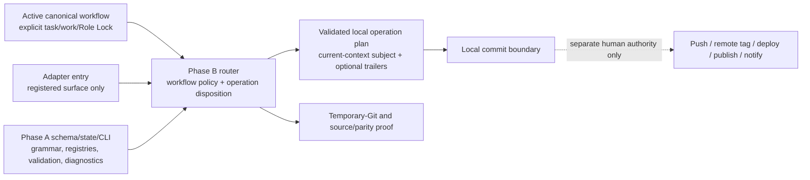

# RF — TFW-49 / Phase B: Workflow and Adapter Consumption

> **Date**: 2026-07-31
> **Author**: Executor (Codex)
> **Status**: 🟢 RF — Complete
> **Parent HL**: [Phase B HL](HL__phase-b__workflow_and_adapter_consumption.md)
> **TS**: [Phase B TS](TS__phase-b__workflow_and_adapter_consumption.md)
> **Master HL**: [TFW-49](../HL-TFW-49__agent_commit_identity_and_attribution.md)
> **Executor Attestation**: This RF states only what the Executor can support from the
> cited Proof Records and disclosed limitations. Independent REVIEW retains
> acceptance/rejection authority.
> **Publication boundary**: Local commit only. No push, remote tag, deploy, publish,
> notify, network publication, or host escalation is authorized.

---

## 1. What Was Done

### New Files

| File | Description |
|------|-------------|
| `.tfw/scripts/commit_identity_router.py` | Standard-library Phase B workflow/context and local Git-operation planner consuming the Phase A contract |
| `.tfw/scripts/test_commit_identity_router.py` | Exhaustive router, temporary-Git, diagnostics, workflow, adapter, parity, and protected-boundary proof |
| `tasks/TFW-49__agent_commit_identity_and_attribution/phase-b/evidence/EV__phase-b__workflow_and_adapter_consumption.md` | Claim-typed `PR-B1`–`PR-B8` evidence index |
| `tasks/TFW-49__agent_commit_identity_and_attribution/phase-b/RF__phase-b__workflow_and_adapter_consumption.md` | Executor attestation and independent-review handoff |

### Modified Files

| File | Changes |
|------|---------|
| `.tfw/workflows/handoff.md` | Replaced ONB commit/push coupling with routed local commits and a separate F26 publication gate |
| `.tfw/workflows/docs.md` | Made the commit-time Coordinator Role Lock explicit and routed task-specific `docs` commits |
| `.tfw/workflows/release.md` | Routed registered `release/coordinator` commits and separated local tag decisions from every remote action |
| `.tfw/adapters/antigravity/tfw-rules.md.template` | Declared only the registered `antigravity` surface and thin router consumption |
| `.tfw/adapters/claude-code/CLAUDE.md.template` | Declared only the registered `claude-code` surface and thin router consumption |
| `.tfw/adapters/codex/AGENTS.md.template` | Declared only the registered `codex` surface inside the managed behavior block |
| `.tfw/adapters/cursor/tfw.mdc.template` | Declared only the registered `cursor` surface without installing a live Cursor consumer |
| `.agent/rules/tfw.md` | Synchronized the installed Antigravity entry behavior |
| `CLAUDE.md` | Synchronized the installed Claude Code entry behavior while preserving surrounding project instructions |
| `AGENTS.md` | Synchronized only the root TFW-managed Codex block |
| `.agent/workflows/tfw-{docs,handoff,init,knowledge,plan,release,research,update}.md` | Restored the eight approved Antigravity copies to their exact canonical sources |
| `.claude/commands/tfw-{docs,handoff,init,knowledge,plan,release,research,update}.md` | Restored the eight approved Claude Code copies to their exact canonical sources |
| `tasks/TFW-49__agent_commit_identity_and_attribution/phase-b/ONB__phase-b__workflow_and_adapter_consumption.md` | Corrected only generated-site citation targets after the warning comparison exposed source-relative MkDocs links; no approved decision or scope text changed |
| `README.md` | Advanced only the TFW-49 lifecycle row to RF (B) and linked this RF |

The exact framework implementation set is the TS-approved 28 paths: 2 CREATE and
26 MODIFY. The ONB/EV/RF and one README row are Executor lifecycle traces, not added
framework consumers.

## 2. Key Decisions and Material Deviations

1. Phase B uses one separate router that imports the unchanged Phase A module. The
   router owns only the 11-workflow policy and seven operation dispositions; schema,
   state, grammar, accepted registries, normalization, trailers, diagnostics, and
   range truth remain Phase A-owned.
2. Workflow policy records resolve accepted roles and fixed lifecycle work values
   from the schema rather than copying accepted strings into production Python.
   Mutation tests prove the relation fails or changes when the owner changes.
3. Operation comparison uses the public context-required Phase A parser. A guarded
   `task:none` source is compared with explicit synthetic staged-path authority; the
   private structural-only range-audit path is never used for routing.
4. The eight approved Antigravity and eight Claude files were synchronized
   mechanically from their canonical workflow owners. Already exact config/review/
   resume copies, all Codex skills, Cursor live state, and legacy `tfw-task.md` files
   were verification-only.
5. Rendered documentation is treated as local Seam QA, not cross-agent or hosted
   Evidence. Phase C remains the owner for permanent hooks, client/platform execution,
   and final cross-agent proof.

### Material Deviations

| # | Source requirement or guidance | Actual choice | Rationale | Affected claim / Proof Record | Authority |
|---|--------------------------------|---------------|-----------|-------------------------------|-----------|
| D1 | TS §4 descriptive estimate: 2,100–2,700 changed framework lines | Final exact 28-consumer implementation measures 3,160 changed lines, 460 above the estimate | Complete temporary-Git same/cross operation fixtures and exact canonical-copy restoration are part of the approved cohesive owner/proof boundary. Semantic compression or fragmentation would weaken AC-2/AC-5 while changing no owner or path scope | AC-2, AC-5, AC-6 / PR-B3, PR-B6, PR-B7; measurement only, no acceptance quota | Coordinator accepted the checkpoint variance as a descriptive scope-attention outcome and directed completion of the scenario matrices within the same 28 paths |
| D2 | ONB recommendation 5 required planning-baseline/final warning equality | Changed only the ONB's Markdown link destinations from source-relative owner paths to their generated MkDocs counterparts | The first comparison attributed 11 added normalized warnings solely to ONB citations, not framework consumers. Correct generated targets restore `0 added / 0 removed` without changing citation meaning, decisions, or approved scope | AC-6 / PR-B7 | Executor-owned ONB lifecycle scope approved by the Coordinator; deterministic regression correction |

No acceptance-critical requirement, semantic owner, or write-path scope changed.

### Transition and Removal Classification

| # | Former behavior/content | Classification | Current owner or stronger relation |
|---|-------------------------|----------------|------------------------------------|
| R1 | Handoff phrase “Commit and push ONB” | Obsolete coupling | Routed local ONB/completion commit plus separate F26 publication authority |
| R2 | Docs could carry Reviewer prose into commit-time authority | Replaced by precise role boundary | Active docs commit uses registered `coordinator`; review and docs responsibility remain separate |
| R3 | Release named “Maintainer” at the commit action boundary and mixed local/remote actions | Replaced by precise role/authority relation | Registered `coordinator` routes the local commit; local tag, remote tag, push, deploy, publish, and notify are separately authorized |
| R4 | Six pre-existing drifted derived copies per installed command surface | Replaced by stronger structural relation | All 11 Antigravity and all 11 Claude workflow copies are byte-exact with canonical owners |

## 3. Acceptance Criteria and Executor Attestation

| AC | Claimed deliverable and Executor statement | Proof Record(s) | Limitations, Value Debt, or blocked condition | Result |
|----|--------------------------------------------|-----------------|----------------------------------------------|--------|
| AC-1 | One standard-library router consumes unchanged Phase A owners and resolves the exact 11-workflow × 4-surface map without duplicated accepted registries/grammar or action inflation | PR-B1, PR-B2 | Phase A owns accepted semantic values; Phase B owns only workflow/operation policy | [x] |
| AC-2 | All seven local Git-operation intents produce a validated current-context plan or fail closed under exact same/cross-context rules; cross-context replay requires `--no-commit` and a current-operator commit | PR-B3 | The router plans but does not execute current-repository Git operations; representative client execution is Phase C | [x] |
| AC-3 | Missing, stale, contradictory, mixed-task, non-task, target/source, and unsafe inputs fail with stable secret-safe correction and no guessed context | PR-B4 | Synthetic canaries are used; no external hook body or real secret was accessed | [x] |
| AC-4 | Only handoff, docs, and release consume router action cues; each separates local completion from F26 publication authority | PR-B2, PR-B5 | No publication action is performed or authorized | [x] |
| AC-5 | Four adapter owners declare only their registered surface; installed entries and all canonical workflow/skill copies satisfy the approved parity and absent-path boundaries | PR-B6 | Final representative cross-agent execution remains Phase C and is not claimed | [x] |
| AC-6 | Full regressions, warning/render checks, exact scope, protected state, exclusive-anchor audit, and no-publication boundary pass without changing Phase A/config/hook/history truth | PR-B7 | TD-125's unchanged warning corpus remains outside this phase; no actor authentication is claimed | [x] |
| AC-7 | ONB, EV, RF, local C1-R completion commit, and the single Task Board row accurately trace local completion and stop before independent REVIEW | PR-B8 | The RF cannot contain its own later commit OID; the post-commit range/protected-state result is reported to the Coordinator before STOP | [x] |

## 4. Verification

| # | Claim / failure protected | Command or method | Actual result | Proof Record(s) |
|---|---------------------------|-------------------|---------------|-----------------|
| V1 | Phase A owner behavior and complete Phase B router behavior | `python -m pytest .tfw/scripts/test_commit_identity.py .tfw/scripts/test_commit_identity_router.py -q` | `285 passed`: unchanged Phase A `136` plus Phase B `149` | PR-B1–PR-B4, PR-B6, PR-B7 |
| V2 | Existing documentation generation/integration compatibility | `python -m pytest docs/scripts/test_gen_docs.py docs/scripts/test_integration.py -q` | `68 passed` | PR-B5–PR-B7 |
| V3 | Identical-input generated documentation and TD-125 warning boundary | In isolated local copies, check out baseline `95f95c730e4365606cb5b1aafc796cdf1fd6ae21` and the final source tree; run identical `python -m mkdocs build --config-file docs/mkdocs.yml`, retain logical records beginning `WARNING [` or `WARNING -`, normalize clone roots/path separators/whitespace, sort unique, and compare sets | Both builds exit 0. Baseline/final warning records `294/294`; normalized distinct records `139/139`; `0 added / 0 removed`. The initial final build's 11 added records were all ONB generated-link targets and were corrected as D2 | PR-B5, PR-B7 |
| V4 | Rendered point-of-action usability and authority boundaries | Serve the final isolated site locally and inspect `reference/workflows/{handoff,docs,release}/` in the in-app browser | All three headings and exact router cues render. Handoff shows approval/F26/STOP and lacks former commit/push coupling; docs shows task split and publication separation; release shows guarded `task:none`, `APPROVE PUSH`, and distinct remote actions. Each page has `scrollWidth=clientWidth=1265` | PR-B5, PR-B7 |
| V5 | Exact map, operation, context, diagnostics, and trailer matrices | Phase B pytest parametrization plus CLI `describe`/`route` smoke runs | 11 workflows × 4 surfaces resolve; seven operations cover same context in temporary Git, five context-sensitive operations cover cross context, and all four mismatch fields/guard/failure/trailer branches pass. CLI returns `publication_authority:false`, `hook_runtime_installed:false`, and `actor_authentication:false` | PR-B1–PR-B4 |
| V6 | Adapter declarations and installed-copy parity | Byte comparisons and managed-block/surface/path tests | Antigravity `11/11`, Claude `11/11`, Codex skills `11/11`; four exact template surfaces; installed entry behavior matches; Cursor absent; legacy copies unchanged | PR-B6 |
| V7 | Exact approved write inventory and patch hygiene | Compare `git diff --name-only` plus untracked files to the 28-path allowlist; exclude only ONB/EV/RF/README lifecycle traces; `git diff --check` | Exactly 28/28 framework paths: 2 CREATE, 26 MODIFY; no 29th framework path; patch whitespace check passes | PR-B7, PR-B8 |
| V8 | Protected owners/config/hooks/remote state | Baseline/current diffs and hashes; path/presence checks; local/global hook value presence plus non-reversible hash only; remote-ref OID and ahead/behind comparison | Phase A schema/state/CLI/tests and config/template have zero changes. `.tfw/hooks` and live Cursor are absent; local `core.hooksPath` is unset; protected global entry count/hash and `.git/config` hash are unchanged. `origin/master` remains `b4c0a06dc9fbc104c5b8997865b6df3211bd5c0c`; no remote mutation occurred | PR-B7 |
| V9 | Exact prospective activation range and non-authentication boundary | `python .tfw/scripts/commit_identity.py audit-range --repo .`; enumerate `f110618...HEAD` | Pre-final-commit range is valid for exactly 12 exclusive descendants through ONB commit `0006a6b...`; output states `actor_authentication:false`. The same exact audit is rerun after the final local commit | PR-B7, PR-B8 |
| V10 | EV/RF structure and independent-review stop | Template heading scan; `PR-B1`–`PR-B8` and AC/Evidence mapping; Task Board/RF link; routed completion subject; post-commit clean/range/state checks | All mandatory sections and records are present; Evidence verdict is `0/7 VERIFIED, 0 DEFERRED, 0 BLOCKED, 7 N/A`; Phase C/review/publication remain unstarted. Final self-referential commit result is reported after commit creation | PR-B8 |

### Descriptive Measurements

Changed-line counts use physical line counts for the two new framework files and Git
`numstat` additions plus deletions for every modified framework consumer. ONB, EV, RF,
and README lifecycle traces are excluded. The four categories are mutually exclusive.

| Measurement | Before | After | Delta | Method / provenance |
|-------------|-------:|------:|------:|---------------------|
| Production router changed lines | 0 | 719 | +719 | Full physical lines in new `.tfw/scripts/commit_identity_router.py` |
| Router test changed lines | 0 | 1,066 | +1,066 | Full physical lines in new `.tfw/scripts/test_commit_identity_router.py` |
| Canonical workflow owners and derived copies | 0 | 1,296 | +1,296 | Git `numstat` additions + deletions for 3 canonical and 16 approved derived workflow files |
| Adapter entry owners/consumers | 0 | 79 | +79 | Git `numstat` additions + deletions for 4 templates and 3 installed entry consumers |
| Total framework changed lines | 0 | 3,160 | +3,160 | Sum of the four categories |
| TS estimate upper-bound variance | 2,700 | 3,160 | +460 | Descriptive comparison only; D1 records the cohesive proof/synchronization composition |
| Framework consumers | 0 changed | 28 changed | +28 | Exact allowlist/status set |
| New / modified framework consumers | 0 / 0 | 2 / 26 | +2 / +26 | Exact approved Phase B write set |

## 5. Evidence

See [Phase B EV](evidence/EV__phase-b__workflow_and_adapter_consumption.md) for the
Proof Record index and Evidence details.

Evidence verdict: 0/7 VERIFIED, 0 DEFERRED, 0 BLOCKED, 7 N/A

No Evidence limitations beyond the local/Seam and explicit Phase C boundaries stated
in the linked EV and §3.

## 6. Observations (out-of-scope, not modified)

No observations. The unchanged TD-125 MkDocs warning corpus remains tracked outside
this phase rather than being duplicated here.

## 7. Fact Candidates

No Fact Candidates.

## 8. Strategic Insights (Execution)

| # | Insight | Category | Source |
|---|---------|----------|--------|
| S1 | Growth inside a fixed semantic-owner and proof boundary is a scope-attention measurement, not automatically a scope expansion. When the extra lines complete an explicitly required scenario matrix, preserving the proof is more important than compressing or fragmenting the implementation to match an estimate. | philosophy | Coordinator checkpoint, task `019fa70f-8db9-70a3-8109-c69ff35c9592`, 2026-07-31 |

## 9. Diagrams

---

*RF — TFW-49 / Phase B: Workflow and Adapter Consumption | 2026-07-31*
