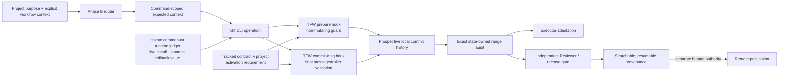
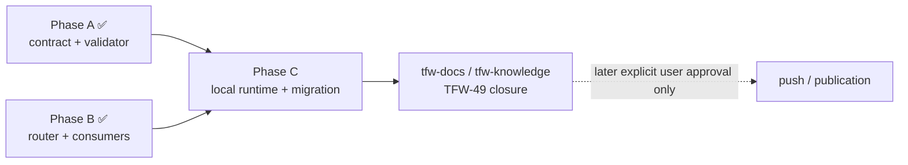

# HL — TFW-49 / Phase C: Repository-Local Enforcement, Migration, and Cross-Agent Proof

> **Date**: 2026-07-31
> **Author**: Coordinator (Codex)
> **Status**: 📝 HL_DRAFT — Awaiting review
> **Master HL**: [TFW-49](../HL-TFW-49__agent_commit_identity_and_attribution.md)
> **Research**: [Iteration 1 RES](../research/iter1/RES.md) — SUFFICIENT
> **Predecessors**: [Phase A RF](../phase-a/RF__phase-a__canonical_contract_and_validator.md) /
> [APPROVE REVIEW](../phase-a/REVIEW__phase-a__canonical_contract_and_validator.md);
> [Phase B RF](../phase-b/RF__phase-b__workflow_and_adapter_consumption.md) /
> [APPROVE REVIEW](../phase-b/REVIEW__phase-b__workflow_and_adapter_consumption.md)

---

## 1. Vision

TFW Commit Identity becomes an actual repository-local operating contract rather than
only a formatter, validator, and operation plan. A TFW-managed project can install,
verify, repair, and exactly roll back its own portable hook runtime without reading,
executing, copying, fingerprinting, revealing, or mutating any external/global hook.
The active workflow supplies explicit context command-locally; the hooks validate the
message but never invent or persist an operator identity.

The current repository adopts that runtime prospectively while preserving its exact
last-pre-policy commit. New projects receive clean project state from a template:
unborn history has no fabricated anchor and begins with root-inclusive audit semantics;
existing history receives an explicit last-pre-policy anchor. Updates never overwrite
project activation state or clone-local installation state.

Independent Executor and Reviewer Codex sessions make and audit real local Phase C
commits. Isolated fixtures cover every registered surface and role across the declared
Windows and Ubuntu WSL Git/Python boundary. The result remains honest: it is structural
declared provenance for TFW-routed Git CLI work, not authenticated actor identity and
not proof that GUI, IDE, JGit, Cursor, hosted, Claude, or Antigravity clients executed.

**Impact:** Agents and the user can search the history by task, phase/work slice,
surface, and role; invalid or stale context fails at the action boundary; init/update
can reproduce or repair the contract safely in each repository; review and release
cannot accept a convenient partial history range; and no phase completion silently
authorizes remote publication.

> “I can see which TFW role produced each local result, reproduce the exact policy
> boundary, and roll the repository back without exposing or changing my other hooks.”

## 2. Current State (As-Is)

### 2.1 Phase A and Phase B are complete but deliberately stop before enforcement

| Owner / consumer | Actual state after APPROVE |
|------------------|----------------------------|
| `.tfw/commit_identity.schema.json` | C1-R contract `1.0.0`; one grammar/registry owner; only `exclusive-anchor` is registered |
| `.tfw/commit_identity_state.json` | Project-owned `agent-managed` state; exact `f1106186417e84cdb38e797f7af66a60885bad76`; `hook_runtime.installed:false` |
| `.tfw/scripts/commit_identity.py` | Standard-library format/parse/validate and exact exclusive anchored range audit |
| `.tfw/scripts/commit_identity_router.py` | Standard-library planner for 11 workflows, four registered surfaces, and seven local operation classes; it does not execute Git |
| Canonical workflows and installed copies | Explicit context and action-local routing are implemented; permanent hook/config lifecycle remains excluded |
| D58 / D59 | Separate the schema/state/validator from the router and reserve hook installation, Git configuration, migration, and cross-agent proof for Phase C |
| Phase A / B independent reviews | APPROVE; all local contract, router, parity, range, and non-publication claims reproduced |

The current tracked state contains a clone-local-looking boolean
`hook_runtime.installed:false`. Phase A intentionally required that value, so it cannot
truthfully represent Phase C or a downstream clone. The same validator also requires a
full 40-character anchor, which would copy this starter repository's history boundary
into a new project if the state file were treated as reusable framework content.

### 2.2 The runtime and lifecycle owners do not exist

| Required capability | Current observation |
|---------------------|---------------------|
| Project-state template | Absent |
| TFW-owned hook manifest/runtime | `.tfw/hooks` absent |
| Install/verify/repair/rollback executable | Absent |
| Private clone-local installation ledger | Absent |
| Repository-local `core.hooksPath` | Unset in this working repository |
| Fresh/unborn root-inclusive audit | Unsupported |
| Command-scoped hook expected context | Router does not yet emit/transport it |
| Mandatory independent range gate in handoff/review/release | Not implemented |
| Actual post-install cross-session commits | Not yet observed |

The effective global/external hook topology is outside the safe corpus. Phase C neither
needs nor receives permission to inspect it. Only the presence or absence of a
repository-local `core.hooksPath` override is in scope; any prior local value may be
captured opaquely in private rollback state but never printed or resolved.

### 2.3 Supported environment is available; client claims remain narrow

| Boundary | Planning observation | Target claim |
|----------|----------------------|--------------|
| Windows | Git `2.42.0.windows.1`, Python `3.13.5` | Supported and exercised |
| Ubuntu WSL | Git `2.43.0`, Python `3.12.3` | Supported and exercised in isolated repositories |
| Real agent operation | Independent Codex Coordinator/Executor/Reviewer sessions are available | Codex + TFW-routed Git CLI only |
| Registered surfaces | `antigravity`, `claude-code`, `codex`, `cursor` | All four covered synthetically as contract values |
| Antigravity / Claude | Canonical installed workflow copies exist | Structural source/copy parity only unless genuinely exercised |
| Cursor | No live installation | Explicitly absent and unsupported |
| GUI / IDE / JGit / hosted identity | Not exercised | Explicit non-claims |

### 2.4 Publication remains unavailable

The local branch is ahead of `origin/master`; the remote still points to
`b4c0a06dc9fbc104c5b8997865b6df3211bd5c0c`. Process F26 is binding: local commits,
phase completion, review, docs, knowledge, and full task completion do not authorize
`git push`. Phase C must remain completely local; later publication requires a separate
explicit user `APPROVE PUSH`.

## 3. Target State (To-Be)

### 3.1 Result Visualization

Six months after Phase C, a project initialized or updated from TFW has one visible,
portable repository-local Commit Identity runtime:

| Scenario | Finished behavior |
|----------|-------------------|
| New unborn repository | Init creates project state from the clean template with `last_pre_policy_commit:null` and `root-inclusive`; installation may be verified before a first commit, but range acceptance makes no commit claim until a target exists |
| New project with existing history | Init derives a project-owned full last-pre-policy commit and uses `exclusive-anchor`; no starter-repository anchor is copied |
| This repository | Keeps exact `f1106186417e84cdb38e797f7af66a60885bad76`, installs the recognized TFW runtime, and audits every exclusive descendant |
| Ordinary routed commit | Router supplies complete `surface/task/work/role` command-locally; prepare and final validation agree with the canonical contract |
| Missing expected context | Prepare performs structural validation only and reports that exact comparison was unavailable; it never infers or authenticates the operator |
| Partial or malformed expected context | Commit fails with a stable correction; no fallback identity is invented |
| Cross-context replay | Phase B's explicit `--no-commit` plus current-operator re-commit/source-trailer route is preserved |
| Existing repository-local hook override | Its opaque value is stored only in the private common-dir ledger; install diagnostics reveal no value/path/body |
| Reserved target conflict | Lifecycle blocks without overwriting or inspecting non-TFW material |
| TFW runtime drift | Update/repair replaces only recognized TFW-owned files from versioned owners |
| Rollback | Restores the exact prior local value or removes the local key when it was previously unset; tracked project state remains project-owned |
| Main and linked worktrees | One common-dir private ledger and one repository-local policy behave consistently across both |
| Review / release preparation | Independent exact state-owned range audit passes; missing objects, invalid ancestry, or partial/recent substitutes fail closed |
| Remote publication | Remains stopped until separate explicit user approval |

The user sees local history such as:

```text
[codex/TFW-49/phase-c/executor] install repository-local identity runtime
[codex/TFW-49/phase-c/reviewer] approve repository-local enforcement review
```

These subjects are searchable declared operation context. They do not claim who
controlled the account, model, host, or content and do not replace Evidence, RF, or
independent REVIEW.

### 3.2 Value Flow



Value is created by preserving one semantic owner, transporting only explicit
action-local context, failing visibly at the repository boundary, and independently
checking the entire prospective history. Hook presence alone is not completion; the
claim closes only through the defined proof and REVIEW authority.

## 4. Phase Scope

### Phase Dependencies



### Phase C: Repository-Local Enforcement, Migration, and Cross-Agent Proof 🟢

> **Requires:** Phase A + Phase B APPROVE and lifecycle closure — satisfied locally.

> **Context for Executor and Reviewer:** master HL; Iteration 1 RES; D58/D59; process
> F26; Phase A and B actual RF + APPROVE REVIEW; this Phase HL and approved Phase TS.

> **Key decisions:** C1-R remains the only accepted grammar; contract `1.1` adds
> project-safe activation/runtime semantics; tracked state is not clone-local runtime
> truth; private common-dir state is never versioned or disclosed; only repository-local
> hooks are managed; Codex + Git CLI is the live supported client claim.

> **Cascade dependency:** init, update, handoff, review, and release change together
> because they respectively create, preserve/repair, attest, independently accept, and
> recheck the same repository policy. Derived Antigravity and Claude copies must remain
> exact after the canonical edits.

#### Exact framework write scope: 29 paths

**CREATE — six framework owners**

| # | File | Ownership |
|---|------|-----------|
| C1 | `.tfw/templates/commit_identity_state.json` | Clean project-state source for init; no starter anchor or clone-local installed truth |
| C2 | `.tfw/scripts/commit_identity_hooks.py` | Standard-library lifecycle owner for install, verify, repair, rollback, prepare, and final validation |
| C3 | `.tfw/scripts/test_commit_identity_hooks.py` | Isolated Git/runtime/platform/topology/security proof |
| C4 | `.tfw/hooks/runtime.json` | Versioned TFW-owned runtime manifest and recognition data |
| C5 | `.tfw/hooks/prepare-commit-msg` | Portable non-mutating prepare-stage entry |
| C6 | `.tfw/hooks/commit-msg` | Portable final message/trailer validation entry |

**MODIFY — eight contract/runtime consumers**

| # | File | Change boundary |
|---|------|-----------------|
| M1 | `.tfw/commit_identity.schema.json` | Contract `1.1`; `exclusive-anchor` + `root-inclusive`; tracked/private runtime semantics |
| M2 | `.tfw/commit_identity_state.json` | Preserve current exact anchor; require the owned runtime/version without clone-local `installed:true/false` |
| M3 | `.tfw/scripts/commit_identity.py` | Validate new state modes and audit exact exclusive or root-inclusive history |
| M4 | `.tfw/scripts/test_commit_identity.py` | State/root/unborn/missing-object/shallow/topology regressions |
| M5 | `.tfw/scripts/commit_identity_router.py` | Emit complete command-scoped expected context and hook-aware operation plan without persistent shared context |
| M6 | `.tfw/scripts/test_commit_identity_router.py` | Context transport, absent/partial/stale, operation, and non-publication proof |
| M7 | `.tfw/conventions.md` | Canonical state split, hook lifecycle, supported-client, audit, and publication boundaries |
| M8 | `.tfw/glossary.md` | Concise owner-linked terms without a second contract |

**MODIFY — five canonical lifecycle/audit workflows**

| # | File | Change boundary |
|---|------|-----------------|
| M9 | `.tfw/workflows/init.md` | Instantiate project state from template; install/verify repository-local runtime |
| M10 | `.tfw/workflows/update.md` | Never overwrite project state; repair only recognized runtime; exact rollback |
| M11 | `.tfw/workflows/handoff.md` | Execute routed local commit with command-scoped context; attach exact range attestation |
| M12 | `.tfw/workflows/review.md` | Independently rerun exact range and runtime/topology proof before APPROVE |
| M13 | `.tfw/workflows/release.md` | Recheck exact range/runtime before release preparation; preserve F26 publication stop |

**MODIFY — ten exact derived workflow copies**

| # | File | Change boundary |
|---|------|-----------------|
| M14 | `.agent/workflows/tfw-init.md` | Exact Antigravity copy of canonical init |
| M15 | `.agent/workflows/tfw-update.md` | Exact Antigravity copy of canonical update |
| M16 | `.agent/workflows/tfw-handoff.md` | Exact Antigravity copy of canonical handoff |
| M17 | `.agent/workflows/tfw-review.md` | Exact Antigravity copy of canonical review |
| M18 | `.agent/workflows/tfw-release.md` | Exact Antigravity copy of canonical release |
| M19 | `.claude/commands/tfw-init.md` | Exact Claude copy of canonical init |
| M20 | `.claude/commands/tfw-update.md` | Exact Claude copy of canonical update |
| M21 | `.claude/commands/tfw-handoff.md` | Exact Claude copy of canonical handoff |
| M22 | `.claude/commands/tfw-review.md` | Exact Claude copy of canonical review |
| M23 | `.claude/commands/tfw-release.md` | Exact Claude copy of canonical release |

#### Operational state outside the framework-file count

- Set only this repository's local `core.hooksPath` to the relative TFW-owned runtime
  during Phase C installation.
- Create clone-local private state at
  `<git-common-dir>/tfw/commit_identity_runtime.json`. It owns the live installed
  state and the exact opaque previous local value or `unset`; it is never tracked,
  copied to another project, emitted in diagnostics, or treated as project knowledge.
- Exercise real local Phase C commits from independent Codex Executor and Reviewer
  sessions and include them in the exact audit range.

#### Explicit exclusions

- No adapter entry template, root `AGENTS.md`/`CLAUDE.md`, Codex skill source/installed
  copy, unrelated workflow, Cursor installation, project-config value, knowledge,
  version/release marker, prior history, or hosted/CI identity change.
- No external/global Git configuration or hook path/body/fingerprint read, execution,
  copy, proxy, overwrite, cleanup, or remediation.
- No GUI/IDE/JGit support claim and no fabricated Antigravity/Claude/Cursor operator
  commit made by Codex.
- No authenticated actor identity, history rewrite, push, remote tag, deployment,
  publication, notification, or host escalation.

### Scope-Attention Disposition

The planned framework boundary is 29 paths: 6 CREATE and 23 MODIFY. This crosses the
configured signals of 14 total and 12 modified files, while remaining below the
8-new-file signal. The implementation estimate is 2,600–3,600 changed physical lines,
above the 1,200 LOC signal.

This is one bounded cohesion override, not permission to expand. The paths form a
single claim/proof seam: contract/state → router/context → owned hook runtime →
init/update lifecycle → handoff/review/release gates → exact derived copies. Splitting
would create a period where state, installation, execution, or independent acceptance
disagree. The Executor must still remove duplication, justify every affected path,
report actual measurements, and stop if a new semantic owner or unrelated consumer is
needed.

## 5. Definition of Done (DoD)

- ✅ 1. Contract `1.1` preserves C1-R and one registry owner while supporting exact
  `exclusive-anchor` and `root-inclusive` activation without copying the TFW starter
  anchor into a new project.
- ✅ 2. The project-state template creates clean state; tracked state owns policy,
  contract/runtime requirement, version/source, activation, and non-authentication
  claims but never clone-local installed truth. Update never overwrites project state.
- ✅ 3. The current repository keeps exact
  `f1106186417e84cdb38e797f7af66a60885bad76`, installs recognized TFW runtime through
  only local relative `core.hooksPath`, and records live/rollback truth only in the
  private common-dir ledger.
- ✅ 4. Install, verify, repair, and rollback are idempotent, recognize only TFW-owned
  targets, block conflicts, work across main and linked worktrees, and restore the
  exact prior local value or `unset`.
- ✅ 5. No lifecycle path reads, reveals, executes, copies, fingerprints, resolves, or
  mutates an external/global hook path/body; global state remains untouched.
- ✅ 6. Prepare is non-mutating and always structurally validates. Complete
  command-scoped expected context is compared exactly; partial/malformed context fails;
  absent context remains a visible structural-only limitation and is never inferred.
- ✅ 7. `commit-msg` validates the final C1-R subject and permitted trailers. Phase B
  same-context, autosquash, amend, revert, cherry-pick, merge, and cross-context
  no-commit/current-operator rules remain intact.
- ✅ 8. Handoff records the full exact range result; independent Reviewer and release
  preparation rerun the state-owned audit. No recent-count, partial, missing-object,
  or convenient fallback range can pass.
- ✅ 9. Isolated proof covers four registered surfaces × four roles, valid/invalid
  context, ordinary and reserved operations, install/repair/verify/rollback, unborn
  and existing histories, main/linked worktrees, bypasses, conflicts, and diagnostics.
- ✅ 10. The runtime and audit pass on Windows Git `2.42.0.windows.1` / Python `3.13.5`
  and Ubuntu WSL Git `2.43.0` / Python `3.12.3`.
- ✅ 11. Real local Phase C commits and the final range are independently exercised by
  at least Codex Executor and Reviewer sessions. The support claim is Codex + TFW
  runtime + Git CLI; other client/surface claims remain structural or explicit N/A.
- ✅ 12. All 29 framework paths are necessary and synchronized; all existing contract,
  router, docs, adapter, build, secret-safe, and exact-history regressions pass; Phase
  traces link every claim to reproducible Proof Records and complete limitations.
- ✅ 13. No remote publication occurs. `origin/master` remains at the pre-Phase-C
  remote value and F26 remains visible until later separate user `APPROVE PUSH`.

## 6. Definition of Failure (DoF)

- ❌ 1. A new project receives the starter repository's `f110618...` anchor, or an
  unborn repository fabricates a pre-policy commit.
- ❌ 2. Tracked state stores or claims clone-local installed truth, or update replaces
  project activation/runtime state from upstream.
- ❌ 3. `root-inclusive` omits a reachable root/commit, `exclusive-anchor` includes the
  anchor, or any invalid/non-ancestor/missing/shallow topology selects a fallback.
- ❌ 4. Installation sets global/workstation Git configuration or reads, resolves,
  reveals, executes, copies, fingerprints, chains, or mutates external/global hooks.
- ❌ 5. A non-TFW target is overwritten, an unrecognized runtime is repaired, or
  rollback cannot restore the exact opaque prior local value or unset state.
- ❌ 6. A versioned file contains an absolute developer path, clone-local ledger value,
  credential, external hook value, or other machine-specific secret.
- ❌ 7. Prepare mutates a message to invent identity, accepts partial expected context,
  treats absent context as authenticated, or relies on persistent shared context.
- ❌ 8. Final validation accepts a malformed/stale subject, unsafe trailer, unregistered
  surface/role, invalid `task:none`, or Phase B-prohibited cross-context operation.
- ❌ 9. Main and linked worktrees disagree about ownership/runtime state or corrupt one
  another's common-dir rollback ledger.
- ❌ 10. Handoff, REVIEW, release preparation, or RF claims completeness from file/hook
  presence, a recent range, an Executor-only audit, or a skipped current commit.
- ❌ 11. Synthetic surface values are represented as live Antigravity, Claude, Cursor,
  GUI, IDE, JGit, hosted, or authenticated-actor proof.
- ❌ 12. Codex creates artificial non-Codex operator commits to make cross-agent
  evidence appear broader than it is.
- ❌ 13. Adapter templates, Codex skills, unrelated workflows, config values, knowledge,
  versions, or prior history change without a new Coordinator scope decision.
- ❌ 14. Any test or diagnostic ingests arbitrary message/body/environment/hook/secret
  content instead of using synthetic redacted fixtures.
- ❌ 15. Any commit is pushed, remote tag published, deployed, notified, or otherwise
  published without full TFW-49 closure and later explicit user `APPROVE PUSH`.

**On failure:** stop the affected lifecycle action, leave external/global state
untouched, preserve the exact local pre-action value and repository history, record the
failed claim and safe diagnostic in EV/RF, and return to the Coordinator. Do not use
`--no-verify`, overwrite a conflict, shrink the audit range, or fabricate client
coverage to produce a completion trace.

## 7. Principles

1. **Product value before mechanism** — hooks matter only because they make truthful,
   searchable, resumable provenance visible at the point of work.
2. **One semantic owner** — schema/state/CLI own meaning; runtime and workflows consume
   them and do not restate registries or parsers.
3. **Tracked requirement, private reality** — versioned state declares what a project
   requires; common-dir private state records what this clone actually installed.
4. **No contaminated templates** — reusable state starts clean and derives activation
   from the destination repository.
5. **Repository-local means repository-local** — global/external hooks are irrelevant
   to the owned runtime and stay completely unread and unchanged.
6. **Explicit context or honest limitation** — command-scoped context may be compared;
   missing context is disclosed rather than guessed.
7. **Hooks are visibility, not identity proof** — local validation reduces failure
   latency but cannot authenticate the actor or prevent every bypass.
8. **Exact history over convenient samples** — the state-owned full range is the only
   acceptance range.
9. **Independent judgment** — Executor attestation cannot substitute for Reviewer
   rerun or release preparation gate.
10. **Real proof stays real** — synthetic registry coverage and structural parity are
    not renamed as live client execution.
11. **Reversibility includes secrecy** — rollback must be exact while opaque prior
    values remain private.
12. **Publication is separate authority** — local completion never widens F26.

### 7.1 Quality Contract

- Keep hook entry files thin and portable; lifecycle/validation logic lives in the
  standard-library Python owner.
- Versioned runtime recognition uses only TFW-owned manifest/material. Never hash or
  inspect an external hook to decide compatibility.
- `TFW_COMMIT_EXPECTED_CONTEXT=surface/task/work/role` is command-scoped input derived
  from the Phase B router. It is never stored in tracked state or a shared context file.
- Stable diagnostics identify fields/actions and show schema-generated safe examples;
  they do not echo arbitrary messages, local override values, paths, hook bodies, or
  environment dumps.
- Fresh/unborn install readiness and non-empty range acceptance are different claims.
  An empty repository may install; it cannot claim a commit audit result that does not
  exist.
- Private runtime state resolves through Git's common directory so main and linked
  worktrees share one exact rollback truth without versioning it.
- Structural parity may be claimed only by byte/source comparison. Runtime support
  requires actual execution in the named environment/client.
- Phase C proof uses temporary repositories for destructive/topology/replay cases and
  the current repository only for the authorized local install and Phase C commits.
- Preserve the exact 29-path allowlist. A 30th framework path requires an explicit
  material-deviation return to the Coordinator.
- Actual file/LOC counts are descriptive scope observations. They cannot waive a
  required proof, force semantic compression, or establish quality.

### 7.2 Knowledge Citations

| # | Source | Item | How it applies |
|---|--------|------|----------------|
| 1 | [.tfw/README.md](../../../.tfw/README.md#traces-over-code) | Traces Over Code | The policy connects each local commit to durable task/phase/role traces. |
| 2 | [.tfw/README.md](../../../.tfw/README.md#honesty-over-convincingness) | Honesty Over Convincingness | Missing context and unsupported clients remain explicit non-claims. |
| 3 | [.tfw/README.md](../../../.tfw/README.md#structural-enforcement) | Structural Enforcement | Repository-local hooks add an observable failure boundary without becoming completion proof. |
| 4 | [.tfw/README.md](../../../.tfw/README.md#naming-creates-behavior) | Naming Creates Behavior | Stable state/runtime/context terms reduce agent ambiguity. |
| 5 | [.tfw/README.md](../../../.tfw/README.md#single-source-of-truth) | Single Source of Truth | Schema/state/CLI remain semantic owners; hooks and workflows stay thin. |
| 6 | [.tfw/README.md](../../../.tfw/README.md#portability) | Portability | The runtime must work through relative project paths on Windows and Ubuntu WSL. |
| 7 | [knowledge/philosophy.md](../../../knowledge/philosophy.md) | F4 | Observable structure is valuable, but hook/file presence is not completion. |
| 8 | [knowledge/philosophy.md](../../../knowledge/philosophy.md) | F13 | Runtime/workflow wording must stay agent- and domain-portable rather than code-only. |
| 9 | [knowledge/philosophy.md](../../../knowledge/philosophy.md) | F23 | Project state must be instantiated from a clean template to prevent starter-state contamination. |
| 10 | [knowledge/process.md](../../../knowledge/process.md) | F3 | Precise vocabulary is a compact operational prompt for agents. |
| 11 | [knowledge/process.md](../../../knowledge/process.md) | F4 | Numbered lifecycle gates and explicit failures outperform prose-only requirements. |
| 12 | [knowledge/process.md](../../../knowledge/process.md) | F26 | Push/publication is a distinct human authority boundary after full task closure. |
| 13 | [KNOWLEDGE.md](../../../KNOWLEDGE.md) | D28 | Commit/runtime terms must intentionally prompt the right agent behavior. |
| 14 | [KNOWLEDGE.md](../../../KNOWLEDGE.md) | D54 | Adapter parity is behavioral; installed copies consume canonical workflows. |
| 15 | [KNOWLEDGE.md](../../../KNOWLEDGE.md) | D55 | Role authority, traceability, evidence precedence, independent judgment, and learning disposition remain kernel obligations. |
| 16 | [KNOWLEDGE.md](../../../KNOWLEDGE.md) | D57 | Commit/hook traces cannot substitute for claim-typed proof or REVIEW authority. |
| 17 | [KNOWLEDGE.md](../../../KNOWLEDGE.md) | D58 | Phase A owns C1-R, schema/state separation, non-authentication, and exact prospective range semantics. |
| 18 | [KNOWLEDGE.md](../../../KNOWLEDGE.md) | D59 | Phase B owns explicit-context operation routing; Phase C owns hook/config/migration/live proof. |
| 19 | [.tfw/conventions.md](../../../.tfw/conventions.md#commit-identity-and-attribution) | Commit Identity | Runtime must consume the existing C1-R owner and preserve its truth boundary. |
| 20 | [.tfw/conventions.md](../../../.tfw/conventions.md#proof-records-and-claim-boundaries) | Proof Records | Each runtime/migration/client claim needs boundary-matched reproducible proof. |
| 21 | [.tfw/conventions.md](../../../.tfw/conventions.md#file-classification-in-tfw) | File Classification | Project state and reusable template/runtime ownership must remain distinct through init/update. |
| 22 | [.tfw/conventions.md](../../../.tfw/conventions.md#safety-and-execution-honesty) | Safety and Execution Honesty | Local config mutation, rollback, external-hook secrecy, and client non-claims must be explicit. |
| 23 | [.tfw/conventions.md](../../../.tfw/conventions.md#role-lock-protocol) | Role Lock Protocol | Real Executor and Reviewer commits must declare the role actually operating them. |
| 24 | [Phase A RF](../phase-a/RF__phase-a__canonical_contract_and_validator.md) | Actual contract result | Phase C extends the reviewed implementation rather than the earlier planned shape. |
| 25 | [Phase A REVIEW](../phase-a/REVIEW__phase-a__canonical_contract_and_validator.md) | APPROVE | State/schema/public-context corrections are protected regression surfaces. |
| 26 | [Phase B RF](../phase-b/RF__phase-b__workflow_and_adapter_consumption.md) | Actual router result | Context and operation planning are the runtime's input contract. |
| 27 | [Phase B REVIEW](../phase-b/REVIEW__phase-b__workflow_and_adapter_consumption.md) | APPROVE | Exact workflow/adapter parity and F26 boundaries must remain reproduced. |
| 28 | [Iteration 1 RES](../research/iter1/RES.md) | Sufficient challenged configuration | Per-repository no-proxy hooks, explicit replay, exact audit, and non-authentication survived Challenge. |

## 8. Dependencies

| Dependency | Status |
|------------|--------|
| TFW-49 Iteration 1 comparative research | ✅ SUFFICIENT |
| Phase A contract/validator actual RF + APPROVE REVIEW | ✅ Complete |
| Phase B router/consumer actual RF + APPROVE REVIEW | ✅ Complete |
| D58 and D59 durable architecture | ✅ Recorded |
| Process F26 publication authority | ✅ Binding |
| Windows Git `2.42.0.windows.1` / Python `3.13.5` | ✅ Available |
| Ubuntu WSL Git `2.43.0` / Python `3.12.3` | ✅ Available |
| Independent Codex Executor and Reviewer sessions | ✅ Available |
| External/global hook inspection | N/A — prohibited and unnecessary |
| Live Antigravity/Claude/Cursor/GUI/IDE/JGit client | N/A — not required for the Phase claim |
| Remote publication authority | ❌ Unavailable |

## 9. Risks

| Risk | Probability | Impact | Mitigation |
|------|-------------|--------|------------|
| Tracked state again mixes project requirement with clone-local installation | High | High | Template + private common-dir ledger; negative update/copy tests |
| Root-inclusive semantics miss roots or behave ambiguously before first commit | Medium | High | Separate install readiness from range acceptance; exact unborn/root/merge fixtures |
| Lifecycle accidentally queries global/external hook topology | Medium | Critical | Local-only Git config commands; no show-origin/global fallback; sentinel tests and source scan |
| Prior local override leaks through output/errors | Medium | Critical | Opaque private storage; presence-only diagnostics; secret/path sentinels |
| Linked worktrees see divergent config or rollback state | Medium | High | Git common-dir ledger and main/linked topology matrix |
| Hook wrapper is portable on one shell only | Medium | High | Thin relative entry files; Windows + Ubuntu WSL execution |
| Missing expected context is mistaken for authenticated or exact identity | High | High | Explicit structural-only diagnostic/claim and independent range audit |
| Router context persists and leaks across simultaneous actions | Medium | High | Command-scoped environment only; concurrency/stale-context negatives |
| Sequencer/autosquash behavior bypasses final validation | Medium | High | Prepare structural guard + Phase B operation router + exact post-operation range audit |
| Runtime recognizes or repairs non-TFW material | Low | Critical | Owned manifest/markers only; reserved-target conflict blocks |
| Scope size causes incomplete review | High | High | One 29-path allowlist; claim dependency order; exact parity and proof matrices |
| Synthetic registered surfaces are overclaimed as live client support | High | High | Codex-only real sessions; separate structural and live proof rows |
| Local task closure is mistaken for push authority | High | Critical | F26 gates in handoff/review/release and remote OID/no-push proof |

## 10. RESEARCH Case

### Procedure Fit

**MISMATCH for another comparative research iteration.** The bounded grammar,
enforcement topology, prior-hook policy, replay behavior, and truth boundary were
already compared and challenged in Iteration 1, which concluded SUFFICIENT. Phase A
and Phase B then implemented and independently reviewed the contract and router.

The remaining uncertainties are implementation Proof obligations with exact expected
outcomes: state serialization, root/unborn traversal, Git common-dir behavior, portable
hook execution, conflict/rollback safety, and client support boundaries. Running
another Gather→Extract→Challenge cycle would not choose between viable architectures;
the Phase TS must turn them into Requirement Claims and the Executor/Reviewer must
observe them.

### Decision-Changing Hypotheses

No open research hypothesis remains. Implementation may return to the Coordinator only
if reality falsifies one of these settled premises:

| # | Settled premise | Required response if false |
|---|-----------------|----------------------------|
| R1 | Relative repository-local runtime can operate on both declared Git platforms | Stop and revise the supported runtime/client boundary; do not add a global workaround |
| R2 | Git common-dir can own one private rollback truth across main/linked worktrees | Stop and redesign private state ownership before installation |
| R3 | Exact `exclusive-anchor` and `root-inclusive` traversal can fail closed without a recent fallback | Stop and revise contract `1.1` state/range semantics |
| R4 | Complete command-scoped context can reach the prepare guard without persistent shared state | Stop and revise router/runtime interface; do not infer identity |

### Why Not Just...?

- Why not keep `hook_runtime.installed:false/true` in tracked state? — Installation is
  clone-local and mutable; committing it would make another clone inherit a false fact.
- Why not inspect and chain the user's existing global hook? — Its content and path
  are unrelated, potentially sensitive, and outside TFW ownership. Repository-local
  override plus exact local rollback meets the value without ingestion.
- Why not use only `commit-msg`? — Git operation behavior can skip it; prepare adds a
  narrow non-mutating visibility guard while the router and exact range audit own the
  truthful operation/completeness boundary.
- Why not claim all four registered agents work because their surface values parse? —
  Registry acceptance and copy parity are not live client execution.
- Why not split init/update from hooks and proof? — It would leave incompatible state,
  lifecycle, execution, or acceptance owners between phases.

## 11. Strategic Insights (Planning)

| # | Insight | Planning implication | TS disposition / destination | Category | Source |
|---|---------|----------------------|------------------------------|----------|--------|
| S1 | The repository is agent-managed, but global personal hooks may be disabled and TFW ownership must remain per repository | Eliminate global/proxy/chain designs; install only recognized local runtime | Scope, AC, DoF, lifecycle guidance | convention | User, TFW-49 direction |
| S2 | The starter repository's anchor must never contaminate downstream projects | State is dual-sourced: clean template for init, project-owned tracked activation thereafter | AC for state template/init/update; F23 application | philosophy | User/Coordinator Phase C direction |
| S3 | Live installation is clone-local reality, not portable project truth | Move installed/prior-local facts to private common-dir ledger while tracked state owns requirements | AC and Technical Guidance for state split/rollback | architecture | Parent Coordinator precision + read-only memo |
| S4 | Cross-agent proof must not be manufactured by labeling Codex commits as another surface | Real support claim is Codex + Git CLI; four surfaces/roles receive synthetic contract coverage only | AC, Evidence boundary, DoF 11–12 | honesty | Parent Coordinator correction |
| S5 | Global/external hook path, body, and fingerprint are all outside the safe corpus | Local override can be captured opaquely but never resolved or emitted | Security AC, DoF 4–6, diagnostic proof | constraint | User/Coordinator Phase C direction |
| S6 | The user wants the work carried locally to full closure but requires separate approval for publication | Phase C may commit locally and complete lifecycle; every push/remote action remains unavailable | F26 gate in handoff/review/release and final no-push proof | process | User override, process F26 |

No additional Fact Candidate is selected at planning: S1–S6 instantiate or refine the
already recorded D58/D59, philosophy F23, and process F26 authorities inside TFW-49.
Any genuinely new Human-Only signal encountered during execution/review must receive a
normal Learning Receipt and later `/tfw-knowledge` disposition.

---

*HL — TFW-49 / Phase C: Repository-Local Enforcement, Migration, and Cross-Agent Proof | 2026-07-31*
