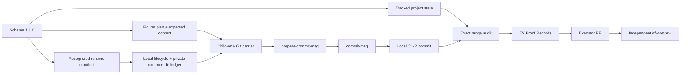

# RF — TFW-49 / Phase C: Repository-Local Enforcement and Migration

> **Date**: 2026-07-31
> **Author**: codex / Executor
> **Status**: 🟢 RF — Complete Executor Handoff
> **Parent HL**: [HL-TFW-49](../HL-TFW-49__agent_commit_identity_and_attribution.md)
> **TS**: [TS Phase C](TS__phase-c__repository_local_enforcement_migration.md)
> **Executor Attestation**: This RF states only what the Executor can support from the
> cited Proof Records and disclosed limitations. Independent REVIEW retains
> acceptance/rejection authority. The routed Reviewer operation is Evidence, while its
> `REVISE` verdict remains binding until a fresh independent corrective review.

---

## 1. What Was Done

### New Files

| File | Description |
|------|-------------|
| `.tfw/templates/commit_identity_state.json` | Clean null/root-inclusive destination-state source |
| `.tfw/scripts/commit_identity_hooks.py` | Standard-library runtime lifecycle, carrier, prepare, final, and destination-state owner |
| `.tfw/scripts/test_commit_identity_hooks.py` | Platform/topology/lifecycle/context/security/workflow proof |
| `.tfw/hooks/runtime.json` | Recognized runtime manifest for contract/runtime `1.1.0` |
| `.tfw/hooks/prepare-commit-msg` | Thin repository-relative prepare entry, committed as `100755` |
| `.tfw/hooks/commit-msg` | Thin repository-relative final entry, committed as `100755` |

### Modified Files

| File(s) | Changes |
|---------|---------|
| `.tfw/commit_identity.schema.json`, `.tfw/commit_identity_state.json` | Exact `1.1.0`, two activation modes, portable runtime requirement, exact current anchor, no tracked installed truth |
| `.tfw/scripts/commit_identity.py`, `.tfw/scripts/test_commit_identity.py` | Exact exclusive/root-inclusive audit, no-target/topology failures, semantic-shape and compatibility proof |
| `.tfw/scripts/commit_identity_router.py`, `.tfw/scripts/test_commit_identity_router.py` | Complete expected-context token and required-runtime status without live-state inference |
| `.tfw/conventions.md`, `.tfw/glossary.md` | Canonical tracked/private state, runtime, context, client, audit, F26, and concise term boundaries |
| `.tfw/workflows/init.md`, `.tfw/workflows/update.md` | Destination-derived state, local install/verify, state preservation, ownership-gated runtime repair/rollback |
| `.tfw/workflows/handoff.md`, `.tfw/workflows/review.md`, `.tfw/workflows/release.md` | Routed local commits, exact range attestations, independent review gate, release double gate, publication separation |
| `.agent/workflows/tfw-{init,update,handoff,review,release}.md` | Five byte-exact Antigravity copies |
| `.claude/commands/tfw-{init,update,handoff,review,release}.md` | Five byte-exact Claude Code copies |
| `tasks/TFW-49__agent_commit_identity_and_attribution/phase-c/ONB__phase-c__repository_local_enforcement_migration.md` | Executor lifecycle-only generated-doc citation serialization; decisions and scope unchanged |
| `README.md` | Single TFW-49 Task Board lifecycle row advanced to RF(C) and linked to this RF |

Executor-owned EV and this RF are lifecycle traces outside the 29-framework-path
measurement. No REVIEW, knowledge, docs-closure, config, adapter-entry, Cursor, hook
outside `.tfw/hooks`, or remote artifact was created.

## 2. Key Decisions and Material Deviations

1. The tracked state owns only portable requirements; exact clone-local prior/current
   observations live atomically in the Git-common-dir private ledger.
2. Existing history remains exact exclusive-anchor at
   `f1106186417e84cdb38e797f7af66a60885bad76`; a clean destination begins
   root-inclusive with a null anchor, and no target fails explicitly.
3. The schema owns the canonical runtime kind and target-to-entrypoint relation; the
   manifest owns exact normalized-LF target hashes. Recognition requires their exact
   closed shape and exact three-file directory inventory across Windows and Ubuntu WSL.
4. Hook launchers prefer `python` and fall back to `python3`; all validation and
   lifecycle behavior remains in the standard-library Python owner.
5. The router remains the operation/context owner. The carrier accepts only a
   validated router plan, injects context into the Git child only, and has no
   publication authority.
6. Current-repository mutation used the approved exact transaction: install, verify,
   rollback to exact prior unset, negative rollback verification, reinstall, verify.
7. The implementation commit was created through the new runtime with exact subject
   `[codex/TFW-49/phase-c/executor] implement repository-local enforcement and migration`.
8. The independent Reviewer operation occurred in routed commit `1ebb680…` and remains
   valid Evidence. Its `REVISE` judgment exposed D1–D3; corrective implementation
   commit `4754392…` closes those defects but cannot claim acceptance before re-review.

### Material Deviations

No material deviations. The corrected measured 3,187 changed framework lines are within the
approved descriptive 2,600–3,600 estimate. The ONB reference serialization correction
preserved every decision and removed all Phase-C-added MkDocs warning types under the
already authorized Executor lifecycle path.

### Transition and Removal Classification

| # | Former behavior/content | Classification | Current owner or stronger relation |
|---|-------------------------|----------------|------------------------------------|
| R1 | Tracked `hook_runtime.installed:false` clone observation | Moved to owner-reference | Portable requirement remains in tracked state; observed install/prior state is private common-dir ledger data |
| R2 | Exclusive-anchor as the only accepted range mode | Covered by stronger structural relation | Schema-owned exact exclusive and root-inclusive registries plus mode/anchor validation |
| R3 | Router output containing a tracked installed-status inference | Replaced by precise term | Router emits schema-owned required runtime and complete expected-context token; lifecycle verifies actual install |
| R4 | Workflow-local direct commit wording without an executing carrier | Moved to owner-reference | Five action workflows consume the shared router/carrier/runtime and exact audit gates |
| R5 | Update treatment that did not classify Commit Identity project state | Covered by stronger structural relation | Update explicitly preserves project state and repairs only recognized runtime after ownership checks |

## 3. Acceptance Criteria and Executor Attestation

| AC | Claimed deliverable and Executor statement | Proof Record(s) | Limitations, Value Debt, or blocked condition | Result |
|----|--------------------------------------------|-----------------|----------------------------------------------|--------|
| AC-1 | Exact `1.1.0`, current exclusive anchor, clean root-inclusive template, portable tracked runtime requirement, and sole schema ownership are supported | PR-C1 | None | [x] |
| AC-2 | Exact exclusive/root-inclusive full-population audit and fail-closed topology behavior are supported | PR-C2 | No actor authentication is claimed | [x] |
| AC-3 | Exact closed three-file runtime recognition and two-entry execution are supported on the declared Windows and Ubuntu WSL Git/Python boundaries; extra entries, unexpected fields, arbitrary entrypoints, and equivalent shape mutations fail closed | PR-C3, PR-C10 | Support is runtime/Git CLI only, not client identity | [x] |
| AC-4 | Local-only lifecycle, common-dir private ledger, linked-worktree sharing, ownership-gated repair, exact opaque/unset rollback, and stable exact-prior `.tfw/hooks` repeated dispositions are supported | PR-C4 | Private value/content is intentionally undisclosed | [x] |
| AC-5 | Router-derived child-only context carrier and publication prohibition are supported | PR-C5 | No persistent context or publication authority | [x] |
| AC-6 | Non-mutating prepare and final validation across context/trailer/seven-operation cases are supported | PR-C6, PR-C10 | Absent context is structural-only; no actor authentication | [x] |
| AC-7 | Destination-derived init and update state preservation/recognized repair semantics are supported | PR-C7 | Isolated lifecycle proof; current live install is PR-C11 | [x] |
| AC-8 | Handoff/review/release local gates and F26 separation are supported in source and actual Executor/Reviewer use | PR-C8, PR-C11 | Reviewer verdict remains `REVISE` pending corrective re-review; no publication occurred | [x] |
| AC-9 | Five canonical workflows and ten copies are byte-exact with an exact 29-path framework set | PR-C9 | Structural parity is not live Antigravity/Claude support | [x] |
| AC-10 | The corrected platform/topology/security/operation/recognition/lifecycle matrix is supported on the exact declared versions | PR-C10 | Synthetic surface/role fixtures are not live clients | [x] |
| AC-11 | Current installation, routed Executor and independent Reviewer operations, exact full range, and unchanged origin are established | PR-C11 | The Reviewer operation is Evidence, not approval; the corrective result awaits re-review | [x] |
| AC-12 | Exact corrected regression/scope/docs/evidence/RF/Task Board handoff is supported and ready for independent re-review | PR-C12 | Executor does not modify REVIEW or claim its acceptance authority | [x] |

### Principles Trace

| Principle | Executor disposition | Proof Record(s) |
|-----------|----------------------|-----------------|
| P1 — Product value before mechanism | Real action-local provenance and full-range outcomes are separated from hook presence | PR-C8, PR-C11 |
| P2 — One semantic owner | Schema/state/CLI/router own registries, runtime kind/entrypoints, state, validation, and operation decisions | PR-C1, PR-C3, PR-C5, PR-C6 |
| P3 — Tracked requirement, private reality | Tracked portable requirement and private common-dir observations are distinct | PR-C1, PR-C4 |
| P4 — No contaminated templates | Clean template and destination-derived activation are proved | PR-C1, PR-C7 |
| P5 — Repository-local means repository-local | Local-only command spy and conflict/lifecycle matrices pass | PR-C3, PR-C4, PR-C10 |
| P6 — Explicit context or honest limitation | Complete/partial/malformed/absent/stale cases preserve the structural-only limitation | PR-C5, PR-C6 |
| P7 — Hooks are visibility, not identity proof | All live/audit outputs retain `actor_authentication:false` | PR-C3, PR-C6, PR-C11 |
| P8 — Exact history over samples | Exact DAG and current full-range audits pass without fallback | PR-C2, PR-C8, PR-C11 |
| P9 — Independent judgment | Reviewer independently returned `REVISE`; corrective Executor evidence awaits a fresh Reviewer verdict | PR-C8, PR-C11, PR-C12 |
| P10 — Real proof stays real | Synthetic, structural, platform, and current-repository observations are separately labeled | PR-C9, PR-C10, PR-C11 |
| P11 — Reversibility includes secrecy | Exact opaque/unset/owned-prior rollback, repeated dispositions, and redaction cases pass | PR-C4, PR-C10 |
| P12 — Publication is separate authority | Carrier/workflows prohibit publication and origin remains fixed | PR-C5, PR-C8, PR-C11 |

### Definition-of-Failure Trace

| DoF items | Protected failure boundary | Proof Record(s) |
|-----------|----------------------------|-----------------|
| 1–3 | Exact version, sole owners, valid tracked/template state, no installed contamination | PR-C1 |
| 4 | Exact exclusive/root-inclusive population and fail-closed topology | PR-C2 |
| 5–8 | Recognized-owned runtime only; no external/global access; local-only exact rollback; private shared ledger | PR-C3, PR-C4, PR-C10 |
| 9 | No installed-state inference, persisted context, arbitrary command, or publication carrier | PR-C5 |
| 10–12 | Non-mutating prepare, exact final/context rules, synthetic secret-safe inputs/diagnostics | PR-C6, PR-C10 |
| 13 | Destination-owned init/update and exact canonical/derived agreement | PR-C7, PR-C9 |
| 14 | Handoff/review/release require valid runtime, exact range, and distinct authority | PR-C8, PR-C11 |
| 15–16 | Structural/synthetic proof is not live client/authentication; exact platform observations exist | PR-C9, PR-C10, PR-C11 |
| 17–19 | No 30th framework path, complete PR/EV/RF traces, Role Lock preserved, origin fixed and no publication | PR-C12 |

## 4. Verification

| # | Claim / failure protected | Command or method | Actual result | Proof Record(s) |
|---|---------------------------|-------------------|---------------|-----------------|
| V1 | Contract/state/template/range semantics | `python -m pytest -q .tfw/scripts/test_commit_identity.py` as part of the combined run | 157 collected cases; combined run passed | PR-C1, PR-C2 |
| V2 | Router/operation compatibility | `python -m pytest -q .tfw/scripts/test_commit_identity_router.py` as part of the combined run | 149 collected cases; combined run passed | PR-C5, PR-C6 |
| V3 | Runtime/lifecycle/platform/workflow matrix | `python -m pytest -q .tfw/scripts/test_commit_identity_hooks.py` as part of the combined run | 70 collected cases; combined run passed, including D1/D2 negative/regression families | PR-C3, PR-C4, PR-C6–PR-C10 |
| V4 | Full contract/router/runtime regression | `python -m pytest -q` over all three Commit Identity test files | **376 passed in 42.01s** on the final pre-RF tree | PR-C1–PR-C10, PR-C12 |
| V5 | Python syntax/import | `python -m compileall -q` for the three production Python owners | Passed with no output | PR-C1, PR-C3, PR-C5 |
| V6 | Docs generation/integration | `python -m pytest -q docs/scripts/test_gen_docs.py docs/scripts/test_integration.py` | **68 passed in 27.48s** on the final pre-RF tree | PR-C12 |
| V7 | Pinned warning baseline | Build clean `1123213` archive and final scoped overlay with identical MkDocs command/environment; normalize warning lines by root replacement and distinct sort | Baseline/final **316/316 lines**, **156/156 distinct**, **0 added / 0 removed** | PR-C12 |
| V8 | Rendered pages/links/anchors | Inspect generated HTML for conventions, glossary, five canonical workflows, and Phase C ONB/EV/RF; require page, key anchor/text, UTF-8, and resolve local hrefs | **10/10 pages passed**; no replacement character or broken local href | PR-C7–PR-C9, PR-C12 |
| V9 | Exact derived parity | SHA-256 byte comparison of five canonical workflows to Antigravity and Claude copies | **10/10 exact** | PR-C9 |
| V10 | Temp Git/platform scenarios | Automated temp repositories including actual Windows and Ubuntu WSL hook commits plus closed recognition and exact-owned-prior matrices | All required range/lifecycle/context/operation/security families passed on Git `2.42.0.windows.1`/Python `3.13.5` and Ubuntu WSL Git `2.43.0`/Python `3.12.3`; targeted corrective/platform subset 17/17 | PR-C2–PR-C6, PR-C10 |
| V11 | Current live transaction | `install → verify → rollback → presence-only exact-unset/ledger-absent check → reinstall → verify` | Exact prior unset restored; expected uninstalled verify failed; final runtime valid `1.1.0`, relative-owned local config, private ledger present | PR-C4, PR-C11 |
| V12 | Routed current commits | `commit_identity_hooks.py commit` with handoff/codex/TFW-49/phase-c/executor/ordinary context; inspect Reviewer trace commit | Original `bc556679…`, corrective `4754392…`, and independent Reviewer `1ebb680…` use exact C1-R subjects; runtime/hooks accepted each routed operation | PR-C5, PR-C6, PR-C8, PR-C11 |
| V13 | Exact current range | `python .tfw/scripts/commit_identity.py audit-range --repo .` after corrective implementation commit | 23 descendants after exact anchor through `4754392…`; status valid; `actor_authentication:false` | PR-C2, PR-C8, PR-C11 |
| V14 | Exact scope/protected state | Compare `1123213..4754392` to the approved 29-path allowlist; compare `1ebb680..4754392` to corrective scope | 29/29 framework paths, 0 extras; corrective implementation is five existing approved paths; REVIEW/stage traces read-only; protected config/template/knowledge/debt/unrelated workflows unchanged | PR-C9, PR-C12 |
| V15 | Remote/publication boundary | Read-only `git rev-parse origin/master`; source/command-spy prohibition scan; presence-only local runtime checks | `origin/master=b4c0a06…`; no push/tag/deploy/publish/notify/host escalation; no external/global hook access | PR-C4, PR-C5, PR-C10–PR-C12 |
| V16 | Diff hygiene | `git diff --check`, staged-set comparison, executable-mode inspection | Clean; exact staged set; both hook entries `100755` | PR-C3, PR-C9, PR-C12 |

### Descriptive Measurements

All line measurements use physical lines from `1123213` blobs and final files with the
same line-count method. Changed lines use one `git diff --numstat` method, with new
untracked-at-measurement files counted as all additions. They are scope observations,
not success evidence.

| Measurement | Before | After | Delta | Method / provenance |
|-------------|-------:|------:|------:|---------------------|
| Physical framework LOC | 7,310 | 10,229 | +2,919 | `ReadAllLines` on the exact 29-path inventory; missing baseline files = 0 |
| Changed framework lines | 0 | 3,187 | +3,187 | Exact 29 paths: `+3,053/-134` vs `1123213` |
| Framework files present | 23 | 29 | +6 | Exact allowlist presence/classification |
| New framework files | 0 | 6 | +6 | Baseline object existence |
| Modified existing framework files | 0 | 23 | +23 | Baseline-to-final exact path diff |
| Production changed lines | 0 | 1,351 | +1,351 | 5 production code/entry paths; `+1,332/-19` |
| Test changed lines | 0 | 1,146 | +1,146 | 3 test paths; `+1,136/-10` |
| Docs/workflow changed lines | 0 | 618 | +618 | 17 canonical/copy/conventions/glossary paths; `+519/-99` |
| Data changed lines | 0 | 72 | +72 | 4 schema/state/template/manifest paths; `+66/-6` |

Scope-attention comparison: 29 files vs signal 14 (`+15`), 6 new vs signal 8
(`-2`), 23 modified vs signal 12 (`+11`), and 3,187 changed lines vs signal 1,200
(`+1,987`). The measured result remains within the approved 2,600–3,600 descriptive
estimate and the exact cohesive owner boundary; no success inference is drawn from it.

## 5. Evidence

See [EV Phase C](evidence/EV__phase-c__repository_local_enforcement_migration.md) for
the complete `PR-C1`–`PR-C12` index, per-AC Evidence rows, environment, and debt.

Evidence verdict: 5/12 VERIFIED, 0 DEFERRED, 0 BLOCKED, 7 N/A

Evidence limitation: the independent Reviewer operation is now observed and creates
no Value Debt. Its existing verdict is `REVISE`, so this corrected Executor attestation
still makes no independent acceptance claim and must return to `/tfw-review`.

## 6. Observations (out-of-scope, not modified)

No observations.

## 7. Fact Candidates

No Fact Candidates. The Coordinator/user messages supplied workflow authority and
acceptance boundaries, not new human-only project-domain facts.

## 8. Strategic Insights (Execution)

No strategic insights. Execution required implementation and proof decisions inside
the approved specification, not new human-sourced domain synthesis.

## 9. Diagrams

The diagram is a relation map, not an authentication or publication flow. Remote
publication remains outside the carrier and prohibited for this phase.

---

*RF — TFW-49 / Phase C: Repository-Local Enforcement and Migration | 2026-07-31*
