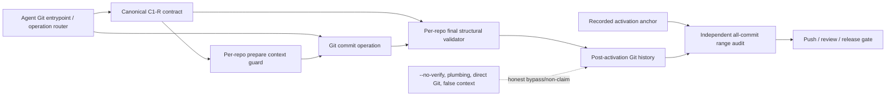
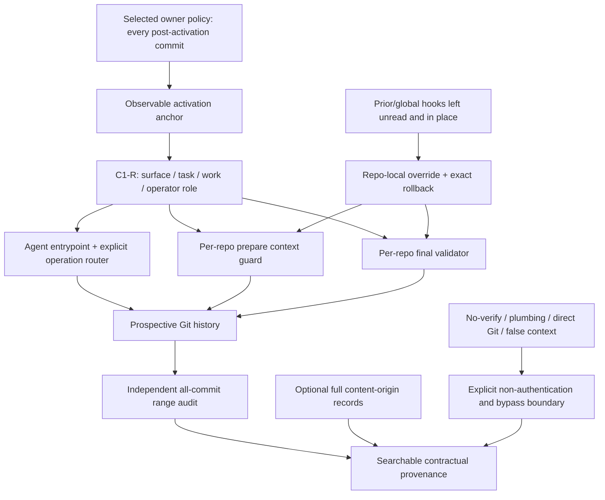

# RES — TFW-49: Agent Commit Identity and Attribution — Iteration 1

> **Date**: 2026-07-30
> **Author**: Researcher (Codex)
> **Status**: 🔬 RES — Complete
> **Parent HL**: [HL-TFW-49](../../HL-TFW-49__agent_commit_identity_and_attribution.md)
> **Mode**: Pipeline — Deep

---

## Research Context

Iteration 1 compared commit-identity semantics, subject grammars, enforcement layers,
Git-operation behavior, and installation/migration architectures for TFW-managed
repositories. It inspected the current TFW history and complete commit-producing
workflow surface, representative Atamat/Helpdesk/AFD histories, official Git and
Conventional Commits contracts, and synthetic Windows/Ubuntu Git repositories. It
then attacked the leading configurations with missing/false context, replay,
autosquash, mixed-origin content, hook topology, worktrees, config rollback,
`--no-verify`, and plumbing bypass. The result is a recommended architecture candidate
for planning, not an implementation or authentication system.

## Briefing and Stage Trace

The approved decision procedure, corpus, and hard read-only/temporary-fixture
boundaries are in [1_briefing.md](1_briefing.md). Evidence, configuration synthesis,
and falsification are recorded in [2_gather.md](2_gather.md),
[3_extract.md](3_extract.md), and [4_challenge.md](4_challenge.md). Every stage closed
at a Coordinator WAIT gate.

## Evidence and Authority Separation

Research observations and owner/Coordinator policy decisions have different authority:

| Kind | Supported result | Source/authority |
|------|------------------|------------------|
| Project evidence | Existing branch prefixes duplicate, vary in position, and do not identify agent surface or TFW role; the transitional `9e19a4f` is valid pre-activation history | TFW, Atamat, Helpdesk, and AFD read-only history inventories; Gather G1-G2 |
| Git evidence | `commit-msg` is useful but bypassable; synthetic automatic revert/cherry-pick skipped it, while Challenge found `prepare-commit-msg` did run; Git-reserved autosquash matching conflicts with cross-context current-operator identity | Official Git manuals; Gather G5/G7; Challenge C1-C2 |
| Truth evidence | Local syntax and hooks cannot authenticate the invoker; a valid identity remains self-declared contractual provenance | Gather G7-G8; Challenge C5/C7 |
| Lifecycle evidence | A relative repository-local hook runtime works from main and linked worktrees; isolated rollback can restore an exact prior local value or the prior unset state | Challenge C6 |
| User policy | Git work in a TFW-managed project is agent-managed; every post-activation commit may be required to carry canonical identity; project hooks may be disabled by a local override; TFW hooks are per repository, never global | Authoritative Human-Only user signal recorded in Challenge |
| Coordinator selection | C1-R is the recommended architecture candidate; C2-R is fallback; use entrypoint/router + per-repository prepare/final hooks + independent all-commit range audit; no prior-hook proxy default | Coordinator approval after Challenge |

The all-commit scope and no-proxy lifecycle are selected direction, not inferences from
the history sample. Conversely, the non-authentication boundary is empirical and
technical; the selected policy does not override it.

## Evidence Synthesis

| Decision question | Synthesis | Consequence |
|-------------------|-----------|-------------|
| What is the smallest required identity? | Stable agent surface, task, work scope, and operator TFW role are independent search dimensions. Model, session, Git account, and content origin answer different questions. | Use four fixed-order subject fields; leave model/session optional and keep Git author/committer unchanged. |
| Which grammar leads? | Compact C1-R preserves the same fields as labeled C2-R in 24 fewer prefix characters. A strict positional parser can still issue field-specific diagnostics. | Recommend `[surface/task/work/role] summary`; retain labeled C2-R only as a documented fallback. |
| Who does `role` describe? | One field cannot represent the commit operator, all content producers, and independent acceptance. | Core role is the commit operator; prefer atomic same-origin commits; use full optional origin records only when needed. |
| Can one final hook cover Git? | No. `commit-msg` was skipped by synthetic automatic revert/cherry-pick and by `--no-verify`. `prepare-commit-msg` observed the sequencer operations, but context comparison still depends on the entrypoint. | The entrypoint/router owns semantics; prepare and final hooks add immediate structural visibility; an independent range audit checks all post-activation commits. |
| Can autosquash remain transparent? | Only in the same four-field context. Git matches the target subject, so a different current identity either fails matching or retains stale provenance. | Permit same-context reserved forms only; prohibit cross-context autosquash by default. |
| Can local rules prove the actor? | No. The invoker can type a valid identity, omit the entrypoint, use `--no-verify`, use plumbing, or present stale but valid context. | Claim contractual searchable provenance only; do not infer or advertise authenticated actor identity. |
| Must existing hooks be chained? | No under the approved agent-managed project policy. Chaining adds arbitrary-hook, secret, cycle, order, and portability exposure without required value. | Use a TFW-owned per-repository override; leave prior/global hooks unread and in place; restore prior config exactly on rollback. |
| How is prospective scope bounded? | Historical commits must not be relabeled. An audit needs an observable range start or it can silently omit commits or judge pre-policy history. | Planning must define and record a precise activation anchor before rollout. |

## Recommended Architecture Candidate

### C1-R subject contract

Ordinary subject:

```text
[<surface>/<task>/<work>/<role>] <summary>
```

Examples:

```text
[codex/TFW-49/master/coordinator] approve commit identity architecture
[codex/TFW-49/research-iter1/researcher] synthesize research evidence
[claude-code/TFW-49/phase-a/executor] implement the approved validator
[cursor/TFW-49/phase-a/reviewer] verify migration evidence
[codex/none/update/coordinator] repair installed TFW hook runtime
```

Field semantics:

| Field | Meaning | Initial contract |
|-------|---------|------------------|
| `surface` | Stable agent interaction surface that operates the commit | Closed owned registry; current surfaces are `antigravity`, `claude-code`, `codex`, and `cursor`; not model, account, or session |
| `task` | Owning TFW task | Canonical task ID, or guarded literal `none` for declared non-task lifecycle work |
| `work` | Task/lifecycle slice | `master`, canonical `phase-*`, `research-iter<N>`, `docs`, `knowledge`, `release`, `config`, `init`, `update`, or `maintenance` |
| `role` | Active TFW authority operating the commit | Closed owned registry: `coordinator`, `researcher`, `executor`, `reviewer` |
| `summary` | Concise result | Non-empty; action tokens may follow the identity, but strict Conventional-Commit conformance is not claimed |

The contract owner must own the registries, normalizer, parser, examples, diagnostics,
and version. Entry points normalize legacy work spellings such as `PhaseA2` to canonical
lower-case output. Phase tokens use an anti-ambiguity rule: lowercase ASCII segments,
single `-` or `.` separators, and no slash, bracket, whitespace, empty segment, or
consecutive separator.

`task:none` is accepted only when:

1. the entrypoint explicitly declares non-task work;
2. `work` is a lifecycle scope rather than `phase-*`, `master`, or a research
   iteration; and
3. staged paths contain no canonical `tasks/<id>/...` scope.

A mixed lifecycle/task change must be split or attributed to the task.

### Optional attribution records

Atomic same-origin commits are the default. A justified inseparable mixed-origin
commit retains the operator in the subject and may repeat:

```text
TFW-Content-Origin: <surface>/<task>/<work>/<role>
```

The complete four-field origin is required because shorter surface/role attribution is
ambiguous when task or work differs. It means content contribution only; it does not
prove acceptance, review, authorization, or current operation and does not replace
`Co-authored-by`.

Optional declared metadata may use:

```text
TFW-Agent-Model: <model token>
TFW-Agent-Session: <opaque session reference>
TFW-Source-Commit: <object id>
```

These records are not mandatory search identity, are not authenticated, and must not
contain secrets.

### Operation contract

Git-reserved forms remain narrow exceptions. The nested four-field identity must
exactly equal the current entrypoint context:

```text
fixup! [<same identity>] <target summary>
squash! [<same identity>] <target summary>
Revert "[<same identity>] <target summary>"
```

Disposition by operation:

| Operation | Required behavior |
|-----------|-------------------|
| ordinary commit/merge | entrypoint establishes context; final subject begins with current C1-R identity |
| same-context amend | may retain identity if it remains factually accurate and the atomic unpublished correction is authorized |
| changed-context amend | reword and revalidate with the actual operator context |
| same-context fixup/squash | reserved marker may nest the same current identity |
| cross-operator/task/work fixup/squash | prohibited by default; use a normal current-operator follow-up or an explicitly authorized unpublished rewrite |
| cross-context cherry-pick | `--no-commit`, inspect, then current-operator commit; optionally record source object |
| cross-context revert | `--no-commit`, then current-operator `revert:` subject; optionally record reverted object |
| generated/automation commit | must enter through an owned context-setting entrypoint or separately trusted policy; no stale inherited identity |

The operation router is the semantic owner. A prepare hook may compare the complete
proposed subject to supplied expected context, but must not infer the operation from
unreliable transient state or rewrite identity.

### Enforcement layers



Responsibilities:

| Layer | Responsibility | Explicit non-responsibility |
|-------|----------------|-----------------------------|
| Canonical contract | own field semantics, registries, normalizer, parser, diagnostics, examples, and contract version | no developer-specific paths, copied hook bodies, actor authentication, RF/REVIEW meaning |
| Agent entrypoint/router | require/derive explicit current context, enforce cross-field invariants, construct or validate subject, expose truthful replay flows | does not infer task/role from branch or fabricate missing authority |
| `prepare-commit-msg` guard | when expected context is supplied, compare the complete proposed effective identity and reject mismatch without mutation | not a general operation detector; cannot compare an absent trusted context |
| `commit-msg` validator | immediately reject malformed/missing final identity for operations it observes; provide stable actionable diagnostics | bypassable with `--no-verify`; did not observe synthetic automatic replay |
| Range audit | examine every commit after the recorded activation boundary and reject structural omissions at a later independent gate | cannot authenticate actor or detect structurally valid false/stale identity without external trusted context |

Hooks remain because they materially shorten feedback, not because they are a security
boundary. The all-post-activation-commit policy means the range audit has no
"unclassified equals human" exception.

### Activation boundary

Planning must define one observable activation record before implementation. The
recommended invariant is:

> Record the last pre-policy commit object as the activation anchor; every descendant
> in `anchor..target` is subject to C1-R. Verify the first policy/installation commit
> with the same contract, and never rewrite or relabel commits at or before the anchor.

The TS must specify:

- storage and ownership of the anchor and contract version;
- ancestry validation and behavior after branch creation, merge, force update, shallow
  clone, missing object, or rewritten local refs;
- whether the audit fails closed when the anchor is absent or not an ancestor;
- inclusive/root semantics for an unborn or fresh repository;
- the exact push/review/release consumers and ranges;
- migration proof that the anchor does not classify historical commits.

This is a required planning contract, not a completed implementation choice.

### Installation, repair, and rollback

Leading lifecycle:

1. `/tfw-init` inspects hook configuration topology and recognized ownership metadata
   without reading or copying arbitrary hook bodies.
2. It installs a versioned TFW-owned runtime at a reserved repository path and sets
   only the repository-local `core.hooksPath` override.
3. It never changes global Git configuration or reads, mutates, deletes, fingerprints,
   or copies the external/global hook directory.
4. Existing prior hook files remain in place but do not run for this repository after
   the approved local override. No proxy/chain is generated by default.
5. If the reserved target contains non-TFW-owned material, installation blocks for
   explicit owner resolution; it never overwrites or ingests the material.
6. General attach detects project-specific ownership and requires explicit
   supersession authority. This project has supplied that authority.
7. `/tfw-update` and repair replace only files carrying recognized TFW
   ownership/version and revalidate the local override and consumers.
8. Rollback restores the exact previous local config value or restores "unset"; it
   removes only recognized TFW-owned runtime state.
9. Diagnostics disclose only stable code, hook stage, violated field, and remediation;
   they disclose no arbitrary path, body, credential, environment dump, or commit
   content.

The discarded prior-hook dispatcher is not a compatibility mode hidden inside C1-R.
If a future owner requires chaining, that is a separate architecture decision with
ordering, failure propagation, hook-name coverage, cycle, portability, secret, and
worktree proof obligations.

## Decisions

| # | Decision | Rationale |
|---|----------|-----------|
| D1 | Recommend C1-R `[surface/task/work/role] summary`; retain C2-R only as fallback | It is the shortest challenged grammar preserving all four independent fields; the strict parser can give labeled diagnostics without storing labels |
| D2 | Apply canonical structural identity to every new post-activation commit in the agent-managed repository | The Human-Only owner signal removes the plain-human exception and makes audit population explicit |
| D3 | Define core surface/role as commit operator; prefer atomic same-origin content; permit only full repeatable optional origin records | Operator, content origin, co-authorship, and acceptance are independent facts |
| D4 | Use closed owned surface, work, and role registries with canonical normalization and guarded `task:none` | Registry and cross-field tests exposed typo, legacy spelling, and non-task escape risks |
| D5 | Allow Git-reserved forms only in the exact same four-field context; use explicit no-commit/re-commit for cross-context replay | Synthetic autosquash and replay showed that automatic forms retain stale identity or fail target matching |
| D6 | Adopt entrypoint/router + per-repository prepare/final hooks + independent all-commit range audit | Each layer addresses a distinct visibility gap; none is represented as actor authentication |
| D7 | Replace prior-hook chaining with a per-repository TFW-owned override managed by init/update | Owner-authorized disablement is simpler and avoids arbitrary-body, secret, cycle, order, and global-lifecycle coupling |
| D8 | Require an observable activation commit/range anchor before audit activation | Prospective enforcement needs a complete range without relabeling history |
| D9 | Preserve identity as contractual provenance only | Git author, local hooks, prefixes, and self-declared context cannot prove the actual invoker, Proof Record, RF attestation, or REVIEW acceptance |

## Open Questions

| # | Question | Status | Answer / next authority |
|---|----------|--------|-------------------------|
| Q1 | Where is the canonical schema/registry/parser implemented and how are consumers generated? | Planning/TS | Phase A must select one versioned semantic owner and testable consumer interface |
| Q2 | How is the activation anchor stored and audited for fresh, shallow, rewritten, or multi-ref repositories? | Planning/TS | Use the invariant above; specify exact storage, inclusive semantics, ancestry failure, and consumer ranges before implementation |
| Q3 | Which gate runs the independent range audit? | Planning/TS | It must be independent of the skipped local hook path and precede push/review/release acceptance; hosted authentication is not required |
| Q4 | Which GUI/IDE/JGit clients are supported? | Implementation proof | Test context propagation and hook execution or document unsupported surfaces; direct clients must not be assumed equivalent |
| Q5 | Is authenticated actor provenance required later? | Deferred owner decision | No for the current practical outcome; a trusted hosted identity policy would be separate scope |
| Q6 | What action is required for the excluded credential issue? | Urgent external owner action | Remediate the redacted plaintext credential exposure outside TFW-49. This RES records no value, path, body, or fingerprint. |

## Hypotheses (from HL §10)

| # | Hypothesis | HL Status | RES Status | Evidence |
|---|-----------|-----------|------------|----------|
| H1 | A fixed subject-leading identity with separate agent, task/scope, and role fields is materially easier to recognize and filter than Git author metadata, branch prefixes, free-form prose, or trailers alone | open | 🟢 **Supported for the decision** | Four histories exposed variable/duplicated prefixes and missing surface/role; synthetic fixed-field filters separated all four dimensions. C1-R leads C2-R on equal semantics with shorter subjects. |
| H2 | A stable agent-surface identifier plus TFW role is more durable and truthful than a model-version or exact-session identifier as the mandatory core; more specific identity can remain optional metadata | open | 🟢 **Supported** | Surface, role, model, session, Git account, and content origin were separable; model/session remain optional declared trailers. |
| H3 | One canonical grammar plus a short point-of-commit imperative and a versioned `commit-msg` validator provides the smallest reliable enforcement contract; documentation-only or a mutating `prepare-commit-msg` hook is insufficient | open | 🟡 **Materially revised / partially supported** | One owner, cues, and final validation survive, but `commit-msg` missed automatic replay and is bypassable. Reliable structural visibility requires entrypoint/router, non-mutating prepare comparison, final validator, and independent range audit. |
| H4 | Agent-only enforcement can be made deterministic without blocking human commits if agent workflows establish explicit context that the validator verifies rather than invents | open | 🔴 **Refuted as written; replacement policy supported structurally** | Local/branch/server self-declaration cannot authenticate actor or distinguish omitted agent from allowed human. The new all-commit owner policy makes structural population complete but does not prove invoker identity. |
| H5 | `core.hooksPath` with conflict-aware init/update migration can supersede the current `[master]` hook while preserving unrelated user hooks and normal Git operations | open | 🟡 **Materially revised / conditionally supported** | Per-repository override, ownership checks, worktree behavior, and exact rollback are feasible. "Preserve" now means leave prior bodies in place and restore config, not execute them through a proxy; unsupported client behavior still needs proof. |
| H6 | The contract can handle merge/revert/amend/fixup/release exceptions with a small explicit grammar rather than workflow-specific formats | open | 🟡 **Conditionally supported and narrowed** | Ordinary/merge/lifecycle cases fit C1-R, but same-context-only autosquash and explicit cross-context replay are required; one unconditional prefix cannot truthfully cover all automatic Git forms. |

## HL Update Recommendations

### Target, policy, and claims

| # | What to update | Source |
|---|----------------|--------|
| R1 | Replace the unresolved result visualization with C1-R and document C2-R as fallback only | D1; Challenge C8 |
| R2 | Replace "every new agent-authored commit" plus plain-human default with "every new post-activation commit in an agent-managed TFW repository" | Human-Only signal; D2; Challenge C5 |
| R3 | Define `surface`, `task`, `work`, and `role` exactly; state that role/surface describe the commit operator | D3-D4; Extract E1/E3; Challenge C3-C4 |
| R4 | Add atomic same-origin default, full repeatable optional `TFW-Content-Origin`, and separate optional model/session/source trailers | D3; Challenge C4 |
| R5 | State the contractual non-authentication boundary and preserve the distinction from Git authorship, Proof Records, RF attestation, and REVIEW | D9; Gather G8; Challenge C5/C7 |
| R6 | Add the observable activation-anchor invariant; pre-activation history including `9e19a4f` remains unchanged and non-compliance is not inferred retroactively | D8; Coordinator synthesis direction |

### Definition of Done

Update DoD to require:

1. C1-R at the start of every post-activation commit, with the narrow Git-reserved
   same-context exceptions.
2. One versioned contract owning registries, normalization, parser, diagnostics,
   optional trailers, and contract version.
3. All current and later registered adapters/workflows consuming the contract through
   the entrypoint rather than duplicating it.
4. Explicit cross-context replay and autosquash restrictions.
5. Per-repository install/verify/repair/rollback through init/update with no global
   mutation or prior-hook proxy default.
6. An observable activation anchor and an independent audit proving every in-scope
   descendant is structurally conforming without relabeling earlier commits.
7. Positive, negative, bypass, sequencer, merge, amend, fixup/squash, worktree,
   rollback, registry, `task:none`, mixed-origin, and search/filter fixtures on every
   supported Git/platform/client boundary.
8. Exact non-claims for actor authentication and local bypass.

### Definition of Failure

Carry these eight repaired classes:

1. **All-commit scope failure:** any post-activation commit lacks canonical identity,
   absent an explicitly selected alternative repository policy; missing identity is
   inferred to be human.
2. **Authentication overclaim:** a valid prefix or local hook is represented as proof
   of the actual actor.
3. **False insertion:** a hook invents, rewrites, or silently replaces context not
   established by the current agent entrypoint.
4. **Replay/autosquash failure:** revert, cherry-pick, fixup, squash, or amend retains a
   stale operator/task/work identity.
5. **Registry escape:** unregistered surface/role, ambiguous phase, or `task:none`
   combined with task-scoped work/path passes validation.
6. **Origin compression:** operator identity is used to imply every content origin, or
   shortened origin omits task/work where those dimensions differ.
7. **Installation boundary failure:** global config/hook mutation; arbitrary body
   ingestion/copy; overwrite of non-TFW reserved-target material; secret/path/body
   leakage; or rollback that does not restore exact prior local config including
   "unset."
8. **False completeness:** the method claims structural or actor completeness despite
   `--no-verify`, plumbing, direct-entrypoint, missing-context sequencer, local-audit,
   GUI/client, or hosted-trust gaps.

The activation anchor belongs in DoD and phase proof as an explicit range invariant.
If absent, invalid, or non-ancestral, the audit must not silently pass or choose an
arbitrary recent range.

### Phase implications

| Phase | Planning implications |
|-------|-----------------------|
| **Phase A — Canonical Contract and Validator** | Own C1-R/C2-R fallback, field registries, phase normalization, guarded `task:none`, operator semantics, optional trailers, reserved grammar, diagnostics, contract version, activation-anchor/range semantics, non-authentication language, and parser/audit fixtures. Replace "human commits remain plain." |
| **Phase B — Workflow and Adapter Consumption** | Add one short entrypoint imperative at every actual commit-producing workflow/adapter/lifecycle surface; map current surface/task/work/role without invention; implement ordinary/merge/amend flows, same-context autosquash restriction, explicit replay router, atomic batching, and optional origin/source records. |
| **Phase C — Migration and Cross-Agent Proof** | Install only a TFW-owned per-repository hook runtime through init; update/repair only recognized ownership; set local `core.hooksPath`; leave external/global and prior bodies unread/in place; block conflicts; restore exact prior value/unset; record activation anchor; run independent all-commit audit; prove main/linked worktrees, Windows/POSIX, supported GUI/client, bypass detection, and no historical relabeling. |

### Risks and hypotheses

- Update H3, H4, H5, and H6 to the RES verdicts rather than carrying their original
  claims as implementation assumptions.
- Add risk of structurally valid but false/stale self-declaration.
- Add risk of missing/ambiguous activation anchor and incomplete range audit.
- Add risk of registry drift when a new adapter/role/work scope is added without an
  atomic consumer/fixture update.
- Add risk that GUI/IDE/JGit surfaces bypass the entrypoint or do not propagate
  expected context.
- Remove the requirement to keep prior hooks executing after explicit project-owner
  supersession; retain detection, no-ingestion, no-global-mutation, and exact rollback.

## Fact Candidates

No empirical Fact Candidate is proposed. The Human-Only input is an authoritative
owner policy/strategic direction, not an agent-verifiable project fact; it is recorded
below and linked through the Learning Receipt disposition.

> fact-candidates: processed 2026-07-31

## Strategic Insights (Research)

| # | Category | Insight | Analytical implication | HL / decision disposition | Source | Confidence |
|---|----------|---------|------------------------|---------------------------|--------|------------|
| SS1 | conventions | TFW-managed project Git is agent-managed; the user works through agents and expects agents to own Git operations | The default population can be every post-activation commit rather than an agent-versus-human branch, eliminating omission-as-human while preserving the authentication non-claim | Replace the plain-human default; adopt D2 and the activation boundary | User, Challenge correction, 2026-07-30 | ★★★ |
| SS2 | architecture | Existing project hooks may be disabled; TFW hooks, if warranted, are installed per repository by init and repaired/updated through their owner lifecycle, never globally | A local override is both smaller and safer than a prior-hook proxy; arbitrary bodies stay unread and global state stays untouched | Adopt D6-D8; revise Phase C and DoF 7 | User, Challenge correction, 2026-07-30 | ★★★ |
| SS3 | scope | Local hooks are structural failure-visibility mechanisms, not actor authentication | Adding layers cannot justify an identity-proof claim; hosted identity is a separate owner decision | Preserve D9 and H4 refutation; do not add hosted identity by default | User/Coordinator, Challenge approval, 2026-07-30 | ★★★ |

## Learning Receipt Disposition

| Signal and trigger | Disposition | Destination and backlink | Responsible actor |
|--------------------|-------------|--------------------------|-------------------|
| External/global hook topology contradicted the HL's simple active-local-hook model; arbitrary and sensitive bodies remain excluded | derive | Final relation is the no-proxy per-repository lifecycle in D7 and Phase C. Backlinks: [Gather G3](2_gather.md#g3-effective-hook-ownership-is-external-to-the-repository), [Extract E7](3_extract.md#e7-migration-is-a-topology-transaction-not-a-file-copy), [Challenge C6](4_challenge.md#c6-the-viable-migration-is-a-per-repository-override-not-a-prior-hook-dispatcher) | Researcher derives; Coordinator owns HL/TS; owner handles excluded external action |
| Agent omission/self-declared human could not be authenticated under the old allowed-human branch | derive | H4 remains refuted as actor authentication; D2 makes structural policy repository-wide. Backlinks: [Gather G7-G8](2_gather.md#g7-synthetic-local-hook-behavior), [Extract E5](3_extract.md#e5-h4-becomes-a-precise-contractual-non-claim), [Challenge C5](4_challenge.md#c5-the-human-only-signal-revises-h4-without-making-it-true-as-authentication) | Researcher derives; Coordinator owns claim/HL wording |
| Automatic replay skipped `commit-msg` and retained stale identity; Challenge found prepare-stage observability but no reliable operation detector | derive | D5-D6 and Phase A/B use expected-context prepare comparison only as a guard and retain explicit no-commit/re-commit. Backlinks: [Gather G5/G7](2_gather.md#g5-official-git-contracts-constrain-mechanism-and-grammar), [Extract E2/E6](3_extract.md#e2-git-reserved-markers-are-a-narrow-byte-zero-exception-not-another-grammar), [Challenge C1-C2](4_challenge.md#c1-sequencer-coverage-repairs-the-hook-claim) | Researcher derives; Coordinator owns operation architecture |
| Selected Human-Only signal changed repository population and migration: all Git work is agent-managed; project hooks may be disabled; TFW hook lifecycle is per repository | derive | D2, D7-D8, SS1-SS2, Target/DoD/Phase C recommendations. Backlinks: [Challenge correction](4_challenge.md#authoritative-challenge-correction), [Challenge C5-C6](4_challenge.md#c5-the-human-only-signal-revises-h4-without-making-it-true-as-authentication) | User supplies signal; Researcher records/disposes; Coordinator owns HL/TS and architecture |

## Findings Map



## Limitations

- Behavior was established on Git for Windows `2.42.0.windows.1`; Gather also ran the
  portable synthetic dispatcher/validator under Ubuntu Git `2.43.0`. Challenge's
  detailed replay/worktree/rollback corrections were not repeated on every Git version
  or operating system.
- GUI, IDE, JGit, executable-bit/filesystem, shallow-clone, force-update, and hosted
  provider behavior remains a TS/Proof obligation.
- Production hooks/config/history were read-only. Synthetic fixtures do not prove an
  eventual implementation until Phase RF/REVIEW reproduces the contract.
- Local hooks and a local audit do not create authenticated actor identity. No hosted
  identity integration was evaluated deeply enough to select one.
- Existing history counts describe search/topology conditions, not the prevalence of
  agent errors or the causal superiority of C1-R.
- C1-R versus C2-R was tested for parse/filter/diagnostic behavior, not through a
  human-subject readability study. C2-R remains a fallback if implementation evidence
  exposes a material positional-grammar failure.
- The credential issue is intentionally redacted and excluded from architecture
  evidence; remediation is an urgent external owner action.

## Iteration Status

- **Iteration:** 1
- **Entry trigger:** Initial complete procedure for the bounded grammar/enforcement
  decision in the approved TFW-49 HL, expanded during Challenge by the authoritative
  all-agent repository-policy and per-repository-hook direction
- **Closure claim:** C1-R is supported as the recommended architecture candidate for
  truthful, searchable, repository-wide prospective structural provenance. The
  entrypoint/router, per-repository prepare/final hooks, independent anchored range
  audit, explicit replay restrictions, and no-proxy lifecycle form a coherent planning
  package. Actor authentication remains explicitly unsupported.
- **Closure authority:** Coordinator approved Challenge decisions 1–3 after full
  inspection and selected C1-R plus the repaired lifecycle/DoF package for synthesis
- **Hypotheses tested:** H1 (supported), H2 (supported), H3 (materially
  revised/partially supported), H4 (refuted as written; structural replacement
  supported), H5 (materially revised/conditionally supported), H6 (conditionally
  supported/narrowed)
- **Hypotheses deferred:** Authenticated hosted actor identity, because it is not
  required for the current practical outcome and needs separate owner/system scope
- **Gaps discovered:** exact activation-anchor storage and fresh/shallow/multi-ref
  semantics; supported GUI/IDE/JGit boundaries; implementation language/path/schema;
  independent audit execution gate; external redacted credential remediation
- **Superseded decisions:** Extract C1/C2's prior-hook dispatcher and unclassified-human
  branch are superseded by C1-R/C2-R's per-repository no-proxy override and all-commit
  policy; Extract's cross-context reserved-marker allowance is superseded by
  same-context-only autosquash and explicit replay; short `surface/role` origin is
  superseded by full four-field origin

### Open Threads (for planning and implementation)

| # | Thread | Why it matters | Suggested focus |
|---|--------|---------------|-----------------|
| 1 | Activation anchor and range algorithm | Without exact inclusive/ancestry semantics, an audit may miss new commits or relabel history | In `/tfw-plan`, specify storage, contract version, root/unborn/shallow/multi-ref behavior, and fail-closed conditions |
| 2 | Canonical owner and generated consumer interface | Duplicated parsers/registries would recreate drift | Phase A TS selects one schema/parser owner and atomic adapter/update registration path |
| 3 | Platform/client proof boundary | GUI/IDE/JGit may skip the entrypoint or propagate context differently | Phase C declares supported clients and proves or explicitly excludes each |
| 4 | Independent audit placement | A local-only audit shares the same bypass authority | Select a review/CI/range-scan gate appropriate to the repository without claiming hosted authentication |
| 5 | Hosted authentication | Only a trusted actor system could strengthen the invoker claim | Defer unless the owner explicitly expands the desired outcome |
| 6 | Redacted external credential action | Plaintext sensitive material exists outside the task's safe corpus | Owner remediates urgently and separately; TFW-49 must not ingest or diagnose it |

### Recommendation

- [x] **SUFFICIENT** — proceed to `/tfw-plan` to update the HL and write/revise Phase
  TS artifacts from C1-R, the activation-anchor requirement, and the repaired DoF
- [ ] **MORE NEEDED**
- [ ] **BLOCKED**

This recommendation is based on decision-changing saturation, not iteration count.
Remaining gaps are planning choices, implementation Proof obligations, a deferred trust
expansion, or an external owner action; no available in-scope research gap is likely to
change C1-R versus C2-R or restore the eliminated chain/global/authentication claims.

> ⚠️ Coordinator decides whether to continue or proceed. Researcher recommends but does NOT decide.

## Conclusion

Iteration 1 found that commit identity is not one string problem but a coupled
provenance, Git-operation, enforcement, and lifecycle decision. The compact C1-R
grammar survives because it keeps stable surface, task, work, and operator role
separate without turning volatile model/session detail or content origin into the
core. The initial validator-only and chain-preserving concepts did not survive:
automatic replay, cross-context autosquash, `--no-verify`, plumbing, external hook
topology, and the agent-managed repository policy required an explicit operation
router, two narrow local visibility guards, an independently anchored range audit, and
a per-repository no-proxy lifecycle. The principal self-critique is that platform/client
coverage and activation-range edge semantics remain to be proven; they belong in
planning and implementation rather than another grammar iteration. Research is
sufficient to return to `/tfw-plan`, while actor authentication and the redacted
credential action remain explicitly outside this architecture decision.

---

*RES — TFW-49: Agent Commit Identity and Attribution, Iteration 1 | 2026-07-30*
