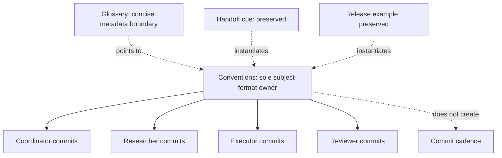

# RF — TFW-50: Minimal Agent Commit Attribution

> **Date**: 2026-08-05
> **Author**: Codex / Executor
> **Status**: 🟢 RF — Complete; Reviewer evidence pending independent review
> **Parent HL**: [HL-TFW-50](HL-TFW-50__minimal_agent_commit_attribution.md)
> **TS**: [TS TFW-50](TS__TFW-50__minimal_agent_commit_attribution.md)

---

## 1. What Was Done

### New Files

| File | Description |
|------|-------------|
| `evidence/EV__TFW-50__minimal_agent_commit_attribution.md` | Structured source, history, regression, cleanup, and no-publication evidence |
| `RF__TFW-50__minimal_agent_commit_attribution.md` | Executor result and acceptance trace |

### Modified Files

| File | Changes |
|------|---------|
| `.tfw/conventions.md` | Refined the sole normative sentence with exact `agent`, `task`, `scope`, `role`, and `summary` derivation; replaced the executor-centric example with the approved Coordinator example |
| `.tfw/glossary.md` | Refined the concise definition with first-line subject and Git author/committer metadata boundaries without duplicating the grammar |
| `ONB__TFW-50__minimal_agent_commit_attribution.md` | Recorded the revised RES/TS contract, boundaries, and Coordinator approval |
| `README.md` | Advanced TFW-50 through revised ONB to RF and linked lifecycle artifacts |

### Preserved and Verified Files

| File | Result |
|------|--------|
| `.tfw/workflows/handoff.md` | Byte-identical to `389168a`; corrected Step 4 retained |
| `.agent/workflows/tfw-handoff.md` | Byte-identical to `389168a`; unrelated Evidence drift retained |
| `.claude/commands/tfw-handoff.md` | Byte-identical to `389168a`; unrelated Evidence drift retained |
| `RELEASE.md` | Byte-identical to `389168a`; attributed example and explicit push approval retained |

## 2. Key Decisions

1. Applied RES Iteration 1 C7: one universal conventions owner and one concise glossary reference, with no workflow-wide cue broadcast.
2. Kept Commit Attribution conditional on commits that occur. No per-stage, WAIT, STOP, workflow, artifact, file, or AC cadence was introduced.
3. Derived `role` from conventions §15/Role Lock and `scope` from open normalized explicit work-slice text; no maintainer/hybrid role or registry was created.
4. Preserved all four already-correct conflict-reconciliation blobs exactly and audited the wider corpus read-only instead of synchronizing for symmetry.
5. Reported history as compatibility/searchability evidence only. Explicit TFW-50 prompts and rejected TFW-49 machinery are causal confounders; Reviewer-owned completion remains pending independent review.

## 3. Acceptance Criteria

- [x] **AC-1:** Conventions are the sole normative owner; exact grammar, one sentence, and one example are present; glossary does not duplicate the grammar.
- [x] **AC-2:** Exact term derivation and subject-vs-Git-metadata/authentication boundaries are present with no registry, numeric limit, trailer, or body schema.
- [x] **AC-3:** The universal rule applies to Coordinator, Researcher, Executor, and Reviewer; corrective added-text cadence scan returned zero.
- [x] **AC-4:** Handoff and release reconciliation remains correct; all four preserve blobs are byte-identical to `389168a`; unrelated Evidence drift is unchanged.
- [x] **AC-5:** Total implementation surface is exactly six existing paths; corrective execution changed only conventions/glossary; wider corpus conflict counts are zero.
- [ ] **AC-6 Reviewer-owned completion:** Coordinator, Researcher, and Executor current-task subjects, prior Reviewer compatibility, regression, cleanup, and no-publication state are verified. The current-task Reviewer subject and independent inspection are explicitly DEFERRED to `/tfw-review`.

## 4. Verification

- Static terminology assertions: PASS — normative owner hits `1`; glossary grammar duplicates `0`; required boundaries present.
- Corrective diff: PASS — only `.tfw/conventions.md` and `.tfw/glossary.md` changed in `c7a0055..420fdbe`.
- Total implementation allowlist: PASS — six paths; unexpected `0`; missing `0`; new implementation files `0`.
- Preserve blobs: PASS — `4/4` equal their `389168a` hashes.
- Wider corpus audit: PASS — commit-family hits `12`; push-family hits `6`; automatic-push conflicts `0`; subject conflicts `0`; hybrid subject roles `0`.
- Commit range before EV/RF: PASS — `14` subjects in `bc6779e..HEAD`; regex-invalid `0`.
- Docs unit tests: PASS — `55 passed in 1.45s`.
- Docs integration/MkDocs build: PASS — `13 passed in 91.22s`.
- Generated-path cleanup: PASS — only newly generated `.pytest_cache/`, `docs/scripts/__pycache__/`, and `site/` removed; ignored user files preserved.
- Protected Git state: PASS — hooksPath unset, legacy hook absent, `origin/master` unchanged, no history rewrite.
- Build gate: PASS — integration suite completed the real MkDocs build.

## 5. Evidence

See [EV file](evidence/EV__TFW-50__minimal_agent_commit_attribution.md) for evidence details.

Evidence verdict: 0/6 VERIFIED, 1 DEFERRED, 0 BLOCKED, 5 N/A

The DEFERRED item is solely the current-task Reviewer commit and independent inspection; it is not N/A and must be resolved by `/tfw-review`.

## 6. Observations (out-of-scope, not modified)

| # | File | Line(s) | Type | Description |
|---|------|---------|------|-------------|
| 1 | `.tfw/workflows/docs.md`, `.agent/workflows/tfw-docs.md`, `.claude/commands/tfw-docs.md` | 7 | naming | Role headers say `Coordinator / Reviewer`, while conventions §15 assigns docs workflow ownership to Coordinator. No hybrid commit subject exists; cleanup is outside TFW-50. |
| 2 | `.tfw/workflows/release.md`, `.agent/workflows/tfw-release.md`, `.claude/commands/tfw-release.md` | 7 | naming | Role headers say `Coordinator / Maintainer`, while conventions §15 and the active release subject use `coordinator`. No `maintainer` subject role exists; cleanup is outside TFW-50. |

## 7. Fact Candidates

| # | Category | Candidate | Source | Confidence |
|---|----------|-----------|--------|------------|
| 1 | process | Commit Attribution must cover every commit-producing TFW role, including Researcher; an Executor/handoff-only consumer model is incorrect. | User correction, TFW-50 resumed execution | High |
| 2 | constraint | TFW-50 formats subjects of commits that occur and must not introduce per-stage, per-WAIT, per-STOP, per-workflow, or per-artifact commit cadence. | User correction, TFW-50 RES Iteration 1 delegation | High |

> fact-candidates: processed 2026-08-05

## 8. Strategic Insights (Execution)

| # | Insight | Category | Source |
|---|---------|----------|--------|
| S1 | Universal applicability through an always-loaded owner can cover all roles without copying cues into every workflow. The implication is that completeness should be measured against behavior and ownership, not symmetric file edits. | convention | User correction and revised TS/RES |
| S2 | Subject formatting and commit timing are separate policies. Future workflow changes must not infer lifecycle cadence from the existence of Commit Attribution. | constraint | User correction and revised TS/RES |
| S3 | Prompted compliant history demonstrates compatibility and searchability, not causation or authentication. Verification should always disclose prompt and prior-mechanism confounders. | process | User evidence boundary, revised TS/RES |

## 9. Diagrams

---

*RF — TFW-50: Minimal Agent Commit Attribution | 2026-08-05*
