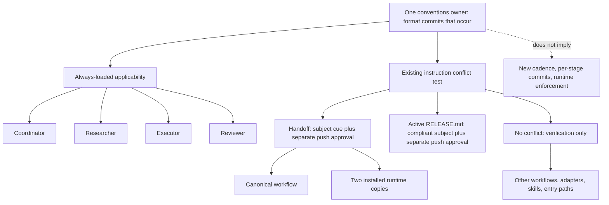

# RES — TFW-50: Minimal Agent Commit Attribution

> **Date**: 2026-08-05
> **Author**: Codex / Researcher
> **Status**: 🔬 RES — Complete
> **Parent HL**: [HL-TFW-50](../../HL-TFW-50__minimal_agent_commit_attribution.md)
> **Mode**: Pipeline / Focused

---

## Research Context

TFW-50 was reopened because the first consumer model treated Executor/handoff as representative, while real local history contains commits authored under Coordinator, Researcher, Executor, and Reviewer roles. This bounded iteration inventoried every current workflow, adapter, installed copy, and skill with commit relevance; separated the semantic owner, conflicting point-of-use text, always-loaded references, and derived copies; challenged three placement strategies plus a universal-rule alternative; and used only the official Git commit documentation needed to define the metadata boundary. It did not implement changes or prescribe new commit timing.

## Briefing

[1_briefing.md](1_briefing.md) fixed three questions: which consumers really create commits, which terms make the subject precise without implying identity proof, and which configuration is the smallest complete one. [2_gather.md](2_gather.md) records the grouped `rg` inventory and current history; [3_extract.md](3_extract.md) exposes the candidate configuration space; [4_challenge.md](4_challenge.md) rejects the Extract cadence expansion and selects C7.

## Decisions

| # | Decision | Rationale |
|---|----------|-----------|
| D1 | Select **C7: one universal conventions owner, one concise glossary entry, and reconciliation only where current text conflicts or overrides the universal rule** | Every supported role path loads conventions. Applicability therefore covers Coordinator, Researcher, Executor, and Reviewer without duplicated workflow cues |
| D2 | TFW-50 formats commits that occur; it does **not** create a commit-cadence policy | A subject rule and a requirement to commit at a particular WAIT, STOP, stage, or artifact boundary are independent. The latter is not authorized by TFW-50 |
| D3 | Keep the existing six-path implementation allowlist | Four semantic placements are required: conventions, glossary, the handoff conflict, and active release guidance. The two installed handoff files are mechanically required runtime copies of the same conflict |
| D4 | Refine terminology only in `.tfw/conventions.md` and `.tfw/glossary.md`; preserve and verify the other four paths | Current conventions leave `scope` and `role` derivation too implicit; the glossary should expressly separate subject attribution from Git author/committer metadata and authentication. Handoff and release conflicts are already correctly reconciled |
| D5 | Treat other workflows, adapters, installed copies, and skills as verification-only consumers | They either inherit the always-loaded owner, set grouping/inclusion without conflicting subject text, or derive behavior from an unchanged canonical source |
| D6 | Derive `role` from canonical TFW workflow ownership and Role Lock, never from hybrid or maintainer labels | Conventions §15 recognizes only `coordinator`, `researcher`, `executor`, and `reviewer`; docs/release label drift must not invent a fifth value |
| D7 | Treat `scope` as normalized explicit work-slice text, not a closed registry | Real history uses task, phase, iteration, docs, knowledge, and other explicit slices; an open derivation is both precise and extensible without runtime/config enforcement |
| D8 | Treat current all-role history as applicability evidence, not causal proof | Explicit delegation prompts and rejected TFW-49 mechanisms confound why the commits complied. The subjects remain declared trace context, not authenticated identity |

## Exact Terminology Contract

The official [`git-commit`](https://git-scm.com/docs/git-commit) documentation distinguishes commit message text from author and committer information and warns that recorded names do not authenticate a person. TFW Commit Attribution operates only in the first-line subject text.

| Term | Exact definition for HL/TS |
|------|----------------------------|
| **Commit Attribution** | A declared structured prefix in the first-line subject of an AI-authored commit. It supplies searchable trace context; it neither changes nor authenticates Git author/committer metadata and is not actor authentication |
| `agent` | The normalized lowercase AI product name from explicit session context, such as `codex` or `claude`; not a person, account, model version, Git author, Git committer, or hosting actor |
| `task` | The canonical TFW task ID; use `project` only when the current work genuinely has no task |
| `scope` / work slice | The established lowercase explicit work-slice slug, or otherwise a lowercase hyphenated form of the explicit work-slice label. It is open normalized text, not a closed registry |
| `role` | The lowercase canonical TFW workflow owner from conventions §15, confirmed by an inline Role Lock where present: `coordinator`, `researcher`, `executor`, or `reviewer` |
| `summary` | The short imperative remainder of the one-line subject after one space; no numeric length protocol, required trailer, or body schema |

Recommended sole normative wording:

> Every AI-authored commit MUST use `[agent/task/scope/role] summary`: set `agent` to the normalized lowercase AI product name from explicit context, `task` to the canonical TFW task ID (`project` only when none exists), `scope` to the established lowercase explicit work-slice slug or otherwise a lowercase hyphenated form of its explicit label, and `role` to the lowercase canonical TFW workflow owner from §15/Role Lock; keep `summary` short and imperative, commit locally, and push only after explicit user approval.

## Evidence Synthesis

### Commit-producing role/workflow matrix

| Role | Canonical ownership and real write surface | Existing commit semantics | Lifecycle evidence | TFW-50 implication |
|------|--------------------------------------------|---------------------------|--------------------|--------------------|
| Coordinator | `/tfw-plan`; `/tfw-docs`, `/tfw-knowledge`, `/tfw-release`, `/tfw-init`, `/tfw-update`, `/tfw-config`; resume delegates writes to plan | Docs contains an explicit grouped task-commit instruction; release guidance contains a commit action; other workflow writes do not establish a uniform mandatory cadence | 18 marked Coordinator subjects across local/all-ref history, including TFW-50 `9aaf1f9` and `056378a`, plus docs/knowledge scopes | Universal applicability; retain only release conflict reconciliation. All other Coordinator workflows are verification-only |
| Researcher | `/tfw-research` writes Briefing, Gather, Extract, Challenge, and RES | Canonical research requires stage files before WAIT but does not itself require a Git commit at every stage | Four TFW-50 stage commits before RES: `8a190d5`, `ad16b1a`, `5035ab3`, `027dc73` | Researcher is covered by the universal rule. The delegation-required stage commits prove expressibility, not canonical per-stage cadence |
| Executor | `/tfw-handoff` writes ONB, implementation/evidence, and RF | Conventions already say Executor makes incremental commits; handoff explicitly commits ONB | 13 marked Executor subjects, including TFW-50 `c204f8a`, `46fe8b1`, and `389168a` | Preserve the corrected handoff cue and its two installed runtime copies; do not add commit-per-artifact behavior |
| Reviewer | `/tfw-review` writes Map, Verify, Judge, REVIEW, triage, and Reviewer-owned board updates | Canonical review requires stage/final traces but does not itself require a Git commit after every stage | Five marked Reviewer subjects in TFW-49, including `929c489`, `0f23362`, `9d7e702`, `1ebb680`, and `3935c53` | Universal applicability covers Reviewer. Prior TFW-49 machinery is a causal confounder and is not restored |

The grouped inventory covered 72 current framework/adapter/workflow/skill paths plus root entry files and `RELEASE.md`. Literal positive commit instructions reduce to four families: handoff, docs, active release guidance, and the Codex adapter installation note. Only handoff and active release guidance contradicted or overrode the universal subject/push rule.

### Configuration comparison

| Configuration | Semantic placements | Mechanical copies | Completeness under actual context contract | Verdict |
|---------------|---------------------|-------------------|--------------------------------------------|---------|
| C1 canonical-only from the pre-TFW-50 baseline | Conventions + glossary | None | All roles load it, but old handoff coupled commit+push and old `RELEASE.md` overrode the subject | Reject baseline; retaining current reconciliations turns it into C7 |
| C4 one owner + cues at every literal commit action | Owner, glossary, handoff, docs, release, Codex install | Handoff and docs copies | Complete, but docs and Codex install only set grouping/inclusion and do not conflict | Reject as dominated by C7 |
| C3 cue in every role workflow | Owner, glossary, plan, research, handoff, review | Role-workflow copies | Duplicates reminders despite mandatory conventions loading and still does not justify lifecycle workflow treatment | Reject as redundant/asymmetric |
| C7 universal applicability + conflict reconciliation | Owner, glossary, handoff, release = **4 semantic placements** | Two installed handoff copies | Covers all four roles, resolves every actual contradiction, adds no cadence | **Select** |

The 14-semantic-placement/20-copy/three-phase Extract candidate is not a fourth viable implementation: it converts possible commit checkpoints into new mandatory cadence. Mechanical symmetry does not justify its cost or risk.

## Open Questions

| # | Question | Status | Answer |
|---|----------|--------|--------|
| O1 | Does TFW-50 need another research iteration? | Closed | No. The bounded hypotheses, inventory, terminology, alternatives, and confounders are sufficient for HL/TS revision |
| O2 | Must docs/release role-label drift be fixed in TFW-50? | Closed | No broad cleanup. Canonical ownership makes the AI value `coordinator`; verify that no subject uses `reviewer`, `maintainer`, or a hybrid. Normalize labels only in separate approved work if an error or explicit demand appears |
| O3 | Should Researcher/Reviewer stage commits become canonical requirements? | Outside TFW-50 | No decision here. Commit cadence requires separate evidence, scope, and approval |

## Hypotheses (from HL §10)

| # | Hypothesis | HL Status | RES Status | Evidence |
|---|------------|-----------|------------|----------|
| H1 | One canonical owner plus cues only at actual commit actions is sufficient across all roles | needs research | 🟢 Refined and supported | One owner is sufficient for universal applicability; point-of-use edits are required only where current text contradicts or overrides it, not at every possible commit action |
| H2 | `[agent/task/scope/role] summary` uses the smallest precise term set for the user's searches | needs terminology challenge | 🟢 Supported with terminology refinement | Five subject components are sufficient when `scope` is open normalized work-slice text and `role` derives from canonical ownership/Role Lock |
| H3 | Role workflows, lifecycle workflows, and installed adapter copies form distinct consumer classes and should not be treated as one flat sync list | needs inventory | 🟢 Supported | The inventory distinguishes semantic owner, conflict point, always-loaded reference, and derived runtime copy; each has a different edit obligation |
| H4 | Prompt compliance is sufficient for readable declared context when authentication and automated enforcement are explicitly out of scope | bounded claim; needs cross-role evidence | 🟡 Bounded support; non-causal | All four roles have readable marked subjects, but explicit delegation prompts and prior TFW-49 mechanisms confound causal attribution. No claim of guaranteed compliance, authentication, or actor detection is supported |

## HL Update Recommendations

| # | What to update | Source |
|---|---------------|--------|
| HL1 | Replace §3's provisional consumer-scope challenge with D1/D3: the existing six paths are the final sufficient allowlist under C7 | D1, D3; Challenge C2, C4, C6, C7 |
| HL2 | Refine the §3 terminology table and sole rule using the exact definitions above, especially normalized explicit work-slice `scope`, canonical-owner/Role-Lock `role`, and the Git metadata/authentication boundary | D4, D6, D7; Extract E2; Challenge C5 |
| HL3 | State expressly that TFW-50 governs commit subject format only and creates no per-stage, per-STOP, per-workflow, or per-artifact commit requirement | D2; Challenge C1 |
| HL4 | Keep the one bounded phase and six-file DoF; remove any implication that 20 installed-copy edits or three phases are needed | D3, D5; Challenge C6 |
| HL5 | Update H1-H4 and risks: H4 is bounded/non-causal, current all-role history is compatibility evidence, and explicit prompts/prior mechanisms are confounders | D8; Challenge C3, C8 |
| HL6 | Record docs/release role-label drift as a verification precision point, not as a broad role-cleanup branch | D6; Challenge C5 |

## TS Recommendation

Use one bounded, reviewable change with the following exact inventory. No new implementation file or phase is needed.

### Minimum normative core

| Path | Disposition | Required TS treatment |
|------|-------------|-----------------------|
| `.tfw/conventions.md` | **MODIFY** | Refine the existing sole sentence so all five terms have the exact derivation above; keep one example and the local-commit/explicit-push boundary |
| `.tfw/glossary.md` | **MODIFY minimally** | Keep one concise definition and link to conventions; add the express separation from Git author/committer metadata and authentication without duplicating the grammar |

### Minimum conflict-reconciliation surface

| Path | Disposition | Required TS treatment |
|------|-------------|-----------------------|
| `.tfw/workflows/handoff.md` | **PRESERVE + VERIFY** | Keep the corrected ONB attribution cue and explicit push approval; add no checkpoint or cadence instruction |
| `.agent/workflows/tfw-handoff.md` | **PRESERVE + VERIFY derived copy** | Keep the same Step 4 correction and preserve all unrelated Evidence drift |
| `.claude/commands/tfw-handoff.md` | **PRESERVE + VERIFY derived copy** | Keep the same Step 4 correction and preserve all unrelated Evidence drift |
| `RELEASE.md` | **PRESERVE + VERIFY** | Keep the compliant release example and explicit push approval |

### Add/exclude boundary

| Group | Disposition | Reason |
|-------|-------------|--------|
| All other canonical workflows, including plan, research, review, resume, docs, knowledge, release, init, update, and config | **EXCLUDE from edits; VERIFY** | They inherit conventions and contain no independent conflicting subject/push rule. Docs grouping and canonical release workflow text do not establish an override |
| `.agent/workflows/*` and `.claude/commands/*` other than handoff | **EXCLUDE from edits; VERIFY** | No changed canonical runtime text or preserved contradiction; do not sync for symmetry |
| `.tfw/adapters/codex/README.md` | **EXCLUDE from edits; VERIFY** | “Commit skills with the project” governs inclusion, not subject syntax or push authority |
| `.tfw/adapters/codex/skills/tfw-*/SKILL.md` and `.agents/skills/tfw-*/SKILL.md` | **EXCLUDE from edits; VERIFY** | Thin routers already load conventions and canonical workflows; source/installed pairs are equal |
| Root entry prompts/rules and other adapter entry templates | **EXCLUDE from edits; VERIFY** | They make conventions always loaded and own no commit action |
| Docs/release role labels and their installed copies | **EXCLUDE from TFW-50 edits; VERIFY value** | Canonical §15 precedence makes the AI role `coordinator`; do not invent `maintainer` or a hybrid role |
| `tfw-task`, templates, project/state config, registries, manifests, schemas, hooks, Git config, Python/scripts, validators, runtime tests, version files, and historical task artifacts | **EXCLUDE** | Stale/delegating or non-consumer surfaces, or prohibited runtime/config/history expansion |
| New files | **ADD none** | The six-path allowlist remains sufficient |

TS acceptance should verify the exact terminology, byte-stable preservation of the four conflict-reconciliation files unless a contradiction is found, absence of conflicting subject/automatic-push text across the verification-only corpus, representative marked subjects for all four roles, preservation of unrelated handoff drift, no new cadence, and no remote action. Representative history validates format coverage only; it must not be presented as proof that the conventions sentence caused compliance.

Optional future work, explicitly outside TFW-50, may study Researcher stage-versus-iteration commits, Reviewer stage-versus-final commits, Coordinator workflow closure commits, Executor coherent-slice grouping, and docs/knowledge grouping. None is decided by Commit Attribution.

## Fact Candidates

> **Cognitive mode:** Pure reporting — these are human-supplied project statements, not agent-discoverable inventory findings.

| # | Category | Candidate | Source | Confidence |
|---|----------|-----------|--------|------------|
| FC1 | process | Local commits in TFW are made by all TFW roles, including the Researcher; an Executor/handoff-only consumer model is incorrect | User correction, TFW-50 research delegation | ★★★ |
| FC2 | constraint | TFW-50 is a commit-subject formatting task and must not introduce new commit frequency, per-stage commits, or commit-per-artifact behavior | User Challenge correction, TFW-50 Iteration 1 | ★★★ |

## Strategic Insights (Research)

| # | Category | Insight | Source | Confidence |
|---|----------|---------|--------|------------|
| SS1 | convention | Universal applicability can cover every role through the always-loaded owner; role coverage does not by itself justify duplicated workflow cues. This makes behavior, not repeated file presence, the completeness test | User, Challenge constraints 2-4 | ★★★ |
| SS2 | constraint | A formatting rule can silently become lifecycle policy if action cues are written as mandatory checkpoints. Future TS wording must keep the conditional “when a workflow commits” boundary explicit | User, Challenge constraint 1 | ★★★ |
| SS3 | philosophy | “Minimum complete” is not the fewest files in the abstract; after consumer classes and the actual context contract are modeled, it can legitimately be the smaller six-path surface | User, original goal and Challenge constraints 3, 6 | ★★★ |
| SS4 | process | Observed compliance is useful compatibility evidence but explicit prompts prevent a causal claim about prompt architecture. Verification should report that confounder instead of overstating reliability | User, Challenge constraint 3 and synthesis approval | ★★★ |

## Findings Map

## Iteration Status

- **Iteration:** 1 of 1 (min) / 1 (max)
- **Hypotheses tested:** H1 (refined and supported), H2 (supported with terminology refinement), H3 (supported), H4 (bounded support; non-causal)
- **Hypotheses deferred:** None
- **Gaps discovered:** Causal effectiveness cannot be inferred from the current prompted history; docs/release role-label drift remains a known verification-only precision issue; canonical commit cadence is intentionally unanswered because it is outside TFW-50
- **Superseded decisions:** D1/D2 supersede provisional Extract C2/E3, which incorrectly treated possible commit checkpoints as mandatory TFW-50 cadence; D3 supersedes Extract's 20-copy, three-phase inventory

### Open Threads (for next iteration)

No open threads. Remaining work is Coordinator-owned HL/TS revision and verification, not another research iteration.

### Recommendation

- [x] **SUFFICIENT** — proceed to `/tfw-plan` to update HL and write TS
- [ ] **MORE NEEDED**
- [ ] **BLOCKED**

> ⚠️ Coordinator decides whether to continue or proceed. Researcher recommends but does NOT decide.

## Conclusion

Iteration 1 establishes that universal applicability, not duplicated role cues, is the correct completeness mechanism for Commit Attribution. The smallest complete future TS retains the six existing paths: refine only conventions and glossary terminology, preserve and verify the four already-correct conflict reconciliations, and treat every other workflow/adapter/skill as verification-only. The strongest research correction was negative: Extract initially expanded attribution into per-stage and per-workflow cadence plus 20 mechanical copy edits; Challenge separated those policies and removed the unsupported scope. The result is complete for all four roles while remaining explicit that local history demonstrates expressibility and searchability, not causation, authentication, or guaranteed compliance.

---

*RES — TFW-50: Minimal Agent Commit Attribution | 2026-08-05*
