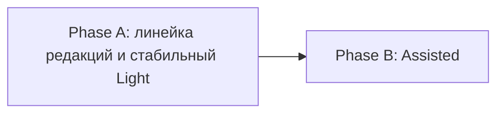

# HL — TFW-52: TFW Editions — Light и Assisted

> **Date**: 2026-08-08
> **Author**: Coordinator
> **Status**: ✅ HL_APPROVED — rev. 2 (post-RESEARCH), одобрена владельцем 2026-08-08

### Amendment log

| Rev | Дата | Что изменилось | Основание |
|---|---|---|---|
| 1 | 2026-08-08 | Исходный HL: лестница из четырёх редакций Light → Assisted → Team → Full; еженедельная консолидация памяти внутри Assisted; девять гипотез со статусом `needs-research` | Одобрен владельцем до RESEARCH |
| 2 | 2026-08-08 | Три редакции вместо четырёх: Team выведен из TFW-52 целиком. Периодическая консолидация памяти вынесена в отдельную будущую задачу — TFW-52 строит только основу. Гарантийный язык сужен по итогам трёх итераций. Добавлена проверка сохранности при переходе Light → Assisted. Зафиксировано превышение бюджета Phase B | RESEARCH iter1–3; решения владельца от 2026-08-08 |
| 3 | 2026-08-13 | Закрытие задачи. Добавлен §0 с контекстом закрытия: полевая проверка владельцем, отказ от REVIEW Phase B, фактическое состояние evidence, производная редакция `innoforce_starter`, отложенная локализация | Решение владельца от 2026-08-13 |

Предыдущая редакция HL заменена целиком. Её содержание восстанавливается из этого журнала, `research/iter1–3/RES.md` и §10.

---

## 0. Closure Context

TFW-52 закрыта владельцем 2026-08-13 как успешная. Закрытие опирается на полевую проверку, а не на формальную приёмку, поэтому обе стороны фиксируются раздельно.

**Что владелец подтвердил лично.** Обе редакции проверены на живом курсе с реальными людьми: незнакомые с методом участники разворачивали пакет в своём проекте и выполняли прикладные не-кодовые задачи. Владелец оценивает результат как успешный и удобный. Из этой практики выросла производная редакция для организации — см. ниже.

**REVIEW Phase B не выполняется — явное решение владельца.** Основание: продукт проверен в реальном использовании с людьми, что для этой задачи владелец считает сильнее документарной приёмки. Артефакт REVIEW не реконструируется после факта. Это исключение, а не новая норма: precedent TFW-51 и это закрытие остаются двумя owner-authorized исключениями.

**Фактическое состояние evidence Phase B — 3 VERIFIED / 1 BLOCKED / 7 DEFERRED.** Оно сохраняется как есть и не переписывается под итог:

- **VERIFIED:** AC-1 самостоятельный запуск пакета, AC-5 разрешение корня без Git (четыре фикстуры), AC-11 видимый ручной режим.
- **BLOCKED:** AC-2 — определения и обработчики существуют и проходят детерминированные фикстуры, но в проверенных сборках Codex Desktop проектные hooks не дали устойчивой доставки событий. Требуется исправление на стороне рантайма.
- **DEFERRED:** AC-3, AC-4, AC-6, AC-7, AC-9, AC-10 — контракт и структура проверены статически, живые прогоны не выполнены. **AC-8 (контрольное сравнение Light и Assisted) не выполнялся.**

**Что из этого следует для формулировок.** Assisted поставляется как рабочий пакет с честным ручным режимом: `README.md` содержит точную фразу «Проверки Assisted недоступны; работаю по ручному порядку» и выполнимый ручной порядок, поэтому DoF 3 не срабатывает — редакция не обещает работающих hooks. Но заявлять измеренное преимущество Assisted над Light **нельзя**: AC-8 не выполнен, и подтверждение остаётся полевым наблюдением владельца, а не замером. Автоматическое удержание дисциплины через hooks остаётся непроверенным на доступном рантайме.

**Производная редакция `innoforce_starter`.** В организации владельца из Assisted выросла рабочая версия: `D:\projects\research\innoforce-ai-first\tasks\INNO-13__day1_lecture_pedagogy_rework\phase-d\innoforce_starter`. Она сохраняет ядро Assisted (`AGENTS.md`, `PROJECT.md`, `MIGRATION.md`, `people/`, `knowledge/`, `.codex/hooks.json` и оба обработчика) и добавляет то, что потребовала реальная эксплуатация:

| Что добавлено | Зачем понадобилось |
|---|---|
| `VERSION`, `CHANGELOG.md` | Версионирование самого стартового набора внутри организации |
| `.agents/skills/tfw-plan/`, `tfw-update/` | Два репозиторно-локальных skill вместо полного набора workflow |
| `knowledge/records/` с четырьмя заполненными записями — кто мы, чем занимаемся, как мы работаем, цели и ценности | Организационная память существует до первой задачи, а не появляется из неё |
| `шаблоны/` — документ A4, заметка, план работы, презентация, `build_a4.py`, логотип | Оформление результатов в фирменном виде оказалось частью полезного результата |

Файл в репозиторий TFW не копируется: это артефакт другого проекта. Здесь сохраняется путь и перечень отличий как полевые данные для будущего развития Assisted. Четыре добавленных механизма — кандидаты в саму редакцию, но каждый требует отдельного решения, а не автоматического переноса.

**Отложенная работа, зафиксированная как долг.** Пользовательский слой обеих редакций написан по-русски, поскольку делался под курс. Репозиторий публичный и ведётся на английском, `tfw.content_language` = `en`, поэтому направление решено: **английский заменяет русский в `editions/`**, без параллельных RU- и EN-вариантов. Русский оригинал Light остаётся замороженным полевым baseline в `tasks/TFW-51__tfw_light_ru/tfw-light-ru/`; у Assisted архивной русской копии нет, и задача локализации обязана сохранить проверенные на курсе формулировки прежде, чем заменять их. Работа не планируется в TFW-52.

Локализация, непроверенный рантайм hooks, шесть отложенных полос проверки, невыполненное сравнение Light/Assisted и расхождение с `innoforce_starter` зафиксированы в `TECH_DEBT.md` как TD-126 – TD-130. Ни один из них не считается закрытым фактом закрытия задачи.

> `tfw-docs`: Applied 2026-08-13 — обновлены `KNOWLEDGE.md` §1 (строка Editions, решения D58–D60), §2 (запись TFW-52/B), §3 (четыре снятые концепции) и `TECH_DEBT.md` (TD-126 – TD-130, закрыт TD-125). Маркер размещён здесь, а не в REVIEW, поскольку REVIEW Phase B отменён владельцем.
> `tfw-knowledge`: Pending — в RF Phase B пять fact candidates, три из них о поведении агента. Консолидация выполняется отдельно через `/tfw-knowledge`.

---

## 1. Vision

У TFW появляются два простых входа и одна существующая полная конечная точка:

- **Light** — четыре коротких файла, которые учат вручную удерживать цель, план от результата, след работы и полезное знание;
- **Assisted** — та же понятная работа, но структура папок и Codex hooks снимают рутину, которую человек и агент забывают делать сами;
- **Full** — существующая `.tfw/` для долгих, межфункциональных и высокорисковых проектов.

Человек выбирает не «свой уровень умности», а минимальную дисциплину под сложность и цену ошибки конкретной работы. Один и тот же человек берёт Light для разовой задачи, Assisted для повторяющегося процесса и Full для высокорискового проекта. В обучении та же линейка показывает эволюцию метода: сначала человек делает реальную задачу вручную и замечает предел ручной дисциплины, затем следующая редакция тихо автоматизирует именно те отказы, которые он наблюдал.

Метод одинаково применим к документам, финансам, аналитике, образованию, исследованиям и управлению. Он ориентирует ИИ на полезный результат пользователя, а не на механическое исполнение формулировки запроса.

**Impact:** TFW можно объяснить за один семинар, внедрять на разных уровнях организации и применять вне разработки. Переход между редакциями не требует начинать проект заново.

> «Я выбираю понятную мне редакцию, копирую её в свой проект и начинаю работу. ИИ думает от моей цели назад, не теряет следы и не заставляет меня обслуживать методологию».

## 2. Current State (As-Is)

TFW-51 создал четырёхфайловый русскоязычный прототип. Он успешно сработал на живом семинаре: незнакомые с методом люди сразу начали выполнять прикладные задачи. Эксперимент подтвердил ценность ядра и выявил повторяемые отказы.

| Область | Что подтверждено | Что не работает само |
|---|---|---|
| Вход | Нескольких коротких файлов достаточно, чтобы изменить поведение ИИ | Codex не всегда подхватывает `AGENTS.md` — при неверно открытом корне или старой сессии |
| Задача | Отдельный trace помогает не терять ход работы | Агент забывает создать или обновить trace и переместить задачу по статусам |
| Память | Следы отдельных задач сохраняют доказательства и решения | Нет одной понятной карты долговечной памяти; знание остаётся запертым внутри задач |
| Обслуживание | Ручная память понятна как учебная модель | Автоматическая периодическая консолидация оказалась самостоятельной сложной системой |
| Один участник | Личный проект не требует ролевой церемонии | Запрос имени там, где человек один, создаёт бессмысленное трение |
| Несколько участников | Отдельные папки задач позволяют работать параллельно | Общие изменяемые task list, identity, trace и index конфликтуют в синхронизируемой папке |
| Риски | Большинство рабочих фактов можно сохранять без вопросов | Секреты, медицинские и персональные сведения нельзя тихо переносить в общую память |
| Обучение | Light хорошо объясняет базовую философию | Между четырьмя файлами и полной TFW нет готовой промежуточной ступени |

Три итерации RESEARCH не опровергли замысел, но сузили обещания:

- `SessionStart`, `PreCompact` и `Stop` существуют, однако наличие события не означает, что adapter установлен, доверен и проверен;
- отдельного надёжного события «содержательная задача началась» не существует: trace ведёт агент, hooks проверяют наблюдаемое состояние;
- `AGENTS.md` и hook contract зависят от корня и версии, а после изменения контракта нужна новая сессия;
- локальная привязка профиля даёт заявленную атрибуцию, но не аутентификацию человека;
- синхронизируемая папка не база данных: общий lease не становится строгим lock, безопасность даёт разделение путей записи;
- shared knowledge candidate уже пересекает границу общей памяти — проверка риска нужна до его записи, а не при последующей обработке;
- отдельные Codex tasks/sessions дают разделение контекста, но не доказывают независимые permissions, identity или authority;
- cadence, promotion, pruning, deduplication, recovery и разрешение конфликтов консолидации образуют отдельную систему со своими гарантиями.

Следствие: направление исходного HL верно. После RESEARCH меняются не цели, а гарантийный язык, граница Team и объём работы с памятью.

## 3. Target State (To-Be)

### 3.1 Result Visualization

Пользователь после TFW-52 видит не архитектуру, а три понятных выбора:

```text
┌─ Хочу быстро начать и понять метод ────────────────────┐
│  копирую содержимое editions/01-light/ в свой проект   │
│  README · AGENTS · TASKS · memory/PROJECT              │
│  работаю руками, вижу цену забывания                   │
└────────────────────────────────────────────────────────┘
                          │  заметил предел ручной дисциплины
                          ▼
┌─ Работа повторяется, участников больше одного ─────────┐
│  копирую содержимое editions/02-assisted/              │
│  hooks удерживают trace, статус и владельца            │
│  work/new|doing|review|done|blocked = статус папкой    │
│  knowledge/ = основа памяти проекта                    │
└────────────────────────────────────────────────────────┘
                          │  нужны research, evidence, review, gates
                          ▼
┌─ Долгий или высокорисковый проект ─────────────────────┐
│  использую существующую .tfw/  (не меняется в TFW-52)  │
└────────────────────────────────────────────────────────┘
```

Как выглядит обычное завершение задачи в Assisted:

> «Результат сохранён в `work/review/20260808-1015__anna__audit-documents/`, trace и статус согласованы. Записан один кандидат знания. Периодическая консолидация памяти в этой редакции пока не автоматизирована. Вопросов нет».

Как выглядит единственный случай, когда система прерывает работу вопросом:

> «В выводе есть медицинские персональные данные. Сохранить в общей памяти только обезличенный вывод? Да / нет».

### 3.2 Продуктовая линейка

| Редакция | Рабочий контекст | Что человек проживает в обучении | Что получает | Статус в TFW-52 |
|---|---|---|---|---|
| **Light** | Разовая, учебная или исследовательская работа одного человека | Делает реальную задачу вручную и видит ценность цели, плана, следа и памяти — вместе с ценой забывания | Четыре коротких файла и видимые ручные действия | Стабилизировать из TFW-51 |
| **Assisted** | Повторяющаяся работа человека или 2–3 участников в Codex | Видит, как структура и hooks снимают рутину, не забирая контроль | Hooks, статусные папки, идентичность, task-local traces, подготовленная память | **Главный продукт TFW-52** |
| **Full** | Долгие, межфункциональные, регулируемые или высокорисковые проекты | Видит полный HL → RES → TS → ONB → RF → REVIEW, evidence и knowledge loop | Существующая agent-agnostic и domain-agnostic `.tfw/` | Не изменяется |

Редакция описывает **сложность работы, а не зрелость человека**. Руководителю не обязательно брать Full для личного анализа, аналитику не обязательно оставаться на Light для высокорискового исследования. Это продуктовый принцип выбора, а не заявление об измеренной понятности для всех подразделений: RESEARCH такую понятность не измерял.

Образовательная последовательность сохраняет схему **опыт → название механизма → закрепление → следующий уровень**, но не объявляется единственно верной. Для подготовленной аудитории допустима короткая ориентация до опыта. Каждая ступень заканчивается самостоятельным рабочим результатом, а не рассказом о будущей ступени.

### 3.3 Граница Team

**Team не входит в TFW-52 ни как редакция, ни как режим, ни как фаза.**

RESEARCH iteration 3 проверил гипотезу отдельной ступени и вернул отрицательный результат: отдельные Codex tasks дают наблюдаемую persistence и маршрутизацию, но не дают независимых permissions, identity или authority, а разделение coordinator/executor/reviewer не показало измеримого преимущества над обычными subagents. Шесть проверок (делегированное исполнение, независимый review, восстановление после брошенной роли, безопасность параллельной записи без Git, сравнение с контролем, миграция в Full) остались невыполненными.

Организация работы — это **отдельная ось режима, наравне с `CL`/`AG`**, а не редакция:

| Ось | Значения | Что определяет | Где определяется |
|---|---|---|---|
| Полномочия ИИ | `CL` / `AG` | Может ли ИИ действовать автономно в утверждённой области | Существует сегодня |
| Организация работы | одна сессия / несколько ролей | Работает одна основная сессия или разделённые роли | **TFW-54**, отдельная задача |

Assisted в TFW-52 поставляется с одной рабочей линией. Ось организации работы проектируется в [TFW-54](../TFW-54__agent_team_mode/PROPOSAL__TFW-54__agent_team_mode.md) и после этого добавляется **и в Assisted, и в Full** как короткий раздел контракта — без отдельного пакета, второго task board, второго слоя памяти и обязательных ролевых документов.

Практическое следствие для этой задачи: приёмка Phase B **не зависит** от демонстрации ролевого разделения. Assisted обязан лишь не мешать его последующему добавлению — задачи, traces, владение и пути записи уже спроектированы так, что роль исполнителя или проверяющего можно назначить, не переделывая структуру.

### 3.4 Сквозное ядро и совместимость вверх

Редакции не являются конкурирующими методологиями. Во всех действует один рабочий цикл:

1. понять пользователя, его цель и образ готового результата; при необходимости выбрать профессиональную роль ИИ;
2. уточнить, оспорить предпосылки и согласовать критерии, если это меняет результат;
3. до содержательной работы построить короткий план от результата назад (Working Backwards);
4. во время работы сохранять источники, сомнения, решения, проверку и результат в task-local trace;
5. отделять долговечное знание от временного контекста задачи;
6. оставлять файлы так, чтобы следующий человек или ИИ продолжил работу без пересказа чата.

RESEARCH показал, что ранние версии TFW не использовали термины Working Backwards и формальное продвижение знания — исторически единого буквального ядра не было. Это не отменяет решения: с TFW-52 данный цикл сознательно вводится как **общий контракт вперёд**, а не выдаётся за неизменный исторический факт.

| Инвариант | Light | Assisted | Full |
|---|---|---|---|
| Зачем работаем | цель пользователя и образ результата | стабильный контекст в `PROJECT.md` | Vision, Project Values, HL |
| Что делаем | задача + Working Backwards plan | task folder + владелец + статус папкой | HL/TS + фазовые зависимости |
| Что произошло | один task trace | hook-поддерживаемый task trace | ONB / RF / REVIEW / evidence |
| Что узнали | ручная запись в память проекта | кандидаты, records и центральный index, готовые к будущей консолидации | полный Fact Candidate и knowledge loop |

### 3.5 Размещение и активная редакция

```text
steps-framework/
├─ editions/
│  ├─ README.md       выбор редакции, история метода, переходы
│  ├─ 01-light/       самостоятельный ручной starter-root
│  └─ 02-assisted/    самостоятельный Codex-first starter-root
├─ .tfw/              существующая Full
├─ README.md          короткий вход в линейку
└─ tasks/             след разработки самих редакций
```

Пользователь копирует **содержимое** выбранной `editions/0X-*` в корень своего проекта — поэтому `AGENTS.md` и `.codex/` оказываются именно в runtime-root. `editions/` — это источник поставки, а не вложенный рабочий каталог.

В одном пользовательском проекте активна **ровно одна редакция и версия**. Она объявляется в `PROJECT.md`. При отсутствующей или противоречивой маркировке Assisted не изменяет состояние проекта, а называет конфликт и задаёт один вопрос.

Видимый `editions/` выбран как продуктовая топология. RESEARCH подтвердил его преимущество над несколькими одновременно активными скрытыми `.tfw-*`, но не доказал превосходства над отдельными репозиториями или overlay-архитектурой — они просто не нужны текущему масштабу. `editions/03-team/` и пустые папки «на будущее» не создаются.

### 3.6 Light

Light сохраняет полевой baseline TFW-51 без изменения сути — ровно четыре входных документа:

```text
README.md            философия и запуск за 60 секунд
AGENTS.md            короткие правила для ИИ
TASKS.md             простой список задач и статусов
memory/PROJECT.md    проект, люди, договорённости, знания, решения
```

`work/<задача>/TRACE.md` появляется только при первой реальной задаче — это не пятый шаблон. Hooks, scheduler, исполняемый state и пустые будущие папки в Light отсутствуют.

Light учит четырём действиям:

1. понять человека, его цель и желаемый результат; если роль ИИ не назначена — предложить конкретную;
2. построить короткий план от результата назад;
3. вести след задачи: источники, находки, противоречия, решения, проверку, пути к результатам;
4. перенести действительно долговечное знание в память проекта.

Ручные ограничения Light описываются честно. Это не дефект, а видимая граница, которая объясняет переход к Assisted.

### 3.7 Assisted

Assisted остаётся коротким для пользователя, но добавляет небольшую служебную часть Codex:

```text
editions/02-assisted/          # после копирования — корень проекта
├─ README.md                  запуск, философия, следующий шаг
├─ AGENTS.md                  короткий поведенческий контракт ИИ
├─ PROJECT.md                 цель, редакция и версия, участники, ограничения
├─ MIGRATION.md               переход с Light: что переносится и что проверяется
├─ .codex/                    минимальные hooks и handlers
├─ people/                    по одному профилю на участника
├─ work/
│  ├─ new/  doing/  review/  done/  blocked/
└─ knowledge/
   ├─ INDEX.md                короткая центральная карта памяти
   ├─ inbox/                  независимые кандидаты знаний из traces
   └─ records/                подтверждённые долговечные записи
```

Пустые runtime-папки создаются при первом использовании, а не ради демонстрации структуры.

#### Hooks

Hooks — обязательная часть контракта Assisted. Обязательность означает их **установку, trust-review и выполненную проверку** в поддерживаемой среде, а не обещание платформы без настройки.

| Момент | Тихое действие | Когда допустим вопрос |
|---|---|---|
| Start / resume | Проверить однозначный Assisted-root и версию контракта, прочитать `PROJECT.md`, восстановить активную задачу или `none`. Чтение, знакомство с проектом и обычный разговор не создают задачу и не требуют выбора участника | Только если root, trust или версия блокируют безопасное продолжение |
| Перед первым долговечным действием | Создать или активировать task folder и `TRACE.md`; записать владельца, роль ИИ, желаемый результат, критерии и Working Backwards plan — до изменения результата или состояния проекта | Если без ответа меняется результат или риск; либо профилей несколько и нет допустимой локальной привязки |
| PreCompact | Проверить, что checkpoint уже сохранён в trace активной задачи; операция идемпотентна, `active_task = none` допустим | Не спрашивать |
| Stop | Один раз проверить trace, пути к результатам, фактический статус и решение о кандидате знания; не создавать цикл исправлений | Только если автоматическое решение небезопасно или неоднозначно |

После изменения определения hook требуется повторное доверие; после изменения `AGENTS.md` или контракта требуется новая сессия. Hooks проверяют наблюдаемое файловое состояние и поддерживают дисциплину, но не заменяют смысловую работу агента: след ведёт агент, hooks служат проверкой и страховкой. Если hooks недоступны, Assisted сообщает об этом одной короткой фразой и переходит в понятный ручной режим, не выдавая его за автоматизированный.

#### Идентичность

- один профиль выбирается автоматически — имя не спрашивается;
- при нескольких профилях повторно используется привязка на личном устройстве;
- на новом, общем, скопированном, устаревшем или несовпадающем устройстве перед первой записью авторства задаётся один короткий вопрос;
- чтение и обычный разговор не требуют выбора участника;
- общего `CURRENT_USER` в синхронизируемой папке нет;
- автоматика имеет отдельного актора и не заимствует имя человека;
- это заявленная атрибуция и происхождение записи, а не аутентификация и не доказательство полномочий.

#### Параллельная работа

- статус задачи определяется местом её папки; общего редактируемого `TASKS.md` в Assisted нет;
- одна задача и один изменяемый trace имеют одного владельца записи;
- ID задачи не зависит от общего счётчика: `YYYYMMDD-HHMM__handle__slug`;
- участники параллельно работают в разных задачах или разных путях записи;
- каждый кандидат знания создаётся отдельным файлом;
- общий итог изменяет один назначенный сборщик;
- одновременное редактирование одного общего файла без Git не обещается безопасным и не маскируется правилом «побеждает последний».

#### Память: граница TFW-52

У каждой задачи свой след, у проекта — одна короткая карта долговечной памяти:

```text
task TRACE → уникальный кандидат знания → records → центральный INDEX
```

TFW-52 создаёт эту файловую основу и правила происхождения:

- trace остаётся первичным источником и не переписывается;
- кандидат создаётся отдельным файлом, без общего счётчика;
- `records/` предназначен для подтверждённого долговечного знания;
- `INDEX.md` — короткая навигация, а не вторая копия фактов;
- **проверка риска срабатывает до записи общего кандидата**, потому что отозвать уже синхронизированный секрет невозможно;
- секреты не записываются никогда;
- медицинские, персональные, юридические, финансовые и safety-sensitive сведения не переходят в общую память без короткого явного подтверждения; при неуверенной классификации материал удерживается, а не публикуется.

TFW-52 **не проектирует и не реализует** расписание, «сны» памяти, автоматическое продвижение кандидатов, чистку, дедупликацию, протокол свежести, receipts консолидации и разрешение конфликтующих запусков. RESEARCH показал, что это отдельная система с собственными гарантиями. Она станет отдельной будущей задачей TFW — не третьей фазой этой. До неё структура обязана позволять выполнить консолидацию позднее без переделки traces, кандидатов, records и индекса.

### 3.8 Переход Light → Assisted

Обе редакции — это содержимое корня проекта, поэтому при переходе файлы сталкиваются напрямую:

| Было в Light | Стало в Assisted | Что делает Assisted |
|---|---|---|
| `README.md`, `AGENTS.md` | другие версии тех же файлов | сохраняет исходные рядом, не удаляет |
| `TASKS.md` | статус определяется папкой | переносит задачи в `work/<статус>/`; сам файл сохраняет как исходник |
| `memory/PROJECT.md` | `PROJECT.md` | переносит содержание, не переписывает смысл |
| `work/<задача>/TRACE.md` | те же traces под статусными папками | раскладывает по статусам; содержание не трогает |

Это **проверка сохранности, а не платформа миграций**. Никаких генераторов, схем, версионных матриц, движка отката и контракта совместимости. Требуется ровно три вещи: активная редакция объявлена в `PROJECT.md`; при обнаружении двух контрактов в одном корне работа останавливается до перезаписи и задаётся один понятный вопрос; `MIGRATION.md` на одну страницу описывает порядок и фиксирует, что куда перенесено.

### 3.9 Value Flow

```text
ЦЕЛЬ ПОЛЬЗОВАТЕЛЯ
      ↓
ОБРАЗ РЕЗУЛЬТАТА + КРИТЕРИИ + ПРОВЕРКА ПРЕДПОСЫЛОК
      ↓
WORKING BACKWARDS PLAN В TASK TRACE
      ↓
РАБОТА → ИСТОЧНИКИ → РЕШЕНИЯ → ПРОВЕРЯЕМЫЙ РЕЗУЛЬТАТ
      ↓                              ↓
СТАТУС = ПАПКА              УНИКАЛЬНЫЕ КАНДИДАТЫ
                                     ↓
                        RECORDS + ЦЕНТРАЛЬНЫЙ INDEX
                                     ↓
              ОТДЕЛЬНАЯ БУДУЩАЯ ЗАДАЧА: КОНСОЛИДАЦИЯ
                                     ↓
                 СЛЕДУЮЩАЯ СЕССИЯ НАЧИНАЕТ НЕ С НУЛЯ
```

## 4. Phases

### Phase Dependencies



| Phase | Depends on | Shared files | Can run in parallel with |
|---|---|---|---|
| A | Одобренный HL и завершённый RESEARCH | корневой `README.md`, `editions/README.md` | — |
| B | Фактический результат Phase A | `editions/README.md` | — |

### Phase A: линейка редакций и стабильный Light 🔴

**Deliverables:**

1. Создать `editions/README.md`: выбор редакции по характеру работы, история метода, переходы между ступенями.
2. Перенести проверенный baseline TFW-51 в `editions/01-light/`, сохранив ровно четыре входных документа.
3. Уточнить Light без изменения сути: цель пользователя, роль ИИ, Working Backwards, след, результат, знание, критическая проверка, не-кодовый язык.
4. Добавить в корневой `README.md` короткий вход в линейку и явно объяснить, что содержимое редакции копируется в корень проекта.
5. Проверить Light на двух не-кодовых сценариях: анализ противоречий в пакете документов и упрощение методички с раздаточным материалом.

### Phase B: Assisted 🟡

**Requires:** результат Phase A существует; его фактическая раскладка файлов берётся как вход.

**Deliverables:**

1. Создать `editions/02-assisted/` как самостоятельный Codex-first starter-root с коротким пользовательским слоем.
2. Реализовать и **выполнить проверки** для Start/resume, PreCompact и однократного Stop: установка и доверие, корень и версия контракта, изменённый контракт, повторный и отсутствующий вызов, видимый ручной режим при недоступности.
3. Реализовать UX идентичности: один профиль без вопроса; несколько — привязка на личном устройстве или один короткий выбор; автоматика отдельным актором; никаких заявлений об аутентификации.
4. Реализовать статусные папки, владение задачей, ID без общего счётчика, разные пути записи и одного сборщика общего итога.
5. Создать структуру памяти traces → кандидаты → records → `INDEX.md` вместе с проверкой риска до записи кандидата; периодическую консолидацию не реализовывать.
6. Реализовать переход Light → Assisted по §3.8: объявление активной редакции, остановка при двух контрактах, `MIGRATION.md`.
7. Проверить работу одного участника и работу 2–3 участников через синхронизируемую папку без Git: разные задачи, traces, кандидаты и пути записи.
8. Подготовить короткие инструкции копирования, установки hooks, работы в ручном режиме и восстановления после прерывания.

**Budget note.** По оценке Phase B создаёт 10–13 новых файлов при `tfw.scope_budgets.max_new_files: 8` и укладывается в `max_files_per_phase: 14`. Превышение известно заранее и относится к количеству файлов стартового пакета, а не к сложности решения. TS для Phase B обязан либо нести явный задокументированный override бюджета, либо разбить реализацию на части (например, структура и документация отдельно от hooks и проверок). Такое разбиение является техническим делением TS и **не создаёт третью продуктовую фазу**.

## 5. Definition of Done (DoD)

- ✅ 1. В `editions/` находятся готовые `01-light/` и `02-assisted/`; папки `03-team/` нет; существующая `.tfw/` не изменена.
- ✅ 2. Light содержит ровно четыре входных документа, не содержит hooks и проходит оба не-кодовых сценария до готового результата.
- ✅ 3. Assisted открывается как самостоятельный корень проекта и объясняется без знания программирования, Git и внутреннего устройства hooks.
- ✅ 4. Установленные и доверенные hooks проходят выполненные проверки для Start/resume, PreCompact и однократного Stop; недоступность и устаревший контракт не скрываются, а называются.
- ✅ 5. Обычный вопрос, чтение и знакомство с проектом не создают задачу; до первого долговечного действия задача имеет владельца, роль ИИ, критерии, Working Backwards plan и trace.
- ✅ 6. При одном профиле имя не спрашивается; при нескольких нет общего `CURRENT_USER`; небезопасная ситуация с привязкой вызывает одну короткую реплику; автоматика имеет отдельного актора.
- ✅ 7. Два-три участника ведут разные задачи, traces, кандидаты и пути записи через синхронизируемую папку без общего изменяемого task board, счётчика и общего trace.
- ✅ 8. `knowledge/inbox/`, `records/` и `INDEX.md` образуют понятную основу памяти; trace остаётся первичным источником; автоматическая консолидация нигде не заявлена реализованной.
- ✅ 9. Секрет или чувствительный материал не попадает в общий кандидат: проверка риска срабатывает до его записи.
- ✅ 10. Активная редакция и версия объявлены в `PROJECT.md`; при двух контрактах в одном корне Assisted останавливается до перезаписи и задаёт один понятный вопрос.
- ✅ 11. Переход существующего Light-проекта в Assisted сохраняет цель, задачи, traces, результаты и память; `MIGRATION.md` фиксирует, что куда перенесено.
- ✅ 12. Пользовательские файлы остаются короткими и не-кодовыми; служебная сложность локализована внутри `.codex/`.
- ✅ 13. Отдельная будущая задача консолидации может использовать созданные traces, кандидаты, records и индекс без структурной переделки.
- ✅ 14. Организация работы по ролям в TFW-52 не поставляется и нигде не обещана; структура Assisted не мешает добавить эту ось после TFW-54.

## 6. Definition of Failure (DoF)

- ❌ 1. Появляется больше двух **продуктовых** фаз, отдельная редакция Team или пустая `editions/03-team/`. Техническое разбиение TS внутри фазы этим отказом не является.
- ❌ 2. Light разрастается сверх четырёх входных документов либо в него проникает автоматика Assisted.
- ❌ 3. Assisted снова полагается только на обещание в `AGENTS.md`, а hooks не установлены, не доверены или не проверены.
- ❌ 4. Наличие hook-события выдаётся за гарантию распознавания начала задачи, обновления старой сессии или дисциплины без участия агента.
- ❌ 5. Общий `TASKS.md`, `CURRENT_USER`, trace, счётчик или вручную редактируемый индекс становятся штатной точкой параллельной записи.
- ❌ 6. Локальная привязка выдаётся за аутентификацию, а отдельная сессия — за независимого человека или полномочие.
- ❌ 7. Секрет или чувствительный материал попадает в общий кандидат до проверки риска.
- ❌ 8. Расписание, «сны» памяти, автоматическое продвижение, чистка, дедупликация или разрешение конфликтов консолидации возвращаются в TFW-52 под видом «небольшой детали».
- ❌ 9. В TFW-52 появляются ролевые режимы, обязательные ролевые документы или дублирование объёма TFW-54.
- ❌ 10. Переход Light → Assisted превращается в платформу миграций, перезаписывает исходники или требует ручной реконструкции содержания.
- ❌ 11. Решение оптимизировано под разработку и непонятно людям, работающим с документами, финансами, аналитикой или обучением.
- ❌ 12. Процессные артефакты и исследовательская сложность становятся важнее двух готовых стартовых пакетов.

**On failure:** остановить затронутую фазу, сохранить evidence, вернуться к последнему простому рабочему варианту и пересмотреть механизм через `/tfw-plan`. Не исправлять структурный отказ добавлением новых фаз, пакетов, файлов и длинных инструкций.

## 7. Principles

1. **Цель выше задачи** — агент ориентируется на полезный результат пользователя, уточняет и оспаривает предпосылки, когда для этого есть основания, и обосновывает выводы источниками.
2. **Working Backwards до действий** — сначала образ результата и критерии, затем короткий план назад к текущему состоянию.
3. **След работы — часть результата** — trace создаётся во время работы, а не дописывается отчётом после неё.
4. **Знание должно накапливаться** — полезное сохраняется с происхождением; автоматическую консолидацию нельзя имитировать, пока она не спроектирована отдельно.
5. **Структура поддерживает дисциплину** — папки, владение и hooks надёжнее просьбы «не забудь обновить».
6. **Автоматика тиха до границы риска** — рутину система делает сама; спрашивает только там, где ответ меняет результат, безопасность, авторство или общую память.
7. **Первичный след не уничтожается** — следующая редакция добавляет структуру вокруг истории, но не переписывает её.
8. **Один писатель на изменяемую сущность** — параллельность идёт через разные задачи, traces, кандидаты и пути записи.
9. **Редакции обучают постепенно** — каждая следующая решает наблюдаемую проблему предыдущей и не притворяется уменьшенной копией Full.
10. **Просто снаружи, честно внутри** — пользовательский язык короткий и не-кодовый, а обещания не сильнее реального evidence.

### 7.1 Quality Contract

- Сохранять четыре файла TFW-51 как полевой baseline, а не переписывать историю успешного эксперимента.
- Один смысл — одно имя во всех редакциях; канонические заголовки шаблонов не переименовываются.
- Короткий пользовательский текст; техническая сложность остаётся внутри `.codex/`.
- Никаких placeholders, пустых будущих папок, дублирующих task board и индексов.
- Каждый hook, папка, поле и вопрос решают наблюдённый отказ или доказанную границу риска.
- Наличие возможности ≠ проверка; атрибуция ≠ аутентификация; восстановление ≠ блокировка; отдельная сессия ≠ независимый человек.
- Если более простой механизм проходит тот же реальный сценарий — остаётся более простой механизм.
- Краткость обязательна для стартовых файлов и пользовательского UX; HL остаётся полным стратегическим контрактом и следом решений.

### 7.2 Knowledge Citations

| # | Source | Item | How it applies |
|---|---|---|---|
| K1 | [`.tfw/README.md`](../../.tfw/README.md) §§ The Problem, The Thesis | Знание испаряется; traces — общая память команды | Обосновывает task-local traces и одну карту долговечной памяти |
| K2 | [`.tfw/README.md`](../../.tfw/README.md) § Structural Enforcement, § Naming Creates Behavior | Файловая система как state machine; имена формируют поведение | Обосновывает статус папкой вместо общей таблицы и точные имена редакций |
| K3 | [`.tfw/README.md`](../../.tfw/README.md) § Candor Over Flattery, § Honesty Over Convincingness | Прямота важнее убедительности | Требует называть недоступность hooks и нереализованную консолидацию, а не сглаживать их |
| K4 | [`KNOWLEDGE.md`](../../KNOWLEDGE.md) D22 | Консолидация Orient → Gather → Consolidate → Prune | Описывает будущий цикл памяти и показывает его самостоятельный объём — основание вынести его из TFW-52 |
| K5 | [`KNOWLEDGE.md`](../../KNOWLEDGE.md) D28, D33 | Точная терминология вместо объяснений; Working Backwards в §1 Vision | Закрепляет образ результата до действий и точные названия редакций |
| K6 | [`KNOWLEDGE.md`](../../KNOWLEDGE.md) D40, D47 | TFW генерирует знание, а не хранит; разделение framework, state и config | Запрещает тяжёлую церемонию документирования и перенос чужого состояния в новый проект |
| K7 | [`KNOWLEDGE.md`](../../KNOWLEDGE.md) D56 | TFW-51 — замороженный четырёхфайловый полевой baseline | Ограничивает допустимое усложнение Light |
| K8 | [`knowledge/philosophy.md`](../../knowledge/philosophy.md) F3, F4, F7, F13 | Критический оппонент; структурное принуждение сильнее форматного; закрывать как MVP; domain-agnostic язык | Требует критического поведения ИИ, дисциплины через файлы, отказа от растягивания фаз и не-кодовых формулировок |
| K9 | [`knowledge/process.md`](../../knowledge/process.md) F4, F5, F6 | Агенты следуют шагам и гейтам, теряются в прозе; сначала файл, потом чат; координатор без надзора уходит в scope explosion | Обосновывает короткие пронумерованные правила, запись до ответа и жёсткие границы объёма фаз |
| K10 | [`knowledge/constraint.md`](../../knowledge/constraint.md) F1, F2, F7 | Личные предпочтения не в общих файлах; инструкции деградируют после ~1200 слов; evidence должен быть domain-agnostic | Запрещает общий `CURRENT_USER`, ограничивает длину стартовых файлов и требует не-кодовые сценарии проверки |
| K11 | [`knowledge/stakeholder.md`](../../knowledge/stakeholder.md) F1, F3 | Бизнес-аудитория первая; синтетическая проверка недостаточна | Требует живых не-кодовых сценариев и реального результата вместо формального закрытия |
| K12 | [HL TFW-51](../TFW-51__tfw_light_ru/HL-TFW-51__tfw_light_ru.md) | Четырёхфайловый пакет и результат семинара | Фактическая исходная точка Light и предел допустимого усложнения |
| K13 | [RES iter1](research/iter1/RES.md) | Историческое ядро, границы топологии, выбор по работе, адаптивная педагогика | Делает Working Backwards контрактом вперёд, а `editions/` — решением, а не доказанной универсалией |
| K14 | [RES iter2](research/iter2/RES.md) | Границы hooks и доверия, атрибуция, пределы восстановления в общей папке, риск на входе | Сужает гарантии Assisted и переносит проверку риска до записи кандидата |
| K15 | [RES iter3](research/iter3/RES.md) | Стабильная Team-редакция не обоснована; отдельные tasks — только носитель | Выводит Team из TFW-52 и оставляет организацию работы отдельной оси |

## 8. Dependencies

| Dependency | Status |
|---|---|
| Полевой результат TFW-51 и четырёхфайловый starter | ✅ доступен и проверен вживую |
| Образовательный контекст INNO-6, INNO-8, INNO-12, INNO-13 | ✅ прочитан и отражён |
| RESEARCH iterations 1–3 | ✅ завершены 2026-08-08 |
| Решения владельца: две фазы; Team вне TFW-52; консолидация отложена; простая проверка сохранности при переходе | ✅ подтверждены 2026-08-08 |
| Одобрение владельцем этой редакции HL | ✅ получено 2026-08-08 |
| TS Phase A → RF → REVIEW | 🟡 TS в работе |
| TS Phase B → RF → REVIEW | ⬜ |
| [TFW-54](../TFW-54__agent_team_mode/PROPOSAL__TFW-54__agent_team_mode.md) — ось организации работы | Отдельная задача. Не блокирует TFW-52; TFW-52 не блокирует её |
| Будущая задача периодической консолидации памяти | Отложена. Не является зависимостью TFW-52 |

## 9. Risks

| Risk | Probability | Impact | Mitigation |
|---|---|---|---|
| Исполнитель превращает находки RESEARCH в дополнительные фазы, файлы и подсистемы | High | High | Ровно две продуктовые фазы; DoF 1, 8, 9 закрывают Team и консолидацию; budget note разрешает только техническое деление TS |
| Hook API, обнаружение корня или состояние доверия отличаются от предположений | Medium | High | Выполненные проверки на установленных и доверенных hooks, контроль версии контракта, правило новой сессии, видимый ручной режим |
| Hooks создают ложные задачи или полагаются на несуществующее событие «начало задачи» | Medium | High | Обычный разговор задачу не создаёт; агент активирует задачу до долговечного действия; hooks только проверяют и страхуют |
| Синхронизируемая папка даёт конфликтующие записи | Medium | High | Разные задачи и пути записи, один владелец на изменяемую сущность, один сборщик; безопасность одновременной записи в один файл не обещается |
| UX идентичности принимают за безопасность | Medium | Medium | Называть это заявленной атрибуцией; один короткий вопрос на новом или общем устройстве; отдельный актор для автоматики |
| Чувствительный материал попадает в общее хранилище до проверки | Low | High | Проверка риска до записи кандидата; секреты не записываются; явное подтверждение для чувствительного |
| Отложенная консолидация оставляет `INDEX.md` устаревшим | High | Medium | Честно называть ограничение в UX; сохранять кандидатов, records и происхождение; создать отдельную сфокусированную задачу вместо имитации автоматики |
| Бюджет Phase B срывает планирование TS | High | Medium | Превышение объявлено в HL заранее; TS обязан нести override или техническое деление, не создавая третью фазу |
| `editions/` используют как вложенный runtime вместо копируемого корня | Medium | High | Инструкции копирования содержимого; объявление активной редакции; проверка на чистом проекте |
| Проверка сохранности Light → Assisted разрастается в платформу миграций | Medium | High | Один ограниченный сценарий; DoF 10; никаких генераторов, схем и движка отката |
| Организация работы по ролям просачивается в TFW-52 из TFW-54 | Medium | Medium | DoF 9; DoD 14; в Assisted поставляется одна рабочая линия |

## 10. RESEARCH Case

RESEARCH завершён: три итерации из трёх при `min_iterations: 3`, вердикт iteration 3 — SUFFICIENT. Его ценность не в новой продуктовой идее, а в снятии необоснованных обещаний и в сокращении объёма Team и памяти до выполнимого.

### Blind Spots

- Реальное исполнение hooks в поддерживаемом Codex lifecycle остаётся требованием к evidence фазы B, а не закрытым исследованием.
- Поведение конкретной синхронизируемой папки при задержках и конфликтных копиях требует живой проверки в Phase B.
- Точность тихой классификации риска должна проверяться на реальных не-кодовых примерах, а не на модельных.
- Подготовленная структура памяти может выявить дополнительные требования к будущей задаче консолидации.
- Понятность выбора редакции разным подразделениям остаётся продуктовой гипотезой: она не измерялась.

### Hypotheses

| # | Исходная гипотеза (rev. 1) | Итоговый статус и влияние на HL |
|---|---|---|
| H1 | `SessionStart` + pre-compact checkpoint + `Stop` достаточно надёжно заставляют Assisted загружать контекст, вести trace и согласовывать статус без постоянных вопросов | 🟡 **Условно поддержана.** Все три события существуют, но только как установленный, доверенный и проверенный adapter; надёжного события «начало задачи» нет. → §3.7 Hooks, DoD 4–5, DoF 3–4 |
| H2 | Lazy weekly catch-up при первом следующем старте даёт практически ту же свежесть памяти, что календарное расписание | 🟡🔴 **Граница найдена, реализация отложена.** Свежесть к первому следующему использованию — да; календарная свежесть при закрытом Codex — нет. → вся периодическая консолидация вынесена из TFW-52 |
| H3 | Уникальные append-only кандидаты + один консолидатор + производный индекс предотвращают потерю знаний у 2–3 участников без Git | 🟡🔴 **Сужена.** Раздельные кандидаты и пересобираемая навигация дают обнаружение и восстановление; lease не является lock, отсутствие потерь не доказано. → §3.7 Параллельная работа, DoD 7, DoF 5 |
| H4 | Правило «1 профиль → auto; >1 → локальная привязка или один вопрос» надёжно устанавливает авторство без общего `CURRENT_USER` | 🟢🔴 **Поддержана как UX, отклонена как безопасность.** Это заявленная атрибуция, не аутентификация. → §3.7 Идентичность, DoD 6, DoF 6 |
| H5 | Раскладка `editions/01-light/`, `02-assisted/` понятнее и безопаснее скрытых корневых `.tfw-light/` / `.tfw-assisted/` | 🟡 **Поддержана ограниченно.** Лучше конкурирующих скрытых runtime; превосходство над отдельными репозиториями и overlay не доказано. → §3.5 как решение владельца, а не доказанная универсалия |
| H6 | Одно сквозное ядро «цель → Working Backwards → trace → знание» позволяет механически повышать редакцию без потери накопленного | 🔴 **Опровергнута исторически, решение сохранено.** Единого буквального ядра в раннем TFW не было; цикл вводится как контракт вперёд. Механическая миграция заменена ограниченной проверкой сохранности. → §3.4, §3.8 |
| H7 | Выбор ступени по сложности работы, числу ролей, цене ошибки и сроку жизни знания понятнее маркировки «для новичков / для продвинутых» | 🟡 **Поддержана предварительно.** Остаётся принципом продукта, но не рекламируется как измеренно более понятная. → §3.2 с явной оговоркой |
| H8 | «Выполнить → заметить предел → получить механизм → повторить и сравнить след» учит лучше, чем лекция обо всех редакциях | 🟡 **Пересмотрена.** Последовательность сохранена, но применяется адаптивно; универсального «сначала делать всегда лучше» нет. → §3.2 |
| H9 | Team может быть отдельной стабильной ступенью между Assisted и Full, если Codex tasks/threads дают проверяемое разделение координатора, исполнителя и reviewer сверх обычных subagents | 🔴 **Отклонена.** Отдельные tasks дают persistence и маршрутизацию, но не независимые полномочия; шесть проверок не выполнены. → §3.3: Team выведен из TFW-52, ось организации работы уходит в TFW-54 |

### Risks of Not Researching

Без RESEARCH HL сохранил бы шесть слишком сильных обещаний: что hooks сами по себе гарантируют дисциплину; что отложенный catch-up равен календарному расписанию; что локальный профиль устанавливает личность; что lease предотвращает параллельный конфликт; что проверка при продвижении защищает уже опубликованного кандидата; что отдельные Codex tasks автоматически образуют стабильную Team-редакцию. Исследование было полезно именно снятием этих утверждений до реализации, а не подтверждением замысла.

Обратная сторона названа честно: RESEARCH не доказал количественно превосходство `editions/`, педагогической схемы и выбора по работе и не выполнил живых проверок hooks и синхронизируемой папки. Это решения владельца и evidence фаз A и B, а не «научно подтверждённые» факты.

### Proposed RESEARCH Focus

Три запланированные итерации завершены:

1. **Iteration 1** — история метода, продуктовая топология, совместимость и педагогика (H5–H8);
2. **Iteration 2** — hooks, идентичность, параллельная работа, память и границы риска (H1–H4);
3. **Iteration 3** — граница Team и путь к Full (H9).

Новая широкая итерация перед Phase A не требуется. Оставшиеся вопросы проверяются как приёмочный evidence двух фаз. Периодическая консолидация памяти получает отдельную будущую задачу TFW со своим HL и собственным RESEARCH.

### Why Not Just...?

- **Почему не заменить Light на Assisted?** — исчезнет доказанный низкофрикционный вход и учебный контраст между ручной дисциплиной и её автоматизацией.
- **Почему не сделать Team отдельной редакцией?** — исследование не нашло отдельного стабильного механизма: отдельные сессии дают контекст, но не полномочия.
- **Почему не оставить Team хотя бы коротким режимом внутри Assisted?** — тогда TFW-52 и TFW-54 независимо определяют одну и ту же ось и неизбежно разойдутся; лучше один источник после TFW-54.
- **Почему не внедрять сразу Full?** — её формальный цикл решает более дорогие задачи и воспроизведёт перегрузку первого входа.
- **Почему не скрытые `.tfw-light` / `.tfw-assisted` в корне?** — несколько одновременно активных скрытых runtime создают неоднозначность корня и полномочий.
- **Почему не локальные memories Codex как общая память?** — они локальны, выключены по умолчанию и не являются общей файловой памятью проекта.
- **Почему не дать всем редактировать один `TASKS.md` и `INDEX.md`?** — это возвращает две горячие точки параллельной записи и делает задержку синхронизации частью методологии.
- **Почему не реализовать консолидацию сейчас?** — RESEARCH показал самостоятельную систему с cadence, восстановлением, конфликтами и безопасностью; отдельный фокус лучше недоделанной автоматики.
- **Почему не построить полноценный контракт миграции?** — нужна одна проверка сохранности Light → Assisted, а не платформа версий и откатов.
- **Почему не чистить traces?** — trace является доказательством; сокращается навигационный слой, а не первичный источник.
- **Почему не спрашивать подтверждение на каждую запись памяти?** — пользователь начнёт подтверждать автоматически или отключит процесс; подтверждение нужно только на реальной границе риска.

## 11. Strategic Insights (Planning)

| # | Insight | Category | Source |
|---|---|---|---|
| S1 | Четырёхфайловый Light уже успешно сработал вживую с новичками; простота входа — доказанная ценность, а не гипотеза | stakeholder | User, семинар и эксперимент TFW-51 |
| S2 | Главный полевой отказ — агент забывает не философию, а рутину: перемещение задач, ведение следа и индекс знаний. Значит Assisted требует hooks | process | User, post-experiment feedback |
| S3 | У каждой задачи должен быть собственный след, но проекту нужна одна короткая карта всей долговечной памяти | philosophy | User, architecture correction |
| S4 | Память должна регулярно «сниться»: собираться, объединяться и чиститься тихо. После RESEARCH владелец вынес этот механизм в отдельную задачу, не отказавшись от направления | process | User, memory direction and scope decision |
| S5 | Здоровье, медицина и персональные данные — явная граница автономной записи | constraint | User, risk requirement |
| S6 | Если участник один, спрашивать имя нельзя; мелкое UX-трение считается методологическим дефектом | stakeholder | User, UX correction |
| S7 | Линейка редакций нужна и как продуктовая упаковка, и как обучение: каждая ступень показывает проблему, которую решает следующая | philosophy | User, teaching strategy |
| S8 | Разделение управляющей, исполняющей и проверяющей работы полезно, но не порождает ни отдельную редакцию, ни обязательные ролевые документы | architecture | User, Team reframing after iteration 3 |
| S9 | Полная `.tfw/` остаётся agent-agnostic и project-agnostic конечной точкой; облегчённые редакции не размывают канон | constraint | User, product architecture |
| S10 | Названия и расположение редакций должны быть органичны в репозитории и объяснять градацию сами по себе | convention | User, repository design feedback |
| S11 | Google Drive был одноразовым каналом успешного демо и больше не входит в поставку; проблема формулируется через обычную синхронизируемую папку | constraint | User, scope correction 2026-08-08 |
| S12 | Редакции нужны одновременно как рабочие продукты для разных людей и как история поэтапного прихода к полной TFW | philosophy | User, product/education clarification |
| S13 | Ступень описывает сложность работы, а не зрелость человека: один пользователь применяет разные редакции в разных контекстах | architecture | User direction; coordinator implication |
| S14 | Обучение должно приводить к живому полезному артефакту и самостоятельному продолжению после преподавателя, а не к знанию терминов | pedagogy | User educational context; INNO-6/8/12/13 |
| S15 | Исследование уточняет или опровергает гипотезу, но не меняет утверждённый HL и стратегию без явного личного одобрения владельца | process | User, explicit research governance correction |
| S16 | Главный полезный результат трёх итераций — честные границы: наличие возможности ≠ проверка, catch-up ≠ календарь, восстановление ≠ блокировка, атрибуция ≠ аутентификация, отдельная сессия ≠ независимый человек | philosophy | User request for evidence of research value; RES iter1–3 |
| S17 | Ровно две фазы — ограничение результата, а не приглашение размножать внутренние стадии ради формальной полноты | constraint | User, rejection of four-phase proposal |
| S18 | Короткими обязаны быть стартовые файлы и пользовательский UX; HL остаётся подробным стратегическим контрактом и следом решений | convention | User, correction after over-compressed draft |
| S19 | Организация работы по ролям — ось режима наравне с `CL`/`AG`, а не редакция; она определяется один раз в TFW-54 и затем добавляется и в Assisted, и в Full | architecture | User, scope decision 2026-08-08 |

> fact-candidates: processed 2026-08-08

---

*HL — TFW-52: TFW Editions — Light и Assisted | 2026-08-08*
