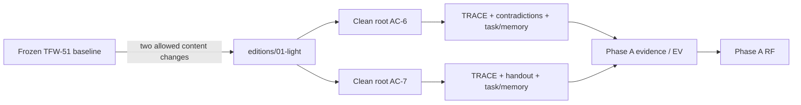

# RF — TFW-52 / Phase A: линейка редакций и стабильный Light

> **Date**: 2026-08-08
> **Author**: Codex (Executor)
> **Status**: 🟢 RF — Complete
> **Parent HL**: [HL-TFW-52](../HL-TFW-52__tfw_light_v1.md)
> **TS**: [TS Phase A](TS__phase-a__product_line_and_light.md)

---

## 1. What Was Done

### New Files

| File | Description |
|------|------------|
| `editions/README.md` | Product-line selection guide for Light, future Assisted, and existing Full; 473 words. |
| `editions/01-light/README.md` | Frozen TFW-51 README copy with the one allowed copy-contents installation correction. |
| `editions/01-light/AGENTS.md` | Byte-identical TFW-51 behavioral contract. |
| `editions/01-light/TASKS.md` | Byte-identical TFW-51 five-status task list. |
| `editions/01-light/memory/PROJECT.md` | TFW-51 project-memory template with filled active-edition and version fields. |
| `phase-a/evidence/EV__phase-a__product_line_and_light.md` | Structured evidence for every Phase A AC with environment and provenance. |
| `phase-a/evidence/diff-vs-tfw51.txt` | Exact tree, word counts, hashes and recursive diff against frozen TFW-51. |
| `phase-a/evidence/baseline-sha256-before.txt`, `baseline-sha256-after.txt` | Before/after integrity manifests for the historical baseline. |
| `phase-a/evidence/verification.txt` | Deterministic AC checks, evidence-copy hashes, build result and environment note. |
| `phase-a/evidence/run-1-contradictions/` | Point-in-time AC-6 inputs, state, trace, result and source provenance. |
| `phase-a/evidence/run-2-handout/` | Point-in-time AC-7 input, state, trace, result and source provenance. |
| `phase-a/evidence/ac6-ac7-dispatch.md` | Exact prompts and guardrails used to dispatch the two independent Codex tasks. |

### Modified Files

| File | Changes |
|------|---------|
| `README.md` | Added the short Editions entry and updated the shared Task Board row to Phase A RF status. The product block was committed independently; the pre-existing uncommitted Task Board row remains in shared working-tree state and was not captured as foreign work. |
| `phase-a/ONB__phase-a__product_line_and_light.md` | Recorded Coordinator approval on 2026-08-08. |

Implementation commits: `07739b5` (product), `f4b9ae9` (live-run dispatch), `bf47823` (live evidence). No push was performed.

## 2. Key Decisions

1. **The approved TS is the strict budget ceiling.** Phase A used 14/8/12/1200 even though the dirty working-tree config currently shows wider values; config was not changed.
2. **Light is a constrained copy, not a rewrite.** `AGENTS.md` and `TASKS.md` remain byte-identical; the only baseline differences are the copy-to-root sentence and two edition/version rows.
3. **Live evidence was delegated, not simulated.** AC-6 and AC-7 ran in separate Codex threads on separate clean roots outside `steps-framework`; this Executor copied their actual files only after completion.
4. **Evidence statuses follow the TS plan.** AC-2/3/6/7/8 are VERIFIED; AC-1/4/5 remain N/A for real-environment evidence because their TS Evidence fields explicitly define document-reading or later-phase gates. All eight acceptance gates themselves passed.
5. **The transient AC-6 editor denial is an environment observation, not a product failure.** One editing command returned `Access is denied`; the agent recovered without user intervention, preserved file integrity and met every AC.
6. **Evidence copies include their inputs.** Although the TS minimum lists state, trace and result files, the neutral inputs were copied too so the reviewer can independently verify the two contradictions and the handout's source fidelity.

## 3. Acceptance Criteria

- [x] **AC-1 — Точка выбора редакции.** `editions/README.md` covers Light, Assisted and Full by work characteristics, names Light's manual limits, marks Assisted as Phase B, states that no Team directory will exist, and stays under 600 words.
- [x] **AC-2 — Light перенесён без потери сути.** Exactly four files exist; recursive diff contains only the allowed changes; word limits pass; no hooks, `work/`, `knowledge/` or future folders exist.
- [x] **AC-3 — Инструкция установки соответствует топологии.** The README says to copy directory contents into the project root; both live sessions used that layout; `tfw-light-ru` has zero matches under `editions/`.
- [x] **AC-4 — Активная редакция объявлена.** `memory/PROJECT.md` declares `TFW Light` and version `1.0.0` in the existing project card without a new section or user setup step.
- [x] **AC-5 — Вход в линейку из корня.** Root README links to the edition guide, summarizes all three choices and says Assisted is not yet available without rewriting existing sections.
- [x] **AC-6 — Живой прогон анализа противоречий.** Thread `019fe251-0a40-77e1-bc85-c1bbc4d9cd44` created one complete task with 0 questions and no user structure intervention, found exactly the two intended conflicts, preserved the aligned committee requirement and closed as `ГОТОВО`.
- [x] **AC-7 — Живой прогон раздаточного материала.** Thread `019fe251-16eb-7461-b4a1-a6d6af38446f` created one complete task with 0 questions and no user structure intervention; the ready 20-minute handout contains one example, six exercises and six balanced answers and closes as `ГОТОВО`.
- [x] **AC-8 — Полевой baseline TFW-51 не тронут.** All four before/after SHA-256 hashes match and `git status` has zero entries under TFW-51.

## 4. Verification

- Lint / structural validation: **PASS** — deterministic PowerShell checks cover file topology, word limits, forbidden paths, allowed diff, edition fields, root entry, live task counts, result shapes, statuses and evidence-copy hashes. See `evidence/verification.txt`.
- Tests: **PASS** — final post-RF run of `python -m pytest docs/scripts/test_gen_docs.py docs/scripts/test_integration.py -q` → `68 passed in 34.37s`.
- Build / docs integration: **PASS** — the integration suite performed the real MkDocs build and validated generated output.
- Live verify: **PASS** — two independent external Codex sessions completed AC-6/AC-7 with actual files and no manual TFW structure management.
- Baseline integrity: **PASS** — pre/post TFW-51 SHA-256 manifests are identical.
- Scope / Definition of Failure: **PASS** — no Assisted, `.codex`, hooks, Team, `.tfw/` changes, TFW-51 changes, automation claims, migration platform or extra product phase.

## 5. Evidence

See [EV file](evidence/EV__phase-a__product_line_and_light.md) for evidence details.

Evidence verdict: 5/8 VERIFIED, 0 DEFERRED, 0 BLOCKED, 3 N/A

## 6. Observations (out-of-scope, not modified)

| # | File | Line(s) | Type | Description |
|---|------|---------|------|-------------|
| 1 | `.tfw/project_config.yaml` | 15-18 | ux | The shared dirty checkout widens scope budgets to 30/15/3000/30 while the approved Phase A TS names 14/8/1200/12. Phase A used the stricter TS contract and did not modify config; Phase B planning should resolve which committed budget is authoritative before execution. |

## 7. Fact Candidates

| # | Category | Candidate | Source | Confidence |
|---|----------|-----------|--------|------------|
| 1 | process | In both independently dispatched clean-project Codex runs, the complete first prompt was sufficient for 0 follow-up questions, and the human performed no manual creation or update of the TFW Light structure. | Coordinator follow-up after AC-6/AC-7, 2026-08-08 | High |

## 8. Strategic Insights (Execution)

| # | Insight | Category | Source |
|---|---------|----------|--------|
| S1 | Light encoded enough discipline for two materially different non-code tasks to maintain task state, trace and project memory without human file management. **Implication:** Phase B should automate the same observed routine without adding onboarding questions or changing the four-file semantic baseline; these two traces are the comparison control. | process | Coordinator-confirmed AC-6/AC-7 outcomes, 2026-08-08 |

## 9. Diagrams

> fact-candidates: processed 2026-08-08

---

*RF — TFW-52 / Phase A: линейка редакций и стабильный Light | 2026-08-08*
