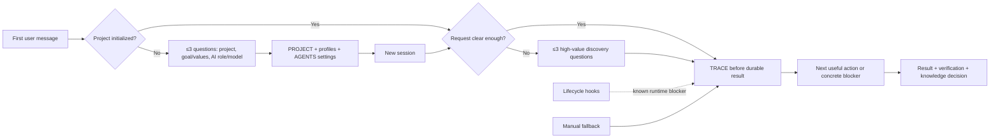

# RF — TFW-52 / Phase B: Assisted

> **Date**: 2026-08-13
> **Author**: Codex (Executor)
> **Status**: 🟢 RF — Complete
> **Owner disposition**: SUCCESS WITH KNOWN LIMITATION
> **Parent HL**: [HL-TFW-52](../HL-TFW-52__tfw_light_v1.md)
> **TS**: [TS Phase B](TS__phase-b__assisted.md)

---

## 1. What Was Done

### New Files

| File | Description |
|------|-------------|
| `editions/02-assisted/README.md` | Standalone Russian Assisted guide: initialization, working cycle, manual fallback and honest boundaries. |
| `editions/02-assisted/AGENTS.md` | Agent contract for project initialization, critical TFW mode, task discovery, traces, memory, risk and migration. |
| `editions/02-assisted/PROJECT.md` | Uninitialized standalone project card for goals, user, audience, success criteria, values, participants and constraints. |
| `editions/02-assisted/MIGRATION.md` | Preserving Light → Assisted migration procedure with duplicate-contract stop. |
| `editions/02-assisted/.codex/hooks.json` | Project lifecycle definitions for `SessionStart`, `PreCompact` and `Stop`. |
| `editions/02-assisted/.codex/hooks/tfw-hook.ps1` | Windows handler for root, actor, state, checkpoints, consistency and deterministic secret checks. |
| `editions/02-assisted/.codex/hooks/tfw-hook.sh` | POSIX counterpart of the handler. |
| `editions/02-assisted/people/README.md` | Separate human/automation profile and declared-attribution contract. |
| `editions/02-assisted/knowledge/INDEX.md` | Candidate/record navigation with explicit non-automatic semantics. |
| `phase-b/evidence/EV__phase-b__assisted.md` | Structured evidence ledger, lifecycle blocker and owner disposition. |
| `phase-b/RF__phase-b__assisted.md` | This execution result. |

### Modified Files

| File | Changes |
|------|---------|
| `editions/README.md` | Marks Assisted as available and links the standalone starter. |
| `README.md` | Adds Assisted to the editions entry and transitions Phase B to RF. |
| `phase-b/ONB__phase-b__assisted.md` | Records approved onboarding and expected evidence dispatch plan. |

Implementation commits: `8557a32` (initial Assisted starter), `ac4c3a4` (owner-directed standalone initialization and active task intake). ONB commit: `5f4f308`. No push was performed.

Scope accounting: 14 touched repository files in Phase B, 12 new including ONB/EV/RF, 2 modified, 844 product LOC; within 30 files / 15 new / 3000 LOC / 30 modified.

## 2. Key Decisions

1. **Assisted is a standalone edition.** It no longer assumes Light context or a pre-filled generic goal. `PROJECT.md` starts uninitialized and the first-run dialogue captures the actual project, user, audience, goal, desired effect, success criteria, values and constraints.
2. **The user’s preferred professional role and mental model belong in the active agent contract.** Initialization fills the two designated values in `AGENTS.md`, then requires a new session so the changed contract is loaded.
3. **TFW’s critical mode is explicit.** The agent must be useful rather than agreeable: no flattery, evidence-backed disagreement, facts separated from conclusions, unknowns named, Working Backwards before action and no placeholders.
4. **Creating a task is not useful progress by itself.** Vague problems trigger up to three high-value discovery questions. After creating a trace, the agent must immediately take the next useful step or ask a concrete blocking question.
5. **Hooks remain delivered but not claimed as working lifecycle evidence.** Deterministic handlers passed local fixtures; trusted Codex Desktop did not durably dispatch them in the tested runtimes. The manual fallback is therefore a real operating mode, not hidden degradation.
6. **Owner acceptance governs product closure, not evidence history.** The owner directed successful closure after basic use. EV preserves `AC-2 BLOCKED` and unexecuted lanes as `DEFERRED`; success does not rewrite observations.

## 3. Acceptance Criteria

- [x] **AC-1 — Assisted opens as a standalone project.** The nine-file starter copies to a clean root, explains limits and initialization, contains no user-facing JSON/code requirement, and respects the 700/1100 word limits.
- [ ] **AC-2 — Hooks installed, trusted and executed. BLOCKED.** Definitions and handlers exist and pass deterministic fixtures, but supported Codex Desktop did not produce durable lifecycle dispatch evidence.
- [ ] **AC-3 — Durable action does not start without a trace. DEFERRED live gate.** The final contract requires orientation and trace-before-result; real Stop mismatch evidence was not completed.
- [ ] **AC-4 — Ordinary conversation creates nothing. DEFERRED full lane.** Contract and an incomplete safe no-write run support the behavior; the complete three-question and `active_task=none` lifecycle proof was not collected.
- [x] **AC-5 — Root is resolved without Git.** Root/nested/missing/competing-marker fixtures passed and the final uninitialized project marker remains discoverable.
- [ ] **AC-6 — Memory is prepared but not presented as automatic. DEFERRED live candidate gate.** Structure and wording pass inspection; AC-8 candidate artifacts were not collected.
- [ ] **AC-7 — Risk gate precedes shared writing. DEFERRED full lane.** Deterministic secret fixture and semantic hold contract exist; the two full live runs and Stop publication check were not completed.
- [ ] **AC-8 — Light/Assisted comparison. DEFERRED.** The frozen scenario was not run; no measured-difference claim is made.
- [ ] **AC-9 — Light migration preserves the project. DEFERRED.** The preservation procedure exists; live migration and byte comparison were not run.
- [ ] **AC-10 — Two participants share a non-Git root. DEFERRED.** Ownership/profile design exists; parallel live evidence was not run.
- [x] **AC-11 — Visible manual mode.** Exact fallback wording and manual order are documented and were observed in the incomplete interactive run; this does not verify lifecycle hooks.

Owner outcome: **accepted as successful with the hook limitation and deferred evidence explicitly recorded.**

## 4. Verification

- Structural assertions: **PASS** — standalone wording, initialization prompt/state, project goals and values, agent role/mental model, critical mode, task intake and no-stop-after-trace checks all passed.
- Word limits: **PASS** — `README.md` 531/700; `AGENTS.md` 1038/1100.
- Handler fixtures: **PASS** — root/nested/missing/competing-root paths, trace consistency, checkpoint idempotence, one-shot Stop state and deterministic secret checks were exercised locally.
- Fresh-root smoke after the final patch: **PASS** — final `PROJECT.md` was resolved from a nested directory in a non-Git root; `SessionStart` handler returned a valid summary and created neither `work/` nor `knowledge/inbox/`.
- Git diff checks: **PASS** — product commits contain only owned Phase B paths; no `.tfw/`, TFW-51, substantive Light, TFW-53 or TFW-54 product changes.
- Codex lifecycle: **BLOCKED** — trusted interactive Codex sessions did not yield durable dispatch events, handler state or additional context. No synthetic call is promoted to lifecycle evidence.
- Full downstream live suite: **DEFERRED by owner closure** — comparison, migration, two-participant and remaining risk lanes were not rerun after final owner corrections.

## 5. Evidence

See [EV file](evidence/EV__phase-b__assisted.md) for evidence details.

Evidence verdict: 3/11 VERIFIED, 7 DEFERRED, 1 BLOCKED, 0 N/A

Product disposition: **SUCCESS WITH KNOWN LIMITATION** by explicit owner direction on 2026-08-13.

## 6. Observations (out-of-scope, not modified)

| # | File | Line(s) | Type | Description |
|---|------|---------|------|-------------|
| 1 | Codex Desktop lifecycle runtime | N/A | missing-test | Project hooks were visible/trusted but not durably dispatched in tested Desktop runtimes. Upstream runtime correction is required before AC-2 can be reverified; global hooks, trust bypass and product redesign were intentionally not used. |
| 2 | External raw evidence roots | N/A | ux | The previously reported external run roots and rollout files were absent at RF closure on 2026-08-13. EV retains exact session IDs and outcomes, but raw reviewer-inspectable bundles are unavailable. |

## 7. Fact Candidates

| # | Category | Candidate | Source | Confidence |
|---|----------|-----------|--------|------------|
| 1 | product | Assisted must be independently usable and must not assume Light is installed alongside it or was used as an upgrade source. | Owner feedback, 2026-08-09 | High |
| 2 | process | At initialization, the method must capture the actual project, user, goal, desired effect, success criteria and values, plus the professional role and mental model expected from the AI. | Owner feedback, 2026-08-09 | High |
| 3 | philosophy | The baseline TFW agent mode is a critically useful partner: it challenges weak assumptions with evidence, does not flatter or agree automatically, and remains honest about uncertainty. | Owner feedback, 2026-08-09 | High |
| 4 | ux | A vague request must lead to problem discovery and useful follow-through; merely creating a task and waiting is an unacceptable assistant behavior. | Owner garden/gardener test, 2026-08-09 | High |
| 5 | product | The owner accepts the current Assisted edition as successful for closure while treating broken lifecycle hooks as a known external limitation. | Owner closure direction, 2026-08-13 | High |

## 8. Strategic Insights (Execution)

| # | Insight | Category | Source |
|---|---------|----------|--------|
| S1 | Structure can enforce trace hygiene yet still produce an inert assistant if discovery and forward motion are underspecified. **Implication:** every edition must preserve both halves of the method: durable traces and an active, critical problem-solving stance. | philosophy | Owner’s standalone and garden/gardener feedback |
| S2 | Standalone initialization is product behavior, not setup documentation. **Implication:** a starter’s initial files must visibly represent “unknown project” and instruct the agent to construct project-specific context through dialogue instead of shipping a plausible generic goal. | product | Owner’s basic Assisted test |
| S3 | Owner-level product acceptance and formal evidence completeness answer different questions. **Implication:** TFW can close a useful MVP successfully while retaining precise blocked/deferred evidence, provided no unverified mechanism is relabeled as working. | process | Owner closure direction after hook failure |

## 9. Diagrams

---

*RF — TFW-52 / Phase B: Assisted | 2026-08-13*

> fact-candidates: processed 2026-08-13
