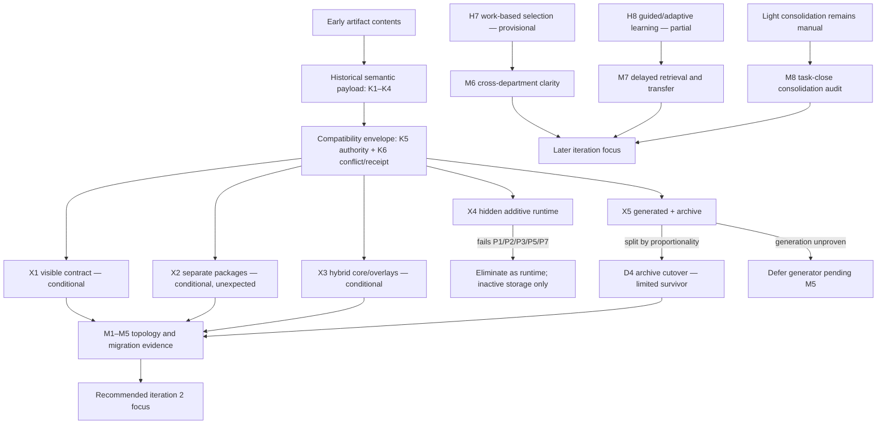

# RES — TFW-52: Product spine, edition topology, migration, and pedagogy

> **Date**: 2026-08-08
> **Author**: Codex Researcher
> **Status**: 🔬 RES — MORE NEEDED
> **Parent HL**: [HL-TFW-52](../../HL-TFW-52__tfw_light_v1.md)
> **Mode**: Pipeline (deep)
> **Iteration**: 1

---

## Research Context

Iteration 1 investigated the product spine shared by TFW editions, early framework history, source topology, edition migration, department-neutral edition selection, and pedagogy for explaining the edition ladder. The work tested H5–H8 against early artifact contents, current `.tfw`, the TFW-51 Light prototype, INNO-6/8/12/13 educational HLs, and external product-line, migration, and instructional evidence. The central research risk was confirmation bias toward visible same-repository editions and a memorable `goal → Working Backwards task → trace → knowledge` narrative; the investigation therefore kept separate packages, hybrid composition, hidden siblings, and alternative learning sequences live until Challenge.

## Briefing

The research plan and initial boundaries are recorded in [1_briefing.md](1_briefing.md). It defined three questions:

1. Which concepts are genuine historical invariants rather than later Full mechanisms?
2. Which topology, selection, and migration combination minimizes ambiguity while preserving edition independence?
3. What evidence would falsify H5–H8 rather than restate the parent HL?

Stage evidence is retained in:

- [2_gather.md](2_gather.md) — historical invariant audit, decision dimensions, TFW-51/INNO guidance and consolidation analysis, external counter-evidence;
- [3_extract.md](3_extract.md) — X1–X5 configurations, K1–K6 compatibility contract, migration authority/conflict behavior, pedagogical sequences;
- [4_challenge.md](4_challenge.md) — all 10 X-pair and 15 K-pair attacks, survivors/elimination, bounded H5–H8 verdicts, and M1–M8 evidence gates.

## Decisions

| # | Decision | Rationale |
|---|---|---|
| **CH-D1** | Eliminate X4 Hidden Additive Counter-config as a product/runtime topology. Hidden directories may exist only as explicitly inactive caches, archives, sources, or fixtures under another configuration's authority. | X4 fails active-authority, semantic-preservation, conflict, evolution, and pedagogy gates. Adding a versioned active pointer and compatibility checks repairs the failure only by turning X4 into an X1/X3-like configuration. |
| **CH-D2** | Preserve X1 Visible Contract, X2 Independent Packages, and X3 Hybrid Core and Overlays as **conditional survivors**. Do not select a global topology in iteration 1. | X1 is transparent but can drift and couple releases; X2 gives clean independent release/runtime authority but needs a neutral contract; X3 propagates common changes but adds variation/composition complexity. M1 and M3–M5 remain unexecuted. |
| **CH-D3** | Split X5: preserve D4 clean-target/archive cutover as an optional high-risk migration profile; do not recommend C3 generation as the default product architecture. | Archive cutover improves rollback, provenance, and active-authority clarity. A generator/schema has not demonstrated proportional cost for a small document-oriented framework. |
| **CH-D4** | Require K1–K6 as one dependency contract. K1–K4 carry portable meaning; K5 establishes role/version/runtime authority; K6 provides fail-closed conflict accounting and a receipt. | Historical semantics alone cannot prevent wrong-root activation, path collisions, status promotion, or silent loss. Unknown legacy data must be retained and reported rather than silently interpreted, discarded, or treated as success. |
| **CH-D5** | Narrow H5–H8 rather than accept their original universal wording. | H5 wins only against hidden runtime siblings; H6 is refuted as written; H7 is structurally plausible but its clarity claim is unmeasured; H8 requires guided/adaptive sequencing and direct retention/transfer evidence. |
| **RES-D1** | Recommend `MORE NEEDED`, with iteration 2 centered on M1–M5 and at least one further iteration reserved for M6–M8 or their refined successors. | `research/iterations.yaml` requires at least three iterations. The decisive topology, migration, selection, pedagogy, and consolidation evidence has not been executed. |

## Open Questions

| # | Question | Status | Answer |
|---|---|---|---|
| Q1 | Which of X1, X2, or X3 should be the TFW product-source and delivery topology? | open | Iteration 1 cannot choose responsibly. Compare active-runtime clarity, shared-change cost, independent release needs, contract viability, and proportionality through M1 and M3–M5. |
| Q2 | Can a Light/legacy project migrate without silent semantic loss or ambiguous authority? | open | K1–K6 defines the necessary contract, but M2 and M4 have not demonstrated it on TFW-51, early v1/v2, current Full, conflicts, interruptions, unsupported fields, or downgrade. |
| Q3 | Which work-based selection presentation is clearest across departments? | open | Work characteristics and assurance tiers are more coherent than maturity labels in analytic scenarios, but scorecard versus trigger/tier presentation remains untested in M6. |
| Q4 | Which pedagogy works for low- and high-prior-knowledge users? | open | A guided hybrid is defensible; universal lecture-first and unguided do-first are not. Comparative delayed retrieval and transfer require M7. |
| Q5 | What is the minimum Light consolidation behavior? | open | TFW-51 supplies task-close transfer but no structural verification. M8 must measure omission, duplication, contradiction, provenance, status promotion, and staleness before adding ceremony. |

## Hypotheses (from HL §10)

| # | Hypothesis | HL Status | RES Status | Evidence |
|---|---|---|---|---|
| **H5** | A visible `editions/01-light/`, `02-assisted/`, `03-team/` source layout is clearer and safer than root hidden edition siblings copied toward runtime. | open | **🟡 bounded support** — supported against hidden runtime siblings; not a global topology winner | X4 cannot identify one active runtime or resolve clone/copy conflicts. X1 is conditionally coherent, but X2 separate packages and X3 hybrid composition also survive when K1–K6 and version authority are explicit. Source layout alone does not create migration safety. |
| **H6** | One semantic core — goal → Working Backwards task → trace → knowledge — permits mechanical no-loss upgrades without manual reconstruction. | open | **🔴 refuted as written; revised hypothesis survives** | Early artifact bodies support a name-neutral `purpose/context → bounded/checkable work → persisted trace/outcome → reusable continuation context`, not universal Working Backwards or formal knowledge promotion. Verifiable structural/syntactic migration additionally requires K5–K6, mappings, retained originals/extensions, and receipts; semantic conflicts still require explicit decisions. |
| **H7** | Edition choice by work complexity, roles, error cost, and knowledge lifetime is clearer across departments than beginner/advanced labels. | open | **🟡 provisionally supported; clarity unmeasured** | Work/assurance factors avoid routing the same person solely by maturity and remain coherent across HR, legal, marketing, research, and executive scenarios. No cross-department comparison has measured agreement, burden, or harmful under-selection; M6 remains required. |
| **H8** | Do → notice a limit → receive a mechanism → repeat/compare traces teaches the ladder better than explaining all editions first. | open | **🟡 partial / revise; comparative effectiveness unproven** | Bounded action, naming, guided repetition, retrieval/review, and separate project-knowledge consolidation survive. INNO-8/13 and expertise-reversal evidence reject one universal order; no TFW trial demonstrates superior delayed retrieval or transfer. M7 remains required. |

## Surviving Configurations

| Configuration | Status | Required conditions | Decisive unresolved evidence |
|---|---|---|---|
| **X1 Visible Contract** | conditional survivor | One active-edition/version declaration; source/runtime separation; K1–K6 conformance owner; edition-scoped release behavior; role-specific converters; retained sources and receipts. | M1 active-authority fixtures, M2 migration fixtures, M3 comparative change cost. |
| **X2 Independent Packages** | conditional survivor; unexpected survivor | Separately versioned neutral contract; shared conformance fixtures; exporter/importer support matrix; explicit package ownership and release authority. | M3 evolution cost and M4 version-skew/contract viability. |
| **X3 Hybrid Core and Overlays** | conditional survivor | Minimal invariant core; registered variation points; locked composition; composed-product conformance; generated/source authority boundary. | M3 common-change benefit and M5 overlay proportionality. |
| **X5-D4 Archive Cutover** | limited survivor, migration profile only | Clean target; readable immutable/read-only source archive; explicit cutover; K1–K6 import/receipt; rule for post-cutover reconciliation. | M2 rollback/preservation fixtures and M5 comparison with in-place migration. |

**Eliminated configuration:** X4 Hidden Additive Counter-config as a product/runtime design. Its only surviving uses are explicitly inactive storage, source checkout, rollback archive, or test fixture governed by X1/X2/X3 authority rules.

## K1–K6 Compatibility Dependency Contract

| Contract ID | Role | Required preservation/failure behavior |
|---|---|---|
| **K1 Purpose** | Portable semantic payload | Preserve human intent/current context as original content or explicit source reference; do not replace it with starter text or an inferred summary. |
| **K2 Bounded work** | Portable semantic payload | Preserve stable work identity, status meaning, observable completion condition, and parent links; task status and evidence remain separate roles. |
| **K3 Trace/outcome** | Portable semantic payload | Preserve original trace, decisions, outcomes, evidence, and provenance; derived target artifacts identify their source and never rewrite history. |
| **K4 Continuation context** | Portable semantic payload | Preserve facts, decisions, assumptions, contradictions/open questions, sources, and epistemic status; completion is not confirmation. |
| **K5 Authority/version** | Control plane | Declare source/target edition and version, exactly one active runtime, and authority for framework instructions, task state, project state, original evidence, and generated derivatives. Missing or multiple authority stops migration before writes. |
| **K6 Conflict/receipt** | Transaction/evidence boundary | Preflight unequal IDs/content and incompatible versions; fail closed for known semantic conflicts; retain unknown fields in extension/archive; emit disposition for every source item. |

K5 and K6 are jointly necessary: conflict logic cannot select a disposition without authority, and authority without a receipt cannot prove what migration changed. Neither replaces K1–K4.

## Measurable Evidence Gaps

| Gap | Required evidence | Advancement gate |
|---|---|---|
| **M1 Active-runtime clarity** | Clean Light/Full, mixed legacy, duplicate-marker, nested-working-directory, and inactive-archive fixtures across supported adapters/agents. | Exactly one correct authority or explicit pre-write failure in every fixture; zero discovery-order selection. |
| **M2 Migration preservation** | TFW-51, early v1/v2, current Full, conflicting-ID, interrupted-write, unsupported-field, and downgrade fixtures. | Zero silent loss/promotion/overwrite; receipt disposition for every source item; failed migration leaves source usable. |
| **M3 X1/X2/X3 evolution cost** | Apply at least 10 representative common, edition-specific, compatibility, adapter, and release changes. | Publish median/worst-case authoring touches, duplicated edits, coordinated repositories/releases, caught drift, and review effort before selecting topology. |
| **M4 X2 contract viability** | Current/prior manifest version-skew matrix across every edition exporter/importer. | All declared pairs pass shared fixtures; undeclared/incompatible pairs fail before write; extensions retain unsupported input. |
| **M5 X3/X5 proportionality** | Compare one minimal overlay and one generator path against the same 10-change set and hand-authored baseline. | Advance added machinery only if it reduces repeated authoring/review cost without obscuring authority or generated diffs; baseline must be measured before setting a threshold. |
| **M6 Edition-selection clarity** | At least 12 department-neutral vignettes evaluated with work-based routing and maturity labels. | Work-based routing must improve agreement without increasing harmful under-selection; record time, factor usage, escalation errors, and maturity-label leakage. |
| **M7 Pedagogy/retention** | Compare compact-model-first and bounded-attempt-first for low/high prior knowledge; test a novel task after 48–72 hours. | Advance a comparative H8 claim only with better delayed retrieval/transfer for a defined segment, not immediate confidence alone. |
| **M8 Consolidation behavior** | Close Light tasks containing facts, decisions, assumptions, contradictions, and open questions; audit project memory. | Observe actual omission, duplicate, status-promotion, contradiction, provenance, and staleness failures before defining the minimum consolidation loop. |

## HL Update Recommendations

> Recommendations only. A Coordinator decides and applies any HL changes through `/tfw-plan`; this RES does not modify the parent HL.

| # | What to update | Source |
|---|---|---|
| R1 | Replace the claimed universal spine `goal → Working Backwards task → trace → knowledge` with the historically supported name-neutral semantic payload: purpose/context, bounded/checkable work, persisted trace/outcome, and reusable continuation context. Present Working Backwards and formal knowledge promotion as edition mechanisms where applicable. | H6 verdict; G-D1; CH-D4; early artifact-content audit in `2_gather.md`. |
| R2 | Add K5 active authority/version and K6 conflict/receipt to the migration contract. State that unknown fields are retained/reported, known semantic conflicts fail closed, and project intent/evidence cannot be overwritten by framework authority. | CH-D4; K1–K6 pairwise attack; M1–M2. |
| R3 | Narrow H5: recommend visible edition source directories over competing hidden runtime siblings, while explicitly preserving X2 separate packages and X3 hybrid composition as alternatives until M1/M3–M5 are executed. | CH-D1; CH-D2; H5 verdict. |
| R4 | Separate source topology, delivered package topology, and active runtime authority. A repository may contain multiple edition sources, but a project must expose exactly one active edition/version or fail before mutation. | E-D3; CH-D2; K5; M1. |
| R5 | Replace "mechanical no-loss migration" with three bounded levels: structural copy, known syntactic conversion, and human-resolved semantic conflict. Require supported-version maps, preservation/archive behavior, rollback, and receipts. | E-D4; H6 verdict; M2/M4. |
| R6 | Keep X5-D4 clean-workspace/archive cutover as an optional high-risk migration profile, but defer generator/schema architecture until M5 demonstrates proportionality. | CH-D3; X5 proportionality test. |
| R7 | Define edition selection by work/assurance characteristics and escalation triggers, not person maturity. Mark "clearer across departments" as pending M6 rather than a confirmed claim. | H7 verdict; E-D5; M6. |
| R8 | Revise H8 to a guided/adaptive sequence: compact orientation when needed, bounded attempt or demo, explicit naming, guided repeat, trace comparison, retrieval/review, and separate project-knowledge consolidation. Mark comparative effectiveness as pending M7. | G-D4/G-D5; CH-D5; H8 verdict; M7. |
| R9 | Do not treat a saved artifact as proof of learning or a completed task as confirmed knowledge. Keep retrieval/review and knowledge consolidation as separate mechanisms with edition-appropriate intensity. | G-D5; K2×K4 and K3×K4 results; M7–M8. |
| R10 | Add research evidence gates M1–M8 to the open questions/acceptance plan, with iteration 2 prioritizing M1–M5 before topology lock and a later iteration addressing M6–M8. | RES-D1; Iteration Status below. |

## Fact Candidates

> **Cognitive mode:** Pure reporting. These are human-sourced research-scope and decision-process observations, not verified project facts and not conclusions about which topology is best. They require `/tfw-knowledge` review before promotion.

| # | Category | Candidate | Source | Confidence |
|---|---|---|---|---|
| FC1 | research scope | TFW-52 iteration 1 was explicitly assigned to test H5–H8 in deep mode using early TFW history, current `.tfw`, TFW-51, and INNO-6/8/12/13 as mandatory local evidence. | User, delegated iteration brief; cross-check `research/iterations.yaml` | ★★★ |
| FC2 | evidence policy | The coordinator required early TFW invariants to be derived from artifact contents rather than commit subjects, and required guidance/consolidation to be checked separately in TFW-51 and the INNO HLs. | User, Gather authorization | ★★★ |
| FC3 | decision policy | The coordinator required topology alternatives to remain live through Gather and required Extract to include visible editions, separate packages, hybrid composition, and a hidden-siblings counter-configuration. | User, Gather and Extract authorizations | ★★★ |
| FC4 | iteration governance | The coordinator accepted Briefing, Gather, Extract, and Challenge checkpoints with no blocking questions and explicitly directed Synthesis to report `MORE NEEDED` because M1–M8 are unexecuted and at least two more iterations remain. | User, checkpoint responses and Synthesis authorization | ★★★ |

> **Human-Only Test:** each candidate records a constraint or decision supplied by the coordinator. Repository evidence cross-checks scope but does not independently establish the coordinator's intent.

## Strategic Insights (Research)

| # | Category | Insight | Source | Confidence |
|---|---|---|---|---|
| SS1 | product strategy | The requested edition research is a product-line decision, not a request to confirm the current same-repository proposal. **Implication:** X2/X3 must remain credible until comparative evolution and release evidence exists; repository aesthetics must not close H5. | User, Extract/Challenge directions | ★★★ |
| SS2 | evidence integrity | Historical legitimacy must come from what early artifacts enabled, not retrospective terminology or commit subjects. **Implication:** the product narrative should use the name-neutral semantic payload and introduce Working Backwards, roles, gates, and formal consolidation as later mechanisms. | User, Gather direction | ★★★ |
| SS3 | migration strategy | The coordinator demanded explicit authority and conflict behavior for every configuration. **Implication:** migration UX is part of the product spine; directory layout without K5–K6 is incomplete even when copying is additive. | User, Extract and Challenge directions | ★★★ |
| SS4 | research roadmap | Iteration 1 is intentionally non-terminal in a minimum-three-iteration program. **Implication:** iteration 2 should resolve topology/migration evidence first (M1–M5), while selection, pedagogy, and consolidation validation (M6–M8) can shape the subsequent iteration rather than being compressed into an unsupported final recommendation. | User, Synthesis direction; `research/iterations.yaml` | ★★★ |

## Findings Map

The map shows why topology cannot be selected before the compatibility envelope and evidence gates: K1–K4 explains what must survive; K5–K6 explains who governs and how conflict is recorded; M1–M5 determines which source/delivery topology is proportionate. H7/H8 and consolidation form separate empirical branches.

## Iteration Status

- **Iteration:** 1 of 3 (min) / 5 (max)
- **Hypotheses tested:** H5 (bounded support), H6 (refuted as written; revised form survives), H7 (provisionally supported), H8 (partial/revise)
- **Hypotheses deferred:** None. All assigned hypotheses were tested, but their empirical validation gaps remain open as M1–M8.
- **Gaps discovered:** M1 active-runtime clarity; M2 migration preservation; M3 X1/X2/X3 evolution cost; M4 X2 contract viability; M5 X3/X5 proportionality; M6 edition-selection clarity; M7 pedagogy/retention; M8 consolidation behavior.
- **Superseded decisions:** CH-D1/CH-D2 supersede G-D2/E-D1's fully open X1–X5 set by eliminating X4 and retaining X1/X2/X3 conditionally; CH-D3 supersedes X5 as a whole configuration by retaining only D4 pending M5; CH-D4 supersedes any reading of G-D1's semantic spine as sufficient for migration; CH-D5 supersedes the preliminary unrestricted readings of H5–H8.

### Open Threads (for next iteration)

| # | Thread | Why it matters | Suggested focus |
|---|---|---|---|
| OT1 | Active runtime and migration fixtures | A topology recommendation is unsafe until wrong-root, mixed-runtime, interrupted migration, rollback, and semantic conflicts have observable behavior. | **Iteration 2 primary:** execute M1–M2 using early v1/v2, TFW-51, current Full, and adversarial fixtures; define testable K1–K6 receipts without changing product files during research. |
| OT2 | X1/X2/X3 comparative evolution | X1, X2, and X3 optimize different forces; choosing from layout preference would ignore release independence and common-change cost. | **Iteration 2 primary:** execute M3 with the same 10 change scenarios for all survivors; record median/worst-case touches, coordination, caught drift, and review effort. |
| OT3 | Neutral contract and product-line proportionality | X2 needs version-skew proof; X3 and X5 generation need cost justification. | **Iteration 2 primary:** execute M4 and a bounded M5 design/prototype comparison; retain X5-D4 as a migration control. |
| OT4 | Edition selection language | H7's design direction is plausible, but "clearer" remains an empirical claim. | Later iteration: run M6; compare work score, observable triggers, assurance tiers, and maturity labels across department-neutral vignettes. |
| OT5 | Guided/adaptive pedagogy and consolidation | Method retention and durable project knowledge are different loops; neither INNO HLs nor TFW-51 prove delayed transfer or minimum consolidation. | Later iteration: run M7–M8, preserve low/high-prior-knowledge segmentation, and measure real task-close memory failures before specifying Light ceremony. |

### Recommendation

- [ ] **SUFFICIENT** — proceed to `/tfw-plan` to update HL and write TS
- [x] **MORE NEEDED** — at least two more iterations are required. Iteration 2 should prioritize M1–M5 to resolve active authority, migration preservation, and X1/X2/X3 topology economics; a subsequent iteration should address M6–M8 or their refined successors before claiming cross-department clarity or pedagogical effectiveness.
- [ ] **BLOCKED** — no blocking condition; the work is evidence-limited, not access-limited.

> ⚠️ Coordinator decides whether to continue or proceed. Researcher recommends but does not modify the HL or control files.

## Conclusion

Iteration 1 replaced a single favored architecture with a bounded decision set. Early TFW history supports a name-neutral semantic payload, not a universal Working Backwards-to-knowledge sequence. Visible editions are preferable to competing hidden runtime siblings, but X1, X2, and X3 all remain coherent under K1–K6; X2 is the unexpected survivor, X4 is eliminated, and X5 contributes archive cutover without yet justifying generation. The research also separated work-based product selection from prior-knowledge-based teaching, and method retrieval from project-knowledge consolidation. What this iteration could not provide is executed migration, topology-cost, department-clarity, retention, or consolidation evidence; M1–M8 and the minimum-three-iteration control therefore make `MORE NEEDED` the only supported recommendation.

> fact-candidates: processed 2026-08-08

---

*RES — TFW-52: Product spine, edition topology, migration, and pedagogy | 2026-08-08*
