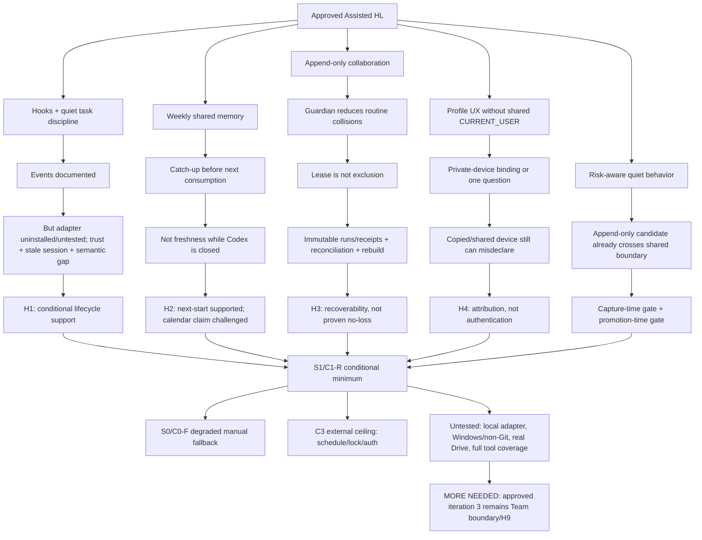

# RES — TFW-52: Assisted enforcement, collaboration, and memory

> **Date**: 2026-08-08
> **Author**: Codex Researcher
> **Status**: 🔬 RES — MORE NEEDED
> **Parent HL**: [HL-TFW-52](../../HL-TFW-52__tfw_light_v1.md)
> **Mode**: Pipeline (deep)
> **Iteration**: 2

---

## Executive Summary

The approved HL got the main Assisted design direction right. Current Codex does provide the intended lifecycle surfaces; ordinary conversation should remain task-free; one profile can be selected without a question; a shared `CURRENT_USER` is unsafe; independent append-only candidates avoid a shared write hotspot; confirmed records should be primary; and `INDEX.md` should be disposable and rebuildable. The HL's quiet-interaction and risk-category goals also survived.

The evidence narrows four guarantees rather than replacing that design:

- **Hooks are available, but this Assisted adapter has not been tested.** Current Codex documents `SessionStart`, `PreCompact`, and `Stop`, but project hooks must be installed and trusted; changed hooks are skipped until re-trusted; `AGENTS.md` is assembled once per run; matching hooks can run concurrently; and no hook event reliably means “a substantive task has begun.” Hooks can validate observable files and continue a Stop once, but they cannot by themselves guarantee correct semantic task activation or refresh a stale session.
- **Lazy catch-up gives next-start freshness, not calendar-time freshness.** It can make memory current before the first later use after a successful project start. It cannot update a closed local project while Codex is not running. A wall-clock guarantee requires external scheduling and is a different operational requirement.
- **A guardian and unique candidates reduce collisions; recovery prevents silent damage.** A lease file in a Drive-style synchronized folder is not a strict lock. The bounded recovery design needs immutable run manifests/receipts, split-brain detection, deterministic reconciliation, immutable accepted records, and a full index rebuild. This supports eventual detection and recovery; it does not prove that knowledge loss is impossible.
- **Profile selection establishes declared attribution, not authentication.** A private-device binding reduces questions, while a new, shared, copied, stale, or mismatched device state still needs one short choice before authored work. Automation must identify itself separately. Neither the binding nor a profile proves who physically used the device.

One additional safety finding changes where the risk gate begins: screening only during promotion is too late. An append-only candidate may already have synchronized a secret or sensitive fact. The gate must run **before shared candidate creation** and again before record/index promotion.

Research recommends, but does **not** decide, one conditional minimum: **S1/C1-R**, a small C1-shaped lifecycle and catch-up shell combined with C2's immutable recovery evidence. **S0/C0-F** remains a visibly degraded manual fallback when hooks are unavailable. **C3** remains only the external ceiling for calendar scheduling, strict locking/fencing, and authenticated signing; these are not new product editions. The approved HL and plan were not changed.

Important evidence is still missing: no Assisted hooks are installed in this repository, no actual `SessionStart`/compaction/Stop/schedule adapter run was executed, no real Google Drive folder was tested, full durable-tool activation coverage is unproven, and the proposed Windows/non-Git marker resolver is unimplemented. Iteration 2 is therefore not sufficient to end the research program. The approved minimum is three iterations, and iteration 3 must remain the approved **Team boundary and path to Full / H9** investigation.

## Research Context

Iteration 2 investigated the owner-approved focus **“Assisted enforcement, collaboration, and memory”** and H1–H4. It used current official Codex documentation, read-only local observations, the current repository adapter/TFW-51 context, and in-memory Drive-style concurrency/recovery fixtures. The hard owner lock made the approved HL and plan immutable and limited writes to this iteration's research artifacts. Root discovery and Light → Assisted preservation were treated only as bounded Assisted validation scenarios; iteration-1 topology alternatives were not reopened or selected.

## Briefing

The research plan, predecessor disposition, scope lock, and hypotheses are recorded in [1_briefing.md](1_briefing.md). The accepted stages are:

- [2_gather.md](2_gather.md) — 17 decision dimensions; official lifecycle/scheduling/memory contracts; local hook/root/memory observations; in-memory candidate, lease, conflict-copy, interruption, and identity evidence;
- [3_extract.md](3_extract.md) — four coherent configurations C0–C3; four evidence lanes; task/no-task activation; next-start/calendar freshness; guardian/lease/recovery separation; declared-attribution/authentication separation;
- [4_challenge.md](4_challenge.md) — D1–D17 incompatibilities; pairwise C0/C1/C2 attacks; adversarial lifecycle/freshness/recovery/identity/risk/platform cases; S1/C1-R survivor; S0/C0-F fallback; C3 ceiling; removals/deferrals.

The predecessor [iteration 1 RES](../iter1/RES.md) concluded `MORE NEEDED`. Its topology recommendations were not treated as approved product decisions. Iteration 2 used only its bounded wrong-root/authority warnings and preserved the owner-approved H1–H4 scope.

## Evidence Lanes

| Area | Documented platform support | Observed locally | Unavailable or unproven | Proposed Assisted behavior |
|---|---|---|---|---|
| **H1 lifecycle/root** | Current [Codex hooks](https://learn.chatgpt.com/docs/hooks) document `SessionStart`, `PreCompact`, `Stop`, trust-by-hash, concurrent matching commands, `cwd`, Stop re-entry, and Windows overrides. [`AGENTS.md` discovery](https://learn.chatgpt.com/docs/agent-configuration/agents-md) is once per run and root/`cwd` dependent. | Root instructions and the repository skill are active; project trust exists; the nested TFW-51 path inherits parent guidance. | No project/global hooks are installed; no callback, compaction, Stop-loop, trust UX, non-Git marker, or stale-session adapter fixture ran. Semantic task start is not a documented event. | S1 uses marker-aware, trusted, idempotent start/compact/Stop validation; continuous trace; one Stop continuation; explicit manual fallback; no-task is valid. |
| **H2 freshness** | Current [scheduled-task guidance](https://learn.chatgpt.com/docs/automations?surface=app) says local-file schedules need the computer and desktop app running; hosted schedules cannot directly use the local folder. | No schedule was created or run. | Closed-app calendar execution, clock-skew recovery, and first-consumer catch-up were not executed in Codex. | S1 uses catch-up only before first shared-memory consumption and a hybrid time/dirty/incomplete/index predicate. C3 is required for a separately approved external calendar SLA. |
| **H3 shared memory** | Official [Drive recovery guidance](https://support.google.com/drive/answer/2565956?co=GENIE.Platform%3DDesktop&hl=en) documents retry/recovery and retained files when synchronization fails; it does not provide database/lock semantics. | In-memory fixtures showed shared-counter collision, two offline lease claimants, semantic duplicates, conflict-copy filename loss, interrupted-run recovery, receipt validation, divergent split-brain, and index rebuild. | No real Drive access, upload-order observation, cross-device atomicity test, provider-specific conflict sequence, or primary-record corruption recovery test. | S1 uses unique immutable candidates, guardian without safety lease, immutable run evidence, reconciliation, immutable accepted records, and a full derived-index rebuild. |
| **H4 identity/risk** | Current Codex surfaces do not turn a local project preference into authenticated identity. | In-memory identity cases covered one/many profiles, private/copy/shared/stale bindings, rename, unknown user, and automation actor. | No OS/account authentication, shared-device user study, privacy audit, or semantic risk-classifier evaluation. | S1 provides low-friction declared attribution; automation is separate; risk gates run before shared candidate creation and before promotion. |

The lanes prevent four invalid substitutions: platform event availability is not tested adapter behavior; local observation is not a universal guarantee; a proposed recovery protocol is not built-in Drive/Codex behavior; and attribution is not authentication.

## Decisions

| # | Decision | Rationale |
|---|---|---|
| **C-D1** | Eliminate C0, C1, and C2 as unchanged primary configurations; retain **S1/C1-R** as the sole primary research survivor and **S0/C0-F** only as degraded fallback. | C0 lacks automatic enforcement/recovery evidence, C1 lacks sufficient split-brain recovery, and C2 adds schedule/lease/pointer/broad-hook complexity without gaining their claimed guarantees. |
| **C-D2** | Remove desktop scheduling, a shared lease, and an authoritative index pointer from the default minimum. | Catch-up covers next-start freshness; lease does not exclude offline writers; full rebuild from accepted records makes pointer authority unnecessary. |
| **C-D3** | Retain `SessionStart`, `PreCompact`, and `Stop`, but restrict them to idempotent context, validation, and unique evidence. Maintain trace continuously and allow at most one Stop continuation. | Untrusted, changed, missing, or concurrent callbacks make mutable hook-side repair and dependence on one event unsafe. |
| **C-D4** | Preserve C2's immutable run manifests/receipts, split-brain detection, reconciliation, and automation provenance inside S1. | These controls, unlike a lease, survived dual-run, interruption, corrupt-receipt, conflict-copy, and rebuild attacks. |
| **C-D5** | Make capture-time risk gating a viability invariant before any shared candidate is written. | Promotion-time review cannot retract a secret or sensitive fact already synchronized as append-only input. |
| **C-D6** | Keep semantic task activation and authentication as explicit guarantee boundaries. | Unknown durable tool paths can evade known-path checks until Stop; local profile binding cannot verify the physical person. |
| **C-D7** | Defer C3 mechanisms unless an owner separately approves calendar-time SLA, strict locking/fencing, or authenticated authorship. | External scheduling, locking, signing, credentials, deployment, and operations exceed minimal local Assisted and solve different requirements. |
| **C-D8** | Provide exact HL wording proposals only in this RES, mark all **UNAPPROVED**, and apply none. | Research verdicts inform owner/Coordinator decisions; they do not mutate the approved master HL or plan. |
| **RES-D2** | Recommend **MORE NEEDED** and continue only with the already approved iteration 3 focus on Team boundary/path to Full and H9. | `min_iterations: 3`; the master HL explicitly reserves iteration 3 for subagents vs tasks/threads vs independent sessions, coordinator/executor/reviewer roles, and migration to the full loop. |

## Open Questions

| # | Question | Status | Answer |
|---|---|---|---|
| Q1 | Do installed/trusted S1 hooks execute correctly on current Windows Codex for startup/resume/compact/Stop, duplicate events, changed hashes, wrong roots, and one-shot continuation? | open | Not tested. Current official support exists, but this repository contains no installed hooks and the owner lock prohibited adapter writes. |
| Q2 | Does S1 recover on a real synchronized provider under delayed visibility, late-arriving offline runs, conflict copies, interruption, divergent outputs, corrupt receipts, and index loss? | open | Not tested on real Drive. The in-memory model supports the protocol structure only. |
| Q3 | Can all in-scope durable actions be recognized before execution without creating false tasks for ordinary conversation? | open | Not proven. Known-path guards can help; unknown tools/side effects remain a coverage gap and Stop is too late to prove trace-first ordering. |
| Q4 | Can capture-time risk screening remain quiet while reliably excluding secrets and holding sensitive/high-stakes material? | open | Structural patterns are possible; semantic false positives/negatives need implementation evidence and a conservative hold policy. |
| Q5 | Does Team add a verifiable mechanism beyond Assisted/subagents, and do its artifacts migrate into the full TFW loop? | assigned | This is H9 and belongs unchanged to approved iteration 3, not iteration 2. |

## Hypotheses (from HL §10)

| # | Hypothesis | HL Status | RES Status | Evidence |
|---|---|---|---|---|
| **H1** | `SessionStart` + pre-compact checkpoint + `Stop` reliably make Assisted load context, maintain trace, and align status without persistent questions. | needs-research | **🟡 conditional support; literal reliability challenged** | All three events are documented. Trust/hash review, once-per-run instructions, concurrent commands, wrong-root risk, command-only semantics, missing local hooks, Stop re-entry, and unknown durable tool paths prevent an unconditional guarantee. S1 retains the trio as validators/backstops with continuous trace and explicit fallback. |
| **H2** | Lazy weekly catch-up at the first later start provides practically similar memory freshness to a calendar schedule without Codex continuously running. | needs-research | **🟡 supported for next-start freshness; 🔴 challenged for calendar-time freshness** | Catch-up can establish a pre-consumption barrier at the next successful start. It cannot run while the app/project is closed. Desktop scheduling still needs the app, and an external scheduler is a separate C3-class requirement. |
| **H3** | Unique append-only candidates + one consolidator + derived index prevent knowledge loss for 2–3 participants sharing a Drive folder without Git. | needs-research | **🟡 recoverability design supported; 🔴 prevention/single-writer wording challenged** | Unique inputs and full rebuild survived bounded fixtures; a shared counter and offline lease failed. S1 needs guardian + immutable run evidence + split-brain reconciliation + immutable records + rebuild. Real Drive behavior is untested, so no-loss prevention is not proven. |
| **H4** | One profile auto; multiple profiles use local binding/one question; no shared `CURRENT_USER`; authorship is reliably established. | needs-research | **🟢 UX supported for declared attribution; 🔴 authentication interpretation challenged** | Single-profile auto, stable IDs, local binding, stale/new/shared-device questions, rename handling, and automation provenance are coherent. A copied/shared-device preference cannot verify the physical actor or provide non-repudiation. |

## Confirmed HL

| HL area | Confirmed conclusion | Evidence boundary |
|---|---|---|
| Light/Assisted contrast | Light remains manual and small; Assisted legitimately adds Codex-specific enforcement and shared-memory machinery. | Iteration 2 did not reopen edition topology or change Light. |
| Mandatory lifecycle intent | Start, pre-compact, and Stop are real current Codex lifecycle surfaces and are an appropriate minimal Assisted event set. | “Available” is not “installed, trusted, and tested”; the event trio is conditional. |
| Non-work behavior | Ordinary questions, project orientation, and read-only work must not create a task, request identity, or create memory candidates. | Task activation remains semantic/model-mediated except for bounded known-path checks. |
| Task-local consistency | One active task or none, one stable owner or explicit pending owner, continuous trace, result/status links, and no rewrite of another participant's trace are the right local invariants. | Complete pre-action coverage remains unproven. |
| Identity UX core | One profile auto-selects; multiple profiles can use a local preference or one short question; shared `CURRENT_USER` is forbidden; unknown identity is not guessed. | This is declared attribution, not authentication. |
| Parallel-write shape | Separate task traces and unique append-only candidates avoid common shared write hotspots. | Candidate uniqueness does not solve semantic duplicates or contradictions. |
| Memory authority | Records/source mappings are primary; `INDEX.md` is derived and fully rebuildable; primary traces are not erased. | Publication/recovery must use immutable evidence; real-provider behavior is untested. |
| Quiet catch-up | Overdue memory can be refreshed silently at the next successful project start before first use. | This confirms next-start freshness only. |
| Risk taxonomy | Routine project knowledge may be quiet; conflicting, sensitive, health, legal/financial high-stakes, safety, and secret categories require differentiated handling and compact questions. | Gate must begin before shared candidate creation, not only promotion. |
| Local Codex memories | Local generated memories are not shared project authority or a replacement for Drive-backed records/index. | Confirmed from current official behavior and local empty/default-off state. |

## Challenged HL

| Current HL claim/reading | Challenge | Surviving bounded reading |
|---|---|---|
| H1 and DoD imply the event trio can reliably enforce context/trace/status. | Hooks can be untrusted/skipped, instructions can be stale, matching commands run concurrently, and no semantic task-start event exists. | Installed/trusted/tested hooks validate observable state; continuous trace and explicit fallback carry semantics; Stop is one-shot. |
| §3.4 start row determines participant at project/session start. | It creates needless questions and can misattribute automation/non-work sessions. | Defer participant selection until the first action that records ownership/authorship; `active_task = none` is valid. |
| H2 says lazy catch-up gives practically the same freshness as a calendar schedule. | While closed, delay is unbounded; desktop local schedules also require the app. | Similar only at the next-start/first-consumption boundary after successful catch-up. |
| H3 says one consolidator/derived index prevents knowledge loss. | Guardian is operational, lease is not exclusion, and index recovery does not protect candidates/records by itself. | Recoverability comes from immutable candidates, run evidence, reconciliation, immutable records, and rebuild. |
| §3.6 retains an optional desktop schedule as part of the small Assisted behavior. | It cannot provide the likely intended closed-app guarantee and adds a duplicate trigger. | Remove from the default minimum; external scheduling remains C3 for an approved calendar SLA. |
| H4 says the rule reliably establishes authorship. | Local binding can be copied or used on a shared device. | It establishes low-friction declared attribution/provenance only. |
| §3.7 can be read as applying the risk gate when candidates are promoted into shared memory. | A candidate in shared `knowledge/inbox` has already crossed the privacy boundary. | Apply capture-time gating before candidate creation and promotion-time gating before records/index. |
| “Start of substantive task” is treated like a hook moment. | Current hooks expose lifecycle/prompt/tool events, not a reliable semantic task-start event. | Model-driven activation before durable work, explicit start fallback, and optional verified known-path guard; universal coverage remains unresolved. |

## Unresolved

1. **Executed lifecycle adapter:** actual hook installation/trust, Windows command entrypoints, callback payloads/order, duplicate events, missing events, compaction, Stop one-shot behavior, and degraded fallback.
2. **Stale authority:** a running session's old `AGENTS.md`/contract cannot be forcibly refreshed by the proposed project files; restart/retrust behavior needs explicit UX and evidence.
3. **Root authority:** marker discovery/fail-closed behavior in standalone Git and non-Git projects, nested source trees, copied Light → Assisted fixtures, wrong/absent/ambiguous markers, and path normalization are unimplemented.
4. **Trace-first coverage:** unknown durable tools or external side effects may occur before activation and be detected only at Stop.
5. **Real synchronized-folder recovery:** upload/visibility order, late offline runs, provider conflict naming, interrupted publication, corrupted primary records, reconciliation latency, and recovery UX have not been observed on real Drive.
6. **Semantic reconciliation:** deterministic digests can identify identical/divergent outputs but cannot decide genuinely contradictory meaning without a policy or human choice.
7. **Risk classification:** secrets and sensitive/high-stakes categories require capture-time protection, but semantic precision and quietness are unmeasured.
8. **Identity privacy/usability:** no shared-device study, privacy audit, impersonation test with copied local state, or authenticated identity mechanism was performed.
9. **Scale/performance:** full index rebuild is proportionate for the intended small Assisted set in design, but record-count thresholds and runtime are unmeasured.
10. **H9 / Team boundary:** subagents, app tasks/threads, independent sessions, coordinator/executor/reviewer roles, and migration to Full remain the approved iteration-3 research program.

## Surviving Configurations

| Configuration | Research status | Contents | Guarantee boundary |
|---|---|---|---|
| **S1 / C1-R — minimal recovery-assisted** | **Conditional primary research recommendation; UNAPPROVED** | Marker-aware trusted start/compact/Stop validation; continuous trace; catch-up-only freshness; immutable unique candidates; guardian without safety lease; immutable run manifests/receipts and reconciliation; immutable accepted records; full index rebuild; declared identity UX; capture/promotion risk gates; per-OS commands behind one state contract. | Does not guarantee stale-session refresh, all semantic task activation, closed-app calendar freshness, strict exclusion/no loss, or authentication. Requires executed adapter/provider evidence. |
| **S0 / C0-F — manual degraded fallback** | **Fallback, not equivalent Assisted automation and not a new edition** | Current instructions plus explicit start/checkpoint/close/catch-up workflow using the same candidate/receipt/record/index/identity/risk formats. | Usable when hooks are absent/untrusted, but cannot claim mechanical lifecycle enforcement. Must state degraded/manual mode visibly. |
| **C3 — external ceiling** | **Deferred comparator, not a product edition/default** | External OS/service scheduler, lock/fencing service, account/cryptographic identity and signing. | Only class that can pursue closed-app calendar execution, strict serialization, or authenticated authorship; adds operations/credentials outside minimal Assisted. |

## Recommended Owner-Approved Changes

All changes in this section are **UNAPPROVED**. They are exact proposals for a later owner/Coordinator decision. Research did not modify the HL, plan, Task Board, `iterations.yaml`, adapters, or product files.

### HL Update Recommendations

| # | What to update | Source | Status |
|---|---|---|---|
| U1 | Narrow H1 from unconditional reliability to installed/trusted/tested conditional lifecycle support. | C-D3, H1, C-F1/C-F2 | **UNAPPROVED** |
| U2 | Split H2 into next-start freshness and calendar-time freshness. | C-D2, H2, C-F3 | **UNAPPROVED** |
| U3 | Replace H3 prevention/single-writer wording with bounded recovery controls. | C-D2/C-D4, H3, C-F4 | **UNAPPROVED** |
| U4 | Clarify H4 as declared attribution/provenance, not authentication. | C-D6, H4, C-F5 | **UNAPPROVED** |
| U5 | Add hook trust/root/version/idempotence boundaries and move identity/task activation out of session start. | C-D3/C-D6, H1 | **UNAPPROVED** |
| U6 | Make catch-up-only the minimum and replace lease/checkpoint ambiguity with immutable run recovery/rebuild. | C-D2/C-D4, H2/H3 | **UNAPPROVED** |
| U7 | Add copied/shared/stale binding and automation actor rules. | C-D6, H4 | **UNAPPROVED** |
| U8 | Move the risk gate before shared candidate creation and retain a second promotion gate. | C-D5, C-F6 | **UNAPPROVED** |
| U9 | Align Phase B, DoD, and DoF with the bounded/testable guarantees. | C-D1–C-D7 | **UNAPPROVED** |

### U1 — Replace H1 wording — UNAPPROVED

**Current claim (HL §10, H1):**

> Набор `SessionStart` + pre-compact checkpoint + `Stop` достаточно надёжно заставляет Assisted загружать контекст, вести trace и согласовывать статус без постоянных вопросов

**Exact replacement:**

> При установленном, доверенном и проверенном Codex adapter набор `SessionStart` + `PreCompact` + `Stop` условно поддерживает загрузку контекста, непрерывное ведение trace и согласование статуса для поддерживаемых файловых действий без постоянных вопросов. `PreCompact` является backstop уже записанного состояния, `Stop` допускает не более одного продолжения, а stale session и семантическое начало задачи не считаются гарантированными hook-событиями.

### U2 — Replace H2 wording — UNAPPROVED

**Current claim (HL §10, H2):**

> Lazy weekly catch-up при первом следующем старте даёт практически ту же свежесть памяти, что calendar schedule, но работает без постоянно включённого Codex

**Exact replacement:**

> Lazy weekly catch-up обеспечивает свежесть общей памяти к первому её использованию после следующего успешного старта проекта, если catch-up завершился или явно сообщил о stale state. Он не обеспечивает calendar-time freshness, пока Codex/проект закрыт; календарное выполнение требует отдельно одобренного внешнего scheduler и является другим эксплуатационным требованием.

### U3 — Replace H3 wording — UNAPPROVED

**Current claim (HL §10, H3):**

> Unique append-only candidates + один консолидатор + derived index предотвращают потерю знаний при работе 2–3 участников через Drive без Git

**Exact replacement:**

> Unique append-only candidates + назначенный хранитель + уникальные immutable run manifests/receipts + split-brain detection/reconciliation + immutable accepted records + полностью пересобираемый derived index дают 2–3 участникам через Drive без Git обнаруживаемое и восстанавливаемое состояние. Общий lease не является строгим lock, а отсутствие потери знаний не считается доказанным без выполненных provider fixtures.

### U4 — Replace H4 wording — UNAPPROVED

**Current claim (HL §10, H4):**

> Правило `1 профиль → auto; >1 → local binding/one question` надёжно устанавливает авторство без общего `CURRENT_USER`

**Exact replacement:**

> Правило `1 профиль → auto; >1 → private-device local binding/one question` устанавливает низкофрикционную заявленную атрибуцию и provenance без общего `CURRENT_USER`. New/shared/copied/stale/mismatched device state требует одного короткого выбора перед записью авторства/владения; automation использует отдельный actor type. Правило не является authentication или non-repudiation.

### U5 — Amend hook contract and activation rows — UNAPPROVED

**Current claims identified:** HL §3.4 line “Hooks — часть контракта Assisted…” and the rows “Старт проекта/сессии,” “Начало содержательной задачи,” “Перед сжатием контекста,” and “Перед завершением.”

**Exact addition immediately after the §3.4 opening sentence:**

> Обязательность hooks означает обязательность их установки, trust-review и выполненной проверки в поддерживаемой среде, а не гарантию платформы без настройки. После изменения hook-definition требуется повторное доверие; после изменения `AGENTS.md`/hook-контракта требуется новая сессия. Каждый handler начинает с проверки однозначного Assisted-root, project ID и contract version и fail-closed при none/ambiguity/mismatch. Hooks проверяют наблюдаемое файловое состояние и добавляют идемпотентные/уникальные receipts; они не должны параллельно переписывать один trace или index. Trace поддерживается непрерывно агентом; lifecycle hooks являются validation/backstop.

**Exact replacement rows:**

```markdown
| Старт проекта/сессии | Проверить Assisted-root и contract version, прочитать цель, восстановить активную задачу или `none`, проверить freshness общей памяти; не создавать задачу и не выбирать участника для чтения, знакомства или обычного разговора | Только если ошибка root/trust/version блокирует безопасное продолжение; выбор участника отложить до первого действия, записывающего авторство или владение |
| Перед первым поддерживаемым durable action | До изменения результата, task trace, shared candidate, ownership/status или внешнего состояния создать/активировать задачу и `TRACE.md`, записать declared owner, желаемый результат, критерии и Working Backwards plan; при неоднозначности доступна явная start-команда | Если без ответа меняется результат/риск либо профилей несколько и нет допустимой локальной привязки |
| Перед сжатием контекста | Проверить, что короткий checkpoint уже сохранён в trace активной задачи, и добавить идемпотентное checkpoint evidence; `active_task = none` допустим | Не спрашивать |
| Перед завершением | Проверить trace, результаты, фактический статус, owner и knowledge candidates; выполнить не более одного `Stop` continuation, а при повторной несогласованности сохранить/сообщить unresolved state без цикла | Только если автоматическое решение небезопасно или неоднозначно |
```

### U6 — Replace cadence and consolidator paragraph — UNAPPROVED

**Current claims (HL §3.6):** the two-layer cadence with mandatory catch-up plus optional desktop schedule, followed by one guardian and an undecided lease/checkpoint mechanism.

**Exact replacement for the paragraphs beginning “Еженедельность реализуется…” through the guardian/lease paragraph:**

> Еженедельность минимального Assisted реализуется обязательным catch-up: перед первым использованием общей памяти после наступления срока система проверяет время, unreceipted candidates, incomplete/invalid receipts и digest индекса; затем тихо консолидирует либо явно помечает память stale. Невалидное, отсутствующее или существенно будущее время считается due. Calendar-time freshness и desktop schedule не входят в минимальную гарантию. Если owner отдельно требует календарное выполнение при закрытом Codex, это C3-class внешний scheduler, который вызывает тот же unique-run recovery protocol.
>
> В проекте назначается один обычный хранитель памяти; это снижает вероятность одновременных запусков, но не является mutual exclusion. Shared lease не входит в safety core. Каждый consolidation run получает уникальный immutable started manifest и completed/reconciled receipts с input/output digests. Идентичные пересекающиеся runs объединяются с сохранением обоих receipts; расходящиеся результаты создают явный conflict без last-writer-wins. Accepted records immutable/versioned, а `INDEX.md` полностью пересобирается из accepted records/source mappings и остаётся производным файлом.

### U7 — Add identity/device/automation boundaries — UNAPPROVED

**Current claim identified:** HL §3.5 identity list supports one-profile auto, local binding, one question, no shared `CURRENT_USER`, and no guessing.

**Exact addition after that list:**

> Identity selection происходит только перед действием, которое записывает авторство или владение; project/session start, чтение и non-work conversation не требуют выбора. Local binding хранит только stable project ID → stable profile ID и non-secret device-instance metadata вне синхронизируемой папки и используется только на private device. New/shared/copied/stale/mismatched binding требует одного короткого выбора. Rename не меняет stable profile ID; historical records сохраняют display snapshot. Automated consolidation записывает `actor_type = automation` и run receipt и не заимствует профиль локально привязанного участника. Эти правила обеспечивают declared attribution/provenance, а не authentication.

### U8 — Add capture-time risk gate — UNAPPROVED

**Current claim identified:** HL §3.7 applies differentiated risk behavior during quiet consolidation/transfer to shared memory.

**Exact addition before the first §3.7 paragraph:**

> Risk gate применяется дважды: (1) до записи любого shared append-only candidate в `knowledge/inbox`, потому что последующая консолидация не может отозвать уже синхронизированный секрет или чувствительный факт; (2) перед переносом кандидата в records/`INDEX.md`. Secrets никогда не записываются в candidate, trace или index; sensitive/high-stakes material по умолчанию удерживается локально, редактируется до обезличенной ссылки либо получает явное подтверждение до shared capture. Неуверенная классификация означает hold, а не silent share.

### U9 — Align Phase B, DoD, and DoF — UNAPPROVED

**Current claims identified:** Phase B deliverables 2, 6, 7, 8; DoD 3, 4, 5, 9; DoF currently lacks explicit failures for untested/skipped hooks, lease-as-lock, attribution-as-authentication, and promotion-only risk screening.

**Exact replacement Phase B items:**

```markdown
2. Реализовать и выполнить fixtures обязательного Codex adapter для `SessionStart`, `PreCompact` и one-shot `Stop`: install/trust/hash change, stale session, duplicate/missing callback, wrong/absent/ambiguous root, Windows/non-Git entrypoints и прозрачный S0 manual fallback.
6. Реализовать catch-up-before-consumption с hybrid staleness state; не обещать calendar-time freshness и не включать desktop schedule во default minimum.
7. Реализовать risk gate до shared candidate creation и до promotion, запрет записи секретов и один короткий пакет действительно необходимых вопросов.
8. Проверить восстановление для 2–3 участников через синхронизируемую папку без Git: simultaneous candidates, semantic duplicates, two offline consolidators с identical/divergent outputs, incomplete/corrupt receipts, conflict copies, late run, corrupt/missing index и full rebuild. Shared lease не считать strict exclusion.
```

**Exact replacement DoD items:**

```markdown
- ✅ 3. Assisted открывается как самостоятельный project root; установленные и доверенные hooks проходят executed fixtures для start/compact/Stop, проверяют root/version и не зависят от памяти старого чата; после contract change требуется новая сессия/retrust, а недоступный hook явно переводит работу в S0 manual fallback.
- ✅ 4. Обычный вопрос, чтение и non-work conversation не создают задачу; для каждого поддерживаемого durable-write path владелец, Working Backwards plan и task-local trace существуют до действия; при завершении trace и status согласованы, а непокрытые surfaces явно перечислены и не маскируются Stop-проверкой.
- ✅ 5. При одном профиле имя не спрашивается; при нескольких нет общего `CURRENT_USER`, private-device binding используется только при совпадении, new/shared/stale/mismatched state уточняется одной короткой репликой, automation имеет отдельный actor type; UX заявляет attribution, а не authentication.
- ✅ 9. Просроченная консолидация выполняется до первого следующего использования общей памяти или память явно помечается stale; обычное знание обрабатывается без вопросов, а risk gate применяется до shared candidate creation и перед promotion.
```

**Exact DoF additions:**

```markdown
- ❌ Hook availability выдаётся за проверенный adapter, хотя definition untrusted/skipped, root/version не подтверждён или stale session использует старый contract.
- ❌ Shared lease трактуется как strict exclusion либо knowledge-loss prevention без immutable manifests/receipts, reconciliation и rebuild.
- ❌ Local binding или profile ID выдаётся за authentication физического пользователя либо automation молча получает авторство bound participant.
- ❌ Secret или sensitive/high-stakes content попадает в shared append-only candidate до risk gate, даже если позже не promoted в records.
```

## Fact Candidates

No Fact Candidates. The material facts in this iteration were discoverable from repository artifacts, official documentation, or executed in-memory fixtures. The coordinator/owner messages supplied scope and governance decisions rather than new durable facts about the project's business/domain state; recording them as knowledge candidates would fail the Human-Only Test's project-fact requirement.

## Strategic Insights (Research)

| # | Category | Insight | Source | Confidence |
|---|---|---|---|---|
| SS1 | governance | The approved master HL and plan are immutable during research; research may challenge them only through transparent, unapplied wording proposals. **Implication:** evidence, recommendation, and owner decision must remain separate artifacts/states, especially where technical findings narrow approved language. | Owner direction relayed by coordinator, iteration 2 delegation | ★★★ |
| SS2 | scope | Root discovery and Light → Assisted preservation are bounded validation scenarios inside Assisted research, not permission to reopen topology. **Implication:** S1/S0/C3 are research configurations/guarantee boundaries, not X1/X2/X3 selections or new editions. | Owner direction relayed by coordinator, iteration 2 delegation | ★★★ |
| SS3 | product assurance | The owner required explicit distinctions: availability vs tested adapter, next-start vs calendar freshness, collision reduction vs recovery, attribution vs authentication, and capture-time vs promotion-time risk. **Implication:** Assisted should market and test boundaries as carefully as mechanisms; a quiet UX cannot rely on ambiguous guarantee words. | Coordinator directions at Gather/Extract/Challenge/Synthesis | ★★★ |
| SS4 | research roadmap | Iteration 2 must not consume or redesign the approved iteration 3 Team/H9 program. **Implication:** unresolved Assisted adapter/provider fixtures remain visible, but the next research iteration still tests subagents vs tasks/threads vs independent sessions, minimum coordinator/executor/reviewer roles, and migration into the full loop. | Coordinator Synthesis direction; approved HL §10 | ★★★ |

## Findings Map



The map shows why the HL's structure survives while its guarantee words narrow. S1 is formed only after each branch separates a useful mechanism from the stronger guarantee it cannot provide. The risk branch also shows the new causal finding: append-only transport moves safety review earlier than consolidation.

## Iteration Status

- **Iteration:** 2 of 3 (min) / 5 (max)
- **Hypotheses tested:** H1 (conditional support; literal reliability challenged), H2 (next-start supported; calendar-time challenged), H3 (recoverability design supported; prevention/single-writer wording challenged), H4 (declared-attribution UX supported; authentication challenged)
- **Hypotheses deferred:** No assigned H1–H4 hypothesis was deferred. H9 remains assigned to the already approved iteration 3 Team-boundary program.
- **Gaps discovered:** executed local hook adapter and trust UX; stale-session/contract handling; complete durable-action coverage; Windows/non-Git root resolver; real Drive ordering/conflict/recovery; semantic conflict resolution; capture-time risk accuracy; shared-device privacy/usability; performance thresholds; H9 Team boundary.
- **Superseded decisions:** C-D1 supersedes E-D1's unchanged C0/C1/C2 survivor set with S1 primary and S0 fallback; C-D2 supersedes C2's default schedule/lease/pointer layers; C-D3 narrows E-D2/E-D4 lifecycle assumptions to idempotent validation/backstop; C-D4 preserves only C2's recovery core; C-D5 adds capture-time gating beyond Gather/Extract's promotion emphasis; C-D6 finalizes the task-activation/authentication boundaries; C-D7 limits C3 to an external ceiling; C-D8 governs unapproved HL proposals.

### Open Threads (for next iteration or later owner-approved validation)

| # | Thread | Why it matters | Suggested focus |
|---|---|---|---|
| OT1 | S1 lifecycle/root execution gap | H1 cannot become an implementation guarantee without real installed/trusted hook fixtures on supported Windows/non-Git and other target surfaces. | **Not a replacement for iteration 3.** Preserve as an Assisted implementation/evidence gate for a later owner-approved plan: startup/resume/compact/Stop, stale/changed trust, duplicates/missing events, wrong roots, one-shot continuation, S0 fallback. |
| OT2 | Real synchronized-folder recovery gap | H3 currently rests on official failure boundaries and an in-memory model, not provider execution. | **Not a replacement for iteration 3.** Preserve as a later owner-approved provider fixture: two offline writers/consolidators, conflict copies, late runs, interruption, corrupt receipts/records/index, reconcile/rebuild/recovery UX. |
| OT3 | Activation, identity, and risk assurance | Trace-first coverage, shared-device attribution, and capture-time semantic safety are the main remaining Assisted claim risks. | **Not a replacement for iteration 3.** Preserve for later implementation validation with an explicit tool-surface inventory, private/shared-device cases, automation identity, secret/sensitive/high-stakes capture tests. |
| OT4 | Approved Team boundary / H9 | The minimum-three-iteration program is incomplete, and Team must prove a distinct mechanism rather than restating Assisted or subagents. | **Iteration 3 exactly as approved in HL:** compare Codex subagents, app tasks/threads, and independent sessions; define minimum coordinator/executor/reviewer roles; prove Team adds a new mechanism and its artifacts migrate into the full HL/TS/ONB/RF/REVIEW loop. |

### Recommendation

- [ ] **SUFFICIENT** — proceed to `/tfw-plan` to update HL and write TS
- [x] **MORE NEEDED** — iteration 2 is complete, but `min_iterations: 3` and approved H9/iteration 3 remain. Run only the approved **“Iteration 3 — Team boundary and path to Full”** research focus: compare Codex subagents, app tasks/threads, and independent sessions; define the minimum coordinator, executor, and reviewer roles; prove Team adds a new working mechanism and its artifacts migrate into the full HL/TS/ONB/RF/REVIEW loop. Do not register a different plan in this session.
- [ ] **BLOCKED** — no blocking condition; the program is incomplete by approved research design, not blocked by access.

> ⚠️ The Coordinator/owner decides whether to approve any U1–U9 change. This Researcher applied none and did not update `iterations.yaml`. After the approved research program is complete, continue with `/tfw-plan` to review iterations and decide the HL/TS path.

## Conclusion

Iteration 2 confirms the architecture of a small Assisted layer while narrowing the promises attached to it. Current Codex lifecycle events are real but conditional on installation/trust and cannot semantically activate every task; catch-up is equivalent to scheduling only at the next-start consumption boundary; shared-folder safety comes from immutable recovery evidence rather than a lease; and identity binding supplies declared provenance rather than authentication. Pairwise Challenge removed schedule, lease, pointer authority, broad semantic hooks, and concurrent hook repair from the default minimum, producing S1/C1-R with S0 manual fallback and C3 external ceiling. The most important newly exposed safety issue is that append-only collaboration requires a risk gate before candidate creation. Self-critique: the recovery and identity models are coherent but remain models—no local adapter or real Drive execution justifies a production guarantee. `MORE NEEDED` is therefore mandatory, and iteration 3 must remain the approved Team/H9 boundary investigation.

> fact-candidates: processed 2026-08-08

---

*RES — TFW-52: Assisted enforcement, collaboration, and memory | 2026-08-08*

[ITERATION_COMPLETE]
