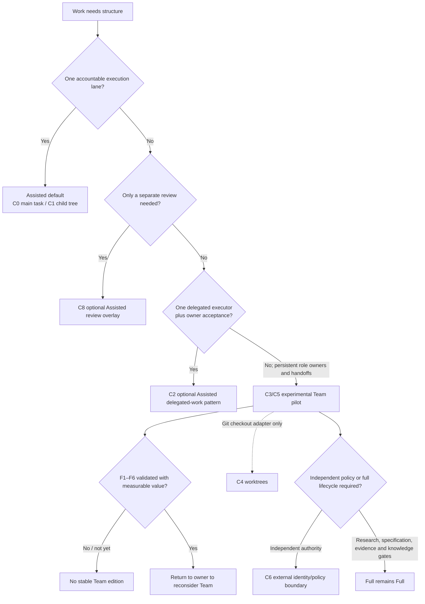

# RES — TFW-52: Team boundary and path to Full

## Executive Summary

### 1. What was actually observed

Current official Codex documentation distinguishes parent-controlled subagents, separate saved chats/tasks, thread lifecycle operations, Git worktrees, detached code review and same-account remote continuation. It does not document one product primitive that provides a coordinator, executor and independently governed reviewer as a Team.

This Iteration 3 Researcher task supplied a deliberately narrow live observation: the coordinator created a separate user-owned task, found and continued it across Briefing, Gather, Extract and Challenge, delivered follow-ups after checkpoints, used read/wait completion routing, and reviewed files visible through the same local checkout. Nothing in this run established worktree isolation, separate permissions or identity, needs-attention routing, Codex Handoff, restart recovery, cross-user behavior, transactional messaging or an executor/reviewer workflow.

### 2. What was structurally derived

A Team candidate cannot be defined by agent count, task count or persistence alone. Its possible distinct mechanism is **durable delegation across separately resumable role owners, with versioned semantic handoffs that remain understandable without a hidden coordinator transcript**. Platform messages are a fast lane; role-owned records are the authority lane. Owner and coordinator may collapse for a small group. Executor and reviewer may not collapse when independent review is claimed. Worktrees can isolate Git checkouts, but they are an adapter and not the domain-agnostic Team mechanism.

The minimal artifact result is logical rather than a fixed three-file package. Reuse Assisted's task `TRACE.md` as the executor record. Add a coordinator-owned assignment/decision record only when work crosses a real writer or authority boundary. Add a reviewer-owned verdict only when a distinct review lane is justified. These logical records can later map to Full HL/TS, ONB/RF and REVIEW, but they do not mean that Full research, evidence or knowledge gates already ran.

### 3. What failed under challenge

Persistence alone did not justify an edition. One user's separate tasks did not prove independent identity, permissions or rejection authority. C2's owner/coordinator/reviewer collapse made “independent review” misleading and reduced it to delegated execution plus owner acceptance. A mandatory `BRIEF.md`/`EXECUTION.md`/`REVIEW.md` spine duplicated Assisted's outcome, plan, trace, status and memory. Single-writer ownership remained procedural rather than enforced. Abandoned tasks, stale inputs, coordinator loss and non-Git concurrent editing still required explicit human reassignment, immutable revisions and serialized integration. Adding enough gates and controls to close every gap produced C7—Full under another name.

### 4. Decision implication

**H9 is CONDITIONAL. A stable Team edition is NOT CURRENTLY JUSTIFIED.** Assisted remains the default. Ordinary subagents and coordinator-controlled child trees stay inside Assisted. C2 delegated work and C8 separate-review assurance are optional Assisted patterns. C3/C5 are experimental Team pilot configurations only. Worktrees are adapter-only. Full remains the existing Full lifecycle.

This research iteration is sufficient to return that decision to the owner. It is not a claim that Team is product-ready. F1–F6 remain unvalidated and must pass before a stable Team edition can be reconsidered.

> **Date:** 2026-08-08  
> **Author:** Codex Researcher  
> **Status:** 🔬 RES — Iteration 3 complete; owner decision pending  
> **Parent HL:** [HL-TFW-52](../../HL-TFW-52__tfw_light_v1.md)  
> **Mode:** Pipeline — DEEP  
> **Predecessors:** [Iteration 1](../iter1/RES.md), [Iteration 2](../iter2/RES.md)

---

## Research Context

Iteration 3 investigated only H9 and the owner-approved boundary between Assisted, a possible Team edition and Full. It preserved predecessor findings as boundary conditions, kept Assisted plus ordinary subagents as the live falsification control, used current official Codex primary sources and safe local/app observations, and did not reopen Assisted design or edition source topology. The immutable HL, plan, Task Board, iteration registry, product files, adapters, code and prior research were not modified.

Stage traces:

- [Briefing](1_briefing.md) — scope, H9, controls and falsification plan;
- [Gather](2_gather.md) — official/current capability lanes, D1–D14, M0–M4 and counter-evidence;
- [Extract](3_extract.md) — M3-E1–E5, C0–C8, role collapse, lifecycle and initial A2 mapping;
- [Challenge](4_challenge.md) — pairwise elimination, artifact reuse, failure/recovery boundaries and final H9 disposition.

## Evidence Synthesis

### Four evidence lanes

| Lane | Supported result | Boundary |
|---|---|---|
| **Documented support** | [Subagents](https://learn.chatgpt.com/docs/agent-configuration/subagents) are parent-orchestrated and inherit the parent permission mode; [Projects and chats](https://learn.chatgpt.com/docs/projects) provide separate transcripts and saved chats; [App Server](https://learn.chatgpt.com/docs/app-server) documents thread lifecycle/turn operations; [Worktrees](https://learn.chatgpt.com/docs/environments/git-worktrees) isolate Git checkouts; [Code review](https://learn.chatgpt.com/docs/code-review) supports dedicated/detached review; [Remote connections](https://learn.chatgpt.com/docs/remote-connections) continue the same signed-in user's work. | Availability is not an executed Team guarantee. No source establishes cross-user authority, one Team bus or independent reviewer identity. |
| **Observed behavior** | M3-E1–E5: separate user-owned Researcher task creation, multi-checkpoint task visibility/persistence, coordinator follow-up delivery, read/wait completion routing and same-checkout artifact visibility. | This is one coordinator↔Researcher path, not an executor/reviewer or multi-user exercise. |
| **Unavailable/unproven** | Worktree isolation in this run; distinct permissions/identity; needs-attention; Handoff; app-restart persistence; cross-user behavior; enforced read-only reviewer; transactional message ordering; race-free shared writes; abandoned-role recovery. | These properties cannot appear in a stable Team promise on current evidence. |
| **Proposed TFW behavior** | Versioned assignment/result/verdict records, disjoint path ownership, stale-input stop, owner-led reassignment, review non-mutation and upward semantic mapping. | Structurally coherent and falsifiable, but not yet executed as a Team workflow. |

### Mechanism disposition

| Configuration | Final disposition | Why |
|---|---|---|
| **C0 Assisted control** | **Default** | One accountable task plus optional ordinary subagents covers bounded, reversible work with the least ceremony. |
| **C1 coordinator-controlled child tree** | **Inside Assisted** | It improves context control, messaging and parallel orchestration but remains parent-owned and shares the checkout/authority boundary. |
| **C2 delegated-work handoff** | **Optional Assisted pattern** | A separate executor gives inspectable delegation, but owner/coordinator/reviewer collapse supplies owner acceptance, not planner-independent review or Team coordination. |
| **C3 three-lane persistent tasks** | **Experimental Team pilot** | Coordinator, executor and reviewer lanes are structurally distinct, but their complete handoff/recovery/review lifecycle was not exercised. |
| **C4 worktree variant** | **Adapter-only** | Useful Git checkout isolation; not role authority, not observed here and unavailable to non-Git work. |
| **C5 artifact-bus roles** | **Experimental Team pilot protocol** | Best transcript-independent semantic candidate; ownership enforcement, abandoned-role recovery and non-Git concurrent-output safety remain unvalidated. |
| **C6 independent people/sessions** | **Independence ceiling** | Different credentials/policies can support stronger authority, but Codex cross-user coordination and identity were outside the evidence. |
| **C7 Full-shadow Team** | **Rejected** | Requiring Full artifacts, evidence and gates removes the intermediate boundary. |
| **C8 separate-review overlay** | **Optional Assisted pattern** | Solves the review-only need with a frozen packet and separate verdict without permanent coordination machinery. |

## Confirmed HL

| HL claim/direction | Confirmation | Evidence boundary |
|---|---|---|
| **§3.1 / S8: Team must investigate full tasks/sessions rather than reduce the idea to subagents.** | Correct as a research direction. Parent-controlled child trees are a stronger Assisted engine, not a distinct Team mechanism. | This does not confirm a stable Team edition. |
| **§3.1: Full is the existing agent-agnostic/domain-agnostic endpoint with the complete lifecycle.** | Confirmed. C7 showed that importing Full artifacts/gates into Team destroys the intermediate boundary. | Full was not redesigned or modified. |
| **§6 DoF 9: TFW-52 must not implement a full Team edition simultaneously and blur the current product.** | Confirmed more strongly. The evidence supports withholding stable Team, not shipping a placeholder. | An experimental pilot may be studied separately. |
| **§7 Principle 8: one writer per mutable entity.** | Confirmed as the safest domain-agnostic collision-avoidance rule. | It is procedural/structural W1–W2, not enforced W3 isolation unless an external system supplies it. |
| **§7 Principles 9–10: every edition must solve an observable preceding problem and remain non-code/domain-legible.** | Confirmed. Agent count, worktrees or three files alone do not meet that standard. | A future Team pilot must show a measurable recovery/review/coordination outcome. |
| **§9 risk: Team must not promise unsupported Codex session capabilities.** | Confirmed. Separate tasks do not imply cross-user identity, independent permission or transactional coordination. | M3-E1–E5 support only their exact observed behaviors. |
| **§10 Why Not Just: Team must build on stable Assisted rather than be designed as simultaneous implementation.** | Confirmed. Assisted TRACE/memory should be reused; Team must not create a duplicate memory/task system. | The exact stable-edition status is challenged below. |

## Challenged HL

| HL text/implication | Challenge result | Disposition |
|---|---|---|
| **§3.1 “В продукте существуют четыре смысловые ступени” and the stable-looking Team row.** | The fourth-place topology remains a roadmap hypothesis, but a stable third edition is not supported. Persistence and separate tasks are insufficient. | Exact UNAPPROVED replacement R3-HL-1/R3-HL-2 below. Unapplied. |
| **§3.1 Team adds coordinator, executor, reviewer, Handoff and Codex task/session coordination as one package.** | Handoff is execution-location movement, not semantic role transfer. Coordinator need not be a separate person. Reviewer is conditional. Tasks are only a carrier. | Replace with a bounded experimental mechanism; exact R3-HL-2. |
| **§3.1 invariant table: Team has separate management/execution/review traces and a Team knowledge gate.** | Three mandatory records duplicate Assisted TRACE/memory. New records are justified only at real writer/authority boundaries. No separate Team memory layer was established. | Exact R3-HL-3. |
| **§5 DoD 12 can be read as assuming the next task will produce Team.** | The correct boundary is an experimental C3/C5 pilot until F1–F6, while C0/C1/C2/C8 remain Assisted mechanisms. | Exact R3-HL-4. |
| **§10 H9 status `needs-research`.** | Iteration 3 tested it. The result is CONDITIONAL, and stable Team is not currently justified. | Exact R3-HL-6. |
| **§10 Iteration 3 wording “доказать, что Team добавляет...”** | The falsification attempt did not prove stable-edition sufficiency; it produced a negative product-readiness decision and a future test set. | No retroactive edit recommended. The approved, completed research plan remains immutable provenance. |

## Decisions

| # | Decision | Rationale |
|---|---|---|
| **R3-D1** | Keep C0/C1 as Assisted. | Ordinary subagents and coordinator-controlled child trees retain one parent authority and already cover bounded parallelism/fresh review assistance. |
| **R3-D2** | Bound M3 evidence to E1–E5 exactly. | This run observed persistence/routing/visibility, not identity, permissions, restart, worktrees, Handoff, needs-attention or cross-user behavior. |
| **R3-D3** | Keep C2 delegated work and C8 review overlay as optional Assisted patterns. | Each solves one narrow need without establishing a multi-role coordination edition. |
| **R3-D4** | Retain C3/C5 only as experimental Team pilots. | They contain the only coherent candidate mechanism—durable role delegation plus semantic handoff—but F1–F6 remain unexecuted. |
| **R3-D5** | Keep worktrees adapter-only. | Git checkout isolation is useful but not domain-independent, permission-independent or equivalent to semantic handoff. |
| **R3-D6** | Reject mandatory `BRIEF.md`/`EXECUTION.md`/`REVIEW.md`. | Assisted TRACE/memory already owns most content; physical records should scale with distinct mutable owners/authority boundaries. |
| **R3-D7** | Describe review on an explicit assurance gradient. | Same-user/session separation can be inspectable and cognitively useful without being authenticated or organizationally independent. |
| **R3-D8** | Set H9 to **CONDITIONAL**. | A distinct persistent carrier was observed, but coordinator/executor/reviewer separation and measurable advantage were not demonstrated. |
| **R3-D9** | A stable Team edition is **NOT CURRENTLY JUSTIFIED**. | C0/C1/C8 defeat most use cases with less ceremony; closing remaining gaps prematurely collapses Team into Full. |

## Minimal Logical Artifact Spine and Path to Full

The survivor is not three filenames. It is one record per real mutable owner, reusing Assisted state wherever possible.

| Logical record | When it exists | Owner | Reused source / minimum content | Possible Full mapping | Explicit non-claim |
|---|---|---|---|---|---|
| **Execution record** | Every Assisted/Team-pilot task | Executor/task owner | Existing Assisted `TRACE.md`: outcome, criteria, Working Backwards plan, questions, decisions received, work trace, result, verification, status and knowledge candidates | Acceptance/understanding can inform ONB; result/verification can inform RF | It is not automatically ONB or RF and does not prove Full evidence. |
| **Assignment/decision record** | Only when work crosses to a separately resumable executor/reviewer owner | Owner/coordinator | Frozen outcome/criteria, input revision, assignment, disjoint paths, dependencies, blocking decisions, integrator and successor authority | Can be split semantically into HL context and TS scope/acceptance | It is not an approved HL/TS and adds no second task board. |
| **Verdict record** | Only when a distinct reviewer is justified | Reviewer | Frozen assignment/result versions, checks, findings, independence limitation, APPROVE/REVISE/REJECT and required follow-up | Can seed REVIEW | It does not become Full REVIEW automatically, and owner acceptance is not mislabeled independent review. |

Upward mapping rules:

1. retain original Assisted/pilot records as provenance;
2. declare exact source/target edition and active authority before migration;
3. split meanings into Full artifacts rather than renaming files and destroying history;
4. add Full RES, TS precision, evidence planning/EV, review and knowledge gates prospectively;
5. preserve unknown material and fail closed on semantic conflicts;
6. emit the predecessor-required migration receipt;
7. never promote a pilot verdict or verification level into a stronger Full assurance claim automatically.

## Unresolved

These gaps block **Team product readiness**, not this iteration's research sufficiency.

| ID | Unresolved validation | Why it matters | Current status |
|---|---|---|---|
| **F1 Delegated execution** | Execute versioned assignment acceptance, one blocking decision and versioned result in a separate executor task without hidden coordinator context. | Tests whether semantic delegation adds recoverable value beyond a subagent. | Unvalidated; future owner-authorized pilot only. |
| **F2 Planner-independent review** | A reviewer that did not author assignment/result receives frozen inputs, does not repair output and can force executor revision. | Tests whether review is independently inspectable rather than role theater. | Unvalidated. |
| **F3 Abandon/resume** | Interrupt or abandon executor/reviewer; successor detects stale input and resumes from immutable records while preserving provenance. | Tests whether persistence becomes workflow recovery rather than saved transcript availability. | Unvalidated. |
| **F4 Shared non-Git safety** | Parallel disjoint outputs plus serialized integration; version mismatch stops before overlapping write. | Tests the domain-agnostic single-writer boundary. | Unvalidated; same-output concurrency remains unsupported. |
| **F5 Control comparison** | Compare C3/C5 with C0/C1/C8 on lost blockers, recovery, review-caused corrections and coordination/artifact cost. | A stable edition needs measurable value, not more files/tasks. | Unvalidated. |
| **F6 Full-boundary migration** | Migrate Assisted TRACE plus role records into Full without duplicate authority, lost content or automatic assurance promotion. | Tests the claimed additive path into Full. | Structurally mapped; execution unvalidated. |
| **U1 Team name/authority promise** | Decide whether future “Team” means same-user role-separated agents, independent humans/policies, or an explicit assurance gradient. | Prevents one-user tasks from being marketed as organizational independence. | Owner product decision after pilot evidence. |
| **U2 Coordinator succession** | Validate owner-led reassignment when coordinator is unavailable without lease/election machinery. | Files preserve state but not authority. | Proposed only. |

## Open Questions

| # | Question | Status | Answer |
|---|---|---|---|
| **Q1** | Should the owner accept the exact HL change that demotes Team from stable edition to experimental pilot? | owner-decision | Research recommends yes; no change was applied. |
| **Q2** | What assurance meaning should the future Team name promise: role-separated sessions or independently governed participants? | unresolved | Current evidence supports only bounded role/session separation, not independent identity/policy. |
| **Q3** | After an owner-approved pilot, do F1–F6 show measurable value over C0/C1/C8 at acceptable ceremony cost? | unvalidated | Stable Team may be reconsidered only if the answer is yes. |

## Recommended Owner-Approved Changes

All changes in this section are **UNAPPROVED** and **UNAPPLIED**. They are exact proposals for a future Coordinator `/tfw-plan` session. This Researcher did not modify the HL, plan, topology, README, iteration registry, TS or product files.

### R3-HL-1 — §3.1 opening topology statement

**Status: UNAPPROVED — UNAPPLIED**

Replace exactly:

```text
В продукте существуют четыре смысловые ступени. Названия описывают поведение; нейтральное `middle` не используется, потому что не объясняет, что именно получает пользователь. Ступень выбирается по сложности и цене ошибки работы, а не по должности или технической подготовке человека.
```

with exactly:

```text
В продуктовой линии подтверждены рабочие редакции Light и Assisted и существующая конечная редакция Full. Team сохраняется как кандидат между Assisted и Full, но не считается стабильной редакцией до успешной проверки F1–F6 из RES iteration 3. Названия описывают поведение; нейтральное `middle` не используется, потому что не объясняет, что именно получает пользователь. Редакция или pilot выбирается по сложности и цене ошибки работы, а не по должности или технической подготовке человека.
```

### R3-HL-2 — §3.1 Team row and interim classification

**Status: UNAPPROVED — UNAPPLIED**

Replace exactly:

```text
| 3. Team | Несколько ролей, параллельные исполнители, руководитель или владелец результата | Учится разделять постановку, исполнение и проверку, передавать контекст между агентами и сессиями | Координатор, исполнитель, reviewer, handoff и координация Codex-задач/сессий | Следующая отдельная задача; сейчас определить границу и путь перехода |
```

with exactly:

```text
| 3. Team (experimental pilot) | Работа, где нескольким отдельно возобновляемым владельцам ролей нужен проверяемый handoff постановки, результата и verdict | Проверяет, дают ли раздельные coordinator/executor/reviewer lanes восстановимость и review сверх Assisted | Версионированные логические role-owned records только на реальных границах writer/authority; Codex tasks/threads как carrier | Не стабильная редакция; C3/C5 остаются pilot до успешной проверки F1–F6 |
```

Insert exactly after the edition table:

```text
До успешной проверки F1–F6 Assisted остаётся редакцией по умолчанию: ordinary subagents и coordinator-controlled child trees (C0/C1) работают внутри Assisted; C2 delegated-work и C8 review overlay являются optional Assisted patterns; C3/C5 допускаются только как experimental Team pilot; worktrees являются adapter-only механизмом изоляции Git checkout; Full остаётся существующей полной редакцией без изменений.
```

### R3-HL-3 — §3.1 Team cells in the invariant table

**Status: UNAPPROVED — UNAPPLIED**

Replace exactly these four rows:

```text
| Зачем работаем | цель пользователя и образ результата | стабильный `PROJECT` context | цель владельца + координатор | Vision, Project Values, HL |
| Что делаем | задача + Working Backwards plan | task folder + owner + status | постановка и handoff между ролями | HL/TS + фазовые зависимости |
| Что произошло | один task trace | hook-поддерживаемый task trace | отдельные следы управления, исполнения и проверки | ONB/RF/REVIEW/evidence |
| Что узнали | ручная запись памяти | candidates → records → derived index | knowledge gate после командной работы | полный Fact Candidate и knowledge loop |
```

with exactly:

```text
| Зачем работаем | цель пользователя и образ результата | стабильный `PROJECT` context | цель владельца + версионированная постановка только при реальном делегировании | Vision, Project Values, HL |
| Что делаем | задача + Working Backwards plan | task folder + owner + status | Assisted task + handoff между отдельно возобновляемыми владельцами ролей | HL/TS + фазовые зависимости |
| Что произошло | один task trace | hook-поддерживаемый task trace | Assisted `TRACE.md` + логические coordinator/reviewer records только на границах writer/authority; фиксированные `BRIEF.md`/`EXECUTION.md`/`REVIEW.md` не обязательны | ONB/RF/REVIEW/evidence |
| Что узнали | ручная запись памяти | candidates → records → derived index | существующий Assisted memory loop без отдельного Team-индекса или автоматического Full knowledge gate | полный Fact Candidate и knowledge loop |
```

### R3-HL-4 — §5 Definition of Done item 12

**Status: UNAPPROVED — UNAPPLIED**

Replace exactly:

```text
- ✅ 12. Team не подменяется недоделанной заглушкой: его роли и Codex session/thread модель вынесены в явно названную следующую задачу.
```

with exactly:

```text
- ✅ 12. Team не подменяется недоделанной заглушкой: до успешной проверки F1–F6 C3/C5 остаются experimental pilot и не публикуются как стабильная редакция; C0/C1/C2/C8 остаются механизмами или optional patterns внутри Assisted.
```

### R3-HL-5 — §9 Team capability risk

**Status: UNAPPROVED — UNAPPLIED**

Replace exactly:

```text
| Team обещает возможности полноценных Codex-сессий, которых публичная модель не гарантирует | Medium | High | Не реализовывать в TFW-52; отдельно исследовать user-owned tasks/threads и subagents |
```

with exactly:

```text
| Team обещает независимую authority, permission isolation, recovery или cross-user coordination, которых текущие evidence не подтверждают | Medium | High | Не публиковать стабильную Team-редакцию до успешной проверки F1–F6; хранить C3/C5 как experimental pilot, tasks/threads как carrier, worktrees как adapter-only, а identity/policy claims — только при внешнем доказательстве |
```

### R3-HL-6 — §10 H9 status

**Status: UNAPPROVED — UNAPPLIED**

Replace exactly:

```text
| H9 | Team может быть отдельной стабильной ступенью между Assisted и Full только если Codex tasks/threads дают проверяемое разделение координатора, исполнителя и reviewer сверх обычных subagents | needs-research |
```

with exactly:

```text
| H9 | Team может быть отдельной стабильной ступенью между Assisted и Full только если Codex tasks/threads дают проверяемое разделение координатора, исполнителя и reviewer сверх обычных subagents | CONDITIONAL — отдельный user-owned task подтвердил bounded persistence/routing/visibility, но coordinator/executor/reviewer separation, recovery, enforcement и measurable advantage сверх Assisted не доказаны; стабильная Team-редакция сейчас не обоснована |
```

No other HL, topology or wording change is recommended by Iteration 3. In particular, the completed §10 Proposed RESEARCH Focus remains immutable historical provenance, and Full remains unchanged.

## HL Update Recommendations

| # | What to update | Source |
|---|---|---|
| **HL-R1** | Demote the stable-looking Team topology statement to an experimental candidate until F1–F6. | R3-HL-1; R3-D8–D9 |
| **HL-R2** | Replace the Team row and add the exact interim C0/C1/C2/C8/C3/C5/worktree/Full classification. | R3-HL-2; Challenge C-D2/C-D4 |
| **HL-R3** | Reuse Assisted TRACE/memory and scale logical records by real writer/authority boundaries. | R3-HL-3; R3-D6 |
| **HL-R4** | Make DoD reject publication of an unvalidated Team edition rather than only deferring implementation. | R3-HL-4; F1–F6 |
| **HL-R5** | Expand the Team capability risk to the exact unproven authority/recovery/cross-user claims. | R3-HL-5; M3 evidence boundary |
| **HL-R6** | Change H9 from `needs-research` to `CONDITIONAL` with the bounded result. | R3-HL-6; R3-D8–D9 |

## Fact Candidates

No new Fact Candidates. The owner/coordinator messages established research scope, evidence authorization and governance; they did not introduce a new durable business/domain fact that should enter the project knowledge loop independently of this RES.

## Strategic Insights (Research)

| # | Category | Insight | Source | Confidence |
|---|---|---|---|---|
| **SS1** | constraint | Team must earn a distinct mechanism; it must not be assumed necessary, and Assisted plus subagents remains the required simpler answer when sufficient. This makes edition status depend on measurable workflow value rather than agent count or roadmap symmetry. | Owner, Iteration 3 initial delegation | ★★★ |
| **SS2** | evidence | The coordinator allowed this separate Researcher task to count only for the exact behavior actually exercised. This prevents availability or one observed path from being generalized into permissions, identity, restart, worktree or cross-user guarantees. | Coordinator, Extract authorization | ★★★ |
| **SS3** | product | The accepted Challenge requires H9 CONDITIONAL and stable Team NOT CURRENTLY JUSTIFIED while still allowing research sufficiency. This separates an owner decision from product readiness and keeps unvalidated pilots from becoming promised editions. | Coordinator, Synthesis authorization | ★★★ |

## Findings Map



## Iteration Status

- **Iteration:** 3 of 3 (min) / 5 (max)
- **Hypotheses tested:** H9 (**CONDITIONAL**; stable Team edition **NOT CURRENTLY JUSTIFIED**)
- **Hypotheses deferred:** None. F1–F6 are product-readiness validations, not additional hypotheses required to answer H9 now.
- **Gaps discovered:** executor/reviewer execution evidence; planner-independent review; restart/abandon recovery; enforced ownership; non-Git same-output concurrency; measurable control comparison; Full-boundary migration execution; Team naming/authority promise.
- **Superseded decisions:** Challenge C-D2 supersedes Extract E-D3's advancement of C2 as a minimum Team candidate; Challenge C-D3 supersedes Extract E-D4's fixed A2 physical spine; Challenge C-D7 narrows Extract E-D5 from advancing C3/C5 toward Team to experimental-pilot status only.
- **Registry note:** `research/iterations.yaml` remains `pending` because the owner lock explicitly forbade editing it. This RES and its terminal marker record Researcher completion; a Coordinator may reconcile registry state in an authorized workflow.

### Open Threads (for a future owner-approved pilot, not another required research iteration)

| # | Thread | Why it matters | Suggested focus |
|---|---|---|---|
| **OT1** | F1–F5 role-lifecycle/control pilot | Determines whether C3/C5 supplies measurable delegation, recovery and review value over C0/C1/C8. | One bounded coordinator/executor/reviewer scenario with frozen versions, blocker routing, forced interruption/reassignment, non-mutating review and a control comparison. |
| **OT2** | F6 upward migration fixture | Prevents logical pilot records from becoming duplicate or stronger Full authority. | Migrate one completed Assisted/pilot task into Full with explicit source/target authority, semantic conflict handling and receipt. |
| **OT3** | Team name and authority contract | Prevents same-user tasks from implying independent people, permissions or approvals. | Owner chooses the promised assurance gradient before any public Team naming. |

### Recommendation

- [x] **SUFFICIENT** — Iteration 3 is sufficient to return the H9/stable-edition decision to the owner through `/tfw-plan`. This does **not** authorize Team TS or establish product readiness. The Coordinator should first review the exact UNAPPROVED changes above; Team may be reconsidered only after an owner-authorized F1–F6 pilot.
- [ ] **MORE NEEDED** — not required to decide H9 now; additional work belongs to product validation only if the owner keeps Team as a candidate.
- [ ] **BLOCKED** — no research blocker.

> ⚠️ The Coordinator and owner decide whether to apply any HL change or authorize a pilot. The Researcher has not changed approved artifacts.

## Research Sufficiency vs Product Readiness

| Question | Answer |
|---|---|
| Did Iteration 3 use the required DEEP gates and counter-evidence? | **Yes.** All four checkpoints were accepted; C0/C1/C8 stayed live through Challenge. |
| Can research return a decision now? | **Yes.** The present evidence is enough to reject stable-edition readiness and bound the remaining candidate. |
| Is Team product-ready? | **No.** F1–F6 remain unvalidated. |
| Is another research iteration required by the approved minimum? | **No.** Iteration 3 completes the minimum three-iteration program and tests H9. |
| May a Coordinator apply the proposed HL changes automatically? | **No.** Every proposal is UNAPPROVED and unapplied; owner approval is required through `/tfw-plan`. |

## Conclusion

Iteration 3 found one real platform distinction beyond ordinary subagents—a separately visible, persistent user-owned task that can be followed and completion-routed across checkpoints—but it did not find enough evidence to publish Team as a stable edition. The critical result is the boundary: Assisted absorbs child orchestration, delegated work and review-only overlays; C3/C5 remain experimental candidates whose logical records reuse Assisted TRACE/memory; worktrees remain an adapter; Full retains the complete lifecycle. The research is sufficient because it returns a falsified readiness claim and exact owner choices, while clearly leaving F1–F6 as product validation rather than pretending they passed.

> fact-candidates: processed 2026-08-08

---

*RES — TFW-52: Team boundary and path to Full | 2026-08-08*

[ITERATION_COMPLETE]
