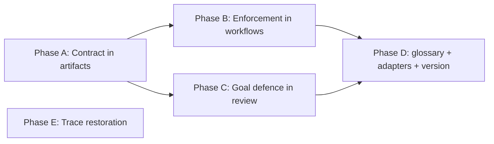

# HL — TFW-53: HL Contract & Goal Defence

> **Date**: 2026-08-08
> **Author**: Coordinator (Claude Code)
> **Status**: 🔬 RES — research in progress
> **Contract**: 🔒 FROZEN — approved by owner 2026-08-08
> **Baseline**: freeze commits, recoverable via `git log --grep='/freeze/'`. Initial freeze `8136306`; re-frozen after amendments A1–A5 (2026-08-08)
> **Frozen sections**: §1 Vision · §3 Target State · §4 Phases · §5 DoD · §6 DoF · §7 Principles
> **Free sections**: §2 · §7.2 · §8 · §9 · §10 · §11 — research updates these directly
> **Amendment channel**: §12 Amendment Log. Frozen sections may not be edited; propose, log, await owner verdict.

> ⚠️ This header applies the mechanism this task exists to build. It is a prototype, not the shipped
> format — Phase A defines the canonical version and may supersede this wording.

---

## 1. Vision

An approved HL is a **contract**, not a draft that research keeps rewriting. The moment the owner approves it, six sections — Vision, Target State, Phases, DoD, DoF, Principles — become frozen. Research can no longer edit them; it can only *propose an amendment*, with evidence, into a visible Amendment Log, and wait for an explicit owner verdict. Everything below the contract — hypotheses, risks, dependencies, as-is analysis, TS content — stays fully fluid, so investigation still does its job.

And the contract gains a defender. The reviewer stops being only a quality guardian and becomes the last gate for goals, values and north star. Review asks "is this what we set out to do?" against the approved baseline and a project north star that finally sits *above* the task — never against a spec that may itself have drifted. Work that is verified, complete and beside the point becomes a rejectable outcome, and alignment can no longer be asserted without citing the clause it serves.

**What this task is for.** An inviolable contract with a defender is the precondition for delegation. Releasing a coordinator to run a team of agent sessions is only safe once the goals cannot move and something checks the result against them. That delegation mode is [TFW-54](../TFW-54__agent_team_mode/PROPOSAL__TFW-54__agent_team_mode.md) — deliberately a separate task, because building both at once splits the coordinator's focus, which is the failure this task exists to prevent.

**Impact:** The owner approves once and stops being a per-step gatekeeper. Scope no longer inflates by a few percent per research iteration, per phase, per review. When a task genuinely must change direction, it becomes a visible, dated, evidence-backed decision instead of a silent edit nobody remembers making.

> "I approved the HL and went away. When I came back the phases were done, and the only thing waiting for me was one amendment proposal with the evidence attached."

## 2. Current State (As-Is)

### The structural root cause

The drift is not agent misbehavior. It is the framework doing exactly what it is told to do.

| # | Mechanism | Where | Effect |
|---|-----------|-------|--------|
| 1 | HL has no approved state | `templates/HL.md` header is only `📝 HL_DRAFT — Awaiting review`. `conventions.md` §5 has no `HL_APPROVED` status. D20: "Implicit approval = transition to next status" | There is no boundary to violate. Nothing is ever "locked" |
| 2 | Research is *required* to change HL | D19: "HL update = mandatory output of RESEARCH". `templates/RES.md` has a mandatory `HL Update Recommendations` section | Every iteration is structurally obligated to produce HL edits |
| 3 | Coordinator is *instructed* to apply them | `plan.md` Step 6c: "Update HL with research findings (present diff to user)" | The coordinator rewrites the HL by design, once per iteration |
| 4 | No distinction between refinement and reversal | RES recommendation table has one class of row | "Risk R4 probability is Medium" and "Phase B should be dropped" arrive through the same channel |
| 5 | No trace of what changed or why | Diff is presented in chat, then evaporates | Three sessions later, nobody can reconstruct which goals were user-approved and which the agent drifted into |

**Consequence:** with `min_iterations: 2`, a multi-phase task rewrites its own HL at least twice before the first TS exists. Each rewrite is individually defensible. The sum is the scope explosion the owner reports.

This failure is already recorded and was never fixed:

> `knowledge/process.md` F6 — *"Coordinator without visionary oversight drifts into scope explosion. Phase A coordinator added tasks/, reference resolver, workflows/templates — all beyond master HL. Need lead coordinator with veto authority across sessions, or at minimum strong HL constraints."* (recorded 2026-04-05, TFW-26)

Empirical evidence that the gap is felt in practice: [TFW-52](../TFW-52__tfw_light_v1/HL-TFW-52__tfw_light_v1.md) carries `Status: ✅ HL_APPROVED` — a status the coordinator invented because the framework offers none.

### Documented precedent: TFW-48 / TFW-49

This exact experiment has already been run and has already failed. In 2026-07-29 → 2026-08-04 the owner approved two HLs, then granted the coordinator full delegation including the use of separate Codex sessions. The result was reverted wholesale.

All artifacts survive in git history (75 files at `721ca15`) and are readable via `git show`. They were removed only from the working tree and the Task Board by restore commit `bc6779e` — a blob-for-blob restore to the v0.9.0 tree, which reverted `README.md` to a state that never contained those rows. Immediately before the restore, `README.md:295` did carry `❌ REJECTED — complete product-fit failure`. The loss of failure status was a side effect of the restore method, not a decision.

| Evidence | Source |
|----------|--------|
| **All six candidate frozen sections were rewritten after approval, in one commit.** `642c647` `[codex/TFW-49/research-iter1/coordinator] accept commit identity research` — `+167/−117`. The same coordinator that ran the research accepted it and edited the approved HL in the same commit. No owner verdict, no diff record, no log | git `642c647` vs approved `9e19a4f` |
| **Direction of drift: uniformly broader.** Vision went from *agent-authored commits* to *every commit in the repository*. Phase C flipped from "safely bypass the current local hook" to "install a TFW-owned hook runtime". All 10 DoD and all 10 DoF items were replaced | HL-TFW-49 diff |
| **A protective DoF was deleted and inverted.** Approved: `❌ Normal human commits are blocked even though the approved policy covers only agent-authored commits.` Post-drift: `❌ Any descendant after activation lacks canonical identity` | HL-TFW-49 §6 |
| **An honesty constraint was replaced by its opposite.** Approved §7.1: `No commit may claim the new format is active before the validator actually is.` Post-drift: `Every later commit must use C1-R even before the installed hook exists` | HL-TFW-49 §7.1 |
| **The amendment vector was a mid-research user remark.** New signal S6 sourced to `User, Challenge correction, 2026-07-30` was promoted directly into master-HL authority. A comment inside a research thread became a contract change | HL-TFW-49 §11 |
| **TFW-48 shows the weaker failure: unrecorded amendment.** Its header states `Research update approved: 2026-07-29`, but the pre-amendment HL was never committed. Drift is documented and permanently unverifiable | HL-TFW-48 header, `ee8d444` |
| **Blanket delegation neutralised the gates.** The approved HL header read: `The user delegated format, phase, execution, review, and closure decisions to the Coordinator on 2026-07-30.` The coordinator later cited its own delegated authority to accept three scope-budget overruns: 702 vs 700 lines, 1708 vs the 1200 LOC signal, 3160 vs a 2700 estimate — each recorded as "No material deviations" | HL-TFW-49 header; RF TFW-48/C F3, RF TFW-49/A §2.4, RF TFW-49/B D1 |
| **Review could not catch it by construction.** All seven phase REVIEWs returned ✅ APPROVE. The one genuine 🔄 REVISE (`1ebb680`, 7 of 10 Judge checks FAIL) was closed three commits later. The review mandate is RF-vs-TS, and the TS derived from the already-drifted HL — so every check passed against a contract that had moved | REVIEW files, `1ebb680` |
| **The Phase HL was a second, unapproved contract.** `TFW-48/phase-a/HL__phase-a__method_kernel.md` carries 10 DoD items, 9 DoF items and 10 principles of its own, self-declaring `✅ HL — Approved scope derived from master HL`. Master principles P7, P10 and P12 do not survive the derivation. No template governs this file and no gate reviews it | iter1 Gather G3 |
| **The master HL already demanded goal defence — and lost it.** TFW-48's approved master carried DoD-11 (*"Review can reject work that satisfies TS/RF but violates the product north star"*) and P7 (*"Independent Review Protects the North Star… the last quality authority before project learning and closure"*). Both were dropped at phase level, then erased entirely on revert. **The framework's failure is retention, not invention** — Phase C is re-inventing a rule this project already wrote once | iter1 Gather G3 |
| **The instruction that caused the drift is still live in a second place.** `templates/RES.md:32` still reads `<!-- List what should change in HL based on research. Coordinator applies these. -->` — the template-side twin of `plan.md` Step 6c. Fixing one and not the other reproduces the failure through the other channel | iter1 Gather G10 |
| **Cost.** 149 files, 27,103 deletions on revert. 5,910 lines of Python runtime and tests thrown away. Six days | `git show --shortstat bc6779e` |

Owner's verdict, written into the HL header at `ad0696e`:

> *"TFW-49 solved a small prompt-design need with an unnecessary software subsystem. … Phases A–C remain immutable failure evidence; they are not the desired architecture."*

And in the restore commit itself:

> *"TFW-48 and TFW-49 remain in Git history as rejected experiments in delegating methodology redesign and execution to Codex without sufficient human supervision."*

**What this establishes.** The failure was not agent incompetence and not a coordination breakdown — the executor/reviewer loop produced 345 tests, cross-platform fixtures and one sharp REVISE. It was an **authority loop with no external termination condition**: blanket delegation granted at approval time → research produces a scope-expanding signal → the same coordinator amends the approved HL to absorb it → phase TSs derive from the amended HL → reviewers verify RF against those TSs → nothing in the chain ever compares the result to what the owner actually approved.

### The autonomy side

| Mode | Defined in | Scope of autonomy |
|------|-----------|-------------------|
| CL (Chat Loop) | `conventions.md` §7, `glossary.md` | Default. AI proposes, human approves/executes |
| AG (Autonomous) | `conventions.md` §7, `glossary.md` | "Explicit request only. AI works within approved **TS** scope" |
| — | — | **Nothing between them.** No mode where the coordinator runs a team within an approved **HL** |

AG is bounded by a TS, which is downstream of research. So there is no legitimate way to say "you are free from here" at the moment the owner actually wants to say it: at HL approval.

Meanwhile the per-iteration interaction cost is high. One research iteration currently passes through roughly ten blocking gates:

```
plan.md:            Step 3 questions 🛑 · Step 4 HL GATE 🛑 · Step 5 hypotheses 🛑 · Step 6a decision 🛑
research/base.md:   Step 2 mode 🛑 · Step 4 briefing 🛑 · Gather checkpoint 🛑 · Extract checkpoint 🛑
                    · Challenge checkpoint 🛑 · Step 6 STOP
plan.md:            Step 6c gate → next iteration or Step 7
```

The owner's actual position is neither "approve every step" nor "let it wander" — and the framework offers only those two.

### Adjacent work — boundaries

| Task | Status | Relationship |
|------|--------|--------------|
| [TFW-44](../TFW-44__coordinator_quality_gates/HL-TFW-44__coordinator_quality_gates.md) | 📝 HL_DRAFT | Touches the same `plan.md` Step 7. Different concern (insight→AC traceability). No merge; file-level collision risk only |
| [TFW-45](../TFW-45__multi_agent_workflows/HL-TFW-45__multi_agent_workflows.md) | ❄️ FROZEN | **Stage-level** subagents inside one workflow (Explorer/Analyst/Critic per research stage). TFW-53 is **session-level** team across workflows. Different granularity, must not blur vocabulary |

## 3. Target State (To-Be)

### What changes

1. **HL gains a contract state.** Header field records approval; six sections become frozen on approval.
2. **HL gains §12 Amendment Log.** Every attempt to change a frozen section lands here as a dated, evidenced proposal with an explicit owner verdict.
3. **RES splits its recommendations into two classes.** `Refinement` (free sections — coordinator applies) vs `Amendment Proposal` (frozen sections — coordinator may NOT apply; must escalate).
4. **`plan.md` Step 6c is inverted.** From "update HL with research findings" to "classify findings; apply refinements; log amendments; escalate".
5. **Goal defence in review.** The reviewer becomes the last gate for goals, values and north star — not only for unverified claims. Three coupled changes: a north-star anchor above the task HL, a substantive goal check replacing the current mapping-integrity check in Judge, and an identity amendment. Not a fifth stage — see the evidence below.
6. **Rejected tasks keep their traces.** A terminal `❌ REJECTED` status, a rule that failed-task folders are never deleted, and restoration of the TFW-48/49 rows and post-mortem stubs.

Explicitly **out of scope**, both by owner decision this session:

| Not built here | Why | Where it goes |
|---|---|---|
| A TS→HL traceability gate | Freezing the HL is the intervention being tested; TS-level enforcement would pre-empt its measurement | Follow-up if drift relocates into TS scope |
| **AT (Agent Team) execution mode** — delegation to separate agent sessions | Needs this contract as its precondition. Building both at once splits coordinator focus and degrades planning quality — the failure mode this task addresses | [TFW-54](../TFW-54__agent_team_mode/PROPOSAL__TFW-54__agent_team_mode.md), proposal written |

### Why review lets purpose failures through

The existing flow can verify a result to death and still miss that it should not exist.

| Existing check | What it actually asks | Why it missed TFW-48/49 |
|----------------|----------------------|-------------------------|
| `judge.md` #1 DoD met? | Does RF satisfy the TS acceptance criteria | The TS derived from the drifted HL |
| `judge.md` #2 Philosophy aligned | Did the AC each HL §7 principle was mapped to pass? | A **mapping-integrity check** — structurally unable to detect a principle violated by the mapping itself |
| `judge.md` Contradictions with KNOWLEDGE.md | Does RF *contradict* a knowledge item | Absence of contradiction ≠ presence of purpose |
| `verify.md` Knowledge Citations Verified | Do the cited links resolve | Anti-hallucination check; the reviewer scans PV and does nothing evaluative with it |
| Reviewer Identity | "Quality guardian… protect the project from unverified claims and incomplete work" | Both named failure modes are quality. Guards against *unverified*, not against *unwanted* |

Every mindset in the chain — Student, Auditor, Judge, Decision-maker — asks "is this true and good?" None asks "is this what we set out to do?"

**The principle chain is self-referential.** HL §7 → TS §3 → RF §3 → `judge.md` row 2. Every link is task-scoped, and HL §7 is authored by the coordinator during planning. If the coordinator drifts, §7 drifts with it, and the whole chain then verifies the work against the drifted spec and reports green. **There is no anchor above the task HL.**

#### Evidence from AFD, where this practice already works

Reconnaissance of `ai-first-devices` (AFD, 46 tasks, 149 REVIEW files, same TFW 0.9.0, review templates byte-identical to upstream) confirms the diagnosis and corrects the proposed fix.

| Finding | Consequence for this task |
|---|---|
| **AFD's Judge principle-check returned ✅ on a genuine violation.** `AFD-38/phase-b/review/judge.md` scored `P8 Owner sees what agent sees → AC-B4 → ✅` and concluded "No principle was mapped to a failed AC. No violation." The reviewer later retracted his own APPROVE: *"I passed work that violates two of our own principles… The code was correct within the AC checkmarks and green tests, but the ACs/TS themselves baked in principle violations."* | The exact TFW-53 defect, demonstrated independently. Fixing row 2 is mandatory, not optional |
| **The working rule lives in agent memory, not in the repo** — `feedback_reviewer_defends_principles.md`: *"The reviewer MUST protect the project's architecture, goals, values, and north-star — even if the coordinator (TS) and executor (RF) both missed. 'The TS scoped it this way' or 'the RF is internally consistent + tests green' is NOT sufficient to APPROVE."* | It is invisible to two of AFD's three agents. A tool-agnostic framework must put the anchor in the repo |
| **AFD has a north-star anchor above the task HL** (`HL-AFD-2`, referenced from CLAUDE.md and tasks/README.md), but only 7 of ~46 task HLs link back to it, and the HL template has no field for it | The anchor must be reachable structurally, not by convention |
| **Base rate: ~4 goal-based blocks in 149 reviews.** 1 REJECT, 25 REVISE | A dedicated stage would report "aligned" ~145 times and become the rubber stamp it was meant to replace |
| **The rule's first effect was a false positive.** An S1 REVISE resting on prose-only rationale was demoted after owner challenge. The memory entry now carries a balancing half: *"a REVISE must be justified by material impact on that value. Wording-only nitpicks must NOT manufacture revision cycles. Trigger = substance, not phrasing."* | The materiality bar must ship in the same pass as the check, not after |
| **Neither AFD case fired unprompted** — both were caught by the owner reading output, then retro-fitted into memory | The check needs a forcing function, or its honest answer will always be "aligned" |

**TFW's PV Index cannot serve as the reference point unchanged.** Its seven sources — README Values, `philosophy.md`, `KNOWLEDGE.md` §1, `conventions.md`, `convention.md`, `process.md`, other knowledge — are all *how we build*. None is *what we are building and why*. And priority 1 "README Values" is a framework-specific section that does not exist in real projects: AFD's README has `## Проблема` / `## Цель` and no Values section, so PV priority 1 is effectively empty there.

**Reference point for the goal check:** the committed approved HL baseline, plus a designated project north star — never the current TS, which is downstream of any drift.

### Frozen vs free

| HL section | State after approval | Rationale |
|------------|---------------------|-----------|
| §1 Vision + Impact + Quote | 🔒 FROZEN | Goals |
| §3 Target State (incl. §3.1, §3.2) | 🔒 FROZEN | Goals — the promised outcome |
| §4 Phases + Phase Dependencies | 🔒 FROZEN | Roadmap |
| §5 Definition of Done | 🔒 FROZEN | Acceptance contract |
| §6 Definition of Failure | 🔒 FROZEN | Acceptance contract |
| §7 Principles (incl. §7.1) | 🔒 FROZEN | Values |
| §2 Current State | 🟢 FREE | As-is facts improve with investigation |
| §7.2 Knowledge Citations | 🟢 FREE | Citation set grows as PV is scanned |
| §8 Dependencies | 🟢 FREE | Status changes are observations |
| §9 Risks | 🟢 FREE | Risk register must track reality |
| §10 RESEARCH Case | 🟢 FREE | Hypothesis statuses are the point of research |
| §11 Strategic Insights | 🟢 FREE | Append-only capture |
| §12 Amendment Log | 🟢 APPEND-ONLY | The change channel itself |

### 3.1 Result Visualization

**Before — iteration 2 of a multi-phase task, today:**

```
RES iter2 § HL Update Recommendations
  | 1 | Add Phase D for adapter sync            | Challenge C4 |
  | 2 | DoD item 7 too narrow — broaden to all  | Extract D9   |
  | 3 | Risk R2 probability Low → High          | Gather F11   |

plan.md Step 6c → "Update HL with research findings (present diff to user)"
  → coordinator rewrites §4, §5, §9
  → posts a diff in chat
  → user skims, says "ok"

Net effect: task grew one phase and loosened one DoD item.
Nobody will ever be able to say when the scope changed, or that it did.
```

**After — same iteration, with the contract in place:**

```
RES iter2 § HL Update Recommendations
  REFINEMENTS (free sections — coordinator applies)
  | 3 | §9  | Risk R2 probability Low → High           | Gather F11   |

  AMENDMENT PROPOSALS (frozen sections — owner verdict required)
  | 1 | §4  | Add Phase D for adapter sync             | Challenge C4 |
  | 2 | §5  | DoD item 7 too narrow                    | Extract D9   |

plan.md Step 6c
  → applies refinement 3 silently
  → writes proposals 1-2 into HL §12 Amendment Log, status = PROPOSED
  → does NOT touch §4 or §5
  → escalates ONE batched message:

     "2 amendment proposals against the frozen contract.
      A1 §4 add Phase D — evidence: RES iter2 Challenge C4 · cost: +1 phase, ~6 files
         alternative considered: fold adapter sync into Phase C
      A2 §5 broaden DoD-7 — evidence: RES iter2 Extract D9 · cost: widens acceptance
         alternative considered: keep DoD-7, add a follow-up task
      Contract holds until you rule. Continue with the contract as-is? [approve/reject/discuss]"
```

**And the HL six months later — the part that did not exist before:**

```
## 12. Amendment Log

| # | Date       | § | Proposed change            | Evidence          | Alternatives         | Verdict     |
|---|------------|---|----------------------------|-------------------|----------------------|-------------|
| A1| 2026-08-14 |§4 | Add Phase D (adapter sync) | RES iter2 C4      | fold into Phase C    | ❌ REJECTED |
| A2| 2026-08-14 |§5 | Broaden DoD-7              | RES iter2 D9      | follow-up task       | ✅ APPROVED |
| A3| 2026-08-21 |§3 | Drop the docs-site target  | RES iter3 D2, RF/A| descope to Phase C   | ❌ REJECTED |
```

The owner opens one table and sees every pressure the task came under, what it was based on, and what they decided. Two of three attempts to grow the task are visible *as attempts* — which is the entire point.

### 3.2 Value Flow

```
OWNER APPROVES HL
        │
        ▼
  CONTRACT FROZEN  ──────────────────────────────┐
  §1 §3 §4 §5 §6 §7                              │  the invariant
        │                                        │
        ▼                                        │
  WORK PROCEEDS ── research · TS · execution     │
        │                                        │
        ▼                                        │
  WORK PRODUCES FINDINGS                         │
        │                                        │
        ▼                                        │
  CLASSIFY ─── touches frozen §? ────────────────┤
        │                    │                   │
     no │                yes │                   │
        ▼                    ▼                   │
   apply silently      §12 AMENDMENT LOG         │
   (refinement)        status: PROPOSED          │
        │                    │                   │
        │                    ▼                   │
        │            ESCALATE — one batched      │
        │            message, evidence + cost    │
        │                    │                   │
        │                    ▼                   │
        │            OWNER VERDICT ──────────────┘
        │            approved → contract re-frozen at new baseline
        │            rejected → work continues under original contract
        ▼
   RESULT DELIVERED
        │
        ▼
   REVIEW · GOAL DEFENCE ── serves the north star?
        │              cite the clause, or it is not aligned
        ├── yes → quality checks decide the verdict
        └── no  → ❌ REJECT, routed to the owner
                  even with every quality check green
        │
        ▼
   PHASES COMPLETE WITHOUT INFLATION

Value created:
  FROZEN CONTRACT   → expectations converge; "approved" finally means something
  CLASSIFICATION    → small drift is caught, not just big pivots
  AMENDMENT LOG     → change becomes evidence-based, dated, transparent
  NORTH STAR        → an anchor above the task; the principle chain stops being self-referential
  GOAL DEFENCE      → verified, complete and beside the point becomes a rejectable outcome
  → and only now is delegation safe to grant (TFW-54)
```

## 4. Phases

### Phase Dependencies



| Phase | Depends on | Shared files | Can run in parallel with |
|-------|-----------|--------------|--------------------------|
| A | Independent | `conventions.md`, `glossary.md` | E |
| B | A | `conventions.md` | C, E |
| C | A | `conventions.md` | B, E |
| D | A + B + C | `conventions.md`, `glossary.md`, adapter copies of `plan.md` and `review.md` | E |
| E | Independent | `README.md`, `conventions.md` §5, `project_config.yaml` | A, B, C, D |

### Phase A: Contract in Artifacts 🔴

> **Requires:** Independent
>
> **⚠️ Shared files with Phase B/C:** `conventions.md` (§3 in A, §14 in A, §7 in C) — section-level split, coordinate ordering
>
> **Context for coordinator:**
> 1. `.tfw/templates/HL.md` — full current structure, §1–§11
> 2. `.tfw/templates/RES.md` — `HL Update Recommendations` section
> 3. `.tfw/conventions.md` §3 (Artifact Types → HL), §5 (Statuses), §14 (Anti-patterns)
> 4. D19 (HL update = mandatory RESEARCH output — this task narrows it), D20 (implicit approval), D31 (filesystem-as-state-machine), D49 (requirements-first TS)
> 5. `knowledge/philosophy.md` F4 (structural > format enforcement), F21 (explicit N/A pattern), F22 (template minimalism)
>
> **Key decisions:** D19 (narrowed, not revoked), D20 (implicit approval — now insufficient), D24 (inline enforcement), D31 (structural state)
>
> **⚠️ Cascade dependency:** adding §12 shifts nothing above it, but `plan.md` Step 4/6c and `research/base.md` Step 6 reference HL sections — Phase B must land before adapters are synced in Phase C
>
> **Deliverables:**
> 1. `templates/HL.md` — contract state field in the header block; frozen/free marking of sections; new `§12 Amendment Log` with column grammar and an explicit-N/A default
> 2. `templates/RES.md` — `HL Update Recommendations` split into `Refinements` and `Amendment Proposals`, each with a target-section column; instruction that the researcher classifies but never applies. **The line `templates/RES.md:32` (`Coordinator applies these`) must be removed in the same pass** — leaving it ships DoF-1 inside the enforcement site, and no other DoD item would catch it (iter1 C6)
> 3. `conventions.md` §3 — HL Contract definition: what freezes, when, what append-only means for §12; **the approved HL must be committed before the first research iteration** — an uncommitted baseline makes "frozen" unverifiable (TFW-48 precedent).
>    **Granularity (inside approved scope, no amendment — iter1 D2/D4/D13):** the frozen unit is the *declarative claim*, not the section text. Frozen: the phase set and each phase's declared outcome, §3's to-be claims, §5/§6 items, §7 principles, §1. Free: the deliverable list inside an already-approved phase — unless the change cannot be accepted under the existing §5/§6, which is the tripwire that makes it an amendment. Non-substantive edits (typos, broken links, formatting) are not amendments. This is the single decision that moves escalation from 4.6 to ~2.3 per iteration
>    **Baseline reference (iter1 D5/D6):** a reserved commit scope word — `[agent/TFW-NN/freeze/coordinator]`, recoverable via `git log --grep`. A header cannot name its own commit, so the baseline lives in the commit subject, not in the file
> 4. `conventions.md` §3 — an amendment verdict is a distinct, recorded act: a remark inside a research thread is input, never approval (TFW-49 S6 precedent)
> 5. `conventions.md` §14 — anti-patterns for silent contract edits, unclassified recommendations, uncommitted baselines, research-remark-as-verdict, and a Phase HL that authors acceptance criteria or principles
> 6. _(A1)_ `conventions.md` §3 — **Phase HL is derivation-only**: it may restate master content and add execution context; it may not carry its own §1, §5, §6 or §7. Evidence: TFW-48's Phase A HL is a complete second contract that dropped master P7, P10 and P12
> 7. _(A5)_ `conventions.md` §5 — **REJECT composition**: branch (a) "rework HL" is redefined as *file an amendment against the frozen sections*, and re-entry to `📝 HL_DRAFT` does not thaw them
>
> **⚠️ Shared file with Phase E:** both phases edit `conventions.md` §5 — A rewrites branch (a) semantics, E adds the `❌ REJECTED` status row. Different lines; sequence A before E, or coordinate at TS time

### Phase B: Enforcement in Workflows 🟡

> **Requires:** Phase A ✅
>
> **⚠️ Shared files with Phase A:** `conventions.md` (§14 additions may extend A's list)
>
> **Context for coordinator:**
> 1. Phase A RF — what the template and conventions actually shipped (not Phase A TS)
> 2. `.tfw/workflows/plan.md` Step 4 (HL GATE), Step 5, Step 6c (iteration gate), Step 7
> 3. `.tfw/workflows/research/base.md` Step 6 (Synthesis)
> 4. `knowledge/constraint.md` F2 (workflow degrades >1200 words — `plan.md` is near budget), `knowledge/process.md` F4 (numbered steps + gates work, prose does not)
>
> **Key decisions:** D23 (workflow compression — no prose blocks), D24 (Pattern A: inline defaults), D49 (gates > guidelines)
>
> **Deliverables:**
> 1. `plan.md` Step 4 — approval gate records the contract state in the HL header instead of leaving approval implicit
> 2. `plan.md` Step 6c — rewritten: classify RES recommendations, apply refinements, write amendment proposals to §12, escalate as one batched message, never edit frozen sections
> 3. `plan.md` — amendment verdict handling: approved → apply, then **a re-freeze commit at the new baseline** _(A3)_; rejected → continue under the original contract, proposal stays logged with its verdict
> 4. `research/base.md` Step 6 — researcher classifies recommendations by target section; Role Lock reinforced: researcher proposes, never edits HL
> 5. Word-budget check: `plan.md` stays within the workflow attention budget (F2)

### Phase C: Goal Defence in Review 🔴

> **Requires:** Phase A ✅ (needs the committed-baseline rule and the frozen-section definition as its reference point)
>
> **⚠️ Shared files with Phase A/B/D:** `conventions.md` (A owns the HL-contract entries in §14, C appends review-side ones), `glossary.md` (PV Index — C adds priority 0, D adds AT terms)
>
> **Design note — why not a fifth stage.** The owner proposed a separate stage. AFD reconnaissance argues against it on three counts: goal defence there always produced a *verdict*, never a document; the base rate is ~4 blocks in 149 reviews, so a stage would report "aligned" ~145 times and become the rubber stamp it replaces; and AFD's own recorded principle is *"cut ceremony, never gates."* The three deliverables below place the same force where verdicts are formed. **Owner decision pending** — if the stage form is preferred, deliverable 2 becomes `templates/review/guard.md` and 1/3 are unchanged.
>
> **Context for coordinator:**
> 1. `.tfw/workflows/review.md` — Step 4 Judge and its `HL §7 Principles check` paragraph, Reviewer Identity block, Trust Protocol
> 2. `.tfw/templates/review/judge.md` — Universal Checklist row 2, Contradictions table, Checkpoint
> 3. `glossary.md` → Project Values (PV) and PV Index — the layer that gains priority 0
> 4. `.tfw/templates/HL.md` header block — no north-star field exists
> 5. D41 (4-stage review), D43/D44 (PV cascade, Knowledge Citations as anti-hallucination pattern), D46 (Reviewer Identity), D49 (Principles Check origin)
> 6. `knowledge/philosophy.md` F4 (structural over exhortation), F21 (explicit N/A), F25 (framework proposes, human decides)
> 7. Negative controls: TFW-48/49 REVIEWs via `git show 721ca15:<path>` (7 approvals of rejected work) and, in AFD, `AFD-38/phase-b/` (retracted APPROVE) and `AFD-48/phase-b/` (the false-positive precedent)
>
> **Key decisions:** D44 (PV Index extended, not replaced), D43 (citation-with-link as the anti-rubber-stamp device), D46 (identity anchoring beats instruction volume), F4 (structural, since AFD's memory-only rule proved non-portable)
>
> **Deliverables:**
> 1. **North-star anchor** — the load-bearing piece; the other two are inert without it. PV Index gains **priority 0: Project North Star** — what we are building and why, as opposed to the seven existing sources which are all *how we build*. A project designates it (a dedicated section, or an existing HL nominated as such); `templates/HL.md` gains a header field pointing at it, so reachability is structural rather than conventional. No mandated size — the reviewer-relevant payload is roughly one page
> 2. **Substantive goal check in Judge**, replacing the mapping-integrity check. It asks whether the delivered result serves the north-star purpose the task claims to serve, and whether it is an investment or a deferred local workaround. Carries three clauses, all mandatory: an **override clause** (*"the TS scoped it this way"* and *"tests are green"* are not sufficient grounds to APPROVE), a **materiality bar** (a block must rest on material impact on the value, never on wording — the AFD-48 precedent), and a **forcing function** (the reviewer must quote the north-star clause the work serves; "aligned" may not be asserted without a citation, mirroring D43)
> 3. **Reviewer Identity amendment** — currently *"protect the project from unverified claims and incomplete work"*, two quality failure modes. Extended to name the third: last line of defence for goals, values and north star, with authority to block work that is verified, complete and beside the point
> 4. Verdict semantics: a goal failure is grounds for ❌ REJECT with every quality check passing; a REJECT on goal grounds routes to the owner, not back to the executor
> 5. `templates/REVIEW.md` — goal-defence finding surfaced in the synthesis
> 6. `conventions.md` §14 — anti-patterns: reviewer approves work that satisfies the TS but not the approved contract or north star; reviewer asserts alignment without citing the clause it serves
> 7. Namespace guard: project-level principles must not reuse HL §7's `P{n}` numbering — AFD carries three concurrent `P1..Pn` namespaces and its own reviewers cite ambiguously

### Phase D: Glossary, Adapters and Version 🟡

> **Requires:** Phase A ✅ + Phase B ✅ + Phase C ✅
>
> **⚠️ Shared files with Phase A/B/C:** `glossary.md` (C adds PV priority 0, D consolidates all terms)
>
> **Context for coordinator:**
> 1. Phase A RF + Phase B RF + Phase C RF — final wording and terminology to propagate
> 2. `conventions.md` §9 (Tool Adapter Pattern) — thin-adapter rule
> 3. `glossary.md` — Artifact Types, Roles, Execution Gates sections
> 4. D54 (adapter parity = behavioral promise, not file layout), D28 (naming = prompting — the terms shipped here are the product)
> 5. Adapter surface: `.claude/commands/tfw-plan.md`, `.claude/commands/tfw-review.md`, `.agent/workflows/tfw-plan.md`, `.agent/workflows/tfw-review.md`, `.tfw/adapters/codex/skills/tfw-{plan,review}/SKILL.md`, `.agents/skills/tfw-{plan,review}/SKILL.md`, `CLAUDE.md`, `AGENTS.md`
>
> **Key decisions:** D54 (adapter parity), D28 (final terminology)
>
> **Deliverables:**
> 1. `glossary.md` — terms: HL Contract, Frozen Section, Amendment, Amendment Log, Contract Baseline, Project North Star, Goal Defence
> 2. Terminology consistency pass: one name per concept across `conventions.md`, `glossary.md`, templates and workflows — per D28 the naming is the deliverable, not decoration
> 3. Adapter + entry-point sync across the surface listed above
> 4. Version bump + `CHANGELOG.md` entry; a `TFW-54` pointer recorded so the contract's purpose is not orphaned

### Phase E: Rejected-Task Trace Restoration 🟢

> **Requires:** Independent — can run at any point, including first
>
> **⚠️ Shared files with Phase A/D:** `README.md` (Task Board + status legend), `conventions.md` §5, `project_config.yaml` (`tfw.statuses`)
>
> **Scope discipline:** restore *visibility*, not content. The 75 artifact files stay in git history where they already are. Do not re-add them to the working tree.
>
> **Context for coordinator:**
> 1. `conventions.md` §5 (status set and review verdicts — `❌ REJECT` currently routes to a user branching point but has no terminal board status)
> 2. `project_config.yaml` → `tfw.statuses`
> 3. `README.md` Task Board and its status legend line
> 4. Recovery references: full trees at `721ca15`; deletion at `bc6779e`; pre-restore board rows at `5b17786:README.md:294-295`
> 5. `.tfw/README.md` § Structural Enforcement; `conventions.md` §13 Trace Discipline
>
> **Deliverables:**
> 1. `❌ REJECTED` as a terminal task status in `conventions.md` §5, `project_config.yaml` `tfw.statuses`, `glossary.md` and the README legend — distinct from `❌ BLOCKED` (blocked = waiting, rejected = closed unsuccessfully, trace retained)
> 2. `conventions.md` §13 — rule: a rejected task's folder and board row are never deleted; reverting the *result* does not revert the *trace*
> 3. `conventions.md` §14 — anti-pattern: whole-tree restore that silently reverts the Task Board past a task's failure status
> 4. `tasks/TFW-48__*/` and `tasks/TFW-49__*/` recreated containing exactly one post-mortem file each: what the task attempted, the owner's verbatim rejection verdict, the failure mechanism, the git references needed to recover the full artifacts, and what replaced it
> 5. Board rows restored with `❌ REJECTED` status and links to those folders

## 5. Definition of Done (DoD)

**Phase A — Contract in artifacts**

- ✅ 1. `templates/HL.md` carries an explicit contract state in its header, and every section is unambiguously marked frozen or free.
- ✅ 2. `templates/HL.md` contains `§12 Amendment Log` with a fixed column grammar — date, section, **type**, proposed change, evidence, cost, alternatives, verdict — and an explicit-N/A default for tasks with no amendments. Type values: `EXTEND` / `SUPERSEDE` / `APPLIED — restrictive`. _(amended by A2)_
- ✅ 3. `templates/RES.md` separates `Refinements` from `Amendment Proposals`, each row naming its target HL section.
- ✅ 4. `conventions.md` defines the HL Contract: the six frozen sections, the moment of freezing, and the append-only nature of §12.
- ✅ 5. `conventions.md` requires the approved HL to be committed before the first research iteration, so the frozen baseline is diffable — closing the TFW-48 unverifiable-drift mode.
- ✅ 6. `conventions.md` states that an amendment verdict is a distinct recorded act and that input given inside a research thread is never approval — closing the TFW-49 S6 mode. **An owner-initiated change to a frozen section is an amendment too**: logged in §12 with the owner as proposer and the verdict on the same row. _(amended by A4)_
- ✅ 7. `conventions.md` states that a delegated mandate is a ceiling and never a source of new permission: no agent may widen its own grant or cite delegation as authority to accept a scope or budget overrun.
- ✅ 8. `conventions.md` §14 carries anti-patterns for: editing a frozen section without a logged owner verdict; submitting recommendations without classification; applying an amendment before its verdict; starting research on an uncommitted HL; treating a research-thread remark as a verdict; citing one's own delegation to accept an overrun; **a Phase HL that authors its own acceptance criteria or principles**.
- ✅ 9. `conventions.md` §3 defines the **Phase HL as derivation-only**: it may restate master content and add execution context, and may not carry its own §1, §5, §6 or §7. _(added by A1)_
- ✅ 10. `conventions.md` redefines `❌ REJECT` branch (a) "rework HL" as **filing an amendment against the frozen sections**, and states that re-entry to `📝 HL_DRAFT` does not thaw them. _(added by A5)_

**Phase B — Enforcement in workflows**

- ✅ 11. `plan.md` Step 4 records contract approval in the artifact — approval is no longer implicit.
- ✅ 12. `plan.md` Step 6c classifies rather than updates: refinements applied, amendments logged as PROPOSED, frozen sections untouched, escalation batched into one message carrying evidence, cost and alternatives.
- ✅ 13. `plan.md` specifies both verdict paths — approved (apply, then re-freeze at the new baseline) and rejected (proposal stays logged, work continues under the original contract).
- ✅ 14. `plan.md` requires a **re-freeze commit at the new baseline after every approved amendment** — DoD-5 covers only the commit before the first research iteration, and without this the second baseline is unverifiable. _(added by A3)_
- ✅ 15. `research/base.md` requires the researcher to classify recommendations by target section and restates that the researcher never edits the HL.
- ✅ 16. `plan.md` stays within the workflow attention budget (F2: working range 700–900 words, hard degradation above 1200).

**Phase C — Goal defence in review**

- ✅ 17. The PV Index gains a **priority 0 Project North Star** source answering "what we are building and why", distinct from the seven existing "how we build" sources, defined in `glossary.md` and `conventions.md`.
- ✅ 18. `templates/HL.md` carries a header field pointing at the project north star, so a reviewer reaches it structurally rather than by convention.
- ✅ 19. The Judge mapping-integrity check is replaced by a substantive goal check whose reference set is the committed contract baseline plus the north star; `review.md` states explicitly that neither the TS nor a Phase HL is a valid reference for it.
- ✅ 20. That check carries all three clauses: an **override clause** naming "the TS scoped it this way" and "tests are green" as insufficient grounds to APPROVE; a **materiality bar** requiring material impact on the value, never wording; a **forcing function** requiring the reviewer to quote the north-star clause the work serves.
- ✅ 21. Reviewer Identity names goals, values and north star as a defended object alongside unverified claims and incomplete work, with authority to block verified, complete work that is beside the point.
- ✅ 22. A goal failure is defined as sufficient grounds for ❌ REJECT with every quality check passing, and that verdict routes to the owner rather than back to the executor.
- ✅ 23. `templates/REVIEW.md` surfaces the goal-defence finding in its synthesis.
- ✅ 24. Project-level principles use a numbering namespace distinct from HL §7 `P{n}`.
- ✅ 25. `review.md` stays within the workflow attention budget (F2).
- ✅ 26. **Replay validation:** run the new check against the seven TFW-48/49 phase REVIEWs and against three TFW reviews that were genuinely sound. At least one non-approve outcome on the former, none on the latter — a check that fires on everything is as useless as one that fires on nothing.

**Phase D — Glossary, adapters, version**

- ✅ 27. `glossary.md` defines HL Contract, Contract Baseline, Frozen Section, Amendment, Amendment Log, Project North Star and Goal Defence.
- ✅ 28. One name per concept across `conventions.md`, `glossary.md`, templates and workflows — no synonym drift.
- ✅ 29. Adapter and entry-point copies of every changed workflow are re-synced (`tfw-plan`, `tfw-review` across Claude Code, Antigravity and Codex surfaces).
- ✅ 30. Version bumped, `CHANGELOG.md` records the change, and a TFW-54 pointer is recorded so the contract's purpose is not orphaned.

**Phase E — Rejected-task trace restoration**

- ✅ 31. `❌ REJECTED` exists as a terminal status in `conventions.md` §5, `project_config.yaml`, `glossary.md` and the README legend, semantically distinct from `❌ BLOCKED`.
- ✅ 32. `conventions.md` states that a rejected task's folder and board row are never deleted, and §14 carries the whole-tree-restore anti-pattern.
- ✅ 33. `tasks/TFW-48__*/` and `tasks/TFW-49__*/` each contain one post-mortem file with the owner's verbatim verdict and the git references needed to recover the full artifacts; both rows are back on the Task Board as `❌ REJECTED`.

## 6. Definition of Failure (DoF)

- ❌ 1. The contract is advisory prose in `conventions.md` with no counterpart in the HL artifact or `plan.md` — a rule with no enforcement site, repeating the D17/Pattern-B failure.
- ❌ 2. Freezing is so broad that routine research output (risk status, hypothesis status, dependency status) triggers amendment escalations — the owner is now interrupted more, not less.
- ❌ 3. `plan.md` grows past the attention budget and agents start skipping steps (F2).
- ❌ 4. Any part of the AT execution mode is built here rather than in TFW-54 — the scope inflation this task exists to prevent, committed by the task itself.
- ❌ 5. The contract is designed around delegation specifics rather than standing on its own, coupling TFW-53's correctness to a task that has not been planned yet.
- ❌ 6. A TS→HL traceability gate is built despite being ruled out of scope by the owner.
- ❌ 7. Amendment escalation is defined but the rejected path is not — proposals accumulate with no resolution and the log becomes noise.
- ❌ 8. D19 is silently revoked rather than narrowed: research stops producing HL feedback altogether, and investigation loses its purpose.
- ❌ 9. The contract permits a blanket delegation clause of the TFW-49 form ("format, phase, execution, review and closure decisions") — leaving the door open for TFW-54 to reproduce the failure verbatim.
- ❌ 10. The freeze ships without a committed baseline requirement, leaving "frozen" unverifiable exactly as in TFW-48.
- ❌ 11. The goal check degrades into another quality question — it re-asks DoD or style questions, or reverts to mapping integrity, and would still have approved TFW-48/49.
- ❌ 12. The goal check takes the TS as its reference point, inheriting the very drift it exists to detect.
- ❌ 13. The goal check ships without the materiality bar and starts manufacturing revision cycles on wording — the documented AFD-48 failure, reproduced.
- ❌ 14. The goal check ships without a north-star anchor, leaving the principle chain self-referential and the check with nothing above the task HL to measure against.
- ❌ 15. Alignment can be asserted without citing the clause it serves — the check becomes a rubber stamp and the replay produces seven approvals.
- ❌ 16. Phase E re-adds the 75 TFW-48/49 artifact files to the working tree — restoring content instead of visibility, and re-importing rejected methodology as if it were current.
- ❌ 17. `❌ REJECTED` is introduced without a semantic boundary against `❌ BLOCKED`, and agents start using them interchangeably.

**On failure:** stop the affected phase, keep the artifacts as evidence, revert that phase's file set to the last reviewed state, and re-enter through `/tfw-plan` with an amendment proposal — do not paper over a structural failure with more instruction text.

## 7. Principles

1. **The contract earns the autonomy** — delegation is safe only because the frozen sections cannot move. Freedom below the contract and inviolability of the contract are one mechanism, not two features.
2. **Classify, never edit** — the researcher's job is to name which section a finding targets; the coordinator's job is to apply or escalate. Neither may quietly rewrite goals.
3. **Structural enforcement over guidelines** — F4: the contract must exist as artifact state and workflow gate, not as advice. A rule with no enforcement site is decoration.
4. **Batch, don't interrupt** — escalation is one message per iteration carrying evidence, cost, and alternatives; not a stream of approval requests. The owner's attention is the scarce resource this task is protecting.
5. **Evidence, cost, alternative** — no amendment proposal without all three. "Research suggests X" is not grounds to move a goal.
6. **Narrow D19, don't revoke it** — research must still feed the HL. Only the *frozen* channel changes from write to propose.
7. **Token density** — D23/F2: `plan.md` is near budget. Everything added is a numbered gate, never a prose block.
8. **Tool-agnostic by behavior** — D54/F13: the contract, the north star and the goal check are files and rules, never tool features. AFD's most load-bearing review rule lives in one vendor's memory layer and is invisible to two of its three agents; that is the mistake not to repeat.
9. **Naming creates behavior** — D28: "contract", "frozen", "amendment" are chosen because they carry legal-grade associations that "update recommendation" does not.
10. **Authority cannot self-extend** — a delegated mandate is a ceiling, never a source of new permission. The coordinator may not widen its own grant, nor cite delegation to accept an overrun. TFW-49 did both, three times.
11. **A remark is not a verdict** — input given inside a research thread is evidence for a proposal, never approval of one. Verdicts are a distinct recorded act against a numbered amendment.
12. **A frozen baseline must be diffable** — the approved HL is committed before research starts. An uncommitted contract cannot be shown to have held, and TFW-48's drift is permanently unverifiable for exactly this reason.
13. **Purpose is a distinct question, judged where verdicts are formed** — "is this true and good?" and "is this what we set out to do?" are orthogonal. The second needs its own reference point and its own override clause, not its own ceremony: AFD's goal defence always produced a verdict, never a document, and a check that reports "aligned" 145 times out of 149 is a rubber stamp regardless of which stage it sits in.
14. **Every gate needs a materiality bar** — a block must rest on material impact on the value, never on phrasing. A goal check without this trades false negatives for false positives, which is what happened in AFD the first time it fired.
15. **Alignment must be cited, not asserted** — the reviewer quotes the clause the work serves. Same device as Knowledge Citations (D43), same reason: an unciteable claim is indistinguishable from a hallucinated one.
16. **Judge against the baseline, never the spec** — the TS is downstream of any drift, so measuring against it can only confirm the drift.
17. **A failed trace is the most valuable trace** — it records what cannot be re-derived. Reverting a result must never revert its evidence.

### 7.1 Quality Contract

Copy into each Phase TS:

- No new HL/RES/TS template sections beyond those named in DoD — F22 (template minimalism).
- No domain-specific language in framework text — F13.
- Every added workflow instruction is a numbered step or a gate, never a paragraph — F4 (process).
- Explicit N/A is mandatory wherever a new section may be empty — F21.
- No vendor mechanism names (`define_subagent`, thread APIs, session IDs) in `conventions.md` or `glossary.md`; vendor detail belongs in `adapters/` only.
- Section-level coordination on `conventions.md`: A owns §3 + the HL-contract entries in §14; B may append to §14; C owns the review-flow description and appends review-side §14 entries; E owns §5 + §13 and appends the restore anti-pattern to §14; D changes no section content, only terminology consistency. Never rewrite another phase's section.
- No phase may introduce any part of the AT execution mode. Delegation belongs to TFW-54.
- Phase E restores visibility only. Adding any TFW-48/49 artifact file beyond one post-mortem per task is out of scope.

### 7.2 Knowledge Citations

| # | Source | Item | How it applies |
|---|--------|------|----------------|
| 1 | [`.tfw/README.md`](../../.tfw/README.md) § Structural Enforcement | Gates should be structural, not procedural | The contract must be artifact state + workflow gate, not a checkbox |
| 2 | [`.tfw/README.md`](../../.tfw/README.md) § Naming Creates Behavior | Precise terms replace paragraphs | "Contract / Frozen / Amendment" chosen deliberately over "update recommendation" |
| 3 | [`.tfw/README.md`](../../.tfw/README.md) § Candor Over Flattery | Coordinator asks uncomfortable questions | Amendment escalation must present cost and alternatives, not just relay research |
| 4 | [`KNOWLEDGE.md`](../../KNOWLEDGE.md) §1 D19 | HL update = mandatory RESEARCH output | The rule this task narrows — research proposes for frozen sections, applies for free ones |
| 5 | [`KNOWLEDGE.md`](../../KNOWLEDGE.md) §1 D20 | "Implicit approval = transition to next status" | Root cause of the missing boundary; HL approval must become explicit |
| 6 | [`KNOWLEDGE.md`](../../KNOWLEDGE.md) §1 D23 | Workflow compression, plan.md at budget | Additions to `plan.md` must be checklist-grade |
| 7 | [`KNOWLEDGE.md`](../../KNOWLEDGE.md) §1 D24 | Pattern A — inline defaults, not indirection | Contract rules must be inline where enforced, not referenced from afar |
| 8 | [`KNOWLEDGE.md`](../../KNOWLEDGE.md) §1 D31 | Filesystem-as-state-machine | Candidate mechanism for contract state — tested by H3 |
| 9 | [`KNOWLEDGE.md`](../../KNOWLEDGE.md) §1 D49 | Gates > guidelines | Enforcement lives in workflow gates, not advisory text |
| 10 | [`KNOWLEDGE.md`](../../KNOWLEDGE.md) §1 D54 | Adapter parity = behavioral promise | The contract and the goal check must behave identically across tools; Phase D syncs every adapter copy |
| 11 | [`knowledge/philosophy.md`](../../knowledge/philosophy.md) F4 | Structural enforcement beats format enforcement | Contract as state + gate, not a header checkbox |
| 12 | [`knowledge/philosophy.md`](../../knowledge/philosophy.md) F13 | TFW is domain-agnostic | The north star and goal check must work for analytics, writing and business processes, not only code; AFD's screening questions are Android-specific and must not transfer |
| 13 | [`knowledge/philosophy.md`](../../knowledge/philosophy.md) F21 | Explicit N/A pattern | §12 must render "No amendments." rather than being absent |
| 14 | [`knowledge/philosophy.md`](../../knowledge/philosophy.md) F22 | Template minimalism | Only §12 is added to HL; no optional blocks |
| 15 | [`knowledge/philosophy.md`](../../knowledge/philosophy.md) F25 | Framework proposes, human decides | Exactly the amendment protocol: research proposes, owner decides |
| 16 | [`knowledge/process.md`](../../knowledge/process.md) F4 | Numbered steps + gates work; prose loses agents | All additions are numbered gates |
| 17 | [`knowledge/process.md`](../../knowledge/process.md) F6 | Coordinator drifts into scope explosion without oversight | The recorded, unfixed instance of this exact problem |
| 18 | [`knowledge/process.md`](../../knowledge/process.md) F14 | Agents fast-run without structural enforcement | Freeze must be structural or agents will route around it |
| 19 | [`knowledge/process.md`](../../knowledge/process.md) F20 | HL = vision (authoritative on WHAT); user decides on divergence | Precedent that HL/TS conflicts escalate to the owner |
| 20 | [`knowledge/constraint.md`](../../knowledge/constraint.md) F2 | >1200 words degrades workflows; 700–900 working range | Hard budget on `plan.md` additions |
| 21 | [`.tfw/conventions.md`](../../.tfw/conventions.md) §7 | Execution Modes CL/AG | The section AT extends |
| 22 | [`.tfw/conventions.md`](../../.tfw/conventions.md) §15 | Role Lock Protocol | Role locks stay intact; the amendment protocol changes what may be written, not who writes it |
| 23 | [`KNOWLEDGE.md`](../../KNOWLEDGE.md) §1 D55 | Minimal commit attribution `[agent/task/scope/role]` | Supplies the vehicle for the baseline reference — a reserved `freeze` scope word, recoverable via `git log --grep`, since a header cannot name its own commit |
| 24 | [`knowledge/process.md`](../../knowledge/process.md) F11 | Organic emergence → formalisation | TFW-52 iteration 2 hand-rolled an amendment protocol unprompted; formalising it is the documented pattern, not an invention |

## 8. Dependencies

| Dependency | Status |
|------------|--------|
| Owner approval of the frozen-section set (§1, §3, §4, §5, §6, §7) | ✅ confirmed 2026-08-08 |
| Owner decision: no TS→HL traceability gate | ✅ confirmed 2026-08-08 |
| Owner decision: delegation as a third execution mode, not a per-task autonomy parameter | ✅ confirmed 2026-08-08 — scope moved to TFW-54 |
| Owner ruling: goal defence as a strengthened Judge check, not a fifth stage | ✅ confirmed 2026-08-08 |
| Owner ruling: AT mode split out to TFW-54; TFW-53 is its fundament | ✅ confirmed 2026-08-08 |
| [TFW-54](../TFW-54__agent_team_mode/PROPOSAL__TFW-54__agent_team_mode.md) — consumes this contract; must not start before Phase C | ⬜ proposal only |
| [TFW-44](../TFW-44__coordinator_quality_gates/) — shares `plan.md` Step 7 | 📝 HL_DRAFT — independent; sequence before adapter sync if it activates |
| [TFW-45](../TFW-45__multi_agent_workflows/) — session vs stage granularity boundary | ❄️ FROZEN — stays frozen; read-only reference |
| Owner decision: add goal defence to review; add rejected-trace restoration | ✅ confirmed 2026-08-08 |
| AFD project reconnaissance — the unwritten reviewer-as-guardian practice | ✅ complete 2026-08-08; H8/H9/H10 settled, Phase C redesigned |
| Owner ruling on form: strengthened Judge check (coordinator recommendation) vs the fifth stage originally proposed | ⬜ |
| RESEARCH iteration 1 — amendment frequency, contract state mechanism, Phase HL drift | ✅ complete 2026-08-08 → [RES iter1](research/iter1/RES.md), baseline `8136306` |
| RESEARCH iteration 2 — goal defence, north star, verdict vocabulary, replay validation | ⬜ scoped and ready |
| Owner verdicts on amendment proposals A1–A5 in §12 | ✅ all five APPROVED 2026-08-08; applied and re-frozen |
| Owner ruling on Q1 — constrain the Phase HL rather than abolish the class | ✅ constrain (A1) 2026-08-08 |
| Phase A TS → RF | ⬜ |
| Phase B TS → RF | ⬜ |
| Phase C TS → RF | ⬜ |
| Phase D TS → RF | ⬜ |
| Phase E TS → RF | ⬜ |

## 9. Risks

| Risk | Probability | Impact | Mitigation |
|------|-------------|--------|------------|
| Freeze produces escalation spam and the owner ends up more interrupted than before | Medium | High | H1 measures historical amendment frequency; batching rule (Principle 4); free-section list deliberately covers all routine research output |
| `plan.md` exceeds the attention budget and agents skip steps | Medium | High | F2 hard budget in DoD-15; Step 6c is a rewrite, not an addition — old "update HL" text is removed |
| Agents route around the freeze by inflating the TS instead of the HL | Medium | Medium | Owner ruled the TS gate out of scope; accept and monitor. Record as a known open flank in TECH_DEBT if observed |
| Nothing downstream verifies the result against the *approved* HL, so the freeze protects the document but not the outcome | High | High | Confirmed by TFW-48/49 (7/7 approvals). Addressed by Phase C; validated by DoD-21 replay against those same reviews |
| The goal check degenerates into a quality question and approves everything | Medium | High | DoF-11/13b; the replay test in DoD-21 is a falsifiable acceptance gate, not an assertion. AFD evidence: the existing principle row scored ✅ on a real violation |
| The goal check overcorrects and manufactures revision cycles on wording | Medium | Medium | Documented in AFD-48/B before we started. Materiality bar is a mandatory clause (DoD-19), and DoD-21 requires zero blocks on three sound reviews |
| The north-star anchor becomes an adoption tax on small projects | Medium | Medium | H12: no mandated size; a designated existing section or HL qualifies. Revisit optionality if H12 is refuted |
| Phase D approaches the scope budget — ~10 adapter and entry-point files plus `glossary.md` | Medium | Low | Within `max_modified_files: 12` after AT moved out; `plan.md` Step 7 re-checks at TS time |
| The task grew and then shrank inside one planning session — 3 phases → 5 → 5 with AT removed | Low | Medium | Every move was an explicit owner decision recorded in §11 (S15–S18, S24), not coordinator drift. This is the amendment protocol executed by hand before it exists |
| Phase HLs are a second, unapproved contract — not a leaky deliverable list. TFW-48's Phase A HL authored its own DoD, DoF and principles, and dropped three master principles in the process | **High** | **High** | Confirmed by iter1 (H6). Addressed by amendment proposal A1: Phase HL becomes derivation-only. Until ruled, the freeze protects the master while drift relocates one level down |
| Escalation volume converts the amendment gate into a rubber stamp | Medium | High | iter1: the D2 granularity rule holds the load at ~2.3 proposals per iteration instead of 4.6. Principle 5 puts the evidence-cost-alternative burden on the proposer, so declining stays cheap. External CCB evidence: without an impact assessment the ruler defaults to approve |
| Salami — free deliverable refinements accumulate unlogged and sum to a scope change | Medium | Medium | Conceded by iter1, not solved: §12 records amendments only, and nothing counts free changes. This is HL §11 S3's exact mechanism surviving inside the fix. Candidate mitigation deferred to Phase A/B TS: `git diff` against the freeze baseline at the pre-TS gate |
| Four phases touching `conventions.md` collide | Medium | Medium | Section-level ownership in §7.1 Quality Contract; Pre-TS Gate reads predecessor RF |
| TFW-54 is planned against a contract that turns out not to support delegation | Medium | Medium | DoD-10 lands the non-self-extendable-authority rule here, so the clause TFW-54 needs already exists when it starts |
| Contract makes legitimate mid-task learning feel adversarial | Low | Medium | Amendment is a first-class, expected path — not a failure. Approved amendments re-freeze at a new baseline rather than "breaking" the contract |

## 10. RESEARCH Case

### Blind Spots

- **Amendment frequency is unmeasured.** Nobody has counted how often historical RES recommendations touched what will now be frozen. The entire friction estimate is a guess.
- **Phase HLs are ungoverned.** In multi-phase tasks the coordinator writes `phase-a/HL__phase-a__*.md` with no owner approval gate at all. If the master HL freezes but Phase HLs stay free, the drift simply relocates one level down.
- **Freeze asymmetry is unresolved.** Tightening a DoF (adding a failure condition) and loosening a DoD (broadening acceptance) are not the same act. Whether both need the full amendment path is an open design question.
- **REJECT interaction.** `conventions.md` §5 already sends a REJECT verdict to a user branching point including "rework HL". How that pre-existing path composes with the amendment protocol is unspecified.
- **Verdict vocabulary.** AFD's working idioms are Russian and project-grown (*«объявленная функция фазы не достигнута»*, "hotfix, not investment", "decoration vs delivery"). Which domain-agnostic English terms carry the same force is unknown, and per D28 the naming does more work here than the checklist.
- **Whether a rejected-on-goal-grounds verdict needs a distinct name** from ❌ REJECT, so the board can distinguish "built wrong" from "built the wrong thing".

### Hypotheses

| # | Hypothesis | Status |
|---|-----------|--------|
| H1 | In TFW's own history, the large majority of RES `HL Update Recommendations` targeted free sections (§2, §8, §9, §10) rather than frozen ones — so freezing six sections costs few escalations per task | ❌ **refuted** (iter1) — 162 of 213 rows (76.1%) target frozen sections; 35 of 36 iterations would escalate; mean 4.6 proposals per iteration. Upper bound: `plan.md` Step 6c aims research at scope, so part of the §3/§4 concentration is endogenous. **But the traffic is not goal traffic** — two thirds is deliverable specification inside already-approved phases; only 12% touches §1/§5/§6/§7. Remedy is granularity, not scope reduction |
| H2 | A declarative rule in `conventions.md` is insufficient on its own: drift persists unless `plan.md` Step 6c and the RES template stop *instructing* the HL update at the point of instruction | **confirmed — closed by owner 2026-08-08.** TFW-49's coordinator did exactly what Step 6c told it to do. A rule that contradicts the workflow it governs loses to the workflow at execution time. Not carried into research |
| H3 | A contract state field in the HL header plus an append-only §12 is sufficient state; no filesystem-level marker (lock file, approved-HL snapshot) is needed despite D31 | 🟡 **partially confirmed** (iter1) — "no new file" holds: a snapshot creates two contracts that can disagree, and D31's principle is state-by-existence, which the HL file plus git already supply. "Sufficient" fails: a commit's SHA cannot appear in its own content, so the header cannot name its own baseline and DoD-5's diffability is unmet. Closed by a reserved commit scope word (`[agent/TFW-NN/freeze/coordinator]`), recoverable via `git log --grep` |
| ~~H4~~ | AT portability across tools | moved to [TFW-54](../TFW-54__agent_team_mode/PROPOSAL__TFW-54__agent_team_mode.md) |
| ~~H5~~ | AT vs TFW-45 swarm orthogonality | moved to [TFW-54](../TFW-54__agent_team_mode/PROPOSAL__TFW-54__agent_team_mode.md) |
| H6 | Phase HLs in multi-phase tasks are a real drift channel: historical Phase HLs introduced deliverables absent from their master HL | ✅ **confirmed, and badly understated** (iter1) — TFW-48 `phase-a/HL__phase-a__method_kernel.md` is a complete second contract: 10 new DoD items, 9 new DoF items, 10 principles, of which master P7, P10 and P12 do not survive, self-declaring `✅ HL — Approved`. The earlier note that phase HLs "showed no content drift" described their commit history, not their content |
| H7 | The freeze is insufficient on its own because no role verifies the delivered result against the *approved* HL: the reviewer checks RF-vs-TS, and the TS derives from whatever the HL became. A contract-conformance check is needed downstream | confirmed by TFW-48/49 (7/7 approvals of rejected work) — now in scope as Phase C |
| H8 | Purpose defence must be its own stage rather than a strengthened check inside Judge | **refuted by AFD reconnaissance** — goal defence there always produced a verdict, base rate is ~4/149, and a stage reporting "aligned" 145 times reproduces the rubber stamp. Design changed accordingly; owner may still overrule |
| H9 | The existing PV Index is a sufficient north-star layer — no project-level anchor is needed | **refuted** — all seven PV sources describe *how we build*; none describes *what we are building and why*. Priority 1 "README Values" is empty in real projects (AFD's README has no Values section) |
| H10 | AFD's reviewers defend goals because of memory content rather than any structural mechanism, so the practice is not portable as-is | **confirmed** — the rule lives in a Claude memory file invisible to two of AFD's three agents; the anchor must live in the repo |
| H11 | The forcing function (reviewer must quote the north-star clause the work serves) is what separates a live check from a rubber stamp — without it the honest answer is "aligned" ~145 times out of 149 and the check decays within a few tasks | open |
| H12 | The project north star is the **root `README.md`** — the artifact that already answers "why this exists" — and no new file is needed. Corollary to test: PV Index priority 1 "README Values" currently resolves to `.tfw/README.md`, which is *methodology* values identical in every project, not project purpose. If so, PV priority 1 is misnamed and the two READMEs must be separated in the index | open — owner's instinct, needs verification |
| H13 | A one-page north-star payload is sufficient for review purposes. AFD's anchor is 509 lines, of which only §1 Vision (27) and §7 Principles (14) are reviewer-relevant — so the framework must not mandate the larger form | open |

> **Filter:** each hypothesis — "If proven false, would our approach change?"
> - H1 false → freeze is too broad; the frozen set must shrink or DoD/DoF need a lighter path → §3 frozen table changes
> - H2 false → a conventions rule suffices → Phase B shrinks to a footnote and the task becomes single-phase
> - H3 false → contract state needs a structural marker → new artifact in the task folder, Phase A grows
> - H6 false → master-HL freeze is sufficient → no Phase HL governance needed → scope stays as planned
> - H7 confirmed → Phase C exists (owner approved the scope expansion 2026-08-08)
> - H8 refuted → the check lives inside Judge; no fifth stage, no `review.md` renumbering, Phase C shrinks
> - H9 refuted → PV Index gains priority 0 and the framework gains a north-star concept; Phase C's load-bearing deliverable
> - H10 confirmed → the anchor must be a repo artifact, not memory or identity text alone
> - H11 false → the citation requirement is unnecessary ceremony → drop it and rely on the override clause
> - H12 true → zero new artifacts; the anchor is a designated section of an existing README, and PV Index priority 1 gets corrected → cheapest possible adoption
> - H12 false → a designated or new anchor artifact is required → adoption cost per project, revisit whether the anchor can be optional
> - H13 false → a substantial north-star document is required → higher adoption cost for every TFW project

### Risks of Not Researching

- We freeze six sections on intuition and discover in production that DoD amendments are routine — turning the owner into a full-time approver of the very interruptions this task promised to remove (H1).
- We write the rule into `conventions.md`, leave `plan.md` Step 6c saying "update HL with research findings", and ship a contradiction that agents resolve in favour of the instruction they read at execution time (H2).
- We freeze the master HL and watch the same inflation reappear inside Phase HLs, having built enforcement one level above where the drift now lives (H6).
- We design AT around Codex threads and produce a mode that is dead text for every other tool — the D54 parity promise broken in the first mode that tests it (H4).

### Proposed RESEARCH Focus

1. **Iteration 1 — Contract calibration (Gather/Extract/Challenge on TFW's own corpus).** Audit `HL Update Recommendations` tables across the RES files of TFW-32, TFW-38, TFW-41, TFW-42, TFW-46, TFW-47; classify every row against the proposed frozen/free split (H1). Read the TFW-48/49 artifacts from git history (`git show 721ca15:<path>`, 75 files) as the primary failure corpus — they are the only known case of a full contract breach and must not be re-derived from summary. Diff historical Phase HLs against their master HLs (H6). Determine the enforcement site empirically by locating where past coordinators took the "update HL" instruction from (H2). Decide the contract-state mechanism against D31 (H3). Test H7 against the seven TFW-48/49 REVIEWs. Resolve the freeze-asymmetry and REJECT-composition blind spots.
2. **Iteration 2 — Goal-defence design.** H8/H9/H10 are already settled by the AFD reconnaissance; what remains is construction. Determine the minimum viable north-star anchor and whether it can be optional for small projects (H12). Test the forcing function against the rubber-stamp risk (H11). Coin domain-agnostic English terms for the verdict language — AFD's idioms (*«объявленная функция фазы не достигнута»*, *"hotfix, not investment"*, *"decoration vs delivery"*) are project-grown and Russian, and per D28 the naming does the work. **Validation is the replay** required by DoD-21: seven TFW-48/49 REVIEWs must yield at least one block, three sound reviews must yield none.
Coordinator recommendation: **run `/tfw-research`, 2 iterations.** Iteration 1 can invalidate the whole design and runs entirely against this repository's own history — cheap and decisive. Iteration 2 constructs the goal check against recovered practice and a falsifiable replay test. Merging them would mix incompatible evidence types in one Configuration Space. Delegation research moved to TFW-54.

Phase E needs no research and can start immediately.

### Why Not Just...?

- **Why not just tell the coordinator "don't change the HL"?** — That instruction already loses to `plan.md` Step 6c and D19, which say the opposite at execution time. A rule that contradicts the workflow it governs is resolved by the workflow.
- **Why not add an `HL_APPROVED` task status instead?** — Task status tracks the pipeline, not the artifact. TFW-52 tried exactly this and produced a status the framework does not recognize. The contract must live in the artifact that carries the goals.
- **Why not lock the whole HL?** — §9 Risks and §10 hypothesis statuses are *required* to change during research. Freezing them turns every iteration into a formality queue and the owner learns to rubber-stamp — which destroys the signal value of the frozen sections too.
- **Why not just make the coordinator ask before every change?** — That is the current state, and it is the half of the problem the owner explicitly does not want. Free sections must move without asking, or nothing is gained.
- **Why not build the AT mode here, since the contract exists to enable it?** — Because the contract is the fundament and the mode is the building. Planning both in one task splits the coordinator's focus across two problem domains — exactly the condition that degraded planning quality in TFW-48/49. The contract must also stand on its own: it is worth having even if the mode is never built.
- **Why not implement TFW-45 swarm and get the team mode for free?** — Different granularity: TFW-45 replaces stages inside one workflow with fresh subagents; a team mode delegates whole workflows to separate sessions. Both are TFW-54's problem, not this task's.
- **Why not build the TS traceability gate too?** — The owner ruled it out this session. Freezing the HL is the intervention being tested; if drift relocates into TS scope, that is a separate, measurable follow-up. The Guard stage covers the outcome from the other end, at review.
- **Why not make goal defence a fifth review stage?** — It was the owner's first instinct and the AFD record argues against it: goal defence there always produced a verdict rather than a document; the base rate is ~4 blocks in 149 reviews, so the stage would report "aligned" ~145 times and decay into the rubber stamp it replaces; and AFD's own recorded principle is *"cut ceremony, never gates"*. Strengthening the check where verdicts are already formed applies the same force at a fraction of the overhead.
- **Why not just keep the existing "Philosophy aligned" row?** — Because it is a mapping-integrity check: it asks whether the AC a principle was mapped to passed, which cannot detect a principle violated by the mapping itself. In `AFD-38/phase-b` it scored `P8 → AC-B4 → ✅` on a genuine P8 violation, and the reviewer later retracted his own APPROVE.
- **Why not just put the guardian instruction in the Reviewer Identity block?** — That is close to AFD's current state, and it works there only because the real rule sits in a Claude memory file — invisible to two of AFD's three agents. Identity anchoring is necessary (D46) but not sufficient; the anchor must be a repo artifact (F4).
- **Why does the framework need a north-star concept at all — isn't PV enough?** — PV's seven sources all describe *how we build*. None describes *what we are building and why*, and priority 1 "README Values" does not exist outside the framework repo. Without an anchor above the task HL, the principle chain HL §7 → TS §3 → RF §3 → Judge is self-referential and reports green on its own drift.
- **Why not restore all 75 TFW-48/49 files to the tree?** — They are rejected methodology. Present in the working tree they read as current authority; the git history already preserves them completely. Visibility of the failure is the requirement, not availability of the content.
- **Why not a per-task autonomy level (research / spec / full)?** — The owner rejected it: full multi-session agency is currently a Codex capability, and a per-task dial would promise portable behavior the framework cannot deliver. A named mode with honest degradation is the truthful abstraction.

## 11. Strategic Insights (Planning)

| # | Insight | Category | Source |
|---|---------|----------|--------|
| S1 | An approved HL is a **strategic contract**, not a working draft: "для меня HL после апрува и до начала ресерча это как бы стратегический контракт, я ожидаю что дальше следуем ему". The framework has been treating it as a mutable draft — a direct mismatch with owner expectation | philosophy | User, initial request |
| S2 | Autonomy is *earned by* the contract, not granted by configuration: "автономность и доверие должны быть, но только тогда, когда HL утвержден как vision". Freeze and freedom are one mechanism — this is the task's central design claim | philosophy | User, initial request |
| S3 | The drift is incremental, not catastrophic: "с каждым ресерчем, с каждой фазой handoff review как бы чуть-чуть раздувается и уходит в сторону". Enforcement must catch small deltas; a big-pivot-only gate would miss the actual failure mode | process | User, initial request |
| S4 | The owner refuses both poles explicitly — neither constant approval requests nor unsupervised drift. The requirement is a balance point, and the framework currently offers only the two poles | stakeholder | User, initial request |
| S5 | Amendments must be **evidence-based and transparent**, not merely approved: "меняем только с апрува меня лично и доказательно и прозрачно". Rules out a verbal "ok" as a sufficient amendment mechanism — hence the logged proposal with evidence and alternatives | philosophy | User, TFW-52 quote |
| S6 | Owner rejected a per-task autonomy parameter on capability grounds: full independent agent sessions are currently Codex-only; Claude Code can spawn subagents but not peers. A dial would promise portability the framework cannot honor | constraint | User, Q2 answer |
| S7 | Two concrete delegation patterns are already in production use: (a) owner creates executor/reviewer Codex sessions and hands them to the coordinator; (b) coordinator spawns its own sessions and tells them to run `/tfw-handoff`, `/tfw-review`. AT must support both — this is field practice, not speculation | process | User, Q2 answer |
| S8 | Per-session **visibility and control** is part of the value, not incidental: "я тоже могу их видеть, писать, управлять, останавливать отдельно друг от друга". Delegation without individual addressability is not what the owner is asking for | stakeholder | User, Q2 answer |
| S9 | Owner ruled the TS traceability gate out of scope even after being shown it covers the "each phase inflates a little" symptom — deliberate scope discipline over completeness. Notable because it is the correct behavior this task is trying to install, demonstrated by the owner on this very task | constraint | User, Q4 answer |
| S10 | The framework's own knowledge base recorded this failure in April 2026 (`process.md` F6, "need lead coordinator with veto authority, or at minimum strong HL constraints") and nothing was built. Capture without an enforcement mechanism does not change behavior — the same lesson the contract itself encodes | philosophy | Coordinator, from PV scan |
| S11 | The owner already ran this experiment: TFW-48/49 approved the HL first, then granted full delegation including separate Codex sessions. "Получилась ерунда полная". This task is not a hypothesis about a risk — it is the fix for a measured 27,103-line failure | process | User, this session + git `bc6779e` |
| S12 | The owner asked for failed tasks to keep their traces with a "failed and reverted" status, and believed the traces were erased. They were not: 75 files survive at `721ca15`, and the Board briefly did carry `❌ REJECTED` before a blob-for-blob restore reverted `README.md` past it. The owner's expectation was correct and was defeated by the restore method, not by a decision | process | git `bc6779e`, `5b17786:README.md:295` |
| S13 | The decisive failure was not the agents but the delegation clause: "The user delegated format, phase, execution, review, and closure decisions to the Coordinator" sat in the approved HL header and was later cited by the coordinator to authorise its own overruns. A grant that can justify its own extension is the root cause, and AT mode must be designed against it | philosophy | git `642c647`, RF TFW-49/A §2.4, RF TFW-49/B D1 |
| S14 | Reviews are structurally blind to contract drift: 7 of 7 phase REVIEWs approved a result the owner then rejected entirely. Quality gates verified conformance to a spec that had already moved. Adding more review rigor would not have helped — the reference point was wrong, not the checking | process | REVIEW files TFW-48/49, TFW-50 §11 S1 |
| S15 | The owner names the failure mode precisely: *«новое написанное сделанное может быть качественным во всех смыслах, но оно против целей ценностей или вообще про другую фичу»*. Quality and purpose are orthogonal axes, and TFW currently measures only one of them | philosophy | User, 2026-08-08 |
| S16 | The reviewer-as-guardian practice already works in the AFD project — but only because it sits in agents' memory and knowledge, with no structural mechanism. This is the organic-emergence → formalisation pattern (`process.md` F11): a behaviour invented independently in production should be codified | process | User, 2026-08-08 |
| S17 | The owner asks whether the north star belongs at project-knowledge level, not only in the HL: goals and values of the whole product, above any single task. TFW already has this layer as Project Values — the open question is whether PV is sufficient or a distinct north-star statement is needed | philosophy | User, 2026-08-08 |
| S18 | The owner rejects content restoration but demands trace restoration: *«не тащить оттуда всю кучу файлов, но хотя бы README и папки с номерами и какой-то файл внутри о провале»*. Visibility of failure is the requirement; re-importing rejected methodology is not | constraint | User, 2026-08-08 |
| S19 | The owner's diagnosis was right and their proposed remedy was not. Goal defence is needed; a fifth stage is the wrong container for it. Evidence: AFD blocks on goal grounds ~4 times in 149 reviews, always as a verdict, never as a document | process | AFD recon, `AFD-38/48/52/24` REVIEWs |
| S20 | AFD's owner already recorded the balancing principle after the rule backfired: *«a REVISE must be justified by material impact on that value. Trigger = substance, not phrasing.»* A gate introduced without a materiality bar produces revision cycles on wording — this is known, not hypothetical | philosophy | AFD memory `feedback_reviewer_defends_principles.md:11` |
| S21 | AFD's most load-bearing review rule is invisible to two of its three agents because it lives in Claude memory rather than the repo. Memory is a per-tool convenience, not a methodology surface — anything a role must do belongs in files | constraint | AFD recon; absence of the rule in `AGENTS.md` and `.agents/skills/` |
| S22 | Neither AFD goal-block fired unprompted — both were caught by the owner reading the output and retro-fitted into memory afterwards. A check whose honest answer is usually "aligned" needs a forcing function or it will never fire on its own | process | AFD recon, AFD-38 retraction arc |
| S23 | TFW's own repository has no Claude memory layer at all, while AFD has 82 memory files including ~20 owner value directives. The TFW-48/49 reviewers had nothing to fall back on — the framework project is the least protected of the owner's projects | environment | AFD recon, confirmed absence |
| S24 | The owner split AT out on planning-quality grounds, not scope grounds: *«делать их вместе значит раздуть фокус координатора, что скажется на качестве планирования и координации»*. Coordinator attention is treated as a finite resource to be budgeted — the same variable that failed in TFW-48/49, now managed deliberately | philosophy | User, 2026-08-08 |
| S25 | The owner frames TFW-53 as the fundament for TFW-54. The contract is not a constraint bolted onto delegation; delegation is what the contract makes possible. Sequencing is the design | philosophy | User, 2026-08-08 |
| S26 | The owner's instinct on the north star: *«по идее сам ридми должен быть им»* — and then the sharper question: *«у нас тут есть два readme, один в корне, второй внутри .tfw/readme.md, кто из них является north-star?»*. This exposes a live confusion in the framework: PV Index priority 1 is labelled "README Values" and resolves to `.tfw/README.md` — methodology values identical in every project — while the project's actual purpose lives in the root README. PV priority 1 may be citing the wrong file in every TFW project | convention | User, 2026-08-08 |
| S27 | The owner will run research in a separate Claude session he launches himself. Deliberate independence: in TFW-49 the same coordinator that ran the research accepted it. The briefing must therefore be self-contained and readable without this conversation's history | process | User, 2026-08-08 |

| S28 | TFW-52 iteration 2 invented the amendment protocol by hand, unprompted: an unmandated `Status` column reading `UNAPPROVED` on all nine recommendation rows, per-proposal justification subsections, and a spontaneous non-authority disclaimer in iteration 1. `process.md` F11 (organic emergence → formalisation) firing on this exact mechanism — agents reach for it when they feel the boundary, and the framework does not give them one | process | iter1 Gather G9 |
| S29 | The owner ran iteration 1 with **all four blocking gates disabled** — on the task whose purpose is to install a gate — while insisting six HL sections may not move without a personal verdict. Not a contradiction: the interruption budget is spent on *frequency*, not on *authority*. The objection is to being asked step-by-step, never to being bound. **Implication:** the design's success metric is proposals-per-iteration, not proposals-per-task | stakeholder | User, run directive 2026-08-08; iter1 SS1/FC1 |

> **Insights S6, S7, S8** concern delegation patterns and tool capability. Their scope moved to [TFW-54](../TFW-54__agent_team_mode/PROPOSAL__TFW-54__agent_team_mode.md); they are retained here because this is where they were captured.

> **Cross-references**: use Reference Format (e.g. `RF TFW-18`, `D24`, `TD-72`). See compilable_contract.md §2. Build script resolves to hyperlinks.

## 12. Amendment Log

> Append-only. Every proposed change to a frozen section lands here before it is applied.
> A proposal requires evidence, cost and a considered alternative. Only an owner verdict changes its status.
> Research-thread remarks are input, never verdicts.

| # | Date | § | Type | Proposed change | Evidence | Cost | Alternatives considered | Verdict |
|---|------|---|------|-----------------|----------|------|------------------------|---------|
| A1 | 2026-08-08 | §4 Phase A | `EXTEND` | add a deliverable: `conventions.md` §3 defines the **Phase HL as derivation-only** (may restate master content and add execution context; may not carry its own §1/§5/§6/§7), plus a §14 anti-pattern for a Phase HL that authors acceptance criteria or principles | H6 confirmed: `TFW-48/phase-a/HL__phase-a__method_kernel.md` = 10 new DoD, 9 new DoF, 10 principles, master P7/P10/P12 dropped, no template, no gate (iter1 G3) | +1 deliverable in Phase A, ~15 lines in `conventions.md`, 0 new files | Abolish the Phase HL class entirely (survives scrutiny — TFW-42/TFW-46 shipped multi-phase work without one) — not recommended: touches `conventions.md` §15 and `resume.md`, outside the declared file set. Or defer to a follow-up — rejected: the freeze then protects the master while drift relocates one level down | ✅ **APPROVED** — owner, 2026-08-08 |
| A2 | 2026-08-08 | §5 DoD-2 | `EXTEND` | §12 gains a **`Type` column** with values `EXTEND` / `SUPERSEDE` / `APPLIED — restrictive`; DoD-2's column grammar is extended accordingly | ADR practice separates amend/extend from supersede because the baseline consequence differs. External CCB evidence: without an impact assessment the ruler defaults to approve (iter1 G7/G8, E4) | One column; one clause in DoD-2 | Encode the type in the prose of `Proposed change` — rejected: that is exactly the "reconstruct it from the prose" burden that produces rubber-stamping. Until this proposal was ruled on, the table demonstrated the problem: the type sat in prose because the column was the thing being proposed. Or omit the type — rejected: `EXTEND` and `SUPERSEDE` then look identical at the moment of ruling | ✅ **APPROVED** — owner, 2026-08-08 (applied: this table now carries the column) |
| A3 | 2026-08-08 | §5 DoD | `EXTEND` | add a DoD item: an approved amendment is followed by a **re-freeze commit at the new baseline**. DoD-5 currently covers only the commit before the first research iteration | Without it the *second* baseline is unverifiable and TFW-48's failure mode reproduces after the first amendment instead of before the first iteration (iter1 E7) | +1 DoD item; one commit per approved amendment | Rely on DoD-5 alone — rejected: it is explicitly scoped to "before the first research iteration" | ✅ **APPROVED** — owner, 2026-08-08 |
| A4 | 2026-08-08 | §5 DoD-6 | `EXTEND` | an **owner-initiated** change to a frozen section is also an amendment: logged in §12 with the owner as proposer and the verdict on the same row | The protocol as drafted runs only research → owner. Unspecified, the coordinator applies an owner remark directly — S6's failure with the polarity reversed. §12 cannot answer "which goals changed and when" if it omits the owner's own changes (iter1 C4) | One clause in DoD-6; one §12 row per owner-initiated change | Treat owner changes as outside the protocol — rejected: reopens the S6 hole under a different name and empties the log of its stated purpose | ✅ **APPROVED** — owner, 2026-08-08 |
| A5 | 2026-08-08 | §4 + §5 | `EXTEND` | add a deliverable and a DoD item for **REJECT composition**: `conventions.md` §5 branch (a) "rework HL" is redefined as *file an amendment against the frozen sections*, and re-entry to `📝 HL_DRAFT` explicitly does not thaw them | Branch (a) is today an unlogged contract edit permitted because it follows a rejection; D20's implicit approval makes re-entering the status equivalent to re-approval. REJECT becomes the universal bypass (iter1 G6, C7) | +1 deliverable, +1 DoD item, ~8 lines in `conventions.md` §5 | Leave REJECT independent — rejected: it is the one documented path that reopens frozen sections with no proposal, no evidence and no log | ✅ **APPROVED** — owner, 2026-08-08 |

> **Applied without amendment** (inside approved scope, recorded for traceability): the *granularity*
> definition — frozen unit is the declarative claim, not the section text; a deliverable-list change inside an
> approved phase is a refinement unless it needs a §5/§6 change — plus the non-substantive carve-out (typos,
> links, formatting are not amendments). Both land in Phase A deliverable 3, which §4 already delegates to
> `conventions.md` §3. This is the change that cuts escalation from 4.6 to ~2.3 per iteration, and it costs
> zero amendments because "what freezes" was delegated downward at approval time.

---

*HL — TFW-53: HL Contract & Goal Defence | 2026-08-08*
