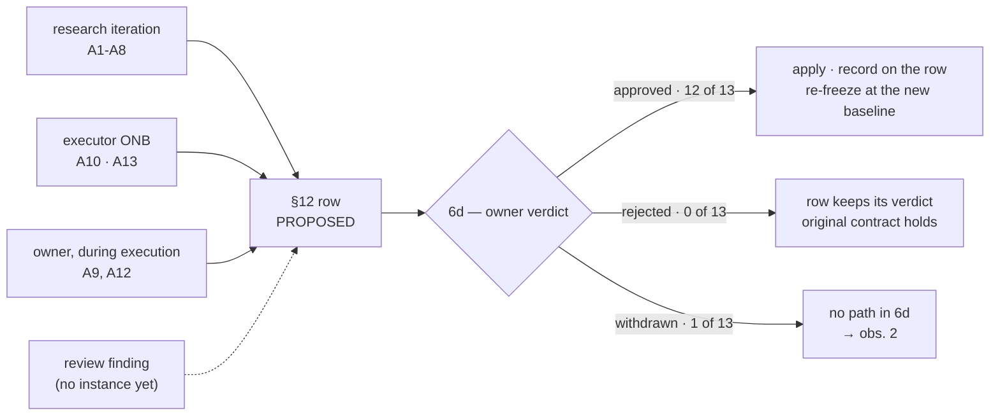

# RF — TFW-53 / Phase B: Enforcement in Workflows

> **Date**: 2026-08-13
> **Author**: Executor (Claude Code)
> **Status**: 🟢 RF — Complete
> **Parent HL**: [HL-TFW-53](../HL-TFW-53__hl_contract_and_goal_defence.md) — 🔒 FROZEN
> **TS**: [TS Phase B](TS__phase-b__enforcement_in_workflows.md)
> **ONB**: [ONB Phase B](ONB__phase-b__enforcement_in_workflows.md) — 2 blocking questions, both answered; AC-2, AC-3 and AC-6 changed as a result
> **Commit**: `fbdf443` · corrective pass in a follow-up commit
> **Corrective pass**: 2026-08-13 — `templates/HL.md` §3.1 rewritten on owner authorisation, outside
> the AC set and outside TS §4 as written. Recorded in §2 Decision 13 rather than applied quietly,
> because this phase's own thesis is that a change to a shipped artifact must be visible **as a change**.

---

## 1. What Was Done

### New Files

| File | Description |
|------|------------|
| `phase-b/evidence/EV__phase-b__enforcement_in_workflows.md` | Environment, 8 evidence rows, verdict, two exhibits (AC-3 history replay, AC-6 word ledger) |
| `phase-b/evidence/routing_replay.md` | AC-2 — all 22 `research/iter2/RES.md` recommendation rows routed through the shipped step |

**Zero new framework files.**

### Modified Files

| File | Changes |
|------|---------|
| `.tfw/workflows/plan.md` | Step 4: `On approval — freeze the contract` (contract field, freeze commit before the first research iteration, pointer to §3 rule 15). Step 6c: items 3-4 replaced — classify by target section + rule 6, transcribe frozen-claim rows to §12 as `PROPOSED`, escalate once per iteration. New **6d Amendment verdicts** block. 13 duplication sites compressed. **1,206 → 1,195 words**, `+35 / −47` lines |
| `.tfw/workflows/research/base.md` | Step 6 item 3: one recommendation table → `Refinements` / `Amendment Proposals`, each row naming its target HL section, plus the classify-never-edit restatement. One `MUST` rule added (HL recommendations every iteration, classified, never applied). **869 → 943 words**, `+5 / −1` |
| `.tfw/templates/RES.md` | Line 133 only: *"proceed to `/tfw-plan` to update HL and write TS"* → *"…to classify these recommendations and write TS"*. **`+1 / −1`** |
| `.tfw/templates/HL.md` | §3.1 only — two blocks merged into one, `Imagine it's done` replaced by `Assemble what you would put in front of the stakeholder`, the `Nothing Imagined Test` added with its falsifiable question. **322 → 251 words**; `templates/HL.md` 1,894 → 1,823. Corrective pass, owner-authorised — see §2 Decision 13 |

> **`templates/RES.md` is a Phase A correction, not Phase B scope.** It was the third live "update HL" in
> `.tfw/`, missed when Phase A removed `templates/RES.md`:32 — the same surviving-channel defect (iter1 G10),
> in the same file, on the researcher-facing side. Authorised in ONB Q2 and added to TS §4 with the limit
> *"one clause on line 133 and nothing else"* before it was touched. **Which Phase A AC should have caught
> it:** Phase A AC-3 / DoD-3, whose gate checked that §32's comment was gone and that the two classes were
> present — it verified the section it rewrote and never re-scanned the file. A grep would have found it.

`README.md` — Task Board row: status and the ONB / RF column links (executor-writable).

## 2. Key Decisions

1. **Classification derives from the target section and rule 6, never from the table a row arrived in** (ONB Rec 2). The replay found the single row in 22 where this changes the outcome: iter2's **R26 item (2)** sits under `Refinements`, targets `§4 Phase C`, and fails the tripwire — at the moment it was filed the PV priority-1 relabel could **not** be accepted under §5 as it then stood. It entered frozen DoD-18 afterwards through owner ruling **Q5** (HL:724) with **no §12 row**. An owner verdict exists, so this is not an unapproved edit; what is missing is rule 9's log entry. The shipped step routes it to §12 as `PROPOSED`. Full derivation: `routing_replay.md` Finding 1.
2. **On the other 21 rows the derivation requirement changes nothing** — it makes the classification *checkable*, not different. The ONB implied a broader effect than the corpus supports; stating the narrower true claim.
3. **6d is a new labelled block, not a renumber** (ONB Rec 1). Verdicts do not arrive inside the research loop: A10 came from a Phase A **ONB**, A12 was owner-initiated during **execution**. A mechanism reachable only from Step 6c would fail to describe two of this task's own twelve rows. Nothing existing was renumbered — `glossary.md`:178 cites "plan.md Step 6c" twice and still resolves.
4. **Line 117 was replaced by a gate, not deleted.** Its lost clause was *"user confirms"*; under the new model the faithful translation is *"every proposal is ruled or escalated before Step 7 — a TS written over an open proposal derives from a contract that may still move."* Not named by any AC; AC-2 required the line to go and something had to hold its position in the algorithm.
5. **AC-6 met at the hard threshold, not at the working range.** 1,206 → **1,195**, under F2's 1,200 for the first time since it crossed. 700-900 needs ~300 more words and no further measured duplication exists — the remaining blocks are each the sole statement of their mechanism, and cutting them is what AC-6 bullet 3 and DoF-2 forbid. Reported per bullet 1 rather than resolved. Ledger of all 13 removals, each paired with the text it restated: EV Exhibit B.
6. **Every removal is a restatement, and two were also stale.** Step 4's *"create ASCII visualization (mandatory). Add mermaid if flow is complex"* had already drifted from the six format options Phase A shipped; Step 3's inline PV source list would go stale the moment Phase C relabels priority 1 and adds priority 0 — the S32 shape, a label that resolves. Replacing both with pointers removed the drift and the words in one act. The full/skim **mechanism** was preserved as *"priorities 1-4 in full, 5-7 skimmed"*; the enforcement-critical defaults (`min_iterations: 2`, `max_iterations: 5`) stayed inline per D24.
7. **`🚫 WITHDRAWN` deliberately not added to 6d, with the arithmetic stated.** A11 is a withdrawal, so the shipped block cannot describe one of twelve rows, and *"only an owner verdict moves one"* is in tension with a disposition that moves a proposal with none. AC-3 enumerates four bullets and withdrawal is not among them; the bullet costs ~14 words against 5 of headroom. Manufacturing 14 more words of "duplication" to pay for it would have been the trim AC-6 forbids. Routed to the coordinator, not silently absorbed.
8. **The first baseline of this very task is not recoverable by the shipped form.** `8136306` carries scope word `task`; rule 14 says the reserved word applies to the first freeze too. The commit predates the rule, and its subject cannot be rewritten — so the property rule 13 exists to guarantee is missing for TFW-53's own original approval. Recorded, not fixable here (EV divergence 1). The recovery form now returns **6** freeze commits.
9. **ONB inconsistency 3 became amendment A13 mid-execution, and the whole approved path ran on it.** The frozen HL still described the baseline as *"recoverable via `git log --grep`"* after Phase A's AC-15 retired that form. The executor has no channel to a frozen section, so it was reported, not fixed — filed as a proposal with evidence, cost and two considered alternatives, ruled `✅ APPROVED — owner, 2026-08-13`, applied to all three occurrences, and re-frozen at a new baseline (`e8ee76e`). The only `git log` left in the HL sits inside A13's own row, quoting the form it retired. **This is the second amendment to enter from an ONB** (A10 was the first, from Phase A) — both outside the research loop, which is the measurement 6d was given its own block for. The mechanism this phase ships was exercised on this phase, by this phase's own finding, while the evidence for it was being written. §12 is now 13 rows: 12 approved, 1 withdrawn, 0 rejected.
10. **Build gate substituted, same as Phase A** (ONB Rec 4). `project_config.yaml` `build.lint/test/verify` are unconfigured placeholders (TD-134); `pytest docs/scripts/` + `mkdocs build` is the pipeline that actually consumes both workflows (Source Manifest).
11. **Step 4's template-facing items now point rather than restate**, which is why the §3.1 wording question raised mid-execution (§6 obs. 6, §8 S2) costs `plan.md` nothing: any change to the template's §3.1 propagates without touching this workflow. A pointer that was written for word count turned out to buy version-independence.
13. **`templates/HL.md` §3.1 rewritten — owner-authorised, outside the AC set, classified before it was touched.** Origin: an external agent's critique, relayed by the owner mid-execution, which independently located the defect TD-140 measured (§8 S2). The mechanism: §3.1 said *"Imagine it's done"* and then spent 14 words un-saying it — *"A description of the plan that will produce it does not satisfy §3.1"*. Replacing the verb makes the negation **disappear** rather than shorten, the same move as Phase A's rule 15 (`--grep` → subject-only, RF Phase A Decision 14).

    **Classification, using this phase's own step.** The edit target is a *deliverable*, not a frozen section — `templates/HL.md` §3.1 is a template file; the frozen sections are HL-TFW-53's §1/§3–§7. What governs it is frozen **DoD-11**, which specifies what §3.1 must contain. Rule 5: the frozen unit is the declarative claim, and DoD-11's claim is that four properties are mandatory, not that they are worded a particular way. All four survive, verified clause by clause — Working Backwards and *"as if the result already exists"*; the six named renderings plus *"Prose alone is not a rendering"*; *"the value is visible… not only the artifact"*; and *"labels every change with its phase and gives each phase one line saying what it is for"*. Rule 6's tripwire clears: the change is accepted under §5 and §6 as they stand. **Refinement, not an amendment — no §12 row, no owner verdict required beyond the authorisation to do it in this phase rather than in Phase D.**

    **This corrects TD-140's own note**, which reads *"AC-11's last bullet mandated append-not-rewrite, so cleaning §3.1 needs an amendment, not just an edit"*. AC-11 is a **Phase A TS criterion**, discharged; it bound that executor, not a later one. Mistaking a spent TS criterion for a live contract term is the mirror image of the drift this task exists to stop — it makes the contract look *more* restrictive than it is, and a contract nobody can read correctly in either direction is not a contract.

    **What was deliberately not done.** No glossary article for `Nothing Imagined Test` — Phase D deliverable 1 owns the `Result Visualization` article and that is where the term belongs; shipping a pointer to a glossary entry that does not exist yet is Phase A Decision 12's exact error (S32). The test is self-contained in the template, so nothing dangles. No `knowledge/philosophy.md` entry for the general rule — that is `/tfw-knowledge`'s channel, and it is filed as §8 S2. The aphorism *"The picture is on the page, not in the reader's head"* was **not** shipped: it cannot be answered no, so it fails P14's own standard, and it says what the named test already says. `plan.md` needed no change — Decision 11's pointer carried it.

    **Residue.** TD-140's second half is untouched: §12's block (353 words) still restates ~7 of `conventions.md`'s 21 rules in prose and then points at them, and `🚫 WITHDRAWN` carries three lines of rationale in a form filled every time. That is Phase D, and it is the same negation-shaped defect one section down.

    **Scope record.** TS §4 does not list `templates/HL.md`; the entry is the coordinator's to add with its limit — *"§3.1 only"* — exactly as ONB Q2's authorisation was recorded for `templates/RES.md`:133 before that file was touched. Stated here because an executor cannot write a TS, and an unrecorded scope extension is a scope extension.

14. **Only my own paths were staged, and the README hunk was checked before staging** (§7 FC1). TFW-56 executed concurrently in the same working tree and held `README.md`, `conventions.md`, `glossary.md`, `TECH_DEBT.md` and ten review-side files modified at the same time. `git add -A` at any point would have swept its work into a commit whose subject reads `[claude-code/TFW-53/phase-b/executor]`. The board-row commit was held until `git diff -U0 README.md` showed a single hunk at line 301 and nothing else.

## 3. Acceptance Criteria

> Per TD-142 V2: `AC │ gate │ result`, not a restatement of the TS.

| AC | Gate (from TS) | Result |
|----|----------------|--------|
| AC-1 | Read Step 4, confirm 3 items; confirm no rule text copied | ✅ Contract field set to the frozen value with owner + date; freeze commit required before the first research iteration; §3 rule 15 referenced, no rule text restated |
| AC-2 | `grep -n "[Uu]pdate HL" .tfw/workflows/plan.md` returns nothing; confirm the five items | ✅ 0 matches (0 across all of `.tfw/**/*.md` except `CHANGELOG.md` history). Replace-not-annotate, `PROPOSED` transcription, one batched escalation per iteration carrying evidence/cost/alternative, no self-application, derivation from target section + rule 6 |
| AC-3 | Read the verdict handling; both paths, neither left to inference | ✅ 6d states both explicitly. **Approved** → apply, record on the §12 row, re-freeze at the new baseline with the reserved scope word. **Rejected** → row keeps its verdict, original contract holds, work resumes. `RESTRICT` → applies on filing, rule 10 referenced, not restated |
| AC-4 | Read Step 6 against `templates/RES.md`; class names and target-section column must match exactly | ✅ `Refinements` / `Amendment Proposals` verbatim; free/frozen section lists match the template's; *"You classify; you never edit the HL"*; D19 narrowed visibly via a new `MUST` rule — HL recommendations every iteration, classified, never applied |
| AC-5 | `grep -niE "windows\|macos\|linux\|bash\|msys\|powershell\|zsh"` over both files | ✅ 0 matches, before and after. Where the command form matters, Step 4 points at rule 15 |
| AC-6 | Word count before and after with the same command; each removal listed with its duplicate source | ⚠️ **Partial, reported.** 1,206 → 1,195 (`wc -w`), **under the 1,200 hard threshold**; **not** in the 700-900 working range. 13 removals each paired with its source in EV Exhibit B. No mechanism shortened |

**AC-6 is the one criterion not fully met.** Its bullet 1 names two figures and the work reaches one of them.
Per bullet 3 the alternative was to cut a mechanism, which DoF-2 makes a failure.

**Definition of Failure — all six clear:** no "update HL" survives in any form (grep, repo-wide) · no
mechanism trimmed for the count · no rule text copied from `conventions.md`, only rule numbers cited · no
file modified outside TS §4's three · no platform, shell or vendor named · escalation specified per
iteration, not per finding.

## 4. Verification

- **Lint** (`build.lint`): unconfigured placeholder → substituted, see below (TD-134).
- **Tests** (`pytest docs/scripts/`): **68 passed** in 32.31s.
- **Verify** (`python -m mkdocs build -f docs/mkdocs.yml`): **built in 30.39s**. No warning names
  `workflows/plan.md`, `workflows/research/base.md` or `templates/RES.md`. The one INFO touching this
  phase's folder is an unrecognised relative link to `../../TFW-54__agent_team_mode/` in the ONB — the same
  pre-existing INFO that TFW-52's artifacts produce, not a warning. 401 warnings repo-wide is the
  pre-existing baseline (TFW-55/56/57 artifacts, TD-138); I claim only that none is attributable here.
- **AC-2 gate**: `grep -n "[Uu]pdate HL" .tfw/workflows/plan.md` → 0. Repo-wide `.tfw/**/*.md` → 0.
- **AC-5 gate**: `grep -niEc "windows|macos|linux|bash|msys|powershell|zsh"` → `plan.md:0`, `base.md:0`.
- **AC-6 gate**: `wc -w` → 1,206 before, 1,195 after.
- **`min_iterations` semantics diffed explicitly** (ONB Risk 3): the Gate check block was left
  **byte-identical**. All three outcomes survive — under the floor `MUST` launch; at or above it,
  SUFFICIENT-or-override proceeds, MORE-NEEDED-and-agreement launches, and the floor itself stays
  overridable with documented justification. D38's only statement of the hard gate is intact.
- **TD-135 does not fire** (ONB Risk 4 ruling): its trigger is *"re-measure `conventions.md` §3 at Phase B
  before appending"*; Phase B appends nothing to `conventions.md`. Not an unmet obligation.

## 5. Evidence

See [EV file](evidence/EV__phase-b__enforcement_in_workflows.md) for evidence details.

Evidence verdict: **4/8 VERIFIED, 1 DEFERRED, 0 BLOCKED, 3 N/A**

The DEFERRED row is AC-3's **rejected** verdict path. Blocker named: zero rejected amendments exist to
replay — thirteen §12 rows are twelve `✅ APPROVED` plus one `🚫 WITHDRAWN`. S33 flagged this at 0/5 and it
is now 0/13; the branch is specified and readable but unexercised by any available history.

## 6. Observations (out-of-scope, not modified)

| # | File | Line(s) | Type | Description |
|---|------|---------|------|-------------|
| 1 | `.tfw/templates/RES.md` | 31-64 | naming | No class for research output that targets the **TS** rather than the HL. Three of iter2's four "coordinator notes" name no HL section (`judge.md` is the enforcement site; `review.md`:28 needs one word; watch the word budget) — all three are instructions to the TS author. The researcher invented a third table for them (F11). Two classes defined by target HL section cannot hold them → Phase D terminology pass |
| 2 | `.tfw/workflows/plan.md` | 116-120 | naming | 6d has no `🚫 WITHDRAWN` path, so it cannot describe §12 row A11, and *"only an owner verdict moves one"* conflicts with a proposer withdrawal. ~14 words; no headroom under AC-6 (Decision 7) |
| 3 | `.tfw/conventions.md` | §3 rules 13-15 | naming | The re-freeze trigger is *"after an approved amendment"*, but `ffe6c6a` re-froze after a **refinement** to §3.1 — correct practice, unauthorised text. The trigger is arguably "the frozen text changed" |
| 4 | `HL-TFW-53…md` | 594, 724 | todo | DoD-18's priority-1 relabel entered a frozen section via owner ruling **Q5** with no §12 row, which rule 9 requires for an owner-initiated change. Verdict exists; the log entry does not. Coordinator's to file |
| 5 | `.claude/commands/tfw-plan.md`, `.agent/workflows/tfw-plan.md` | whole file | duplication | Both still carry the old Step 6c verbatim, including *"Update HL with research findings"*, and both still measure 1,206 words. Phase D's job per TS §9 — but until it runs, two of three adapter surfaces instruct the coordinator to do what the core now forbids |
| 6 | `.tfw/templates/HL.md` | §12 block, 353 words | duplication | **TD-140's remaining half.** §12 restates ~7 of `conventions.md`'s 21 rules in prose and then points at those same rules; `🚫 WITHDRAWN` carries three lines explaining why it is not `❌ REJECTED` — rationale in a form filled every time. Same negation shape as §3.1, one section down. → Phase D. _(§3.1 itself is no longer an observation: closed by the corrective pass, §2 Decision 13)_ |
| 7 | `.tfw/workflows/plan.md` | Step 7 | style | Sub-items restart at `3a`/`3b` under a step whose own items are 1-3. A `6b` collision between Step 6 and Step 7 was removed as a side effect of the 5b/6b merge; the `Na`/`Nb` scheme itself remains confusing |

## 7. Fact Candidates

| # | Category | Candidate | Source | Confidence |
|---|----------|-----------|--------|------------|
| 1 | environment | Task executions run **concurrently in one working tree** — TFW-53/B and TFW-56 at the same time, by owner instruction: *«параллельно будет запущен tfw-56 исполнение, так что надо учитывать при коммитах»*. Consequence for every executor: stage explicit paths only. `git add -A`, `git add .` or `git commit -a` will absorb a sibling task's edits into a commit whose `[agent/task/scope/role]` subject then misattributes them. No workflow states this | User, run directive 2026-08-13 | High |
| 2 | process | The owner routes an **external agent's critique of TFW text back into the executing session** for evaluation against PV before anything is changed — not into a new task, and not applied directly. The evaluation is expected to name what is already ours, what the proposal adds, and what should not be adopted | User, 2026-08-13 (§3.1 wording proposal) | Medium |
| 3 | stakeholder | Having read the evaluation, the owner authorised the fix **inside the running phase** — *«Делай правки, учитывая нашу философию»* — rather than deferring it to Phase D, which owns the file. Preference revealed: close a located defect while the context is hot, and pay for it with disclosure, over keeping phase boundaries clean and re-deriving the analysis later. The same call was made on `templates/RES.md`:133 at ONB Q2, both times with an explicit scope limit attached | User, 2026-08-13 | High |

## 8. Strategic Insights (Execution)

| # | Insight | Category | Source |
|---|---------|----------|--------|
| S1 | **Parallel task execution makes the commit subject the only disambiguator, and no workflow protects it.** One working tree, one git index, two task executions. D55's `[agent/task/scope/role]` subject was designed for searchable trace context; under concurrency it becomes the *only* record of which task a change belongs to — while the staging step that decides what the subject describes is left to executor discretion. The gap is narrow today (two disciplined agents) and structural tomorrow: **this is TFW-54's problem arriving before TFW-54.** A coordinator running a team of delegate sessions in one tree faces the same index with more writers. Implication: TFW-54's grant must bound *what may be staged*, not only what may be decided — a mandate that bounds decisions but not the index still permits one delegate to commit another's work under its own task ID | risk | User, run directive 2026-08-13 |
| S2 | **The owner's diagnosis of bloat — "which term is missing, since a paragraph is standing in for it" — reproduced independently and located the same defect.** REVIEW Phase A FC2 recorded it as a reading habit; an outside agent, given no access to that record, arrived at §3.1 and named the same 322-word block TD-140 measured. Second independent instance upgrades it from habit to method. The mechanism is specific: §3.1 says *"Imagine it's done"* and then spends 14 words un-saying it. **The rule generalises — a negation is a receipt for a wrong word upstream.** Phase A found it once already (rule 15's *"known limit"* bullet disappeared when the mechanism changed from `--grep` to subject-only, RF Phase A Decision 14) and it holds here. **Applied and measured the same day** (Decision 13): replacing *"Imagine it's done"* with *"Assemble…"* took §3.1 from 322 to 251 words while **adding** a falsifiable test — the 14-word negation did not shrink, it ceased to have anything to argue with. Third instance of the pattern in one task. Implication: the corrective instruction is not "compress the section" but **"find the sentence the negation is arguing with"** — falsifiable, and it survives where a word budget cannot, since it names a defect instead of a size. Candidate for `knowledge/philosophy.md` and, on the strength of three instances, for a `conventions.md` §11 Design Rule | philosophy | User, 2026-08-13, relaying an external agent's proposal; converges with REVIEW Phase A FC2 |

## 9. Diagrams

**The two instruction sites, before and after.** Both channels of the same defect closed in one pass:

```
                        BEFORE                                    AFTER
research/base.md   ┌──────────────────────┐              ┌────────────────────────────┐
Step 6 item 3      │ HL Update            │              │ Refinements      → free §   │
                   │ Recommendations      │  ──────────► │ Amendment Props  → frozen § │
                   │ (table)              │              │ each row names its target   │
                   └──────────┬───────────┘              │ you classify, never edit    │
                              │                          └──────────────┬──────────────┘
                              ▼                                         ▼
plan.md            ┌──────────────────────┐              ┌────────────────────────────┐
Step 6c item 3     │ Update HL with       │              │ Classify by target § +      │
                   │ research findings    │  ──────────► │ rule 6 — never by the table │
                   │ (present diff)       │              │ free unit → apply           │
                   └──────────────────────┘              │ frozen claim → §12 PROPOSED │
                                                         └──────────────┬──────────────┘
plan.md            ┌──────────────────────┐                             ▼
Step 6c tail       │ update HL → diff →   │  ──────────► ┌────────────────────────────┐
                   │ user confirms        │              │ escalate once per iteration │
                   └──────────────────────┘              │ ruled or escalated before 7 │
                                                         └────────────────────────────┘
templates/RES.md   ┌──────────────────────┐              ┌────────────────────────────┐
line 133           │ …to update HL and    │  ──────────► │ …to classify these          │
                   │ write TS             │              │ recommendations and write TS│
                   └──────────────────────┘              └────────────────────────────┘
```

**Where a verdict can enter, and why 6d is not inside the research loop.** Measured on this task's own
twelve §12 rows:



Two of the four entry points sit outside Step 6c, which is why the block is reachable from anywhere
rather than nested in the iteration gate — and the ONB point has now fired twice, once per phase. The
rejected branch has never fired: twelve approvals, one withdrawal, no rejection in thirteen rows.

---

*RF — TFW-53 / Phase B: Enforcement in Workflows | 2026-08-13*
