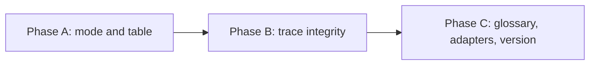

# HL — TFW-54: AT (Agent Team) Execution Mode

> **Date**: 2026-08-18
> **Author**: Coordinator (Claude Code)
> **Status**: 📝 HL_DRAFT — Awaiting review
> **Contract**: 📝 DRAFT — not yet approved
> **Frozen**: §1 · §3 · §4 (incl. §4.1) · §5 · §6 · §7 — locked on owner approval
> **Free**: §2 · §7.2 · §8 · §9 · §10 · §11 — research updates these directly
> **Append-only**: §12 Amendment Log — the only channel for changing a frozen section
> **Baseline**: freeze commits — recovery form in `conventions.md` §3 rule 15

> **Project North Star**: `N/A — no project north star designated`. The mechanism shipped in
> TFW-53/C; this project has not yet designated a locus, so the Purpose Check falls back to §1
> Vision at the contract baseline. Designation is [TFW-55](../TFW-55__canonization_program/HL-TFW-55__canonization_program.md)'s
> subject and is **not** a dependency of this task — see §8.

> **Predecessor**: [TFW-53](../TFW-53__hl_contract_and_goal_defence/HL-TFW-53__hl_contract_and_goal_defence.md)
> (📚 KNW, all five phases closed) built the contract this mode is bounded by.
> [PROPOSAL](PROPOSAL__TFW-54__agent_team_mode.md) holds the design work carried out inside TFW-53 planning.

---

## 1. Vision 🔒 FROZEN

The owner approves a multi-phase HL, declares who runs which role, and leaves. A coordinator carries
the task through research, phases, execution and review with a team of separate agent sessions,
bounded by a contract it cannot move. The owner comes back to a finished result — and the only thing
that could have interrupted them in the meantime is an amendment proposal with its evidence attached,
or a tool that fell over.

This is what TFW-53 was built for. The frozen contract, the amendment log, the committed baseline and
the Purpose Check are a fence and a guard around goals that nobody is currently walking away from;
until delegation exists, that machinery is cost without its return. AT is the return.

**Impact:** The owner stops paying attention per step and starts paying it per decision. Ten blocking
gates per research iteration become one approval, plus whatever amendment proposals the work genuinely
raises. Scope stops inflating by a few percent per iteration because the coordinator has no channel to
inflate it through. And the trace survives the parallelism: a result produced by one session and landed
by another is still filed under the task that produced it.

> "I approved the HL, said who does what, and left. Nothing was waiting for me except one amendment
> proposal. The phases were done, and I could see which session did which piece."

## 2. Current State (As-Is) 🟢 FREE

### What TFW-53 already shipped, and what it left for this task

Measured against the working tree at `5d0f86c`.

| Mechanism | State | Load-bearing for AT |
|---|---|---|
| `Contract` field, six frozen sections | ✅ `conventions.md` §3, `templates/HL.md` header | The moment at which "you are free from here" becomes sayable at all |
| Freeze commit, subject-filter recovery | ✅ §3 rules 13–16 | Makes "within the approved mandate" verifiable by diff instead of by memory |
| §12 Amendment Log, append-only | ✅ `templates/HL.md` | The only channel a delegate has to the contract. Without it, delegation is TFW-49 |
| **Delegated authority, rules 17–19** | ✅ §3, anti-pattern at §14 | Mandate is a ceiling · no agent widens its own grant · delegation never excuses an overrun. **Proposal item 3 is already shipped; this task applies it, it does not re-author it** |
| Purpose Check + north-star locus | ✅ `judge.md` row 2a, `review.md`:28/37/87, PV priority 0 | The external check on the result. Without it a coordinator with a team verifies itself against its own descent |
| `❌ REJECTED` + traces are never deleted | ✅ §5, §13 | A failed AT run stays readable. TFW-48/49 survived only in git history, by accident |
| **AT mode itself** | ❌ absent | `conventions.md` §7 holds exactly two modes and nothing between them |
| **Role assignment per task** | ❌ absent | `grep -rn "Role Assignment" .tfw/` → 0 hits |
| **Cross-session trace integrity** | ❌ absent | No staging rule, no landing-commit rule. Two live defects, below |

### The gap in §7, quoted in full

```
### CL (Chat Loop) — default
- AI proposes steps, human approves/executes.
- AI does NOT execute external actions without approval.

### AG (Autonomous) — explicit request only
- AI works independently within approved TS scope.
- Makes incremental commits.
- Stops when encountering issues not covered by TS.
```

Six lines. AG is bounded by a **TS**, which is downstream of research — so there is no legitimate way
to grant autonomy at the moment the owner wants to grant it, which is HL approval. The interaction cost
in between is roughly ten blocking gates per research iteration (`plan.md` Steps 3, 4, 5, 6a;
`research/base.md` Step 2, Step 4, three stage checkpoints, Step 6; then the 6c gate).

### The trace defects already visible, before the mode exists

Both happened during TFW-53, in a repository where only two sessions ran at once.

| # | What happened | Consequence |
|---|---|---|
| TD-178 | Phase E's board rows were correctly left unstaged by the executor (TS §9 forbade it) and landed by the coordinator **inside** `8d9432b` `[claude-code/TFW-58/proposal/coordinator] propose the revise protocol`, whose body never mentions TFW-53 | `git log -- README.md` shows **no** TFW-53/E commit for the deliverable of the phase whose subject was honest traces |
| TD-144 | Two sessions held one working tree **and one index**. A broad `git add` in the TFW-53/B session swept three of TFW-56's already-staged deletions into `fbdf443` `[claude-code/TFW-53/phase-b/executor] enforce the contract in the workflows` | *"When did TFW-56 delete the review mode files"* returns nothing from TFW-56's own commits. Rated **High** |

`knowledge/risk.md` F1 records the generalisation and names this task: *"A verbal staging directive has
a demonstrated survival rate of 0 out of 1 against a broad `git add` … This is TFW-54's problem arriving
before TFW-54: a coordinator running a team of delegate sessions faces the same index with more writers,
so its grant must bound what may be **staged**, not only what may be **decided**."* Three consecutive
phases of one task then produced three different ad-hoc answers, none written down.

Under D55 the commit subject is the **only** record of which task a change belongs to, and TFW-53's
baseline recovery is a subject filter. So a misattributed subject does not merely look untidy — it
degrades the mechanism TFW-53 shipped, in the same failure class.

### Field data: agents are not interchangeable across roles

Owner assessment, 2026-08-10, from running both tools across many tasks. This is the reason a per-task
table beats a global mode: if agents were interchangeable, one setting would do.

| Role | Codex | Claude |
|------|-------|--------|
| Coordinator (planning) | ✗ weak | ✓ |
| Reviewer | ✗ weak | ✓ |
| Executor | ✓ strong | — |
| Researcher | ✓ strong | ✓ |

Capability asymmetry that constrains the topology (`knowledge/constraint.md` F11): Claude can launch a
Codex run and wait; Codex sessions talk through threads with per-session owner visibility; **Claude
sessions cannot address each other at all** — only subagents, which are not peers.

### Adjacent work — boundaries

| Task | Status | Relationship |
|------|--------|--------------|
| [TFW-45](../TFW-45__multi_agent_workflows/HL-TFW-45__multi_agent_workflows.md) | ❄️ FROZEN | **Stage-level** subagents inside one workflow. AT is **session-level** across workflows. Different granularity; vocabulary must not blur |
| [TFW-58](../TFW-58__revise_protocol/PROPOSAL__TFW-58__revise_protocol.md) | ⬜ TODO | Owns the revise loop: who is in it, termination, handoff re-entry. AT takes one narrow slice — whether a revision round reuses the declared agent |
| [TFW-57](../TFW-57__artifact_growth_control/PROPOSAL__TFW-57__artifact_growth_control.md) | ⬜ TODO | Artifact growth control. AT adds **no** new artifact class, so the two do not collide |

## 3. Target State (To-Be) 🔒 FROZEN

### What changes

1. **`conventions.md` §7 gains AT.** Entry condition, what the coordinator owes the owner, what a
   delegate session owes the coordinator, what still escalates.
2. **The HL gains §4.1 Role Assignment** — a frozen, per-task table: role, phase scope, agent, model,
   reports-to, channel. Frozen because who holds a role is a claim that must not drift mid-task.
   **The table's existence is the mode declaration** — no config key, no dial.
3. **A delegation is always a whole workflow.** AT hands out `/tfw-handoff`, `/tfw-review`,
   `/tfw-research` and nothing else. Each therefore produces its own artifact, and **the artifact is
   the dispatch record** — no journal, no new file.
4. **A declared agent that is unavailable stops the task.** Substitution is a §12 amendment awaiting an
   owner verdict, not a coordinator decision. No fallback agent, by owner ruling.
5. **Cross-session trace integrity.** Two rules: stage by explicit path, never `-A` / `.` / `-a`; and a
   deliverable landed by a session other than its producer goes in **its own commit**, whose subject
   names the **producer's** task and phase. Closes TD-178 and TD-144.
6. **Graceful degradation, stated as behaviour.** Independent addressable sessions where the tool has
   them; subagents or single-session sequencing where it does not. Same promise shape as D54 — same
   `/tfw-*` behaviour, not the same mechanism.

### Explicitly out of scope

| Not built here | Why | Where it goes |
|---|---|---|
| Any runtime, orchestrator, spawner or script | This is what killed TFW-49: 5,910 lines of Python discarded, 149 files and 27,103 lines reverted in six days. AT is conventions and markup, nothing executable | — |
| Stage-level swarm inside a workflow | Different granularity; would blur the vocabulary AT introduces | TFW-45 (❄️ FROZEN) |
| The revise loop — who is in it, where it terminates, how an executor re-enters | AT takes only the agent-freshness slice (H4) | TFW-58 |
| A TS→HL traceability gate | Ruled out of scope by the owner in TFW-53 so the freeze could be measured; that ruling stands | TFW-58 or a follow-up |
| New permissions for any agent | Rules 17–19 already govern this. AT distributes what the owner approved; it never adds | already shipped in TFW-53 |
| Removing gates | Gates inside workflows stay. AT changes **who answers them** — the coordinator, within the contract — not whether they exist | — |
| An autonomy dial in `project_config.yaml` | Autonomy is earned by the contract, not set by configuration (S13). The owner rejected a per-task dial on capability grounds (F11) | — |
| A record of abandoned or replaced delegations | Owner ruling, 2026-08-18 — see §9 R4. A declared blind spot, not an oversight | — |
| Any vendor name inside `.tfw/` | The table is filled per task; the vocabulary is not | — |

### Frozen vs free, this task's own contract

| Section | State | Rationale |
|---|---|---|
| §1 · §3 (incl. §3.1, §3.2) · §4 (incl. §4.1) · §5 · §6 · §7 (incl. §7.1) | 🔒 FROZEN | Standard set per `conventions.md` §3 |
| §2 · §7.2 · §8 · §9 · §10 · §11 | 🟢 FREE | — |
| §12 | 🟢 APPEND-ONLY | — |

### 3.1 Result Visualization

> Rendering of §3–§5 as already approved. Nothing here that is not a DoD item.

**Every file that changes, and which phase touches it.** 6 core files, 9 adapter copies, 2 version
files. **0 new artifact classes** — a project adopting this pays nothing on upgrade day beyond reading
one new §7 subsection.

```
.tfw/
├─ conventions.md          [A] §7 → third mode: AT, entry condition, obligations, escalation
│                          [A] §3 → §4.1 freeze granularity (a row is the frozen unit)
│                          [B] §4 Commit Attribution → explicit-path staging · landing commit
│                          [A][B] §14 → four anti-patterns
├─ templates/
│  └─ HL.md                [A] ★ §4.1 Role Assignment — the routing table
├─ workflows/
│  ├─ plan.md              [A] Step 4 → declare §4.1 before freeze · AT entry check after freeze
│  ├─ handoff.md           [B] delegate obligations · explicit-path staging · what to do with
│  │                           someone else's hunk in a shared file
│  └─ review.md            [B] the same two rules, reviewer side
├─ glossary.md             [C] AT · delegate session · routing table · landing commit · dispatch
├─ VERSION · CHANGELOG.md  [C] 1.3.0
└─ (no new files anywhere)

.claude/commands/tfw-{plan,handoff,review}.md      [C] re-sync, byte-for-byte
.agent/workflows/tfw-{plan,handoff,review}.md      [C] re-sync
.agents/skills/tfw-{plan,handoff,review}/SKILL.md  [C] re-sync

TECH_DEBT.md              [B] TD-144 and TD-178 closed with reasons
```

**§4.1 as it will actually appear in an HL** — this is the artifact, not a description of it:

```markdown
### 4.1 Role Assignment 🔒 FROZEN

> The table's existence declares AT for this task. No table → CL, as today.
> A row is the frozen unit: adding a role is `EXTEND`, swapping an agent or model is
> `SUPERSEDE`. A row may not be removed — dropping a control is never `RESTRICT`.

| Role        | Phases | Agent  | Model      | Reports to  | Channel        |
|-------------|--------|--------|------------|-------------|----------------|
| Coordinator | all    | Claude | Opus 5     | owner       | this session   |
| Researcher  | all    | Codex  | gpt-5.1    | coordinator | thread         |
| Executor    | A, B   | Codex  | gpt-5.1    | coordinator | thread         |
| Executor    | C      | Codex  | gpt-5.1    | coordinator | thread         |
| Reviewer    | all    | Claude | Opus 5     | coordinator | separate session |
```

**What the owner does, before and after — a five-phase task.**

```
TODAY                                          AFTER TFW-54
─────────────────────────────────────────      ─────────────────────────────────────────
approve HL                            🛑       approve HL + §4.1                     🛑
research iter1: briefing              🛑       ── coordinator answers ──
  gather / extract / challenge      🛑🛑🛑      ── coordinator answers ──
  6c gate                             🛑       ── coordinator classifies ──
research iter2: the same nine        🛑×9       ── coordinator answers ──
  one amendment proposal arrives      🛑       one amendment proposal arrives         🛑
TS phase A                            🛑       ── coordinator writes, within contract ──
ONB questions phase A                 🛑       ── coordinator answers ──
RF → REVIEW phase A                   🛑       ── reviewer reports to coordinator ──
  … × 5 phases                    🛑×~25       ── coordinator carries ──
                                               Purpose Check hits a contract defect   🛑
                                               (routed to the owner, judge.md)
final closure                         🛑       final result                           🛑
─────────────────────────────────────────      ─────────────────────────────────────────
~45 blocking stops                             3 stops + 1 per genuine amendment
```

**What pulls the owner back, exhaustively** — this list is a DoD item, not a summary:

| Trigger | Channel |
|---|---|
| An amendment proposal against a frozen section | HL §12, batched once per iteration |
| Purpose Check finds the reference set self-contradictory | `judge.md` → owner, contract defect |
| ❌ REJECT verdict | `review.md` → owner |
| A declared agent or model is unavailable | HL §12 `SUPERSEDE`, task waits |
| A scope budget would be exceeded | Coordinator may not accept it (rule 19) → owner |

**The git log after a phase whose deliverable crossed a session boundary** — TD-178's fix, rendered:

```
today                                                     after Phase B
──────────────────────────────────────────────────────    ─────────────────────────────────────────────────────
$ git log --format="%h %s" -- README.md                   $ git log --format="%h %s" -- README.md
5d0f86c [claude-code/TFW-53/phase-e/executor] correct…    5d0f86c [claude-code/TFW-53/phase-e/executor] correct…
8d9432b [claude-code/TFW-58/proposal/coordinator] pro…    a1b2c3d [claude-code/TFW-53/phase-e/coordinator] land…
                    ▲                                                            ▲
        the deliverable of TFW-53/E, filed                       its own commit, naming the phase
        under TFW-58, body silent about it                       that produced it
```

**What you see six months in, opening any task folder:** the same files as today — no new artifact
class — plus one table in the HL saying who ran what, and a git history in which every deliverable is
findable by the task that produced it.

### 3.2 Value Flow

| Step | Input | Transformation | Value created |
|---|---|---|---|
| Declare | The owner's read on which agent suits which role (field data, §2) | Written into HL §4.1 and frozen with §4 | Every role learns its reporting line from the one artifact it is already obliged to read. No delivery mechanism needed |
| Freeze | Approved HL + §4.1 | Freeze commit, subject-filtered baseline (TFW-53) | The mandate becomes diffable. "Within scope" stops being an assertion |
| Grant | Frozen contract + declared team | AT applies: the coordinator answers gates within the contract | The owner's attention moves from per step to per decision |
| Delegate | A whole workflow, never a fragment | `/tfw-handoff` · `/tfw-review` · `/tfw-research` to a declared session | The workflow's own artifact becomes the dispatch record. Auditability at zero artifact cost |
| Land | Deliverables crossing a session boundary | Explicit-path staging + a landing commit naming the producer | Parallelism stops corrupting the trace, and TFW-53's baseline recovery keeps working |
| Escalate | Pressure on a frozen claim | §12 proposal: evidence, cost, alternative | The owner is interrupted by decisions, never by steps |
| Defend | Finished result | Purpose Check against baseline + north star | Verified, complete and beside the point remains rejectable |

## 4. Phases 🔒 FROZEN

### Phase Dependencies



| Phase | Depends on | Shared files | Can run in parallel with |
|-------|-----------|--------------|-------------------------|
| A | Independent | `conventions.md` (§3, §7, §14) | — |
| B | A | `conventions.md` (§4, §14) | — (same file as A) |
| C | A + B | — | — |

A and B touch different sections of one file and are nevertheless **sequential by decision**: this task
is about two sessions corrupting one index, and running it that way while the rule is still unwritten
would be the anti-pattern demonstrating itself.

### 4.1 Role Assignment 🔒 FROZEN

> This task's own team. The mechanism does not exist yet, so this table is a **prototype** of what
> Phase A will canonicalise — the same relationship TFW-53's header had to its own contract field.
> Phase A may supersede its column set; the assignment itself is frozen.

| Role | Phases | Agent | Model | Reports to | Channel |
|------|--------|-------|-------|------------|---------|
| Coordinator | all | claude-code | Opus 5 | owner | this session |
| Researcher | all | — | — | coordinator | to be declared at the RESEARCH gate |
| Executor | A, B, C | — | — | coordinator | to be declared per phase before its TS |
| Reviewer | A, B, C | claude-code | Opus 5 | coordinator | separate session |

### Phase A: The mode and the table 🔴

> **Requires:** Independent
>
> **⚠️ Shared files with Phase B:** `.tfw/conventions.md` — A owns §3, §7 and its own §14 rows; B owns
> §4 and its own §14 rows. Sequential, not parallel.
>
> **Context for coordinator:** 1. `.tfw/conventions.md` §3 (HL Contract, rules 5–12 and 17–19), §7,
> §14 · 2. `.tfw/templates/HL.md` header block and §4 · 3. `.tfw/workflows/plan.md` Steps 4 and 6 ·
> 4. `knowledge/constraint.md` F2 (word budget), F11 (peer sessions are Codex-only) ·
> 5. `knowledge/philosophy.md` F37, F38 · 6. this HL §3, §7
>
> **Key decisions:** D31 (file existence = state, so table existence = mode declaration) · D45 (why a
> §4.x subsection needs a payload argument) · D54 (adapter parity is behavioural) · D59 (a separate
> agent session ≠ an independent person)
>
> **⚠️ Cascade dependency:** `plan.md` Step 4 is followed by the freeze instruction and Step 5; adding
> the §4.1 declaration must orphan neither. `conventions.md` §3's frozen-section table lists "§4
> Phases" — subsections inherit, so the table itself needs no new row, only a granularity clause.
>
> **Deliverables:**
> 1. `conventions.md` §7 — AT defined: entry condition (`🔒 FROZEN` + committed baseline + §4.1
>    present), the coordinator's obligations to the owner, the delegate's obligations to the
>    coordinator, the exhaustive escalation list from §3.1, and the whole-workflow-only rule.
> 2. `conventions.md` §3 — freeze granularity for §4.1: a row is the frozen unit; `EXTEND` adds a role,
>    `SUPERSEDE` swaps an agent or model, a row may not be removed and dropping a control is never
>    `RESTRICT`.
> 3. `templates/HL.md` — §4.1 Role Assignment with its instruction blockquote.
> 4. `workflows/plan.md` — Step 4 declares §4.1 before the freeze; the AT entry check sits after it.
> 5. `conventions.md` §14 — anti-patterns: a delegation that is not a whole workflow; a role permission
>    that varies by agent.

### Phase B: Trace integrity across sessions 🔴

> **Requires:** Phase A ✅
>
> **⚠️ Shared files with Phase A:** `.tfw/conventions.md` — B touches §4 and appends §14 rows only.
>
> **Context for coordinator:** 1. `.tfw/conventions.md` §4 Commit Attribution · 2. `TECH_DEBT.md`
> TD-144, TD-178 · 3. `knowledge/risk.md` F1 · 4. `knowledge/environment.md` F3, F4 (shell and
> `--grep` quirks — the landing-commit rule must not reintroduce them) · 5. `git show --stat fbdf443`
> and `git show --format=%s 8d9432b` as the two live cases · 6. `.tfw/workflows/handoff.md`,
> `.tfw/workflows/review.md`
>
> **Key decisions:** D55 (the commit subject is the only record of task ownership) · TFW-53 §3 rules
> 14–16 (the baseline is recovered by subject filter, so a lying subject breaks it)
>
> **Deliverables:**
> 1. `conventions.md` §4 Commit Attribution — explicit-path staging: never `git add -A`, `git add .`
>    or `commit -a`; and what to do when a shared file carries another session's hunk (do not commit
>    it, report it).
> 2. `conventions.md` §4 — the landing-commit rule: a deliverable committed by a session other than
>    its producer goes in its own commit, the subject naming the producer's task and phase, `role`
>    naming the acting role. Worked example from TD-178.
> 3. `workflows/handoff.md` — the executor's side: stage by path; if the TS forbids you a file, say so
>    in the RF and name what must be landed.
> 4. `workflows/review.md` — the reviewer's side: the same staging rule.
> 5. `conventions.md` §14 — anti-patterns: broad staging with a sibling session live; landing another
>    session's deliverable inside an unrelated commit.
> 6. `TECH_DEBT.md` — TD-144 and TD-178 closed with reasons.

### Phase C: Glossary, adapters, version 🟡

> **Requires:** Phase A ✅ + Phase B ✅
>
> **Context for coordinator:** 1. `.tfw/glossary.md` (CL/AG entries, Tool Adapter) · 2. RF TFW-53/D
> for the adapter-sync procedure and the drift check · 3. `.tfw/workflows/config.md` drift check ·
> 4. `.tfw/CHANGELOG.md` head
>
> **Key decisions:** D54 (adapter parity is a behavioural promise; skills are thin routers) ·
> `stakeholder.md` F8 (a check that keeps printing known failures stops being read — the drift check
> must run silent afterwards)
>
> **Deliverables:**
> 1. `glossary.md` — AT (Agent Team) · delegate session · Role Assignment table · landing commit ·
>    dispatch. No vendor names.
> 2. Re-sync the nine adapter copies of `tfw-plan`, `tfw-handoff` and `tfw-review`; the `config.md`
>    drift check runs silent afterwards.
> 3. `VERSION` → `1.3.0`; `CHANGELOG.md` entry.

## 5. Definition of Done (DoD) 🔒 FROZEN

- ✅ 1. `conventions.md` §7 defines a third mode, AT, with an entry condition naming all three
  preconditions: contract `🔒 FROZEN`, baseline committed, §4.1 present.
- ✅ 2. §7 states what the coordinator owes the owner and what a delegate owes the coordinator, and
  carries the escalation list from §3.1 in full — five triggers, each with its channel.
- ✅ 3. §7 states that a delegation is a whole workflow and nothing smaller, and says why: the
  workflow's own artifact is the dispatch record.
- ✅ 4. `templates/HL.md` carries §4.1 Role Assignment with columns role, phases, agent, model,
  reports-to and channel; a project with no table runs CL exactly as today.
- ✅ 5. `conventions.md` §3 states the freeze granularity of §4.1: a row is the frozen unit, `EXTEND`
  adds a role, `SUPERSEDE` swaps an agent or model, a row may not be removed, and dropping a control is
  never `RESTRICT`.
- ✅ 6. §7 or §3 states that an unavailable declared agent stops the task pending a §12 verdict, and
  that no fallback agent may be substituted silently.
- ✅ 7. `plan.md` instructs the coordinator to declare §4.1 before the freeze commit, and to check the
  AT entry condition after it.
- ✅ 8. `conventions.md` §4 forbids broad staging by name (`-A`, `.`, `-a`), requires staging by
  explicit path, and says what to do with another session's hunk in a shared file.
- ✅ 9. `conventions.md` §4 carries the landing-commit rule with the TD-178 worked example, and
  `handoff.md` and `review.md` each carry the staging rule on their own side.
- ✅ 10. Role permissions are unchanged: no rule anywhere makes what a role may do depend on which
  agent holds it. Verifiable by grep — no vendor name appears in `.tfw/` outside `adapters/`.
- ✅ 11. Graceful degradation is stated as behaviour, not mechanism: what AT means where peer sessions
  exist, and what it means where they do not.
- ✅ 12. The glossary carries AT, delegate session, Role Assignment table and landing commit; the nine
  adapter copies are re-synced and the `config.md` drift check runs silent; VERSION is `1.3.0`.
- ✅ 13. TD-144 and TD-178 are closed in `TECH_DEBT.md` with reasons.
- ✅ 14. Nothing executable is added: no script, no hook, no config key, no new artifact class.

## 6. Definition of Failure (DoF) 🔒 FROZEN

- ❌ 1. **AT delivers only a lower gate frequency, not a change in who is accountable.** The owner can
  already get frequency reduction by hand — *«второй я могу и в полуручном режиме провести»* — so a
  mode that only thins the gates is not worth its documentation.
- ❌ 2. Anything executable ships: a spawner, a hook, a script, a runtime. TFW-49's cause of death.
- ❌ 3. A vendor name (`codex`, `claude`, a model id) appears in `.tfw/` outside `adapters/`.
- ❌ 4. A rule makes a role's permissions depend on which agent holds it — the self-extending grant
  that killed TFW-49, re-entering through the table.
- ❌ 5. AT is reachable without a frozen, committed contract, or via a `project_config.yaml` key.
- ❌ 6. A new artifact class, file or folder is required per task. The owner ruled the dispatch record
  out; re-introducing it under another name is the same failure.
- ❌ 7. The staging or landing rule is written as exhortation rather than as a rule with a named
  prohibition — `risk.md` F1 measured a verbal staging directive at 0 successes out of 1.
- ❌ 8. AT and TFW-45's swarm end up describable by the same words, so a reader cannot tell
  session-level from stage-level.
- ❌ 9. Any of §7, §4 or the templates crosses ~1200 words per document (`constraint.md` F2), trading
  enforcement for volume.

**On failure:** DoF 1 → stop and re-plan; the mode is not worth shipping. DoF 2, 4, 5, 6 → revert the
offending deliverable, file a §12 amendment, do not repair in place. DoF 3, 7, 8, 9 → correct within
the phase; these are drafting failures, not design failures.

## 7. Principles 🔒 FROZEN

1. **A mandate is a ceiling, never a source of permission.** AT distributes what the owner approved and
   adds nothing. `philosophy.md` F37; `conventions.md` §3 rules 17–19.
2. **Delegation is whole workflows only, so the artifact is the record.** ONB, RF, RES and REVIEW
   already testify to what each session received and produced. A fragment delegation has no artifact,
   which is why it is forbidden rather than journalled. Structural Enforcement; D31.
3. **Role locks are per role, never per agent.** A table that lets a strong agent do more is the
   self-extending grant wearing new clothes.
4. **Nothing executable.** The mode is conventions and markup. Every promise is behavioural, in the
   shape of D54.
5. **No vendor inside the framework.** A project expresses its own team in its own HL; `.tfw/` stays
   free of tool names so the vocabulary survives a tool change.
6. **Parallelism must not corrupt the trace.** The commit subject is the only record of which task a
   change belongs to (D55) and TFW-53's baseline recovery reads it, so an honest subject is
   load-bearing, not cosmetic.
7. **A tool falling over returns the owner; it never substitutes an agent silently.** Owner ruling,
   2026-08-18. Visibility and per-session control are part of what is being asked for (S12).
8. **Autonomy is earned by the contract, not set by configuration.** There is no dial. The table's
   existence and the contract's state are the switch.
9. **A separate agent session is not an independent person.** D59. AT promises parallelism and
   addressability. It does not promise independent judgement, and no rule may lean on it as if it did.

### 7.1 Quality Contract 🔒 FROZEN

Copied into every Phase TS.

- Word budget: each edited document stays inside the 700–900 word working range where it already is,
  and never crosses ~1200 (`constraint.md` F2). Growth in one place is paid for by cuts in the same
  document.
- No new file, folder, config key or artifact class in any phase. If a phase believes it needs one, it
  files a §12 amendment instead.
- Every rule lands at an enforcement site — a workflow step, a template field, a §14 anti-pattern.
  `process.md` F30: capture without an enforcement site does not change behaviour.
- Rules are written as prohibitions with named forms, not as advice. `risk.md` F1.
- No vendor name outside `adapters/`. Verify by grep before writing the RF.
- A corrective pass may not grow the artifact it corrects.

### 7.2 Knowledge Citations 🟢 FREE

| # | Source | Item | How it applies |
|---|--------|------|----------------|
| 1 | PV 0 — Project North Star | none designated | Fallback per `conventions.md` §3 rule 5: §1 Vision at the contract baseline. Designation is TFW-55's subject |
| 2 | PV 1 — [`.tfw/README.md` § Values and Principles](../../.tfw/README.md) | Structural Enforcement | Table existence = mode declaration; artifact existence = dispatch record. No state field to maintain |
| 3 | PV 1 — same | Portability | Vendor names stay out of `.tfw/`; the table is per-task data |
| 4 | PV 1 — same | Single Source of Truth | AT is defined once in §7; adapters reference, never restate |
| 5 | PV 2 — [`knowledge/philosophy.md`](../../knowledge/philosophy.md) F37 | A mandate that can justify its own extension is the root cause | §7 P1; DoF 4 |
| 6 | PV 2 — same F38 | Coordinator attention is a finite resource, budgeted deliberately | Why this task is separate from TFW-53 at all, and why its scope stays at three phases |
| 7 | PV 3 — [`KNOWLEDGE.md`](../../KNOWLEDGE.md) D59 | A separate agent session ≠ an independent person | §7 P9. Bars any rule that treats delegate sessions as independent reviewers |
| 8 | PV 3 — same D54 | Adapter parity is a behavioural promise, not a file-layout one | §3 item 6; Phase C |
| 9 | PV 3 — same D55 | The commit subject is the searchable record of declared context | §7 P6; Phase B, both rules |
| 10 | PV 3 — same D53 | Optional = never happens; a physical folder is the D31 pattern | Why the dispatch record is *removed* rather than made optional — an optional journal would be an unfilled file in every task |
| 11 | PV 3 — same D45 | §4.x placement needs a payload argument, not convenience | §4.1 sits in §4 because assignment is per-phase execution structure; recorded because D45 rejected §4.x for a different payload |
| 12 | PV 4 — [`conventions.md`](../../.tfw/conventions.md) §3 rules 17–19 | Delegated authority | Already shipped; this task applies rather than re-authors |
| 13 | PV 4 — same §3 rules 5–12 | Freeze granularity, `RESTRICT` on filing, the evidence burden | DoD 5; why removing a table row is not `RESTRICT` |
| 14 | PV 4 — same §14 | Anti-patterns are the enforcement site | Phases A and B each append rows |
| 15 | PV 5 — [`knowledge/convention.md`](../../knowledge/convention.md) | Naming consistency as a design principle | Glossary terms in Phase C |
| 16 | PV 6 — [`knowledge/process.md`](../../knowledge/process.md) F6 | A coordinator without oversight drifts into scope explosion | The failure AT could reproduce; answered by the frozen contract plus the Purpose Check |
| 17 | PV 6 — same F30 | Capture without an enforcement site does not change behaviour | §7.1; every deliverable names its site |
| 18 | PV 6 — same F7 | Agents in different sessions lose strategic context | Why the routing table lives in the HL — the one artifact every role loads |
| 19 | PV 7 — [`knowledge/constraint.md`](../../knowledge/constraint.md) F11 | Fully independent sessions are Codex-only | §3 item 6; DoF 5 (no dial) |
| 20 | PV 7 — same F12 | What a role is obliged to do belongs in files, never in a tool's memory | The table is a repository artifact, not agent memory |
| 21 | PV 7 — same F2 | Instructions degrade past ~1200 words | §7.1; DoF 9 |
| 22 | PV 7 — [`knowledge/risk.md`](../../knowledge/risk.md) F1 | Two sessions, one index; a verbal staging directive survived 0 of 1 | Phase B in full, and the reason TD-144 is in scope |
| 23 | PV 7 — [`knowledge/stakeholder.md`](../../knowledge/stakeholder.md) F6 | The owner objects to frequency, never to being bound | §1; DoF 1 |
| 24 | PV 7 — same F7 | The result must be rendered before tokens are spent; the visualization gate is a precondition of TFW-54 | §3.1 is a gate here in the strongest sense — this is the task it was built for |
| 25 | PV 7 — same F8 | A check that keeps printing known failures stops being read | Phase C: the drift check must run silent |
| 26 | PV 7 — [`knowledge/environment.md`](../../knowledge/environment.md) F3, F4 | The shell rewrites a leading `/`; `--grep` cannot be subject-only | Phase B must reintroduce neither quirk in the landing-commit rule |

## 8. Dependencies 🟢 FREE

| Dependency | Status |
|------------|--------|
| TFW-53 — frozen contract, baseline, amendment log, Purpose Check, delegated-authority rules | ✅ all five phases closed (📚 KNW) |
| TFW-53 Phase C specifically — the goal-defending reviewer named as this task's precondition in the PROPOSAL | ✅ |
| TFW-55 — north-star designation | ⬜ not a blocker. The `judge.md` fallback covers its absence; a review is never blocked on a missing north star |
| TFW-58 — revise protocol | ⬜ not a blocker. Agent freshness on a revision round is H4 here; the loop itself is TFW-58's |
| TFW-45 — stage-level swarm | ❄️ FROZEN. Boundary only, no code dependency |

## 9. Risks 🟢 FREE

| Risk | Probability | Impact | Mitigation |
|------|-------------|--------|------------|
| R1. AT is used before the ecosystem is ready and reproduces TFW-48/49 at a smaller scale | Medium | High | The entry condition is three-part and structural; the Purpose Check is the external stop; DoF 1 makes an unconvincing mode a failure rather than a shipped compromise |
| R2. The frozen table plus a real tool outage strands a task for hours while the owner is away | Medium | Medium | Owner ruling, accepted deliberately: waiting for a human beats a silent substitution. Revisit trigger: the first outage that costs more than a day |
| R3. §7 grows past its budget while absorbing AT and stops being read | Medium | Medium | §7.1 word budget; Phase A pays for growth with cuts in the same document |
| R4. **A brought-down or replaced delegate session leaves no trace, so a failed AT run cannot be diagnosed.** The owner ruled against any deviation record, 2026-08-18: *«пусть координатор за этим следит»* — reliable for one session, nil afterwards | High | Medium | **Accepted blind spot, declared.** Revisit trigger: the first AT post-mortem that cannot account for where the tokens went. The trigger files a §12 amendment; it does not reopen the ruling by itself |
| R5. The vocabulary collides with TFW-45 and one absorbs the other | Low | Medium | DoF 8; H2 tests it before the TS |
| R6. Phase B's landing-commit rule reintroduces the shell or `--grep` quirks TFW-53 already paid for | Low | Medium | `environment.md` F3 and F4 are named in Phase B's context block; the rule is subject-based by construction |
| R7. The staging rule is written and still ignored, exactly as the verbal one was | Medium | High | Named prohibitions rather than advice, on both role surfaces plus §14; DoF 7 |

## 10. RESEARCH Case 🟢 FREE

### Blind Spots

- Whether the contract TFW-53 shipped is actually **sufficient** to bound a real AT run, or whether the
  first honest run finds a channel neither the freeze nor the Purpose Check covers. Never tested — the
  only AT run in the record predates the contract entirely.
- What a delegate session must be told at handoff for the existing artifacts to be a sufficient dispatch
  record. If the answer is "more than a workflow name", the whole-workflow rule needs a companion.
- Whether AT and TFW-45's swarm can be stated in one glossary without collapsing into each other.
- Whether a revision round should reuse the declared agent or a fresh one, and whether that is even the
  routing table's business.
- What "graceful degradation" concretely means where peer sessions do not exist. Subagents are not peers
  (F11), so the fallback may be weaker than the word suggests.

### Hypotheses

| # | Hypothesis | Status |
|---|----------|--------|
| H1 | The contract TFW-53 shipped is sufficient to bound an AT run — no additional constraint artifact is needed at delegation time | open |
| H2 | Session-level AT and stage-level TFW-45 swarm are genuinely orthogonal: both can be defined without vocabulary collision or one absorbing the other | open |
| H3 | Whole-workflow delegation makes the existing artifacts a sufficient dispatch record — ONB, RF, RES and REVIEW together answer what each session received and produced | open |
| H4 | On a revision round a fresh agent beats the one that produced the artifact. The evidence pulls both ways: AFD-38's reviewer approved and then retracted only under owner pressure, but a fresh reviewer re-litigates settled points. Testable against AFD's 13 revision arcs | open |
| H5 | AT can be specified tool-agnostically and degrade to subagents or single-session sequencing without losing enforcement value | open |
| H6 | A frozen routing table costs less than it saves — the stalls it causes on outage are rarer than the drift it prevents | open |

> **Filter applied.** The PROPOSAL's H5 (the table in the HL is self-carrying), H6 (frozen) and H7 (per
> role, never per agent) are removed: the owner ruled on the first two on 2026-08-18, and the third is a
> design principle, now §7 P3. Each hypothesis that remains would change the approach if refuted.

### Risks of Not Researching

H1 is the load-bearing one. If the contract is not in fact sufficient, this task ships a mode whose only
safety argument is untested, and the failure mode is a six-day, 27,000-line revert — measured, not
hypothetical. H2 unresolved means a glossary that has to be rewritten once TFW-45 thaws. H3 unresolved
means the owner's no-journal ruling rests on the coordinator's reading of the artifacts rather than on a
check.

### Proposed RESEARCH Focus

1. **Gather** — replay TFW-48/49 against the contract as it now stands: for each of the eight documented
   drift events, name the rule that would now stop it and the artifact where the stop is visible. Which
   events survive?
2. **Extract** — from AFD's 149 REVIEW files and 13 revision arcs: does a fresh reviewer on rev2 improve
   the outcome or re-litigate? And what did each delegated session actually receive, measured from ONB
   files rather than assumed?
3. **Challenge** — attack the whole-workflow rule: construct the delegations a real coordinator will want
   to make that are *not* whole workflows, and decide whether each is refused or reclassified.

### Why Not Just...?

- **Why not put AT in `project_config.yaml` as a mode setting?** The owner rejected a per-task autonomy
  dial in TFW-53 planning on capability grounds (F11): peer sessions are Codex-only, so a dial promises
  a portability the framework cannot honour. And autonomy earned by configuration is not earned (S13).
- **Why not keep a dispatch journal after all?** Every role already leaves an artifact, git carries
  `[agent/task/scope/role]`, and the owner ruled it duplicative. The residual gap — abandoned sessions —
  is recorded as R4 rather than answered with a file.
- **Why not merge with TFW-45?** Different granularity: sessions across workflows versus subagents inside
  one. Merging is how the vocabulary blurs, and TFW-45 is frozen.
- **Why not fold the staging rules into a separate hygiene task?** `risk.md` F1 names them as this task's
  problem, and both live defects were produced by exactly two concurrent sessions. AT multiplies the
  writers; shipping the mode without the rule ships the defect at scale.
- **Why not free-but-logged for the routing table?** Owner ruling, 2026-08-18: freeze it. A logged change
  is still a change the owner learns about afterwards, and who holds the reviewer role is not a fact the
  owner wants to read about later.

## 11. Strategic Insights (Planning) 🟢 FREE

| # | Insight | Category | Source |
|---|---------|----------|--------|
| S1 | **The owner's autonomy ask is the strong form, not the convenient one:** approve a multi-phase HL, leave, return to a finished result. The weak form — the coordinator answers gates while the owner stays in the loop more often — is explicitly *not* worth building: *«второй я могу и в полуручном режиме провести»*. **Implication:** this becomes DoF 1. A mode that only reduces gate frequency must fail its own acceptance | stakeholder | User, 2026-08-18 |
| S2 | **The owner's cost model is tokens and time, not correctness.** *«без дрейфа и уплывания в сторону медленно но верно и что сожрано куча токенов. а главное моё время потеряно»*. Drift is priced as waste, not as error. **Implication:** the value statement of AT is measured in owner interactions and burned runs, and DoF 1 is the only place that measurement can bind | stakeholder | User, 2026-08-18 |
| S3 | **The owner expects HL + research to remove surprise entirely:** *«по идее первый hl + research должны снимать все неожиданности. иначе со всей задачей в целом что-то не так»*. Amendments arriving mid-execution are read as a signal that planning failed, not as normal operation. **Implication:** amendment count per task is a planning-quality metric here, not merely a log | philosophy | User, 2026-08-18 |
| S4 | **The frozen routing table is preferred over a fallback agent, and the owner priced the stall himself:** *«пока без запасного, лучше человека пусть ждут»*. A silent substitution is worse than a stalled task. **Implication:** §7 P7. The mode has exactly one declared exception to walk-away, and it is infrastructure, not judgement | stakeholder | User, 2026-08-18 |
| S5 | **The owner refused the dispatch record on duplication grounds, and named the reason precisely:** each role already writes its own artifact and git already carries attribution. **Implication:** the right answer was not to argue but to make the claim structurally true — hence whole-workflow-only delegation, which converts the owner's observation into an enforceable rule | process | User, 2026-08-18 |
| S6 | **The owner declined even a deviation-only record, with the risk stated aloud:** *«я могу пожалеть об этом, но нет, не фиксируем куда-то явно. пусть координатор за этим следит»*. Two reasons given: artifact proliferation, and no legal home once the HL is frozen. **Implication:** R4 is a declared blind spot with a revisit trigger, not a gap for a later phase to close quietly | stakeholder | User, 2026-08-18 |
| S7 | **Artifact count is a real budget in the owner's head:** *«артефактов и так куча уже»*. The same pressure TFW-57 was opened for, arriving unprompted in a different conversation. **Implication:** DoF 6. Zero new artifact classes is a hard condition of this task, not a preference | constraint | User, 2026-08-18 |
| S8 | **The owner reads TFW-53 as an investment awaiting return, not as a delivered outcome:** *«я пока хочу понять как мы извлечем ценность из задачи 53, ведь все делалось ради 54»*. **Implication:** §1 must state the dependency in that direction — AT is what makes the contract pay — and §3.2 has to show the fence and the return in one picture | philosophy | User, 2026-08-18 |
| S9 | **The owner asked for the negative definition before the positive one:** *«я хочу увидеть что есть задача 54, а чем она не является»*. The out-of-scope table was requested, not volunteered. **Implication:** §3's out-of-scope table is load-bearing content, and the boundaries against TFW-45, TFW-58 and any runtime belong inside the frozen part of the contract | process | User, 2026-08-18 |
| S10 | **Agents are not interchangeable across roles, and the owner has measured which is which** — Codex weak at planning and review, strong at execution and research; Claude strong at planning and review. Role assignment is a quality decision, not a convenience one, and it is the whole reason a per-task table beats a global mode | environment | User, 2026-08-10 (carried from PROPOSAL S6) |
| S11 | **The reporting topology differs by tool and the framework must not assume one:** Claude can launch Codex and wait; Codex sessions talk through threads with per-session owner visibility; Claude sessions cannot address each other. **Implication:** the table names who reports to whom, never how — hence the `Channel` column carries tool-specific text as data | constraint | User, 2026-08-10 (carried from PROPOSAL S7) |
| S12 | **Per-session visibility and control is part of the value, not a side effect:** *«я тоже могу их видеть, писать, управлять, останавливать отдельно друг от друга»*. Delegation without individual addressability is not what is being asked for | stakeholder | User, 2026-08-08 (carried from PROPOSAL S3) |
| S13 | **Autonomy is earned by the contract, not granted by configuration:** *«автономность и доверие должны быть, но только тогда, когда HL утвержден как vision»* | philosophy | User, 2026-08-08 (carried from PROPOSAL S4) |

## 12. Amendment Log 🟢 APPEND-ONLY

No amendments.

---

*HL — TFW-54: AT (Agent Team) Execution Mode | 2026-08-18*
