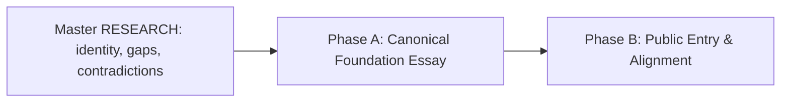

# HL — TFW-55: TFW Foundations — Philosophy, Self-Canon & Canonical Essay

> **Date**: 2026-08-13
> **Author**: Coordinator + Owner
> **Status**: 📝 HL approved — hypothesis iteration pending
> **Contract**: 🔒 FROZEN — approved by the owner 2026-08-13
> **Frozen**: §1 · §3 · §4 · §5 · §6 · §7 — locked on owner approval
> **Free**: §2 · §7.2 · §8 · §9 · §10 · §11 — research updates these directly
> **Append-only**: §12 Amendment Log — the only channel for changing a frozen section
> **Baseline**: `git log --grep="TFW-55/freeze"`
> **North-star role**: establish the foundation from which the short methodical guide, courses, book, and later knowledge products will be derived
> **Language direction**: the repository's canonical essay remains English; Russian lecture material is a first-class source, and the first future methodical and commercial materials will be Russian for Kazakhstan

---

## 1. Vision 🔒 FROZEN

TFW can explain, in plain language, what it fundamentally is: a discipline for organizing conscious, traceable work when people delegate a growing share of cognitive work to AI agents. It distinguishes its philosophy from the reusable method, and the method from this repository's concrete prompt-and-files framework. The repository applies TFW to its own evolution, preserves why it changed, and therefore becomes the primary corpus and reference implementation of the thing it describes without pretending that every historical file or current mechanism is timeless truth.

The public entry is deliberately small. The root `README.md` answers why a visitor should care and where to start. `.tfw/README.md` is the concise canonical essay: the cognitive shift, project self-awareness, human responsibility, traces, principles, boundaries, and the path from philosophy to method. `conventions.md`, `glossary.md`, workflows, templates, and Editions explain how the current framework operates. Task traces and verified knowledge preserve how and why it became that way.

**Impact:** knowledge that currently exists only in the founder's explanations and lectures becomes part of the project's durable self-knowledge; misleading or obsolete claims are removed; future guides, courses, and books gain one coherent foundation without creating a parallel Canon bureaucracy or a premature Body of Knowledge.

> “This project does not merely implement TFW. It uses TFW to understand, change, and explain itself — and gives a person a short, honest path into the philosophy behind the machinery.”

## 2. Current State (As-Is) 🟢 FREE

### The intended document architecture already exists

Earlier project decisions established a useful separation:

| Existing surface | Intended role | Current problem |
|---|---|---|
| Root `README.md` | Public landing page and Task Board | The public section has grown to 1,481 words and repeats philosophy, positioning, mechanics, links, comparisons, and reference material |
| `.tfw/README.md` | Five-minute philosophy paper | It contains the seed of the canon, but also implementation-led framing, code-centric language, outdated absolutes, and none of several ideas that emerged in live teaching |
| `.tfw/conventions.md`, `.tfw/glossary.md`, workflows, templates | Living operational specification | These correctly own detailed mechanics, but public prose sometimes treats current artifact names and lifecycle as the essence of TFW |
| `tasks/`, `KNOWLEDGE.md`, `knowledge/`, Git history | Evolution, evidence, rejected alternatives, verified project memory | They are a rich primary corpus, but an archive cannot by itself tell a new reader which ideas are stable, current, superseded, or merely hypothesized |
| Editions | Proportional implementations and teaching entry points | Light → Assisted → Full has become a practical explanatory bridge, but the philosophy paper still leads with Full mechanics |

Current measured public prose before the Task Board:

| Surface | Words | Lines |
|---|---:|---:|
| Root README public section | 1,481 | 247 |
| `.tfw/README.md` | 1,575 | 166 |
| Combined | 3,056 | 413 |

The problem is not simply length. The two documents answer overlapping questions, and some claims are broader than the evidence or current architecture supports.

### The repository is already a self-canon candidate

The project has used TFW to create and revise TFW across more than fifty traced tasks. It contains:

- the reasons behind role separation, research, evidence, review, knowledge consolidation, and Editions;
- failed and reverted directions, including the TFW-48/49 over-engineering path;
- a public philosophy paper, a living specification, verified knowledge, and an executable reference implementation;
- evidence that the framework can preserve its own evolution and allow new agents to resume its development.

This supports a stronger and simpler architecture than the earlier TFW-55 draft: **the repository remains the primary corpus; the canonical essay is a maintained human-readable projection of that corpus, not a second source of truth.**

The repository is not sufficient by itself for a newcomer because primary sources, current rules, historical rules, failures, and implementation detail coexist. Canonical exposition still requires selection, ordering, qualification, and language.

### Important knowledge is still outside the repository

The owner reports that several ideas became clear only while teaching and remain mainly in live explanations and lecture material:

- AI is not merely a faster tool; it performs delegated cognitive work and changes the human's role;
- the central problem is not prompting technique but how people preserve purpose, judgment, continuity, and responsibility while delegating cognition;
- a “self-aware project” is not sentient: it can state what it is, why it exists, what it knows, what changed, what remains uncertain, and how work should continue;
- a trace is selected, durable project memory, not a raw transcript or hidden chain-of-thought;
- Full TFW is difficult to understand when presented as a complete system before the learner has experienced the problems its mechanisms solve;
- Light → Assisted → Full worked as a guided progression because each step solved one visible problem and revealed the need for the next.

These are owner-sourced claims and teaching observations. TFW-55 must extract and examine them, connect them to project evidence where possible, and preserve their provenance rather than silently upgrading them into universal facts.

### Known philosophical and messaging debt

The present READMEs contain statements that require removal, qualification, or reframing:

- `Traces Over Code` and claims that code can simply be regenerated narrow a domain-agnostic method to software and overstate reproducibility;
- “the same lifecycle, the same artifacts” conflicts with Light, Assisted, and Full intentionally using different levels of structure;
- “documentation writes/maintains itself” hides the real consolidation, review, and maintenance work;
- “produce the same output again and again” is not a defensible promise for stochastic systems;
- `RF = source of truth` is incomplete after the Evidence, Review, and verified-knowledge layers;
- “AI agents are team members” needs boundaries around identity, authority, accountability, and actual independence;
- current descriptions often begin with framework machinery before explaining the cognitive problem and philosophical shift.

### Educational evidence position

The INNO-6–13 and university corpora support a founder-led progression that improves shared language and the structure of work artifacts. They do not yet prove durable individual behavior change, transfer to unfamiliar tasks, instructor independence, or scaled course effectiveness.

The most useful current teaching hypothesis is:

`useful work → experienced limit → next mechanism → named principle → independent continuation`

with Editions as the practical ladder:

`ad-hoc chat → Light → Assisted → Full agent engineering`

### Scope boundary

TFW-55 will define the foundation and apply it to the two existing README surfaces. It will not:

- create a separate Canon database, claims registry, Body of Knowledge, governance institution, or certification system;
- write the 20–30 page methodical guide, a book manuscript, course, deck, facilitator guide, or university syllabus;
- research publishing economics, trademark, copyright registration, procurement, or Kazakhstan university regulation;
- redesign the visual brand, Editions, workflows, templates, or framework mechanics;
- prove educational effectiveness or market demand;
- clean every historical task or documentation page.

## 3. Target State (To-Be) 🔒 FROZEN

### 3.1 Result Visualization

After TFW-55, a reader encounters one project at four useful distances:

```text
┌─────────────────────────────────────────────────────────────────────┐
│ README.md — THE DOORWAY                                             │
│ “Why should I care? What is TFW in one sentence? How do I start?”   │
│ concise landing · Editions · Quick Start · links · Task Board       │
└───────────────────────────────┬─────────────────────────────────────┘
                                │ wants the meaning
                                ▼
┌─────────────────────────────────────────────────────────────────────┐
│ .tfw/README.md — THE CANONICAL ESSAY                                │
│ cognitive shift · self-aware work · human/agent boundary · trace    │
│ philosophy · principles · what TFW is/is not · method → framework  │
└───────────────┬───────────────────────────────┬─────────────────────┘
                │ wants to use it               │ wants to audit it
                ▼                               ▼
┌───────────────────────────────┐  ┌──────────────────────────────────┐
│ LIVING SPECIFICATION          │  │ PRIMARY CORPUS                   │
│ conventions · glossary        │  │ tasks · RF/REVIEW/EV · knowledge│
│ workflows · templates         │  │ Git history · rejected paths    │
│ Editions · adapters           │  │ “Why and how did TFW change?”   │
│ “How does it work today?”     │  └──────────────────────────────────┘
└───────────────────────────────┘

                    FROM THIS FOUNDATION, LATER TASKS DERIVE:
        Russian methodical guide → courses/pilots → book → wider corpus
```

The finished result does not ask the owner to maintain a new canon system. The existing repository explains itself more clearly, carries previously tacit founder knowledge, and exposes a stable foundation without freezing the living framework.

### 3.2 Value Flow

```text
PROJECT HISTORY + CURRENT SPEC + LECTURES + FOUNDER EXPLANATION
                              │
                              ▼
       distinguish enduring idea / implementation / evidence / claim
                              │
                              ▼
       define identity · philosophy · boundaries · human/AI relation
                              │
                ┌─────────────┴─────────────┐
                ▼                           ▼
     finish canonical essay        subtract duplicate landing prose
       .tfw/README.md                       README.md
                └─────────────┬─────────────┘
                              ▼
        one self-describing repository with two clear reading depths
                              │
                              ▼
        future guide and teaching products derive without redefining TFW
```

### Identity architecture to resolve and embody

The result must express the following distinctions in ordinary language. Research may refine the labels, but it may not collapse the layers back into one overloaded word.

| Layer | Question it answers | Intended content |
|---|---|---|
| Philosophical foundation | What changes when AI performs part of our cognitive work? | Purpose, consciousness of work, responsibility, memory, inspectability, continuity, human judgment |
| Trace-first discipline / method | How should work be organized under that condition? | Stable principles and the smallest repeatable behaviors |
| Methodology | How are those behaviors arranged for repeatable individual and team practice? | Planning, bounded delegation, evidence, review, learning, proportional discipline |
| Reference framework | How does this repository implement the methodology now? | `.tfw/`, prompts, artifacts, workflows, templates, adapters, task lifecycle |
| Editions | How much machinery does a particular task need? | Light, Assisted, Full as proportional implementations and a progressive learning path |
| Derived products | How is the foundation explained or taught to a particular audience? | Future methodical guide, courses, book, university material, cases |

The exact category word for TFW — discipline, method, methodology, or a deliberate combination — is a research decision. The final text must choose and defend a short formulation rather than list synonyms.

### What “self-aware project” means

The canonical essay must define self-awareness operationally, without anthropomorphism. A self-aware TFW project can answer from durable traces:

1. What are we trying to do and why?
2. What do we currently know, assume, and not know?
3. Which material decisions were made, rejected, or superseded, and on what evidence?
4. What is the current state of the work?
5. Who or what has authority for the next decision?
6. How can another human or agent continue without reconstructing the original chat?

This repository is the primary worked example because it uses these answers to alter its own method. That makes it self-applying and self-describing, not conscious and not the only valid implementation of the philosophy.

### Canonical essay contract

`.tfw/README.md` becomes the shortest complete statement of TFW's meaning. It should read as a coherent essay, not a reference manual, marketing page, or artifact inventory. Its narrative should cover:

1. the cognitive shift created by AI agents;
2. why output without retained intent and judgment creates organizational amnesia;
3. project self-awareness as a practical capability;
4. trace as selected and inspectable continuity, not transcript or chain-of-thought;
5. the human/agent division of purpose, authority, delegation, and accountability;
6. the trace-first principles that follow from the philosophy;
7. how the discipline becomes a methodology and this repository's framework;
8. Light → Assisted → Full as proportional implementations and a learning path;
9. what TFW is not, including a prompt collection, chat archive, deterministic generator, documentation tool, or replacement for human judgment;
10. observable success conditions and links to the living specification and project corpus.

The essay remains English and concise enough to be loaded by agents and read by a person in one sitting. Russian lecture formulations may be sources, but the English text must preserve their meaning rather than mechanically translate their phrasing.

### Root README contract

The public content above the Task Board becomes a doorway, not a second essay. It retains only what a new visitor needs:

- one-sentence and one-paragraph definitions;
- the pain and promise in concrete language;
- Editions selection;
- a compact Quick Start;
- direct paths to philosophy, current specification, and evidence/history;
- essential repository and licensing links;
- the existing Task Board.

Detailed principles, comparisons, file inventories, lifecycle diagrams, duplicated FAQ answers, and full adapter reference move out of the landing narrative when an authoritative target already exists. Required information is linked, not repeated.

### Size and subtraction contract

Word count is a ceiling, not a target:

| Surface | Current | Target ceiling |
|---|---:|---:|
| Root public section before Task Board | 1,481 words | 800 words |
| `.tfw/README.md` canonical essay | 1,575 words | 2,000 words |
| Combined | 3,056 words | 2,600 words |

New founder knowledge is allowed to expand the essay only while the combined public explanation becomes smaller and clearer. The task should remove duplication and overclaiming before adding explanatory material.

### Update model

No new governance subsystem is required. Existing TFW work routes changes naturally:

| Change | Primary destination | README effect |
|---|---|---|
| Tool, command, artifact, workflow, or Edition mechanics | Living Specification / current task traces | Update the essay only if the meaning or boundary of TFW changed |
| New case, failure, or observation | Task traces and verified knowledge | May qualify an essay claim after evidence and owner decision |
| New founder explanation | Strategic Insight / research source | Integrate only after it is made explicit, challenged, and placed in the architecture |
| Change to philosophy, principle, or validity boundary | `.tfw/README.md` through a normal approved TFW task | Re-check root summary and future derived materials |
| Teaching improvement or local example | Future methodical guide/course | Does not redefine the philosophy unless it reveals a real conceptual defect |

The repository stays the primary corpus. The essay changes slowly; the operational framework may evolve faster; future products declare which essay/framework version they derive from only when such products actually exist.

## 4. Phases 🔒 FROZEN

### Phase Dependencies



| Phase | Depends on | Shared files | Can run in parallel with |
|---|---|---|---|
| A | Master RESEARCH complete and owner decisions applied | — | — |
| B | Phase A reviewed | Semantic definitions and claims from `.tfw/README.md` | — |

### Phase A: Canonical Foundation Essay 🔴

> **Requires:** TFW-55 RESEARCH complete, with the identity/category decision, founder-knowledge gap map, stable-principle set, and contradiction resolution accepted by the owner.
>
> **Context for coordinator:**
> 1. TFW-55 master HL and all research iterations
> 2. `.tfw/README.md`, `knowledge/philosophy.md`, `KNOWLEDGE.md` decisions D2, D35, D40, D56–D59
> 3. TFW Git history ranges and rejected paths identified in §8
> 4. INNO-6–13 lecture/curriculum sources and founder explanations identified during research
> 5. TFW-51/52 Editions and educational evidence boundaries

**Deliverables:**

1. Rewrite `.tfw/README.md` as the canonical foundation essay under the contract in §3.
2. State one short definition of TFW, one identity architecture, and explicit “is / is not” boundaries.
3. Integrate the owner knowledge that is currently present only in lectures or live explanation, with provenance and evidence limits preserved in the task trace.
4. Resolve or remove the known overclaims and contradictions in §2.
5. Explain this repository as TFW's self-applying reference implementation and primary corpus without equating current mechanics with timeless philosophy.
6. Preserve links to the living specification and project evidence instead of duplicating their reference content.

**Explicit non-deliverable:** the 20–30 page methodical guide. The essay is its foundation, not a compressed manuscript.

### Phase B: Public Entry & Alignment 🟡

> **Requires:** Phase A ✅ and its RF/REVIEW, not only the Phase A TS.
>
> **Context for coordinator:**
> 1. Phase A RF and reviewed `.tfw/README.md`
> 2. Root `README.md`, with special care to preserve the Task Board
> 3. Editions selection and current Quick Start contracts
> 4. Existing brand identity and public links; no visual rebrand

**Deliverables:**

1. Reduce the public section of root `README.md` to the doorway contract in §3.
2. Align its definition, promise, terminology, and Editions language with the canonical essay.
3. Remove duplicate philosophy/reference material and replace it with precise navigation.
4. Preserve a usable Quick Start, current Editions availability, repository links, license, and the full Task Board.
5. Verify that a reader can follow three explicit paths: understand TFW, use TFW now, or audit how TFW evolved.
6. Record in the normal Phase B RF which content was removed, which lecture-only concepts entered the repository, and what the next methodical-guide task can safely derive. No separate public roadmap or canon manifest is created.

## 5. Definition of Done (DoD) 🔒 FROZEN

- ✅ 1. TFW has one concise definition and one defensible category position connecting philosophical foundation, method/methodology, reference framework, Editions, and future derived products.
- ✅ 2. The repository's authority model is embodied in existing surfaces: root doorway, canonical essay, living specification, and primary corpus; no parallel Canon or BoK is introduced.
- ✅ 3. `.tfw/README.md` explains the cognitive shift created by delegated AI work before it introduces framework mechanics.
- ✅ 4. “Self-aware project” is defined through inspectable capabilities and explicitly does not imply sentience.
- ✅ 5. The essay states the boundary between trace, output, transcript, hidden chain-of-thought, project memory, and verified knowledge.
- ✅ 6. Human purpose, authority, judgment, accountability, and stop decisions remain visible; agents are not described as possessing authority merely because they participate in work.
- ✅ 7. Relevant knowledge from the founder's lectures is extracted into the repository, with owner claim, teaching observation, project evidence, inference, and open hypothesis kept distinguishable in the TFW-55 trace.
- ✅ 8. Light → Assisted → Full is presented as proportional implementation and a problem-led learning path, not as the philosophical definition of TFW or a universal maturity ladder.
- ✅ 9. Known deterministic, self-maintaining, code-centric, same-artifacts, and unbounded “agent team member” claims are removed or qualified.
- ✅ 10. `.tfw/README.md` is a coherent English essay no longer than 2,000 words and links outward for mechanics, history, and evidence.
- ✅ 11. Root README public content before the Task Board is no longer than 800 words and does not duplicate the essay or detailed specification.
- ✅ 12. Combined public explanatory content is no longer than 2,600 words; added philosophy is funded by subtraction elsewhere.
- ✅ 13. Root README preserves the full Task Board, a functional Quick Start, Editions selection, license, and direct navigation to meaning, usage, and evidence/history.
- ✅ 14. The result creates no new public canonical document, claims database, Body of Knowledge, governance subsystem, certification layer, or product architecture.
- ✅ 15. The normal TFW task artifacts preserve source decisions, removed claims, founder-knowledge additions, and unresolved questions so the repository can explain its own rewrite.
- ✅ 16. A future Russian 20–30 page methodical guide can derive a problem-led Light → Assisted → Full narrative from the essay and TFW-55 trace without inventing a different philosophy.
- ✅ 17. RESEARCH presents and attempts to falsify at least three credible identity/authority configurations, records evidence against the owner's preferred framing, and ties each surviving hypothesis to an explicit architecture or content decision.

## 6. Definition of Failure (DoF) 🔒 FROZEN

- ❌ 1. TFW-55 creates new `CANON`, `BOK`, claims-register, governance, program-map, or product-architecture files outside normal TFW task traces.
- ❌ 2. The repository is declared the canon in a way that makes every historical artifact, rejected direction, file name, workflow, or current implementation mechanism normative.
- ❌ 3. A separate canonical text is introduced that competes with `.tfw/README.md` for the meaning of TFW.
- ❌ 4. The essay remains primarily a description of HL/RES/TS/ONB/RF/REVIEW or begins with Full lifecycle machinery.
- ❌ 5. “Self-aware” is used as anthropomorphic marketing language without observable project capabilities and explicit limits.
- ❌ 6. Founder explanations are presented as universally validated facts merely because they worked in founder-led lectures.
- ❌ 7. Trace is equated with raw chat export, hidden reasoning, complete transcript, or guaranteed deterministic reproduction.
- ❌ 8. Human purpose, authority, and accountability disappear behind language that treats an AI agent as an independent responsible actor.
- ❌ 9. Root README and `.tfw/README.md` continue to repeat the same philosophy, comparisons, principles, mechanics, or onboarding material.
- ❌ 10. The rewrite increases combined explanatory word count above the §3 ceiling or replaces duplication with abstract philosophical filler.
- ❌ 11. Simplification deletes the Task Board, breaks Quick Start, hides Editions availability, or makes current usage harder to discover.
- ❌ 12. TFW-55 silently changes workflows, templates, artifact contracts, Editions behavior, adapters, brand identity, or framework runtime to match the prose.
- ❌ 13. The task expands into the methodical guide, book, course, legal/IP research, market research, university packaging, certification, or launch work.
- ❌ 14. History is rewritten to make TFW appear conceptually complete from the beginning; failures, rejected paths, and later discoveries remain part of the corpus.
- ❌ 15. The next guide must reconstruct core philosophy from founder memory because TFW-55 left the decisive lecture-only ideas outside the repository.
- ❌ 16. RESEARCH treats “TFW is a fundamental philosophy,” “the repository is its own canon,” “self-aware project,” or Light → Assisted → Full as conclusions to support rather than claims to attack with competing explanations and disconfirming evidence.

**On failure:** stop the affected phase and return to the last approved identity or document-role decision. A required change to framework mechanics, a new canonical surface, or product scope becomes a separate TFW task rather than being absorbed into the README rewrite.

## 7. Principles 🔒 FROZEN

1. **Self-canon, not parallel canon** — TFW's repository is the primary corpus; the canonical essay is its selected human-readable self-description, not a second truth system.
2. **Philosophy before machinery** — begin with the changed nature of cognitive work, responsibility, memory, and continuity; introduce artifacts only as implementations of those ideas.
3. **Human purpose remains human** — AI may perform bounded cognitive work, but purpose, authority, accountability, and final judgment stay explicit.
4. **Trace, not transcript** — preserve selected intent, decisions, evidence, result, and continuation context; do not demand hidden chain-of-thought or total conversational capture.
5. **Self-awareness must be operational** — a project is “self-aware” only to the extent that its durable artifacts can answer what it is, why, what it knows, how it changed, and how to continue.
6. **Subtract before adding** — every new idea must replace duplication, overclaim, or mechanical detail; clarity is measured by what the reader no longer has to carry.
7. **Provenance before polish** — distinguish project history, verified evidence, owner philosophy, teaching observation, inference, and open hypothesis even when the final prose is smooth.
8. **Experience reveals the system** — Light → Assisted → Full should make each mechanism answer a pain already experienced; understanding grows from useful work, not terminology-first instruction.
9. **Refutation before canonicalization** — the owner's preferred explanation earns canonical status only after credible alternatives and evidence against it have been made explicit.

## 7.1 Quality Contract 🔒 FROZEN

- The final essay must choose a primary category formulation for TFW and explain subordinate terms; synonym stacking is not a decision.
- Every abstract term must connect to an observable work behavior or project capability.
- The canonical essay contains no exact tool walkthrough, task status table, artifact catalog, installation guide, or historical changelog.
- Root README links to authoritative detail rather than maintaining a shortened duplicate of it.
- “Canonical” means official selected exposition, not eternally fixed or independent of evidence.
- Current framework mechanics may illustrate a principle but cannot define it by themselves.
- Lecture material is a source corpus. Its insights enter the essay only after explicit extraction, comparison with project history, and owner review.
- Claims about learning, reproducibility, automation, agents, and self-documentation must state boundaries supported by current evidence.
- Examples remain domain-agnostic unless a domain example is necessary and clearly marked as an example.
- The English essay preserves concepts discovered in Russian teaching; future Russian materials are allowed natural pedagogical phrasing but may not silently alter the foundation.
- Existing TFW task artifacts are the change trace. Do not add a registry merely to describe that a change occurred.
- Each phase must report net word-count change and a content-role check, not only grammatical correctness.
- RESEARCH must steelman the strongest competing explanation, preserve negative findings, and state what evidence would make the owner-preferred architecture lose.

### 7.2 Knowledge Citations 🟢 FREE

| # | Source | Item | How it applies |
|---|---|---|---|
| 1 | [README.md](../../README.md) | Existing landing, Editions, Quick Start, How It Works, Task Board | Preserve the working entry and board while removing duplicated philosophy and reference material |
| 2 | [.tfw/README.md](../../.tfw/README.md) | Existing philosophy paper | Primary seed to complete and correct, not discard or replace with another canon file |
| 3 | [KNOWLEDGE.md](../../KNOWLEDGE.md) | D2, D35, D40, D52–D60 | Preserve root/essay separation, domain breadth, evidence boundaries, Editions, and capability-claim distinctions |
| 4 | [knowledge/philosophy.md](../../knowledge/philosophy.md) | F3, F6, F8, F10–F16, F21–F25, F32–F33 | Grounds critical challenge, self-knowledge, domain independence, method-not-software, decision infrastructure, simplification, and live-artifact teaching |
| 5 | [.tfw/conventions.md](../../.tfw/conventions.md) | §3, §11, §14 | Existing specification owns mechanics; token density, no placeholders, evidence, role boundaries, and anti-patterns constrain the rewrite |
| 6 | [knowledge/convention.md](../../knowledge/convention.md) | F7, F9, F17–F19 | Keep a small principle set, distinguish brand anchors, use newcomer-readable terms, and preserve naming discipline |
| 7 | [knowledge/process.md](../../knowledge/process.md) | F2, F11, F16, F22, F25, F27 | Founder insight capture, organic formalization, citation failure, anti-overengineering, and routine-discipline failure shape the source and claim treatment |
| 8 | [knowledge/constraint.md](../../knowledge/constraint.md) | F2, F3, F6–F7 | Prevent prompt bloat, filler entities, upstream/live-state confusion, and code-only framing |
| 9 | [knowledge/domain.md](../../knowledge/domain.md) | F1–F3 | The project already contains its own “brain”; shared language should emerge through pains and stories rather than definition dumps |
| 10 | [knowledge/stakeholder.md](../../knowledge/stakeholder.md) | F1, F4 | Business value and low-friction entry precede technical detail |
| 11 | [TFW-32 Phase D](../TFW-32__methodology_and_positioning/PhaseD/) | Audience, positioning, “generates vs stores” | Reuse critically; do not duplicate positioning or preserve unsupported absolutes |
| 12 | [TFW-51/52](../TFW-52__tfw_light_v1/HL-TFW-52__tfw_light_v1.md) | Simplification boundaries and Editions progression | Preserve the method's meaning while treating Light, Assisted, and Full as proportional implementations |

## 8. Dependencies 🟢 FREE

| Dependency | Status |
|---|---|
| Knowledge Gate: current task 55 − last consolidation 52 = 3; interval 5 | ✅ Not overdue |
| Owner availability for explicit extraction and ruling on lecture-only philosophy | ✅ Available in current planning context; required during research synthesis |
| TFW repository history, existing READMEs, task traces, and verified knowledge | ✅ Available locally |
| `D:\projects\research\innoforce-ai-first`, especially INNO-6–13 | ✅ Available locally; read-only teaching corpus |
| `D:\Google Drive\2025\ai-first-university` | ✅ Available locally; read-only secondary transformation corpus |
| TFW-51/52 Light, Assisted, and Full evidence | ✅ Available; evidence limits must remain visible |
| TFW-53 HL Contract & Goal Defence | 🟡 Soft dependency; use delivered freeze mechanics if complete before TFW-55 approval |
| Existing brand and documentation pipeline | ✅ Reuse only; no redesign required |
| Independent-reader and independent-facilitator evidence | ⬜ Missing; future guide/pilot input, not a blocker for the foundation essay |

### Priority internal sources for RESEARCH

**TFW identity and evolution:**

- `.tfw/README.md`
- root `README.md`
- `knowledge/philosophy.md`
- TFW-25 values consolidation
- TFW-27 philosophy/brand split
- TFW-32 methodology and positioning
- TFW-36 source-integrity failure
- TFW-48/49 rejected over-engineering range
- TFW-51/52 simplification and Editions

**Teaching and tacit founder knowledge:**

- `D:\projects\research\innoforce-ai-first\tasks\INNO-8__ai_work_mini_mba_course\HL-INNO-8__ai_work_mini_mba_course.md`
- `D:\projects\research\innoforce-ai-first\tasks\INNO-13__day1_lecture_pedagogy_rework\phase-a\curriculum_map.md`
- `D:\projects\research\innoforce-ai-first\tasks\INNO-13__day1_lecture_pedagogy_rework\phase-a\assessment_model.md`
- `D:\projects\research\innoforce-ai-first\tasks\INNO-13__day1_lecture_pedagogy_rework\phase-b\rev5\practice_day1.md`
- `D:\projects\research\innoforce-ai-first\tasks\INNO-13__day1_lecture_pedagogy_rework\sources\feedback__day1_delivery_rev5_verbatim_2026-08-10.md`
- `D:\projects\research\innoforce-ai-first\tasks\INNO-13__day1_lecture_pedagogy_rework\sources\feedback__day2_delivery_and_day3_vision_verbatim_2026-08-11.md`
- `D:\projects\research\innoforce-ai-first\tasks\INNO-13__day1_lecture_pedagogy_rework\sources\feedback__day3_delivery_verbatim_2026-08-12.md`
- `D:\Google Drive\2025\ai-first-university\60_course\HANDOUT_day2_workbook.html`
- `D:\Google Drive\2025\ai-first-university\70_kaznpu\results\RF__internal_03_transformation.md`

**Git history ranges:**

- `45fd1b0..85e4217` — starter to tool-agnostic `.tfw/`
- `300cc45..2d94a67` — research, knowledge, and methodology kernel
- `12decfd..84bab03` — documentation, brand, and philosophy-paper split
- `38a851e..a36bd3a` — methodology and positioning
- `c461236..5aef936` — review, evidence, and adapters
- `ee8d444..bc6779e` — rejected over-engineering and baseline restoration

## 9. Risks 🟢 FREE

| Risk | Probability | Impact | Mitigation |
|---|---|---|---|
| “Fundamental” becomes vague philosophy with no observable work consequences | High | High | Require every concept to map to a project capability, principle, or boundary |
| The current framework is mistaken for the only possible realization of TFW | High | High | Explicit identity layers and repository/reference-implementation boundary |
| Lecture-only founder knowledge is polished into fact without challenge | High | High | Source classification, history comparison, owner review, visible claim limits |
| Simplification deletes information users need to start | Medium | High | Preserve doorway contract and verify meaning/use/audit paths |
| Essay expansion defeats the subtraction goal | High | Medium | Per-surface and combined word ceilings; net-change report |
| Root README and essay drift into duplicate summaries again | High | Medium | One question per surface and link instead of repetition |
| “Self-aware” is dismissed as anthropomorphic hype | Medium | High | Operational six-question definition and explicit non-sentience boundary |
| TFW is positioned too narrowly as software engineering | High | High | Start from delegated cognitive work; use domain-agnostic examples and language |
| TFW is positioned so broadly that it loses distinctiveness | Medium | High | Keep trace, inspectability, self-knowledge, and resumability as concrete differentiators |
| Light → Assisted → Full is canonized as universally optimal pedagogy | Medium | Medium | Present as current default hypothesis and tested founder-led path, not causal proof |
| Existing brand phrases survive despite contradicting the clarified philosophy | Medium | Medium | Evaluate every tagline/claim against the identity architecture; keep only compatible anchors |
| Research expands back into BoK, legal, market, product, and certification architecture | Medium | High | Two bounded iterations and explicit DoF; route later questions to later tasks |
| Historical traces are cleaned to improve narrative consistency | Low | High | Change current exposition only; preserve rejected and superseded history |

## 10. RESEARCH Case 🟢 FREE

### Blind Spots

- What primary category best names TFW without making it either a vague philosophy or merely a prompt framework: discipline, method, methodology, workflow, or a deliberate hierarchy?
- Which ideas are genuinely stable across TFW's history and Editions, and which only look fundamental because Full currently implements them?
- Which decisive ideas exist only in the founder's lectures or live explanations, and what project evidence supports, limits, or contradicts them?
- Can “self-aware project” be defined sharply enough to be useful across code, research, education, documents, and organizations?
- What is the minimum semantic content of a trace without demanding transcripts or hidden chain-of-thought?
- Does the current tagline “The thinking is the product” still express the foundation, or does “thinking” risk implying private reasoning rather than inspectable traces and decisions?
- Which claims can be removed with no loss, and which apparently technical statements carry essential philosophical meaning?
- Can one English essay serve both human understanding and agent orientation within the 2,000-word ceiling?
- Is the self-canon architecture sufficient, or will future authors still need a small explicit source/version contract once real derived products exist?
- Which parts of Light → Assisted → Full belong in the canonical essay, and which should wait for the methodical guide?

### Hypotheses

| # | Hypothesis | Status |
|---|---|---|
| H1 | The repository can serve as TFW's primary corpus and govern its own official exposition through root README + `.tfw/README.md` + living specification; no additional canonical surface is needed at the current scale | needs-research |
| H2 | TFW has a defensible identity above its current prompt framework — a distinctive discipline or methodology for organizing human responsibility and traceable work under delegated AI cognition — rather than being a new label for documentation, ADRs, knowledge management, or agent engineering | needs-research |
| H3 | The lectures contain missing conceptual knowledge that belongs in TFW's foundation, and source comparison can distinguish that knowledge from founder rhetoric, audience-specific explanation, examples, and unsupported claims | needs-research |
| H4 | A subtraction-first two-surface design, with the philosophy reached through the problem-led Light → Assisted → Full bridge, improves human comprehension and future derivability without weakening agent orientation or turning one founder-led teaching path into doctrine | needs-research |

### Falsification and Decision Contract

| Hypothesis | Required attack | What would refute or materially narrow it | Decision if it loses |
|---|---|---|---|
| H1 — self-canon sufficiency | Compare at least: repository-as-corpus + essay; standalone minimal canon; living specification as sole authority; separate author/teacher guide as authority. Test how each handles a contradiction, semantic update, Russian derivative, and external author | An informed outsider cannot determine the official meaning without reading task archaeology; two current surfaces give conflicting authority; a semantic change has no unambiguous update destination | Introduce only the smallest missing authority contract or surface demonstrated necessary; do not jump automatically to BoK/governance |
| H2 — fundamental identity | Steelman the explanation that TFW is only docs-as-code + decision records + agent prompts. Compare against primary sources from adjacent practices and apply exclusion, novelty, and boundary tests | The definition cannot say what TFW excludes; its distinctive claims reduce to generic good practice; “self-aware” adds metaphor but no testable capability; uniqueness depends on HL/RF file names | Position TFW honestly as a practical methodology/framework; drop or narrow “fundamental,” “self-aware,” or new-category claims |
| H3 — founder knowledge belongs in the foundation | Extract each lecture-only claim separately, trace it to project history and field evidence, search for contradictions, and classify it as invariant, interpretation, pedagogy, example, or claim | A concept changes by audience, contradicts stable project behavior, depends on the founder's live explanation, or has no consequence for what TFW is/is not | Keep it in the future methodical guide, facilitator material, case corpus, or open questions — not in the canonical essay |
| H4 — subtraction and progressive exposition | Compare current and proposed information architectures; run independent cold-reader/agent critiques against defined comprehension questions; challenge word ceilings and direct-to-Full alternatives | Shortening removes information needed to choose/use TFW; the essay becomes worse agent context; Light → Assisted → Full confuses implementation with philosophy; another sequence explains the method more clearly | Change the document split or ceilings; keep the progression in teaching products only; do not force it into the canonical essay |

The point is not to obtain four `confirmed` verdicts. `Refuted`, `narrowed`, and `conditional` are successful research outcomes if they prevent the project from canonizing an attractive but false story.

### Risks of Not Researching

Without research, the rewrite would be an editorial preference exercise. It could replace known technical overclaiming with untested philosophical overclaiming, canonize the founder's latest explanation without comparing it to the framework's history, or remove working onboarding content in pursuit of elegance. The future methodical guide would then inherit an attractive but unstable foundation.

### Proposed RESEARCH Focus

**Iteration 1 — Internal self-canon and founder-knowledge archaeology**

1. **Gather:** compare the two READMEs, verified philosophy, decisive task history, rejected directions, Editions, lecture sources, and explicit owner explanations. Extract claims atomically, including claims against the preferred self-canon/fundamental-philosophy framing.
2. **Extract:** produce inside the normal stage traces: a concept/provenance map; contradiction and overclaim map; lecture-gap classification; and at least three credible identity/authority configurations. Separate stable philosophy, method, current framework mechanics, teaching devices, brand language, evidence, and hypotheses.
3. **Challenge:** assign a researcher to argue the strongest framework-only explanation; attempt to refute every proposed invariant across early history, rejected work, all Editions, and non-code domains. Report which concepts survive, which narrow, and which belong outside the essay.

**Required Iteration 1 decisions:**

- Is the repository a corpus, a canon, a reference implementation, or a combination with explicit boundaries?
- What precisely is official when repository history, current specification, essay, and founder explanation disagree?
- Which lecture-only concepts change TFW's identity or boundaries, and which merely help teach it?
- Is “self-aware project” retained, operationally narrowed, or rejected?
- What is the strongest case that TFW is not fundamental and not distinct?

**Iteration 2 — External challenge and minimal canonical exposition**

1. **Gather:** use primary/official sources for adjacent practices and mature minimal methodologies: decision records/docs-as-code, knowledge externalization, distributed cognition, human–AI/agent work, methodology/reference-guide relationships, and progressive adoption. The purpose is comparison and counter-evidence, not borrowed prestige.
2. **Extract:** compare category definitions, authority models, minimum official-text patterns, adoption paths, and update models. Apply them to at least three candidate TFW theses and two document architectures; record where TFW is genuinely distinct, merely composed from known practices, or making a broader claim than evidence permits.
3. **Challenge:** use independent red-team and cold-reader passes to answer concrete questions: What is TFW? What is it not? What remains human? What is a trace? Why is the repository special? When should one use Light, Assisted, or Full? Where is current operational truth? Test whether the preferred structure produces better answers without access to the founder.

**Required Iteration 2 decisions:**

- Retain, narrow, or reject the “fundamental discipline” thesis.
- Choose the primary category and a one-sentence definition; explicitly state the strongest rejected alternative.
- Accept self-canon, add a minimal authority contract, or require a separate canonical surface.
- Decide whether Light → Assisted → Full belongs in the essay, only in the guide, or in both for different purposes.
- Confirm or revise the two README roles and word ceilings.
- List which questions cannot be settled by source research and therefore require later human learner/teacher pilots.

**Coordinator recommendation:** run `/tfw-research` with **2 mandatory iterations**, adding a third only if Iteration 2 leaves H1 or H2 undecidable. Iteration 1 attacks the preferred story from inside TFW's own evidence. Iteration 2 attacks it from adjacent primary sources and independent readers. Legal, market, certification, and product research are explicitly deferred.

### What This RESEARCH Cannot Prove

Even a strong result here will not prove that TFW changes thinking, that Light → Assisted → Full is causally superior, that another teacher can reproduce the course, or that buyers want a book. It can establish a defensible conceptual architecture, remove false claims, and design what later human pilots must test. Educational efficacy, transfer, retention, instructor independence, and market demand remain separate empirical tasks.

### Why Not Just...?

- **Why not keep `.tfw/README.md` as it is?** — It already contains the correct seed, but it also contains disputed promises, Full-first framing, code-centric language, and omits concepts that proved decisive in teaching.
- **Why not say “the repository is the canon” and stop?** — The repository is the corpus, but a newcomer cannot infer stable meaning from current rules, historical rules, rejected paths, and fifty-plus task traces without selected exposition.
- **Why not create a separate canonical guide now?** — It would duplicate authority before the existing philosophy paper is complete; `.tfw/README.md` should become that shortest official exposition.
- **Why not write the 20–30 page methodical guide immediately?** — The guide needs examples, progression, exercises, and Russian teaching language, but first it needs a stable answer to what TFW is and is not. Otherwise the guide becomes the de facto philosophy by accident.
- **Why not edit both READMEs directly without RESEARCH?** — The repository contains real contradictions and the founder contains tacit knowledge; editorial cleanup alone cannot classify either correctly.
- **Why not clean every TFW document at once?** — That would mix philosophy, specification refactoring, historical rewriting, and product work. TFW-55 changes the two entry surfaces; discovered downstream inconsistencies become bounded future tasks.
- **Why not build the BoK and governance now?** — The repo history and knowledge system already perform the evidence-corpus role. Additional institutions are justified only when external authors, many cases, and versioned products create actual coordination pressure.

## 11. Strategic Insights (Planning) 🟢 FREE

| # | Insight | Category | Source |
|---|---|---|---|
| S1 | The owner suspects that the project is already its own canon and wants new entities justified rather than assumed | philosophy | User, TFW-55 HL review |
| S2 | The preferred direction is subtraction: simplify both READMEs and finish the existing `.tfw/README.md` essay instead of building a parallel documentation institution | constraint | User, current revision instruction |
| S3 | Significant parts of the philosophy exist only in the owner's head and lectures; leaving them there makes the founder a hidden runtime dependency of TFW | risk | User, current revision instruction; coordinator implication |
| S4 | TFW is believed to be more fundamental than its current methodology and prompt framework: it concerns thinking, self-awareness, and the organization of cognitive work with AI | philosophy | User, current revision instruction |
| S5 | This repository has a special identity: it uses TFW to make, describe, change, and narrate TFW itself | philosophy | User, current revision instruction |
| S6 | The short methodical guide should be born from the completed philosophy essay, then expand through pains, principles, and the Light → Assisted → Full learning path | process | User, TFW-55 discussion |
| S7 | Light and Assisted made Full understandable because learners were led from far away through small useful steps, solving one experienced problem at a time | philosophy | User, prior HL review feedback |
| S8 | The durable subject is not “how to use current AI products,” but how humans organize thought and work when agents perform substantial cognitive work | philosophy | User-endorsed framing from initial evaluation |
| S9 | English remains the repository's canonical semantic language, but Russian cannot be discarded because the teaching source material and first Kazakhstan products are Russian | convention | User, TFW-55 language decision |
| S10 | The future book, course, university work, and brand expansion remain north-star outputs, but they should follow rather than determine the foundation | constraint | User, TFW-55 scope decision |
| S11 | The owner explicitly wants evidence-backed disagreement and considers silent agreement a planning failure | stakeholder | User, TFW-55 review instruction |
| S12 | Rewriting the plan around the owner's self-canon hypothesis without explicitly presenting the counter-case reproduced the exact sycophancy failure TFW claims to resist; future research must surface disconfirming evidence before recommending the preferred architecture | process | User correction, TFW-55 HL review 2026-08-13; coordinator implication |

## 12. Amendment Log 🟢 APPEND-ONLY

No amendments. The HL remains a draft and has not yet been frozen.

---

*HL — TFW-55: TFW Foundations — Philosophy, Self-Canon & Canonical Essay | 2026-08-13*
