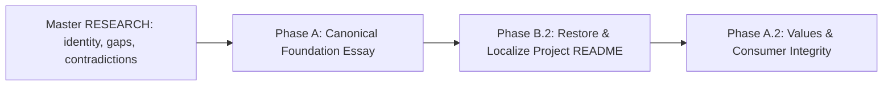

# HL — TFW-55: TFW Foundations — Philosophy of Trace, Methodology & Project North Star

> **Date**: 2026-08-13
> **Author**: Coordinator + Owner
> **Status**: ✅ HL_APPROVED — corrective Phase A.2 Amendment A7 and phase plan approved by the owner 2026-08-26; ready for `/tfw-handoff`; the prior Phase A and Phase B.2 verdicts remain in the trace
> **Contract**: 🔒 RE-FROZEN — approved by the owner 2026-08-13; amendments A2–A7 approved 2026-08-26
> **Frozen**: §1 · §3 · §4 · §5 · §6 · §7 — locked on owner approval
> **Free**: §2 · §7.2 · §8 · §9 · §10 · §11 — research updates these directly
> **Append-only**: §12 Amendment Log — the only channel for changing a frozen section
> **Baseline**: `git log --format="%h %s"`, filtered on `^\S+ \[[^]]*/TFW-55/freeze/`
> **North-star role**: establish the repository's citable Project North Star, from which the future BoK, methodical guide, courses, book, and later knowledge products will be derived
> **Language direction**: English remains the semantic source; Russian and Kazakh are natural localizations of the practical project README, and Russian teaching material is a first-class source
> **Research result**: H1 conditional; H2 narrowed/open; H3 narrow; H4 mixed/open. Two mandatory iterations are complete and sufficient for planning; no synthetic Iteration 3

---

## 1. Vision 🔒 FROZEN

TFW can explain, in plain language, what it is: **a methodology for joint human–AI work, founded on the Philosophy of Trace, for conditions in which people delegate part of intellectual work to agents.** The philosophy explains why purpose, questions, selected memory, observability, and human responsibility matter. The methodology turns those commitments into repeatable ways of organizing bounded delegation and continuation. Workflows and tools are realizations for particular conditions; this repository is a self-applying reference implementation, not the only possible realization and not timeless truth.

The public entry preserves two different document jobs inside one named **Project North Star** surface. The root `README.md` is the practical project guide: it explains what the repository is, who it serves, which Edition to choose, how to install or initialize it, which command starts work, what files and workflows exist, and where to go next. `.tfw/README.md` is the shortest complete, citable essay about purpose, principles, boundaries, and non-goals. Russian and Kazakh root READMEs are natural localizations of the practical guide, not summaries of the essay. `conventions.md`, `glossary.md`, workflows, templates, and Editions own detailed mechanics. Task traces and verified knowledge preserve how and why the project evolved.

**Impact:** founder knowledge externalized in the Russian mini-essays becomes durable project self-knowledge; misleading or obsolete claims are removed; the project gains one stable orientation point without freezing its mechanics. A separate next task may turn the working BoK into an approved expanded canonical reference subordinate to the Project North Star. Only after that should guides, courses, and books derive their deeper conceptual model.

> “TFW uses the Philosophy of Trace to help humans delegate intellectual work without losing purpose, authority, judgment, memory, or the ability to continue.”

## 2. Current State (As-Is) 🟢 FREE

### The intended document architecture already exists

Earlier project decisions established a useful separation:

| Existing surface | Intended role | Current problem |
|---|---|---|
| Root `README.md` | Public landing page and Task Board | The public section has grown to 1,481 words and repeats philosophy, positioning, mechanics, links, comparisons, and reference material |
| `.tfw/README.md` | Five-minute philosophy paper | It contains the seed of the canon, but also implementation-led framing, code-centric language, outdated absolutes, and none of several ideas that emerged in live teaching |
| `.tfw/conventions.md`, `.tfw/glossary.md`, workflows, templates | Living operational specification | These correctly own detailed mechanics, but public prose sometimes treats current artifact names and lifecycle as the essence of TFW |
| `tasks/`, `KNOWLEDGE.md`, `knowledge/`, Git history | Evolution, evidence, rejected alternatives, verified project memory | They are a rich primary corpus, but an archive cannot by itself tell a new reader which ideas are stable, current, superseded, or merely hypothesized |
| Editions | Proportional implementations and teaching entry points | Light → Assisted → Full has become a practical explanatory bridge, but the philosophy paper still leads with Full mechanics |

Current measured public prose before the Task Board:

| Surface | Words | Lines |
|---|---:|---:|
| Root README public section at pre-Phase-B baseline `b924926` | 1,485 | 247 |
| Reviewed `.tfw/README.md` | 1,548 | 166 |
| Combined English explanatory content | 3,033 | 413 |

The problem is not simply length. The two documents answer different questions, although some claims in the project README are broader than the evidence or current architecture supports.

### Phase B first attempt verified the wrong function

The first Phase B contract treated the root README as a short doorway whose practical detail should be removed in favor of links. Its implementation passed that contract and formal review, but the owner rejected the result after seeing it in context: the README had become a paraphrased copy of `.tfw/README.md` and no longer performed its project-guide job. That APPROVE remains part of the trace but is superseded as product acceptance. Corrective Phase B.2 starts from the exact pre-Phase-B public prefix at `b924926`, preserves practical function by default, and limits philosophical editing to alignment with the reviewed essay.

### Phase A review accepted the essay but not its active consumers

Phase A produced a good 1,548-word Project North Star and its formal REVIEW approved the work. That verdict remains historical fact. The corrective issue is narrower and downstream: the Phase A TS explicitly placed glossary, workflows, and templates out of scope, while the new essay deleted the headings that those active files named. The Reviewer noticed `.tfw/glossary.md` PV priority 1 and `.tfw/templates/HL.md` still pointing to `§ Values and Principles`, but classified the drift as non-blocking because the file-level pointers resolved.

That acceptance boundary was wrong. PV priority 1 is a mandatory input to every `/tfw-plan` and a mandatory verification surface in `/tfw-review`; a reference that resolves to the wrong semantic item is not intact. The same defect is already present in the current TFW-60 master HL header and §7.2. Corrective Phase A.2 therefore extends the completed phase with the omitted active-consumer and value-disposition work. It does not revoke, edit, or conceal the original RF/REVIEW, and it does not reopen the essay for a wholesale rewrite.

### The repository is already a self-canon candidate

The project has used TFW to create and revise TFW across more than fifty traced tasks. It contains:

- the reasons behind role separation, research, evidence, review, knowledge consolidation, and Editions;
- failed and reverted directions, including the TFW-48/49 over-engineering path;
- a public philosophy paper, a living specification, verified knowledge, and an executable reference implementation;
- evidence that the framework can preserve its own evolution and allow new agents to resume its development.

This supports a stronger and simpler architecture than the earlier TFW-55 draft: **the repository remains the primary corpus; the canonical essay is a maintained human-readable projection of that corpus, not a second source of truth.**

The repository is not sufficient by itself for a newcomer because primary sources, current rules, historical rules, failures, and implementation detail coexist. Canonical exposition still requires selection, ordering, qualification, and language.

### Important knowledge is still outside the repository

The owner reports that several ideas became clear only while teaching and remain mainly in live explanations and lecture material:

- AI is not merely a faster tool; it performs delegated cognitive work and changes the human's role;
- the central problem is not prompting technique but how people preserve purpose, judgment, continuity, and responsibility while delegating cognition;
- a “self-aware project” is not sentient: it can state what it is, why it exists, what it knows, what changed, what remains uncertain, and how work should continue;
- a trace is selected, durable project memory, not a raw transcript or hidden chain-of-thought;
- Full TFW is difficult to understand when presented as a complete system before the learner has experienced the problems its mechanisms solve;
- Light → Assisted → Full worked as a guided progression because each step solved one visible problem and revealed the need for the next.

These are owner-sourced claims and teaching observations. TFW-55 must extract and examine them, connect them to project evidence where possible, and preserve their provenance rather than silently upgrading them into universal facts.

### Known philosophical and messaging debt

The present READMEs contain statements that require removal, qualification, or reframing:

- `Traces Over Code` and claims that code can simply be regenerated narrow a domain-agnostic method to software and overstate reproducibility;
- “the same lifecycle, the same artifacts” conflicts with Light, Assisted, and Full intentionally using different levels of structure;
- “documentation writes/maintains itself” hides the real consolidation, review, and maintenance work;
- “produce the same output again and again” is not a defensible promise for stochastic systems;
- `RF = source of truth` is incomplete after the Evidence, Review, and verified-knowledge layers;
- “AI agents are team members” needs boundaries around identity, authority, accountability, and actual independence;
- current descriptions often begin with framework machinery before explaining the cognitive problem and philosophical shift.

### Educational evidence position

The INNO-6–13 and university corpora support a founder-led progression that improves shared language and the structure of work artifacts. They do not yet prove durable individual behavior change, transfer to unfamiliar tasks, instructor independence, or scaled course effectiveness.

The most useful current teaching hypothesis is:

`useful work → experienced limit → next mechanism → named principle → independent continuation`

with Editions as the practical ladder:

`ad-hoc chat → Light → Assisted → Full agent engineering`

### Research resolution

Two iterations changed the confidence and wording burden, but not the task architecture:

- the repository is the **corpus and worked reference implementation**, not a source whose every file is normative;
- `.tfw/README.md` selects the stable current meaning, while the living specification owns current mechanics;
- no separate canon, BoK, manifest, claims register, or governance surface is justified;
- the minimum continuity contract is: **F1** human purpose and authority; **F2** bounded delegation; **F3** selected durable material trace plus result/current state; **F4** authoritative result plus continuation or explicit close;
- evidence, review, and verified knowledge are proportional assurance layers, not mandatory artifacts for every Edition;
- the individual components are not novel, and neither source comparison nor the bounded category probe established that `discipline`, `methodology`, or a hierarchy is truer than the low-assumption `framework` account;
- `self-aware` remains usable only as the already-bounded six-question capability, not as consciousness, authority, or a novelty claim;
- Light → Assisted → Full remains an observed founder-led and problem-led route plus a proportional implementation path, not a proven universal pedagogy.

The only frozen-contract tension was the discipline-first category claim. It was filed as A1 in §12 and then withdrawn before an owner ruling: Phase A can lead with the functional definition while retaining the approved `discipline` positioning. The self-awareness and Editions findings fit the existing DoD/DoF boundaries and therefore require TS wording discipline, not additional amendments.

### New owner corpus after the research close

Between 2026-08-15 and 2026-08-25 the owner used separate Codex sessions to externalize a new Russian-language corpus under `C:\Users\c0rpa\obsidian\c0rp\c0rp\Книга TFW\`:

| Corpus | Measured size | Status expressed by the source | Planning consequence |
|---|---:|---|---|
| `мини-эссе 0.8/` — 9 essays | 5,589 words | Coherent problem-led author exposition | Becomes Phase A's primary narrative and language source: invisible work → model amnesia → chat as raw material → Trace → continuability → questions → work that remembers itself → TFW architecture |
| `body of knowledge/00. Архитектура TFW.md` | 710 words | Working architecture derived from essay 0.8 | Reopens the frozen category model: Philosophy of Trace → TFW methodology → realizations/workflows; repository = one realization |
| `body of knowledge/version 0.1.md` | 6,675 words | Working research map; explicitly not a book, public specification, or final TFW description | Use as a concept/hypothesis/risk map, not as canonical authority: it still contains 16 open questions, 12 hypotheses, 13 principles, and 11 candidate practices |

The 12,974-word corpus materially improves the source situation: decisive founder knowledge is no longer confined to live explanation. It also creates three contract questions that completed research could not anticipate: whether the owner now selects `methodology` as TFW's category; whether a future BoK becomes a versioned canonical reference; and whether the public doorway has English, Russian, and Kazakh variants. These are owner architecture decisions, not reasons to rerun synthetic research.

### Coordinator assessment of the new corpus

- **Strongest addition:** the nine essays supply a reader-tested *shape* for explanation, not merely more claims. Phase A should stop exposing F1–F4 labels and use them only as an internal completeness check.
- **Identity change:** the latest architecture note gives a clearer primary noun than the frozen HL: TFW is the methodology; Philosophy of Trace is its foundation; workflows are realizations. This is proposed as A3, because it changes frozen claims rather than refining prose.
- **Canon conflict:** the architecture note calls the BoK canonical, while the frozen HL forbids a BoK and makes `.tfw/README.md` the selected meaning. A 6,675-word research map with unresolved hypotheses cannot safely become canon by declaration. A4 proposes a staged resolution rather than silently choosing either source.
- **Language change:** root-level `README.ru.md` and `README.kk.md` are natural derived doorways; `kk` is the language code for Kazakh. They must not duplicate the Task Board or silently override the English semantic source. This is proposed as A5.
- **Claims still needing Phase A restraint:** “a good Trace reproduces the same result” must become comparable/reconstructable rather than deterministic; “one cannot delegate what one does not understand” must be narrowed to defining purpose, boundaries, acceptance, and authority rather than complete domain mastery; observability does not guarantee correctness; memory ownership is contextual where employee, employer, client, privacy, and IP interests overlap; the Taylorism comparison is unnecessary for the short canonical essay.

### Scope boundary

TFW-55 will define the foundation and apply it to the two existing README surfaces. It will not:

- create a separate Canon database, claims registry, Body of Knowledge, governance institution, or certification system;
- write the 20–30 page methodical guide, a book manuscript, course, deck, facilitator guide, or university syllabus;
- research publishing economics, trademark, copyright registration, procurement, or Kazakhstan university regulation;
- redesign the visual brand, Editions, workflows, templates, or framework mechanics;
- prove educational effectiveness or market demand;
- clean every historical task or documentation page.

## 3. Target State (To-Be) 🔒 FROZEN

### 3.1 Result Visualization

After TFW-55, a reader encounters one project at several explicit distances, with one stable orientation point:

```text
┌─────────────────────────────────────────────────────────────────────┐
│ PROJECT NORTH STAR                                                  │
│ README.md — English doorway + only Task Board                       │
│ README.ru.md / README.kk.md — derived Russian/Kazakh doorways       │
│ .tfw/README.md — shortest complete purpose, principles, non-goals  │
└───────────────┬───────────────────────────────┬─────────────────────┘
                │ wants to use it               │ wants to audit it
                ▼                               ▼
┌───────────────────────────────┐  ┌──────────────────────────────────┐
│ LIVING SPECIFICATION          │  │ PRIMARY CORPUS                   │
│ conventions · glossary        │  │ tasks · RF/REVIEW/EV · knowledge│
│ workflows · templates         │  │ Git history · rejected paths    │
│ Editions · adapters           │  │ “Why and how did TFW change?”   │
│ “How does it work today?”     │  └──────────────────────────────────┘
└───────────────────────────────┘

                    AFTER PHASE A REVIEW, A SEPARATE TASK MAY CREATE:
       approved BoK — expanded canonical reference, subordinate to North Star
                                │
                                ▼
          methodical guide → courses/pilots → book → wider corpus
```

The finished result does not ask the owner to maintain a new canon system inside TFW-55. The existing repository explains itself more clearly, carries previously tacit founder knowledge, and exposes a citable Project North Star without freezing the living framework. The working BoK remains source material until a separate task reconciles, reviews, versions, and publishes it.

### 3.2 Value Flow

```text
PROJECT HISTORY + CURRENT SPEC + MINI-ESSAY 0.8 + BOK WORKING MAP
                              │
                              ▼
       distinguish enduring idea / implementation / evidence / claim
                              │
                              ▼
      define Philosophy of Trace · TFW methodology · realization boundary
                              │
                ┌─────────────┴─────────────┐
                ▼                           ▼
 finish English North Star essay       build three concise doorways
       .tfw/README.md             README.md · README.ru.md · README.kk.md
                └─────────────┬─────────────┘
                              ▼
       one self-describing repository with one North Star and clear depths
                              │
                              ▼
       separate BoK task → guide and teaching products without redefining TFW
```

### Identity architecture to embody

The result must express the following owner-approved distinctions in ordinary language without collapsing them into one overloaded word:

| Layer | Question it answers | Intended content |
|---|---|---|
| Philosophy of Trace | What changes when AI performs part of our intellectual work? | Purpose, questions, responsibility, selected memory, observability, continuity, human judgment |
| TFW methodology | How should humans and agents organize work under that condition? | Goal and value, bounded delegation, material traces, authoritative result/current state, continuation or explicit close, assurance proportional to risk |
| Realizations and workflows | How is the methodology applied under particular constraints? | Workflows, tools, artifacts, and other implementations; none is the whole methodology |
| Self-applying reference implementation | How does this repository realize TFW now? | `.tfw/`, prompts, artifacts, workflows, templates, adapters, task lifecycle, and Editions |
| Derived references and teaching products | How is the methodology expanded or taught? | Future approved BoK, methodical guide, courses, book, university material, cases |

`Methodology` is the owner's positioning decision after research failed to establish a universally true category taxonomy. Phase A must justify it through function, composition, and exclusions; it may not claim that Iteration 2 or component novelty proved TFW to be a higher category than a framework.

### What “self-aware project” means

The canonical essay must define self-awareness operationally, without anthropomorphism. A self-aware TFW project can answer from durable traces:

1. What are we trying to do and why?
2. What do we currently know, assume, and not know?
3. Which material decisions were made, rejected, or superseded, and on what evidence?
4. What is the current state of the work?
5. Who or what has authority for the next decision?
6. How can another human or agent continue without reconstructing the original chat?

This repository is the primary worked example because it uses these answers to alter its own method. That makes it self-applying and self-describing, not conscious, not independently authoritative, and not the only valid realization of the methodology.

### Canonical essay contract

`.tfw/README.md` becomes the English Project North Star and shortest complete statement of TFW's meaning. Its North Star clauses must be named and citable as `NS{n}`. It should read as a coherent essay, not a reference manual, marketing page, or artifact inventory. Its narrative should cover:

1. the cognitive shift created by AI agents;
2. why output without retained intent and judgment creates organizational amnesia;
3. project self-awareness as a practical capability;
4. trace as selected and inspectable continuity, not transcript or chain-of-thought;
5. the human/agent division of purpose, authority, delegation, and accountability;
6. the trace-first principles that follow from the philosophy;
7. how the Philosophy of Trace grounds the TFW methodology and how this repository realizes it;
8. Light → Assisted → Full as proportional implementations and a learning path;
9. what TFW is not, including a prompt collection, chat archive, deterministic generator, documentation tool, or replacement for human judgment;
10. observable success conditions and links to the living specification and project corpus;
11. a compact, citable Project North Star: purpose, principles, and non-goals.

The essay remains English and concise enough to be loaded by agents and read by a person in one sitting. Russian source formulations may be used naturally, but the English text selects the repository's public semantics. Its Project North Star must at minimum say that TFW does not become a prompt/chat archive, a deterministic generator, a replacement for human judgment, maximum-documentation bureaucracy, a vendor-bound tool, or a claim of untested capability.

### Root README contract

Phase B.2 restores the public content above the Task Board from exact pre-Phase-B commit `b924926` and treats it as a practical project README, not as a second essay and not as a compressed doorway. Three root-level versions share a visible language switch: `README.md` is the English semantic source and the only file containing the Task Board; `README.ru.md` and `README.kk.md` are natural localizations without Task Boards. Each preserves the practical capabilities of the baseline:

- explain the project, its continuity problem, and who it is for;
- help the reader choose Light, Assisted, or Full;
- give usable new-project, existing-project, and configured-project starts;
- expose exact `/tfw-*` commands and the current working lifecycle;
- explain repository structure, adapters, updating, and key concepts;
- route to philosophy, mechanics, history/evidence, documentation, repository, author, and license;
- retain the current English Task Board below the hard boundary.

The philosophical update is deliberately small: use the correct category — TFW is a methodology grounded in the Philosophy of Trace — keep human purpose, legitimate authority, judgment, acceptance, accountability, and stop responsibility explicit, qualify unsupported automation/self-documentation/agent-authority claims, and link to the canonical essay. The project README must not restate the essay's full argument.

### Content preservation and measurement contract

The `b924926` public prefix is the functional baseline. Before editing, Phase B.2 records a keep/update/add/remove ledger. Practical sections are kept by default; removing one requires a concrete functional reason and reviewer approval. Unsupported sentences may be corrected or removed without deleting the section that carried them.

Word counts are descriptive traces, not acceptance ceilings. English measurement still stops immediately before `## Task Board`; the heading and entire board tail are excluded. Russian and Kazakh count their complete files because they contain no board. No target length, compression ratio, or combined-English ceiling may drive a content cut.

### Update model

No new governance subsystem is required. Existing TFW work routes changes naturally:

| Change | Primary destination | README effect |
|---|---|---|
| Tool, command, artifact, workflow, or Edition mechanics | Living Specification / current task traces | Update the essay only if the meaning or boundary of TFW changed |
| New case, failure, or observation | Task traces and verified knowledge | May qualify an essay claim after evidence and owner decision |
| New founder explanation | Strategic Insight / research source | Integrate only after it is made explicit, challenged, and placed in the architecture |
| Change to philosophy, principle, non-goal, or validity boundary | `.tfw/README.md` Project North Star through a normal approved TFW task | Re-check English, Russian, and Kazakh root summaries and any approved BoK |
| Expanded concept, contradiction, hypothesis, or evidence limit | Future approved BoK through its own normal task | Must remain subordinate to and compatible with the Project North Star |
| Teaching improvement or local example | Future methodical guide/course | Does not redefine the philosophy unless it reveals a real conceptual defect |

The repository stays the primary corpus. The Project North Star changes slowly; the operational framework may evolve faster. A future approved BoK is versioned and names the North Star it interprets; derived products name both the approved BoK and relevant implementation version when they actually exist.

## 4. Phases 🔒 FROZEN

### Phase Dependencies



| Phase | Depends on | Shared files | Can run in parallel with |
|---|---|---|---|
| A | Master RESEARCH complete and owner decisions applied | — | — |
| B.2 | Phase A reviewed; original Phase B superseded | Pre-Phase-B practical README + minimal semantic alignment from `.tfw/README.md` | — |
| A.2 | Phase A and B.2 reviewed; Amendment A7 approved and re-frozen | Current `.tfw/README.md`, active PV consumers, current TFW-60 master | — |

### Phase A: Canonical Foundation Essay 🔴

> **Requires:** TFW-55 RESEARCH complete and owner-approved amendments A2–A5 applied.
>
> **Context for coordinator:**
> 1. TFW-55 master HL and all research iterations
> 2. `.tfw/README.md`, `knowledge/philosophy.md`, `KNOWLEDGE.md` decisions D2, D35, D40, D56–D59
> 3. TFW Git history ranges and rejected paths identified in §8
> 4. `Книга TFW/мини-эссе 0.8/` as the primary problem-led narrative source
> 5. `Книга TFW/body of knowledge/00. Архитектура TFW.md` as the approved architecture source and `version 0.1.md` as a non-authoritative concept/risk map
> 6. INNO-6–13 lecture/curriculum sources, TFW-51/52 Editions, and educational evidence boundaries

**Deliverables:**

1. Rewrite `.tfw/README.md` as the English Project North Star and canonical foundation essay under the contract in §3.
2. State one short definition of TFW and the approved architecture: Philosophy of Trace → TFW methodology → realizations/workflows; explain the repository as the self-applying reference implementation.
3. Integrate the problem-led sequence and durable ideas from mini-essay 0.8, using the working BoK only as a concept, contradiction, and risk checklist.
4. Resolve or remove the known overclaims and contradictions in §2.
5. Add named, citable `NS{n}` clauses covering purpose, principles, and explicit non-goals while keeping the canonical essay within its owner-approved 4,200-word ceiling; A6 later supersedes the combined-English Phase B ceiling and A7 sets this final North Star ceiling.
6. Preserve links to the living specification and project evidence instead of duplicating their reference content.

**Explicit non-deliverables:** the BoK, 20–30 page methodical guide, and translations. Phase A establishes the North Star; a separate later task may create the approved BoK, while Phase B owns Russian and Kazakh public doorways.

### Phase A.2: North Star Values and Consumer Integrity 🟡

> **Requires:** Phase A ✅, Phase B.2 ✅, and owner-approved Amendment A7 applied at a new freeze baseline.
>
> **Context for executor and reviewer:**
> 1. Current `.tfw/README.md`, including the pre-existing owner brand-image insertion
> 2. TFW-25's eight approved values and TFW-32's team-centric Success Criteria
> 3. Original Phase A TS/RF/REVIEW and review-stage files as immutable corrective provenance
> 4. Current glossary, conventions, HL template, plan/review workflows, review verification template, installed full-copy adapters, and TFW-60 master HL
> 5. The exact shared dirty-state manifest captured at handoff

**Deliverables:**

1. Preserve the current problem-led North Star essay while recording an explicit `EXPLICIT RESTORE`, `SEMANTIC MERGE`, or `INTENTIONAL RETIRE` disposition for every one of the eight TFW-25 values and four TFW-32 Success Criteria.
2. Give Candor Over Flattery, Structural Enforcement, Naming Creates Behavior, Portability, and bounded Success Criteria explicit canonical places; preserve `Traces Over Code` only as selected durable Trace/continuity and replace the absolute no-manual-editing outcome with the approved bounded result-and-acceptance test.
3. Keep `.tfw/README.md` coherent and no longer than 4,200 descriptive whitespace-delimited words. The ceiling is a maximum, not a target; filler or mechanical expansion fails even below it.
4. Repair every active normative/current consumer so citations resolve to the meaning they claim. `/tfw-plan` scans PV priorities 0–4 in full and 5–7 by relevance; `/tfw-review` verifies resolution, semantic match, and asserted relevance.
5. Preserve the original Phase A RF/REVIEW/APPROVE and all other immutable history, the owner brand insertion, and parallel TFW-60 state. Use exact baseline/final manifests and explicit-path staging.
6. Execute and review in separate sessions, allow at most three formal `REVISE` returns, run `/tfw-docs` and the `/tfw-knowledge` gate only after REVIEW APPROVE, and do not begin the BoK.

### Phase B.2: Restore & Localize the Project README 🟡

> **Requires:** Phase A ✅ and its RF/REVIEW, not only the Phase A TS.
>
> **Context for coordinator:**
> 1. Phase A RF and reviewed `.tfw/README.md`
> 2. Exact pre-Phase-B public prefix from `b924926`; current root `README.md` only for the live Task Board tail
> 3. Russian and Kazakh source terminology plus proficient-language reviewers
> 4. Editions selection and current Quick Start contracts
> 5. Existing brand identity and public links; no visual rebrand

**Deliverables:**

1. Restore the English public section of root `README.md` from `b924926` as the functional baseline while preserving the current Task Board tail and all parallel task changes.
2. Apply only ledgered factual, authority, navigation, and minimal philosophy updates; do not redesign it into a summary of `.tfw/README.md`.
3. Create root-level `README.ru.md` and `README.kk.md` as natural localizations of the restored practical README, without Task Boards.
4. Put `English · Русский · Қазақша` local links near the top of all three files and declare English as the semantic source.
5. Preserve practical parity across languages: project explanation, audience, Editions, installation/initialization, commands, structure, workflow, updating, links, and routes to philosophy/mechanics/history.
6. Record the baseline hash, keep/update/add/remove ledger, descriptive word counts, functional-parity evidence, local links, language reviews, prior-chain supersession, and remaining risks in the Phase B.2 RF. No BoK, public roadmap, or canon manifest is created.

## 5. Definition of Done (DoD) 🔒 FROZEN

- ✅ 1. TFW has one concise functional definition and one owner-approved architecture: Philosophy of Trace → TFW methodology → realizations/workflows; the repository is identified as its self-applying reference implementation without claiming that research proved the category or novelty.
- ✅ 2. The repository's authority model is explicit: Project North Star across root + `.tfw/README.md`; living specification for current mechanics; primary corpus for history/evidence; a future approved BoK may be an expanded reference subordinate to the North Star, but TFW-55 does not create it.
- ✅ 3. `.tfw/README.md` explains the cognitive shift created by delegated AI work before it introduces framework mechanics.
- ✅ 4. “Self-aware project” is defined through inspectable capabilities and explicitly does not imply sentience.
- ✅ 5. The essay states the boundary between trace, output, transcript, hidden chain-of-thought, project memory, and verified knowledge.
- ✅ 6. Human purpose, authority, judgment, accountability, and stop decisions remain visible; agents are not described as possessing authority merely because they participate in work.
- ✅ 7. Relevant knowledge from the founder's lectures is extracted into the repository, with owner claim, teaching observation, project evidence, inference, and open hypothesis kept distinguishable in the TFW-55 trace.
- ✅ 8. Light → Assisted → Full is presented as proportional implementation and a problem-led learning path, not as the philosophical definition of TFW or a universal maturity ladder.
- ✅ 9. Known deterministic, self-maintaining, code-centric, same-artifacts, and unbounded “agent team member” claims are removed or qualified.
- ✅ 10. `.tfw/README.md` is a coherent English Project North Star no longer than 4,200 descriptive whitespace-delimited words, contains named `NS{n}` purpose/principle/non-goal clauses, and links outward for mechanics, history, and evidence. The ceiling is not a target and does not authorize filler.
- ✅ 11. English `README.md` preserves the practical capabilities of the exact `b924926` public prefix while applying only ledgered minimal updates; only English contains the live Task Board.
- ✅ 12. Word counts are reported but do not govern content. No arbitrary ceiling or compression target removes project explanation, audience, Editions, installation/initialization, commands, structure, workflow, updating, or links.
- ✅ 13. All three root READMEs have a working language switch and practical functional parity: a newcomer can understand the project, choose an Edition, install or initialize it, start with an exact command, inspect structure/mechanics, and reach philosophy and history. Russian and Kazakh pass local-link and proficient-language review without material calque or translation smell.
- ✅ 14. The result creates no BoK, claims database, governance subsystem, certification layer, or product architecture inside TFW-55; an approved BoK is explicitly deferred to a separate next task after Phase A review.
- ✅ 15. The normal TFW task artifacts preserve source decisions, removed claims, founder-knowledge additions, and unresolved questions so the repository can explain its own rewrite.
- ✅ 16. A future Russian 20–30 page methodical guide can derive a problem-led Light → Assisted → Full narrative from the reviewed Project North Star plus a later approved BoK without inventing a different philosophy.
- ✅ 17. RESEARCH presents and attempts to falsify at least three credible identity/authority configurations, records evidence against the owner's preferred framing, and ties each surviving hypothesis to an explicit architecture or content decision.
- ✅ 18. The Project North Star is visibly designated across root `README.md` and `.tfw/README.md`, citable as `NS{n}`, and contains enough non-goals to reject excess rather than merely restating purpose.
- ✅ 19. All eight TFW-25 values and all four TFW-32 team-centric Success Criteria have explicit owner-approved dispositions and named current canonical targets; silent loss and unsupported equivalence are impossible.
- ✅ 20. Candor Over Flattery, Structural Enforcement, Naming Creates Behavior, Portability, and bounded Success Criteria have explicit canonical places; selected durable Trace/continuity remains without code-disposability or deterministic-regeneration doctrine, and the no-manual-editing absolute is replaced by a complete, usable, inspectable result subject to authorized human acceptance.
- ✅ 21. Every active current consumer uses real anchors and semantically matching items. `/tfw-plan` scans PV priorities 0–4 in full and 5–7 by relevance with distinct priority 0/1 meaning; `/tfw-review` verifies resolution, semantic match, and asserted relevance and escalates a mismatch as a discrepancy.
- ✅ 22. Corrective Phase A.2 records exact start/final dirty-state manifests, preserves the owner brand insertion and parallel TFW-60 work, stages only explicit owned paths, and leaves the original Phase A RF/REVIEW/APPROVE and other immutable history unchanged.
- ✅ 23. Phase A.2 uses separate Executor and Reviewer sessions, allows at most three formal `REVISE` returns before owner escalation, runs `/tfw-docs` and the `/tfw-knowledge` gate only after REVIEW APPROVE, and begins no BoK work.

## 6. Definition of Failure (DoF) 🔒 FROZEN

- ❌ 1. TFW-55 creates a BoK, claims register, governance, program map, or product-architecture files outside normal TFW task traces; the future BoK remains a separately approved task.
- ❌ 2. The repository is declared the canon in a way that makes every historical artifact, rejected direction, file name, workflow, or current implementation mechanism normative.
- ❌ 3. A surface competes with the Project North Star for TFW's purpose or principles, or a future BoK is allowed to override rather than expand it.
- ❌ 4. The essay remains primarily a description of HL/RES/TS/ONB/RF/REVIEW or begins with Full lifecycle machinery.
- ❌ 5. “Self-aware” is used as anthropomorphic marketing language without observable project capabilities and explicit limits.
- ❌ 6. Founder explanations are presented as universally validated facts merely because they worked in founder-led lectures.
- ❌ 7. Trace is equated with raw chat export, hidden reasoning, complete transcript, or guaranteed deterministic reproduction.
- ❌ 8. Human purpose, authority, and accountability disappear behind language that treats an AI agent as an independent responsible actor.
- ❌ 9. The root README becomes a shortened paraphrase of `.tfw/README.md`, or Russian/Kazakh become summaries instead of localizations of the practical project guide.
- ❌ 10. An arbitrary word ceiling, compression ratio, or preferred band drives deletion of functional project material; counts may describe the result but never define it.
- ❌ 11. Restoration overwrites the live Task Board tail or parallel task status, breaks the three-file language switch or links, removes a practical baseline section without a concrete ledgered reason, or makes current usage harder to discover.
- ❌ 12. TFW-55 silently changes workflows, templates, artifact contracts, Editions behavior, adapters, brand identity, or framework runtime to match the prose.
- ❌ 13. The task expands into the BoK itself, methodical guide, book, course, legal/IP research, market research, university packaging, certification, or launch work.
- ❌ 14. History is rewritten to make TFW appear conceptually complete from the beginning; failures, rejected paths, and later discoveries remain part of the corpus.
- ❌ 15. The next guide must reconstruct core philosophy from founder memory because TFW-55 left the decisive lecture-only ideas outside the repository.
- ❌ 16. RESEARCH treats “TFW is a fundamental philosophy,” “the repository is its own canon,” “self-aware project,” or Light → Assisted → Full as conclusions to support rather than claims to attack with competing explanations and disconfirming evidence.
- ❌ 17. Russian or Kazakh onboarding lacks proficient-language review, has broken local links, changes the definition/authority model, or carries an operational Task Board.
- ❌ 18. Any TFW-25 value or TFW-32 Success Criterion is silently lost, left without a disposition/target/reason, or mapped to weaker unrelated wording.
- ❌ 19. The North Star exceeds 4,200 descriptive whitespace-delimited words without a new owner-approved amendment, or the larger ceiling is treated as a target and filled with mechanical repetition or nonessential prose.
- ❌ 20. A current citation passes merely because its file or anchor exists while the claimed clause is absent, irrelevant, or semantically different; `/tfw-plan` omits PV priority 0 or `/tfw-review` omits semantic/relevance verification.
- ❌ 21. Corrective work rewrites an immutable historical trace or verdict, loses/claims/stages foreign dirty state, modifies a TFW-60 frozen claim or parallel phase artifact, or hides the original Phase A acceptance defect.
- ❌ 22. `Traces Over Code`, code disposability, deterministic regeneration, lossless context, automatic knowledge, independent agent authority, or the no-manual-editing absolute returns as an unbounded claim.
- ❌ 23. Phase A.2 begins the BoK, expands into unrelated product or guide work, or uses `/tfw-docs` before REVIEW APPROVE.
- ❌ 24. Executor and Reviewer are the same session, a Reviewer edits implementation, or a fourth formal return begins without an owner decision.

**On failure:** stop the affected phase and return to the last approved identity or document-role decision. A required change to framework mechanics, the North Star/BoK authority model, or product scope becomes a separate TFW task rather than being absorbed into the README rewrite.

## 7. Principles 🔒 FROZEN

1. **One North Star, several depths** — root + `.tfw/README.md` orient the project; the living specification owns mechanics; the corpus preserves evidence/history; a future approved BoK expands but never overrides the North Star.
2. **Philosophy before machinery** — begin with the changed nature of cognitive work, responsibility, memory, and continuity; introduce artifacts only as implementations of those ideas.
3. **Human purpose remains human** — AI may perform bounded cognitive work, but purpose, authority, accountability, and final judgment stay explicit.
4. **Trace, not transcript** — preserve selected intent, decisions, evidence, result, and continuation context; do not demand hidden chain-of-thought or total conversational capture.
5. **Self-awareness must be operational** — a project is “self-aware” only to the extent that its durable artifacts can answer what it is, why, what it knows, how it changed, and how to continue.
6. **Function before compression** — remove or shorten only when the reader loses no practical capability; concision is valuable only after the document still performs its job.
7. **Provenance before polish** — distinguish project history, verified evidence, owner philosophy, teaching observation, inference, and open hypothesis even when the final prose is smooth.
8. **Experience reveals the system** — Light → Assisted → Full should make each mechanism answer a pain already experienced; understanding grows from useful work, not terminology-first instruction.
9. **Refutation before canonicalization** — the owner's preferred explanation earns canonical status only after credible alternatives and evidence against it have been made explicit.

## 7.1 Quality Contract 🔒 FROZEN

- The final essay must call TFW a methodology founded on the Philosophy of Trace, then demonstrate function, composition, and exclusions; it must not claim that research proved this category or component novelty.
- Every abstract term must connect to an observable work behavior or project capability.
- The canonical essay contains no exact tool walkthrough, task status table, artifact catalog, installation guide, or historical changelog.
- The root README remains a practical project guide and links to the essay for philosophical depth rather than paraphrasing it; Russian and Kazakh preserve the guide's practical function while remaining semantic derivatives of English.
- “Canonical” means official selected exposition, not eternally fixed or independent of evidence.
- Current framework mechanics may illustrate a principle but cannot define it by themselves.
- Lecture material is a source corpus. Its insights enter the essay only after explicit extraction, comparison with project history, and owner review.
- Claims about learning, reproducibility, automation, agents, and self-documentation must state boundaries supported by current evidence.
- Examples remain domain-agnostic unless a domain example is necessary and clearly marked as an example.
- The English essay preserves concepts discovered in Russian teaching; Russian and Kazakh doorways are allowed natural phrasing but may not silently alter the foundation.
- A future approved BoK must name the North Star version it expands and preserve visible status boundaries between canon, hypothesis, contradiction, and open question.
- Existing TFW task artifacts are the change trace. Do not add a registry merely to describe that a change occurred.
- Each phase must report net word-count change and a content-role check, not only grammatical correctness.
- RESEARCH must steelman the strongest competing explanation, preserve negative findings, and state what evidence would make the owner-preferred architecture lose.

### 7.2 Knowledge Citations 🟢 FREE

| # | Source | Item | How it applies |
|---|---|---|---|
| 1 | pre-Phase-B [`README.md`](../../README.md) at `b924926` | Existing landing, audiences, Editions, Quick Start, FAQ, How It Works, repository structure, adapters, workflow, updating, links, Task Board | Restore and preserve the working project-guide function; correct only stale facts, unsupported claims, authority wording, and navigation |
| 2 | [.tfw/README.md](../../.tfw/README.md) | Existing philosophy paper | Primary seed to complete and correct, not discard or replace with another canon file |
| 3 | [KNOWLEDGE.md](../../KNOWLEDGE.md) | D2, D35, D40, D52–D60 | Preserve root/essay separation, domain breadth, evidence boundaries, Editions, and capability-claim distinctions |
| 4 | [knowledge/philosophy.md](../../knowledge/philosophy.md) | F3, F6, F8, F10–F16, F21–F25, F32–F33 | Grounds critical challenge, self-knowledge, domain independence, method-not-software, decision infrastructure, simplification, and live-artifact teaching |
| 5 | [.tfw/conventions.md](../../.tfw/conventions.md) | §3, §11, §14 | Existing specification owns mechanics; token density, no placeholders, evidence, role boundaries, and anti-patterns constrain the rewrite |
| 6 | [knowledge/convention.md](../../knowledge/convention.md) | F7, F9, F17–F19 | Keep a small principle set, distinguish brand anchors, use newcomer-readable terms, and preserve naming discipline |
| 7 | [knowledge/process.md](../../knowledge/process.md) | F2, F11, F16, F22, F25, F27 | Founder insight capture, organic formalization, citation failure, anti-overengineering, and routine-discipline failure shape the source and claim treatment |
| 8 | [knowledge/constraint.md](../../knowledge/constraint.md) | F2, F3, F6–F7 | Prevent prompt bloat, filler entities, upstream/live-state confusion, and code-only framing |
| 9 | [knowledge/domain.md](../../knowledge/domain.md) | F1–F3 | The project already contains its own “brain”; shared language should emerge through pains and stories rather than definition dumps |
| 10 | [knowledge/stakeholder.md](../../knowledge/stakeholder.md) | F1, F4 | Business value and low-friction entry precede technical detail |
| 11 | [TFW-32 Phase D](../TFW-32__methodology_and_positioning/PhaseD/) | Audience, positioning, “generates vs stores” | Reuse critically; do not duplicate positioning or preserve unsupported absolutes |
| 12 | [TFW-51/52](../TFW-52__tfw_light_v1/HL-TFW-52__tfw_light_v1.md) | Simplification boundaries and Editions progression | Preserve the method's meaning while treating Light, Assisted, and Full as proportional implementations |
| 13 | [TFW-55 RES Iteration 1](research/iter1/RES.md) | Internal authority architecture, candidate identities, teaching-claim limits | Separates corpus from semantic selection, preserves the framework-only challenger, and distinguishes teaching observation from demonstrated outcome |
| 14 | [TFW-55 RES Iteration 2](research/iter2/RES.md) | D1–D8, F1–F4, R1, A1–A3, category v4 | Grounds the minimum continuity contract, rejects component novelty, bounds category language, and records the proportionality stop |
| 15 | `Книга TFW/мини-эссе 0.8/` (owner-local corpus) | Nine problem-led essays, 5,589 words | Primary Phase A author/narrative source; use its explanatory sequence while narrowing overclaims listed in §2 |
| 16 | `Книга TFW/body of knowledge/00. Архитектура TFW.md` (owner-local corpus) | Working architecture, 710 words | Owner-approved source for Philosophy of Trace → TFW methodology → realizations |
| 17 | `Книга TFW/body of knowledge/version 0.1.md` (owner-local corpus) | Working research map, 6,675 words | Concept, contradiction, hypothesis, and risk checklist only; not current canon or a Phase A deliverable |

## 8. Dependencies 🟢 FREE

| Dependency | Status |
|---|---|
| Knowledge Gate: current max task sequence 60 − last consolidation 58 = 2; interval 5 | ✅ Passed; consolidation is not due |
| Phase A RF and REVIEW | ✅ Complete; `.tfw/README.md` approved at 1,548 words with 9/9 links and `NS1`–`NS3` anchors |
| Phase B language surfaces | ✅ English root exists; `README.ru.md` and `README.kk.md` do not yet exist |
| Category positioning for Phase A | ✅ Owner selected `methodology` in A3; lead with function and do not claim research proved the noun or novelty |
| Owner verdicts on A2–A5 | ✅ Approved 2026-08-26 and applied to this re-frozen contract |
| Owner mini-essay 0.8 corpus | ✅ Available locally; 9 files / 5,589 words; primary Phase A author/narrative source |
| Owner BoK architecture + v0.1 map | ✅ Available locally; 2 files / 7,385 words; source corpus, not current repository authority |
| TFW repository history, existing READMEs, task traces, and verified knowledge | ✅ Available locally |
| `D:\projects\research\innoforce-ai-first`, especially INNO-6–13 | ✅ Available locally; read-only teaching corpus |
| `D:\Google Drive\2025\ai-first-university` | ✅ Available locally; read-only secondary transformation corpus |
| TFW-51/52 Light, Assisted, and Full evidence | ✅ Available; evidence limits must remain visible |
| TFW-53 HL Contract & Goal Defence | 🟡 Soft dependency; use delivered freeze mechanics if complete before TFW-55 approval |
| TFW-36 readable source artifact | ⬜ Unavailable; do not treat the current HL summary as source evidence unless the artifact is recovered |
| Existing brand and documentation pipeline | ✅ Reuse only; no redesign required |
| Two mandatory research iterations | ✅ Complete; Iteration 2 recommends `SUFFICIENT` for planning |
| Independent human-reader, facilitator, field D9, and durable-learning evidence | ⬜ Explicitly deferred; future guide/pilot input, not a blocker for the foundation essay |

### Priority internal sources for RESEARCH

**TFW identity and evolution:**

- `.tfw/README.md`
- root `README.md`
- `knowledge/philosophy.md`
- TFW-25 values consolidation
- TFW-27 philosophy/brand split
- TFW-32 methodology and positioning
- TFW-36 source-integrity failure — historical pointer only; readable source currently unavailable
- TFW-48/49 rejected over-engineering range
- TFW-51/52 simplification and Editions

**Teaching and tacit founder knowledge:**

- `D:\projects\research\innoforce-ai-first\tasks\INNO-8__ai_work_mini_mba_course\HL-INNO-8__ai_work_mini_mba_course.md`
- `D:\projects\research\innoforce-ai-first\tasks\INNO-13__day1_lecture_pedagogy_rework\phase-a\curriculum_map.md`
- `D:\projects\research\innoforce-ai-first\tasks\INNO-13__day1_lecture_pedagogy_rework\phase-a\assessment_model.md`
- `D:\projects\research\innoforce-ai-first\tasks\INNO-13__day1_lecture_pedagogy_rework\phase-b\rev5\practice_day1.md`
- `D:\projects\research\innoforce-ai-first\tasks\INNO-13__day1_lecture_pedagogy_rework\sources\feedback__day1_delivery_rev5_verbatim_2026-08-10.md`
- `D:\projects\research\innoforce-ai-first\tasks\INNO-13__day1_lecture_pedagogy_rework\sources\feedback__day2_delivery_and_day3_vision_verbatim_2026-08-11.md`
- `D:\projects\research\innoforce-ai-first\tasks\INNO-13__day1_lecture_pedagogy_rework\sources\feedback__day3_delivery_verbatim_2026-08-12.md`
- `D:\Google Drive\2025\ai-first-university\60_course\HANDOUT_day2_workbook.html`
- `D:\Google Drive\2025\ai-first-university\70_kaznpu\results\RF__internal_03_transformation.md`

**Git history ranges:**

- `45fd1b0..85e4217` — starter to tool-agnostic `.tfw/`
- `300cc45..2d94a67` — research, knowledge, and methodology kernel
- `12decfd..84bab03` — documentation, brand, and philosophy-paper split
- `38a851e..a36bd3a` — methodology and positioning
- `c461236..5aef936` — review, evidence, and adapters
- `ee8d444..bc6779e` — rejected over-engineering and baseline restoration

## 9. Risks 🟢 FREE

| Risk | Probability | Impact | Mitigation |
|---|---|---|---|
| “Fundamental” becomes vague philosophy with no observable work consequences | High | High | Require every concept to map to a project capability, principle, or boundary |
| The current framework is mistaken for the only possible realization of TFW | High | High | Explicit identity layers and repository/reference-implementation boundary |
| Lecture-only founder knowledge is polished into fact without challenge | High | High | Source classification, history comparison, owner review, visible claim limits |
| Simplification deletes information users need to start | Medium | High | Preserve doorway contract and verify meaning/use/audit paths |
| Essay expansion defeats the subtraction goal | High | Medium | Per-surface and combined word ceilings; net-change report |
| Root README and essay drift into duplicate summaries again | High | Medium | One question per surface and link instead of repetition |
| “Self-aware” is dismissed as anthropomorphic hype | Medium | High | Operational six-question definition and explicit non-sentience boundary |
| TFW is positioned too narrowly as software engineering | High | High | Start from delegated cognitive work; use domain-agnostic examples and language |
| TFW is positioned so broadly that it loses distinctiveness | Medium | High | Keep trace, inspectability, self-knowledge, and resumability as concrete differentiators |
| Light → Assisted → Full is canonized as universally optimal pedagogy | Medium | Medium | Present as current default hypothesis and tested founder-led path, not causal proof |
| Existing brand phrases survive despite contradicting the clarified philosophy | Medium | Medium | Evaluate every tagline/claim against the identity architecture; keep only compatible anchors |
| Research expands back into BoK, legal, market, product, and certification architecture | Medium | High | Two bounded iterations and explicit DoF; route later questions to later tasks |
| Historical traces are cleaned to improve narrative consistency | Low | High | Change current exposition only; preserve rejected and superseded history |
| A strong category noun is presented as a research-demonstrated fact | High | High | Use the F1–F4 functional definition first; treat any stronger noun as an explicit positioning choice with its burden visible |
| Research instrumentation consumes more effort than the decision can justify | Medium | Medium | Preserve the completed category probe and uncertainty; do not restart stopped model families without a concrete decision whose value warrants them |
| The external Obsidian BoK silently becomes a second canon | High | High | Require A4's explicit hierarchy and a later versioned repository task; until then it is a source corpus only |
| English, Russian, and Kazakh doorways drift semantically | High | Medium | Keep English as declared semantic source; require language switch, matched content roles, translation review, and per-file parity checks in Phase B |
| Phase A tries to compress all 12,974 source words into one essay | High | High | Use essay 0.8 for narrative, architecture note for the current model, BoK v0.1 for checks; preserve the 4,200-word public ceiling as a maximum rather than an expansion target |

## 10. RESEARCH Case 🟢 FREE

### Blind Spots

- What primary category best names TFW without making it either a vague philosophy or merely a prompt framework: discipline, method, methodology, workflow, or a deliberate hierarchy?
- Which ideas are genuinely stable across TFW's history and Editions, and which only look fundamental because Full currently implements them?
- Which decisive ideas exist only in the founder's lectures or live explanations, and what project evidence supports, limits, or contradicts them?
- Can “self-aware project” be defined sharply enough to be useful across code, research, education, documents, and organizations?
- What is the minimum semantic content of a trace without demanding transcripts or hidden chain-of-thought?
- Does the current tagline “The thinking is the product” still express the foundation, or does “thinking” risk implying private reasoning rather than inspectable traces and decisions?
- Which claims can be removed with no loss, and which apparently technical statements carry essential philosophical meaning?
- Can one English essay serve both human understanding and agent orientation within the 4,200-word ceiling without treating that maximum as a target?
- Is the self-canon architecture sufficient, or will future authors still need a small explicit source/version contract once real derived products exist?
- Which parts of Light → Assisted → Full belong in the canonical essay, and which should wait for the methodical guide?

### Hypotheses

| # | Hypothesis | Status |
|---|---|---|
| H1 | The repository can serve as TFW's primary corpus and govern its own official exposition through root README + `.tfw/README.md` + living specification; no additional canonical surface is needed at the current scale | **Conditional support after Iteration 2.** The layered authority architecture survives; real external-author maintenance remains untested. The rewrite must make precedence explicit |
| H2 | TFW has a defensible identity above its current prompt framework — a distinctive discipline or methodology for organizing human responsibility and traceable work under delegated AI cognition — rather than being a new label for documentation, ADRs, knowledge management, or agent engineering | **Narrowed/open after Iteration 2.** F1–F4 composition is coherent; component novelty and elevation above framework are not demonstrated. C4 remains the lowest-assumption account |
| H3 | The lectures contain missing conceptual knowledge that belongs in TFW's foundation, and source comparison can distinguish that knowledge from founder rhetoric, audience-specific explanation, examples, and unsupported claims | **Narrow support after Iteration 2.** Bounded delegation and problem-led progression belong as qualified concepts; transfer, causality, and facilitator independence do not |
| H4 | A subtraction-first two-surface design, with the philosophy reached through the problem-led Light → Assisted → Full bridge, improves human comprehension and future derivability without weakening agent orientation or turning one founder-led teaching path into doctrine | **Mixed/open after Iteration 2.** Two-surface subtraction survives. Human/agent consumption superiority and learning-path efficacy remain future field questions |

### Planning decision after Iteration 2

1. **Stop research.** The two required iterations are complete. Remaining gaps need human/field evidence or an owner positioning choice; another synthetic iteration would not resolve them.
2. **Keep the two existing phases.** Phase A writes and reviews the canonical essay. Phase B may start only from Phase A's reviewed meaning and then simplifies the root doorway.
3. **Keep the approved category contract.** A1 was withdrawn because it asked the owner to choose an abstract noun before seeing the essay. Phase A leads with the F1–F4 functional definition, retains `discipline` as the approved positioning word, and does not claim that research proved the category.
4. **Do not amend `self-aware`.** The frozen contract already operationalizes and limits it. Phase A must keep it secondary to the functional definition.
5. **Do not amend Editions.** The frozen contract already rejects a universal maturity ladder. Phase A may present Light → Assisted → Full as one problem-led, proportional route with explicit evidence limits.
6. **Write only the Phase A HL/TS.** Phase B planning waits for Phase A RF and REVIEW.

### Falsification and Decision Contract

| Hypothesis | Required attack | What would refute or materially narrow it | Decision if it loses |
|---|---|---|---|
| H1 — self-canon sufficiency | Compare at least: repository-as-corpus + essay; standalone minimal canon; living specification as sole authority; separate author/teacher guide as authority. Test how each handles a contradiction, semantic update, Russian derivative, and external author | An informed outsider cannot determine the official meaning without reading task archaeology; two current surfaces give conflicting authority; a semantic change has no unambiguous update destination | Introduce only the smallest missing authority contract or surface demonstrated necessary; do not jump automatically to BoK/governance |
| H2 — fundamental identity | Steelman the explanation that TFW is only docs-as-code + decision records + agent prompts. Compare against primary sources from adjacent practices and apply exclusion, novelty, and boundary tests | The definition cannot say what TFW excludes; its distinctive claims reduce to generic good practice; “self-aware” adds metaphor but no testable capability; uniqueness depends on HL/RF file names | Position TFW honestly as a practical methodology/framework; drop or narrow “fundamental,” “self-aware,” or new-category claims |
| H3 — founder knowledge belongs in the foundation | Extract each lecture-only claim separately, trace it to project history and field evidence, search for contradictions, and classify it as invariant, interpretation, pedagogy, example, or claim | A concept changes by audience, contradicts stable project behavior, depends on the founder's live explanation, or has no consequence for what TFW is/is not | Keep it in the future methodical guide, facilitator material, case corpus, or open questions — not in the canonical essay |
| H4 — subtraction and progressive exposition | Compare current and proposed information architectures; run independent cold-reader/agent critiques against defined comprehension questions; challenge word ceilings and direct-to-Full alternatives | Shortening removes information needed to choose/use TFW; the essay becomes worse agent context; Light → Assisted → Full confuses implementation with philosophy; another sequence explains the method more clearly | Change the document split or ceilings; keep the progression in teaching products only; do not force it into the canonical essay |

The point is not to obtain four `confirmed` verdicts. `Refuted`, `narrowed`, and `conditional` are successful research outcomes if they prevent the project from canonizing an attractive but false story.

### Risks of Not Researching

Without research, the rewrite would be an editorial preference exercise. It could replace known technical overclaiming with untested philosophical overclaiming, canonize the founder's latest explanation without comparing it to the framework's history, or remove working onboarding content in pursuit of elegance. The future methodical guide would then inherit an attractive but unstable foundation.

### Proposed RESEARCH Focus

**Iteration 1 — Internal self-canon and founder-knowledge archaeology**

1. **Gather:** compare the two READMEs, verified philosophy, decisive task history, rejected directions, Editions, lecture sources, and explicit owner explanations. Extract claims atomically, including claims against the preferred self-canon/fundamental-philosophy framing.
2. **Extract:** produce inside the normal stage traces: a concept/provenance map; contradiction and overclaim map; lecture-gap classification; and at least three credible identity/authority configurations. Separate stable philosophy, method, current framework mechanics, teaching devices, brand language, evidence, and hypotheses.
3. **Challenge:** assign a researcher to argue the strongest framework-only explanation; attempt to refute every proposed invariant across early history, rejected work, all Editions, and non-code domains. Report which concepts survive, which narrow, and which belong outside the essay.

**Required Iteration 1 decisions:**

- Is the repository a corpus, a canon, a reference implementation, or a combination with explicit boundaries?
- What precisely is official when repository history, current specification, essay, and founder explanation disagree?
- Which lecture-only concepts change TFW's identity or boundaries, and which merely help teach it?
- Is “self-aware project” retained, operationally narrowed, or rejected?
- What is the strongest case that TFW is not fundamental and not distinct?

**Iteration 2 — External challenge and minimal canonical exposition**

1. **Gather:** use primary/official sources for adjacent practices and mature minimal methodologies: decision records/docs-as-code, knowledge externalization, distributed cognition, human–AI/agent work, methodology/reference-guide relationships, and progressive adoption. The purpose is comparison and counter-evidence, not borrowed prestige. Keep C1/C3/C4/C9 intact and define matched variants rather than comparing packages with several variables changed at once.
2. **Extract:** compare category definitions, exclusion boundaries, minimum compositions, authority models, official-text patterns, and update models. Hold C3 or C4 constant while comparing D9 one-common-core, separate-parity, and task-traces-first contracts; separately construct authority-conflict, semantic-update, Russian-derivative, and external-author citation scenarios.
3. **Challenge:** run independent red-team, cold-reader, and agent-orientation critiques against the same bounded questions: What is TFW? What is it not? What remains human? What is a trace? Why is the repository special? Where is current operational truth? Compare `self-aware` with operationally equivalent non-anthropomorphic wording, and compare Light → Assisted → Full with direct-to-method/specification and role/risk branching. Measure immediate definition, capability, precedence, rule, load, and drift accuracy only; do not infer durable learning efficacy.

**Required Iteration 2 decisions:**

- Retain, narrow, or reject the “fundamental discipline” thesis.
- Choose the primary category and a one-sentence definition; explicitly state the strongest rejected alternative.
- Accept self-canon, add a minimal authority contract, or require a separate canonical surface.
- Decide whether Light → Assisted → Full belongs in the essay, only in the guide, or in both for different purposes.
- Select or reject a D9 human/agent consumption contract using matched variants rather than survivor frequency.
- Verify that outsiders can resolve a contradiction, semantic update, Russian derivative, and external-author citation under the corpus/essay/spec precedence model.
- Identify the minimum selected trace that remains valid across Editions and non-code work while evidence, review, and verified knowledge scale by risk.
- Confirm or revise the two README roles and word ceilings.
- List which questions cannot be settled by source research and therefore require later human learner/teacher pilots.

**Coordinator recommendation:** run `/tfw-research` with **2 mandatory iterations**, adding a third only if Iteration 2 leaves H1 or H2 undecidable. Iteration 1 attacks the preferred story from inside TFW's own evidence. Iteration 2 attacks it from adjacent primary sources and independent readers. Legal, market, certification, and product research are explicitly deferred.

### What This RESEARCH Cannot Prove

Even a strong result here will not prove that TFW changes thinking, that Light → Assisted → Full is causally superior, that another teacher can reproduce the course, or that buyers want a book. It can establish a defensible conceptual architecture, remove false claims, and design what later human pilots must test. Educational efficacy, transfer, retention, instructor independence, and market demand remain separate empirical tasks.

### Why Not Just...?

- **Why not keep `.tfw/README.md` as it is?** — It already contains the correct seed, but it also contains disputed promises, Full-first framing, code-centric language, and omits concepts that proved decisive in teaching.
- **Why not say “the repository is the canon” and stop?** — The repository is the corpus, but a newcomer cannot infer stable meaning from current rules, historical rules, rejected paths, and fifty-plus task traces without selected exposition.
- **Why not create a separate canonical guide now?** — It would duplicate authority before the existing philosophy paper is complete; `.tfw/README.md` should become that shortest official exposition.
- **Why not write the 20–30 page methodical guide immediately?** — The guide needs examples, progression, exercises, and Russian teaching language, but first it needs a stable answer to what TFW is and is not. Otherwise the guide becomes the de facto philosophy by accident.
- **Why not edit both READMEs directly without RESEARCH?** — The repository contains real contradictions and the founder contains tacit knowledge; editorial cleanup alone cannot classify either correctly.
- **Why not clean every TFW document at once?** — That would mix philosophy, specification refactoring, historical rewriting, and product work. TFW-55 changes the two entry surfaces; discovered downstream inconsistencies become bounded future tasks.
- **Why not build the BoK and governance now?** — The repo history and knowledge system already perform the evidence-corpus role. Additional institutions are justified only when external authors, many cases, and versioned products create actual coordination pressure.

## 11. Strategic Insights (Planning) 🟢 FREE

| # | Insight | Category | Source |
|---|---|---|---|
| S1 | The owner suspects that the project is already its own canon and wants new entities justified rather than assumed | philosophy | User, TFW-55 HL review |
| S2 | The preferred direction is subtraction: simplify both READMEs and finish the existing `.tfw/README.md` essay instead of building a parallel documentation institution | constraint | User, current revision instruction |
| S3 | Significant parts of the philosophy exist only in the owner's head and lectures; leaving them there makes the founder a hidden runtime dependency of TFW | risk | User, current revision instruction; coordinator implication |
| S4 | TFW is believed to be more fundamental than its current methodology and prompt framework: it concerns thinking, self-awareness, and the organization of cognitive work with AI | philosophy | User, current revision instruction |
| S5 | This repository has a special identity: it uses TFW to make, describe, change, and narrate TFW itself | philosophy | User, current revision instruction |
| S6 | The short methodical guide should be born from the completed philosophy essay, then expand through pains, principles, and the Light → Assisted → Full learning path | process | User, TFW-55 discussion |
| S7 | Light and Assisted made Full understandable because learners were led from far away through small useful steps, solving one experienced problem at a time | philosophy | User, prior HL review feedback |
| S8 | The durable subject is not “how to use current AI products,” but how humans organize thought and work when agents perform substantial cognitive work | philosophy | User-endorsed framing from initial evaluation |
| S9 | English remains the repository's canonical semantic language, but Russian cannot be discarded because the teaching source material and first Kazakhstan products are Russian | convention | User, TFW-55 language decision |
| S10 | The future book, course, university work, and brand expansion remain north-star outputs, but they should follow rather than determine the foundation | constraint | User, TFW-55 scope decision |
| S11 | The owner explicitly wants evidence-backed disagreement and considers silent agreement a planning failure | stakeholder | User, TFW-55 review instruction |
| S12 | Rewriting the plan around the owner's self-canon hypothesis without explicitly presenting the counter-case reproduced the exact sycophancy failure TFW claims to resist; future research must surface disconfirming evidence before recommending the preferred architecture | process | User correction, TFW-55 HL review 2026-08-13; coordinator implication |
| S13 | The owner does not claim prior answers to H1–H4, approves structured research for all four, and will launch the Researcher in a separate task with all substantive questions routed back to the coordinator | process | User, research decision 2026-08-13 |
| S14 | The durable identity supported by both iterations is the selected-continuity composition F1–F4 with risk-proportional assurance, not ownership of novel components or a research-proven category noun | philosophy | TFW-55 RES Iterations 1–2 |
| S15 | The lowest-assumption surviving description is a reference framework with philosophical framing; stronger labels remain possible brand positions but carry an explicit burden | positioning | TFW-55 RES Iteration 2 D2/D7, category v4 |
| S16 | `self-aware` should be judged separately as terminology and as an operational capability; the capability survives, while human reception of the label is untested | philosophy | TFW-55 RES Iteration 2 D6/A2 |
| S17 | Light → Assisted → Full is supported as a proportional implementation path and founder-led teaching observation, not as causal or universal pedagogy | education | TFW-55 RES Iterations 1–2 |
| S18 | The category model experiment answered only immediate rule application and could not settle human positioning; stopping the remaining instrumentation was a positive proportionality decision, not missing completion | process | TFW-55 RES Iteration 2 SS3–SS4 |
| S19 | The owner explicitly instructed the coordinator to continue the already-started TFW-55 despite the Knowledge Gate reaching its configured hard interval; this is an acknowledged exception, not a completed consolidation | constraint | User, `/tfw-plan` continuation 2026-08-13 |
| S20 | The owner has now externalized a coherent Russian problem-led exposition; the founder is no longer the only runtime dependency for the sequence from invisible work to Trace, continuability, and methodology | philosophy | Owner mini-essay corpus 0.8, 2026-08-24–25 |
| S21 | The owner's latest working definition selects TFW as a methodology founded on the Philosophy of Trace, with the repository as one realization/workflow | positioning | `body of knowledge/00. Архитектура TFW.md`, 2026-08-25 |
| S22 | The BoK v0.1 is valuable precisely because it separates synthesis, hypotheses, risks, and open questions; those markers make it a research map rather than a ready canonical reference | evidence | `body of knowledge/version 0.1.md`, 2026-08-15 |
| S23 | The desired public entry is now multilingual: English remains the semantic source; Russian and Kazakh need discoverable derived onboarding documents without duplicated Task Boards | convention | User, TFW-55 planning input 2026-08-26 |
| S24 | The next methodical guide should derive from both the reviewed North Star essay and a later approved BoK; deriving it from the essay alone would now discard the richer ontology, contradictions, hypotheses, and evidence programme already externalized | process | Coordinator synthesis of owner corpus, 2026-08-26 |

## 12. Amendment Log 🟢 APPEND-ONLY

> A proposal requires evidence, cost, and a considered alternative. Only an explicit owner verdict changes a `SUPERSEDE` proposal.

| # | Date | Section | Type | Proposer | Proposed change | Evidence | Cost | Alternative | Verdict |
|---|---|---|---|---|---|---|---|---|---|
| A1 | 2026-08-13 | §1 Vision; §3 identity architecture and essay item 7; §5 DoD-1; §7.1 category clause | `SUPERSEDE` | Coordinator after RES Iterations 1–2 | Replace the claim that TFW is *fundamentally a discipline* and the forced discipline → methodology → framework ladder with a functional-first contract: **TFW organizes AI-delegated work so humans retain purpose, authority, judgment, accountability, and stop responsibility; bounded delegation leaves selected durable traces that preserve material context, decisions, authoritative result/current state, and continuation or explicit close.** Philosophy explains why this matters; a reusable method expresses the F1–F4 floor with risk-proportional assurance; this repository is the current reference framework. The essay may still call TFW a discipline or methodology as an explicit positioning choice, but not as a category established by research | Iteration 2 D2/D3/D7; C4 is the lowest-assumption control; eight adjacent controls refute component novelty; the valid two-pass category family found no stable wording advantage; official sources supply no universal category taxonomy. Iteration 2 RES A1/SS1–SS2 | Loses some immediate brand distinctiveness and the tidy category hierarchy; future book/course positioning may need human testing rather than inheriting a strong noun as fact | Retain **discipline** as the owner-selected primary category, but rewrite the essay to disclose that it is a positioning choice and demonstrate its exclusions/composition without claiming research proved elevation above framework. This preserves stronger branding at a higher explanatory burden | 🚫 **WITHDRAWN — coordinator, 2026-08-13.** The proposal bundled category strategy before the owner could judge the essay. Phase A can lead with the functional definition and retain `discipline` as positioning without changing the approved contract |
| A2 | 2026-08-18 | §3 Target State (public surfaces); §5 DoD — add one item; §5 DoD-11/DoD-12 word budgets | `EXTEND` | Coordinator, after closing TFW-53 | **Give this repository a Project North Star, and write the half that does not exist.** Three parts. **(a)** Designate the locus in the sense of `conventions.md` §3: sections of the root `README.md` and of `.tfw/README.md`, named in both files and citable as `NS{n}`. **(b)** Author a **non-goals** statement — what TFW must never become. Rule 3 makes non-goals mandatory and this repository has **zero**: `grep -i "non-goal"` over both READMEs returns 0. **(c)** Add one DoD item so the designation is a gate rather than a side effect, and raise the DoD-11/DoD-12 word budgets by the cost of (b) or fund it by subtraction, explicitly. Candidate non-goal clauses already recorded elsewhere in the project, offered as a starting set and not as the ruling: TFW does not become installable software with its own runtime (`philosophy.md` F14, D55, D58) · TFW does not bind to one vendor, and a rule living in a tool's memory is not methodology (`constraint.md` F12, P8, D54) · TFW does not become a documentation generator, the primary product is the knowledge graph (`philosophy.md` F6) · TFW does not add ceremony without an evidenced firing rate (§14, TFW-56) · TFW does not claim a capability it has not tested (D58, D59) | **The scope was assumed, not granted.** [TFW-54](../TFW-54__agent_team_mode/HL-TFW-54__agent_team_mode.md) records the designation as *"TFW-55's subject"* in its header, in its PV table row 1 and in its dependency table — three times — while **this frozen contract says nothing about it**: `grep -i "north star"` over this HL returns one hit, the header phrase *"North-star role"*, which is a metaphor for this task's foundational role and not the `conventions.md` §3 concept. So a downstream task routed work to a contract that never accepted it, and no one asked the owner. Measured absence of the mechanism itself: `north star` appears **0** times in `plan.md` and **0** times in `init.md`; there is no key in `project_config.yaml`; the only carrier is the per-HL header field in `templates/HL.md`:18, retyped by every task with nothing checking that two HLs name the same locus. Measured absence of the content: 0 non-goals in either README. Consequence today: every Purpose Check in this repository runs on the fallback — §1 Vision at the task's own baseline — which can catch a result that contradicts the goal and **cannot catch excess**, and rule 3 states that excess is exactly what this layer exists to catch. That is the failure mode TFW-54 will meet first, because a coordinator releasing a team of delegate sessions is the case where excess is cheapest to produce | Small and inside this task's existing surfaces. (a) is two headings and two pointers. (b) is 3–6 clauses — the candidates above are already written elsewhere and need a ruling, not authorship. (c) is one DoD line plus an explicit word-budget decision. **The real cost is DoD-11 and DoD-12**: 800 and 2,600 words are already binding, and non-goals must either raise them or be funded by subtraction. Nothing here touches §1, §4, §6 or §7 | **Leave it to a separate task.** Rejected on sequencing, not on merit: TFW-55 is the only chartered task that opens both READMEs, and a designation landed by anyone else would be a pointer into files this task is rewriting — the precise reason the owner deferred it at TFW-53 Phase C ONB (`process.md` F34). Doing it twice costs more than doing it once here. **Second alternative, also rejected:** designate the locus without writing non-goals — it satisfies the citation requirement forever while blocking nothing, which `conventions.md` §3 rule 4 names as the failure this rule guards against | ✅ **APPROVED — owner, 2026-08-26.** Keep the 800/2,600-word ceilings; fund Project North Star and non-goals by subtraction |
| A3 | 2026-08-26 | §1 Vision; §3 identity architecture and essay item 7; §5 DoD-1; §7.1 category clause | `SUPERSEDE` | Owner corpus, transcribed by Coordinator | Replace the discipline → methodology duplication with the owner's latest three-level architecture: **Philosophy of Trace** is the foundation; **TFW is the methodology** for joint human–AI work when part of intellectual work is delegated to agents; **workflows/implementations** realize that methodology for particular conditions, and this repository is its self-applying reference implementation. The essay must still lead with observable function and state that `methodology` is the owner's positioning choice, not a category proven by Iteration 2 or by component novelty | `мини-эссе 0.8/08. Что такое TFW.md` separates philosophy, methodology, framework, and implementations; the later `body of knowledge/00. Архитектура TFW.md` resolves the working definition to methodology + realizations. This postdates the withdrawn A1 and directly answers the category choice that research could not make | Rewrites the Phase A definition and identity section; accepts the explanatory burden of `methodology`; removes the neat but redundant discipline/method layer from the frozen model | Keep `discipline` as the primary noun and use the new essays only as teaching material. Lower contract cost, but leaves the owner's latest definition outside the repository and preserves the exact category ambiguity the essays resolved | ✅ **APPROVED — owner, 2026-08-26** |
| A4 | 2026-08-26 | §1 Impact; §3 result/authority/update model; §5 DoD-2/14/16; §6 DoF-1/3/13; §7 Principle 1 | `SUPERSEDE` | Coordinator after owner BoK corpus | Permit a **future versioned TFW Body of Knowledge** without making the present v0.1 file authoritative or adding it to Phase A. Authority becomes: `.tfw/README.md` = Project North Star and shortest canonical public summary; approved BoK = expanded canonical reference for philosophy, concepts, methodology, contradictions, hypotheses, and evidence limits, subordinate to the North Star; living specification = current reference-implementation mechanics; repository corpus = history/evidence. TFW-55 still creates no BoK: after Phase A review, a separate task reconciles v0.1 with the repository and publishes its first approved version. An external Obsidian draft cannot silently override repository authority | `00. Архитектура TFW.md` now assigns the BoK a canonical-description role; `version 0.1.md` already supplies a 22-section map. But v0.1 explicitly says it is not final/public and contains 16 open questions, 12 hypotheses, 13 principles, 11 candidate practices, and unresolved contradictions. The current frozen prohibition would discard useful architecture; immediate canonization would canonize uncertainty | One new future task and public reference surface; versioning, provenance, translation, and drift maintenance become permanent obligations. The guide/book sequence becomes North Star → approved BoK → methodical guide/products | Keep the BoK permanently as private author notes and leave `.tfw/README.md` as the only selected meaning. Simpler authority, but wastes the already externalized ontology/evidence programme and makes future books reconstruct detail from scattered sources | ✅ **APPROVED — owner, 2026-08-26.** BoK is a separate next task after Phase A review |
| A5 | 2026-08-26 | §3 result visualization, root README and size contracts; §4 Phase B deliverables; §5 DoD-11–13; §6 DoF-9–11 | `EXTEND` | Owner, transcribed by Coordinator | Make Phase B a multilingual public doorway. Root layout: `README.md` = English canonical doorway + the only Task Board; `README.ru.md` = Russian derived onboarding without Task Board; `README.kk.md` = Kazakh derived onboarding without Task Board. All three start with `English · Русский · Қазақша` links and preserve the same roles: pain/promise, short definition, Editions, Quick Start, meaning/use/audit navigation, license. The 800-word ceiling applies to each doorway independently; the 2,600-word combined ceiling counts only the English canonical doorway plus `.tfw/README.md`, not translations. Russian and Kazakh must declare derivation from the English source, pass semantic-parity and local-link checks, and receive proficient-language review before completion | Direct owner request 2026-08-26. Root-level `README.{language}.md` is discoverable without inventing a documentation subsystem; ISO 639-1 uses `ru` and `kk`. The current root contains the only Task Board and existing Phase B already owns its public onboarding simplification | Two new public files, up to 1,600 translated words, translation review, and continuing three-language synchronization whenever public meaning or onboarding changes | Put translations under `docs/onboarding/` or publish only external web pages. Lower root clutter, but weaker discovery and a broken language switch for repository visitors. Duplicate the Task Board in all languages — rejected because it creates three operational states that will drift | ✅ **APPROVED — owner, 2026-08-26.** Russian and Kazakh doorways belong to Phase B |
| A6 | 2026-08-26 | §1 public-entry role; §3 root README and size/subtraction contract; §4 Phase A size reference and Phase B; §5 DoD-11–13; §6 DoF-9–11; §7 P6 and root-README quality rule | `SUPERSEDE` | Owner, after rejecting the first Phase B result | Supersede the compact-doorway function and rerun the work as corrective Phase B.2. Restore the exact pre-Phase-B public prefix from `b924926` as a practical project README; preserve its project explanation, audiences, Editions, installation/initialization, commands, structure, workflow, updating, and links by default. Make only minimal philosophy/authority/factual updates, then create natural RU/KK localizations of that practical README. Cancel the 800-word and 2,600-word ceilings and every preferred word band. Keep Task Board English-only and exclude it from descriptive metrics without letting metrics drive content. The previous RF/REVIEW remain visible as a superseded chain that verified the wrong document function | Direct owner finding after seeing the approved output: the shortened README became a paraphrased copy of `.tfw/README.md`; the two documents have different purposes, and the old README had helped people understand the repository and start work. Measured baseline: `b924926` public prefix has 1,485 words and contains the practical sections the 523-word result removed. Parent coordination confirmed reopen and the exact baseline | Restores roughly 1,500 words in English and comparable RU/KK localizations; increases translation maintenance and abandons the earlier subtraction target. A new Executor/Reviewer cycle and docs correction are required | Keep the approved 523-word doorway and add a few links or sentences. Rejected: it preserves the wrong information architecture and cannot recover the missing project-guide functions without restoring the practical README | ✅ **APPROVED AND APPLIED — owner, 2026-08-26.** Previous Phase B acceptance is superseded; full `/tfw-plan` → Executor → Reviewer cycle required |
| A7 | 2026-08-26 | §4 Phases; §5 Definition of Done; §6 Definition of Failure | `EXTEND` | Coordinator, from owner correction after Phase A APPROVE | Add **corrective Phase A.2 — North Star Values and Consumer Integrity** after the completed Phase A and B.2 chains. The extension keeps the current `.tfw/README.md` as the North Star essay, but requires an explicit disposition ledger for all eight TFW-25 values and the four TFW-32 team-centric Success Criteria; gives Candor Over Flattery, Structural Enforcement, Naming Creates Behavior, Portability, and bounded Success Criteria an explicit canonical place; permits `Traces Over Code` only as selected durable Trace/continuity rather than disposable-code or deterministic-regeneration doctrine; and forbids silent loss. Extend DoD so all active current consumers use real anchors and semantically matching items, including `.tfw/glossary.md`, `.tfw/conventions.md`, `.tfw/templates/HL.md`, `/tfw-plan`, `/tfw-review`, `templates/review/verify.md`, synchronized Claude/Antigravity workflow copies, and the current TFW-60 master HL header and §7.2. The planning path must scan PV priorities 0–4 in full and 5–7 by relevance; review must verify both resolution and semantic relevance, with priority 0/1 checked against the clauses actually claimed. Extend DoD with exact dirty-baseline capture and preservation/integration checks, an owner-approved ceiling of **4,200 descriptive whitespace-delimited words**, separate Executor and Reviewer sessions, and at most three formal review returns before owner escalation. The ceiling is a maximum, not a target or permission for filler. Extend DoF so the phase fails on a silent value/Success-Criteria loss, anchor-only verification, historical trace rewriting, code-centric/deterministic overclaim, foreign dirty-state loss or staging, BoK work, exceeding 4,200 words without a new approved amendment, or mechanically expanding toward the ceiling. The original Phase A RF/REVIEW and its APPROVE remain unchanged and explicitly recorded as correct against an incomplete scope/acceptance surface | Owner correction in the delegated Phase A.2 mandate; current `.tfw/README.md` has 1,555 descriptive words including an uncommitted owner brand-image insertion and no explicit Candor, Structural Enforcement, Naming Creates Behavior, Portability, or Success Criteria section; TFW-25 approved eight values; TFW-32 approved the team-centric Success Criteria rewrite; Phase A REVIEW §4 observation 2 and `review/judge.md` acknowledged the stale glossary/template labels but treated resolving file pointers as sufficient; current `.tfw/glossary.md` priority 1 names a missing section, `templates/HL.md` repeats it, `/tfw-plan` scans priorities 1–4 rather than 0–4, `templates/review/verify.md` checks existence rather than relevance, and TFW-60 names three deleted sections in its current header/§7.2. `knowledge/philosophy.md` F39 and TD-166 already identify the same resolve-without-relevance failure class. The owner's explicit approval also raises the North Star ceiling from 2,000 to 4,200 words while forbidding filler | Twelve current production consumers plus three new execution traces, four later review traces, adapter-copy verification, and a post-APPROVE docs/debt correction. The current essay has 2,645 words of measured headroom, which is safety margin rather than an allocation target; if a coherent correction still cannot fit, execution stops for a new owner amendment rather than deleting meaning. Parallel TFW-60 and owner dirty state require per-path manifests and hunk-level integration instead of broad staging | **Relabel pointers only and leave the missing values implicit.** Rejected because it makes PV priority 1 resolve while carrying no declared methodology-value payload, reproducing the defect. **Create a separate values/canon file.** Rejected because it adds a competing North Star surface and mechanical bloat. **Rewrite the old essay wholesale or expand to fill 4,200 words.** Rejected because the current problem-led North Star is good and the corrective task is the smallest coherent semantic restoration plus active-consumer integrity, not rollback or filler | ✅ **APPROVED — owner, 2026-08-26, with explicit ceiling amendment to 4,200 descriptive whitespace-delimited words.** Semantic retirement of the literal `Traces Over Code` slogan, bounded replacement of the no-manual-editing absolute, and the full corrective consumer-integrity scope are approved; the ceiling is a maximum, not a target |

---

*HL — TFW-55: TFW Foundations — Philosophy of Trace, Methodology & Project North Star | re-frozen 2026-08-26*
