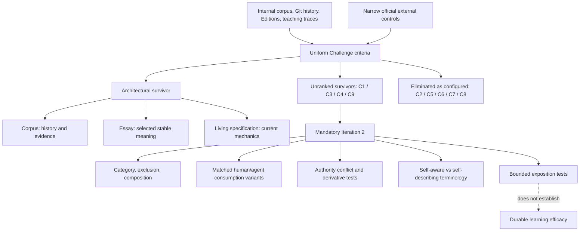

# RES — TFW-55: TFW Foundations — Philosophy, Self-Canon & Canonical Essay

> **Date**: 2026-08-13
> **Author**: Codex Researcher
> **Status**: 🔬 RES — Iteration 1 complete; more research required
> **Parent HL**: [HL-TFW-55](../../HL-TFW-55__canonization_program.md)
> **Mode**: Pipeline / focused

---

## Research Context

Iteration 1 attacked TFW-55's preferred self-canon, discipline, self-awareness, and Light → Assisted → Full framing from inside TFW's own repository, Git history, verified knowledge, Editions work, and founder/teaching corpus. Each stage used a narrow official external control only against a specific internal claim; systematic adjacent-practice comparison and independent reader tests remain reserved for mandatory Iteration 2. The result is an architectural survivor—not a category decision: **the repository corpus preserves history and evidence; the canonical essay selects stable current meaning; the living specification governs current mechanics**. Discipline, methodology, framework-only, and quiet-semantics explanations remain unranked.

## Briefing

The complete scope, source boundary, guiding questions, and coordinator answers are in [1_briefing.md](1_briefing.md). The coordinator required focused mode, routed all questions through `Coordinator | TFW-55`, treated the frozen HL plus its cited owner Strategic Insights as the complete initial founder-interview corpus (not complete founder knowledge), reserved broad external comparison for Iteration 2, and required the strongest framework-only challenger to remain intact through Challenge. No frozen HL text was edited.

## Decisions

| # | Decision | Rationale |
|---|----------|-----------|
| D1 | Retain one **architectural survivor**: corpus = history/evidence; essay = selected stable meaning; living specification = current mechanics. | Corpus preservation and current-meaning selection are different functions. The TFW-48/49 episode demonstrates recoverability and ambiguity; Scrum and W3C version controls independently separate current selection from retained history. This decision does not select TFW's category. |
| D2 | Eliminate corpus monism (C6) as configured; keep the repository as the primary corpus. | Git/current-tree state can select current files and mechanics, but cannot by itself settle which historical, frozen, reverted, or founder-origin claim defines current stable meaning. Adding a selector repairs the problem but ends corpus monism. |
| D3 | Retain C1 Layered discipline, C3 Methodology first, C4 Framework-only challenger, and C9 Quiet semantics as **unranked** survivors. | All four explain the internal corpus under the same authority safeguards. Internal evidence cannot distinguish their category and terminology burdens; frozen-HL proximity and configuration novelty are not evidential advantages. |
| D4 | Eliminate C2/C5/C7/C8 as complete configurations, not as useful dimensions. | C2 lacks evidence for reflexive self-correction and conflicts with proportional assurance; C5 forces mechanics to select stable meaning; C7 adds an undemonstrated competing authority surface; C8 overloads the root doorway. Each has a recorded repair path. |
| D5 | Treat a **selected continuity trace** as the candidate semantic floor; keep evidence, review, and verified knowledge as distinct assurance layers that scale by risk. | Provenance alone omits material intent/decision/continuation context; the full assurance chain as a universal minimum contradicts Light and ordinary work; raw transcripts and hidden reasoning are not useful project traces by default. |
| D6 | Retain human purpose, legitimate authority, accountability, acceptance, and stop responsibility as a cross-configuration boundary. | Internal teaching and task traces repeatedly support bounded delegation; external governance controls show the components are not novel. A file or agent role can record or bound authority but cannot create it. |
| D7 | Keep the six-question self-description capability and the public phrase “self-aware project” as separate decisions. | The repository can answer the six operational questions from durable artifacts, but no independent reader test shows that the label clarifies rather than anthropomorphizes. C1/C3 and C4/C9 therefore remain live pairs. |
| D8 | Separate teaching observation, proposed pedagogical mechanism, and demonstrated learning outcome. | Founder-led sessions provide observations and immediate artifacts; they do not demonstrate delayed transfer, retention, causal superiority, or independent facilitation. Light → Assisted → Full remains a bounded exposition hypothesis, not a universal learning result. |
| D9 | Promote human/agent consumption to an independent dimension and leave D9 Alt B unselected. | Public surface topology (D6) does not determine what humans and agents must load (D9). All four survivors currently use Alt B, which confounds configuration survival with consumption-contract merit; Iteration 2 must compare matched variants. |
| D10 | Keep H2 and the learning-path portion of H4 open; do not authorize TS. | `minimum_iterations=2` is not met. Component novelty is already weakened by W3C/NIST controls, but distinctiveness of TFW's operational composition and bounded exposition performance require Iteration 2. |

## Open Questions

| # | Question | Status | Answer |
|---|----------|--------|--------|
| Q1 | Does TFW have a defensible category above an integrated practical framework? | Open — Iteration 2 | Iteration 1 cannot choose among C1/C3/C4/C9; broad primary-source boundary and composition tests are required. |
| Q2 | Can outsiders resolve current meaning, mechanics, evidence/history, and a semantic conflict using the layered authority model? | Open — Iteration 2 | The architecture is internally coherent, but contradiction, update, derivative, and external-author tests have not run. |
| Q3 | Which D9 consumption contract best preserves both human comprehension and agent rule accuracy? | Open — Iteration 2 | Alt B is plausible but confounded; matched A/B/C variants are required. |
| Q4 | Should “self-aware project” remain the public term? | Open — Iteration 2 | The capability is operationalizable; independent terminology reception and recall are untested. |
| Q5 | Should Light → Assisted → Full remain in the canonical essay's required spine? | Open — Iteration 2 | It is a plausible bounded sequence, not a demonstrated unique comprehension path or durable learning mechanism. |
| Q6 | What is the minimum selected trace across Light, Assisted, Full, and non-code work? | Open — Iteration 2 | Purpose/context, bounded work, decisions/result, and continuation recur; exact exclusions and risk-scaled layers need cross-context attack. |
| Q7 | Which lecture-only concepts belong in the foundation rather than teaching/case material? | Partially answered | Human authority, selected continuity, and inspectable continuation are strong candidates; rhetoric, teaching observations, mechanisms, and outcomes retain separate destinations pending final comparison and owner review. |

## Hypotheses (from HL §10)

| # | Hypothesis | HL Status | RES Status | Evidence |
|---|-----------|-----------|------------|----------|
| H1 | The repository can serve as TFW's primary corpus and govern official exposition through root README + canonical essay + living specification without another canonical surface. | needs-research | 🟡 **conditionally supported** | C1/C3/C4/C9 retain existing surfaces; C7's new canon lacks demonstrated need. C6 falsifies unqualified corpus-alone authority. Explicit precedence and outsider conflict tests remain required. |
| H2 | TFW has a defensible discipline or methodology identity above its current prompt framework. | needs-research | 🟡 **open / provisional** | C1, C3, C4, and C9 all explain internal evidence. W3C PROV and NIST AI RMF refute novelty of provenance/oversight components, not necessarily distinctiveness of their operational composition. Iteration 2 must decide. |
| H3 | Teaching corpora contain missing conceptual knowledge that belongs in the foundation and can be separated from rhetoric, examples, facilitation, and unsupported claims. | needs-research | 🟡 **narrowly supported** | Candidate invariants survive across project history and Editions, but teaching observations, mechanisms, immediate artifacts, and durable outcomes require different evidence and routing. |
| H4 | Subtraction-first two-surface exposition plus the Light → Assisted → Full bridge improves comprehension/derivability without weakening agent orientation or canonizing one teaching path. | needs-research | 🟡 **mixed / open** | Doorway + essay + outward mechanics/history survives. D9 is independent and untested; the Editions learning path is plausible but neither unique nor demonstrated as a durable learning outcome. |

## HL Update Recommendations

> Iteration 1 does not authorize a frozen-HL change. The items below distinguish immediately usable free-section refinements from conditional frozen-section candidates that remain below the amendment-proposal threshold.

### Refinements — free sections, coordinator applies

| # | § | What to update | Source |
|---|---|----------------|--------|
| R1 | §10 | Refine Iteration-2 focus around matched D9 variants, category/exclusion/composition comparison, authority-conflict scenarios, terminology pairs, and bounded exposition tests; explicitly exclude any promise to prove durable learning efficacy. | Challenge F7; coordinator RES direction |
| R2 | §8 / §10 | Treat TFW-36 as unavailable evidence unless its readable source is recovered; do not rely on the HL's summary as a substitute for the missing artifact. | Gather G1 |

### Conditional frozen-section candidates — research pending; do not transcribe to HL §12

These are **pending recommendations only**, preserved because an evidence-compatible survivor could conflict with frozen text. They are not decisions, approved changes, or amendment proposals. Iteration 2 must supply the named trigger before the coordinator may classify a mature proposal.

| # | Target | Conditional recommendation | Evidence so far | Cost | Alternative retained | Maturity gate |
|---|---|---|---|---|---|---|
| A1 | §1 and category language in §§3–7 | Narrow “fundamentally a discipline” to methodology or framework-with-philosophical-foundation **only if** C3/C4/C9 outperform C1 under external exclusion/composition tests. | C4 remains a full-strength internal explanation; category and architecture vary independently. | May reduce distinctiveness and the owner's intended cognitive-work thesis. | Retain discipline and define a defensible exclusion/composition boundary. | Iteration-2 H2 comparison |
| A2 | §3 self-awareness/essay contract, DoD 4, Principle 5 | Retire “self-aware” as public identity while retaining the six-question operational test **only if** matched terminology tests show lower confusion and equal or better capability recall. | Capability is internally observable; label reception is untested; C4/C9 survive. | Loses a memorable bridge and may understate self-application. | Keep the term with explicit non-sentience and capability limits. | Independent terminology test |
| A3 | §3 essay item 8, DoD 8/16, Principle 8 | Remove Light → Assisted → Full from the essay's required spine **only if** bounded exposition tests favor direct-to-method/spec or role/risk branching. | Teaching corpus supports a proposed mechanism and observations, not a unique general learning path. | Weakens planned guide derivation and the public adoption narrative. | Retain the progression as one bounded example, not a universal philosophical sequence. | Matched exposition test |

### Amendment Proposals — frozen sections, owner verdict required

**No amendment proposals.** A1–A3 are deliberately below the proposal threshold and must not be transcribed into HL §12 after Iteration 1.

## Fact Candidates

**No fact candidates.** Corpus-derived observations are reproducible from project files and belong in the findings, while coordinator messages supplied research controls and decisions rather than new unverified project facts.

## Strategic Insights (Research)

| # | Category | Insight | Source | Confidence |
|---|----------|---------|--------|------------|
| SS1 | process | The frozen HL plus its cited owner Strategic Insights is the complete **initial interview corpus**, not complete founder knowledge; only a concrete classification-blocking conflict justifies escalation. This prevents speculative founder inference while preserving explicit unknowns. | Coordinator, Briefing gate | ★★★ |
| SS2 | evidence | External controls in Iteration 1 must attack exact internal claims, while broad comparison and final novelty/category judgment belong to Iteration 2. This prevents shallow literature breadth from replacing internal falsification. | Coordinator, Briefing/Gather gates | ★★★ |
| SS3 | quality | The framework-only explanation must remain fully capable—retaining trace, authority, oversight, and continuity—until explicit Challenge falsification. This makes H2 a real contest rather than confirmation of owner-preferred language. | Coordinator, Briefing/Extract/Challenge gates | ★★★ |
| SS4 | architecture | Evidential viability and frozen-HL compatibility are separate verdicts. A better explanation that conflicts with frozen text remains visible as a conditional candidate; the contract cannot eliminate it automatically. | Coordinator, Extract/Challenge gates | ★★★ |
| SS5 | education | Iteration 2 may test bounded exposition and immediate comprehension, but this research design must not promise evidence of durable learning efficacy. This constrains H4's eventual claim strength and destination. | Coordinator, RES direction | ★★★ |

## Findings Map

The map shows the Iteration-1 asymmetry: authority architecture is better supported than category, public terminology, or learning sequence. The four surviving identity configurations share the same architecture, so they cannot be ranked until Iteration 2 attacks their remaining differences independently.

## Iteration Status

- **Iteration:** 1 of 2 (min) / 3 (max)
- **Hypotheses tested:** H1 (conditionally supported), H2 (open/provisional), H3 (narrowly supported), H4 (mixed/open)
- **Hypotheses deferred:** No hypothesis was skipped, but H2's final category judgment and H4's D9/learning-path judgment are deliberately unresolved until Iteration 2.
- **Gaps discovered:** independent category/exclusion comparison; matched D9 variants; authority contradiction/update/derivative tests; public terminology test; bounded exposition comparison; cross-Edition/non-code trace floor; inaccessible TFW-36 source.
- **Superseded decisions:** None. Iteration 1 narrows claims and eliminates configurations but does not supersede a predecessor RES decision.

### Open Threads (for next iteration)

| # | Thread | Why it matters | Suggested focus |
|---|--------|---------------|-----------------|
| 1 | C1/C3/C4/C9 category and exclusion comparison | H2 and A1 cannot be decided from internal self-description; C4 remains equally viable. | Compare primary official sources for adjacent practices; define exclusion, minimum composition, and counterexamples for each candidate category. |
| 2 | Matched D9 variants | All four survivors use Alt B, so current survival does not prove the human/agent contract. | Hold C3 or C4 constant and compare one-common-core, separate-parity, and task-traces-first variants for definition accuracy, rule accuracy, load, and drift. |
| 3 | Authority conflict and derivation | H1 survives only if outsiders can resolve meaning/mechanics/history without archaeology. | Test a contradiction, semantic update, Russian derivative, and external-author citation against explicit corpus/essay/spec precedence. |
| 4 | “Self-aware” terminology | A2 depends on whether the term improves operational understanding or produces anthropomorphic/category confusion. | Matched wording test using the same six capabilities and non-sentience boundary; measure definition and capability recall, not preference alone. |
| 5 | Bounded exposition and Editions routing | H4 and A3 require evidence about comprehension/derivability, not a founder-led success narrative. | Compare Light → Assisted → Full, direct-to-method/spec, and role/risk branching on immediate bounded questions; make no durable-learning claim. |
| 6 | Minimum selected trace | D3 must survive all Editions and non-code domains without collapsing into provenance-only or Full assurance. | Attack the candidate payload across representative tasks; separate semantic floor from risk-scaled evidence/review/knowledge layers. |

### Recommendation

- [ ] **SUFFICIENT** — proceed to `/tfw-plan` to update HL and write TS
- [x] **MORE NEEDED** — run mandatory Iteration 2 because `minimum_iterations=2` is not met, H2 remains open, H4's learning-path/D9 claims remain untested, and A1–A3 are immature.
- [ ] **BLOCKED** — no external blocker; the next bounded research iteration is defined.

> **TS remains blocked.** Continue with `/tfw-plan` only to review Iteration 1 and decide/dispatch the mandatory Iteration 2 research step. The coordinator may not advance to TS or decide the final category, authority wording, terminology, exposition route, or any frozen-HL amendment until Iteration 2 is complete.

## Conclusion

Iteration 1 converted an overloaded “fundamental philosophy versus mere framework” debate into separable decisions about category, authority, trace floor, terminology, responsibility, exposition, teaching sequence, Editions, and human/agent consumption. Its strongest result is the layered authority architecture shared by C1/C3/C4/C9; its strongest negative result is that neither corpus history, internal self-application, component reuse, nor founder-led teaching can decide TFW's category or demonstrate a universal learning path. The framework-only challenger remains intact, five configurations were eliminated with explicit repair paths, and A1–A3 remain conditional rather than proposed amendments. Self-critique: the iteration is intentionally internal and founder-corpus-heavy; its official external controls refute narrow component/authority claims but cannot establish composition distinctiveness, independent comprehension, terminology effects, or durable learning. Mandatory Iteration 2 must address those gaps before TS.

---

*RES — TFW-55: TFW Foundations — Philosophy, Self-Canon & Canonical Essay | 2026-08-13*
