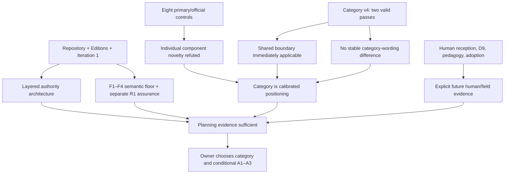

# RES — TFW-55: External Challenge, Semantic Floor & Canonical Positioning

> **Date**: 2026-08-13
> **Author**: Codex Researcher
> **Status**: 🔬 RES — Iteration 2 complete; sufficient for planning
> **Parent HL**: [HL-TFW-55](../../HL-TFW-55__canonization_program.md)
> **Mode**: Pipeline / focused

---

## Research Context

Iteration 2 tested whether Iteration 1's self-canon architecture, identity candidates, selected trace floor, terminology, and two-surface exposition survive adjacent-practice comparison and independent bounded critique. Eight primary/official controls show that every major component already exists elsewhere and that mandatory composition does not itself elevate a framework into a methodology or discipline. The repository and Editions support a layered authority architecture and a proportional continuity floor more strongly than they support any category word. One valid two-pass model family found the shared F1–F4 boundary immediately applicable but found no stable difference among discipline, methodology, framework, quiet methodology, and explicit hierarchy wordings. Further model instrumentation was terminated when its duration and opacity exceeded likely decision value. The result is sufficient for planning with human/field questions explicitly deferred, not silently answered.

## Briefing

The complete scope, predecessor decisions, evidence limits, guiding questions, and coordinator answers are in [1_briefing.md](1_briefing.md). C1/C3/C4/C9 entered unranked, C4 remained the full-strength low-assumption control, primary/official adjacent sources remained mandatory, and isolated Codex runs were authorized only as independent model-based bounded critiques. The founder was not used as an answer key; human reception, preference, adoption, durable learning, retention, transfer, and causal superiority were outside the evidence claim. No HL, TS, README, Edition, task-board, configuration, or code file was edited.

## Decisions

| # | Decision | Rationale |
|---|---|---|
| D1 | Retain the layered self-canon architecture: **corpus = history/evidence; canonical essay = selected stable meaning; living specification = current mechanics**. | Corpus preservation and current selection are different functions. The architecture resolves them without adding a manifest or new canon surface. It remains conditional because real outsider maintenance/citation use was not tested; the actual rewrite must state precedence explicitly. |
| D2 | Reject component novelty as a basis for TFW's identity. | ADRs, docs-as-code, PROV-O, NIST AI RMF, distributed cognition, knowledge externalization, role-specific documentation, and Scrum cover the individual components or close controls. Their overlap does not refute a consequential composition, but it refutes a new-category argument built from component ownership. |
| D3 | Retain the positive semantic floor **F1 purpose/authority, F2 bounded delegation, F3 selected durable material trace plus result/current state, F4 authoritative result/continuation**; keep proportional assurance R1 separate. | Provenance, raw transcripts, or governance alone omit purpose, selected result, or continuation. Universal evidence/review/knowledge gates overfit Full. Sources/findings/rejections are recorded when material; a simple Light case need not invent alternatives. |
| D4 | Treat category as calibrated positioning, not an externally discovered taxonomy. | Official sources label different governed objects and supply no universal decision rule for `framework`, `methodology`, `discipline`, `approach`, `theory`, or `ontology`. Scrum proves that a framework may have essential composition and exclusions. |
| D5 | Keep C1/C3/C4/C9/C10 evidence-viable; eliminate none from the category probe. C4 remains the lowest-assumption description. | Category v4 produced perfect immediate boundary application and zero drift for every candidate in both passes. A pass-1 ambiguity difference disappeared in pass 2 and is unstable, not comparative evidence. Discipline, methodology, and hierarchy therefore carry additional positioning burden without research-demonstrated advantage. |
| D6 | Do not introduce a new authority surface. Require explicit claim-type precedence in the rewrite. | The layered selector is logically determinate for stable meaning, mechanics, and history. A separate manifest adds maintenance cost without demonstrated necessity. Since the authority family was deliberately not run, H1 remains conditional rather than proven by model application. |
| D7 | Preserve subtraction-first two-surface architecture, but do not canonize one learning route as superior. | Root doorway + canonical essay + outward mechanics/history remains coherent and avoids root overload. Diátaxis supports distinct information needs, not a unique TFW sequence. Light → Assisted → Full remains a bounded example/progression hypothesis, not demonstrated learning efficacy. |
| D8 | Keep operational capability separate from `self-aware` terminology, and keep human/agent consumption separate from surface topology. | The six-question capability is inspectable; human reception of the label is not. D9 agent routing, human load, and cross-tool robustness were not run and cannot be inferred. No terminology or D9 alternative is selected. |
| D9 | Keep teaching observation, proposed mechanism, immediate artifact, and demonstrated durable outcome as separate states. | Founder-led teaching supports observations and candidate explanations, not delayed retention, transfer, causal superiority, independent facilitation, or universal adoption. H3 remains narrow and H4 mixed. |
| D10 | Stop experimental instrumentation at proportional sufficiency and recommend planning. | Category v4 was the only executed bounded family. Ablation, authority, D9, terminology, and exposition were deliberately not run because their incremental model-based decision value no longer justified duration and opacity. Their absence is neither positive nor negative evidence. A third iteration would simulate empirical questions that this design cannot settle. |

## Open Questions

| # | Question | Status | Answer |
|---|---|---|---|
| Q1 | What primary category should the public definition use? | **Owner/planning decision** | C4 framework-with-philosophical-framing is the lowest-assumption description. Discipline, methodology, and hierarchy are defensible positioning choices only if the owner accepts their extra burden; research did not demonstrate them as facts. |
| Q2 | How must stable meaning, mechanics, and history be cited and updated? | **Resolved for planning; implementation wording open** | State explicitly that the corpus preserves history/evidence, the essay selects stable current meaning, and the living specification governs current mechanics. Do not make “repository” alone the authority selector. |
| Q3 | Should `self-aware project` remain public terminology? | **Future human/owner decision** | The operational capability survives. No human reception evidence exists, and model evidence cannot settle it; A2 remains conditional. |
| Q4 | Which D9 human/agent consumption contract should win? | **Future human/field decision** | No alternative is selected. Human load/comprehension and cross-tool agent robustness require actual use, not another same-model proxy. |
| Q5 | Should Light → Assisted → Full be the canonical explanatory spine? | **Future human/owner decision** | Keep it at most as a bounded example unless future evidence shows a stronger role. Its learning superiority is not demonstrated; A3 remains conditional. |
| Q6 | Is the F1–F4 composition distinctively useful in real non-code adoption? | **Plausible; field evidence deferred** | Synthetic neutral cases and the category probe show coherent applicability, not real adoption. No completed non-code Light/Assisted trace was found. |

## Hypotheses (from HL §10)

| # | Hypothesis | HL Status | RES Status | Evidence |
|---|---|---|---|---|
| H1 | The repository can serve as TFW's primary corpus and govern official exposition through root README + canonical essay + living specification without another canonical surface. | needs-research | 🟡 **conditionally supported** | The layered selector separates history/evidence, stable meaning, and current mechanics without a new surface. Source/logic resolves the contract; actual outsider maintenance and citation use remain untested. The rewrite must make precedence explicit. |
| H2 | TFW has a defensible discipline or methodology identity above its current prompt framework. | needs-research | 🟡 **narrowed / open** | Component novelty is refuted. F1–F4 composition remains plausible and was immediately applicable in one controlled model setting. No stable category-wording difference appeared, and no source supplies a universal taxonomy. A category above framework is not demonstrated by this research design. |
| H3 | Teaching corpora contain missing conceptual knowledge that belongs in the foundation and can be separated from rhetoric, examples, facilitation, and unsupported claims. | needs-research | 🟡 **narrowly supported** | Human authority, bounded delegation, selected continuity, and explicit continuation remain strong conceptual candidates. Teaching observation, mechanism, immediate artifact, and durable outcome retain different destinations; no learning-efficacy evidence was added. |
| H4 | Subtraction-first two-surface exposition plus the Light → Assisted → Full bridge improves comprehension/derivability without weakening agent orientation or canonizing one teaching path. | needs-research | 🟡 **mixed / open** | Two-surface subtraction survives architectural challenge. Human terminology, D9 consumption, staged/branched exposition, and progression superiority were deliberately not tested and remain future human/field questions. |

## HL Update Recommendations

> Iteration 2 is sufficient for planning but does not authorize the Researcher to edit the HL. Free-section refinements below may be applied by the coordinator. Frozen-section choices remain conditional owner decisions; none meets the evidence threshold for an amendment proposal automatically.

### Refinements — free sections, coordinator applies

| # | § | What to update | Source |
|---|---|---|---|
| R1 | §10 | Record final research statuses: H1 conditionally supported; H2 narrowed/open with category above framework not demonstrated; H3 narrowly supported; H4 mixed/open. State that minimum iteration count is met and research is sufficient for planning. | Challenge C5; Decisions D1–D10 |
| R2 | §8 / §10 | Record the accepted evidence boundary: component novelty is refuted; F1–F4 composition is plausible/applicable; category choice is calibrated positioning; category v4 is bounded model evidence only; later families were deliberately not run and supply no evidence. | Gather G1–G6; Extract E1–E8; Challenge C4–C5 |
| R3 | §11 | Carry explicit planning constraints: state essay/spec/corpus precedence in the rewrite; add no canonical surface without demonstrated need; do not present `self-aware`, D9, Light → Assisted → Full superiority, human comprehension, adoption, or durable learning as research-proven. | Decisions D1, D6–D10 |

### Pending frozen-section owner decisions — not amendment proposals

| # | Target | Conditional decision | Evidence and limitation | Cost | Alternative retained |
|---|---|---|---|---|---|
| A1 | §1 and category language in §§3–7 | The owner may narrow “fundamentally a discipline” to a methodology or framework-with-philosophical-framing, but research does not force the change. | C4 is the lowest-assumption control; category v4 found no stable advantage for discipline/methodology/hierarchy; official sources provide no universal taxonomy. The probe is not human positioning evidence. | May reduce distinctiveness and the intended cognitive-work thesis. | Retain discipline as an explicit positioning choice while avoiding claims that research proved the category. |
| A2 | §3 self-awareness/essay contract, DoD 4, Principle 5 | The owner may retain, qualify, or retire `self-aware` while preserving the six-question operational capability. | Capability is observable; no human terminology test ran, and model ambiguity cannot substitute for human reaction. | Retiring it loses a memorable bridge; retaining it risks anthropomorphic reading. | Keep the term with a precise non-sentience/non-authority limit. |
| A3 | §3 essay item 8, DoD 8/16, Principle 8 | The owner may retain Light → Assisted → Full as a bounded example, not a proven universal learning spine. | Editions show proportional assurance; no staged/branched human comparison or durable-learning evidence exists. | Narrowing weakens the planned adoption narrative; retaining it as doctrine overclaims pedagogy. | Route the progression to usage/teaching surfaces or present it as one optional path. |

### Amendment Proposals — frozen sections, owner verdict required

**No amendment proposals.** A1–A3 remain conditional owner/planning choices or future-test candidates. None is evidence-mature automatically.

## Fact Candidates

**No fact candidates.** Human direction in this iteration concerned evidence policy, decision thresholds, and research proportionality rather than a new stable factual claim about project architecture or implementation.

## Strategic Insights (Research)

| # | Category | Insight | Source | Confidence |
|---|---|---|---|---|
| SS1 | positioning | When adjacent official sources supply no shared taxonomy, the category word is a calibrated positioning decision. Architecture, exclusions, and consequences can be researched; the final noun still carries an owner-chosen burden. | User, Briefing/Extract/Challenge gates | ★★★ |
| SS2 | quality | A usable boundary does not prove a category above framework. Scrum is the decisive counter-control: mandatory composition and explicit exclusions can coexist with a framework identity. | User, H2 loss-rule correction and Challenge steering | ★★★ |
| SS3 | process | Research itself must remain proportional. Once instrumentation duration and opacity exceed likely decision value, explicit uncertainty is better than another technically elaborate proxy that cannot settle the decision. | Owner/coordinator, Challenge closure | ★★★ |
| SS4 | evidence | Model-based bounded critiques may test immediate rule application, but they cannot become human reception, pedagogy, adoption, preference, or durable-learning evidence. Missing human evidence should be deferred, not simulated. | User, Briefing and Challenge closure | ★★★ |
| SS5 | governance | Evidence viability and frozen-HL compatibility are separate verdicts. A lower-assumption explanation may fit evidence better while still requiring an owner amendment decision; frozen text cannot eliminate it automatically. | User, Iteration-1 and Iteration-2 gates | ★★★ |
| SS6 | education | Teaching observation, proposed mechanism, immediate artifact, and demonstrated durable outcome are different claim states and must remain routed separately in the canonization work. | User, Gather/Extract direction | ★★★ |

## Findings Map

## Iteration Status

- **Iteration:** 2 of 2 (min) / 3 (max)
- **Hypotheses tested:** H1 (conditionally supported), H2 (narrowed/open), H3 (narrowly supported), H4 (mixed/open)
- **Hypotheses deferred:** Human reception of terminology; human and cross-tool D9 behavior; staged/branched exposition; real non-code adoption; durable learning/retention/transfer; external-author maintenance over time. These are explicitly outside what the completed research design can prove and do not justify a synthetic Iteration 3.
- **Gaps discovered:** No completed non-code Light/Assisted adoption trace; no human terminology/comprehension evidence; no field D9 comparison; no longitudinal external-author authority test. All are accepted empirical deferrals.
- **Superseded decisions:** Iteration-1 D10's research block on planning is superseded because the two mandatory iterations are complete and remaining gaps are empirical/owner choices. Extract's plan to run six model families is superseded by the coordinator's proportionality stop after the valid category family.

### Open Threads (for planning or future field evidence)

| # | Thread | Why it matters | Suggested focus |
|---|---|---|---|
| 1 | Primary category and A1 | Frozen prose currently leans discipline while evidence does not demonstrate a category above framework | Decide explicitly in `/tfw-plan`; use C4 as the low-assumption baseline and document any stronger positioning burden |
| 2 | Exact authority precedence wording | H1 is conditional until the public rewrite makes stable meaning, mechanics, and history distinguishable | Specify concise essay/spec/corpus precedence and citation/update behavior; add no new surface |
| 3 | `self-aware`, D9, and exposition choices | These affect reception and consumption but are not settled by source logic or same-model probes | Treat as owner design choices now; run future human/cross-tool field work only if a concrete high-value decision requires it |
| 4 | Real non-code adoption | Synthetic cases establish coherence, not observed generalization | Collect a natural Light/Assisted non-code trace if such work occurs; do not manufacture a case for canonization |

### Recommendation

- [x] **SUFFICIENT** — proceed to `/tfw-plan` to classify the recommendations, make the explicit owner positioning choices, and write/revise TS
- [ ] **MORE NEEDED**
- [ ] **BLOCKED**

> ⚠️ Coordinator decides whether to continue or proceed. Researcher recommends but does NOT decide.

## Conclusion

Iteration 2 replaced an attractive but underdetermined identity debate with a planning-grade evidence boundary. Adjacent primary sources refute novelty of TFW's components and show that mandatory composition does not determine category; cross-Edition logic and the valid category probe support a selected continuity floor and layered self-canon more strongly than discipline, methodology, hierarchy, or any public term. C4 is the lowest-assumption description, not a model-declared winner, while stronger category words remain owner positioning choices. The most important negative result is methodological: model instrumentation cannot settle human reception, pedagogy, adoption, or learning, and pursuing it further became disproportionate. Research is therefore sufficient for planning precisely because it preserves those uncertainties instead of fabricating answers. Self-critique: authority, terminology, D9, ablation, and exposition model families were not run, and no real non-code adoption sample exists; the RES marks these as deliberate limitations rather than evidence.

---

*RES — TFW-55: External Challenge, Semantic Floor & Canonical Positioning | 2026-08-13*
