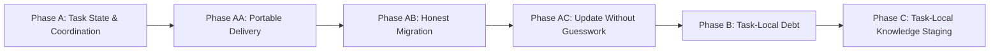

# HL — TFW-60: Conflict-Resistant Shared Workspace

> **Date**: 2026-08-19
> **Author**: Codex (Coordinator)
> **Status**: ✅ DONE — closed by the owner 2026-08-30 after Phase AC; A, AA, AB, AC delivered; B and C dropped by A8; `2.0.0` follows
> **Contract**: 🔒 FROZEN — approved by owner 2026-08-26
> **Frozen**: §1 · §3 · §4 · §5 · §6 · §7 — locked on owner approval
> **Free**: §2 · §7.2 · §8 · §9 · §10 · §11 — research updates these directly
> **Append-only**: §12 Amendment Log — the only channel for changing a frozen section
> **Baseline**: freeze commits — recovery form in `conventions.md` §3 rule 15

> **Project North Star**: `README.md` opening and § How It Works · `.tfw/README.md`
> [`NS1 — Purpose`](../../.tfw/README.md#ns1) · [`NS2 — Principles`](../../.tfw/README.md#ns2) ·
> [`NS3 — Non-goals`](../../.tfw/README.md#ns3)

> **Knowledge Gate**: passed — 1 task since sequence 58, below the configured interval of 5.
> **Origin**: owner report, 2026-08-19. The concrete mechanisms proposed in that report are hypotheses;
> the binding subject of this HL is the collaboration pain they are meant to remove.

---

## 1. Vision 🔒 FROZEN

A TFW workspace lets several humans and agents work on different tasks at the same time without their
normal work converging on the same files. Work on one task changes files owned by that task, not
project-root registries also being edited by every other task. When several roles work inside one task,
ownership and a durable task record make the handoffs visible without requiring chat history.

Collaboration transport is a declared project mode, not a property every project carries at once. A Git
project keeps branches, merges and commit provenance, and loses its shared root registries. A file-sync
project — Google Drive, OneDrive, Dropbox or an equivalent — reaches the same result through ordinary
files and takes versioning from the provider. The two modes share one task model: identical lifecycle,
ownership, journal and discovery semantics. One synchronized folder is never asked to carry a shared Git
working tree, because Git does not support that configuration. *(Amendment A2, 2026-08-26.)*

**Impact:** A team stops scheduling work around `README.md`, `TECH_DEBT.md` and `KNOWLEDGE.md`. Two tasks
can advance independently, synchronize as disjoint files, and still produce a discoverable project view.
The owner can see what is active, what value it serves, who coordinated it, what debt it left, and what
knowledge is ready for consolidation without reopening multiple chats.

> “We put the same folder in file sync, people and agents worked on different tasks, and nobody had to
> resolve a root-file conflict before the actual work could continue.”

## 2. Current State (As-Is) 🟢 FREE

### 2.1 Measured shared write surfaces

Measured in the repository on 2026-08-19 and refreshed by Phase A research iteration 2 on 2026-08-26.

| Surface | Current size/state | Who writes it | Collaboration failure |
|---|---:|---|---|
| `README.md` Task Board | 60 task rows; 39 rows have 8 cells and 21 have 9 while the header declares 8 columns; 60 rows + 51 task directories = 111 source occurrences resolving to 60 logical tasks | Plan, research, handoff, review and init paths update or create rows; resume, release and docs generation read the same table | Independent tasks repeatedly edit one table. Its schema already drifts (TD-177), and the docs parser regex-reads the early columns as an implicit API (TD-81). Exact migration accounting finds 51 matched and 9 board-only tasks |
| `TECH_DEBT.md` | 86 rows · 60 not closed · 8,430 words | Every review appends; `/tfw-docs` reads and may update | Debt from unrelated tasks converges on one manually maintained registry; simultaneous reviews contend even when their product files are disjoint |
| `KNOWLEDGE.md` | 222 lines · 9,359 words | `/tfw-docs` updates §§1–3; `/tfw-knowledge` updates §4 and topic files | Knowledge is intentionally consolidated, but multiple completing tasks can reach the same consolidation surface at once |
| Git index | One index per working tree | Every role may commit the work it owns (process F26) | Two task sessions sharing one index already produced a misattributed commit; a verbal warning succeeded 0 times out of 1 (risk F1) |

### 2.2 The conflict is structural, not a Markdown formatting defect

```text
Task A ─┬─ status transition ───────────────┐
        ├─ review debt ────────────────┐    │
        └─ knowledge completion ───┐   │    │
                                   ▼   ▼    ▼
                              KNOWLEDGE  TECH_DEBT  README
                                   ▲   ▲    ▲
Task B ─┬─ status transition ──────┘   │    │
        ├─ review debt ────────────────┘    │
        └─ task registration/closure ───────┘
```

Reducing columns lowers the amount of conflicting text but leaves the same fan-in. Moving a task folder
between `todo/`, `in-progress/` and `done/` makes state structural, but also changes every relative path
and asks a sync engine to move a directory while other participants may be writing inside it. Putting
live state inside the HL gives a frequently changing operational concern to an artifact that may not
exist yet and later becomes a strategic contract.

These are viable research alternatives, not accepted solutions.

### 2.3 Two concurrency cases need different controls

| Case | Example | Present gap |
|---|---|---|
| Different tasks | Human works on TFW-61 while two agents execute TFW-62 and TFW-63 | All three still edit root registries, so task separation does not produce file separation |
| Same task | Coordinator, researcher, executor and reviewer operate through separate sessions | Role artifacts separate most output, but there is no durable coordinator journal and no complete single-writer ownership map for shared task files |

TFW-54 currently addresses session-level delegation and cross-session Git trace integrity. Its draft
deliberately removed the dispatch journal after an earlier owner ruling. The owner reversed that ruling
on 2026-08-19 because a task-local collaboration substrate now gives the record a useful home. TFW-60
owns that substrate; TFW-54 will consume it rather than invent a second one.

### 2.4 Why existing successes do not solve this

| Existing mechanism | What it proves | What it does not solve |
|---|---|---|
| Filesystem-as-state-machine (D31, D50) | File and folder existence can carry process state without a service | Current task status is still maintained in the root Task Board |
| Task folders | Most artifacts are already local | Status, project debt and consolidated knowledge remain shared write surfaces |
| Role-specific artifacts | Research, execution and review outputs have separate files | Coordinator actions and cross-role handoffs have no durable task-local record |
| Commit attribution (D55) | Git can identify declared agent/task/scope/role | File-sync collaboration must remain coherent before and outside a commit; one shared index can still mix tasks |
| Knowledge ownership split (D37) | `/tfw-docs` and `/tfw-knowledge` no longer write the same KNOWLEDGE sections | Separate tasks can still invoke the same owner workflow concurrently |

## 3. Target State (To-Be) 🔒 FROZEN

### 3.1 Result Visualization

The exact filenames and aggregation mechanism remain research decisions. The finished ownership shape is
fixed: live task state and work-in-progress knowledge stay with the task; project views are low-churn or
derived and never become a second authoritative copy.

```text
SYNCHRONIZED PROJECT ROOT
│
├── README.md
│   └── project guide + rebuildable/low-churn task catalogue
│       (identity · goal · value · terminal outcome; no live pipeline churn)
│
└── tasks/
    ├── TFW-61__task-a/
    │   ├── [A] task control
    │   │       live state · ownership · coordinator event journal
    │   ├── role-owned artifacts
    │   │       HL · RES · TS · ONB · RF · REVIEW · evidence
    │   ├── [B] debt captured by this task
    │   └── [C] knowledge awaiting consolidation
    │
    ├── TFW-62__task-b/          ← different files, may advance in parallel
    │   ├── [A] task control
    │   ├── role-owned artifacts
    │   ├── [B] task debt
    │   └── [C] staged knowledge
    │
    └── TFW-63__task-c/          ← different files, may advance in parallel

CONTROLLED PROJECT VIEWS
├── task catalogue       ← reconstructed from task-local truth or updated by one owner
├── debt view            ← consolidated/discovered without becoming the capture surface
└── knowledge index      ← updated only at an explicit consolidation boundary
```

| Phase | What the team can do after the phase ships | Independent release value |
|---|---|---|
| A — Task State & Coordination | Advance different tasks without editing root README on every transition; coordinate multiple roles through one task-local, coordinator-owned record | Removes the highest-frequency shared write and establishes the concurrency contract used by later phases |
| B — Task-Local Debt | Complete reviews on different tasks without appending to one root debt registry | Removes the second shared write surface while keeping debt visible and actionable |
| C — Task-Local Knowledge Staging | Finish different tasks without racing on central knowledge files; consolidate deliberately after task work | Completes the task-local collaboration model and preserves knowledge compounding |

Six months after release, a team can inspect any synchronized task folder and answer four questions
without a chat: what state is it in, who/what acted, what debt remains, and what knowledge is waiting.
The project-level views answer the portfolio questions without being edited by every workflow transition.

### 3.2 Value Flow

```text
PAIN
many tasks write the same roots
        │
        ▼
TASK LOCALITY
each task owns live state, journal, debt and staged knowledge
        │ value: unrelated work becomes disjoint file edits
        ▼
ROLE OWNERSHIP
each mutable file has one normal writer; delegates write their own artifacts
        │ value: same-task parallelism has explicit handoff boundaries
        ▼
FILE SYNCHRONIZATION
Drive / OneDrive / Dropbox transports ordinary files; stable paths do not move with status
        │ value: collaboration does not require a merge specialist
        ▼
CONTROLLED CONSOLIDATION
one declared boundary rebuilds project task, debt and knowledge views
        │ value: discoverability and compounding survive locality
        ▼
GIT PROVENANCE
explicit task-owned paths are committed and released with attribution
        │ value: history stays auditable without serving as the conflict-control mechanism
        ▼
OUTCOME
humans and agents work concurrently without corrupting each other's traces
```

| Step | Input | Transformation | Value created |
|---|---|---|---|
| Declare | Task goal, value, roles | Create stable task-local control and ownership boundary | Every participant knows where mutable truth lives |
| Work | Role-owned artifacts | Write only inside the relevant stable task path | Different tasks synchronize without a common edit |
| Coordinate | Role outputs and handoffs | Coordinator appends significant events and advances task-local state | Progress and delegation survive chat/session loss |
| Close work | Review observations and fact candidates | Capture debt and knowledge beside their source trace | No information is lost to avoid a root-file conflict |
| Consolidate | Completed task-local records | Rebuild/update project views through one declared owner and checkpoint | Portfolio visibility without many concurrent writers |
| Commit/release | Task-owned changes and consolidation result | Stage explicit paths and attribute commits | Git preserves provenance without mixing tasks |

## 4. Phases 🔒 FROZEN

Each phase is a vertical, independently releasable slice. A phase includes the canonical rules,
templates, all workflows that exercise the changed behaviour, supported adapter propagation, migration
guidance, verification and evidence for its own outcome. Adapter synchronization and documentation are
not deferred to a final “cleanup” phase.

### Phase Dependencies



| Phase | Depends on | Shared files | Can run in parallel with |
|---|---|---|---|
| A | Independent | `README.md`, conventions, status configuration, lifecycle workflows, adapters, documentation compiler | — |
| **AA** | A released | payload boundary, `update.md`, `init.md`, conventions, the two scripts, `team/` delivery | — |
| **AC** | AB released | `update.md`, `plan.md`, `init.md` and their copies, `CHANGELOG.md`, `RELEASE.md`, identifier text in conventions and glossary, the two scripts and their tests, `migrations/2.0.0.md`, `templates/status.md`, `templates/journal/event.md`, `templates/team/profile.md`, adapter templates | — |
| B | A released | conventions, review/docs/resume flows, adapters, compiler; may remove/replace root `TECH_DEBT.md` | — |
| C | B released | conventions, knowledge/docs/plan flows, adapters, compiler; `KNOWLEDGE.md`, `knowledge/`, knowledge state | — |

Sequential execution is deliberate: each phase changes the ownership model consumed by the next, and
all three touch canonical workflow and adapter surfaces. Parallel implementation would reproduce the
shared-file problem inside the task designed to remove it.

### Phase A: Task State & Coordination 🔴

> **Requires:** Independent.
>
> **Shared files with Phases B/C:** canonical conventions, glossary, project configuration, lifecycle
> workflows, adapter copies and documentation compilation surfaces.
>
> **Context for coordinator:** 1. this HL §§2–7 · 2. `.tfw/conventions.md` §§3–5, §7, §13–15 ·
> 3. `.tfw/workflows/init.md` · `.tfw/workflows/plan.md` · `.tfw/workflows/research/base.md` ·
> `.tfw/workflows/handoff.md` · `.tfw/workflows/review.md` · `.tfw/workflows/resume.md` ·
> `.tfw/workflows/release.md` ·
> 4. `knowledge/risk.md` F1 · 5. `knowledge/convention.md` F22 · 6. TFW-54 HL §§2–3, §7, §10–11 ·
> 7. TD-81, TD-144, TD-175, TD-177 and TD-178.
>
> **Key decisions:** D31 — filesystem state machine · D50 — locality and stable containers · D55 —
> commit attribution · D59 — capability boundaries · D65 — traces survive rejection.
>
> **Cascade dependency:** status is referenced by every lifecycle workflow, config/template registries,
> adapters, resume logic, release checks and documentation generation. A source-only edit is not a
> releasable Phase A.
>
> **Declared outcome:** normal lifecycle transitions and coordinator events are task-local, stable-path,
> single-writer operations. Independent tasks do not need to edit the root README to make progress.

**Deliverables:**

1. A tested concurrency and ownership contract for different-task and same-task work.
2. One task-local carrier for live lifecycle state, goal/value metadata needed for discovery, role/file
   ownership, and an append-only coordinator event journal. Exact name and format follow research.
3. A root task catalogue that is low-churn or rebuildable and is explicitly non-authoritative for live
   pipeline state.
4. Stable task paths across all lifecycle states; no move of an active task directory merely to express
   status unless research proves the reference and synchronization risks false.
5. Lifecycle, resume and rejection behaviour updated across canonical workflows and supported adapters.
6. ~~File-sync operating rules that require no vendor API or always-on service.~~ *(Dropped by A3 —
   moved to the mode task. Phase A ships the mode-agnostic core.)*
7. ~~Git coexistence rules: task-owned explicit-path staging, no shared-index ambiguity, current freeze and
   attribution guarantees retained.~~ *(Dropped by A3 — moved to the mode task.)*
8. A lossless migration path for existing task folders and Task Board history.
9. Deterministic documentation/task discovery updated for the new source of task metadata.
10. Evidence from concurrent different-task and same-task scenarios, including an actual synchronized
    folder environment when available and a reproducible fixture for the repository.
11. A releasable framework increment whose Quick Start and supported adapters describe the shipped model.

### Phase AA: Portable Delivery 🔴

> **Requires:** Phase A released, and its [FIELD-REPORT](FIELD-REPORT__TFW-60__first_external_update.md)
> read through the Pre-TS Gate. Added by amendment A4.
>
> **Declared outcome:** a project other than this one completes the update from the payload alone. Every
> executable deliverable, every required directory and every instruction the release gives is either
> inside the payload or names something the receiving project already has.
>
> **Why it is a phase and not a fix:** Phase A's outcome was *task-local state and coordination*, and that
> outcome is met. Delivering it to a project that is not this one is a different capability, was never
> claimed, and was never tested — all four review rounds ran against this repository, where the tooling
> already exists. The gap is structural, not a defect in A.
>
> **Cascade dependency:** the payload boundary decides what `/tfw-update` can carry. Moving the two
> scripts changes their own path constants, the tests, `conventions.md`, `init.md` and the CHANGELOG's
> migration prose; a source-only move is not a releasable AA.

**Deliverables:**

1. Every executable deliverable inside the payload, referenced by its payload path, with the project-root
   resolution no longer depending on directory depth.
2. `team/` delivered rather than assumed: a template in the payload and an explicit step that creates the
   acting profile before the first durable write.
3. A migration guide per major version, routed to from the update path. A major release without one is
   incomplete.
4. Migration that finds a board wherever a project keeps it, and reads a committed revision by default.
5. Legacy identifiers outside the assumed grammar routed to `unresolved`, never described as something
   the source never said.
6. Hand-authored carriers that a person can get right: a quoted example, and a validator that names the
   key it rejected.
7. A post-update self-check that answers *is this project consistent with this release* without the
   reader knowing which framework test to run.
8. Evidence from **at least one external project** completing the update with no hand-carried file and no
   `.tfw/` edit. This repository is not admissible as the only fixture.

### Phase AB: Honest Migration 🔴

> **Requires:** Phase AA released and its RF/REVIEW read through the Pre-TS Gate.
>
> **Added by amendment A5**, 2026-08-29, after the third external update.
>
> **Context for coordinator:** 1. [third field report](FIELD-REPORT__TFW-60__third_external_update.md) ·
> 2. Phase AA RF and REVIEW revision 3 · 3. this HL §5 DoD 10 and DoD 18 · 4. `.tfw/scripts/` and their
> tests · 5. `.tfw/migrations/2.0.0.md` · 6. `conventions.md` §4 identifier grammar.
>
> **Key decisions:** D31 — filesystem state machine · D55 — commit attribution · D65 — traces survive
> rejection.
>
> **Declared outcome:** the migration tools refuse what they cannot parse whole and compute every
> guarantee they print. A single task identifier grammar carries the project, the moment and the subject.

**Deliverables:**

1. An identifier that is parsed whole or refused. A cell the grammar cannot read completely is a
   malformed row, never a prefix match; two rows resolving to one identifier is a hard stop.
2. Every invariant the manifest asserts is computed by the manifest, under a heading that says which
   guarantees were checked.
3. One identifier grammar for new tasks — `{PREFIX}_{YYYYMMDD-HHMMSS}_{ABBR}` — with the abbreviation
   declared and approved at planning, never derived silently. Legacy and `2.0.0-dirty` forms stay
   readable and are never renamed.
4. Markdown markup is stripped from migrated prose; identifier characters are not.
5. Framework self-tests and receiving-corpus tests are separable, so `build.test` cannot be red merely
   because a migration is in progress.
6. A quiescence rule for the update **source**, not only the receiver.
7. Provenance drift is distinguished from customization in the update path.
8. Checks state a reachable condition; a check that can never print zero is rewritten or bounded.

### Phase AC: Update Without Guesswork 🔴

> **Requires:** Phase AB released and its RF/REVIEW read through the Pre-TS Gate.
>
> **Added by amendment A6**, 2026-08-30, after the fourth and fifth external updates.
>
> **Context for coordinator:** 1. the [fourth](FIELD-REPORT__TFW-60__fourth_external_update.md) and
> [fifth](FIELD-REPORT__TFW-60__fifth_external_update.md) field reports · 2. Phase AB RF and REVIEW
> revision 2 · 3. this HL §5 DoD 10, DoD 11 and DoD 19 · 4. `.tfw/workflows/update.md` ·
> 5. `.tfw/scripts/migrate_board.py`, `gen_index.py` and their tests · 6. `.tfw/migrations/2.0.0.md` ·
> 7. `.tfw/CHANGELOG.md` and `RELEASE.md` · 8. `conventions.md` §4 Identifier, Which handle a machine
> acts as, Artifact file naming · 9. TD-190, TD-191, TD-198, TD-200, TD-201, TD-203 and TD-204.
>
> **Key decisions:** D31 — filesystem state machine · D55 — commit attribution · D69 — one grammar with
> the owner in the loop.
>
> **Why it is a phase and not a fix:** Phases AA and AB each met their declared outcome and were measured
> on real projects. Reports four and five find the residue of both: instructions that cannot be executed
> as written against the source a receiver has, decisions the update takes for the owner, a status cell
> still parsed by its first token, and a payload copy that can overwrite the receiver's own configuration.
> None reopens an approved phase; together they are one release surface.
>
> **Declared outcome:** an update neither guesses nor decides for the owner. The pin is derived from the
> named tag; the owner is asked before the first durable write and briefed in their own language after
> the last; the migration refuses a status it cannot read whole and names every phase it left without
> state; the payload copy cannot overwrite project-owned files; every instruction the path gives can be
> executed as written by a receiver on any earlier tag of the line. A task abbreviation is the initials
> of a title a person can read.

**Deliverables:**

1. The source pin is written from the target, not from `HEAD`: the operator names the tag, the pinned
   commit is derived from it, and `VERSION` is read from that commit and compared with the tag's name. A
   source whose development has moved past its release remains a valid source.
2. A receiver on any earlier tag finds its path. Each release's updating section names or points to
   every intervening entry, and `RELEASE.md` makes that a rule; when a release reverses a normative
   statement, the CHANGELOG quotes the retired wording verbatim as a search string (TD-198); the
   CHANGELOG's own dead references are corrected (TD-190, TD-191). The first instruction of `update.md`
   is to read the **target's** `update.md` and follow it, so an installed workflow never drives a newer
   update.
3. The retired-vocabulary allowlist admits text whose purpose is to retire the term, so the gate can be
   literally green on a correct project.
4. Every Step 6 row is executable the same way: a marker-bounded block for content merged into a
   project-owned file — Claude rules gain the markers Codex already has — and a whole copy for the rest;
   the table says which is which. The Antigravity rule template stops requiring a substitution its
   rendering does not use (TD-204).
5. `installed_from` has one declared form — the configured upstream reference and the verified tag —
   and never a machine-local path.
6. The owner is asked, not guessed. Before the first durable write the update stops for the acting
   handle (never inferred from a Git identity), the task containers and the `build.*` commands — in AG
   mode, as one message before that write. After verification the update ends with a briefing in the
   project's content language, built from the CHANGELOG's Added, Changed, Fixed and Removed sections:
   what is now possible, what you now do differently, what stopped breaking, what no longer has to be
   done. *(Changed added by A7.)*
7. The payload copy has declared exclusions: `project_config.yaml` and `knowledge_state.yaml` are never
   overwritten, and the step that copies says what it skipped. Whether the payload stops carrying the
   state file at all is a TS decision.
8. The status cell is parsed whole or refused, on the identifier's own rule: more than one lifecycle
   token → `UNDECLARED` with `lifecycle_verbatim`, listed under its own manifest heading and never
   terminal by its first token. The manifest names every phase directory of a migrated task and states
   that phase state is not written by migration; `--check tasks` reports phase directories that carry
   no state file; `templates/status.md` carries the phase paragraph. This closes Phase AB's declared
   outcome for the one cell it did not reach.
9. The abbreviation is the acronym of the approved title. The coordinator proposes the full title and
   its initials in one exchange, the owner approves both, and the HL header carries them side by side.
   *Never derived silently* means never without approval, not never from the title. Artifact file naming
   under the current grammar is stated with an example (TD-201).
10. Payload carriers agree with the canon and with each other: the event template describes `via` as
    the conventions do (TD-200); the team profile template stops contradicting itself about agents and
    says where a participant's role is recorded (TD-203); the migration guide names one manifest
    location, says when `--working-tree` is the right choice, and gives every command from the project
    root.
11. The phase ships as the next `2.0.0-dirty` tag and is exercised by at least one consumer already on
    the line. `2.0.0` stays unclaimed until the owner rules otherwise.

### Phase B: Task-Local Debt 🟡 — ~~dropped by A8~~

> **Dropped by amendment A8, owner ruling 2026-08-30.** Not executed in this task and not carried forward
> by it. If the capability is ever wanted, a new task under the current grammar cites this section.

> **Requires:** Phase A released and its RF/REVIEW read through the Pre-TS Gate.
>
> **Shared files with Phase C:** conventions, docs/knowledge orchestration, adapters and compilation.
>
> **Context for coordinator:** 1. Phase A RF and REVIEW · 2. this HL §§2.1, 3, 5–7 ·
> 3. `.tfw/workflows/review.md` Step 5 and Step 6 · 4. `.tfw/workflows/docs.md` ·
> 5. `.tfw/workflows/resume.md` debt section · 6. `TECH_DEBT.md` and TFW-57 proposal ·
> 7. `knowledge/constraint.md` F3 (no filler debt).
>
> **Key decisions:** D37 — exclusive write territories · D53 — mandatory physical evidence because
> optional storage was used 0 of 38 times · D65 — rejected traces stay visible.
>
> **Cascade dependency:** review captures debt, docs maintains it, resume consumes it, release checks it,
> and compilation exposes it. Changing capture without all consumers creates invisible debt.
>
> **Declared outcome:** reviews capture debt beside the task that discovered it; project-wide debt remains
> discoverable and triageable without every review appending to one root file.

**Deliverables:**

1. A task-local debt source with provenance back to RF/REVIEW and stable identifiers.
2. One normal writer per debt record and a defined handoff from review to later consolidation/closure.
3. A project-wide debt view or query path that does not become the concurrent capture surface.
4. Clear states for open, accepted, superseded and closed debt without erasing historical rows.
5. Updated review, docs, resume and release behaviour across canonical and adapter surfaces.
6. Migration of existing debt with no loss of IDs, sources, closure reasons or cross-references.
7. Evidence from two reviews completing concurrently on different tasks.
8. A releasable framework increment; Phase C is not required to use task-local debt safely.

### Phase C: Task-Local Knowledge Staging 🟢 — ~~dropped by A8~~

> **Dropped by amendment A8, owner ruling 2026-08-30.** Same standing as Phase B.

> **Requires:** Phase B released and its RF/REVIEW read through the Pre-TS Gate.
>
> **Context for coordinator:** 1. Phase B RF and REVIEW · 2. this HL §§2.1, 3, 5–7 ·
> 3. KNOWLEDGE D22, D37, D43 and D47 · 4. `.tfw/workflows/knowledge.md` ·
> 5. `.tfw/workflows/docs.md` · 6. `.tfw/knowledge_state.yaml` and knowledge configuration ·
> 7. `knowledge/philosophy.md` F2, F8, F11 and F21.
>
> **Key decisions:** D22 — candidates require consolidation · D37 — technical reference and strategic
> knowledge have exclusive owners · D43 — citation cascade · D47 — framework/config/state separation.
>
> **Cascade dependency:** planning reads Project Values; research, execution and review produce candidates;
> docs and knowledge workflows consolidate different knowledge classes; resume and compilation expose
> the result. Task-local staging must preserve that full loop.
>
> **Declared outcome:** concurrent tasks stage knowledge locally and only a controlled consolidation
> boundary writes project knowledge, while future planning still receives verified, current Project Values.

**Deliverables:**

1. A task-local staging contract for fact candidates, decisions and other knowledge outputs already
   produced by HL/RES/RF/REVIEW, avoiding duplicate manual transcription where possible.
2. A single-owner consolidation boundary with an observable queue/state and crash-safe resumption.
3. Conflict behaviour for two tasks becoming consolidation-ready at the same time.
4. Preservation of the D37 ownership split between `/tfw-docs` and `/tfw-knowledge`.
5. Project knowledge views that remain compact, cited and useful to the next coordinator.
6. Migration and compatibility for existing `KNOWLEDGE.md`, `knowledge/*.md` and knowledge state.
7. Updated planning/knowledge/docs/resume behaviour, supported adapters and documentation compilation.
8. Evidence from concurrent task completion followed by deterministic consolidation.
9. A releasable framework increment that completes the shared-workspace model.

## 5. Definition of Done (DoD) 🔒 FROZEN

- ✅ 1. Two humans or agents can advance two different tasks through normal TFW stages in one synchronized
  project tree without both needing to edit the same file before consolidation.
- ✅ 2. Same-task parallel roles have explicit file ownership, and every mutable coordination file has one
  normal writer.
- ✅ 3. A task-local coordinator journal records material dispatch, handoff, state change, blockage,
  amendment escalation and consolidation events without storing per-message chat transcripts.
- ✅ 4. Task paths remain stable from creation through DONE or REJECTED; task status is not encoded by
  moving the active task directory.
- ✅ 5. The root README is not authoritative for live pipeline state and is not changed on every lifecycle
  transition. Task identity, goal, value and terminal outcome remain human-discoverable at project level.
- ~~6. Review debt is captured task-locally, retains stable provenance and remains project-discoverable
  without concurrent review writes to a root registry.~~ *(Dropped by A8 with Phase B.)*
- ~~7. Knowledge generated by a task remains local until an explicit, single-owner consolidation boundary;
  the next task still receives verified Project Values.~~ *(Dropped by A8 with Phase C.)*
- ✅ 8. In file-sync mode the operating model works through ordinary file synchronization. No mode requires
  a vendor API, a database, a lock server or an always-on coordinator process. *(Scoped by A2.)*
- ✅ 9. In Git mode, freeze baselines, commit attribution, explicit task ownership and release history
  continue to work, and Git is not the only mechanism preventing shared-file corruption. File-sync mode
  takes versioning from the provider and does not require Git. *(Scoped by A2.)*
- ✅ 10. Existing tasks, debt IDs, knowledge citations, rejected traces and historical links migrate without
  deletion or silent reassignment.
- ✅ 11. Filesystem inspection is sufficient to resume: no chat history, cloud-provider UI or hidden local
  database is required to determine the task's last durable state.
- ✅ 12. Project views are rebuildable or single-owner outputs and cannot silently override divergent
  task-local truth.
- ✅ 13. Each phase passes its own full lifecycle and can be released and used without waiting for a later
  phase to synchronize adapters, documentation or migration instructions.
- ✅ 14. Phase A evidence covers at least: two different tasks in parallel, two roles in one task, and a
  durable task record that survives session loss. Mode-specific evidence — offline edit and reconnect for
  file sync, commit attribution for Git — belongs to the mode task. *(Scoped by A2.)*
- ~~15. Phase B evidence covers two concurrent reviews; Phase C evidence covers two tasks becoming
  consolidation-ready concurrently.~~ *(Dropped by A8.)*
- ✅ 16. Scope-budget accounting is explicit before every TS. Any phase above a configured limit is split or
  receives a separate, evidenced owner ruling; deterministic byte copies are not silently excluded.
- ~~17. TFW-54 is re-planned against the shipped Phase A journal/ownership substrate, and TFW-57 is
  sequenced after TFW-60 rather than redesigning obsolete root artifacts.~~ *(Dropped by A8: the legacy
  `PREFIX-N` corpus is frozen by owner ruling 2026-08-30; neither task is touched again.)*
- ✅ 18. A task identifier is allocated without reading a project-wide maximum. Two participants who
  create a task while offline from each other cannot produce two directories carrying the same ID, and
  no participant has to consult a shared counter to learn which identifier is free. *(Added by amendment
  A1, approved 2026-08-26.)*
- ✅ 19. An external project completes the update to a released version **from the payload alone** — no
  file hand-carried from this repository, no edit inside `.tfw/`, and every instruction the release gives
  names something the receiving project actually has. *(Added by amendment A4, approved 2026-08-27.)*
- ✅ 20. A migration tool refuses input it cannot parse whole rather than matching a prefix and discarding
  the remainder; it computes every invariant it asserts and names which guarantees were checked; and it
  preserves identifier characters in migrated prose while stripping only markup. *(Added by amendment A5,
  approved 2026-08-29.)*

## 6. Definition of Failure (DoF) 🔒 FROZEN

- ❌ 1. A normal status transition, review or task completion still requires every task to edit a common
  root registry.
- ❌ 2. The design merely relocates the hot spot: multiple roles are expected to write the same task-local
  control, debt or knowledge file concurrently.
- ❌ 3. Task status is implemented by moving an active task folder and existing references can break or a
  sync engine can observe a partial move.
- ❌ 4. A project catalogue, debt view or knowledge index becomes a second authoritative copy whose value
  may disagree with task-local truth.
- ❌ 5. Correctness requires a cloud vendor API, a database, a daemon, a Git merge driver or an online lock
  service.
- ❌ 6. Git provenance is weakened, shared-index contamination remains unbounded, or broad staging is the
  documented collaboration path.
- ❌ 7. Removing a root registry makes tasks, debt or knowledge practically undiscoverable to a human
  browsing the synchronized folder.
- ❌ 8. Migration rewrites historical task artifacts, renumbers debt, deletes rejected traces or changes
  stable task paths without a compatibility layer.
- ❌ 9. The coordinator journal becomes a message transcript, surveillance log or unbounded duplicate of
  RES/RF/REVIEW content.
- ❌ 10. A phase is called releasable while canonical sources, supported adapters, docs generation or
  migration guidance still describe the prior ownership model.
- ❌ 11. Suggested mechanisms from the initiating conversation are treated as requirements without testing
  them against the collaboration pains and failure scenarios.
- ❌ 12. A phase crosses a configured scope budget without an explicit owner ruling based on an exact file,
  new-file and LOC count.

**On failure:** stop the affected phase and return to `/tfw-plan`. Preserve all task-local traces. For a
frozen outcome change, file a §12 amendment with evidence, cost and an alternative; do not patch around
the failed ownership model in a later phase.

## 7. Principles 🔒 FROZEN

1. **Pain before mechanism.** Team conflicts, lost coordination and shared-write contention define the
   problem. README columns, status folders, HL state and new artifacts are alternatives to test.
2. **Task locality is the unit of concurrency.** Work that belongs to one task changes that task's files
   during normal operation.
3. **One normal writer per mutable file.** Parallelism comes from disjoint ownership, not from hoping a
   sync engine merges Markdown correctly.
4. **Stable paths over status moves.** Identity and references outlive lifecycle state.
5. **Local truth, derived views.** A project view helps discovery; it never outranks the task-local source
   from which it can be rebuilt.
6. **Filesystem first, Git preserved.** Ordinary files carry coordination and survive provider changes;
   Git carries provenance, baselines and releases without being the only consistency mechanism.
7. **The coordinator logs management, roles log work.** The journal records dispatch and durable state
   changes; RES, RF, REVIEW and evidence remain the detailed work traces.
8. **Consolidation is a boundary, not a side effect.** Debt and knowledge move from local capture to
   project visibility through an explicit owner and checkpoint.
9. **No trace deletion during simplification.** Locality must improve collaboration without erasing the
   reasoning TFW exists to preserve.
10. **Every phase pays for its release surface.** Canonical rules, workflows, adapters, migration,
    documentation and evidence ship together for that capability.

### 7.1 Quality Contract 🔒 FROZEN

- Each Phase TS maps every applicable principle above to a verifiable AC.
- Every mutable artifact names its normal writer, readers, transition authority and consolidation owner.
- Every aggregate declares whether it is authoritative, derived, cached or historical. “Index” alone is
  not a classification.
- File-sync claims require at least one real synchronized-folder observation plus deterministic local
  fixtures for repeatability. A provider screenshot alone is insufficient.
- Concurrency evidence records both final content and conflict artefacts: duplicate/conflicted copies,
  partial moves, stale views, Git status and attribution.
- No provider brand appears in the normative mechanism; provider names are evidence environments.
- No new artifact is admitted without showing which existing responsibility it owns and which duplicate
  write it removes.
- A corrective pass may not grow the artifact it corrects; reasoning moves to RF/knowledge, not into
  repeated rule prose.
- Exact file and LOC budgets are measured before each TS. Adapter propagation is counted and never hidden
  behind “mechanical copy.”

### 7.2 Knowledge Citations 🟢 FREE

| # | Source | Item | How it applies |
|---|---|---|---|
| 1 | PV 0 — [`README.md`](../../README.md) opening and § How It Works | An authorized person or agent resumes from shared traces; reviewed and verified knowledge can compound | The redesign may change carriers but must preserve bounded resumability and compounding |
| 2 | PV 0 — [`.tfw/README.md`](../../.tfw/README.md) [`NS1 — Purpose`](../../.tfw/README.md#ns1) and [`NS2 — Principles`](../../.tfw/README.md#ns2), especially principles 3 and 5 | Selected durable Trace and authorized continuation protect purpose and resumability without promising lossless context | Task locality must make the trace more collaborative, not thinner |
| 3 | PV 1 — [`.tfw/README.md` § Methodology values](../../.tfw/README.md#methodology-values) | Structural Enforcement: important gates live in observable structure or state, not prose alone | Single-writer ownership and file locality must be visible in the filesystem |
| 4 | PV 1 — [`.tfw/README.md` § Methodology values](../../.tfw/README.md#methodology-values) and [§ Where truth belongs](../../.tfw/README.md#where-truth-belongs) | One authoritative owner per truth type, not one monolithic file | Task-local truth and project views require an explicit authority boundary |
| 5 | PV 1 — [`.tfw/README.md` § Methodology values](../../.tfw/README.md#methodology-values) and [§ Success Criteria](../../.tfw/README.md#success-criteria) | Portability keeps durable context provider-independent; authorized resumption and verified knowledge compounding are observable outcomes | The mechanism uses ordinary files and no provider API while preserving resumption and compounding |
| 6 | PV 2 — [`knowledge/philosophy.md`](../../knowledge/philosophy.md) F4 | Structural file/folder gates beat procedural state tables | Research must test a filesystem-native control rather than add checkboxes only |
| 7 | PV 2 — same F11 | TFW Markdown already is the knowledge graph; avoid extra entities | A new control/debt carrier must remove a responsibility elsewhere, not duplicate it |
| 8 | PV 2 — same F27 | Observable file-by-file progress is stakeholder value | Task-local state and journal should make synchronized progress inspectable |
| 9 | PV 2 — same F34 | A vague request must lead through discovery to a usable result | The owner's file suggestions remain hypotheses while the pain receives a complete design |
| 10 | PV 2 — same F38 | Coordinator attention is finite | Three vertical phases keep one collaboration problem in focus and release value incrementally |
| 11 | PV 3 — [`KNOWLEDGE.md`](../../KNOWLEDGE.md) D31 and D50 | Filesystem state and locality | Foundation for stable task-local control |
| 12 | PV 3 — same D37 | Exclusive knowledge write territories | Phase C must preserve `/tfw-docs` versus `/tfw-knowledge` ownership |
| 13 | PV 3 — same D43 | Knowledge citation cascade | Local staging may not break planning inputs or reviewer verification |
| 14 | PV 3 — same D55 and D59 | Commit attribution; capability claims keep boundaries apart | File sync and Git have distinct promises; a session is not an independent person |
| 15 | PV 3 — same D65 | Reverting a result never reverts its trace | Migration keeps rejected and historical task records |
| 16 | PV 4 — [`.tfw/conventions.md`](../../.tfw/conventions.md) §§3–5 | Artifact contracts, task folders and lifecycle states | Phase A changes the state carrier without weakening the lifecycle |
| 17 | PV 4 — same §13 and §14 | Trace discipline and whole-tree restore failure | Simplification cannot delete or silently roll back task visibility |
| 18 | PV 5 — [`knowledge/convention.md`](../../knowledge/convention.md) F22 | Root Task Board update is a process artifact | Confirms the board is not executor product output and may be redesigned as a project view |
| 19 | PV 6 — [`knowledge/process.md`](../../knowledge/process.md) F7 and F30 | Cross-session context is lost; capture without enforcement changes nothing | The journal needs a durable carrier, an owner and workflow write sites |
| 20 | PV 7 — [`knowledge/risk.md`](../../knowledge/risk.md) F1 | Two sessions share one Git index; verbal staging warning succeeded 0/1 | Phase A must structurally bound staging and landing ownership |
| 21 | PV 7 — [`knowledge/constraint.md`](../../knowledge/constraint.md) F1 and F3 | Shared personal state is unsafe; templates can generate filler | Task journals record project work only; debt/knowledge retain quality filters |
| 22 | RES 1 — [YAML 1.2.2](https://yaml.org/spec/1.2.2/) | Mapping keys are unique; a restricted subset can be validated deterministically | `status.yaml` is viable only with a closed schema, unique keys and fail-closed parsing |
| 23 | RES 1 — [RFC 8259](https://www.rfc-editor.org/rfc/rfc8259) | Duplicate JSON object names have unpredictable receiver behaviour | A JSONL journal still needs a duplicate-aware strict reader; extension alone is not safety |
| 24 | RES 1 — [Git](https://git-scm.com/docs/git), [git-rev-parse](https://git-scm.com/docs/git-rev-parse), [git-add](https://git-scm.com/docs/git-add) | Git exposes exact repository/worktree/index paths and path-scoped staging semantics | Local metadata preflight and exact staged-path allowlists address different Git failures |
| 25 | RES 1 — [Google Drive troubleshooting](https://support.google.com/drive/answer/2565956?hl=en) | Unsynced changes can require recovery and Lost & Found handling | Normative rules cannot assume ordered propagation or a portable lock |
| 26 | RES 1 — [OneDrive sync troubleshooting](https://learn.microsoft.com/en-us/troubleshoot/sharepoint/sync/troubleshoot-sync-issues) | Sync conflicts and resynchronization require explicit recovery | Conflict copies must be preserved and reconciled, not resolved by latest timestamp |
| 27 | RES 1 — [Dropbox conflicted copies](https://help.dropbox.com/organize/conflicted-copy) | Simultaneous or offline edits create named conflicted copies | One writer reduces collision frequency but does not create distributed mutual exclusion |
| 28 | RES 1 — [`open-gsd/gsd-pi`](https://github.com/open-gsd/gsd-pi), [BMAD](https://github.com/bmad-code-org/BMAD-METHOD), [Hermes](https://github.com/NousResearch/hermes-agent), [Spec Kit](https://github.com/github/spec-kit), [OpenSpec](https://github.com/Fission-AI/OpenSpec) | Current systems separate authority, projections and bounded coordination in different ways; database/lock guarantees are often single-host | External mechanisms are comparison and counter-evidence, not guarantees imported into the file-only contract |
| 29 | RES 2 — [git-interpret-trailers](https://git-scm.com/docs/git-interpret-trailers), [git-log](https://git-scm.com/docs/git-log), [git-merge-base](https://git-scm.com/docs/git-merge-base) | Git exposes structured attribution and reachability relative to a selected ref | L3 derives landing completion from exactly one reachable commit matching the pre-landing manifest without rewriting task authority |

## 8. Dependencies 🟢 FREE

| Dependency | Status |
|---|---|
| Owner confirmation that file synchronization is a required operating environment and Git remains required | ✅ Confirmed 2026-08-19 |
| Owner reversal of the prior TFW-54 no-journal ruling | ✅ Confirmed 2026-08-19 |
| [TFW-54](../TFW-54__agent_team_mode/HL-TFW-54__agent_team_mode.md) | ⬜ Must be re-planned after Phase A; its current DRAFT says “artifact is the dispatch record — no journal” |
| [TFW-57](../TFW-57__artifact_growth_control/PROPOSAL__TFW-57__artifact_growth_control.md) | ⬜ Sequenced after TFW-60; it should measure the post-locality artifacts, not optimize roots being removed/reclassified |
| Documentation compiler Task Board parser (TD-81) and malformed board schema (TD-177) | ⬜ Phase A input, not a separate prerequisite |
| Cross-session Git ownership defects TD-144 and TD-178 | ⬜ Phase A input; shared-index mitigation must compose with TFW-54 |
| Phase A research iteration 1 architecture pass | ✅ Complete — [RES 1](research/iter1/RES.md); C1-R survived, C2–C5 and G-C were eliminated |
| Phase A research iteration 2 independent challenge | ✅ Complete — [RES 2](research/iter2/RES.md); C1-R2 sufficient, no iteration 3 recommended |
| Exact adapter propagation and phase budget census | ✅ Owner ruled 2026-08-26 that Phase A may exceed the configured budget. The ruling is valid only on exact counts (DoF 12), so the Phase A TS carries the census; copies are excluded per S32 |
| Genuine non-technical-human discovery/edit observation | ⬜ Moved to [TFW-61](../TFW-61__collaboration_transport_modes/PROPOSAL__TFW-61__collaboration_transport_modes.md) — a non-technical participant appears in file-sync mode, which TFW-61 owns. Phase A keeps the *design* requirement that the carriers be readable by a non-specialist and explicitly does not claim that readability was observed |
| Real file-sync provider/client environment | ⬜ Moved to [TFW-61](../TFW-61__collaboration_transport_modes/PROPOSAL__TFW-61__collaboration_transport_modes.md) by amendment A3; deterministic fixtures still do not substitute there |
| Transport rules, support matrix and landing behaviour | ⬜ Moved to [TFW-61](../TFW-61__collaboration_transport_modes/PROPOSAL__TFW-61__collaboration_transport_modes.md) by amendment A3. G-A/G-B and L3 are superseded inputs there, not Phase A obligations |
| Copy-based compatibility migration, including populated Assisted inputs | ⬜ Mandatory Phase A migration evidence; unresolved inputs stay visible and non-actionable |
| Evidence-backed journal entry ceiling | ⬜ Phase A TS obligation: one measured finite ceiling on entry length (S30). Segment count and byte limits are void — the segmented journal was removed |

## 9. Risks 🟢 FREE

| Risk | Probability | Impact | Mitigation |
|---|---|---|---|
| A root hot spot is merely renamed as one task-control hot spot | High | High | One normal writer; delegates produce role artifacts and coordinator alone changes control/journal |
| Human discoverability falls when the root board stops carrying live state | High | High | Keep a permanent low-churn router and persisted derived `tasks/INDEX.md`; re-read task-local authority before acting; test the no-command human path |
| File-sync providers differ on conflict copies, atomic rename and offline reconnect | High | High | Normative design assumes only ordinary independent-file sync; require real provider/client offline-reconnect and conflict-copy RF evidence in addition to deterministic fixtures |
| Git metadata or index is synchronized unsafely between machines | Medium | High | Keep Git administration local, use one landing owner, fail closed on wrong worktree/index, and require exact staged-path allowlists |
| Derived project views become stale, malformed or absent and are mistaken for truth | High | Medium | Label authority/freshness/source set; preserve a deterministic rebuild; make resume/release scan validated task controls; expose degraded human discovery visibly |
| Task-local debt becomes invisible and never repaid | Medium | High | Stable IDs, project discovery view, release/resume gates, migration evidence |
| Task-local knowledge never reaches Project Values | Medium | High | Observable consolidation-ready state, single owner, knowledge gate and crash-safe resume |
| Coordinator journal duplicates detailed artifacts and grows without bound | Medium | Medium | Closed reference-first event grammar, one writer, immutable retained segments, bounded active read and measured rollover limits |
| Existing paths and documentation references break during migration | Medium | High | Stable task directories, compatibility resolver, corpus-wide link tests, no history rewrite |
| Adapter propagation pushes Phase A above configured scope budgets | High | Medium | Exact census before TS; split propagation only if each slice remains genuinely releasable, otherwise seek explicit owner override |
| TFW-54 and TFW-57 continue from obsolete premises | Medium | High | Make sequencing explicit in board/artifacts; re-plan TFW-54 after A and TFW-57 after C |
| An on-demand-only catalogue saves conflicts but destroys zero-command portfolio discovery | High | High | Iteration 1 rejected the strongest H1 form; test the permanent-router + persisted-derived-index hybrid with fresh readers and malformed/stale cases |
| A short machine-readable carrier is parseable but a non-specialist cannot read or repair it | High | Medium | Keep the field set small, closed and bounded; state legality before action. Observation of a real non-technical participant moves to [TFW-61](../TFW-61__collaboration_transport_modes/PROPOSAL__TFW-61__collaboration_transport_modes.md); until then Phase A asserts readability as intent and does not claim it as verified |
| A coordinator journal becomes the next README: an unbounded place to write “useful context” | High | High | Separate journal from HL, define an event grammar, references instead of copied narratives, size/retention gate and one writer |
| Stale offline writes survive a coordinator/state-owner change | High | High | Carry `owner_epoch`, predeclare recovery authority, preserve divergent copies and reconcile through a new referenced event; never choose by timestamp |
| L3 finds zero, duplicate, unreachable or scope/identity-mismatched commits | Medium | High | Preserve a pre-landing manifest; derive completion only from exactly one reachable exact match on a pinned ref; never choose newest or write completion back to task authority |
| Optional G-A targets a wrong but internally consistent repository or corrupt pin profile | Medium | High | Keep G-B baseline; G-A compares canonical observations to separately pinned local Git-dir/worktree/index/ref/remote and supported capabilities, failing before staging |
| Legacy tasks are normalized by moving paths or inventing missing facts | Medium | High | Freeze existing roots, use compatibility resolvers, migrate verified facts only and report every malformed/nonstandard task |
| Unresolved migration inputs are hidden or accidentally acted on | Medium | High | Account every row/directory exactly once; keep `legacy-unresolved` and `malformed` visible but non-actionable with stable diagnostics |
| Splitting file-sync and Git behaviour by edition creates two incompatible task models | Medium | High | Share lifecycle, ownership/epoch and event semantics; vary only edition artifact profiles, transport and Git participation |

## 10. RESEARCH Case 🟢 FREE

### Phase A Research Boundary

The first research cycle covers Phase A only: task discovery, live status, coordinator journal, file
ownership, file synchronization, Git coexistence and edition topology. Phase B debt storage and Phase C
knowledge staging receive their own research after the preceding phase has shipped and its RF has passed
the Pre-TS Gate. This prevents a broad “future filesystem” study from diluting the immediate conflict.

### Blind Spots

- Does a persistent Task Board create more value than conflict, or can a standard command assemble the
  same view from task-local sources when a human or agent asks for it?
- Which task facts must be visible to a cold-start agent before it selects a task: ID, goal, value, live
  status, owner, dependencies, last event, or something smaller?
- Which status carrier is least error-prone and least inviting to prose growth: one marker file named by
  state, a strict `status.yaml`, a bounded `STATUS.md`, or another structural form?
- Can a non-technical person understand and safely change the chosen status carrier through ordinary file
  browsing while agents can parse it deterministically?
- What belongs in the coordinator journal rather than HL, RES, RF or REVIEW, and what event/size/retention
  rules prevent it from becoming another permanently expanding README?
- What do current spec-driven systems — including GSD / Get Shit Done, BMAD, Hermes and comparable active
  projects — use for task indexes, status, planning memory, progress logs and handoffs? Which mechanisms
  survived real multi-agent use rather than appearing only in documentation?
- Which AFD README template/rule successfully constrained growth, and can its negative boundary be turned
  into a structural limit rather than another paragraph saying “do not write much”?
- What minimum guarantees are common to Google Drive, OneDrive, Dropbox and plain shared folders for
  independent file edits, same-file edits, offline reconnect, conflict copies and directory moves?
- What Git topology preserves local commits and one coherent history when task files travel through file
  sync? In particular, must `.git` remain local while only the working files synchronize?
- Should Assisted own the file-sync-first human workflow while Full remains Git-first but removes shared
  hot spots, or can one task-state contract serve both without duplicating the methodology?

### Hypotheses

| # | Hypothesis | Status |
|---|---|---|
| H1 | A persistent Task Board is not required: a standard on-demand command can assemble task ID, goal, value, live status and terminal outcome from task-local sources without degrading cold-start agent planning or human discovery | final: refuted as stated; hybrid confirmed — permanent router + persisted derived index + authoritative task re-read |
| H2 | A tiny machine-readable task-local status carrier — marker files or a strictly bounded YAML schema — is safer than a mutable Markdown status page and remains understandable to non-technical users through normal file browsing | final: partially confirmed — strict nine-field YAML application profile is structurally supported; non-technical-human usability remains mandatory acceptance evidence |
| H3 | A separate coordinator-owned append-only journal with a closed event vocabulary, artifact references and a size/retention rule preserves cross-session management context without duplicating HL/RES/RF/REVIEW or becoming a new writing surface | final: confirmed at architecture level; acceptance evidence required — event-first recovery and combined finite rollover survived, but provider runtime/integration/defaults remain open |
| H4 | Assisted and Full can share one task-local state/journal contract while differing only in collaboration transport and Git requirements; separate task models per edition are unnecessary | final: confirmed at semantic-contract level; migration evidence required — shared meanings survive, carriers/transport/Git remain edition profiles |
| H5 | No executable code is required. A strict skill invoked by a slash command, plus a carrier grammar that needs no ID allocation, no cross-file transaction and no chain verification, produces homogeneous records without a deterministic state engine. Refuted only by a concrete failure scenario that executable code alone closes | needs-research — iteration 3 |
| H6 | The declared Phase A outcome is reached by removing and reclassifying existing artifacts rather than adding `status.yaml`, `journal/`, two JSON schemas, `task_state.md`, `workflows/status.md`, a state engine, `people/` and a machine-local TFW home. The baseline is the smallest repository change that stops two tasks colliding in root `README.md` | needs-research — iteration 3 |
| H7 | The set of things that must live outside the synchronized project folder is smaller than the Phase A draft claims, and part of that draft rests on untested folklore rather than observation — starting with the claim that a synchronized `.git` breaks | needs-research — iteration 3 |
| H8 | Session-start participant recognition, private-device binding and multi-person transparency are reached through the existing Assisted `people/<handle>.md` model plus a minimal addition, without a Phase A identity subsystem. Whether a device registry is needed at all is part of the hypothesis, not a premise | needs-research — iteration 3 |

> **Filter applied:** each hypothesis changes the architecture if false. The need to log coordinator events
> is no longer a hypothesis; the owner decided it. Whether the journal is separate, its grammar and its
> retention remain open. Debt and knowledge hypotheses are deliberately deferred to Phases B and C.
>
> **H5–H8 filter:** these four target mechanisms introduced *after* iteration 2 closed — the deterministic
> state engine (S24, S27) and the participant/device subsystem (S28, S29). Neither was examined by any
> completed iteration. Their default verdict in iteration 3 is removal: under §7.1 a retained mechanism
> must name the existing responsibility it absorbs and the duplicate write it removes.

### Research Result

[RES iteration 1](research/iter1/RES.md) selected C1-R after eliminating bounded Markdown, markers,
event-derived state, combined status/history and a dual-transport Git exchange. [RES iteration
2](research/iter2/RES.md) attacked that architecture with a 100-task corpus, strict-parser and recovery
fixtures, context-free agents, temporary Git repositories and an exact live-corpus census. It refined
the survivor to **C1-R2**:

- a permanent root router and persisted, disposable `tasks/INDEX.md` for portfolio discovery;
- strict task-local `status.yaml` authority with nine universal fields, state-dependent conditionals
  and closed edition profiles;
- numbered immutable reference-first journal segments, one writer/epoch, event-first recovery and
  finite configured count/encoded-byte/summary limits without unsupported defaults;
- L3 pre-landing handoff/manifest plus exactly one reachable exact Git commit, G-B baseline and optional
  fully pinned G-A for Full;
- an exact-accounting compatibility resolver that preserves paths and keeps unresolved/malformed tasks
  visible but non-actionable.

Iteration 2 closed the C1-R2 architecture as **sufficient**, and that verdict stands for everything the
two iterations actually examined. Real non-technical-human usability, actual provider offline/reconnect
recovery, L3 workflow integration, the Git support matrix, copy-based migration including populated
Assisted inputs and evidence-backed numerical defaults remain mandatory Phase-A TS/RF evidence.

**Research is reopened for iteration 3** by coordinator decision on 2026-08-26, above `min_iterations`.
The reason is not new doubt about C1-R2. It is that the Phase A draft written after iteration 2 closed
made two mechanisms mandatory that no iteration examined:

| Mechanism | Entered through | Occurrences across all ten iteration-1 and iteration-2 files |
|---|---|---:|
| Deterministic local state engine and the agent-only `tfw-status` skill | S24, S27 — owner, Phase A HL review, 2026-08-26 | 0 |
| Participant profiles, machine-local TFW home and device instance identity | S28, S29 — owner, Phase A HL review, 2026-08-26 | 0 |

Iteration 3 is a subtraction pass against those two additions, carrying H5–H8. It gains one evidence
source the earlier iterations lacked: the shipped Assisted v1.4 starter running in a live Google Drive
folder with no `.git` present, allocating task identifiers from timestamps rather than from a counter and
resolving participant identity through prompt discipline and a private-device binding, with no engine.
That starter supplies the PR-class and Git-topology observations iteration 2 recorded as *not observed*;
non-technical-human observation remains outstanding.

### Risks of Not Researching

Skipping research would choose between two equally plausible failures. Keeping README preserves the
project map that already helped this coordinator discover TFW-54 and TFW-57, but keeps the shared writer.
Removing it may eliminate conflicts and leave a cold-start agent unable to discover goals and dependencies.
A Markdown status/journal may repeat README growth; a YAML or marker format may exclude the humans this
phase is meant to help. A single cross-edition design may overburden Assisted, while separate models may
split TFW into incompatible methods. These trade-offs need repository evidence, external comparison and
concurrency trials, not preference alone.

### Proposed RESEARCH Focus

1. **Gather — internal:** Build a read/write/ownership map for the Task Board and every Phase A lifecycle
   consumer. Reconstruct TD-81, TD-144, TD-175, TD-177 and TD-178. Inspect the AFD README constraint and
   measure what agents currently learn from the root board during cold start.
2. **Gather — external:** Use current primary repositories/documentation to compare GSD / Get Shit Done,
   BMAD, Hermes and at least three other active spec-driven or agent-workflow systems. Record exact task
   index, status, log, ownership and archival carriers; distinguish shipped behaviour from claims.
3. **Extract:** Build the configuration space across: catalogue materialization (persistent / generated /
   hybrid), status carrier (marker / YAML / bounded Markdown), journal topology and grammar, ownership,
   edition split, file-sync guarantees and Git topology.
4. **Challenge:** Test cold-start discovery by a fresh agent and a non-technical human; 100-task and
   long-running-task growth; two different tasks changing state offline; two roles in one task; missing
   board-generation command; conflicted copy; coordinator disappearance; task rejection; and Git landing
   after synchronization.

### Why Not Just...?

- **Why not only simplify the README table?** It reduces conflict size but preserves the shared writer and
  does nothing for debt, knowledge or coordination.
- **Why not delete the Task Board and add a command immediately?** The current board is the standard
  cold-start map. Until a generated view is proven equally discoverable without prior knowledge of the
  command, deletion exchanges merge conflict for navigation failure.
- **Why not use `tasks/todo`, `tasks/in-progress`, `tasks/done`?** It is structurally visible, but changes
  task paths and turns every state transition into a directory move under active synchronization.
- **Why not store live status in the HL?** TODO and standalone research precede an HL; after approval the HL
  is a strategic contract, not the high-frequency operational record.
- **Why not use `STATUS.md`?** It is human-readable, but unconstrained Markdown is precisely the surface
  that repeatedly accumulated explanations. It remains a candidate only with a closed schema and budget.
- **Why not use `status.yaml`?** It is compact and parseable, but “machine-readable” is not proof that a
  non-technical collaborator can inspect, repair or trust it. That must be tested.
- **Why not use status marker files?** They are visually structural, but renames create delete/create
  events under sync and an unconstrained set can produce contradictory simultaneous markers.
- **Why not add a cloud database or Google Drive API?** It trades Markdown portability for a service and
  makes offline/local/Git operation a second implementation.
- **Why not rely on Git branches and merges?** The required baseline is ordinary file synchronization, and
  current evidence shows a shared Git index can misattribute work even before a merge.
- **Why not make Assisted file-sync-only and leave Full unchanged?** It may be the right product split, but
  Full would retain the same shared hot spots and two task models would drift. Research must first test a
  shared state contract with edition-specific transport rules.
- **Why not remove all project-level views?** Task locality without portfolio discovery solves conflicts by
  making work invisible; that violates the resume and knowledge-compounding north star.

## 11. Strategic Insights (Planning) 🟢 FREE

> fact-candidates: processed 2026-08-30

| # | Insight | Category | Source |
|---|---|---|---|
| S1 | The primary pain is team work itself: humans and agents cannot comfortably advance several tasks because unrelated work converges on shared files. **Implication:** success is measured by concurrent scenarios, not by smaller root documents | stakeholder | Owner, 2026-08-19 |
| S2 | The owner's proposed structures are hypotheses, not instructions: “start from the pains; my proposals are only hypotheses.” **Implication:** §7 P1 and DoF 11 prevent solution capture before research | philosophy | Owner, 2026-08-19 |
| S3 | Any ordinary file-sync environment is a required operating condition, with Google Drive as an example; Git is still required. **Implication:** the design must separate synchronization correctness from Git provenance instead of choosing one | environment | Owner, 2026-08-19 |
| S4 | The release order is value order: task list/status first, technical debt second, knowledge last. **Implication:** §4 has three vertical releases and forbids a final adapter/docs cleanup phase that would leave earlier capabilities incomplete | stakeholder | Owner, 2026-08-19 |
| S5 | The owner reversed the prior no-journal ruling because task-local coordination now makes logging meaningful. **Implication:** TFW-60 owns one coordinator journal substrate and TFW-54 consumes it; no second dispatch artifact | process | Owner, 2026-08-19 |
| S6 | Several agents working on several different tasks are a first-class case, not only several roles inside one task. **Implication:** Phase A has separate evidence scenarios for different-task and same-task concurrency | process | Owner, 2026-08-19 |
| S7 | Knowledge should first accumulate inside the task and move at the end. **Implication:** Phase C treats consolidation as a controlled boundary and tests simultaneous readiness | philosophy | Owner, 2026-08-19 |
| S8 | Every phase must release something fully useful. **Implication:** canonical rules, adapters, migration, docs and evidence are inside every phase; horizontal “sync later” work is prohibited | constraint | Owner, 2026-08-19 |
| S9 | A root README carrying only task identity, goal, value and terminal status may be the right low-churn view, but it still has a shared creation/closure writer. **Implication:** research must compare manual single-owner and rebuildable catalogue variants rather than freeze the table prematurely | process | Coordinator inference from owner hypotheses, 2026-08-19 |
| S10 | The owner now questions whether a persistent Task Board belongs in README at all and proposes assembling it only when requested. **Implication:** catalogue materialization becomes H1; the result must be tested against the current board's demonstrated cold-start value | process | Owner, 2026-08-26 |
| S11 | Task status must be knowable without reading HL. Marker files, strict YAML and bounded Markdown are alternatives; avoiding an invitation to write is part of the requirement. **Implication:** H2 evaluates both parsing and non-technical usability, not syntax preference | stakeholder | Owner, 2026-08-26 |
| S12 | A task journal should absorb operational change so HL does not move, but its format must resist the same permanent expansion seen in other project READMEs. **Implication:** H3 requires a closed event vocabulary, one writer, references instead of copied prose and a growth/retention rule | constraint | Owner, 2026-08-26 |
| S13 | The AFD project already uses a dedicated README template with an explicit no-bloat rule. **Implication:** research treats it as field evidence and asks whether its textual prohibition can be made structural | environment | Owner, 2026-08-26 |
| S14 | GSD / Get Shit Done, BMAD, Hermes and the growing family of spec-driven systems are relevant comparisons for logs and state. **Implication:** Phase A research uses current primary sources and compares concrete carriers rather than product narratives | context | Owner, 2026-08-26 |
| S15 | The persistent board has proven value: this coordinator found related tasks immediately and incorporated them into planning. **Implication:** removing it is acceptable only with an official cold-start discovery path that does not depend on the agent already knowing a command | process | Owner, 2026-08-26 |
| S16 | A product split is plausible: Assisted may be optimized for non-technical people using file sync while Full remains Git-oriented but loses chronic conflict points. **Implication:** H4 tests shared contract versus separate task models; the split is not decided in advance | stakeholder | Owner, 2026-08-26 |
| S17 | Authority, projection, journal, file-sync transport and Git landing are separate capabilities. **Implication:** no carrier, lock or Git topology is credited with guarantees owned by another layer | philosophy | [RES 1](research/iter1/RES.md) D3 |
| S18 | Zero-command human discovery refutes an on-demand-only catalogue even when agents can scan task controls. **Implication:** keep a permanent router and persisted derived index, but require every acting consumer to re-read task-local authority | stakeholder | [RES 1](research/iter1/RES.md) D1 and AR2–AR3 |
| S19 | A one-writer rule reduces expected conflict but cannot revoke an old offline writer. **Implication:** ownership needs a monotonic epoch, a predeclared recovery authority and fail-closed branch reconciliation | constraint | [RES 1](research/iter1/RES.md) D6 and AR4–AR6 |
| S20 | Git index isolation and commit provenance are different controls. **Implication:** local administration addresses TD-144; one landing owner plus exact staged-path allowlists and task-scoped commits address TD-178 | process | [RES 1](research/iter1/RES.md) D13–D14 |
| S21 | A pre-landing manifest can survive a rebase while commit eligibility remains pinned to one configured ref. **Implication:** manifest identity correlates intent and scope; Git reachability establishes completion; neither is copied back into task authority | process | [RES 2](research/iter2/RES.md) D8 and AR8 |
| S22 | Lossless migration may legitimately end in `legacy-unresolved` rather than a valid control. **Implication:** exact accounting and visible fail-closed diagnostics are safer than normalization that invents facts or moves paths | constraint | [RES 2](research/iter2/RES.md) D10 and AR11–AR12 |
| S23 | A sync-only participant and a Git-aware release observe different facts without needing different task semantics. **Implication:** filesystem resume may report `landing_requested; completion unknown`, while release derives `landed@SHA` from Git | philosophy | [RES 2](research/iter2/RES.md) D8–D9 |
| S24 | The owner expects status and journal records to be homogeneous and does not accept humans or agents manually allocating event IDs and synchronizing two files from memory. **Implication:** Phase A must ship one deterministic state-transition engine; skills and any MCP are adapters, not independent implementations | constraint | Owner, Phase A HL review, 2026-08-26 |
| S25 | `.gitignore` cannot be assumed to exclude `.git` from Google Drive, while the shared folder must remain usable as an ordinary synchronized tree. **Implication:** the supported root contains no `.git` directory or gitfile; the landing owner's Git directory/index are pinned outside synchronization | environment | Owner, Phase A HL review, 2026-08-26; Google Drive official sync contract |
| S26 | Ignoring `tasks/INDEX.md` in Git would not prevent Drive conflicts and would remove the zero-command portfolio view from a fresh clone. **Implication:** index conflict control is one publisher plus an explicit refresh/landing boundary, not `.gitignore` | process | Owner, Phase A HL review, 2026-08-26 |
| S27 | `tfw-status` is an internal skill for AI agents, not a command a human must learn. Humans express lifecycle intent to the assigned agent; every lifecycle skill routes status/journal mutations through `tfw-status`, which delegates to one deterministic engine. **Implication:** direct AI edits and human-managed IDs are protocol violations, while index generation and Git landing remain separate workflow responsibilities | constraint | Owner, Phase A HL review, 2026-08-26 |
| S28 | The owner wants an agent to know which participant is present at the beginning of a session and to retain that choice on the participant's private computer. **Implication:** Phase A reuses Assisted's shared one-file-per-person profiles but adds one standard machine-local TFW home for device instance, project-to-profile binding, private preferences and Git paths; ambiguous or stale identity asks explicitly and no shared `CURRENT_USER` is created | process | Owner, Phase A HL review, 2026-08-26; Assisted v1.4 `people/README.md`; TFW-52 RES iteration 2 |
| S29 | A list of computers is useful for diagnostics only if it does not become identity or authority. **Implication:** the baseline uses a generated non-secret local device ID and optional derived observed-instance report, not a shared mutable authoritative device registry or hardware fingerprint | constraint | Owner question, Phase A HL review, 2026-08-26; TFW-52 RES iteration 2 attribution boundary |
| S30 | Journal entries need a finite length ceiling checkable by eye. **Implication:** an entry that exceeds it moves its content to an artifact and keeps only a reference; the number is fixed on measurement, and the iteration-1 fixture value of 240 code points carries no privileged status | constraint | Owner, 2026-08-26 |
| S31 | `people/` becomes `team/`: agents belong there too, so the container may not be named for humans only. **Implication:** one profile grammar with an explicit `type` field covering human and agent, rather than a human directory with automation attached at the side | stakeholder | Owner, 2026-08-26 |
| S32 | Byte-identical adapter copies are excluded from scope-budget accounting by explicit owner ruling: a copy is not work, and no agent writes or reads it as a source. Only originals count. **Implication:** DoD 16 forbids *silent* exclusion, and this recorded ruling is what makes the exclusion non-silent; the Phase A floor is measured at roughly 51 originals rather than 98 files | process | Owner, 2026-08-26 |
| S33 | Neither thin reference files nor a build-time generator will replace the adapter copies: references already failed once under D24 when agents stopped following indirection, and a generator reintroduces a script into a framework that has just removed one. **Implication:** duplication stays, and the budget adapts to it instead | constraint | Owner, 2026-08-26 |
| S34 | The session-name gate is withdrawn from Phase A requirements. **Implication:** it existed to enforce one writer on a single appendable journal file; a journal of one file per event removes the contention it guarded, and three of four adapters were never verified able to rename a session. It survives as a convention where the tool supports it, not as a structural control | process | Coordinator, from [RES 3](research/iter3/RES.md), 2026-08-26 |
| S35 | Two mechanisms in the draft stood only on a third: the state engine stood on a monotonic counter, and the single-writer gate stood on one appendable journal file. **Implication:** changing a carrier grammar can retire a whole subsystem, so carrier decisions are ranked before mechanism decisions in the remaining Phase A work | philosophy | Coordinator, from [RES 3](research/iter3/RES.md), 2026-08-26 |
| S36 | The task container becomes a configured relative path, and tasks nest under a creation-year folder from birth. **Implication:** growth is bounded without ever moving a directory — a year folder is an archive that costs no path change, and the newest year sorts last, so the newest task is the last entry of the last folder. Measured growth is ~10 tasks per month, so a year folder holds ~120 entries against ~400 for a flat three-year corpus | process | Owner, 2026-08-26 |
| S37 | The year in a task path is the year of creation and is never updated. **Implication:** a task started in December and closed in February stays in the earlier year folder permanently; this is a prohibition, not a convention, because a tidy-up move would break the links for which legacy renaming was already refused | constraint | Coordinator, 2026-08-26 |
| S38 | Legacy `{prefix}-{seq}` tasks are not renamed, moved or reorganized. **Implication:** 7,051 references across 653 files and 249 commit subjects in immutable history keep resolving; the cost of a clean single sequence is paid in trace integrity, which is the one thing TFW exists to protect | constraint | Owner, 2026-08-26; measured in [RES 3](research/iter3/RES.md) context |
| S39 | A migrating project chooses between a new container and a mixed one, and the choice is one configuration value rather than two branches of the methodology. **Implication:** both grammars must be readable regardless of the choice — A1 already requires that — so the migration guidance describes one setting and not two supported layouts | stakeholder | Owner, 2026-08-26 |
| S40 | This release breaks compatibility and lands as 2.0.0 under the `RELEASE.md` MAJOR rule — status flow changed and a required file removed. **Implication:** users pay a migration cost once, so debt that dies with the Task Board (TD-81, TD-177) is retired in the same release rather than carried across it | process | Owner, 2026-08-26 |
| S41 | `tasks/` needs its own README explaining why a second container exists. **Implication:** without it, two containers become unexplainable within a year; CHANGELOG entry, migration guidance and that README are release surface, not optional polish | stakeholder | Owner, 2026-08-26 |
| S42 | The owner rules that Phase A may exceed the configured scope budget rather than be split. **Implication:** DoF 12 makes the ruling valid only against an exact file, new-file and LOC count, so the Phase A TS carries that census and the ruling is recorded against its numbers; if the census departs materially from the ~51-original estimate the ruling returns to the owner | process | Owner, 2026-08-26 |
| S43 | Non-technical-participant observation belongs to the transport task, because that participant appears in file-sync mode. **Implication:** the *requirement* that carriers be readable by a non-specialist stays in Phase A; the *observation* moves to TFW-61, and Phase A must therefore state readability as design intent and never as a verified property — NS3 forbids untested claims of comprehension | philosophy | Owner, 2026-08-26 |
| S44 | The owner approved the revised Phase A budget of 45 modified / 23 new / 68 total against limits of 30 / 15, on the condition that quality must not suffer. **Implication:** the overrun exists so the scope ships whole, so trimming adapters, migration, docs or evidence to sit near the number inverts the ruling — the TS DoF makes that a hard reject, and needing more files is a reason to return to the owner rather than to deliver less | process | Owner, 2026-08-26 |
| S45 | A status value in the legacy corpus that belongs to no declared vocabulary is carried verbatim as a diagnostic; the vocabulary is left alone and the question is filed as tech debt. **Implication:** migration normalizes nothing, which is what exact accounting requires, and admitting a new status stays a deliberate decision rather than a side effect of a migration script | constraint | Owner, 2026-08-26 |
| S46 | Artifacts of the work itself — ONB, RF, REVIEW and everything under `evidence/` — are not counted as files against a scope budget. **Implication:** they record the work rather than constitute it, so no budget pressure can ever justify producing less evidence; the evidence set is governed by acceptance criteria alone, and the TS DoF hard-rejects thinning it. Generated *product* files stay counted — generated is not the same as incidental | process | Owner, 2026-08-26 |
| S47 | The out-of-vocabulary status decision can wait, and the deferral is free because exactly one task carries the value and that task is deliberately parked. **Implication:** being non-actionable is that task's actual state, so nothing is blocked; had a live task carried an unrecognized status the decision could not have been deferred. The diagnostic must stay visible rather than silent, or the reason it is non-actionable is lost | process | Owner, 2026-08-26; measured on the live board |
| S48 | A review that declares a 100% changed-surface audit still passed evidence item E27 as *"61 rows are retained in the snapshot"* while the file read `Rows captured | 0` and contained the string `TFW-` zero times. **Implication:** the reviewer accepted a claim where a count was available in one command, and the deleted trace was the one thing the framework exists to protect. Verification of a countable fact must be a count; this belongs in the reviewer's habit, not only in the next TS | process | Coordinator, from the Phase A review, 2026-08-26 |
| S49 | The rejected pass shipped one journal event stamped `23:20:00` with round seconds, dated after the review that consumed it and — measured against the clock later the same session — roughly twenty minutes in the future. **Implication:** the timestamp was composed rather than read. An identifier taken from the clock is the load-bearing assumption under both task IDs and event ordering, so a single typed value falsifies the evidence for both; the discipline needs a check, not a convention | constraint | Coordinator, measured 2026-08-26 |
| S50 | Correcting AC-12 by measurement cut it from seventeen files to one: every historical multi-phase task is terminal, and a terminal task receives no state at all. **Implication:** the coordinator's own additions need the same census discipline demanded of the executor — the first draft of AC-12 named six tasks for migration that were never eligible | process | Coordinator, measured 2026-08-26 |
| S51 | A pre-release paid for itself on its first use. One external update found ten findings, one of them a blocker, after four review rounds had found none of them. **Implication:** cutting an unpushed pre-release before claiming a version is not caution, it is the cheapest fixture available — and a release that has never left its own repository has not been tested, only reviewed | process | [FIELD-REPORT](FIELD-REPORT__TFW-60__first_external_update.md), 2026-08-27 |
| S52 | "Every fixture was this repository" is a class of blindness, not a lapse of care. Here the scripts already existed, `team/` already existed, the board sat where the parser looked, and every legacy directory happened to use a double underscore. **Implication:** an external fixture is a different *kind* of test, not a stricter one, and no amount of additional review at home substitutes for it. DoD 19 states it as a rule so it cannot be argued away next time | philosophy | Coordinator, from the same report |
| S53 | Delivery is a capability separate from the thing delivered, and Phase A claimed only the second. Its executable deliverables sat outside the payload boundary because they were placed next to `gen_docs.py` by proximity rather than by ownership, and no criterion ever asked whether the update could carry them. **Implication:** a phase that ships tooling must state where the tooling lives relative to what the framework distributes, or the distribution boundary is decided by whoever creates the file | philosophy | Coordinator, from F1 and F7 |
| S54 | The closed status schema held during a live three-way race: another agent rewrote the consumer's board three times mid-update and `status.md` did not corrupt, because the schema forbids exactly the content that was moving. **Implication:** the protection came from what the carrier refuses to hold, not from locking or ordering — a design argument worth keeping when someone later proposes a roomier carrier | philosophy | [FIELD-REPORT](FIELD-REPORT__TFW-60__first_external_update.md) §3 |
| S55 | Answering a correct catch with the smallest possible fix is itself a defect pattern. Onboarding caught a template filename and the coordinator renamed it; onboarding described a flag-naming trap and the coordinator named the trap in prose. Both were symptoms; the owner's challenge produced the real answers — withdraw the file, merge the flags. **Implication:** the coordinator's own DoF now carries both shapes, so the next instance is caught by rule rather than by the owner noticing | process | Owner challenge, 2026-08-27 |
| S56 | A defect can ship twice while looking tracked. The `/tfw-research` route in three adapter sources names a file that does not exist and has done so across two releases; the field report cited it as `TD-11`, which is the **consumer's** debt identifier — this register begins at TD-33 and never carried it. **Implication:** a defect reported by someone else is not filed here merely by being mentioned, and a citation to a foreign identifier reads as tracked when nothing is | risk | Coordinator, measured 2026-08-27 |

## 12. Amendment Log 🟢 APPEND-ONLY

| # | Date | § | Type | Proposer | Proposed change | Evidence | Cost | Alternatives considered | Verdict |
|---|------|---|------|----------|-----------------|----------|------|------------------------|---------|
| A1 | 2026-08-26 | §5 | `EXTEND` | research iter3 | Add DoD 18: a task identifier is allocated without reading a project-wide maximum, and two mutually offline participants cannot produce two directories with the same ID | `tfw.id_format: "{prefix}-{seq}"` with `initial_seq: 12` while the live corpus reaches TFW-60; `plan.md` Step 4.1 instructs only "read `task_prefix` and `initial_seq`" and never defines how N is derived, so in practice every coordinator performs read-max-then-increment. This is the same operation S24 rejects for event IDs, at the point where a collision costs most — a whole task directory. The draft's state engine does not close it: the engine is scoped to a task root that has already been chosen. Neither earlier iteration raised it; their "zero duplicate identities" census describes history, not concurrency. Phase A could satisfy every other DoD item and still produce two `TFW-61` directories | Phase A grows: identifier grammar, migration compatibility for the existing `{prefix}-{seq}` corpus and collision behaviour all enter scope, in a phase whose subtraction floor is already 51 modified files against a limit of 30 | (1) Leave it to a later task — rejected: the ID is created before any Phase A control file exists, so a later task cannot retrofit safety into folders already made. (2) Keep the counter and add a locking rule — rejected: it reintroduces the shared-read contention TFW-60 exists to remove and needs a lock the file-only floor cannot provide. (3) Assisted's timestamp grammar `YYYYMMDD-HHMMSS__slug` — the leading candidate, shipped and field-tested, but the exact grammar is a TS decision, so the DoD states the property and not the mechanism | `✅ APPROVED — owner, 2026-08-26` |
| A2 | 2026-08-26 | §1, §5 DoD 8/9/14 | `SUPERSEDE` | owner | Collaboration transport becomes a declared project mode chosen at initialization — Git **or** file sync — instead of a workspace that carries both at once. Both modes share one task model; mode-specific behaviour and evidence move out of Phase A | [Git FAQ](https://git-scm.com/docs/gitfaq) states that a cloud syncing service must not sync *any portion* of a Git repository, and separately that a shared working tree is safe **only if used by a single user across all machines**. The draft's G-B is a multi-participant Drive working tree, so it sits outside Git's own support even with `.git` pinned elsewhere. Iteration 3 confirmed the prohibition is primary-sourced, not folklore, and observed Drive writing `desktop.ini` into 18 of 18 directories including dot-directories | Frozen Vision changes — the heaviest amendment class. Git mode never exercises file-sync mode in this repository, so the unused mode can rot the way the Assisted hooks did; a live file-sync project must exercise it before release. A mixed engineer/non-engineer team must choose one mode per project | (1) Keep both simultaneously — rejected: Git documents the configuration as unsupported, and no amount of task-local design makes a shared working tree safe. (2) Drop Git entirely — rejected: this repository ships releases and tags from Git. (3) Drive for the team plus one person exporting to a separate Git clone — a real third arrangement, but it is two folders and a publish step, not a combined mode; deferred | `✅ APPROVED — owner, 2026-08-26` |
| A3 | 2026-08-26 | §4 | `RESTRICT` | coordinator | Drop Phase A deliverables 6 (file-sync operating rules) and 7 (Git coexistence rules). Phase A ships the mode-agnostic core: task-local state, journal, index, team profiles and identifier allocation | Follows directly from A2: rules that differ per mode cannot belong to a phase declared mode-agnostic. Iteration 3 measured the removed surface — G-A/G-B topology matrix, L3 landing protocol with manifest and reachability proof, machine-local Git path profiles — as the second largest block in the draft after the state engine | Phase A no longer proves anything about either transport; the mode task must carry that evidence before either mode is called released. Phase A's declared outcome is unchanged, so DoD 13 releasability still holds for the core | (1) Keep both rule sets in Phase A — rejected: reproduces the budget and scope failure the phase already has. (2) Split Phase A into A1/A2 slices carrying one mode each — rejected: the core would ship twice and the two modes would drift apart, which is exactly what H4 warned against | `✅ APPLIED — no owner verdict required` |
| A4 | 2026-08-27 | §4, §5 | `EXTEND` | owner | Add **Phase AA — Portable Delivery**, executed after Phase A and before Phase B, and add DoD 19: an external project completes the update to this release from the payload alone, without hand-carrying files or editing `.tfw/`. Phase A's declared outcome is unchanged and stays met; AA does not reopen it | The `2.0.0-dirty` pre-release was cut, in its own words, *"so the update path can be exercised against real projects before 2.0.0 is claimed."* The first such exercise — `KZ-IT-telegram-list`, `1.3.0 → 2.0.0-dirty`, recorded in [FIELD-REPORT](FIELD-REPORT__TFW-60__first_external_update.md) — completed only by hand-carrying three things the payload does not contain, and reports the ratio plainly: *"the file copying took minutes; the rest of the session was reconstructing what to do and in what order."* Ten findings, one blocker: `gen_index.py` and `migrate_board.py` are Phase A's own executable deliverables and live outside `.tfw/`, so `/tfw-update` cannot deliver them and the CHANGELOG's migration instructions name a file the reader does not have. `team/README.md` is outside too, and `update.md` never says to create `team/`. Four review rounds passed this because every fixture was this repository, where the scripts already exist, `team/` already exists, the board is already where the parser looks and every legacy directory happens to use a double underscore. An external project is a different class of test, not a stricter one | A fourth pre-release cycle before `2.0.0` can be claimed, and one more external update to prove it. Phase B is delayed by the length of AA. Against that: `2.0.0` cannot honestly be released as-is, since its own migration instructions are unfollowable by anyone who receives it | (1) Fold the findings into Phase B — rejected: B is task-local debt and shares no surface with delivery; the blocker would ship broken for the length of another phase. (2) Reopen and re-execute Phase A — rejected: A's declared outcome is met and was approved on four rounds of evidence; reopening an approved phase to add a capability it never claimed destroys what approval means. (3) A separate task after TFW-60 — rejected: this is TFW-60's own release surface, and DoD 13 already requires each phase to be releasable, which A is not until its tooling can be delivered. (4) Ship `2.0.0` and patch to `2.0.1` — rejected: it was never pushed, so there is nothing to patch and no user to protect from a version bump | `✅ APPROVED — owner, 2026-08-27` |
| A5 | 2026-08-29 | §4, §5 | `EXTEND` | owner | Add **Phase AB — Honest Migration**, executed after Phase AA and before Phase B, and add DoD 20: a migration tool refuses input it cannot parse whole, computes every guarantee it prints, and preserves identifier characters in migrated prose. Phase AA's declared outcome is unchanged and stays met | The [third external update](FIELD-REPORT__TFW-60__third_external_update.md) — `helpdesk`, `0.8.7 → 2.0.0-dirty.3`, the longest jump attempted — confirms Phase AA's purpose is delivered: four releases crossed in one session with *"ни разу не потребовал реконструировать порядок"*. It then found a different class. `migrate_board.py` read `HD-30b` as `HD-30`, discarded the tail, wrote `lifecycle: TODO` onto a task the board had closed and production had shipped, and printed *"every task directory is accounted for exactly once. Unaccounted: 0"* over a table listing one identifier twice. Three levels, three confident false statements, no warning. **This is a DoD 10 violation** — migration *"without deletion or silent reassignment"* — and the arithmetic that detects it exists only in `test_migrate_board.py:454`, which no receiving project is told to run and which goes permanently green once the board is removed. The root is the one the first report already showed in another form: the grammar guesses instead of refusing | A fourth pre-release cycle before `2.0.0`. Against that: `2.0.0` cannot be released while its migration can silently reassign a completed task's state and assert that it did not | (1) Fold into Phase AA — rejected: AA is delivery, proven three times, and merging a correctness capability into it destroys the ability to say delivery is closed. (2) A separate task after TFW-60 — rejected: `2.0.0` would ship with a known DoD 10 violation. (3) Fix `HD-30b` and move on — rejected: it treats the instance and leaves the class, and this class has now appeared twice in three reports | `✅ APPROVED — owner, 2026-08-29` |
| A6 | 2026-08-30 | §4 | `EXTEND` | owner; scope extended by the coordinator after the fifth report | Add **Phase AC — Update Without Guesswork**, executed after Phase AB and before Phase B. No new DoD: the phase closes the residue of DoD 10 (a live task left without state by a first-token match), DoD 11 (phase directories without a state file that no check names) and DoD 19 (instructions no receiver can execute as written), and adds the rule that a task abbreviation is the initials of its approved title. Phase AA's and Phase AB's declared outcomes are unchanged and stay met | Two reports on the `.4` tag. The [fourth](FIELD-REPORT__TFW-60__fourth_external_update.md) — `innoforce-ai-first`, `2.0.0-dirty.2 → .4`, the first update *within* the line — is the first report without a data defect: 27 payload files matched the tag delta exactly, 0 false `CUSTOMIZED`, 0 operator errors caught by a gate, 19 commits from other sessions between the two updates and 0 conflicts — the first field measurement of DoD 1. It found that Step 0's pin `test "$tag_commit" = "$source_head"` **cannot pass** against a source whose `HEAD` has moved past the tag — every live source — so an operator either drops the check or pins `HEAD`, the untagged payload the step exists to prevent; that a project on `.2` has no updating section to follow; that the allowlist rule is literally red on every receiver (second independent report); that the Claude rules row of Step 6 has no markers to execute; and that `installed_from` was written as a Windows drive path into a committed file. The [fifth](FIELD-REPORT__TFW-60__fifth_external_update.md) — `kaznpu-ai-lab`, `1.0.0 → .4`, the first first-migration on the corrected tag, owner absent — found `migrate_board.py` reading `✅ DONE (A/V/B/C) · 🔄 Phase D` by its first token, classing the project's main task terminal and writing nothing, while four phase directories stood without `status.md` and `--check tasks` answered "4 tasks validate"; that `cp -r` of the payload overwrote the receiver's `project_config.yaml` with the framework's own; that the installed 1.0.0 `update.md`, not the target's, drove the update; and that the agent decided containers, handle and `build.*` alone, the handle inferred from a Git identity, which §4 forbids. The owner's words, quoted in that report: *"Я ожидал, что ты меня заонбордишь нормально… спросишь кто, где я хочу хранить задачи. Объяснишь, что поменялось… положительно."* Separately, the coordinator proposed the abbreviation `UPD` for a task with no title: the grammar permits an opaque code, and the owner's intent was the opposite — a readable title, abbreviated | A fifth pre-release tag before `2.0.0`; Phase B waits the length of AC — one phase over roughly twenty-five payload files, two of them scripts. Against that: the owner ruled on 2026-08-30 that `2.0.0` is not ready, superseding the 2026-08-29 ruling that it follows Phase AB without a further run | (1) A separate task — rejected by the owner: the findings are TFW-60's own release surface, and a new task would be created under the abbreviation defect it is meant to fix. (2) Fold into Phase B — rejected: B is debt locality and shares no file with the update path, the same ground as A4. (3) Only the `2.0.0` release pass — rejected: `release.md` edits no workflow or script, so Step 0 and the status parser would ship as they are. (4) Two phases — text in AC, the status parser in an AD — rejected: one release surface, one tag, one external run; splitting doubles the runs for a parser change to one cell. (5) Reopen Phase AB for the status cell — rejected: its evidence covered identifiers and was approved on it; the residue is named here and closed here, as AA did for A and AB for AA | `✅ APPROVED — owner, 2026-08-30` — the phase and the fourth-report scope, in chat. Fifth-report items 6–8 and 10 stand until the owner's HL-gate verdict; if struck, a `RESTRICT` needing no verdict removes them |
| A7 | 2026-08-30 | §4 Phase AC, deliverable 6 | `EXTEND` | coordinator, on the executor's onboarding finding (Phase AC ONB §5 risk 5) | The briefing is built from the CHANGELOG's **Added, Changed, Fixed and Removed** sections; `Changed` feeds a fourth block, *what you now do differently*, bound to the entry's own bullets. The three existing blocks and the derivation rule are unchanged | The frozen text names three sections. The `.3` entry's reversal of the adapter principle — the fourth report's defect 2, TD-198 — lives under *⚠️ Changed*, as does the `.4` identifier grammar; a briefing that does not read `Changed` cannot tell the owner the two things the last two releases most needed them to hear. The `.3` and `.4` entries carry no `Removed` section at all, so under the frozen text the briefing for the largest changes of the line would print *nothing in this release* twice | One edit to the template and one to the deliverable text; no new file. Against that: `Changed` is the CHANGELOG's least structured section, so the template must bind the block to the entry's own bullets and admit no free text — the same rule the other three blocks already carry | (1) Keep three sections — rejected: the reversal that motivated deliverable 2 would go unbriefed. (2) Read `Changed` without amending — rejected: the frozen text is explicit and a coordinator does not read around it. (3) Write future reversals under `Removed` — rejected: it bends the CHANGELOG's grammar to fit a template. (4) Defer to a later phase — rejected: the template is built in this one, and adding an input later is a second pass over the same file | `✅ APPROVED — owner, 2026-08-30` |
| A8 | 2026-08-30 | §4 Phases B, C · §5 DoD 6, 7, 15, 17 | `RESTRICT` | owner | Close TFW-60 after Phase AC. Phases B (task-local debt) and C (task-local knowledge staging) are dropped, not deferred; DoD 6, 7, 15 fall with them. DoD 17 is dropped because the legacy `PREFIX-N` corpus — every task under `tasks/` — is frozen: read forever, never edited again; new work opens new tasks under the current grammar | The owner's ruling in chat, 2026-08-30: *«эту задачу закрывать, фазы B и C не делаем; все другие задачи в папке tasks больше не трогаем — если надо, откроем новые на их основе»*. The core promise of `2.0.0` — task-local state, honest migration, a followable update — is delivered and measured on four projects and six runs; the fifth tag's consumer run found no operator error. B and C are separate capabilities with their own release value (DoD 13), and this task already carries seven amendments and six field reports | The two capabilities do not ship with this task; `TECH_DEBT.md` and `KNOWLEDGE.md` remain root write surfaces. Against that: no half-built phase, no task kept open to hold a plan | (1) Execute B and C here — rejected by the owner. (2) Move B and C to named successor tasks now — not done: a successor is opened when wanted, by the owner, and cites §4 here. (3) Close as `DONE` without amending — rejected: a `DONE` over unmet DoD is a false status | `✅ APPLIED — owner ruling, no verdict required` |

---

*HL — TFW-60: Conflict-Resistant Shared Workspace | 2026-08-19*
