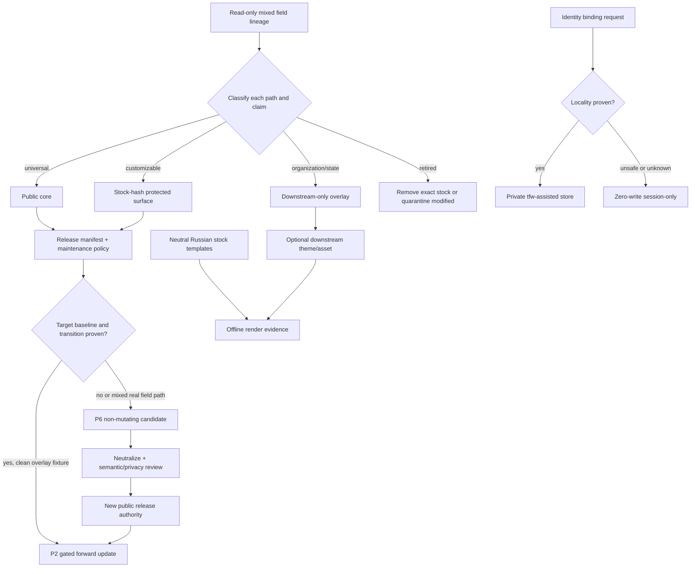

# RES — TFW_20260830-114238_ASSISTED15: Assisted 1.5 neutral extraction and core-overlay maintenance contract

> **Date**: 2026-08-30
> **Author**: codex (Researcher)
> **Status**: 🔬 RES — Iteration 1 complete; more research recommended
> **Parent HL**: [HL-TFW_20260830-114238_ASSISTED15](../../HL-TFW_20260830-114238_ASSISTED15.md)
> **Mode**: Pipeline

---

## Research Context

Iteration 1 tested whether the real Assisted 1.2–1.5 field lineage can supply a complete public Assisted 1.5 without copying private organizational state, weakening fail-closed identity, overwriting downstream customization, or inventing an automatic two-way mirror. The research compared public 1.0 and read-only field manifests, extracted lifecycle/identity/update/template invariants, built and attacked a nine-dimension configuration space, and constrained the surviving design with official primary-source evidence.

## Briefing

The research plan, hypotheses, scope, and owner direction are recorded in [1_briefing.md](1_briefing.md). Gather, Extract, and Challenge traces are [2_gather.md](2_gather.md), [3_extract.md](3_extract.md), and [4_challenge.md](4_challenge.md).

## Decisions

| # | Decision | Rationale |
|---|---|---|
| D1 | Treat field 1.5 as a hash-pinned mixed evidence distribution, not a public copy source | It is mechanically uninitialized but contains downstream wording, records, examples, and branding; “field clean” and “public neutral” are different claims |
| D2 | Assign every path one explicit authority: public core, stock-customizable, downstream-only, or retired/quarantine | Direction alone cannot decide ownership; unknown or ambiguous paths default to preserve-and-stop |
| D3 | Use asymmetric maintenance, never a symmetric mirror | Public→downstream known-stock update and downstream-generic→public reviewed promotion have different authorities and failure modes |
| D4 | Select `P2 × R1` as target, with normative `P2 × R2` and `P6 × R1` fallbacks | This preserves safe known-stock automation, portable manual/session-only operation, and manual reconstruction for mixed field files |
| D5 | Separate release manifest, maintenance policy, and operation report | File integrity, mutation authority, and one run's evidence are distinct; one untyped “manifest” would over-authorize correct hashes |
| D6 | Bind every update to a directed version transition and one coherent source tree digest | Per-file hashes alone allow stale or mixed-release views; all baselines must pass before the first write |
| D7 | Persist participant binding only when locality is positively proven; otherwise make the path zero-write session-only | Conventional per-user app-data locations do not universally prove machine-local/non-synchronized storage |
| D8 | Publish complete neutral Russian stock templates with optional downstream theme/asset overlay and stock-hash customization protection | Useful semantics belong in public core; organization branding and real examples do not; customized installed files must remain byte-preserved |
| D9 | Make `VERSION=1.5` the sole machine-readable public version authority and keep field provenance separate from public release entries | Public 1.0 has no established release date, field 1.1–1.4 were not public releases, and two-component `1.5` is not claimed as SemVer |
| D10 | Keep Russian as the only user-facing 1.5 source of truth | Independent bilingual copies create a second authority; a future localization must be source-linked and versioned separately |
| D11 | Reuse exactly one coordinator, executor, and reviewer session per phase when runtime capabilities are proven | Role independence does not require new retry sessions; same-session correction/re-review preserves context without concurrent writers |
| D12 | Use candidate-only P6 promotion for the current mixed field lineage; graduate to P2 only on clean overlay-separated fixtures | All six currently shared public/field paths differ, and several mix generic and downstream material at one path, so automatic mutation is not safe today |

## Verification Obligations

| ID | Obligation | Required evidence |
|---|---|---|
| V1 | Portable release paths | Exact/NFC/case collision, Windows-reserved, traversal, symlink/reparse, and regular-file tests on source and fixture targets |
| V2 | Coherent transition | Declared `from → to`, pinned source digest, matching manifest/policy/VERSION, and downgrade/mixed-release rejection |
| V3 | Complete preflight and race stop | Every baseline passes before first write; changed source/target after plan causes zero further writes |
| V4 | Partial-failure honesty | Injected failure produces a journal and recovery evidence; success remains impossible until exact postconditions hold |
| V5 | Ownership preservation | Work, knowledge, people, project identity, profiles, customized templates, unrelated `.codex`, overlays, and unknown paths remain byte-identical |
| V6 | Reverse privacy and authority | Private/branded/unknown/semantically downstream fixtures are rejected; public candidate omits sensitive path/hash/content and requires independent approval |
| V7 | Identity zero-write fallback | Unsafe/unknown location, remote/sync root, probe error, corrupt registry, foreign lock, and Full namespace cause no persistent Assisted write or participant selection |
| V8 | Identity path-race defense | Final/ancestor symlink or reparse substitution cannot redirect lock/temp/registry; unsupported safe primitives force session-only mode |
| V9 | Template usefulness and neutrality | Offline A4/presentation renders, readable long/table/Cyrillic/Latin fixtures, neutral asset metadata, missing override failure, and zero required network/private markers |
| V10 | Version and history truth | `VERSION` exact 1.5; product references agree; public 1.0 date is not invented; field iterations are not public release headings; tags are not required |
| V11 | Reusable-role capability gate | One coordinator/executor/reviewer, same-session retry, complete re-review, single writer, coordinator-only child reports, and manual fallback for missing operations |
| V12 | Both maintenance directions | Clean-fixture P2 forward/reverse have before/after manifests and zero unexplained changes; current mixed lineage remains non-mutating P6 evidence |

## Open Questions

| # | Question | Status | Answer |
|---|---|---|---|
| Q1 | What exact cross-platform probes can establish `proven` locality without claiming more than the OS exposes? | Open for iteration 2 | Candidate rules exist; platform-specific safe defaults and unsupported behavior need a concrete reference design |
| Q2 | What exact serialization and ordered path-rule grammar should the release/policy contract use? | Open for iteration 2 | Minimum fields and default-deny semantics are known; a fixture-ready schema remains to be specified |
| Q3 | How should the neutral asset/theme interface preserve current template paths and offline rendering? | Open for iteration 2 | Stock-hash plus optional overlay survives; exact CLI/config surface and fixture set need finalization |
| Q4 | Which task operations form the minimal reusable-role capability transaction in the supported Codex environments? | Open for iteration 2 | Create/attach, stable follow-up, observation, role verification, and directed reports are required; exact adapter behavior is runtime-specific |
| Q5 | What changelog wording distinguishes private field provenance without leaking downstream facts or pretending those versions were public? | Open for iteration 2 | Use one non-release provenance note; exact acceptance-safe wording needs an adversarial fixture |

## Hypotheses (from HL §10)

| # | Hypothesis | HL Status | RES Status | Evidence |
|---|---|---|---|---|
| H1 | Universal lifecycle and identity behavior can be extracted without weakening fail-closed safety | open | 🟢 supported with refinement | Five-field identity separation and lifecycle roles survive; source implementation must add positive locality/no-write fallback and capability gates (`G2`, `G3`, `C2`, `C3`) |
| H2 | Classified manifest plus non-mutating comparison is sufficient for safe forward and reviewed reverse without a mirror | open | 🟡 narrowed and conditionally supported | Safe behavior requires release manifest + maintenance policy + operation report + directed transition; current mixed lineage starts with P6 rather than automatic P2 (`E1`, `C1`) |
| H3 | Templates can be neutralized without losing result-producing logic | implementation evidence pending | 🟡 structurally supported; execution pending | Six practical capabilities separate from brand/context, but offline render, asset, readability, and customization evidence remains V9 (`G2`, `E2`, `C2`) |
| H4 | Russian 1.5 authority minimizes semantic drift; English can remain separate | open | 🟢 supported for 1.5 | Frozen scope and localization primary evidence favor one source authority with future source-linked locale overlays (`G6`, `E2`, `C4`) |

## HL Update Recommendations

> These are research recommendations only. The Phase Coordinator classifies/applies free-section refinements; the Researcher does not edit HL.

### Refinements — free sections, coordinator applies

| # | § | What to update | Source |
|---|---|---|---|
| R1 | §2 | Correct the current field marker-bearing text count from 12 to 14 for the pinned 1.5 digest; note that public hook payloads exactly match known stock retirement hashes | `G1`, `G9` |
| R2 | §7.2 | Add the official evidence set for checksums, path normalization/naming, synchronized-folder limits, local state, release consistency, patch applicability, localization, version history, and capability-gated autonomy | `G3`, `E1`–`E3`, `C1`–`C3` |
| R3 | §8 | Record the field 1.5 tree digest as mixed evidence; state that no reverse-promotion implementation exists in the field updater and that current mixed paths require P6 | `G1`, `G4`, `C1` |
| R4 | §9 | Add risks for unproven app-data locality, case/normalization/link escape, stale/mixed release views, partial multi-file writes, sensitive path/hash leakage, and automatic mutation of mixed field files | `G3`, `G4`, `C1`–`C3` |
| R5 | §10 | Update H1–H4 to the RES statuses above; record `P2×R1` target, mandatory `P2×R2`/`P6×R1` fallbacks, and V1–V12 | `E4`, `E5`, `C5`, `C6` |
| R6 | §11 | Add that a safe bridge is not necessarily automatic, machine-local is a proof obligation rather than a directory name, and reusable per-role sessions preserve independence without retry proliferation | `C1`–`C3` |

### Amendment Proposals — frozen sections, owner verdict required

No amendment proposals.

## Fact Candidates

> These human-sourced observations are candidates for later `/tfw-knowledge` consolidation, not verified facts.

| # | Category | Candidate | Source | Confidence |
|---|---|---|---|---|
| FC1 | Scope | The owner excludes Innoforce knowledge from public Assisted while explicitly retaining practical templates and universal working logic | User clarification, 2026-08-30; `HL-TFW_20260830-114238_ASSISTED15 §2` | ★★★ |
| FC2 | Maintenance | The owner wants future improvements to be able to move public→field and reviewed field→public, not merely a one-time extraction | User request, 2026-08-30; `HL-TFW_20260830-114238_ASSISTED15 §1` | ★★★ |
| FC3 | Process | The owner prefers one phase coordinator, one executor, and one reviewer session, with child reports routed to the coordinator and no unnecessary session proliferation | User orchestration direction, 2026-08-30 | ★★★ |
| FC4 | Delivery | This task may commit locally but must not push or tag | User delivery direction, 2026-08-30 | ★★★ |

## Strategic Insights (Research)

| # | Category | Insight | Source | Confidence |
|---|---|---|---|---|
| SS1 | Product | “Real practice” means promote the mechanisms and useful result shapes that survived actual use, not the organization data surrounding them. Implication: extraction must operate at claim/authority level, never by broad copy or marker deletion alone. | User clarification, 2026-08-30 | ★★★ |
| SS2 | Architecture | Bidirectional maintainability is desired, but ownership remains asymmetric. Implication: reverse flow is a reviewed generic candidate that becomes public authority only after its own release; it is not synchronization. | User request, 2026-08-30 | ★★★ |
| SS3 | Process | Coordinator control and role reuse are part of the desired operating model, not merely cost optimization. Implication: autonomous Assisted should expose bounded per-role sessions and hierarchical reports, with manual fallback when runtime targeting cannot be proven. | User orchestration direction, 2026-08-30 | ★★★ |

## Findings Map

The map shows why the solution has two mandatory escape paths: P6 for mixed maintenance surfaces and session-only identity for unproven locality. Neither is a failure of the product contract.

## Iteration Status

- **Iteration:** 1 of 2 (min) / 5 (max)
- **Hypotheses tested:** H1 (supported with refinement), H2 (narrowed/conditional), H3 (structurally supported), H4 (supported for 1.5)
- **Hypotheses deferred:** None; H3's execution evidence is an implementation obligation, while its research claim was tested
- **Gaps discovered:** exact locality probes; exact manifest/policy serialization; neutral template asset/theme interface; runtime-specific reusable-role capability mapping; adversarial public changelog provenance wording
- **Superseded decisions:** automatic P2 for the current real field tree is superseded by P6-first because shared paths are mixed; conventional app-data placement as locality proof is superseded by positive proof/session-only; signed manifests as sufficient freshness are superseded by coherent transition/snapshot binding

### Open Threads (for next iteration)

| # | Thread | Why it matters | Suggested focus |
|---|---|---|---|
| 1 | Cross-platform locality decision table | H1 still depends on an implementable distinction between `proven`, `unsafe`, and `unknown` | Derive platform-specific probes, safe primitives, zero-write behavior, and test fixtures from primary OS/runtime sources |
| 2 | Fixture-ready maintenance schema | V1–V6/V12 need deterministic inputs and default-deny rule resolution | Specify canonical serialization, rule precedence, transition graph, partial-failure journal, and sample clean/mixed fixtures |
| 3 | Neutral template interface | H3 cannot reach implementation-ready without a precise brand/customization seam | Define neutral asset requirements, builder CLI/theme override, offline constraints, and render acceptance matrix |
| 4 | Reusable-role adapter contract | V11 must be executable without promising unavailable Codex operations | Map required/optional capabilities, interruption behavior, manual transitions, and same-session retry reports |
| 5 | Public history/privacy fixture | A truthful provenance note could still leak context or imply false public releases | Draft and attack a minimal 1.0/1.5 changelog model with no invented date, tag, private path, or downstream fact |

### Recommendation

- [ ] **SUFFICIENT** — proceed to `/tfw-plan` to classify these recommendations and write TS
- [x] **MORE NEEDED** — complete the mandatory second iteration around the five open threads, producing fixture-ready constraints rather than re-reading the lineage
- [ ] **BLOCKED** — not blocked

> The Phase Coordinator decides whether to continue or proceed. This RES recommends iteration 2 because the configured minimum is two and targeted implementation-safety gaps remain.

## Conclusion

Iteration 1 established that a complete neutral Assisted 1.5 is feasible without changing the frozen contract, but not by copying the field package or treating maintenance as mirroring. The durable result is `P2×R1` with normative manual/session-only fallbacks, twelve verification obligations, and a P6-first rule for today's mixed field paths. Research exposed risks that a superficial comparison would miss: app-data is not synonymous with machine-local, valid hashes can form an inconsistent release, marker scans do not prove semantic neutrality, and successful HTML generation does not prove useful offline output. The main limitation is that this iteration remained structural and read-only; iteration 2 should turn the surviving design into fixture-ready schemas and platform/runtime decision tables before TS.

---

*RES — TFW_20260830-114238_ASSISTED15: Assisted 1.5 neutral extraction and core-overlay maintenance contract | 2026-08-30*
