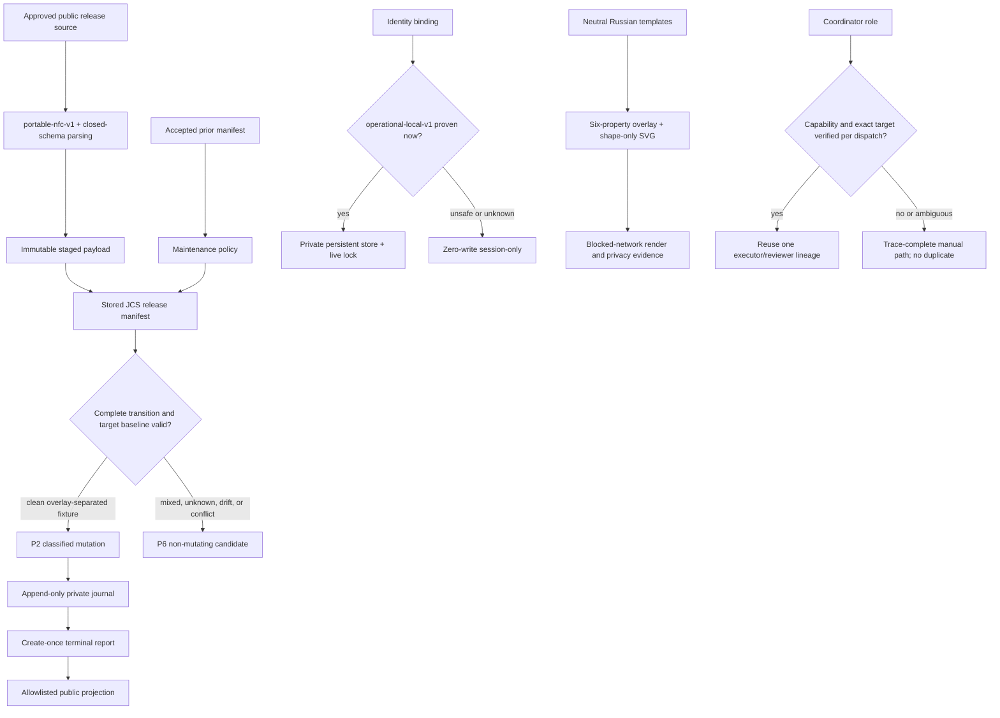

# RES — TFW_20260830-114238_ASSISTED15: Assisted 1.5 fixture-ready safety contracts

> **Date**: 2026-08-30
> **Author**: codex (Researcher)
> **Status**: 🔬 RES — Iteration 2 complete; sufficient
> **Parent HL**: [HL-TFW_20260830-114238_ASSISTED15](../../HL-TFW_20260830-114238_ASSISTED15.md)
> **Predecessor**: [Iteration 1 RES](../iter1/RES.md)
> **Mode**: Pipeline

---

## Research Context

Iteration 2 converted iteration 1's surviving `P2 × R1` target and `P2 × R2`/`P6 × R1` fallbacks into fixture-ready contracts. It resolved five bounded threads: cross-platform locality, canonical release/policy/report records, a neutral offline template interface, reusable-role runtime orchestration, and truthful public 1.0/1.5 history. Three deep OODA loops per stage attacked the result with primary-source counter-evidence, including path identity and reparse races, manifest self-cycles, partial writes, report privacy interference, active CSS/SVG content, runtime capability loss, and invented release provenance.

## Briefing

The targeted plan, predecessor decisions, hypotheses, scope, and guiding questions are recorded in [1_briefing.md](1_briefing.md). The evidence dimensions, configuration extraction, and adversarial elimination are recorded in [2_gather.md](2_gather.md), [3_extract.md](3_extract.md), and [4_challenge.md](4_challenge.md).

## Decisions

Iteration 2 accepts iteration 1 decisions D1–D12 and makes the following implementation-facing refinements final for planning.

| # | Decision | Rationale |
|---|---|---|
| D13 | Define persistent identity locality through `operational-local-v1`, not a folder-name promise | A complete platform row must prove an eligible local root, exclusions from project/source/shared/registered-provider roots, link/reparse-free containment, private permissions, safe lock/temp/replace primitives, and operation-time revalidation. Any `unsafe`, `unknown`, stale, or unsupported predicate produces a zero-write session-only outcome (`G1`, `G2`, `E1`, `C1`). |
| D14 | Validate release paths with `portable-nfc-v1` before hashing or policy resolution | Exact UTF-8, NFC, case-fold, Windows-reserved, traversal, separator, segment, regular-file, and ancestor-link collisions are product-domain checks outside JCS. Duplicate-key rejection and safe-integer/domain validation happen before a record can authorize work (`G3`, `E2`, `C2`). |
| D15 | Use an acyclic three-record authority model | Stored JCS release manifest bytes bind every payload file, the policy, and schemas while excluding the manifest itself. The current policy may bind accepted prior manifest hashes but never its current/to-manifest hash. An operation report binds the raw current manifest and policy hashes. This proves coherence and integrity, not source authentication (`G3`, `E2`, `C2`). |
| D16 | Resolve maintenance policy by exact match, otherwise longest complete-directory prefix | Globs and first-match semantics are rejected. Duplicate selectors, equal-specificity conflicts, noncanonical order, prefixes without `/`, unclassified source paths, or incompatible customized interfaces stop before write. Only exact known-stock retired hooks may use `remove-if-known-stock`; unrelated `.codex/` remains outside that authority (`G3`, `E2`, `C2`). |
| D17 | Stage and verify one immutable source snapshot before destination mutation | The updater takes a project lock, validates the complete source and destination baseline immediately before the first write, rechecks each path before mutation, and verifies postconditions. Prewrite drift means zero writes; post-mutation failure becomes an explicit partial outcome, not an atomicity claim (`G4`, `E2`, `C2`). |
| D18 | Separate append-only private evidence from a create-once terminal report and deterministic public projection | The journal exists durably before the first mutation. A terminal report is created once as `aborted`, `partial`, or `verified`; recovery creates a new linked report. Public output is closed-schema allowlisted, omits private paths, hashes, IDs, timestamps, recovery identifiers and exact private counts, and exposes only a boolean suppression signal plus public facts (`G3`, `E3`, `C3`). |
| D19 | Keep automatic P2 maintenance limited to clean overlay-separated fixtures | Current mixed field lineage remains non-mutating P6 candidate evidence. Both directions require before/after manifests, a classified transition, independent semantic/privacy review for reverse promotion, and zero unexplained changes. There is no symmetric mirror or implicit path authority (`G4`, `E7`, `C2`, `C3`). |
| D20 | Select template interface TI1 with a closed customization grammar | Stock templates remain useful Russian public artifacts. The only automatically promotable overlay is one `:root` block with six named font/color properties; all other selectors, properties, at-rules, URL-bearing constructs, escapes, and generated content fail. The optional neutral asset is local shape-only SVG under an XML allowlist. Blocked-network A4 and presentation renders prove usefulness and privacy (`G5`, `E4`, `C4`). |
| D21 | Use one abstract reusable-role transaction with runtime adapters and a complete manual mapping | Each phase owns one coordinator, executor, and reviewer lineage. Capability and exact target are probed at phase start and before every dispatch. Missing capability, ambiguous handle, or unconfirmed interruption stops autonomous work and continues only through existing traces/manual-complete; it never creates an automatic duplicate. Every review cycle is complete, not delta-only (`G6`, `E5`, `C5`). |
| D22 | Make public history public-only and release-time truthful | `VERSION` exact bytes `1.5\n` are the sole machine authority. The changelog contains public 1.5 and the public 1.0 repository baseline only, claims no SemVer or Assisted tag, and uses the actual release-record date; before release it says Unreleased. Downstream versions, provenance, hashes, paths, and facts never enter public release history (`G7`, `E6`, `C6`). |
| D23 | Retain Russian as the only 1.5 user-facing authority | Template, product, migration, skill, version and changelog agreement is verified against one source language. No independent English mirror is introduced during this phase (`E6`, `C6`). |

## Verification Obligations

| ID | Obligation | Passing evidence |
|---|---|---|
| V1 | Portable release paths | Duplicate-key-rejecting parser; exact/NFC/casefold/reserved/traversal/regular-file/link fixtures; fixed required paths; JCS and domain validation. |
| V2 | Coherent acyclic transition | Generated policy→manifest build graph; manifest self-entry and current-manifest policy fields rejected; policy present in manifest; prior manifest/version/interface edge agrees with `VERSION` and changelog. |
| V3 | Complete preflight and race handling | Verified immutable source staging; project lock; complete destination baseline immediately before mutation; prewrite drift causes zero writes; per-path recheck and postcondition evidence. |
| V4 | Partial-failure honesty | Inject failure after the first mutation; journal already exists; create-once terminal `partial`; recovery creates a new linked report; original never becomes `verified`. |
| V5 | Ownership preservation | Work, knowledge, people, identity, profiles, modified templates/overlay, unknown paths and unrelated `.codex/` remain byte-identical; a modified retired hook is preserved or quarantined. |
| V6 | Reverse privacy and report derivation | Paired private reports differing only in secret details yield identical public bytes and ID; no private path/hash/count/timestamp/ID; semantic reviewer accepts; real mixed field state remains P6 candidate-only. |
| V7 | Identity zero-write fallback | Every unsafe/unknown/probe/ACL/lock/corrupt/unsupported case creates no persistent directory, lock, temporary file, registry, diagnostic identity, or participant selection. |
| V8 | Identity operation-time safety | Windows reparse and Unix ancestor/mount-swap fixtures; pinned-root safe primitive; live OS lock; revalidation at every binding operation; unsupported adapter returns session-only. |
| V9 | Template usefulness, offline behavior, and privacy | Strict overlay and shape-only SVG attack fixtures; blocked-network stock/custom A4 and presentation renders; glyph, long-table, and background-disabled checks; pages/screenshots/hashes; semantic privacy review. |
| V10 | Version and history truth | Exact `VERSION=1.5`; all public claims agree; actual 1.5 date or explicit Unreleased; public 1.0 baseline wording; no tag dependency, SemVer claim, downstream headings, or private provenance. |
| V11 | Reusable-role capability gate | Initial and per-dispatch probes; one coordinator/executor/reviewer; same-handle correction; complete re-review; no overlap, bypass, or duplicate; capability loss/no-interrupt falls back to wait/manual-complete. |
| V12 | Both maintenance directions | Clean overlay-separated P2 forward and reviewed reverse fixtures have before/after records and zero unexplained changes; real mixed field lineage remains non-mutating P6 until clean separation exists. |

## Open Questions

| # | Question | Status | Answer |
|---|---|---|---|
| Q1 | What exact probes distinguish `proven`, `unsafe`, and `unknown` locality? | Closed | Use the `operational-local-v1` platform decision table, bounded registered-provider threat model, pinned-root safe primitive, live lock, operation-time revalidation, and zero-write session fallback. It does not claim protection from hostile same-user copying. |
| Q2 | What serialization and path-rule grammar makes maintenance fixture-ready? | Closed | Closed JSON Schemas over stored RFC 8785 JCS bytes, `portable-nfc-v1`, acyclic manifest→policy/prior-manifest binding, exact/longest-prefix resolution, immutable staging, append-only journal, and terminal reports. |
| Q3 | How can stock templates remain useful, customizable, neutral, and offline? | Closed | TI1: public stock templates plus a versioned six-property `:root` overlay and shape-only local SVG asset, with blocked-network render, glyph, overflow, background-disabled, and semantic privacy evidence. |
| Q4 | What is the minimum reusable-role capability transaction? | Closed | Stable role handle, exact target verification, create/follow-up/wait and optional interrupt, per-dispatch reprobe, coordinator-owned reports, no duplicate-on-loss, complete re-review, and a trace-complete manual mapping. |
| Q5 | How should public 1.0/1.5 history treat field provenance and dates? | Closed | It should not mention field provenance. Record the public 1.0 repository baseline without claiming a tag; use the actual 1.5 release-record date or Unreleased; keep `VERSION` as machine authority and avoid SemVer claims. |

## Hypotheses (from HL §10)

| # | Hypothesis | HL Status entering iteration 2 | RES Status | Evidence |
|---|---|---|---|---|
| H1 | Universal lifecycle and identity behavior can be extracted without weakening fail-closed safety | supported with refinement | 🟢 supported under bounded proof | `operational-local-v1`, pinned-root operation safety, and zero-write session fallback make persistence conditional without weakening the frozen outcome (`G1`, `E1`, `C1`, V7–V8). |
| H2 | Classified manifest plus non-mutating comparison is sufficient for safe forward and reviewed reverse without a mirror | narrowed and conditionally supported | 🟢 supported as an acyclic compound contract | Manifest, policy, report, journal, source snapshot and transition edges have distinct authorities; clean fixtures may use P2, while current mixed lineage remains P6 (`G3`, `E2`, `E3`, `C2`, `C3`, V1–V6/V12). |
| H3 | Templates can be neutralized without losing result-producing logic | structurally supported; execution pending | 🟢 research-supported; implementation evidence required | Restricted TI1, shape-only assets, interface compatibility and an offline render/privacy matrix make the claim falsifiable without replacing static presentation flow (`G5`, `E4`, `C4`, V9). |
| H4 | Russian 1.5 authority minimizes semantic drift; English can remain separate | supported for 1.5 | 🟢 supported | One Russian authority plus public-only release history avoids translation and provenance drift; implementation must prove product-wide agreement (`G7`, `E6`, `C6`, V10). |

## Residual Risks

These are implementation/review boundaries, not open research gaps:

1. An undeclared or malicious same-user synchronizer can copy state after a successful probe; the contract revalidates known evidence but does not promise hostile same-user confinement.
2. JCS and hashes prove coherence/integrity, not source origin; reviewed repository/source selection supplies provenance in this phase, while signing/freshness is later hardening.
3. A multi-file update on a shared or synchronized destination is not a distributed transaction; P6 and explicit partial evidence remain mandatory outside clean local fixtures.
4. Fonts and rendering engines vary; acceptance is readable and useful offline output, not pixel identity.
5. Semantic privacy and usefulness remain human judgments even after deterministic schemas, scans, and render fixtures.
6. Runtime task/multi-agent capabilities may change; manual-complete remains normative and an ambiguous lost role blocks rather than permitting duplication.

## HL Update Recommendations

> These are research recommendations only. The Phase Coordinator applies free-section refinements; the Researcher does not edit HL.

### Refinements — free sections, coordinator applies

| # | § | What to update | Source |
|---|---|---|---|
| R1 | §7.2 | Add the primary-source basis for platform locality limits, JCS/JSON Schema boundaries, privacy-safe logging, restricted CSS/SVG offline rendering, runtime multi-agent capability volatility, tags, and non-SemVer version labels. | `G1`–`G8`, `E1`–`E6`, `C1`–`C6` |
| R2 | §8 | Record the implementation dependencies implied by `operational-local-v1`, `portable-nfc-v1`, stored JCS schemas, platform-safe handle primitives, blocked-network rendering, and capability-adapter/manual mappings. | D13–D22, V1–V12 |
| R3 | §9 | Replace broad risks with the six bounded residual risks above and distinguish integrity from authentication and local multi-file mutation from distributed transactions. | `C1`–`C6`, Residual Risks |
| R4 | §10 | Mark H1–H4 research-supported with the exact conditions in this RES; carry V1–V12 as mandatory implementation/review evidence. | Hypotheses, V1–V12 |
| R5 | §11 | Record that safe locality is a revalidated threat-model result, public reports are privacy projections rather than recovery evidence, automatic maintenance is clean-fixture-only, TI1 is a closed interface, and capability loss must preserve role lineage through manual-complete. | D13–D23, `C9` |

### Amendment Proposals — frozen sections, owner verdict required

No amendment proposals. All failed claims were overstrong implementation interpretations. The frozen phase, DoD, DoF, principles, lifecycle, identity fallback, maintenance directions, template usefulness/privacy, language authority, and reusable-role topology remain satisfiable.

## Fact Candidates

> No new owner facts were introduced during iteration 2. The following task-level candidates remain material and await `/tfw-knowledge`; they are repeated here so the final iteration synthesis is self-contained.

| # | Category | Candidate | Source | Confidence |
|---|---|---|---|---|
| FC1 | Scope | The owner excludes Innoforce knowledge from public Assisted while explicitly retaining practical templates and universal working logic. | User clarification, 2026-08-30; `HL-TFW_20260830-114238_ASSISTED15 §2` | ★★★ |
| FC2 | Maintenance | The owner wants improvements to move public→field and reviewed field→public, rather than a one-time extraction or blind synchronization. | User request, 2026-08-30; `HL-TFW_20260830-114238_ASSISTED15 §1` | ★★★ |
| FC3 | Process | The owner prefers one phase coordinator, one executor, and one reviewer session, with child reports routed to the coordinator and no unnecessary session proliferation. | User orchestration direction, 2026-08-30 | ★★★ |
| FC4 | Delivery | The task may commit locally but must not push or tag. | User delivery direction, 2026-08-30 | ★★★ |

## Strategic Insights (Research)

| # | Category | Insight | Source | Confidence |
|---|---|---|---|---|
| SS1 | Product | “Real practice” means promoting mechanisms and useful result shapes that survived use, not the organization data surrounding them. Implication: release authority must be rebuilt through neutral claims, fixtures, and review rather than broad copying or marker deletion. | User clarification, 2026-08-30 | ★★★ |
| SS2 | Architecture | Bidirectional maintainability is desired while ownership remains asymmetric. Implication: reverse flow is a reviewed generic candidate that becomes public authority only in a new public release; it is never synchronization. | User request, 2026-08-30 | ★★★ |
| SS3 | Process | Coordinator control and role reuse are operating-model requirements. Implication: Assisted automation must expose bounded per-role transactions, hierarchical reports, no duplicate-on-loss behavior, and a complete manual fallback. | User orchestration direction, 2026-08-30 | ★★★ |

## Findings Map

The same pattern governs every survivor: positive proof permits the narrow automatic path; incomplete or mixed evidence selects a non-mutating/manual fallback without weakening the product result.

## Iteration Status

- **Iteration:** 2 of 2 (min) / 5 (max)
- **Hypotheses tested:** H1 (supported under bounded proof), H2 (supported as an acyclic compound contract), H3 (research-supported with execution evidence pending), H4 (supported)
- **Hypotheses deferred:** None. Render/platform/runtime execution belongs to handoff and review under V1–V12, not another research iteration.
- **Gaps discovered:** None requiring more research. Six residual risks are explicit product/runtime boundaries.
- **Superseded decisions:** Folder-name locality heuristics are superseded by `operational-local-v1`; a mutable operation report is superseded by append-only journal plus create-once terminal report; unrestricted CSS overlay is superseded by the six-property TI1 grammar; phase-start-only capability probing is superseded by per-dispatch verification; predicted 1.5 dates are superseded by actual release date or Unreleased.

### Open Threads (for next iteration)

No open threads.

### Recommendation

- [x] **SUFFICIENT** — proceed to `/tfw-plan` to classify these recommendations and write TS
- [ ] **MORE NEEDED** — no further research iteration is warranted
- [ ] **BLOCKED** — not blocked

> The Phase Coordinator decides whether to continue or proceed. This RES recommends closing research after the configured minimum two iterations and carrying V1–V12 into TS, handoff evidence, and independent review.

## Conclusion

Iteration 2 made the Assisted 1.5 design implementation-ready without changing its frozen claims. The result is not an automatic mirror: it is an acyclic, path-classified maintenance transaction with clean-fixture P2 and mixed-state P6; a bounded locality proof with zero-write fallback; a privacy-safe evidence model; a closed neutral template interface; and capability-gated reusable roles with a complete manual path. Counter-evidence materially narrowed five overstrong interpretations—universal locality, mutable reports, arbitrary CSS, stable runtime capability, and predicted history—while preserving H1–H4. The remaining uncertainty is deliberately executable: V1–V12 require platform, mutation, render, privacy, history, and orchestration evidence during handoff and review, not a third research pass.

---

*RES — TFW_20260830-114238_ASSISTED15: Assisted 1.5 fixture-ready safety contracts | 2026-08-30*
