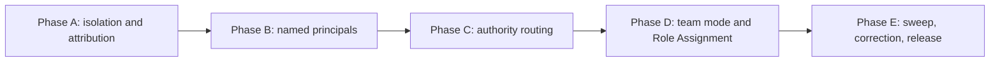

# HL — TFW_20260902-111644_CRATM: Contextual Roles and Agent Team Mode

> **Date**: 2026-09-02
> **Author**: Coordinator (Claude Code)
> **Title**: Contextual Roles and Agent Team Mode
> **Abbreviation**: CRATM
> **Status**: 📝 HL_DRAFT — contract frozen, research pending
> **Contract**: 🔒 FROZEN — approved by saubakirov 2026-09-02
> **Frozen**: §1 · §3 · §4 · §5 · §6 · §7 — locked on owner approval
> **Free**: §2 · §7.2 · §8 · §9 · §10 · §11 — research updates these directly
> **Append-only**: §12 Amendment Log — the only channel for changing a frozen section
> **Baseline**: freeze commits — recovery form in `conventions.md` §3 rule 15

> **Project North Star**: `.tfw/README.md` [#ns1](../../../.tfw/README.md#ns1) · [#ns2](../../../.tfw/README.md#ns2) · [#ns3](../../../.tfw/README.md#ns3)

> **Historical source**: [`TFW-54`](../../../tasks/TFW-54__agent_team_mode/HL-TFW-54__agent_team_mode.md), sealed
> `REJECTED` — superseded, not failed. Its proposal and draft HL are read-only input, classified
> through the transfer ledger in this task's [PROPOSAL](PROPOSAL__TFW_20260902-111644_CRATM.md) §4.
> Nothing in that directory is reopened, renamed or updated in place.

> **Every phase carries its own HL**, by owner ruling 2026-09-02. Those are **derivation-only**
> (`conventions.md` §3 rules 20–21): execution context, files, sequencing, phase-local risks — never
> their own §1, §5, §6 or §7. Acceptance lives once, here.

---

## 1. Vision 🔒 FROZEN

A project declares who its participants are — people and named agents — what each of them is in this
project, and who holds which workflow role in this task. A coordinator then runs the task with a team
of those participants, in isolated working trees, under a contract it cannot move. Every proposal to
move the contract travels up a chain of initiation that always terminates at a human, and is ruled by
the nearest principal that human named. The owner approves once, chooses how far the autonomy reaches,
and comes back to a finished result.

This completes what three tasks left standing one step apart. TFW-53 froze the goals and gave them a
defender. TFW-60 gave every task its own state, its own immutable journal, and a place where
participants are declared. Neither of them named who acts, and the canon says so in eleven places:
*"a writer is not named yet."* Until it is, `type: agent` is admitted by the schema and consumed by
nothing, delegation has no addressee, and a coordinator running a team is a practice with no contract.

**Impact:** The owner stops being the router. Ten blocking gates per research iteration become one
approval plus the amendments the work genuinely raises. Two sessions stop contending for one git index,
because they stop sharing one. A verdict on a frozen claim carries the name of who signed it and the
authority they were given, so a reader six months later can check both. And the framework stops
promising a deliverable from a task that no longer exists.

> "I named who does what and how far they go, and left. What came back was the work, and one
> amendment with the evidence attached. I could see which participant did which piece, and who
> signed off on what."

## 2. Current State (As-Is) 🟢 FREE

### The substrate is built and the last step is missing

Measured against the working tree at `c38f87a`, framework version 2.1.0.

| Carrier | State | What it cannot do |
|---|---|---|
| Frozen HL contract, §12 amendment log, freeze baseline | ✅ TFW-53 (D63) | Nothing — it works. But nobody walks away from it, so it is cost without return |
| Purpose Check, north-star locus, materiality bar | ✅ TFW-53 (D64), NS1–NS3 now designated | — |
| Task-local `status.md`, immutable `journal/`, derived index | ✅ TFW-60 (D68) | — |
| `team/{handle}.md` participant profiles | ✅ four keys: `handle`, `name`, `type`, `since` | Carry no role. Context lives in `team/README.md` prose, which no parser reads |
| `type: agent` | ✅ admitted by the schema | **Consumed by nothing.** The template says so in capitals |
| Journal identity fields | ✅ `on_behalf_of` (a human, accountable) · `via` (tool text) | **Cannot name the writer.** `actor` was removed at `2.0.0-dirty.3` |
| `kind: dispatch` — *"work was handed to a named participant"* | ✅ in the closed vocabulary | Names the participant it went **to**, never the one it came **from** |
| `~/.tfw/bindings.yaml` — which handle a machine acts as | ✅ specified | Selects a human handle only. **Does not exist on this machine** — the mechanism has never been used here |
| Execution modes, `conventions.md` §7 | ✅ CL and AG, six lines | No mode where a coordinator runs a team under one frozen HL |
| Per-task Role Assignment | ❌ absent | `grep -rn "Role Assignment" .tfw/` → 0 |
| Staging and landing discipline | ❌ absent | `Commit Attribution` is one paragraph, unchanged since TFW-50 |

### The canon has eleven live forward references to a sealed task

`.tfw/` names **TFW-54** as the task that will deliver a named agent principal. TFW-54 is now
`REJECTED — superseded`. Every one of these promises now points at a task that will deliver nothing:

| Site | What is promised |
|---|---|
| `conventions.md`:362 | *"Naming a writer needs a principal that delegates and answers to someone — and TFW does not have one until **TFW-54**"* |
| `glossary.md`:318 | `type: agent` *"is admitted by the schema and consumed by nothing until TFW-54"* |
| `templates/team/profile.md`:34 | *"that is TFW-54; until it lands, `team/` holds people"* |
| `templates/journal/event.md`:56 | the same, for the removed `actor` field |
| `workflows/handoff.md`:48 · `init.md`:86 · `init.md`:131 · `release.md`:31 · `research/base.md`:40 · `resume.md`:31 · `review.md`:53 | *"A writer is not named yet — that is TFW-54"* |

Eleven sites in ten files. This is the same shape as the eleven `/tfw-task` references that
[RTMW](../TFW_20260902-153617_RTMW/status.md) retired on 2026-09-02, and it is not cosmetic: the
promise and the blocker are the same sentence, so whoever lands the principal must land the sweep.

### Two sessions, one index — measured three times

| # | Occurrence | Record |
|---|---|---|
| 1 | A broad `git add` in the TFW-53/B session swept three of TFW-56's already-staged deletions into `fbdf443` | TD-144, **High**; `tasks/DEBT-SNAPSHOT.md`:91 |
| 2 | TFW-53/E's board rows landed inside `8d9432b` `[claude-code/TFW-58/proposal/coordinator]`, whose body never mentions TFW-53 | TD-178; `git log -- README.md` shows no TFW-53/E commit for that phase's deliverable |
| 3 | TFW-60/A's own release: *"broad staging temporarily committed TFW-54/TFW-55 files… the release has not structurally prevented the recurring TD-144 failure"* | `TFW-60/phase-a/review/judge.md` row 10, ❌ |

`knowledge/risk.md` F1 measured the discipline that was supposed to prevent it: **a verbal staging
directive survived 0 of 1** against a broad `git add`, and three consecutive phases of one task
produced three different ad-hoc answers, none written down. Under D55 the commit subject is the only
record of which task a change belongs to, and TFW-53's baseline recovery is a subject filter — so a
misattributed staging degrades the mechanism TFW-53 shipped.

### Isolation already exists on this machine, and nobody designed it

```
$ git worktree list
D:/projects/research/steps-framework                  c38f87a [master]
C:/Users/c0rpa/.codex/worktrees/ac4b/steps-framework  30f8fee (detached HEAD)
```

Codex creates git worktrees unprompted, under a vendor-owned path, named by an opaque token, at a
detached HEAD. Separate worktrees have **separate indexes**, which is exactly what defect 1 needs and
exactly what no rule delivered in three attempts. What they do not fix is defect 2 — attribution is
not isolation — and what they add is a merge, plus git's constraint that one branch cannot be checked
out in two worktrees at once.

### A capability fact the project holds is no longer true

`knowledge/constraint.md` F11, marked *measured 2026-08-08*: *"Fully independent agent sessions are a
**Codex-only** capability. Claude Code can spawn subagents but not peers."*

At the time of writing this HL, this coordinator enumerated **seven peer Claude sessions** and can
address each by name, including a second session in this same project. The asymmetry that shaped the
whole topology argument — and that justified rejecting a per-task autonomy dial — does not hold in
that form. What is verified: peers can be listed and addressed. What is **not** verified: whether they
persist long enough to carry a delegation, whether one can be created on demand, and whether the
channel is durable. F11 needs re-measurement, not a silent rewrite.

### Field practice this task has to describe rather than invent

Owner, 2026-09-02: Codex manages its own sessions through threads — the coordinator creates a phase
coordinator, and the phase coordinator creates the others and controls them down the chain. The owner
can see, message and stop each one. *"Правда иногда тупит, форкает себя зачем-то"* — so the behaviour
is real but not reliable, and what makes it reliable is instructions, which is this task's medium.

What is unknown is every crossing: whether Claude can hold a conversation with a Codex session or only
read its exit code, whether the reverse works, and what happens when participants from two vendors sit
in one worktree.

## 3. Target State (To-Be) 🔒 FROZEN

### What changes

1. **Concurrent work is isolated by a declared worktree protocol** built on `git worktree` — where a
   worktree lives, a name a person can read back to its task and principal, who may create one, when
   it merges, who deletes it, and what happens to one whose session died. TFW owns the protocol; git
   owns the mechanism.
2. **Attribution survives isolation.** A deliverable landed by a session other than its producer goes
   in its own commit, whose subject names the producer's task and phase. Isolation does not fix this
   and a rule must.
3. **Participants carry structured context.** `team/{handle}.md` gains organisation and project role
   as declared descriptive context, with a migration that does not break existing four-key profiles.
4. **A named agent principal exists**, activating `type: agent`: a stable name that can be assigned,
   delegated to, and held in an accountability chain — never a provider, never a model, never a
   session. Each agent principal names the human accountable for it.
5. **A durable write can name its writer**, so an initiation edge can be recorded at all. Legacy
   events keep their tolerated `actor` and are never rewritten.
6. **A binding selects which principal a session acts as** — the existing per-machine mechanism,
   extended from a human handle to a principal. No start command, no liveness file, no process lock.
7. **Verdict authority is a property of the name.** A principal that may rule on a frozen-section
   amendment is a distinct declared principal from one that may not. The grant is visible in the §12
   row because it is visible in the signature.
8. **An initiation chain routes every amendment** to the nearest principal authorised to rule, and
   terminates at a human by construction. Every edge of the chain starts at a coordinator.
9. **A third execution mode** in `conventions.md` §7 — a coordinator running a team under one frozen
   HL — with a frozen per-task Role Assignment naming participants, delegation recorded as `dispatch`,
   an exhaustive list of what returns the owner, and a declared field for how far the autonomy reaches.
10. **The canon stops promising a deliverable from a sealed task.** Eleven sites are swept, F11 is
    corrected, and the vocabulary lands in the glossary and the adapters.

### Explicitly out of scope

| Not built here | Why | Where it goes |
|---|---|---|
| Any runtime, orchestrator, spawner, scheduler, lock server, daemon or database | NS3 non-goal: *"a vendor-bound tool, runtime, model, interface, or memory feature."* TFW-49 died of exactly this — 5,910 lines of Python discarded, 149 files and 27,103 lines reverted in six days | — |
| **A worktree implementation of our own** | `git worktree` is git, not a vendor, and TFW already stands on git for attribution (D55) and baseline recovery. Writing our own means either code in the repository or reinventing what git does correctly | — |
| A liveness registry, a process lock, or a `tfw-agent-start` command | State that must agree with a running process is the two-files-must-agree problem D68 removed on purpose: the process dies and the file lies. And a lock is a runtime | — |
| Branch policy and merge strategy for shared work | One transport must not be assumed here | [TFW-61](../../../tasks/TFW-61__collaboration_transport_modes/PROPOSAL__TFW-61__collaboration_transport_modes.md) |
| The revise loop — who is in it, termination, re-entry | Only the agent-freshness question touches this task, and it is a hypothesis here | [TFW-58](../../../tasks/TFW-58__revise_protocol/PROPOSAL__TFW-58__revise_protocol.md) |
| Stage-level swarm inside one workflow | Different granularity; merging blurs the vocabulary this task introduces | [TFW-45](../../../tasks/TFW-45__multi_agent_workflows/HL-TFW-45__multi_agent_workflows.md), ❄️ frozen |
| Permissions or authentication derived from a profile role | D59: declared attribution ≠ authentication. A role is context; authority comes from the owner, the contract and the Role Lock | — |
| One profile per session, model, provider family or event | The failure that removed `actor`: events are immutable, profiles are not | — |
| Unifying Full and Assisted profile or binding schemas | A shared noun does not make two schemas one (S4) | — |
| Any edit to Assisted, FA15ES, or sealed `tasks/` beyond a terminal state already recorded | — | — |

### The autonomy boundary is a declared scope, not a moment

The owner asked when autonomy begins, and reports wanting it sometimes before research and sometimes
after. Both are already **after the freeze** — rule 13 puts the freeze commit before iteration 1 — so
the contract boundary is identical in both, and what actually differs is how many open hypotheses the
coordinator may close alone.

Therefore the onset is not a state, an event or a command. It is one declared field in the frozen Role
Assignment, on the lifecycle vocabulary that already exists. **What freezes here is that the field
exists**; its value is per-task data, filled at each task's own freeze. The owner keeps choosing, task
by task, forever, and no choice is ever an amendment.

And session identity is a separate question with an answer already given: a principal is declared in
`team/`, a session acts as it through its binding. There is no moment in a lifecycle at which a
session acquires a name — the name is which chair it sat in when it opened.

### 3.1 Result Visualization

> Rendering of §3–§5 as already approved. No claim here that is not a DoD item.

**Every file that changes, and which phase touches it.** No new artifact class, no new per-task file.

```
.tfw/
├─ conventions.md      [A] §4 → worktree protocol · exact-path staging · landing commit
│                      [B] §4 → profile schema opens · principal · writer field · binding selects
│                      [C] §3 → rule 8 rewritten: who may rule · initiation chain · termination
│                      [D] §7 → ★ THIRD MODE · §3 → Role Assignment freeze granularity
│                      [A][C][D] §14 → anti-patterns
├─ templates/
│  ├─ team/profile.md  [B] organization_role · project_role · agent principal · accountable human
│  │                       · optional mentality · the two-grant-levels pattern
│  ├─ journal/event.md [B] the writer field returns; legacy actor still tolerated
│  ├─ bindings.yaml    [B] a binding may select a principal, not only a human handle
│  └─ HL.md            [D] Role Assignment section, incl. the "Autonomous from" column
├─ workflows/
│  ├─ handoff.md       [A] executor side of staging · [D] delegate obligations
│  ├─ review.md        [A] reviewer side of staging · [C] where a verdict request goes
│  ├─ plan.md          [C] amendment routing · [D] declare Role Assignment before the freeze
│  └─ research/base.md [D] researcher as a delegate
├─ glossary.md         [E] principal · initiation chain · worktree protocol · landing commit · AT
└─ VERSION · CHANGELOG [E]

knowledge/constraint.md  [E] F11 corrected — peers are no longer Codex-only
eleven sites, ten files  [E] the "that is TFW-54" promise is swept
```

**What each phase buys, stated as what stops happening.**

| Phase | Changes | What stops |
|---|---|---|
| **A** 🔴 | `conventions.md` §4, `handoff.md`, `review.md` | Two sessions stop sharing one index — structurally, not by a directive that survived 0 of 1. And a deliverable stops landing under another task's name |
| **B** 🔴 | three templates, `conventions.md` §4 | `type: agent` stops being a schema entry consumed by nothing. A dispatch stops being unable to say who handed the work |
| **C** 🔴 | `conventions.md` §3, `plan.md`, `review.md` | "Ask the owner" stops being the only answer to *who rules this*. An executor stops being able to initiate anyone, so a cycle stops being possible |
| **D** 🔴 | `conventions.md` §7 and §3, `templates/HL.md`, three workflows | The owner stops being the router. And "you are free from here" becomes sayable with a declared reach |
| **E** 🟡 | glossary, eleven sites, F11, adapters, version | The canon stops promising a deliverable from a sealed task, and the debt the four reviews captured stops outliving them |

```
A ──► B ──► C ──► D ──► E
│
└─ A is independent and runs first because this task's own later phases need it
```

**§4.1 as it will appear in a task's HL** — the artifact, not a description of it:

```markdown
### 4.1 Role Assignment 🔒 FROZEN

> The table's existence declares the team mode for this task. No table → CL, as today.
> A row is the frozen unit. Participants are team/ handles; provider and model live in the
> profile, never here.

| Workflow role | Scope | Participant   | Reports to  | Autonomous from | Channel        |
|---------------|-------|---------------|-------------|-----------------|----------------|
| Coordinator   | all   | codex-lead    | saubakirov  | HL_DRAFT        | current task   |
| Researcher    | all   | codex-probe   | coordinator | —               | visible thread |
| Executor      | A, B  | codex-hand    | coordinator | —               | visible thread |
| Reviewer      | A, B  | claude-judge  | coordinator | —               | separate task  |
```

`Autonomous from: HL_DRAFT` means from the freeze — the coordinator answers the research gates.
`TS_DRAFT` means the owner sits through research and leaves afterwards. Two participants of one
provider, `codex-lead` and `codex-hand`, are two principals, because the canon already rules that two
sessions of one tool are two writers.

**Two named principals, one grant apart:**

```
team/
├─ saubakirov.md      type: human   organization_role: founder   project_role: methodology owner
├─ codex-lead.md      type: agent   accountable_to: saubakirov   may_rule_amendments: yes
└─ codex-hand.md      type: agent   accountable_to: saubakirov   may_rule_amendments: no
```

The grant is in the name, so it is in the signature, so it is in the log:

```
## 12. Amendment Log
| # | Date       | § | Type      | Proposer    | … | Verdict                              |
| A1| 2026-11-09 |§4 | EXTEND    | research 2  | … | ❌ REJECTED — codex-lead, 2026-11-09  |
| A2| 2026-11-21 |§5 | SUPERSEDE | coordinator | … | ✅ APPROVED — saubakirov, 2026-11-21  |
```

A reader opens one table and sees who signed and, from the name alone, what authority they held. No
lookup into a mutable file, no question about what the grant was on the day of signing.

**The chain that routes A1 to `codex-lead` rather than to the owner:**

```
saubakirov (human, accountable, grants)
    └─ dispatch ─► codex-lead      (Coordinator, may rule)
           └─ dispatch ─► codex-probe   (Researcher)   ──┐
           └─ dispatch ─► codex-hand    (Executor)     ──┤ files an amendment proposal
           └─ dispatch ─► claude-judge  (Reviewer)     ──┘
                                                          │
   nearest principal up the chain that may rule ◄──────────┘
   and is not the proposer  →  codex-lead
   codex-lead is itself the proposer  →  up one more  →  saubakirov
```

Every edge starts at a coordinator, so an executor initiates nobody and a phase coordinator cannot
initiate the task coordinator — **cycles are impossible by construction**, with no rule forbidding them.

**Before and after, one five-phase task:**

```
TODAY                                        AFTER
──────────────────────────────────────       ──────────────────────────────────────
approve HL                          🛑       approve HL + Role Assignment        🛑
research iter1: 9 gates          🛑×9        ── coordinator answers ──
research iter2: 9 gates          🛑×9        ── coordinator answers ──
  amendment arrives                 🛑       amendment → nearest ruler; owner only
                                             when the ruler is the proposer      🛑
TS · ONB · RF · REVIEW × 5 phases 🛑×~25     ── the team carries it ──
                                             Purpose Check hits a contract defect 🛑
close                               🛑       finished result                     🛑
──────────────────────────────────────       ──────────────────────────────────────
~45 blocking stops                           3 + 1 per amendment the owner must rule
one shared index, 3 measured corruptions      one worktree per autonomous run
"who rules this?" → only "the owner"          → a named principal, in the signature
```

**What returns the owner, exhaustively** — this list is a DoD item, not a summary:

| Trigger | Channel |
|---|---|
| An amendment whose nearest authorised ruler is its own proposer | §12, up the chain to a human |
| An amendment against a claim the owner reserved to themselves | §12 directly |
| Purpose Check finds the reference set self-contradictory | `judge.md` → owner, contract defect |
| ❌ REJECT verdict | `review.md` → owner |
| A declared participant is unavailable | §12 `SUPERSEDE`; the task waits — no silent substitution |
| A scope budget would be exceeded | rule 19 forbids the coordinator accepting it → owner |
| An initiation chain that does not terminate at a human | refused; the work does not start |

### 3.2 Value Flow

| Step | Input | Transformation | Value created |
|---|---|---|---|
| Declare participants | who is in this project, and what each is here | `team/{handle}.md` gains role context; agent principals become declarable | Roles stop living in prose no parser reads, and `type: agent` stops being decorative |
| Declare the grant | the owner's judgement about which principal may rule | two named principals, one grant apart | The grant is in the name, so a verdict is checkable without a lookup |
| Bind a session | which machine acts as whom | `~/.tfw/bindings.yaml` selects a principal | No start command, no liveness file, nothing to go stale |
| Freeze | approved HL + Role Assignment + declared reach | freeze commit; subject-filtered baseline | The mandate becomes diffable, and its reach is written down |
| Isolate | concurrent work | a worktree per autonomous run, named readably | Index contention ends structurally; the trace stops being corrupted by a neighbour |
| Dispatch | a scoped handoff to a named participant | `kind: dispatch` naming both ends | The initiation chain becomes a fact in the journal instead of a memory in a session |
| Route | pressure on a frozen claim | up the chain to the nearest authorised ruler | The owner is interrupted by decisions they alone can make, not by every decision |
| Land | a deliverable crossing a session boundary | its own commit, subject naming the producer | `git log -- <path>` answers which task delivered it |
| Defend | the finished result | Purpose Check against baseline + NS1–NS3 | Verified, complete and beside the point stays rejectable |

## 4. Phases 🔒 FROZEN

Each phase carries **its own derivation-only HL** (`conventions.md` §3 rules 20–21) plus TS → ONB →
RF → REVIEW and its own `status.md` and `journal/`.

### Phase Dependencies



| Phase | Depends on | Shared files | Can run in parallel with |
|-------|-----------|--------------|-------------------------|
| A | Independent | `conventions.md` §4 · `handoff.md` · `review.md` | — |
| B | A | `conventions.md` §4 | — |
| C | B | `conventions.md` §3 · `review.md` · `plan.md` | — |
| D | C | `conventions.md` §3, §7 · `plan.md` · `review.md` | — |
| E | A + B + C + D | glossary, adapters, version | — |

Strictly sequential, and deliberately so: four of the five touch `conventions.md`, and this task's
subject is what happens when concurrent sessions write one thing. Phase A ships the isolation that
makes later parallelism safe; running the phases in parallel before it exists would be the
anti-pattern demonstrating itself.

### Phase A: Isolation and attribution for concurrent work 🔴

> **Requires:** Independent
>
> **⚠️ Shared files with Phase B:** `.tfw/conventions.md` §4 — A owns Commit Attribution and the
> worktree protocol; B opens the profile schema and the identity fields. Sequential.
>
> **Context for coordinator:** 1. `conventions.md` §4 Commit Attribution and "Which handle a machine
> acts as" · 2. `knowledge/risk.md` F1 · 3. `tasks/DEBT-SNAPSHOT.md` TD-144, TD-178 ·
> 4. `TFW-60/phase-a/review/judge.md` row 10 — the third occurrence, inside a release ·
> 5. `git worktree list` on this machine, and `~/.codex/worktrees/` as the vendor's answer ·
> 6. `knowledge/environment.md` F3, F4 — the shell rewrites a leading `/`, and `--grep` cannot be made
> subject-only · 7. NS3 non-goals · 8. this HL §3, §7
>
> **Key decisions:** D55 (the commit subject is the only record of task ownership) · D68 (task-local
> state; no shared write) · D59 (recoverability ≠ locking — a worktree is isolation, not a lock)
>
> **⚠️ Cascade dependency:** `handoff.md` and `review.md` both carry the seven-workflow identity
> preamble; edits must not orphan it. The landing-commit rule must stay subject-based, or it
> reintroduces the `--grep` defect TFW-53 already paid for.
>
> **Deliverables:**
> 1. A worktree protocol in `conventions.md` §4: where a worktree lives, a name that reads back to its
>    task and principal, who may create one, when it merges, who deletes it, and the disposition of one
>    whose session died. Built on `git worktree`; no implementation of our own.
> 2. Exact-path staging: `git add -A`, `git add .` and `commit -a` named and forbidden; audit the
>    cached diff before every commit; never commit a sibling's hunk because it is already staged;
>    preserve unrelated dirty work and report the overlap instead of normalising it.
> 3. The landing-commit rule: a deliverable committed by a session other than its producer goes in its
>    own commit, subject naming the producer's task and phase, `role` the acting role. Worked example
>    from TD-178.
> 4. Both role surfaces: `handoff.md` for the executor, `review.md` for the reviewer.
> 5. `conventions.md` §14 anti-patterns for both failures, each naming its measured occurrence.

### Phase B: Named principals 🔴

> **Requires:** Phase A ✅
>
> **Context for coordinator:** 1. `templates/team/profile.md` in full — the four-key schema and the
> agent deferral · 2. `templates/journal/event.md` — the two identity fields and why `actor` went ·
> 3. `templates/bindings.yaml` · 4. `conventions.md` §4 "Which handle a machine acts as" ·
> 5. `FA15ES` HL for the five field-tested distinctions, as evidence and never as authority ·
> 6. D59 · 7. `knowledge/constraint.md` F12 — obligations belong in files, never in a tool's memory
>
> **Key decisions:** D59 (declared attribution ≠ authentication) · D68 (an event name ends in an
> opaque token, not an actor) · D45 (a schema addition needs a payload argument, not convenience)
>
> **⚠️ Cascade dependency:** the writer field must compose with immutable legacy events that already
> carry a tolerated `actor`. Nothing existing is rewritten, and no validator may start failing on it.
>
> **Deliverables:**
> 1. `organization_role` and `project_role` as declared descriptive context, with stated semantics for
>    absence, and a migration under which existing four-key profiles stay valid.
> 2. The agent principal: what makes a name a principal rather than a provider, a model or a session;
>    the human it is accountable to, named in its own profile.
> 3. A writer field for new events, so an initiation edge can be recorded; legacy `actor` untouched.
> 4. A binding may select a principal alongside a human handle.
> 5. Optional mentality in the profile — identity and style, never authority.
> 6. The two-grant-levels pattern: authority carried by the name, one principal per level.

### Phase C: Authority routing 🔴

> **Requires:** Phase B ✅
>
> **Context for coordinator:** 1. `conventions.md` §3 rules 8, 9, 12, 17–19 · 2. `templates/HL.md` §12
> in full · 3. `workflows/review.md` verdict routing · 4. `workflows/plan.md` Step 6c–6d ·
> 5. `philosophy.md` F37 — a mandate that justifies its own extension is the root cause ·
> 6. D59's fifth boundary — a separate agent session ≠ an independent person
>
> **Key decisions:** D63 (the contract and its amendment channel) · F37 · D59
>
> **⚠️ Cascade dependency:** rule 8 is cited from `plan.md`, `review.md`, `research/base.md` and the
> HL template. Changing what "owner verdict" means changes all of them at once.
>
> **Deliverables:**
> 1. The initiation chain as a rule: what an edge is, how it is recorded, and that it terminates at a
>    human by construction — a chain that does not is refused before work starts.
> 2. Who rules a §12 proposal: the nearest principal up the chain that may rule and is not the
>    proposer; when that is the owner, it is the owner.
> 3. `conventions.md` §3 rule 8 rewritten deliberately, stating what the guarantee now is and what it
>    was, so the weakening is legible rather than discovered.
> 4. The coordinator invariant: every edge of the chain starts at a coordinator; an executor initiates
>    nobody; a phase coordinator may not initiate the task coordinator.
> 5. `conventions.md` §14: an agent ruling on its own proposal; a chain that does not resolve to a
>    human; an executor dispatching work.

### Phase D: Team mode and Role Assignment 🔴

> **Requires:** Phase C ✅
>
> **Context for coordinator:** 1. `conventions.md` §7 in full — six lines · 2. §3 rules 5–7 for
> freeze granularity · 3. §5 for the lifecycle vocabulary the "Autonomous from" column reuses ·
> 4. `templates/journal/event.md` `kind: dispatch` · 5. `templates/HL.md` §4 and its subsection
> inheritance note · 6. research iter1 and iter2 for what the tools actually do · 7. this HL §3.1
>
> **Key decisions:** D31 (file existence = state, so table existence = mode declaration) · D54
> (parity is behavioural) · D62 (defaults follow observed practice)
>
> **⚠️ Cascade dependency:** `plan.md` Step 4 is followed by the freeze instruction; the Role
> Assignment declaration must precede the freeze without orphaning either. §3's frozen table lists
> "§4 Phases" and subsections inherit, so only a granularity clause is needed.
>
> **Deliverables:**
> 1. `conventions.md` §7: the third mode — entry condition, what the coordinator owes the owner, what
>    a delegate owes the coordinator, the exhaustive return list from §3.1, and degradation stated as
>    behaviour rather than mechanism.
> 2. `templates/HL.md` Role Assignment: participants as `team/` handles, scope, reports-to, channel,
>    and the **"Autonomous from"** column. A task with no table runs CL exactly as today.
> 3. `conventions.md` §3: freeze granularity for the table — a row is the frozen unit; `EXTEND` adds a
>    role, `SUPERSEDE` swaps a participant, a row may not be removed, and dropping a control is never
>    `RESTRICT`.
> 4. Delegation recorded as `dispatch`, naming both ends and its scope.
> 5. `plan.md`, `handoff.md`, `review.md`, `research/base.md`: declare, receive, report.

### Phase E: Sweep, correction, release 🟡

> **Requires:** Phases A ✅ B ✅ C ✅ D ✅
>
> **Context for coordinator:** 1. the eleven sites listed in §2 · 2. `knowledge/constraint.md` F11 ·
> 3. RF TFW-53/D for the adapter-sync procedure and the drift check · 4. `workflows/config.md` drift
> check · 5. `stakeholder.md` F8 — a check that keeps printing known failures stops being read ·
> 6. every REVIEW produced by phases A–D
>
> **Key decisions:** D54 (adapter parity) · F8
>
> **Deliverables:**
> 1. All eleven "that is TFW-54" sites swept to name this task or the shipped mechanism.
> 2. `knowledge/constraint.md` F11 corrected with what was measured and when, through `/tfw-knowledge`.
> 3. Glossary: principal · initiation chain · worktree protocol · landing commit · the mode's name.
> 4. Adapter copies re-synced; the `config.md` drift check runs silent afterwards.
> 5. Version and `CHANGELOG.md`.
> 6. Every debt item captured by the reviews of A–D disposed of before this task closes.

## 5. Definition of Done (DoD) 🔒 FROZEN

Each item states a phase's outcome, not its implementation. How a phase meets its outcome is
refinement inside an approved phase (`conventions.md` §3 rule 6) and stays discussable.

- ✅ 1. A worktree protocol exists in the canon, built on `git worktree`, and answers all six
  questions: location, a name that reads back to task and principal, who creates, when it merges, who
  deletes, and the disposition of a dead session's worktree.
- ✅ 2. Broad staging is named and forbidden, staging by exact path is required, and both role
  surfaces carry the rule — not a directive in one place.
- ✅ 3. A deliverable that crosses a session boundary is recoverable from `git log -- <path>` by the
  task that produced it, and the rule that makes it so carries the TD-178 worked example.
- ✅ 4. `team/` profiles carry organisation and project role, and every existing four-key profile
  stays valid without an edit.
- ✅ 5. `type: agent` is consumed by something: an agent principal can be declared, assigned in a
  Role Assignment, dispatched to, and named as a writer.
- ✅ 6. Every agent principal names the human accountable for it, and no chain of initiation can be
  written that does not terminate at a human.
- ✅ 7. A new event can name its writer; every event written before this change is still valid,
  unedited, and fails no check.
- ✅ 8. Which principal a session acts as is answered by its binding. No liveness file, no process
  lock, no start command exists anywhere in the deliverables.
- ✅ 9. Verdict authority is carried by the principal's name, so a §12 row identifies both the signer
  and the authority it held, with no lookup into a mutable file.
- ✅ 10. `conventions.md` §3 rule 8 states the current guarantee and the one it replaced, so the
  change from "the owner rules" to "the authorised principal rules" is legible in the canon itself.
- ✅ 11. The coordinator invariant is a principle: every initiation edge starts at a coordinator, and
  no rule forbidding cycles is needed because none can be constructed.
- ✅ 12. `conventions.md` §7 defines a third mode with a three-part entry condition, the mutual
  obligations, and the exhaustive return list of §3.1 — seven triggers, each with its channel.
- ✅ 13. The HL template carries a Role Assignment whose participants are `team/` handles and which
  includes an "Autonomous from" column; a task with no table behaves exactly as today.
- ✅ 14. No rule anywhere makes what a workflow role may do depend on which participant holds it,
  and no vendor name appears in `.tfw/` outside `adapters/`. Verifiable by grep.
- ✅ 15. No site in `.tfw/` or `knowledge/` still names TFW-54 as a future deliverable, and F11
  carries a re-measured claim with its date.
- ✅ 16. Nothing executable is added: no script, no hook, no daemon, no lock, no config key that
  selects behaviour, and no new artifact class or per-task file.
- ✅ 17. Every debt item captured by the reviews of phases A–D is disposed of before this task closes.

## 6. Definition of Failure (DoF) 🔒 FROZEN

- ❌ 1. **The mode delivers only a lower gate frequency, not a change in who is accountable.** The
  owner can already get frequency reduction by hand — *«второй я могу и в полуручном режиме
  провести»* — so a mode that only thins the gates is not worth its documentation.
- ❌ 2. Anything executable ships: a spawner, a scheduler, a lock, a daemon, a worktree
  implementation of our own. NS3, and TFW-49's cause of death.
- ❌ 3. A liveness registry appears in the project tree under any name — a running-process file, a
  session registry, an active-agent list. It is state that must agree with a process, and the process
  will die first.
- ❌ 4. A rule makes a workflow role's permissions depend on which participant holds it, or a
  mentality changes what a principal may do. That is the self-extending grant re-entering by a new door.
- ❌ 5. A profile role grants or implies permission. D59's second boundary, and the whole reason
  roles are called context.
- ❌ 6. The team mode is reachable without a frozen, committed contract and a declared Role
  Assignment, or via a `project_config.yaml` key.
- ❌ 7. A new artifact class or per-task file is required. Artifact count is a live constraint (S7),
  and the answer to auditability is `dispatch` plus the role artifacts, not a new file.
- ❌ 8. **The weakening of rule 8 ships silently** — the canon reads as though "the owner rules" is
  still true while a principal may rule. This is chosen with open eyes (owner ruling 2026-09-02) and
  the failure is concealing it, not making it.
- ❌ 9. An amendment can be ruled by its own proposer, at any distance along the chain.
- ❌ 10. This task's own research is treated as proof of the mode because it was convenient: the RES
  files report conclusions without reporting what the tools actually did, including the failures.
- ❌ 11. Branch policy, merge strategy or a second transport is decided here, taking TFW-61's subject.
- ❌ 12. Any edited document crosses ~1200 words (`constraint.md` F2), trading enforcement for volume.

**On failure:** DoF 1 → stop and re-plan; the mode is not worth shipping. DoF 2, 3, 4, 5, 6, 7, 9, 11
→ revert the offending deliverable and file a §12 amendment; do not repair in place. DoF 8, 10, 12 →
correct within the phase: these are drafting failures, not design failures.

## 7. Principles 🔒 FROZEN

1. **Human authority, bounded delegation.** NS2 principle 4 verbatim: name boundaries, acceptance
   authority, accountability, stop conditions and escalation *before* granting autonomy. Every
   deliverable here either names one of those or it does not belong.
2. **A mandate is a ceiling, never a source of permission.** `philosophy.md` F37; `conventions.md` §3
   rules 17–19. This task distributes what the owner approved and creates nothing.
3. **Every initiation edge starts at a coordinator.** An executor initiates nobody; a phase
   coordinator may not initiate the task coordinator. Cycles become unconstructible instead of
   forbidden.
4. **Every chain terminates at a human.** Not by lookup at runtime but by construction: a principal
   that cannot name its accountable human cannot act.
5. **Authority is carried by the name.** A grant recorded in a mutable file makes an old signature
   unreadable; a grant carried by the principal's name is legible in the signature forever. Events are
   immutable, profiles are not.
6. **A role is context; it is never permission.** D59's second boundary. Role Locks and the frozen
   contract grant work; a title grants nothing.
7. **Permissions are per role, never per participant.** A table that lets a strong participant do more
   is the grant that extends itself.
8. **Git owns the mechanism, TFW owns the protocol.** Depending on git is not vendor dependence — it
   is the platform this framework already declared. Writing our own would be either code in the
   repository or a worse copy of something correct.
9. **Nothing executable.** The mode is conventions and markup. Every promise is behavioural, in the
   shape of D54.
10. **A separate agent session is not an independent person.** D59. This mode promises parallelism and
    addressability. It does not promise independent judgement, and no rule may lean on it as if it did.
11. **The autonomy boundary is declared, not switched.** Its reach is written into the frozen contract
    per task; there is no dial, no mode setting and no moment at which a session becomes autonomous.
12. **Isolation is not a lock.** D59's third boundary. A worktree removes index contention; it does not
    serialise anything, and no rule may treat it as if it did.

### 7.1 Quality Contract 🔒 FROZEN

Copied into every Phase TS.

- Word budget: each edited document stays inside the 700–900 word working range where it already is
  and never crosses ~1200 (`constraint.md` F2). Growth is paid for by cuts in the same document.
- No new file, folder, config key or artifact class. A phase that believes it needs one files a §12
  amendment instead.
- Every rule lands at an enforcement site — a workflow step, a template field, a §14 anti-pattern.
  `process.md` F30: capture without an enforcement site does not change behaviour.
- Rules are written as prohibitions with named forms, never as advice. `risk.md` F1 measured the
  alternative at 0 successes out of 1.
- No vendor name outside `adapters/`. Verified by grep before the RF is written.
- A corrective pass may not grow the artifact it corrects.
- Every phase works in its own worktree from Phase A onward, and stages by exact path from the moment
  Phase A ships. This task is governed by its own first deliverable.

### 7.2 Knowledge Citations 🟢 FREE

| # | Source | Item | How it applies |
|---|--------|------|----------------|
| 1 | PV 0 — [`.tfw/README.md` #ns1](../../../.tfw/README.md#ns1) | *"another authorized person or agent can understand what the work is for… see where authority remains, and continue"* | The purpose of naming principals and routing authority: continuation by someone else, inspectably |
| 2 | PV 0 — [#ns2](../../../.tfw/README.md#ns2) principle 4 | *"Human authority, bounded delegation. Name boundaries, acceptance authority, accountability, stop conditions, and escalation before granting autonomy"* | §7 P1 verbatim. The DoD's return list and the accountable-human requirement discharge it |
| 3 | PV 0 — [#ns3](../../../.tfw/README.md#ns3) | non-goal: *"a vendor-bound tool, runtime, model, interface, or memory feature"* | DoF 2; the reason git owns the worktree mechanism and we own the protocol |
| 4 | PV 0 — #ns2 principle 6 | *"Assurance proportional to risk… subtract ceremony that does not protect the purpose"* | Why no journal of everything, no liveness file, no dispatch registry — `dispatch` plus role artifacts already carry it |
| 5 | PV 1 — [#methodology-values](../../../.tfw/README.md#methodology-values) | Structural Enforcement | Table existence = mode declaration; worktree isolation instead of a staging exhortation that survived 0 of 1 |
| 6 | PV 1 — same | Naming Creates Behavior | The grant is carried by the principal's name, so the signature is self-describing |
| 7 | PV 1 — same | Portability | No vendor name in `.tfw/`; participants are project-local handles |
| 8 | PV 2 — [`knowledge/philosophy.md`](../../../knowledge/philosophy.md) F37 | A mandate that can justify its own extension is the root cause | §7 P2; DoF 4 |
| 9 | PV 2 — same F38 | Coordinator attention is a finite resource, budgeted deliberately | Why five phases with their own HLs, and why TFW-58 and TFW-61 stay external |
| 10 | PV 3 — [`KNOWLEDGE.md`](../../../KNOWLEDGE.md) D59 | Five boundaries: availability ≠ tested · declared attribution ≠ authentication · recoverability ≠ locking · a separate session ≠ an independent person | §7 P6, P10, P12; DoF 5. Four of the five constrain this task directly |
| 11 | PV 3 — same D68 | Task-local state, immutable one-file-per-event journal, derived index, opaque event token not an actor | Phase B's writer field must not become the filename token again; no shared live file is introduced |
| 12 | PV 3 — same D63 | An approved HL is a contract; six sections freeze | The mandate this mode is bounded by, and what Phase C rewrites at rule 8 |
| 13 | PV 3 — same D64 | The reviewer defends purpose and must cite the clause | The external stop on a coordinator running a team |
| 14 | PV 3 — same D55 | The commit subject is the searchable record of declared context | §7 P8; Phase A's landing rule |
| 15 | PV 3 — same D54 | Adapter parity is behavioural, not file-layout | §3 item 9; Phase E |
| 16 | PV 3 — same D31 | File existence = state | Table existence declares the mode; no config key |
| 17 | PV 4 — [`conventions.md`](../../../.tfw/conventions.md) §3 rules 17–19 | Delegated authority: ceiling, no self-widening, never an excuse for an overrun | Already shipped; applied here, not re-authored |
| 18 | PV 4 — same §3 rules 20–21 | A Phase HL is derivation-only | The owner's per-phase HLs are legitimate; the boundary is stated in the header |
| 19 | PV 4 — same §14 | Anti-patterns are the enforcement site | Phases A, C and D each append rows |
| 20 | PV 5 — [`knowledge/convention.md`](../../../knowledge/convention.md) | Naming consistency as a design rule | Phase E's glossary terms |
| 21 | PV 6 — [`knowledge/process.md`](../../../knowledge/process.md) F6 | A coordinator without oversight drifts into scope explosion | The failure this mode could reproduce; answered by the frozen contract plus the Purpose Check |
| 22 | PV 6 — same F30 | Capture without an enforcement site does not change behaviour | §7.1; every deliverable names its site |
| 23 | PV 6 — same F7 | Agents in different sessions lose strategic context | Why the routing table lives in the HL — the artifact every role already loads |
| 24 | PV 7 — [`knowledge/constraint.md`](../../../knowledge/constraint.md) F11 | *"Fully independent agent sessions are a Codex-only capability"* | **Measured false while writing this HL.** §2 records what was verified; Phase E corrects the fact |
| 25 | PV 7 — same F12 | What a role is obliged to do belongs in files, never a tool's memory | Why the grant is in the tree, not in the per-machine binding |
| 26 | PV 7 — same F2 | Instructions degrade past ~1200 words | §7.1; DoF 12 |
| 27 | PV 7 — [`knowledge/risk.md`](../../../knowledge/risk.md) F1 | Two sessions, one index; a verbal staging directive survived 0 of 1 | Phase A in full, and the reason isolation beats a rule |
| 28 | PV 7 — [`knowledge/stakeholder.md`](../../../knowledge/stakeholder.md) F6 | The owner objects to frequency, never to being bound | §1; DoF 1 |
| 29 | PV 7 — same F7 | The result must be rendered before tokens are spent; the visualization gate is a precondition of this mode | §3.1 is a gate here in the strongest sense — this is the task it was built for |
| 30 | PV 7 — same F8 | A check that keeps printing known failures stops being read | Phase E: the drift check must run silent |
| 31 | PV 7 — [`knowledge/environment.md`](../../../knowledge/environment.md) F3, F4 | The shell rewrites a leading `/`; `--grep` cannot be subject-only | Phase A must reintroduce neither in the landing rule |

## 8. Dependencies 🟢 FREE

| Dependency | Status |
|------------|--------|
| TFW-53 — frozen contract, amendment log, baseline, Purpose Check, delegated-authority ceiling | ✅ DONE |
| TFW-60 — task-local state, immutable journal, `team/`, bindings, `dispatch` vocabulary | ✅ substrate shipped |
| TFW-55 — Project North Star designated as NS1–NS3 | ✅ DONE — the Purpose Check has a reference set above the task |
| TFW-54 — historical source | 🔒 `REJECTED — superseded`, read-only |
| TFW-61 — collaboration transport | ⬜ boundary only; branch and merge policy must not be decided here |
| TFW-58 — revise protocol | ⬜ boundary only; agent freshness is H8 here, the loop is theirs |
| TFW-45 — stage-level swarm | ❄️ FROZEN; vocabulary boundary only |
| `~/.tfw/bindings.yaml` on the owner's machine | ⬜ absent — Phase B will be its first real use |

## 9. Risks 🟢 FREE

| Risk | Probability | Impact | Mitigation |
|------|-------------|--------|------------|
| R1. The mode is used before the ecosystem is ready and reproduces TFW-48/49 at smaller scale | Medium | High | Three-part entry condition; the Purpose Check as external stop; DoF 1 makes an unconvincing mode a failure rather than a shipped compromise |
| R2. Worktree isolation moves conflict from the index into a merge, and the merge is worse | Medium | Medium | Phase A's protocol must state when a worktree merges and who owns the merge. Research iteration 1 measures what Codex actually does with detached HEAD |
| R3. Delegated verdict authority is used where the owner would have decided differently | Medium | High | The grant is per principal and visible in the signature; the no-self-approval rule holds at every distance; the owner may reserve claims to themselves |
| R4. A brought-down or replaced delegate leaves no trace beyond its `dispatch` event, so a failed run is partly undiagnosable | Medium | Medium | `dispatch` now exists, which is more than TFW-54 would have had. Revisit trigger: the first run whose token spend cannot be accounted for |
| R5. Vocabulary collides with TFW-45, or Phase A drifts into TFW-61's transport question | Medium | Medium | DoF 11; H2 tests the boundary before the Phase D TS |
| R6. Phase B's writer field re-acquires the second job that killed `actor` | Low | High | D68 names it: uniqueness lives in the opaque token, identity in the field. Phase B's context block carries the original failure |
| R7. This task's own research becomes advocacy for the mode it tests | Medium | High | DoF 10; both RES files must report mechanics including failures, not conclusions alone |
| R8. Five sequential phases on one file stall on their own dependency chain | Medium | Medium | Phase A ships isolation first, so B–E each run in their own worktree; per-phase HLs let the owner keep discussing later phases without blocking earlier ones |

## 10. RESEARCH Case 🟢 FREE

### Blind Spots

- What the tools actually do. Codex manages its own sessions through threads and *"иногда форкает
  себя"* — real but unreliable, and the instructions that make it reliable are this task's medium.
  Every crossing is unknown: Claude to Codex, Codex to Claude, and both in one worktree.
- Whether peer Claude sessions are a transport at all. Listing and addressing them is verified;
  persistence, on-demand creation and durability are not.
- What a delegate must be told at handoff for `dispatch` plus the role artifacts to be a sufficient
  record — and therefore whether whole-workflow delegation must remain the only permitted shape.
- Whether a worktree per autonomous run pays for itself once the merge is priced.
- Whether a revision round should reuse the declared participant or a fresh one, and whether that is
  the Role Assignment's business at all.
- Whether `organization_role` and `project_role` are the right two dimensions, or whether a team scope
  is a third rather than a synonym.

### Hypotheses

| # | Hypothesis | Status |
|---|----------|--------|
| H1 | Codex can carry the full chain — coordinator → phase coordinator → researcher, executor, reviewer — reliably enough that written instructions remove the self-forking, without any TFW-side runtime | open |
| H2 | Session-level team mode and stage-level TFW-45 swarm can be defined without vocabulary collision, and Phase A can specify a worktree protocol without deciding TFW-61's transport | open |
| H3 | A worktree per autonomous run removes index contention at a merge cost lower than the three measured corruptions it prevents | open |
| H4 | Peer Claude sessions are durable enough to hold a delegated workflow; if not, the honest degradation is subagents or sequencing, and it must not be sold as equivalent | open |
| H5 | Claude and Codex can exchange more than exit codes, in at least one direction, without a TFW-side mechanism | open |
| H6 | `dispatch` plus the role artifacts make a delegation inspectable, so narrower-than-workflow handoffs need not be prohibited to stay auditable | open |
| H7 | Optional `organization_role` and `project_role` add useful structured context without a breaking migration, and a team scope is not a third dimension | open |
| H8 | On a revision round a fresh participant beats the one that produced the artifact — AFD-38's reviewer approved and retracted only under owner pressure, while a fresh reviewer re-litigates settled points. Testable against AFD's 13 revision arcs | open |
| H9 | A writer field can name a principal while legacy `actor` stays readable and the opaque filename token keeps its single job | open |

> **Filter applied.** The frozen routing table, the grant carried by the name, the coordinator
> invariant and permissions-per-role are **not** hypotheses: the owner ruled on them between
> 2026-08-18 and 2026-09-02, and they are §7 principles now. Each hypothesis that remains would change
> the approach if refuted.

### Risks of Not Researching

H1, H4 and H5 together decide the topology, and the topology decides Phases C and D. Specifying a
delegation contract against capabilities nobody measured is how TFW-49 produced a runtime for a
prompt-design problem. H3 decides whether Phase A's protocol is worth its merge cost. Without H6, the
whole-workflow restriction is carried on TFW-54's reasoning, which the owner has already reversed once.

### Proposed RESEARCH Focus

Two iterations, **one per tool, each measuring its own side**, by owner ruling 2026-09-02. They are
**parallel and independent**, not sequential — `iterations.yaml` will say so explicitly, because the
default reading is that iteration 2 targets iteration 1's gaps.

1. **Iteration 1 — Codex measures Codex** (H1, H3, H6): thread-based session management along the
   chain; what instruction removes the self-forking; what it does with worktrees, detached HEAD,
   deletion and merge; what a delegate actually receives, read from ONB files rather than assumed.
2. **Iteration 2 — Claude measures Claude and the crossings** (H4, H5, H9): peer-session persistence
   and on-demand creation; whether a Claude session can converse with a Codex run or only read its
   result, and the reverse; two vendors in one worktree; whether a writer field composes with the
   immutable legacy corpus.
3. **Challenge, both** (H2, H7, H8): attack the boundaries against TFW-45, TFW-58 and TFW-61; construct
   the delegations a real coordinator will want that are *not* whole workflows and decide each; test
   the two role dimensions against Full's own carriers.

**Both RES files must report mechanics, not only conclusions** — what forked, what hung, what had to
be said in words. DoF 10 exists because this task's research is the mode's first field run, and
convenience read as proof is the failure mode that costs the most here.

### Why Not Just...?

- **Why not write our own worktree mechanism?** It would be code in the repository, which NS3 forbids
  and which killed TFW-49 — or a worse copy of something git already does correctly. Git is not a
  vendor; it is the platform this framework already stands on for attribution and baseline recovery.
- **Why not a `tfw-agent-start` command with a liveness file?** State that must agree with a running
  process is the problem D68 removed: the process dies and the file lies. And "one per machine" needs a
  lock, which is a runtime. The canon already rules that two sessions of one tool are two writers, so
  process uniqueness is not what needs guaranteeing — an accountable human per write is, and
  `on_behalf_of` already refuses an event without one.
- **Why not record the grant at session start instead of in the profile?** Events are immutable,
  profiles are not. A grant recorded at start-time and later changed makes an old signature
  unreadable. Two named principals put the grant in the signature permanently.
- **Why not keep TFW-54's rule that only whole workflows may be delegated?** `dispatch` did not exist
  when that conclusion was drawn, and the owner reversed the premise it rested on. It stays the safe
  default and becomes H6 rather than a prohibition.
- **Why not solve staging with a rule instead of a worktree?** A verbal directive was measured at 0
  successes out of 1, and the defect recurred three times including inside a release. Isolation is
  structural; a rule is advice, and the canon's own value ranks the first above the second.
- **Why not fold this into one phase?** F38 is verified: coordinator attention is finite, and the
  owner split TFW-53 from TFW-54 on exactly this ground. Identity, authority and delegation are three
  problems, and the phase boundaries are where the owner can still change their mind cheaply.

## 11. Strategic Insights (Planning) 🟢 FREE

| # | Insight | Category | Source |
|---|---------|----------|--------|
| S1 | **The owner's ask is the strong form, and the weak form is explicitly not worth building:** approve a multi-phase contract, leave, return to a finished result. *«второй я могу и в полуручном режиме провести»*. **Implication:** DoF 1 — a mode that only reduces gate frequency must fail its own acceptance | stakeholder | User, 2026-08-18 |
| S2 | **The cost model is tokens and time, not correctness.** *«сожрано куча токенов. а главное моё время потеряно»*. Drift is priced as waste. **Implication:** the value claim is measured in owner interactions and burned runs | stakeholder | User, 2026-08-18 |
| S3 | **The owner expects the contract plus research to remove surprise entirely:** *«первый hl + research должны снимать все неожиданности. иначе со всей задачей в целом что-то не так»*. **Implication:** amendment count per task is a planning-quality metric here, not merely a log | philosophy | User, 2026-08-18 |
| S4 | **An unavailable participant waits for a decision rather than being substituted:** *«пока без запасного, лучше человека пусть ждут»*. **Implication:** the mode has exactly one declared exception to walk-away, and it is infrastructure, not judgement | stakeholder | User, 2026-08-18 |
| S5 | **Artifact count is a live budget in the owner's head:** *«артефактов и так куча уже»*, and the same pressure opened TFW-57 independently. **Implication:** DoF 7. Zero new artifact classes is a condition, not a preference | constraint | User, 2026-08-18 |
| S6 | **The owner reads the predecessor as an investment awaiting return:** *«я хочу понять как мы извлечем ценность из задачи 53, ведь все делалось ради 54»*. **Implication:** §1 must state the dependency in that direction — this task is what makes the contract pay | philosophy | User, 2026-09-02 |
| S7 | **The owner asks for the negative definition before the positive one:** *«я хочу увидеть что есть задача, а чем она не является»*. **Implication:** the out-of-scope table is load-bearing frozen content, not a courtesy | process | User, 2026-09-02 |
| S8 | **Isolation is preferred over discipline, and the owner reached for the platform rather than a rule:** *«по поводу фазы проще через ворктри решить это»*. **Implication:** this is the project's own Structural Enforcement value applied by the owner to the git index, and it is a better answer than the staging rule the coordinator had planned | process | User, 2026-09-02 |
| S9 | **Platform independence was invoked to argue for writing our own worktree mechanism, and it argues the opposite.** The coordinator's disagreement is recorded because the reasoning matters more than the conclusion: git is already this framework's declared substrate, so the portable split is protocol-ours, mechanism-git | philosophy | Coordinator, 2026-09-02, against User's initial framing |
| S10 | **Field practice already runs the chain this task is designing.** Codex's coordinator creates a phase coordinator which creates the others and controls them downward — *«контролит по цепочке как раз»* — with per-session visibility and stop control. **Implication:** the initiation chain is a description of practice, not an invention, and the unreliability (*«иногда форкает себя»*) is what instructions must remove | environment | User, 2026-09-02 |
| S11 | **The owner arrived at the grant-in-the-name design themselves and named the reason as clarity:** *«у меня будет два именных, один с правом, другой без права? так тоже удобно, даже понятнее»*. **Implication:** §7 P5. The design was not argued into place; the owner's instinct and the immutability of events converged | stakeholder | User, 2026-09-02 |
| S12 | **Delegated verdict authority is chosen with the weakening understood.** The owner asked for it directly — *«надо думать сразу так, что захотим дать право на аммендмент»* — after the coordinator stated that it replaces "no frozen claim moves without the owner" with "without a principal the owner named". **Implication:** DoF 8 — the failure is concealing the change, not making it | stakeholder | User, 2026-09-02, confirmed |
| S13 | **Only the coordinator initiates, and the owner said so before the cycle problem was raised:** *«это должно быть доступно только координатору»*. **Implication:** §7 P3, and it dissolves the acyclicity rule the coordinator had planned for Phase C — one invariant instead of a prohibition | process | User, 2026-09-02 |
| S14 | **Per-phase HLs are wanted so discussion can continue without blocking the first phase:** *«некоторые детали я хочу еще обсуждать, но не тормозить первую фазу»*. **Implication:** the master DoD states each phase's outcome and never its implementation, so later detail stays refinement under rule 6 instead of becoming an amendment | process | User, 2026-09-02 |
| S15 | **The owner assigns research by capability, each tool measuring its own side.** **Implication:** two parallel independent iterations, which also makes this task's research the mode's first field run — the strongest available evidence and, if reported as conclusions only, the weakest | process | User, 2026-09-02 |
| S16 | **The owner's confusion about "when does autonomy start" was two questions wearing one name** — task authority and session identity. Naming them apart dissolved it: the reach is a declared field, the identity is which chair a session sat in. **Implication:** the frozen claim is that the field exists; its value is per-task data, so the owner keeps deciding forever without ever filing an amendment | philosophy | Coordinator synthesis from User, 2026-09-02 |

## 12. Amendment Log 🟢 APPEND-ONLY

No amendments.

---

*HL — TFW_20260902-111644_CRATM: Contextual Roles and Agent Team Mode | 2026-09-02*
